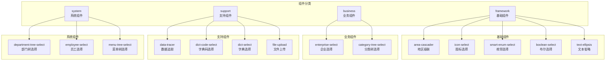
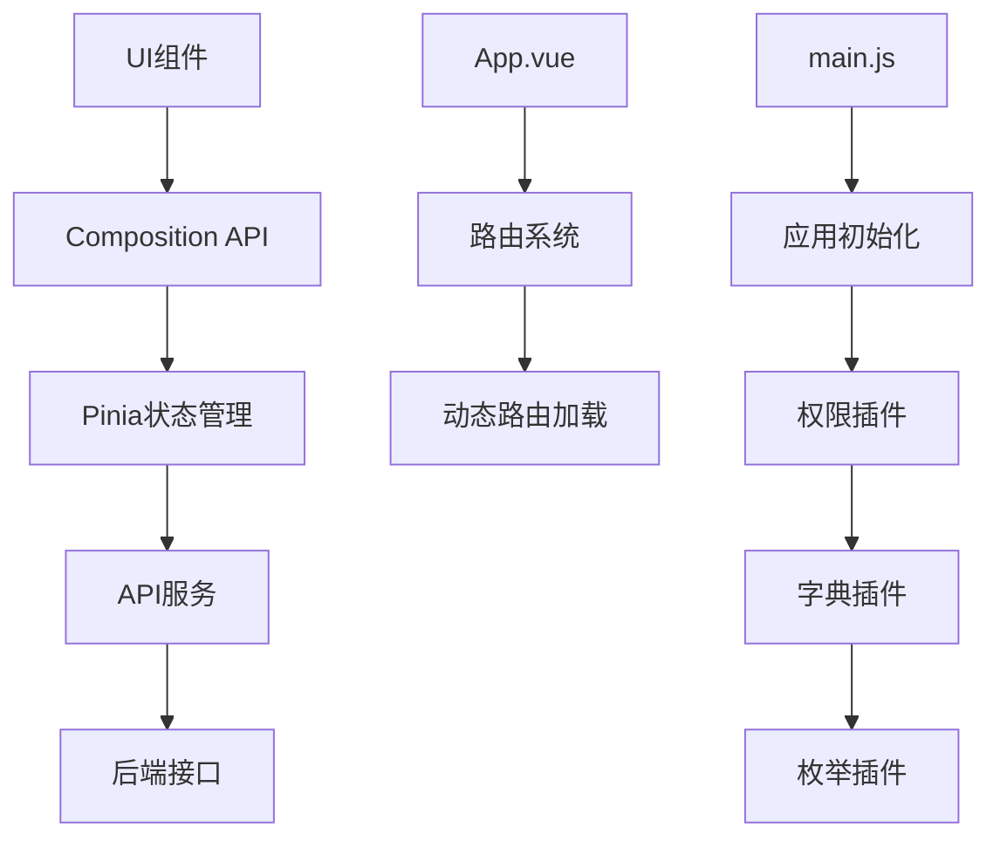

# 组件架构

<cite>
**本文档引用文件**  
- [main.js](file://smart-admin-web-javascript/src/main.js)
- [package.json](file://smart-admin-web-javascript/package.json)
- [前端组件开发规范.md](file://documentation/01-核心规范/前端组件开发规范.md)
- [area-cascader/index.vue](file://smart-admin-web-javascript/src/components/framework/area-cascader/index.vue)
- [icon-select/index.vue](file://smart-admin-web-javascript/src/components/framework/icon-select/index.vue)
- [data-tracer/index.vue](file://smart-admin-web-javascript/src/components/support/data-tracer/index.vue)
- [dict-code-select/index.vue](file://smart-admin-web-javascript/src/components/support/dict-code-select/index.vue)
- [dict-select/index.vue](file://smart-admin-web-javascript/src/components/support/dict-select/index.vue)
- [smart-enum-select/index.vue](file://smart-admin-web-javascript/src/components/framework/smart-enum-select/index.vue)
- [boolean-select/index.vue](file://smart-admin-web-javascript/src/components/framework/boolean-select/index.vue)
- [enterprise-select/index.vue](file://smart-admin-web-javascript/src/components/business/oa/enterprise-select/index.vue)
- [department-tree-select/index.vue](file://smart-admin-web-javascript/src/components/system/department-tree-select/index.vue)
- [App.vue](file://smart-admin-web-javascript/src/App.vue)
</cite>

## 目录

1. [引言](#引言)
2. [项目结构](#项目结构)
3. [核心组件](#核心组件)
4. [架构概述](#架构概述)
5. [详细组件分析](#详细组件分析)
6. [依赖分析](#依赖分析)
7. [性能考虑](#性能考虑)
8. [故障排除指南](#故障排除指南)
9. [结论](#结论)

## 引言

本项目是一个基于Vue 3的前端管理系统，采用模块化组件架构设计。系统按照功能划分为基础组件、业务组件、支持组件和系统组件四大类别，遵循统一的开发规范和设计原则。通过分析代码库结构和关键文件，本文档将全面介绍组件体系的组织方式、开发规范、高阶组件实现原理以及组件复用策略。

## 项目结构

项目采用清晰的分层架构，组件按照功能类型进行分类管理。主要目录结构如下：



**Diagram sources**
- [smart-admin-web-javascript/src/components](file://smart-admin-web-javascript/src/components)

**Section sources**
- [smart-admin-web-javascript/src/components](file://smart-admin-web-javascript/src/components)

## 核心组件

系统的核心组件体系分为四个主要类别：基础组件（framework）、业务组件（business）、支持组件（support）和系统组件（system）。每个类别都有明确的职责划分和设计原则。

基础组件提供通用的UI元素和交互功能，如地区级联选择器、图标选择器等。业务组件针对特定业务场景提供封装，如企业选择器。支持组件提供跨领域的辅助功能，如数据追踪和字典选择。系统组件则专注于系统级功能，如部门和员工的选择器。

这些组件通过统一的开发规范进行管理，确保代码质量和一致性。组件之间通过props和events进行通信，保持松耦合的设计。

**Section sources**
- [smart-admin-web-javascript/src/components](file://smart-admin-web-javascript/src/components)
- [documentation/01-核心规范/前端组件开发规范.md](file://documentation/01-核心规范/前端组件开发规范.md)

## 架构概述

系统采用Vue 3的Composition API进行开发，结合Pinia进行状态管理。整体架构遵循分层设计原则，从UI层到数据层有清晰的边界。



**Diagram sources**
- [smart-admin-web-javascript/src/main.js](file://smart-admin-web-javascript/src/main.js)
- [smart-admin-web-javascript/src/App.vue](file://smart-admin-web-javascript/src/App.vue)

**Section sources**
- [smart-admin-web-javascript/src/main.js](file://smart-admin-web-javascript/src/main.js)
- [smart-admin-web-javascript/src/App.vue](file://smart-admin-web-javascript/src/App.vue)

## 详细组件分析

### 基础组件分析

#### 地区级联选择器
```mermaid
classDiagram
class AreaCascader {
+String type
+Array value
+String width
+String placeholder
+String size
+Boolean disabled
-Array areaOptionData
-Array areaValue
+handleChange(value, selectedOptions)
+filter(inputValue, path)
}
AreaCascader --> "1" "1" Cascader : 使用
AreaCascader --> "1" "1" ProvinceCityDistrict : 数据源
AreaCascader --> "1" "1" ProvinceCity : 数据源
```

**Diagram sources**
- [smart-admin-web-javascript/src/components/framework/area-cascader/index.vue](file://smart-admin-web-javascript/src/components/framework/area-cascader/index.vue)

#### 图标选择器
```mermaid
classDiagram
class IconSelect {
+String iconStyle
+String searchValue
+Boolean visible
+Number showMoreIndex
-Array outlinedIconArray
-Array filledIconArray
-Array twoToneIconArray
+updateSelectIconArray()
+showMore()
+handleClick(icon)
}
IconSelect --> "1" "1" Popover : 使用
IconSelect --> "1" "1" RadioGroup : 使用
IconSelect --> "1" "1" InputSearch : 使用
IconSelect --> "1" "1" AntDesignIcons : 图标库
```

**Diagram sources**
- [smart-admin-web-javascript/src/components/framework/icon-select/index.vue](file://smart-admin-web-javascript/src/components/framework/icon-select/index.vue)

#### 枚举选择器
```mermaid
classDiagram
class SmartEnumSelect {
+String enumName
+String value
+String width
+String placeholder
+String size
+Boolean disabled
-Array disabledOption
-Array hiddenOption
-Array valueDescList
+handleChange(value)
}
SmartEnumSelect --> "1" "1" Select : 使用
SmartEnumSelect --> "1" "1" SmartEnumPlugin : 依赖
```

**Diagram sources**
- [smart-admin-web-javascript/src/components/framework/smart-enum-select/index.vue](file://smart-admin-web-javascript/src/components/framework/smart-enum-select/index.vue)

#### 布尔选择器
```mermaid
classDiagram
class BooleanSelect {
+Boolean value
+Number width
+String placeholder
+String size
+Boolean disabled
-Number selectValue
+convertBoolean2number(value)
+handleChange(value)
}
BooleanSelect --> "1" "1" Select : 使用
BooleanSelect --> "1" "1" FLAG_NUMBER_ENUM : 枚举依赖
```

**Diagram sources**
- [smart-admin-web-javascript/src/components/framework/boolean-select/index.vue](file://smart-admin-web-javascript/src/components/framework/boolean-select/index.vue)

### 支持组件分析

#### 数据追踪组件
```mermaid
classDiagram
class DataTracer {
+Number dataId
+Number type
-Object queryForm
-Array tableData
-Number total
-Boolean tableLoading
-Boolean visibleDiff
-String prettyHtml
+onSearch()
+onReload()
+ajaxQuery()
+showDetail(record)
}
DataTracer --> "1" "1" Form : 使用
DataTracer --> "1" "1" Card : 使用
DataTracer --> "1" "1" Pagination : 使用
DataTracer --> "1" "1" Modal : 使用
DataTracer --> "1" "1" DataTracerTimeline : 子组件
DataTracer --> "1" "1" dataTracerApi : API依赖
DataTracer --> "1" "1" Diff : 差异对比
DataTracer --> "1" "1" Diff2Html : HTML渲染
```

**Diagram sources**
- [smart-admin-web-javascript/src/components/support/data-tracer/index.vue](file://smart-admin-web-javascript/src/components/support/data-tracer/index.vue)

#### 字典选择组件
```mermaid
classDiagram
class DictCodeSelect {
+String value
+String placeholder
+String width
+String size
+Number disabled
-Array dictList
-String selectValue
+onChange(value)
}
DictCodeSelect --> "1" "1" Select : 使用
DictCodeSelect --> "1" "1" dictApi : API依赖
DictCodeSelect --> "1" "1" DictStore : 状态管理
```

**Diagram sources**
- [smart-admin-web-javascript/src/components/support/dict-code-select/index.vue](file://smart-admin-web-javascript/src/components/support/dict-code-select/index.vue)

#### 字典值选择组件
```mermaid
classDiagram
class DictSelect {
+String dictCode
+String value
+String mode
+String width
+String placeholder
+String size
+Boolean disabled
-Array disabledOption
-Array hiddenOption
-Array dictDataList
-String selectValue
+onChange(value)
}
DictSelect --> "1" "1" Select : 使用
DictSelect --> "1" "1" DictStore : 状态管理
```

**Diagram sources**
- [smart-admin-web-javascript/src/components/support/dict-select/index.vue](file://smart-admin-web-javascript/src/components/support/dict-select/index.vue)

### 业务组件分析

#### 企业选择器
```mermaid
classDiagram
class EnterpriseSelect {
+Number value
+String width
+String placeholder
+String size
+Boolean disabled
+Boolean multiple
+Number type
-Array dataList
-String selectValue
+handleChange(value)
+queryData()
}
EnterpriseSelect --> "1" "1" Select : 使用
EnterpriseSelect --> "1" "1" enterpriseApi : API依赖
```

**Diagram sources**
- [smart-admin-web-javascript/src/components/business/oa/enterprise-select/index.vue](file://smart-admin-web-javascript/src/components/business/oa/enterprise-select/index.vue)

### 系统组件分析

#### 部门树选择器
```mermaid
classDiagram
class DepartmentTreeSelect {
+Number value
+Boolean multiple
-Array treeData
+onChange(e)
+queryDepartmentTree()
}
DepartmentTreeSelect --> "1" "1" TreeSelect : 使用
DepartmentTreeSelect --> "1" "1" departmentApi : API依赖
```

**Diagram sources**
- [smart-admin-web-javascript/src/components/system/department-tree-select/index.vue](file://smart-admin-web-javascript/src/components/system/department-tree-select/index.vue)

**Section sources**
- [smart-admin-web-javascript/src/components/framework/area-cascader/index.vue](file://smart-admin-web-javascript/src/components/framework/area-cascader/index.vue)
- [smart-admin-web-javascript/src/components/framework/icon-select/index.vue](file://smart-admin-web-javascript/src/components/framework/icon-select/index.vue)
- [smart-admin-web-javascript/src/components/framework/smart-enum-select/index.vue](file://smart-admin-web-javascript/src/components/framework/smart-enum-select/index.vue)
- [smart-admin-web-javascript/src/components/framework/boolean-select/index.vue](file://smart-admin-web-javascript/src/components/framework/boolean-select/index.vue)
- [smart-admin-web-javascript/src/components/support/data-tracer/index.vue](file://smart-admin-web-javascript/src/components/support/data-tracer/index.vue)
- [smart-admin-web-javascript/src/components/support/dict-code-select/index.vue](file://smart-admin-web-javascript/src/components/support/dict-code-select/index.vue)
- [smart-admin-web-javascript/src/components/support/dict-select/index.vue](file://smart-admin-web-javascript/src/components/support/dict-select/index.vue)
- [smart-admin-web-javascript/src/components/business/oa/enterprise-select/index.vue](file://smart-admin-web-javascript/src/components/business/oa/enterprise-select/index.vue)
- [smart-admin-web-javascript/src/components/system/department-tree-select/index.vue](file://smart-admin-web-javascript/src/components/system/department-tree-select/index.vue)

## 依赖分析

系统依赖关系清晰，通过package.json文件管理第三方库依赖。主要依赖包括：

```mermaid
graph TD
A[smart-admin-web-javascript] --> B[Vue 3.4.27]
A --> C[Ant Design Vue 4.2.5]
A --> D[Pinia 2.1.7]
A --> E[Vue Router 4.3.2]
A --> F[Vue I18n 9.13.1]
A --> G[axios 1.6.8]
A --> H[dayjs 1.11.13]
A --> I[lodash 4.17.21]
A --> J[echarts 5.4.3]
A --> K[@ant-design/icons-vue 7.0.1]
A --> L[vue3-json-viewer 2.3.1]
A --> M[sortablejs 1.15.0]
A --> N[uuid 11.1.0]
B --> O[Composition API]
C --> P[Ant Design Components]
D --> Q[State Management]
E --> R[Routing]
F --> S[Internationalization]
G --> T[HTTP Client]
H --> U[Date Processing]
I --> V[Utility Functions]
J --> W[Charts]
K --> X[Icons]
L --> Y[JSON Viewer]
M --> Z[Drag and Drop]
N --> AA[UUID Generation]
```

**Diagram sources**
- [smart-admin-web-javascript/package.json](file://smart-admin-web-javascript/package.json)

**Section sources**
- [smart-admin-web-javascript/package.json](file://smart-admin-web-javascript/package.json)

## 性能考虑

在组件设计和实现中，考虑了多个性能优化方面：

1. **懒加载**：通过动态导入和路由懒加载，减少初始加载时间。
2. **虚拟滚动**：对于大数据量的列表组件，使用虚拟滚动技术。
3. **缓存机制**：字典数据和枚举数据在应用初始化时加载并缓存。
4. **事件优化**：使用事件委托和防抖技术优化高频事件处理。
5. **组件复用**：通过高阶组件和mixin实现功能复用，减少代码重复。

这些优化措施确保了系统在处理大量数据和复杂交互时仍能保持良好的响应性能。

## 故障排除指南

当遇到组件相关问题时，可以按照以下步骤进行排查：

1. **检查props传递**：确保父组件正确传递了所有必需的props。
2. **验证事件绑定**：检查事件监听器是否正确绑定，emit事件是否按预期触发。
3. **查看依赖注入**：确认插件和全局属性是否正确注入。
4. **检查API调用**：验证API接口是否正常返回数据。
5. **审查样式冲突**：检查scoped样式是否被意外覆盖。

对于特定组件的问题，可以参考相应的文档和示例代码。

**Section sources**
- [documentation/01-核心规范/前端组件开发规范.md](file://documentation/01-核心规范/前端组件开发规范.md)

## 结论

本项目构建了一个完整且可扩展的前端组件架构体系。通过将组件分为基础、业务、支持和系统四类，实现了清晰的职责划分和良好的可维护性。组件开发遵循统一的规范，确保了代码质量和一致性。高阶组件如数据追踪和字典选择器提供了强大的功能支持。整体架构设计合理，性能优化到位，为系统的长期发展奠定了坚实的基础。