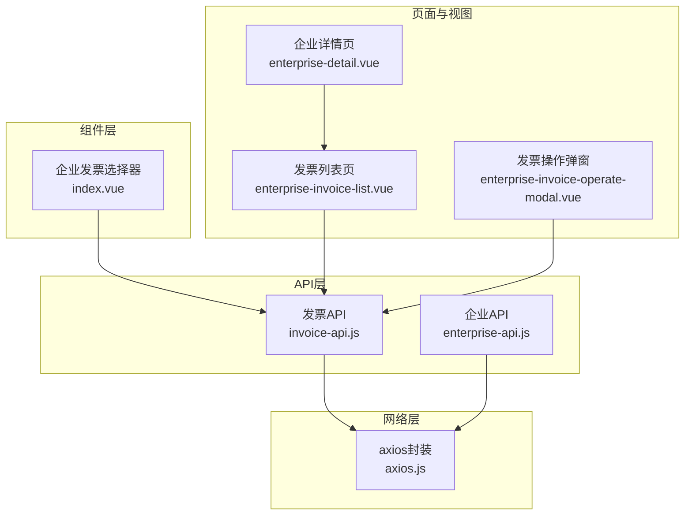
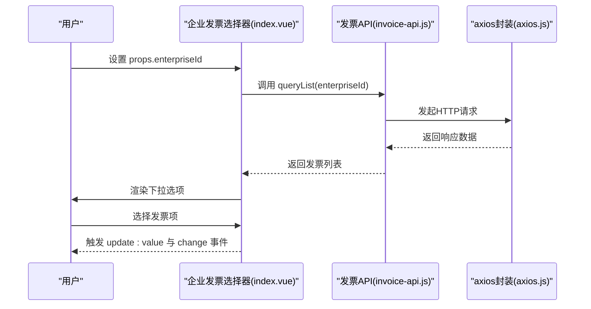
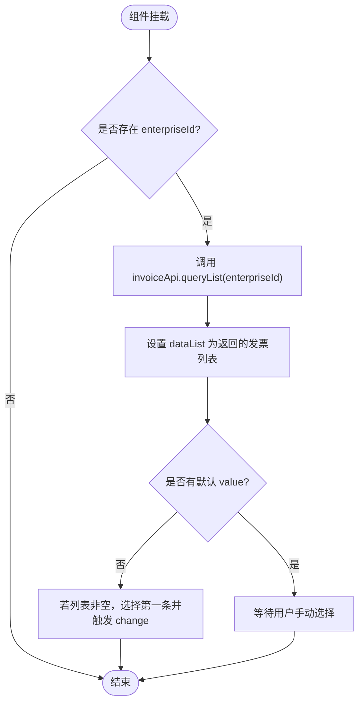
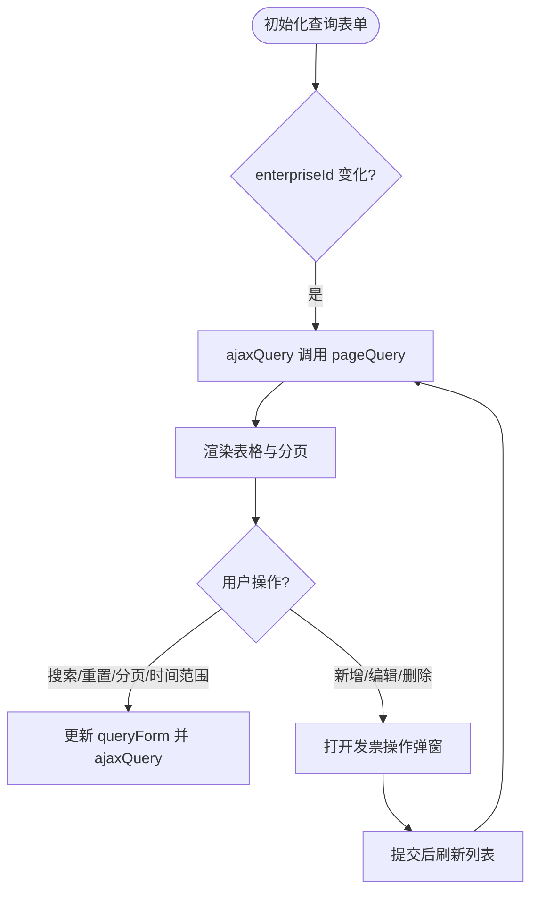
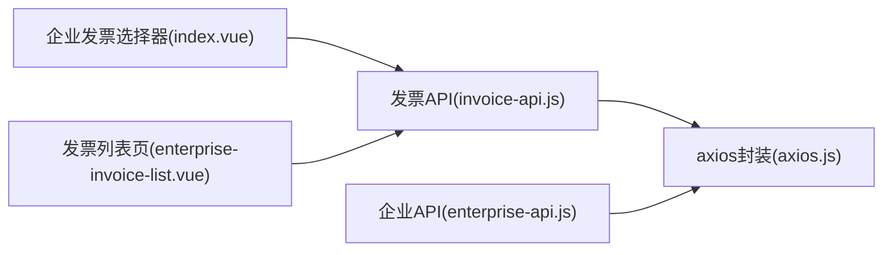

# 企业发票选择器

<cite>
**本文引用的文件**
- [index.vue](file://smart-admin-web-javascript/src/components/business/oa/enterprise-invoice-select/index.vue)
- [invoice-api.js](file://smart-admin-web-javascript/src/api/business/oa/invoice-api.js)
- [enterprise-api.js](file://smart-admin-web-javascript/src/api/business/oa/enterprise-api.js)
- [enterprise-invoice-list.vue](file://smart-admin-web-javascript/src/views/business/oa/enterprise/components/enterprise-invoice-list.vue)
- [enterprise-invoice-operate-modal.vue](file://smart-admin-web-javascript/src/views/business/oa/enterprise/components/enterprise-invoice-operate-modal.vue)
- [enterprise-detail.vue](file://smart-admin-web-javascript/src/views/business/oa/enterprise/enterprise-detail.vue)
- [axios.js](file://smart-admin-web-javascript/src/lib/axios.js)
</cite>

## 目录
1. [简介](#简介)
2. [项目结构](#项目结构)
3. [核心组件](#核心组件)
4. [架构总览](#架构总览)
5. [详细组件分析](#详细组件分析)
6. [依赖关系分析](#依赖关系分析)
7. [性能考量](#性能考量)
8. [故障排查指南](#故障排查指南)
9. [结论](#结论)
10. [附录](#附录)

## 简介
本文件面向“企业发票选择器”组件，围绕其在财务对账场景下的应用展开，重点说明以下内容：
- 如何结合 enterprise-api.js 与 invoice-api.js 的接口，实现企业与发票的联合查询；
- 组件内部的多条件过滤逻辑（当前实现聚焦于企业维度的发票列表联动，以及开票日期范围的查询能力）；
- 组件如何展示发票的关键信息（如开票抬头、银行账号、状态等），并说明金额字段的展示与脱敏策略；
- 在财务对账场景中的使用示例，包括通过组件 props 配置默认筛选条件与只读模式的建议实践。

## 项目结构
该功能涉及前端组件与 API 层的协作，主要分布在如下位置：
- 组件层：企业发票选择器组件位于 components/business/oa/enterprise-invoice-select/index.vue
- API 层：发票相关接口定义于 api/business/oa/invoice-api.js；企业相关接口定义于 api/business/oa/enterprise-api.js
- 页面与视图：企业详情页 enterprise-detail.vue 引入发票列表视图 enterprise-invoice-list.vue；发票列表页内包含发票操作弹窗 enterprise-invoice-operate-modal.vue
- 网络请求封装：lib/axios.js 提供统一的请求与响应拦截器

图表来源
- [index.vue](file://smart-admin-web-javascript/src/components/business/oa/enterprise-invoice-select/index.vue#L1-L108)
- [invoice-api.js](file://smart-admin-web-javascript/src/api/business/oa/invoice-api.js#L1-L45)
- [enterprise-api.js](file://smart-admin-web-javascript/src/api/business/oa/enterprise-api.js#L1-L70)
- [enterprise-invoice-list.vue](file://smart-admin-web-javascript/src/views/business/oa/enterprise/components/enterprise-invoice-list.vue#L1-L249)
- [enterprise-invoice-operate-modal.vue](file://smart-admin-web-javascript/src/views/business/oa/enterprise/components/enterprise-invoice-operate-modal.vue#L1-L96)
- [enterprise-detail.vue](file://smart-admin-web-javascript/src/views/business/oa/enterprise/enterprise-detail.vue#L1-L129)
- [axios.js](file://smart-admin-web-javascript/src/lib/axios.js#L1-L200)

章节来源
- [index.vue](file://smart-admin-web-javascript/src/components/business/oa/enterprise-invoice-select/index.vue#L1-L108)
- [invoice-api.js](file://smart-admin-web-javascript/src/api/business/oa/invoice-api.js#L1-L45)
- [enterprise-api.js](file://smart-admin-web-javascript/src/api/business/oa/enterprise-api.js#L1-L70)
- [enterprise-invoice-list.vue](file://smart-admin-web-javascript/src/views/business/oa/enterprise/components/enterprise-invoice-list.vue#L1-L249)
- [enterprise-invoice-operate-modal.vue](file://smart-admin-web-javascript/src/views/business/oa/enterprise/components/enterprise-invoice-operate-modal.vue#L1-L96)
- [enterprise-detail.vue](file://smart-admin-web-javascript/src/views/business/oa/enterprise/enterprise-detail.vue#L1-L129)
- [axios.js](file://smart-admin-web-javascript/src/lib/axios.js#L1-L200)

## 核心组件
- 企业发票选择器（index.vue）：基于 antd 的下拉选择组件，支持单选/多选、宽度、尺寸、占位符、禁用等基础属性；当传入 enterpriseId 时，自动加载该企业下的发票列表作为选项；提供 update:value 与 change 两个事件回调。
- 发票API（invoice-api.js）：提供发票列表查询、分页查询、详情、新增、更新、删除等接口；其中 queryList 接口用于按企业ID获取发票列表。
- 企业API（enterprise-api.js）：提供企业列表查询、详情、分页查询、导出等接口；与发票选择器配合，通常先选择企业，再联动加载发票列表。
- 发票列表页（enterprise-invoice-list.vue）：提供发票的分页查询、关键字搜索、创建时间范围筛选、新增/编辑/删除等操作入口。
- 发票操作弹窗（enterprise-invoice-operate-modal.vue）：用于发票信息的新增与编辑。
- 企业详情页（enterprise-detail.vue）：在企业详情页中切换到“发票信息”标签，展示发票列表视图。
- axios 封装（axios.js）：统一请求与响应拦截，处理 token、加密数据、错误提示等。

章节来源
- [index.vue](file://smart-admin-web-javascript/src/components/business/oa/enterprise-invoice-select/index.vue#L1-L108)
- [invoice-api.js](file://smart-admin-web-javascript/src/api/business/oa/invoice-api.js#L1-L45)
- [enterprise-api.js](file://smart-admin-web-javascript/src/api/business/oa/enterprise-api.js#L1-L70)
- [enterprise-invoice-list.vue](file://smart-admin-web-javascript/src/views/business/oa/enterprise/components/enterprise-invoice-list.vue#L1-L249)
- [enterprise-invoice-operate-modal.vue](file://smart-admin-web-javascript/src/views/business/oa/enterprise/components/enterprise-invoice-operate-modal.vue#L1-L96)
- [enterprise-detail.vue](file://smart-admin-web-javascript/src/views/business/oa/enterprise/enterprise-detail.vue#L1-L129)
- [axios.js](file://smart-admin-web-javascript/src/lib/axios.js#L1-L200)

## 架构总览
企业发票选择器通过 props.enterpriseId 与发票 API 的 queryList 接口联动，实现“企业 -> 发票”的单向数据流。在财务对账场景中，通常先选择企业，再从发票选择器中选择一个或多个发票，从而形成对账所需的“企业+发票”组合。

图表来源
- [index.vue](file://smart-admin-web-javascript/src/components/business/oa/enterprise-invoice-select/index.vue#L1-L108)
- [invoice-api.js](file://smart-admin-web-javascript/src/api/business/oa/invoice-api.js#L1-L45)
- [axios.js](file://smart-admin-web-javascript/src/lib/axios.js#L1-L200)

## 详细组件分析

### 企业发票选择器（index.vue）
- 组件职责
  - 以企业ID为条件，调用发票API加载发票列表；
  - 提供单选/多选模式，支持宽度、尺寸、占位符、禁用等属性；
  - 当首次无默认值且存在数据时，自动选择第一条发票并触发 change 事件。
- 关键交互
  - watch(props.enterpriseId)：企业ID变化时重新加载发票列表；
  - handleChange：对外抛出 update:value 与 change 事件，便于父组件接收选中值及发票对象。
- 数据来源
  - 通过 invoiceApi.queryList(enterpriseId) 获取发票列表；
  - 该接口返回的数据结构包含发票标识、开票抬头等字段，组件据此渲染下拉选项。

图表来源
- [index.vue](file://smart-admin-web-javascript/src/components/business/oa/enterprise-invoice-select/index.vue#L1-L108)
- [invoice-api.js](file://smart-admin-web-javascript/src/api/business/oa/invoice-api.js#L1-L45)

章节来源
- [index.vue](file://smart-admin-web-javascript/src/components/business/oa/enterprise-invoice-select/index.vue#L1-L108)
- [invoice-api.js](file://smart-admin-web-javascript/src/api/business/oa/invoice-api.js#L1-L45)

### 发票列表页（enterprise-invoice-list.vue）
- 多条件过滤
  - 关键字搜索：支持对开票抬头、银行账号、创建人等字段进行模糊检索；
  - 创建时间范围：通过日期选择器设置 startTime 与 endTime，参与分页查询；
  - 企业维度：通过 props.enterpriseId 限定查询范围。
- 分页与加载
  - 使用分页参数 pageNum、pageSize 控制分页；
  - ajaxQuery 调用 invoiceApi.pageQuery(queryForm) 获取列表与总数。
- 操作入口
  - 新增/编辑/删除：通过弹窗组件完成发票信息维护；
  - 权限控制：根据按钮权限动态显示操作按钮。

图表来源
- [enterprise-invoice-list.vue](file://smart-admin-web-javascript/src/views/business/oa/enterprise/components/enterprise-invoice-list.vue#L1-L249)
- [invoice-api.js](file://smart-admin-web-javascript/src/api/business/oa/invoice-api.js#L1-L45)

章节来源
- [enterprise-invoice-list.vue](file://smart-admin-web-javascript/src/views/business/oa/enterprise/components/enterprise-invoice-list.vue#L1-L249)
- [invoice-api.js](file://smart-admin-web-javascript/src/api/business/oa/invoice-api.js#L1-L45)

### 发票操作弹窗（enterprise-invoice-operate-modal.vue）
- 表单字段
  - 开票抬头、纳税人识别号、银行账号、开户行、启用状态、备注等；
  - 提交时携带 enterpriseId，确保发票归属企业正确。
- 交互流程
  - 打开弹窗时根据是否传入 rowData 决定编辑或新增；
  - 提交成功后触发父组件 reloadList，刷新发票列表。

章节来源
- [enterprise-invoice-operate-modal.vue](file://smart-admin-web-javascript/src/views/business/oa/enterprise/components/enterprise-invoice-operate-modal.vue#L1-L96)

### 企业详情页（enterprise-detail.vue）
- 在企业详情页中，切换到“发票信息”标签，即可看到发票列表视图；
- 该页面通过路由参数传递 enterpriseId，驱动发票列表的查询与渲染。

章节来源
- [enterprise-detail.vue](file://smart-admin-web-javascript/src/views/business/oa/enterprise/enterprise-detail.vue#L1-L129)

## 依赖关系分析
- 组件与 API 的耦合
  - 企业发票选择器直接依赖发票API的 queryList 接口；
  - 发票列表页依赖发票API的 pageQuery 接口；
  - 两者均通过 axios 封装发起请求，统一处理响应与错误。
- 企业与发票的关联
  - 企业API提供企业列表/详情等能力，发票API提供发票列表/分页查询等能力；
  - 通过 enterpriseId 实现“企业 -> 发票”的单向关联。

图表来源
- [index.vue](file://smart-admin-web-javascript/src/components/business/oa/enterprise-invoice-select/index.vue#L1-L108)
- [enterprise-invoice-list.vue](file://smart-admin-web-javascript/src/views/business/oa/enterprise/components/enterprise-invoice-list.vue#L1-L249)
- [invoice-api.js](file://smart-admin-web-javascript/src/api/business/oa/invoice-api.js#L1-L45)
- [enterprise-api.js](file://smart-admin-web-javascript/src/api/business/oa/enterprise-api.js#L1-L70)
- [axios.js](file://smart-admin-web-javascript/src/lib/axios.js#L1-L200)

章节来源
- [index.vue](file://smart-admin-web-javascript/src/components/business/oa/enterprise-invoice-select/index.vue#L1-L108)
- [enterprise-invoice-list.vue](file://smart-admin-web-javascript/src/views/business/oa/enterprise/components/enterprise-invoice-list.vue#L1-L249)
- [invoice-api.js](file://smart-admin-web-javascript/src/api/business/oa/invoice-api.js#L1-L45)
- [enterprise-api.js](file://smart-admin-web-javascript/src/api/business/oa/enterprise-api.js#L1-L70)
- [axios.js](file://smart-admin-web-javascript/src/lib/axios.js#L1-L200)

## 性能考量
- 组件加载策略
  - 仅在 enterpriseId 存在时才发起请求，避免空请求；
  - 首次无默认值时自动选择第一条，减少用户操作步骤。
- 列表查询优化
  - 发票列表页采用分页查询，避免一次性加载大量数据；
  - 通过关键字与时间范围筛选，缩小查询集，提升响应速度。
- 网络层优化
  - axios 封装统一处理 token 注入、响应校验与错误提示，减少重复逻辑。

章节来源
- [index.vue](file://smart-admin-web-javascript/src/components/business/oa/enterprise-invoice-select/index.vue#L1-L108)
- [enterprise-invoice-list.vue](file://smart-admin-web-javascript/src/views/business/oa/enterprise/components/enterprise-invoice-list.vue#L1-L249)
- [axios.js](file://smart-admin-web-javascript/src/lib/axios.js#L1-L200)

## 故障排查指南
- 无法加载发票列表
  - 检查 props.enterpriseId 是否传入；
  - 确认网络请求是否成功，查看 axios 响应拦截器中的错误提示。
- 选择器无选项
  - 确认企业下是否存在发票数据；
  - 若首次无默认值，组件会自动选择第一条，若列表为空则不会触发 change。
- 发票列表查询异常
  - 检查关键字与时间范围参数是否正确；
  - 确认分页参数 pageNum、pageSize 是否合理。

章节来源
- [index.vue](file://smart-admin-web-javascript/src/components/business/oa/enterprise-invoice-select/index.vue#L1-L108)
- [enterprise-invoice-list.vue](file://smart-admin-web-javascript/src/views/business/oa/enterprise/components/enterprise-invoice-list.vue#L1-L249)
- [axios.js](file://smart-admin-web-javascript/src/lib/axios.js#L1-L200)

## 结论
企业发票选择器通过企业ID与发票API的 queryList 接口实现“企业 -> 发票”的快速联动，满足财务对账场景下“企业+发票”的选择需求。当前组件侧重企业维度的发票列表联动与基础展示，发票状态筛选与金额格式化/脱敏在现有代码中未直接体现。建议在后续迭代中：
- 在发票列表页增加发票状态筛选（如已开票/未开票）；
- 在金额字段展示时增加格式化与脱敏策略；
- 在财务对账场景中，可通过 props 配置默认 enterpriseId 与只读模式，提升用户体验与安全性。

[本节不直接分析具体文件，故无章节来源]

## 附录

### 财务对账场景使用示例（建议实践）
- 默认筛选条件
  - 在对账页面初始化时，通过 props.enterpriseId 固定企业，使发票选择器默认加载该企业的发票列表；
  - 若需限制发票时间范围，可在发票列表页设置 startTime/endTime 参数，或在组件外部通过 props 透传筛选条件。
- 只读模式
  - 当仅用于展示与核对时，可将组件设置为 disabled，避免误操作；
  - 对金额字段的展示建议采用格式化与脱敏策略（例如仅展示部分数字，其余用星号替代），并在权限允许范围内提供明文查看入口。

[本节为概念性说明，不直接分析具体文件，故无章节来源]