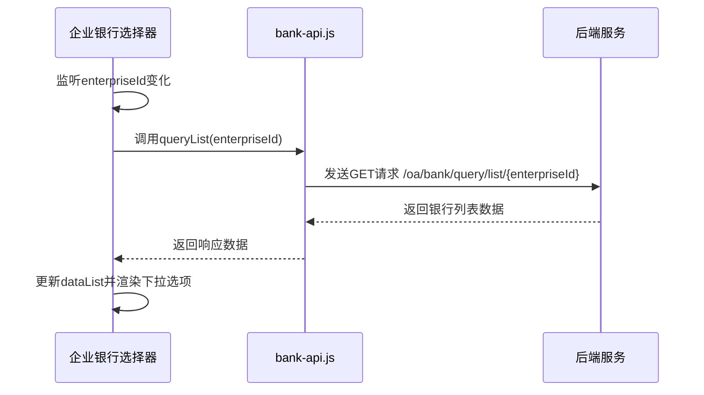
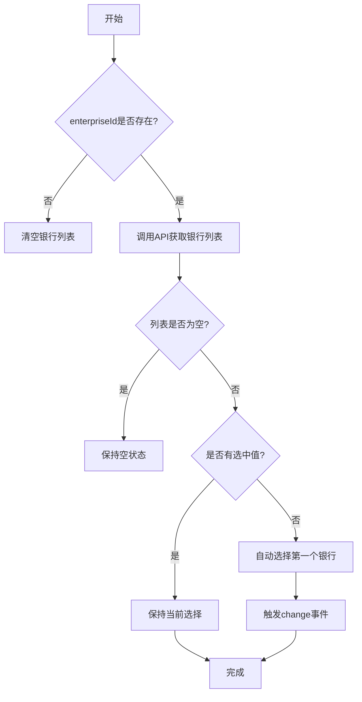
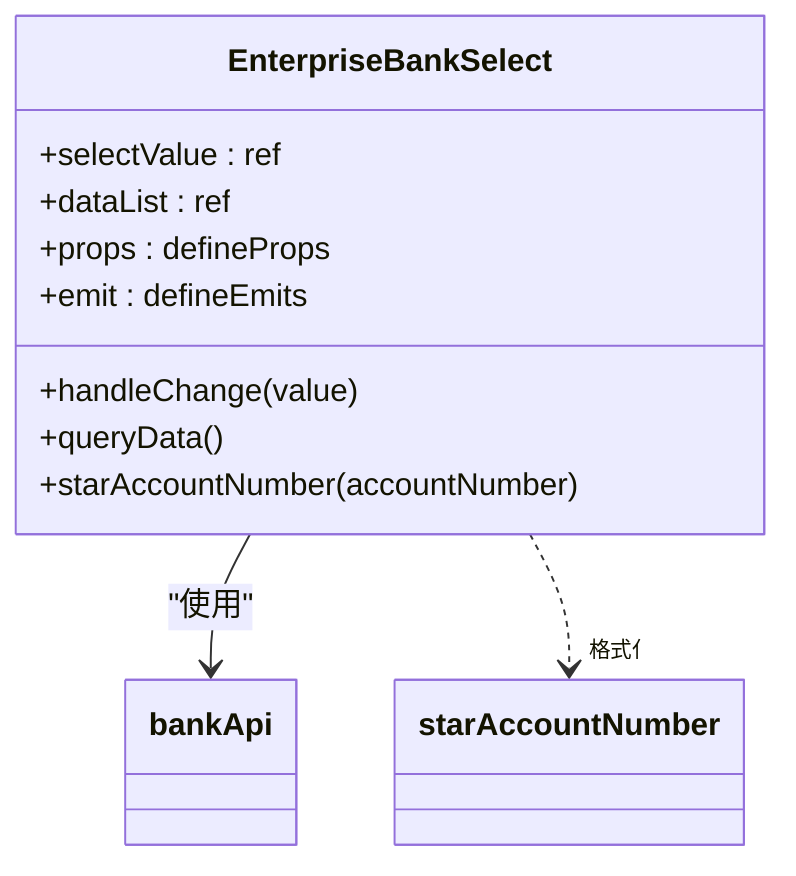

# 企业银行选择器

<cite>
**本文档引用的文件**   
- [index.vue](file://smart-admin-web-javascript\src\components\business\oa\enterprise-bank-select\index.vue)
- [bank-api.js](file://smart-admin-web-javascript\src\api\business\oa\bank-api.js)
- [enterprise-api.js](file://smart-admin-web-javascript\src\api\business\oa\enterprise-api.js)
- [enterprise-bank-operate-modal.vue](file://smart-admin-web-javascript\src\views\business\oa\enterprise\components\enterprise-bank-operate-modal.vue)
- [enterprise-bank-list.vue](file://smart-admin-web-javascript\src\views\business\oa\enterprise\components\enterprise-bank-list.vue)
</cite>

## 目录
1. [简介](#简介)
2. [核心功能](#核心功能)
3. [状态管理机制](#状态管理机制)
4. [数据格式化显示](#数据格式化显示)
5. [使用示例](#使用示例)
6. [错误边界处理](#错误边界处理)

## 简介
企业银行选择器是一个基于Vue 3的可复用组件，用于实现企业与其关联银行账户的级联选择功能。该组件通过监听企业ID的变化，动态加载对应的银行列表，并提供了完善的状态管理和数据格式化功能。

**Section sources**
- [index.vue](file://smart-admin-web-javascript\src\components\business\oa\enterprise-bank-select\index.vue)

## 核心功能
企业银行选择器的核心功能是实现基于企业ID的级联选择。组件通过`enterpriseId`属性接收企业标识，并在该值变化时自动调用后端API获取关联的银行列表。

组件通过`watch`监听器监控`enterpriseId`属性的变化，当企业ID更新时，会触发`queryData`方法，该方法调用`bank-api.js`中的`getBankListByEnterpriseId`接口（在代码中为`queryList`方法）来获取指定企业的银行列表。

**Diagram sources**
- [index.vue](file://smart-admin-web-javascript\src\components\business\oa\enterprise-bank-select\index.vue#L74-L78)
- [bank-api.js](file://smart-admin-web-javascript\src\api\business\oa\bank-api.js#L38-L41)

## 状态管理机制
企业银行选择器实现了完善的状态管理机制，确保用户体验的一致性和数据的准确性。

当企业未选择（即`enterpriseId`为空）时，银行选择器会被禁用，防止用户进行无效选择。这通过组件的`disabled`属性实现，该属性可由父组件控制或根据业务逻辑自动设置。

当企业切换时，组件会自动重置选中值。这是通过在`queryData`方法中检查当前值并重置为第一个银行账户来实现的。具体逻辑如下：如果当前没有选中值且银行列表不为空，则自动选择第一个银行账户并触发change事件。

**Diagram sources**
- [index.vue](file://smart-admin-web-javascript\src\components\business\oa\enterprise-bank-select\index.vue#L88-L97)

## 数据格式化显示
企业银行选择器对银行数据进行了格式化显示处理，提升了用户体验和数据安全性。

在下拉选项中，组件不仅显示银行名称，还显示脱敏后的银行账号。账号脱敏通过`starAccountNumber`方法实现，该方法将账号的中间部分替换为星号（**），只保留前三位和后三位数字。对于少于7位的短账号，则不进行脱敏处理。

**Diagram sources**
- [index.vue](file://smart-admin-web-javascript\src\components\business\oa\enterprise-bank-select\index.vue#L100-L106)

## 使用示例
企业银行选择器在银行管理表单中得到了实际应用。在企业银行列表组件中，通过`BankOperateModal`模态框实现银行信息的增删改查操作。

当用户在企业上下文中操作银行信息时，`enterpriseId`作为关键参数传递给银行选择器组件，确保只能选择该企业关联的银行账户。这种设计模式实现了数据的上下文隔离和业务逻辑的清晰分离。

**Diagram sources**
- [enterprise-bank-list.vue](file://smart-admin-web-javascript\src\views\business\oa\enterprise\components\enterprise-bank-list.vue#L85)
- [enterprise-bank-operate-modal.vue](file://smart-admin-web-javascript\src\views\business\oa\enterprise\components\enterprise-bank-operate-modal.vue#L41-L45)

## 错误边界处理
企业银行选择器在设计时考虑了多种边界情况和错误处理：

1. 当`enterpriseId`为空时，组件会直接返回，不进行API调用
2. API调用失败时，错误会被Vue的错误处理机制捕获
3. 空数据状态有明确的UI表现
4. 组件提供了`placeholder`属性用于提示用户操作

这些错误处理机制确保了组件在各种异常情况下的稳定性和用户体验。

**Section sources**
- [index.vue](file://smart-admin-web-javascript\src\components\business\oa\enterprise-bank-select\index.vue#L89-L91)