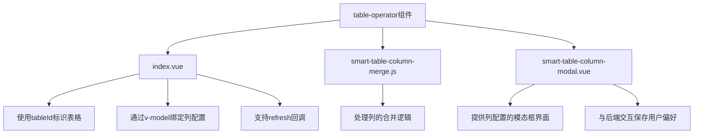
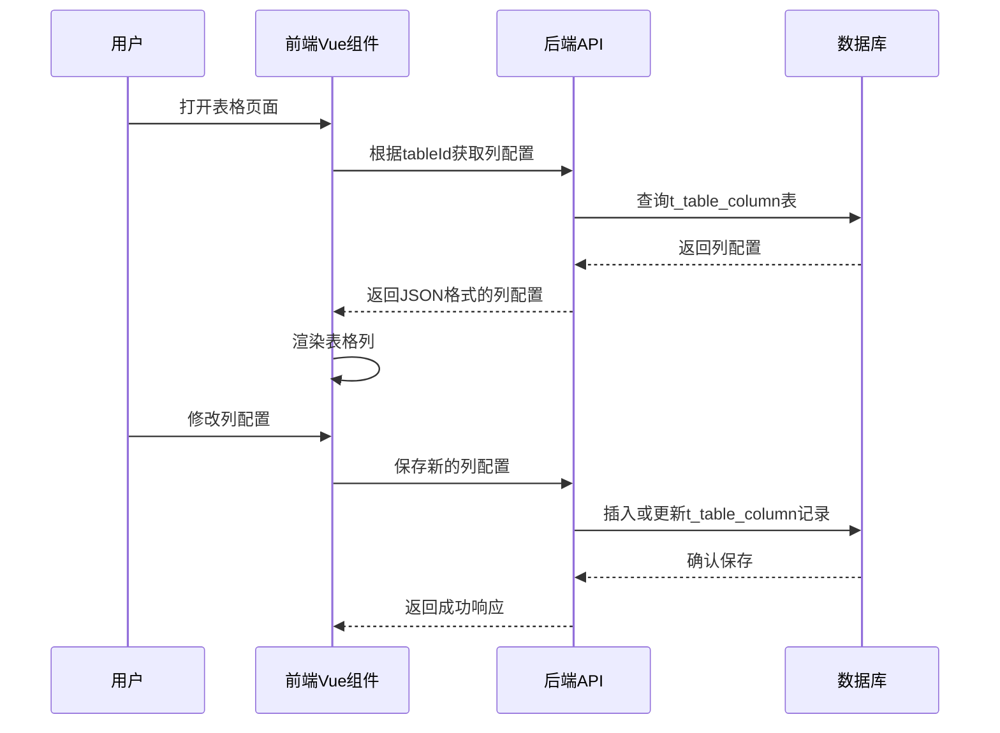
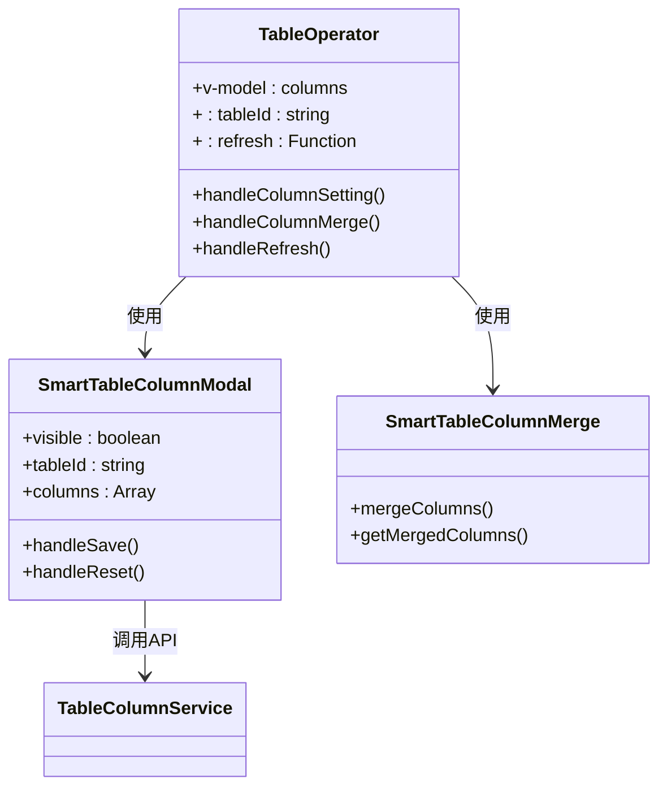
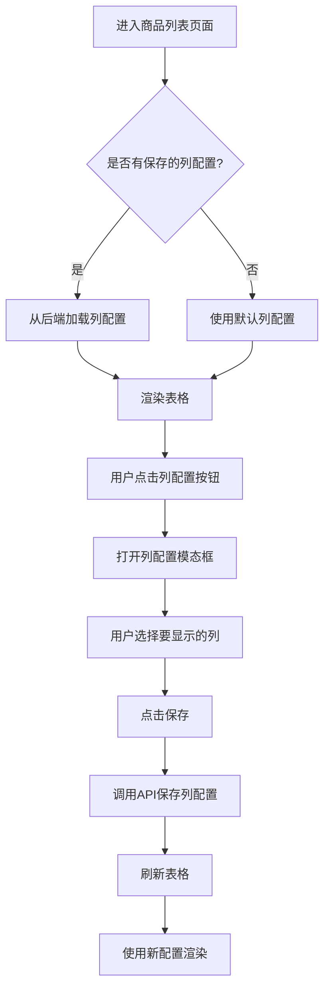
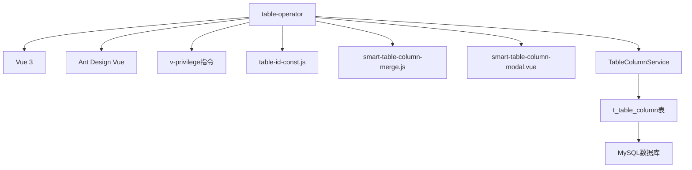

# 操作类组件

<cite>
**本文档中引用的文件**  
- [index.vue](file://smart-admin-web-javascript\src\components\support\table-operator\index.vue)
- [smart-table-column-merge.js](file://smart-admin-web-javascript\src\components\support\table-operator\smart-table-column-merge.js)
- [smart-table-column-modal.vue](file://smart-admin-web-javascript\src\components\support\table-operator\smart-table-column-modal.vue)
- [table-id-const.js](file://smart-admin-web-javascript\src\constants\support\table-id-const.js)
- [config-list.vue](file://smart-admin-web-javascript\src\views\support\config\config-list.vue)
- [goods-list.vue](file://smart-admin-web-javascript\src\views\business\erp\goods\goods-list.vue)
- [enterprise-list.vue](file://smart-admin-web-javascript\src\views\business\oa\enterprise\enterprise-list.vue)
- [TableColumnEntity.java](file://smart-admin-api-java17-springboot3\sa-base\src\main\java\net\lab1024\sa\base\module\support\table\domain\TableColumnEntity.java)
- [TableColumnDao.java](file://smart-admin-api-java17-springboot3\sa-base\src\main\java\net\lab1024\sa\base\module\support\table\TableColumnDao.java)
- [TableColumnService.java](file://smart-admin-api-java17-springboot3\sa-base\src\main\java\net\lab1024\sa\base\module\support\table\TableColumnService.java)
</cite>

## 目录
1. [简介](#简介)
2. [项目结构](#项目结构)
3. [核心组件](#核心组件)
4. [架构概述](#架构概述)
5. [详细组件分析](#详细组件分析)
6. [依赖分析](#依赖分析)
7. [性能考虑](#性能考虑)
8. [故障排除指南](#故障排除指南)
9. [结论](#结论)

## 简介
本文档深入分析了操作类复合组件的设计与实现，重点介绍table-operator组件在表格操作中的核心作用。详细说明其如何集成smart-table-column-merge.js和smart-table-column-modal.vue实现动态列合并与配置功能。阐述组件通过插槽和事件机制实现操作按钮的灵活定制，以及如何与表格数据进行交互。提供在角色管理、菜单管理等场景下的使用示例，展示批量操作、权限控制等复杂业务逻辑的实现方式。解释组件如何通过props配置操作权限、按钮样式和交互行为。

## 项目结构
操作类组件主要位于`smart-admin-web-javascript/src/components/support/table-operator/`目录下，包含核心的Vue组件和辅助JavaScript文件。该组件被广泛应用于系统各个模块的列表页面中，如企业列表、商品列表、配置列表等，实现了统一的表格操作体验。

**图示来源**
- [index.vue](file://smart-admin-web-javascript\src\components\support\table-operator\index.vue)
- [smart-table-column-merge.js](file://smart-admin-web-javascript\src\components\support\table-operator\smart-table-column-merge.js)
- [smart-table-column-modal.vue](file://smart-admin-web-javascript\src\components\support\table-operator\smart-table-column-modal.vue)

**章节来源**
- [index.vue](file://smart-admin-web-javascript\src\components\support\table-operator\index.vue)
- [project_structure](file://project_structure)

## 核心组件
table-operator组件是系统中实现表格高级操作的核心复合组件。它通过封装列配置、列合并、批量操作等功能，为开发者提供了统一且强大的表格操作能力。组件通过`tableId`属性标识不同的表格实例，允许用户为每个表格独立保存列显示偏好。

**章节来源**
- [index.vue](file://smart-admin-web-javascript\src\components\support\table-operator\index.vue)
- [smart-table-column-merge.js](file://smart-admin-web-javascript\src\components\support\table-operator\smart-table-column-merge.js)

## 架构概述
table-operator组件采用前后端协同的架构设计。前端通过Vue组件封装用户界面和交互逻辑，后端通过TableColumnService提供列配置的持久化存储。用户在界面上的列选择操作会被保存到数据库中，下次访问时自动加载个性化配置。

**图示来源**
- [TableColumnService.java](file://smart-admin-api-java17-springboot3\sa-base\src\main\java\net\lab1024\sa\base\module\support\table\TableColumnService.java)
- [TableColumnDao.java](file://smart-admin-api-java17-springboot3\sa-base\src\main\java\net\lab1024\sa\base\module\support\table\TableColumnDao.java)
- [TableColumnEntity.java](file://smart-admin-api-java17-springboot3\sa-base\src\main\java\net\lab1024\sa\base\module\support\table\domain\TableColumnEntity.java)

## 详细组件分析

### table-operator组件分析
table-operator组件作为操作类复合组件的核心，提供了列配置、列合并等高级功能。组件通过`v-model`双向绑定列配置，通过`:tableId`指定表格标识，通过`:refresh`传递刷新回调函数。

#### 组件结构

**图示来源**
- [index.vue](file://smart-admin-web-javascript\src\components\support\table-operator\index.vue)
- [smart-table-column-modal.vue](file://smart-admin-web-javascript\src\components\support\table-operator\smart-table-column-modal.vue)
- [smart-table-column-merge.js](file://smart-admin-web-javascript\src\components\support\table-operator\smart-table-column-merge.js)

#### 使用示例
在商品管理、企业管理和系统配置等场景中，table-operator组件被广泛使用。例如在商品列表中，用户可以自定义显示哪些列，隐藏不常用的列，提高数据查看效率。

**图示来源**
- [goods-list.vue](file://smart-admin-web-javascript\src\views\business\erp\goods\goods-list.vue)
- [enterprise-list.vue](file://smart-admin-web-javascript\src\views\business\oa\enterprise\enterprise-list.vue)
- [config-list.vue](file://smart-admin-web-javascript\src\views\support\config\config-list.vue)

**章节来源**
- [goods-list.vue](file://smart-admin-web-javascript\src\views\business\erp\goods\goods-list.vue)
- [enterprise-list.vue](file://smart-admin-web-javascript\src\views\business\oa\enterprise\enterprise-list.vue)
- [config-list.vue](file://smart-admin-web-javascript\src\views\support\config\config-list.vue)

## 依赖分析
table-operator组件依赖于多个前后端组件和服务。前端依赖Vue框架、Ant Design Vue组件库以及系统的权限指令。后端依赖TableColumnService服务和t_table_column数据库表来持久化用户配置。

**图示来源**
- [table-id-const.js](file://smart-admin-web-javascript\src\constants\support\table-id-const.js)
- [directives\privilege.js](file://smart-admin-web-javascript\src\directives\privilege.js)
- [TableColumnService.java](file://smart-admin-api-java17-springboot3\sa-base\src\main\java\net\lab1024\sa\base\module\support\table\TableColumnService.java)

**章节来源**
- [table-id-const.js](file://smart-admin-web-javascript\src\constants\support\table-id-const.js)
- [directives\privilege.js](file://smart-admin-web-javascript\src\directives\privilege.js)

## 性能考虑
table-operator组件在设计时考虑了性能优化。通过将列配置缓存在数据库中，避免了每次页面加载时的重复计算。同时，组件采用按需加载策略，只有在用户打开列配置模态框时才加载完整的列选项，减少了初始页面加载时间。

## 故障排除指南
当table-operator组件无法正常工作时，可按照以下步骤进行排查：
1. 检查`tableId`是否正确配置且唯一
2. 确认用户有权限访问TableColumnService相关API
3. 检查浏览器控制台是否有JavaScript错误
4. 验证网络请求是否成功返回列配置数据
5. 确认t_table_column数据库表结构是否正确

**章节来源**
- [index.vue](file://smart-admin-web-javascript\src\components\support\table-operator\index.vue)
- [TableColumnService.java](file://smart-admin-api-java17-springboot3\sa-base\src\main\java\net\lab1024\sa\base\module\support\table\TableColumnService.java)

## 结论
table-operator组件通过精心的设计和实现，为系统提供了强大而灵活的表格操作能力。其模块化的架构使得功能扩展和维护变得简单，而前后端协同的设计确保了用户配置的持久化和一致性。该组件的成功应用显著提升了系统的用户体验和开发效率。