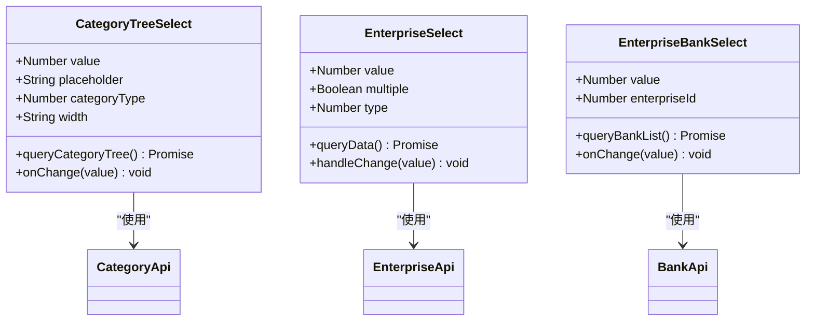
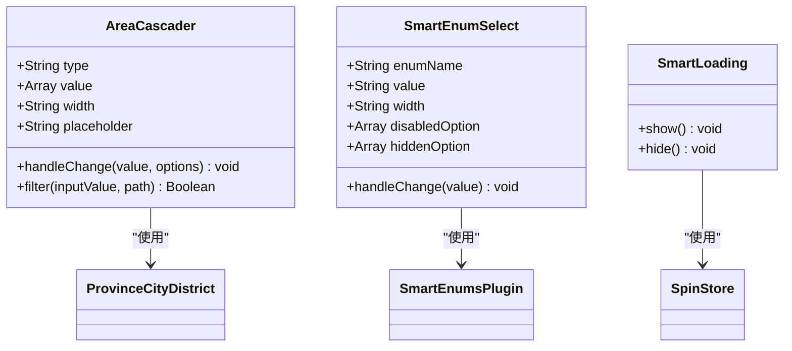
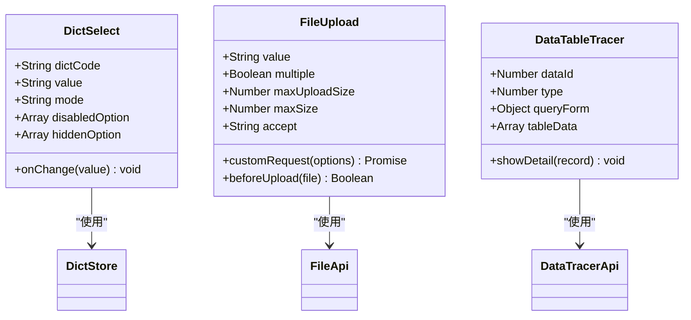
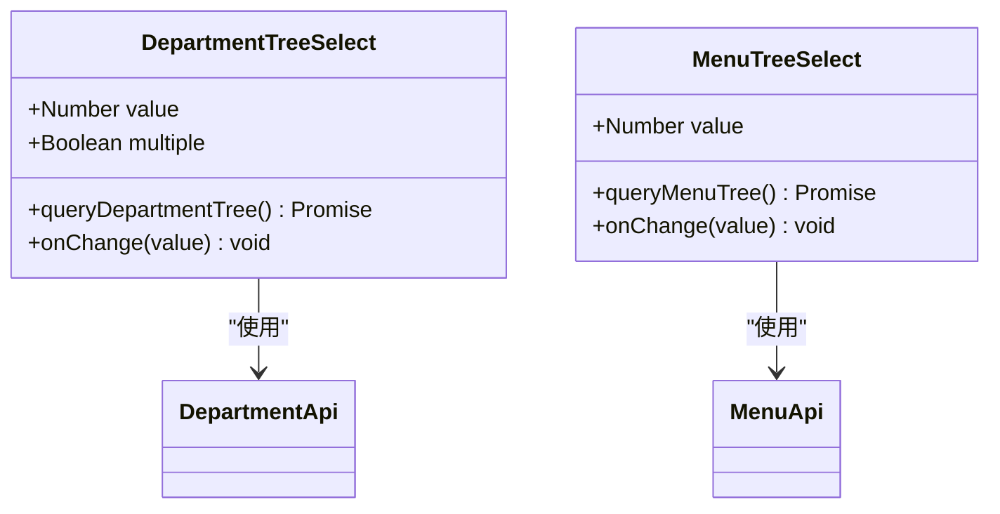
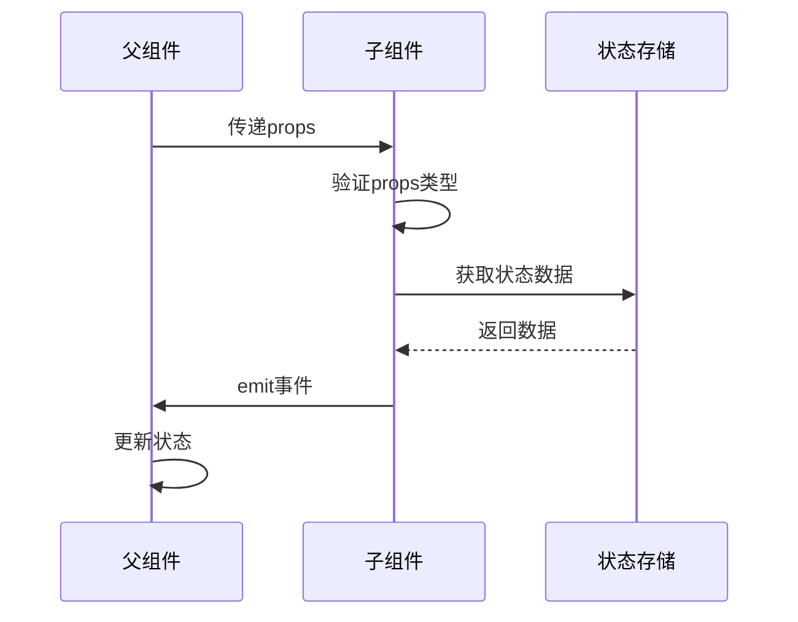
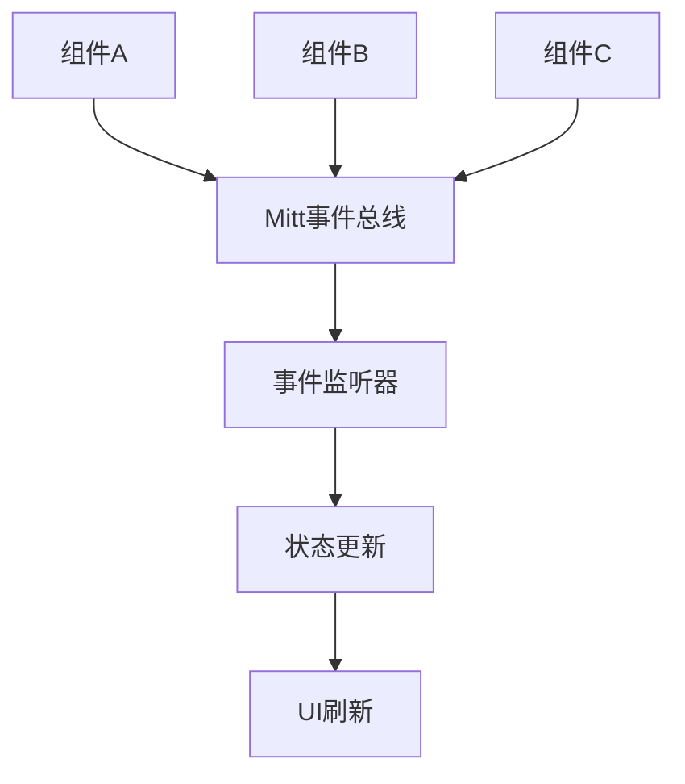
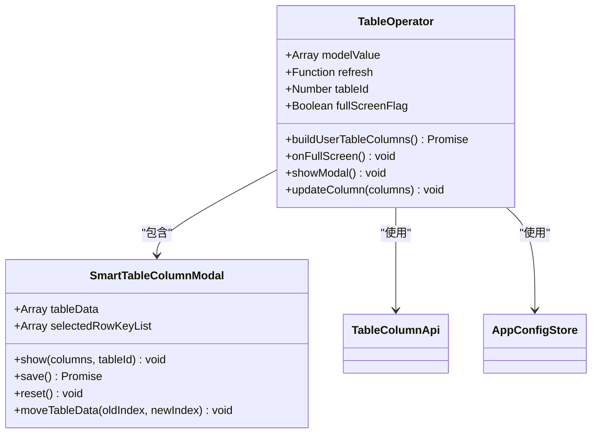
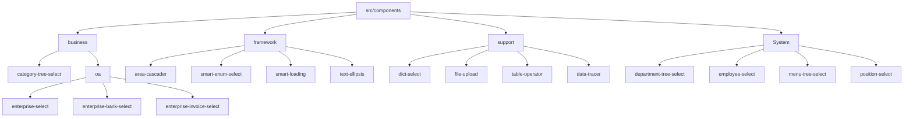
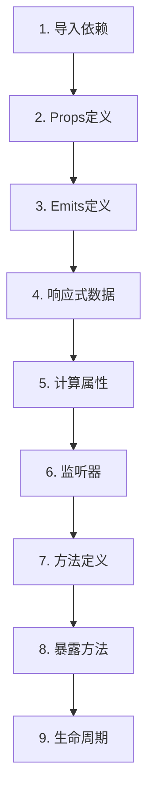

# 组件架构

<cite>
**本文档引用的文件**
- [category-tree-select/index.vue](file://smart-admin-web-javascript/src/components/business/category-tree-select/index.vue)
- [area-cascader/index.vue](file://smart-admin-web-javascript/src/components/framework/area-cascader/index.vue)
- [dict-select/index.vue](file://smart-admin-web-javascript/src/components/support/dict-select/index.vue)
- [department-tree-select/index.vue](file://smart-admin-web-javascript/src/components/system/department-tree-select/index.vue)
- [table-operator/index.vue](file://smart-admin-web-javascript/src/components/support/table-operator/index.vue)
- [file-upload/index.vue](file://smart-admin-web-javascript/src/components/support/file-upload/index.vue)
- [smart-enum-select/index.vue](file://smart-admin-web-javascript/src/components/framework/smart-enum-select/index.vue)
- [enterprise-select/index.vue](file://smart-admin-web-javascript/src/components/business/oa/enterprise-select/index.vue)
- [data-tracer/index.vue](file://smart-admin-web-javascript/src/components/support/data-tracer/index.vue)
- [smart-table-column-modal.vue](file://smart-admin-web-javascript/src/components/support/table-operator/smart-table-column-modal.vue)
- [smart-loading/index.js](file://smart-admin-web-javascript/src/components/framework/smart-loading/index.js)
- [side-expand-menu-mitt.js](file://smart-admin-web-javascript/src/layout/side-expand-menu/side-expand-menu-mitt.js)
- [top-expand-menu-mitt.js](file://smart-admin-web-javascript/src/layout/top-expand-menu/top-expand-menu-mitt.js)
- [table-id-const.js](file://smart-admin-web-javascript/src/constants/support/table-id-const.js)
- [index.js](file://smart-admin-web-javascript/src/constants/index.js)
</cite>

## 目录
1. [项目概述](#项目概述)
2. [组件分类体系](#组件分类体系)
3. [核心组件分析](#核心组件分析)
4. [组件通信机制](#组件通信机制)
5. [高阶组件设计](#高阶组件设计)
6. [组件目录结构](#组件目录结构)
7. [组件开发规范](#组件开发规范)
8. [最佳实践与性能优化](#最佳实践与性能优化)
9. [总结](#总结)

## 项目概述

smart-admin-web-javascript是一个基于Vue 3和Ant Design Vue的企业级管理系统前端框架，采用组件化设计理念，将系统中的UI组件按照业务领域和功能特性进行分类组织。该项目展现了现代前端框架中组件化架构的最佳实践，通过清晰的组件分类、灵活的通信机制和标准化的开发规范，为企业级应用提供了可复用、可维护的组件解决方案。

## 组件分类体系

smart-admin-web-javascript采用了四层组件分类体系，每一层都有明确的设计理念和使用场景：

### 业务组件（Business Components）

业务组件专注于特定业务领域的功能实现，直接服务于具体的业务需求。



**图表来源**
- [category-tree-select/index.vue](file://smart-admin-web-javascript/src/components/business/category-tree-select/index.vue#L1-L87)
- [enterprise-select/index.vue](file://smart-admin-web-javascript/src/components/business/oa/enterprise-select/index.vue#L1-L86)

**特点：**
- 与具体业务逻辑紧密耦合
- 封装特定领域的数据查询和交互逻辑
- 提供业务相关的配置选项
- 支持业务场景的特殊需求

### 框架组件（Framework Components）

框架组件提供基础的UI交互功能，具有较高的通用性和复用价值。



**图表来源**
- [area-cascader/index.vue](file://smart-admin-web-javascript/src/components/framework/area-cascader/index.vue#L1-L88)
- [smart-enum-select/index.vue](file://smart-admin-web-javascript/src/components/framework/smart-enum-select/index.vue#L1-L89)
- [smart-loading/index.js](file://smart-admin-web-javascript/src/components/framework/smart-loading/index.js#L1-L21)

**特点：**
- 提供通用的UI交互模式
- 支持多种配置选项和定制化
- 具有良好的扩展性
- 保持与底层框架的兼容性

### 支撑组件（Support Components）

支撑组件提供系统级的功能支持，如数据管理、状态控制等。



**图表来源**
- [dict-select/index.vue](file://smart-admin-web-javascript/src/components/support/dict-select/index.vue#L1-L102)
- [file-upload/index.vue](file://smart-admin-web-javascript/src/components/support/file-upload/index.vue#L1-L230)
- [data-tracer/index.vue](file://smart-admin-web-javascript/src/components/support/data-tracer/index.vue#L1-L180)

**特点：**
- 提供跨业务的通用功能
- 与系统状态管理深度集成
- 支持全局配置和个性化定制
- 具有较强的技术抽象能力

### 系统组件（System Components）

系统组件负责系统级别的功能实现，如导航、权限管理等。



**图表来源**
- [department-tree-select/index.vue](file://smart-admin-web-javascript/src/components/system/department-tree-select/index.vue#L1-L59)

**特点：**
- 与系统架构紧密相关
- 提供基础的系统功能
- 通常具有全局影响
- 需要高度的安全性和稳定性

**章节来源**
- [category-tree-select/index.vue](file://smart-admin-web-javascript/src/components/business/category-tree-select/index.vue#L1-L87)
- [area-cascader/index.vue](file://smart-admin-web-javascript/src/components/framework/area-cascader/index.vue#L1-L88)
- [dict-select/index.vue](file://smart-admin-web-javascript/src/components/support/dict-select/index.vue#L1-L102)
- [department-tree-select/index.vue](file://smart-admin-web-javascript/src/components/system/department-tree-select/index.vue#L1-L59)

## 核心组件分析

### 树形选择器系列

树形选择器是系统中重要的数据选择组件，提供了层级化的数据展示和选择功能。

#### 分类树选择器（Category Tree Select）

分类树选择器专门用于业务分类的选择，支持动态加载和缓存机制。

**核心特性：**
- 动态加载分类树数据
- 支持分类类型过滤
- 自动缓存已加载的数据
- 支持单选和多选模式

**技术实现：**
- 使用`categoryApi`进行数据查询
- 通过`watch`监听`categoryType`变化
- 实现了完整的错误处理机制

#### 部门树选择器（Department Tree Select）

部门树选择器用于组织架构中的部门选择，支持多选和搜索功能。

**核心特性：**
- 树形结构展示部门关系
- 支持部门搜索和过滤
- 提供多选功能
- 支持动态刷新

**技术实现：**
- 使用`departmentApi`获取部门树数据
- 实现了`queryDepartmentTree`方法供外部调用
- 支持`tree-default-expand-all`自动展开

### 级联选择器（Area Cascader）

级联选择器提供了省市区三级联动的选择功能，支持精确到区县的地理信息选择。

**核心特性：**
- 支持省市区三级联动
- 提供搜索和过滤功能
- 支持自定义宽度和尺寸
- 兼容多种浏览器

**技术实现：**
- 内置了省市区数据源
- 实现了智能搜索算法
- 支持多种输入方式

### 字典选择器（Dict Select）

字典选择器是系统中最重要的数据选择组件之一，提供了基于字典数据的选择功能。

**核心特性：**
- 基于字典数据的动态选择
- 支持禁用和隐藏选项
- 提供多种显示模式
- 支持远程字典数据

**技术实现：**
- 与`DictStore`深度集成
- 实现了选项过滤和验证
- 支持多选和单选模式

### 枚举选择器（Smart Enum Select）

枚举选择器用于基于程序枚举的快速选择，提供了类型安全的选择体验。

**核心特性：**
- 基于JavaScript枚举的选择
- 支持运行时动态加载
- 提供类型验证和过滤
- 支持禁用和隐藏选项

**技术实现：**
- 通过`$smartEnumPlugin`获取枚举数据
- 实现了选项过滤逻辑
- 支持运行时动态更新

**章节来源**
- [category-tree-select/index.vue](file://smart-admin-web-javascript/src/components/business/category-tree-select/index.vue#L1-L87)
- [department-tree-select/index.vue](file://smart-admin-web-javascript/src/components/system/department-tree-select/index.vue#L1-L59)
- [area-cascader/index.vue](file://smart-admin-web-javascript/src/components/framework/area-cascader/index.vue#L1-L88)
- [dict-select/index.vue](file://smart-admin-web-javascript/src/components/support/dict-select/index.vue#L1-L102)
- [smart-enum-select/index.vue](file://smart-admin-web-javascript/src/components/framework/smart-enum-select/index.vue#L1-L89)

## 组件通信机制

smart-admin-web-javascript采用了多种组件通信机制，确保组件间能够高效、可靠地进行数据传递和状态同步。

### Props 通信机制

Props是最基础的父子组件通信方式，通过定义明确的属性接口实现数据传递。



**图表来源**
- [category-tree-select/index.vue](file://smart-admin-web-javascript/src/components/business/category-tree-select/index.vue#L29-L40)
- [dict-select/index.vue](file://smart-admin-web-javascript/src/components/support/dict-select/index.vue#L34-L67)

**Props设计原则：**
- 使用`defineProps`统一定义
- 严格的类型验证和默认值设置
- 支持复杂数据类型的传递
- 实现响应式数据绑定

### Events 事件机制

Events提供了子组件向父组件传递消息的能力，支持双向数据绑定。

**事件命名规范：**
- 使用`update:value`支持v-model
- 使用`change`表示值的变化
- 使用`confirm`表示确认操作
- 使用`cancel`表示取消操作

### Mitt事件总线

Mitt事件总线提供了跨组件的松耦合通信机制，特别适用于非父子关系的组件间通信。



**图表来源**
- [side-expand-menu-mitt.js](file://smart-admin-web-javascript/src/layout/side-expand-menu/side-expand-menu-mitt.js#L1-L11)
- [top-expand-menu-mitt.js](file://smart-admin-web-javascript/src/layout/top-expand-menu/top-expand-menu-mitt.js#L1-L11)

**事件总线应用场景：**
- 跨层级组件通信
- 全局状态同步
- 页面间数据共享
- 插件系统通信

### 高级通信模式

#### 状态提升模式

对于需要在多个组件间共享的状态，采用状态提升的方式集中管理。

#### 发布订阅模式

通过事件总线实现发布订阅模式，支持一对多的通信场景。

#### 依赖注入模式

利用Vue的provide/inject机制实现深层组件间的通信。

**章节来源**
- [category-tree-select/index.vue](file://smart-admin-web-javascript/src/components/business/category-tree-select/index.vue#L29-L40)
- [dict-select/index.vue](file://smart-admin-web-javascript/src/components/support/dict-select/index.vue#L34-L67)
- [side-expand-menu-mitt.js](file://smart-admin-web-javascript/src/layout/side-expand-menu/side-expand-menu-mitt.js#L1-L11)
- [top-expand-menu-mitt.js](file://smart-admin-web-javascript/src/layout/top-expand-menu/top-expand-menu-mitt.js#L1-L11)

## 高阶组件设计

高阶组件是smart-admin-web-javascript中重要的设计模式，通过组合多个基础组件形成复杂的业务功能。

### 表格操作组件（Table Operator）

表格操作组件是一个典型的高阶组件，集成了表格列设置、全屏、刷新等功能。



**图表来源**
- [table-operator/index.vue](file://smart-admin-web-javascript/src/components/support/table-operator/index.vue#L1-L227)
- [smart-table-column-modal.vue](file://smart-admin-web-javascript/src/components/support/table-operator/smart-table-column-modal.vue#L1-L313)

**核心功能：**
- 表格列的动态配置
- 用户个性化设置的持久化
- 全屏模式切换
- 列拖拽排序
- 列宽自定义

**技术实现：**
- 使用`tableColumnApi`管理列配置
- 通过`useAppConfigStore`管理全局状态
- 实现了复杂的列合并算法
- 支持拖拽排序和动画效果

### 文件上传组件（File Upload）

文件上传组件提供了完整的文件处理功能，包括上传、预览、删除等操作。

**核心特性：**
- 支持多文件上传
- 实现了文件类型和大小验证
- 提供文件预览功能
- 支持拖拽上传
- 实现了断点续传

**技术实现：**
- 使用`SortableJS`实现拖拽排序
- 通过`SmartLoading`显示上传状态
- 实现了文件预览和下载功能
- 支持多种文件格式

### 数据追踪组件（Data Tracer）

数据追踪组件提供了数据变更历史的查看和对比功能。

**核心功能：**
- 数据变更记录查询
- 差异对比可视化
- 时间轴展示模式
- 浏览器和设备信息展示

**技术实现：**
- 使用`diff`和`diff2html`库进行差异对比
- 实现了复杂的HTML渲染逻辑
- 支持多种时间轴展示模式
- 提供了丰富的过滤和搜索功能

**章节来源**
- [table-operator/index.vue](file://smart-admin-web-javascript/src/components/support/table-operator/index.vue#L1-L227)
- [smart-table-column-modal.vue](file://smart-admin-web-javascript/src/components/support/table-operator/smart-table-column-modal.vue#L1-L313)
- [file-upload/index.vue](file://smart-admin-web-javascript/src/components/support/file-upload/index.vue#L1-L230)
- [data-tracer/index.vue](file://smart-admin-web-javascript/src/components/support/data-tracer/index.vue#L1-L180)

## 组件目录结构

smart-admin-web-javascript采用了清晰的组件目录结构，按照功能领域和业务范围进行组织。



**图表来源**
- [category-tree-select/index.vue](file://smart-admin-web-javascript/src/components/business/category-tree-select/index.vue#L1-L10)
- [area-cascader/index.vue](file://smart-admin-web-javascript/src/components/framework/area-cascader/index.vue#L1-L10)
- [dict-select/index.vue](file://smart-admin-web-javascript/src/components/support/dict-select/index.vue#L1-L10)
- [department-tree-select/index.vue](file://smart-admin-web-javascript/src/components/system/department-tree-select/index.vue#L1-L10)

### 目录结构说明

#### business/
业务组件目录，包含与具体业务领域相关的组件：
- **category-tree-select**: 业务分类树选择器
- **oa/**: 办公自动化相关组件
  - **enterprise-select**: 企业选择器
  - **enterprise-bank-select**: 企业银行选择器
  - **enterprise-invoice-select**: 企业发票选择器

#### framework/
框架组件目录，包含基础UI组件：
- **area-cascader**: 地区级联选择器
- **smart-enum-select**: 枚举选择器
- **smart-loading**: 加载状态组件
- **text-ellipsis**: 文本省略组件
- **wangeditor**: 富文本编辑器

#### support/
支撑组件目录，包含系统级功能组件：
- **dict-select**: 字典选择器
- **file-upload**: 文件上传组件
- **table-operator**: 表格操作组件
- **data-tracer**: 数据追踪组件

#### system/
系统组件目录，包含系统级别的组件：
- **department-tree-select**: 部门树选择器
- **employee-select**: 员工选择器
- **menu-tree-select**: 菜单树选择器
- **position-select**: 职位选择器

**章节来源**
- [category-tree-select/index.vue](file://smart-admin-web-javascript/src/components/business/category-tree-select/index.vue#L1-L10)
- [area-cascader/index.vue](file://smart-admin-web-javascript/src/components/framework/area-cascader/index.vue#L1-L10)
- [dict-select/index.vue](file://smart-admin-web-javascript/src/components/support/dict-select/index.vue#L1-L10)
- [department-tree-select/index.vue](file://smart-admin-web-javascript/src/components/system/department-tree-select/index.vue#L1-L10)

## 组件开发规范

smart-admin-web-javascript制定了严格的组件开发规范，确保代码质量和一致性。

### 命名约定

#### 文件命名
- **组件文件**: 使用kebab-case（短横线命名法）
- **常量文件**: 使用UPPER_SNAKE_CASE（大写字母蛇形命名法）
- **工具文件**: 使用camelCase（小驼峰命名法）

#### 组件命名
- **组件名称**: 使用PascalCase（大驼峰命名法）
- **注册组件**: 支持PascalCase和kebab-case
- **使用组件**: 推荐使用kebab-case

#### 变量和函数命名
- **变量名**: 使用camelCase（小驼峰命名法）
- **函数名**: 使用camelCase（小驼峰命名法）
- **常量名**: 使用UPPER_SNAKE_CASE（大写字母蛇形命名法）

### 代码组织顺序

组件代码应按照以下顺序组织：



**图表来源**
- [category-tree-select/index.vue](file://smart-admin-web-javascript/src/components/business/category-tree-select/index.vue#L24-L87)

### Props定义规范

```javascript
// Props定义示例
const props = defineProps({
  // 基础类型
  value: [Number, String, Array],
  
  // 对象类型
  config: {
    type: Object,
    default: () => ({})
  },
  
  // 必需属性
  tableId: {
    type: Number,
    required: true
  },
  
  // 默认值
  placeholder: {
    type: String,
    default: '请选择'
  }
});
```

### 事件命名规范

- **单向绑定**: 使用`update:value`支持v-model
- **状态变化**: 使用`change`表示值的变化
- **确认操作**: 使用`confirm`表示确认
- **取消操作**: 使用`cancel`表示取消
- **自定义事件**: 使用`prefix:eventName`格式

### 样式规范

#### CSS类命名
使用BEM命名规范（Block-Element-Modifier）：

```html
<div class="component-block">
  <div class="component-block__element">
    <div class="component-block__element component-block__element--modifier">
      内容
    </div>
  </div>
</div>
```

#### 样式作用域
- 使用`scoped`避免样式污染
- 优先使用项目提供的工具类
- 支持CSS预处理器（Less/Sass）

### 错误处理规范

```javascript
// 错误处理示例
try {
  const response = await api.queryData(params);
  // 处理响应
} catch (error) {
  smartSentry.captureError(error);
  // 显示错误提示
  message.error('操作失败，请稍后重试');
}
```

### 性能优化规范

#### 计算属性优化
```javascript
// 使用computed缓存计算结果
const filteredList = computed(() => {
  return dataList.value.filter(item => item.status === 1);
});
```

#### 条件渲染优化
```html
<!-- 使用v-show替代v-if（频繁切换场景） -->
<div v-show="isVisible">内容</div>
```

#### 组件懒加载
```javascript
// 组件懒加载
const LazyComponent = defineAsyncComponent(() => 
  import('./lazy-component.vue')
);
```

**章节来源**
- [category-tree-select/index.vue](file://smart-admin-web-javascript/src/components/business/category-tree-select/index.vue#L24-L87)
- [dict-select/index.vue](file://smart-admin-web-javascript/src/components/support/dict-select/index.vue#L30-L102)
- [table-id-const.js](file://smart-admin-web-javascript/src/constants/support/table-id-const.js#L1-L62)

## 最佳实践与性能优化

### 组件设计原则

#### 单一职责原则
每个组件应该只负责一个特定的功能，避免功能过于复杂。

```javascript
// 好的例子：组件职责单一
<template>
  <a-select
    v-model:value="selectValue"
    :placeholder="placeholder"
    :options="options"
    @change="onChange"
  />
</template>

// 不好的例子：组件职责过多
<template>
  <div>
    <a-select /> <!-- 选择器 -->
    <a-table />  <!-- 表格 -->
    <a-modal />  <!-- 弹窗 -->
  </div>
</template>
```

#### 可复用性设计
提取通用逻辑为独立组件，提高代码复用率。

#### Props验证
严格定义Props的类型和默认值，确保组件的健壮性。

### 性能优化策略

#### 响应式数据优化
```javascript
// 使用ref而非reactive（简单数据类型）
const count = ref(0);
const loading = ref(false);

// 使用reactive管理复杂对象
const state = reactive({
  data: [],
  pagination: {
    current: 1,
    pageSize: 10
  }
});
```

#### 计算属性缓存
```javascript
// 使用computed缓存计算结果
const filteredItems = computed(() => {
  return items.value.filter(item => item.active);
});

// 复杂计算使用缓存
const expensiveCalculation = computed(() => {
  return heavyComputation(data.value);
});
```

#### 监听器优化
```javascript
// 使用immediate选项减少重复代码
watch(
  () => props.value,
  (newValue) => {
    // 处理逻辑
  },
  { immediate: true }
);

// 使用watchEffect简化依赖跟踪
watchEffect(() => {
  // 自动追踪依赖
  updateDerivedData(props.source);
});
```

#### 组件懒加载
```javascript
// 路由级别懒加载
const routes = [
  {
    path: '/dashboard',
    component: () => import('./pages/dashboard.vue')
  }
];

// 组件级别懒加载
const LazyForm = defineAsyncComponent(() => 
  import('./components/form.vue')
);
```

#### 防抖和节流
```javascript
// 输入框防抖
import { debounce } from 'lodash';

const debouncedSearch = debounce((keyword) => {
  queryData(keyword);
}, 300);

// 滚动事件节流
import { throttle } from 'lodash';

const throttledScroll = throttle((event) => {
  handleScroll(event);
}, 100);
```

### 内存管理

#### 组件卸载清理
```javascript
// 清理定时器
let timer;
onMounted(() => {
  timer = setInterval(() => {}, 1000);
});

onUnmounted(() => {
  clearInterval(timer);
});

// 清理事件监听
onMounted(() => {
  window.addEventListener('resize', handleResize);
});

onUnmounted(() => {
  window.removeEventListener('resize', handleResize);
});
```

#### 状态管理优化
```javascript
// 使用Pinia进行状态管理
import { defineStore } from 'pinia';

export const useComponentStore = defineStore('component', {
  state: () => ({
    data: [],
    loading: false
  }),
  
  actions: {
    async fetchData() {
      this.loading = true;
      try {
        const response = await api.getData();
        this.data = response.data;
      } finally {
        this.loading = false;
      }
    }
  }
});
```

### 开发工具和调试

#### 组件测试
```javascript
// 使用Vue Test Utils进行单元测试
import { mount } from '@vue/test-utils';
import Component from './Component.vue';

describe('Component', () => {
  it('should render correctly', () => {
    const wrapper = mount(Component, {
      props: { value: 1 }
    });
    
    expect(wrapper.find('.selector').exists()).toBe(true);
  });
});
```

#### 性能监控
```javascript
// 使用Vue DevTools进行性能分析
// 在开发环境中启用性能标记
if (process.env.NODE_ENV === 'development') {
  console.time('component-render');
  // 组件渲染逻辑
  console.timeEnd('component-render');
}
```

**章节来源**
- [category-tree-select/index.vue](file://smart-admin-web-javascript/src/components/business/category-tree-select/index.vue#L45-L87)
- [dict-select/index.vue](file://smart-admin-web-javascript/src/components/support/dict-select/index.vue#L71-L102)
- [table-operator/index.vue](file://smart-admin-web-javascript/src/components/support/table-operator/index.vue#L68-L90)

## 总结

smart-admin-web-javascript的组件架构展现了现代前端框架中组件化设计的最佳实践。通过四层分类体系、灵活的通信机制、完善的开发规范和性能优化策略，该项目为企业级应用提供了一个可复用、可维护、高性能的组件解决方案。

### 核心优势

1. **清晰的分类体系**: 四层组件分类确保了组件的职责明确和功能定位准确
2. **灵活的通信机制**: 多种通信方式满足不同场景的需求
3. **完善的开发规范**: 从命名到代码组织都有严格的标准
4. **优秀的性能表现**: 通过多种优化策略确保组件的高效运行
5. **强大的扩展能力**: 高阶组件设计支持复杂业务场景的快速开发

### 应用价值

该组件架构不仅适用于smart-admin-web-javascript项目本身，也可以作为其他企业级前端项目的参考模板。其设计理念和实现方式对于提升团队开发效率、保证代码质量、降低维护成本都具有重要意义。

通过持续的迭代和完善，smart-admin-web-javascript的组件架构将继续为企业数字化转型提供强有力的技术支撑。