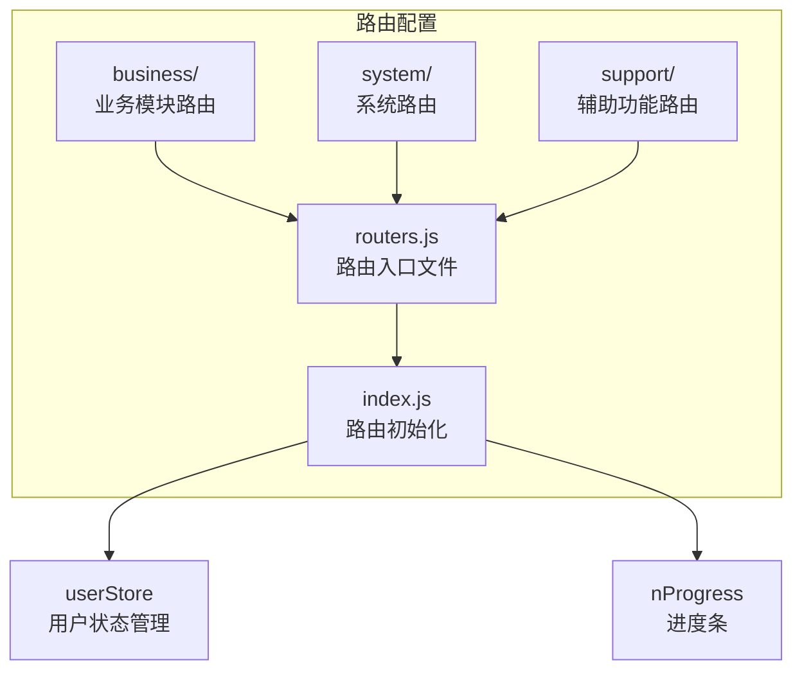
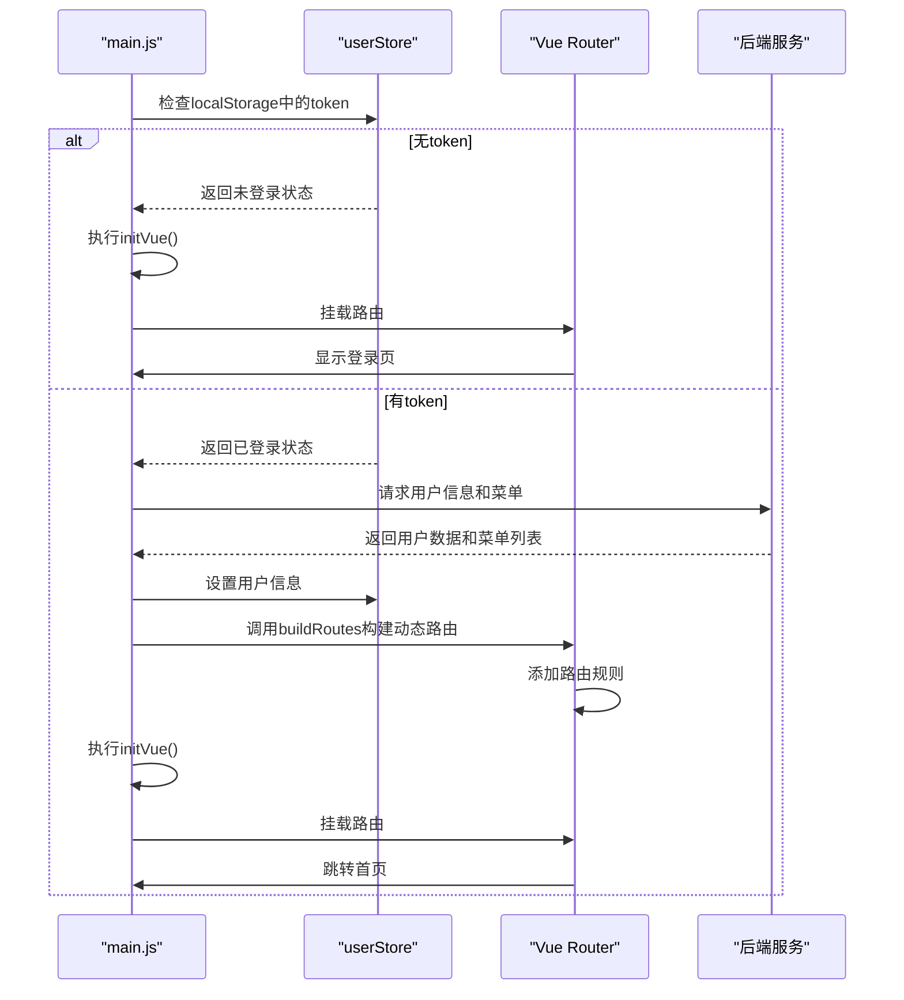
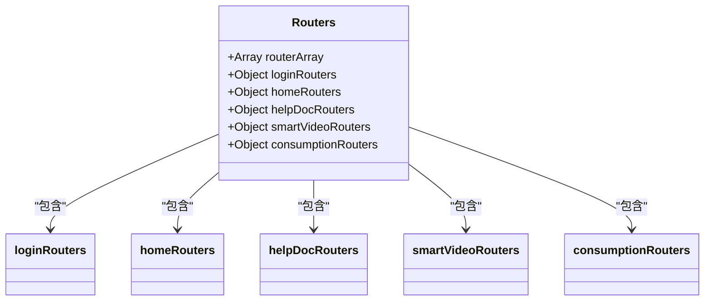
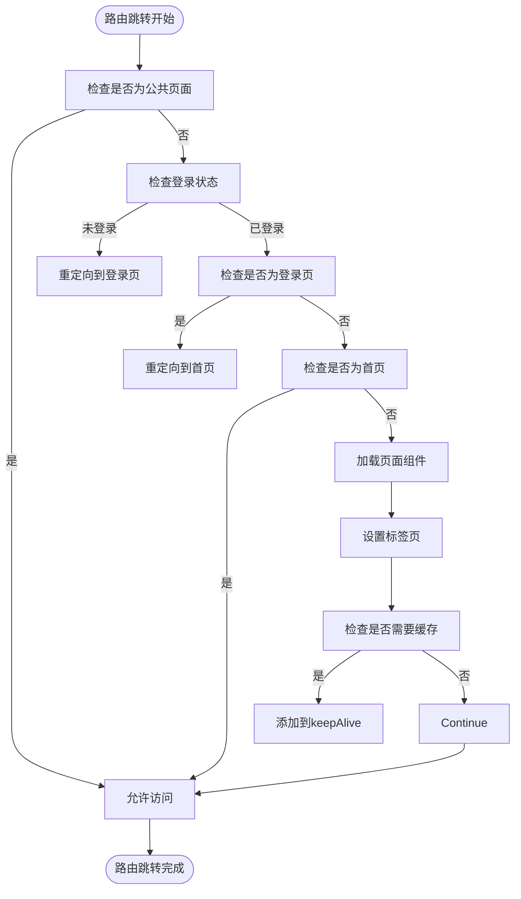
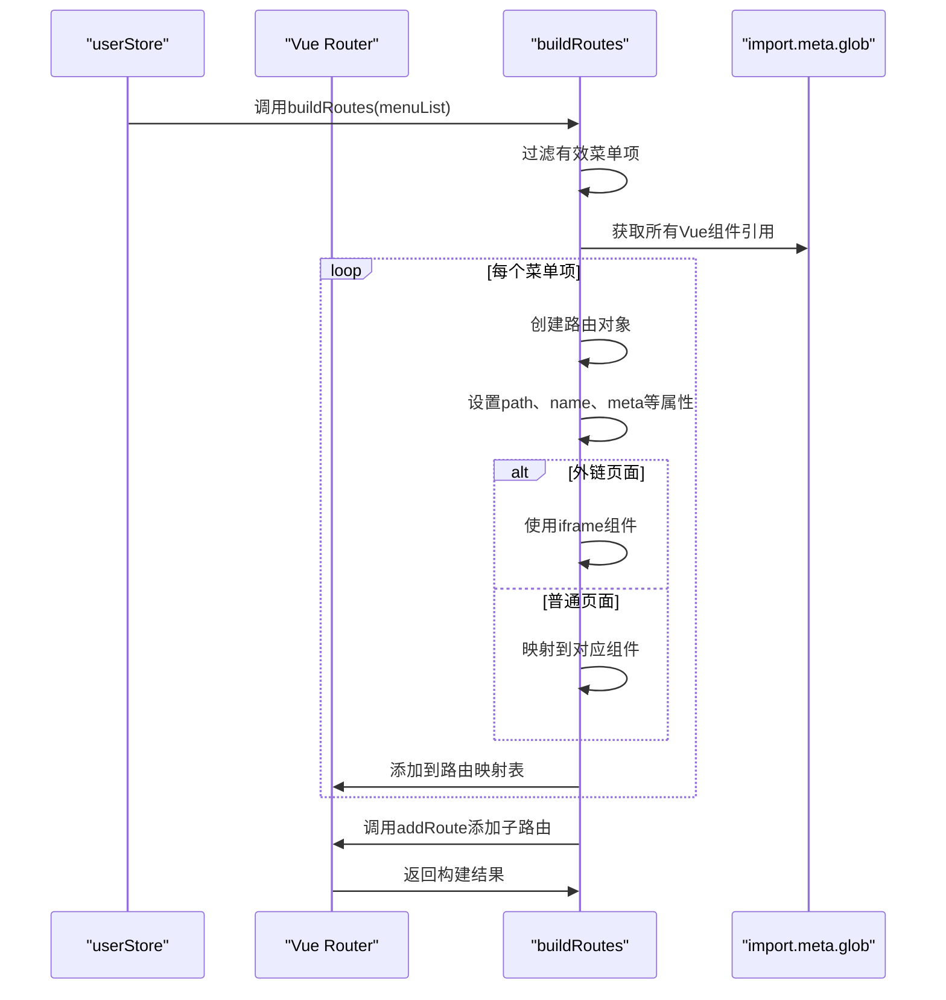
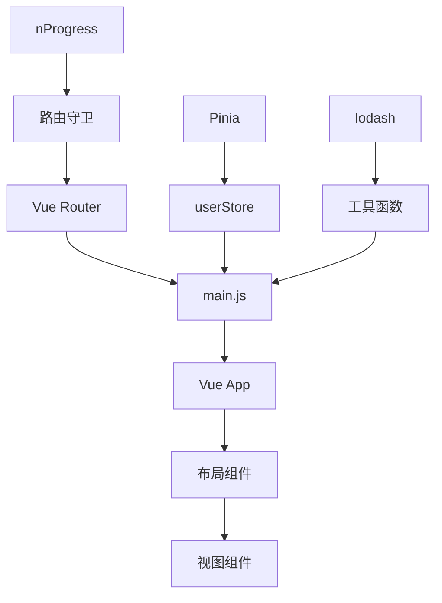

# 路由管理

<cite>
**本文档引用文件**  
- [routers.js](file://smart-admin-web-javascript/src/router/routers.js)
- [index.js](file://smart-admin-web-javascript/src/router/index.js)
- [consumption.js](file://smart-admin-web-javascript/src/router/business/consumption.js)
- [smart-video.js](file://smart-admin-web-javascript/src/router/business/smart-video.js)
- [login.js](file://smart-admin-web-javascript/src/router/system/login.js)
- [home.js](file://smart-admin-web-javascript/src/router/system/home.js)
- [main.js](file://smart-admin-web-javascript/src/main.js)
- [user.js](file://smart-admin-web-javascript/src/store/modules/system/user.js)
- [common-const.js](file://smart-admin-web-javascript/src/constants/common-const.js)
- [home-const.js](file://smart-admin-web-javascript/src/constants/system/home-const.js)
- [local-util.js](file://smart-admin-web-javascript/src/utils/local-util.js)
</cite>

## 目录
1. [简介](#简介)
2. [项目结构](#项目结构)
3. [核心组件](#核心组件)
4. [架构概述](#架构概述)
5. [详细组件分析](#详细组件分析)
6. [依赖分析](#依赖分析)
7. [性能考虑](#性能考虑)
8. [故障排除指南](#故障排除指南)
9. [结论](#结论)

## 简介
本项目采用基于Vue Router的前端路由管理机制，实现了动态路由与静态路由相结合的灵活架构。系统通过路由守卫（beforeEach、afterEach）实现权限验证和页面跳转控制，结合路由元信息（meta）实现权限控制、页面标题设置和面包屑导航等功能。路由配置采用模块化设计，支持消费、智能视频等业务模块的独立路由定义，并通过动态路由机制从后端获取用户权限对应的菜单路由，实现个性化访问控制。

## 项目结构
项目路由相关文件采用模块化组织方式，主要包含基础路由配置、业务模块路由和系统路由三大部分。路由配置文件位于`src/router`目录下，通过`routers.js`统一管理所有路由入口，各业务模块（如消费、智能视频）拥有独立的路由配置文件，系统路由（如登录、首页）单独维护。

**图示来源**  
- [routers.js](file://smart-admin-web-javascript/src/router/routers.js)
- [index.js](file://smart-admin-web-javascript/src/router/index.js)

**本节来源**  
- [routers.js](file://smart-admin-web-javascript/src/router/routers.js)
- [index.js](file://smart-admin-web-javascript/src/router/index.js)

## 核心组件
系统路由管理的核心组件包括路由配置、路由守卫、动态路由构建和权限验证逻辑。通过`buildRoutes`函数从用户菜单数据动态构建路由表，并利用Vue Router的`addRoute`方法实现运行时路由添加。路由守卫在页面跳转前后执行权限检查和状态更新，确保用户只能访问其权限范围内的页面。

**本节来源**  
- [index.js](file://smart-admin-web-javascript/src/router/index.js)
- [user.js](file://smart-admin-web-javascript/src/store/modules/system/user.js)

## 架构概述
系统采用动态路由为主、静态路由为辅的混合路由架构。应用启动时根据用户登录状态决定初始化流程：已登录用户先获取权限菜单，构建动态路由后初始化Vue实例；未登录用户直接初始化Vue实例并跳转至登录页。这种设计避免了传统方式中路由未准备好就挂载的问题，确保路由系统的正确性和安全性。

**图示来源**  
- [main.js](file://smart-admin-web-javascript/src/main.js)
- [index.js](file://smart-admin-web-javascript/src/router/index.js)
- [user.js](file://smart-admin-web-javascript/src/store/modules/system/user.js)

## 详细组件分析

### 路由配置分析
路由配置采用模块化设计，通过`routers.js`文件聚合所有路由模块。系统预定义了登录、首页、帮助文档等基础路由，各业务模块（如消费、智能视频）可独立定义其路由配置。所有路由最终通过`routerArray`数组统一管理，并在Vue Router初始化时作为路由表使用。

**图示来源**  
- [routers.js](file://smart-admin-web-javascript/src/router/routers.js)
- [login.js](file://smart-admin-web-javascript/src/router/system/login.js)
- [home.js](file://smart-admin-web-javascript/src/router/system/home.js)

**本节来源**  
- [routers.js](file://smart-admin-web-javascript/src/router/routers.js)

### 路由守卫与权限验证
系统通过`beforeEach`和`afterEach`路由守卫实现完整的权限验证流程。`beforeEach`守卫负责执行登录验证、权限检查、页面标题设置和进度条控制等任务，`afterEach`守卫负责关闭进度条。权限验证逻辑基于localStorage中的token和用户菜单权限数据，确保用户只能访问其权限范围内的页面。

**图示来源**  
- [index.js](file://smart-admin-web-javascript/src/router/index.js)

**本节来源**  
- [index.js](file://smart-admin-web-javascript/src/router/index.js)

### 动态路由构建机制
动态路由构建机制通过`buildRoutes`函数实现，该函数接收用户菜单数据作为输入，将其转换为Vue Router可识别的路由配置对象。系统使用`import.meta.glob`实现路由组件的懒加载，提高应用启动性能。路由对象的name属性使用菜单ID作为唯一标识，确保菜单高亮和权限验证的准确性。

**图示来源**  
- [index.js](file://smart-admin-web-javascript/src/router/index.js)
- [user.js](file://smart-admin-web-javascript/src/store/modules/system/user.js)

**本节来源**  
- [index.js](file://smart-admin-web-javascript/src/router/index.js)

### 路由元信息应用
路由元信息（meta）在系统中扮演重要角色，用于存储页面标题、图标、缓存策略、权限标识等附加信息。这些信息被路由守卫、菜单组件、标签页组件等多方消费，实现页面标题自动设置、菜单高亮、keep-alive缓存控制等功能。元信息中的`componentName`属性特别用于keep-alive组件的include列表管理。

**本节来源**  
- [index.js](file://smart-admin-web-javascript/src/router/index.js)
- [consumption.js](file://smart-admin-web-javascript/src/router/business/consumption.js)
- [smart-video.js](file://smart-admin-web-javascript/src/router/business/smart-video.js)

### 路由跳转与参数处理
系统支持多种路由跳转方式和参数传递机制。通过`router.push`方法实现编程式导航，支持name、path两种跳转模式。查询参数通过`query`对象传递，路由参数通过`params`对象传递。标签页组件记录跳转来源，实现页面关闭时的返回逻辑。系统还提供了`setTagNav`方法管理标签页状态，支持标签页的增删操作。

**本节来源**  
- [index.js](file://smart-admin-web-javascript/src/router/index.js)
- [user.js](file://smart-admin-web-javascript/src/store/modules/system/user.js)

## 依赖分析
路由系统依赖多个核心模块和第三方库。主要依赖包括Vue Router作为路由基础框架，Pinia作为状态管理工具，nProgress作为进度条组件，lodash作为工具函数库。系统通过模块化设计降低了各组件间的耦合度，路由配置与业务逻辑分离，便于维护和扩展。

**图示来源**  
- [package.json](file://smart-admin-web-javascript/package.json)
- [main.js](file://smart-admin-web-javascript/src/main.js)
- [index.js](file://smart-admin-web-javascript/src/router/index.js)

**本节来源**  
- [main.js](file://smart-admin-web-javascript/src/main.js)
- [index.js](file://smart-admin-web-javascript/src/router/index.js)

## 性能考虑
系统在路由管理方面实施了多项性能优化措施。首先采用路由懒加载（import()）技术，按需加载页面组件，显著减少初始加载体积。其次通过keep-alive机制缓存常用页面，避免重复渲染开销。进度条（nProgress）提供良好的用户反馈，掩盖页面加载延迟。动态路由构建在用户登录后一次性完成，避免重复计算。

**本节来源**  
- [index.js](file://smart-admin-web-javascript/src/router/index.js)
- [main.js](file://smart-admin-web-javascript/src/main.js)

## 故障排除指南
常见路由相关问题及解决方案：
1. **页面无法访问**：检查用户权限是否包含对应菜单，确认token是否有效
2. **菜单无法高亮**：确保路由name与菜单ID一致，检查meta信息是否正确
3. **页面未缓存**：确认meta.keepAlive设置为true，检查componentName是否唯一
4. **动态路由未生效**：检查buildRoutes调用时机，确认菜单数据格式正确
5. **外链页面无法显示**：检查frameFlag和frameUrl设置，确认iframe组件正常加载

**本节来源**  
- [index.js](file://smart-admin-web-javascript/src/router/index.js)
- [user.js](file://smart-admin-web-javascript/src/store/modules/system/user.js)

## 结论
本系统实现了基于Vue Router的完整前端路由解决方案，通过动态路由与静态路由结合的方式，既保证了灵活性又确保了安全性。路由守卫机制有效实现了权限控制和状态管理，元信息设计支持丰富的页面特性。模块化路由配置便于团队协作和代码维护，懒加载和缓存机制优化了应用性能。整体路由架构设计合理，可扩展性强，为大型管理系统提供了可靠的路由基础。