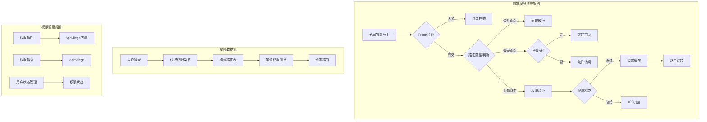
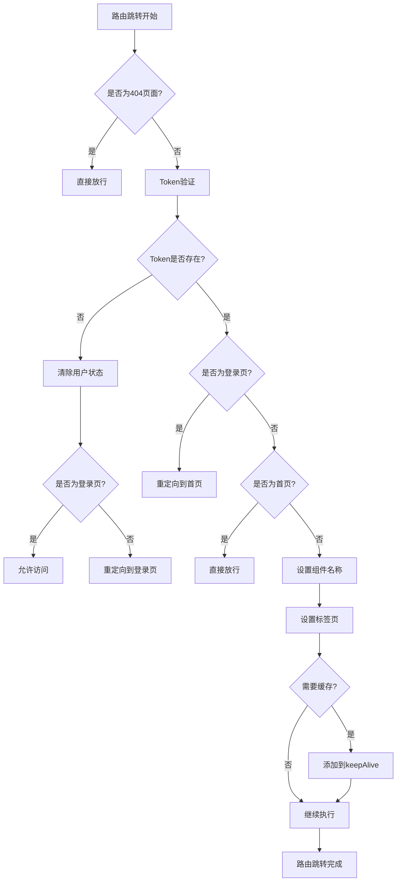
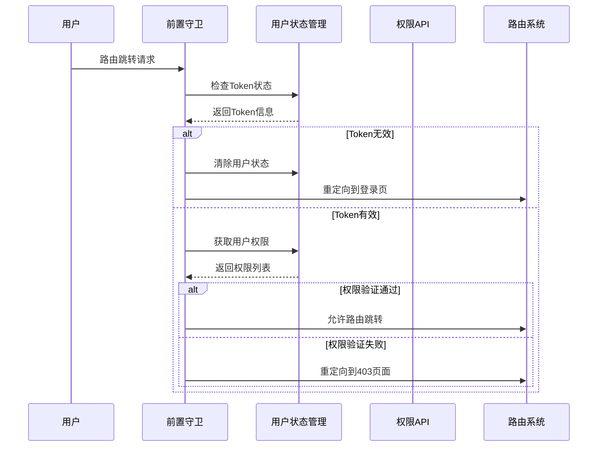
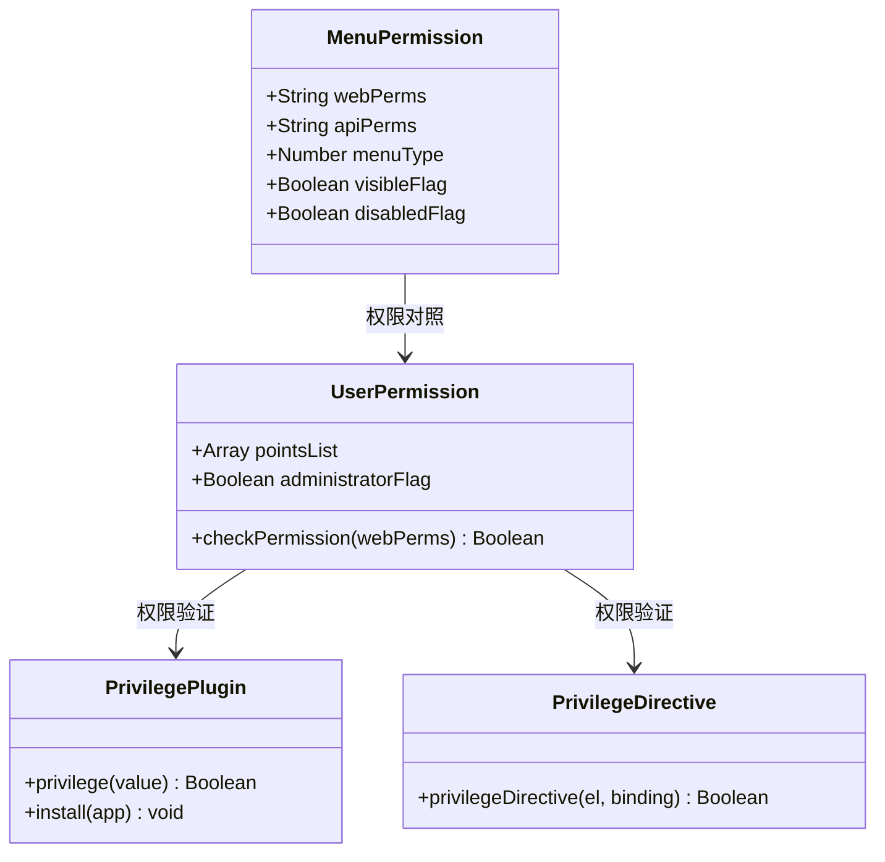
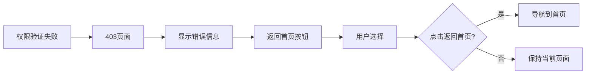
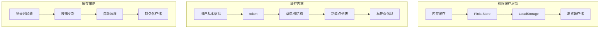
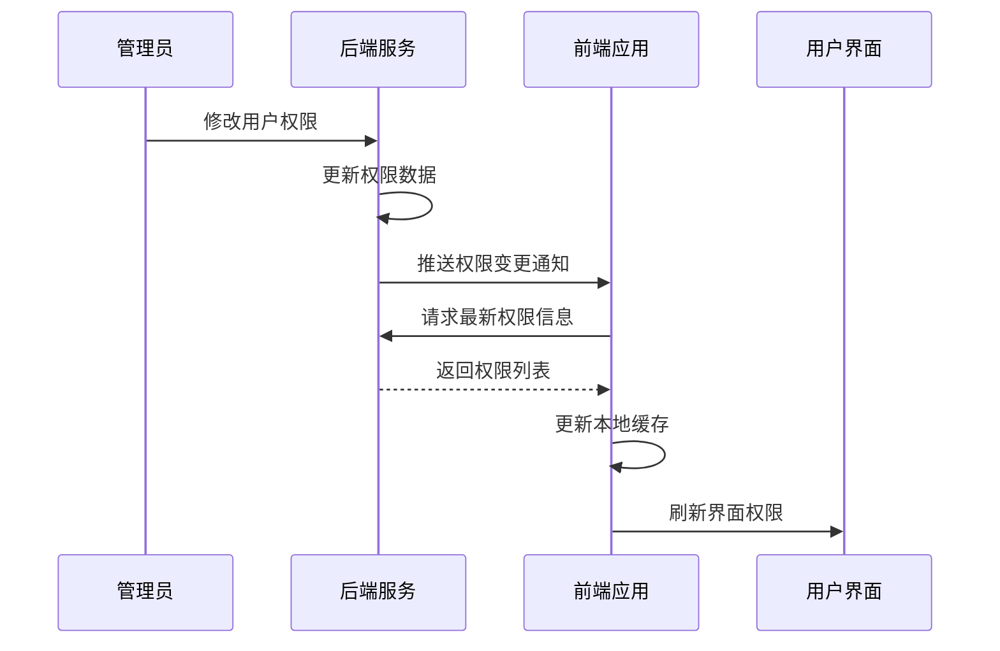
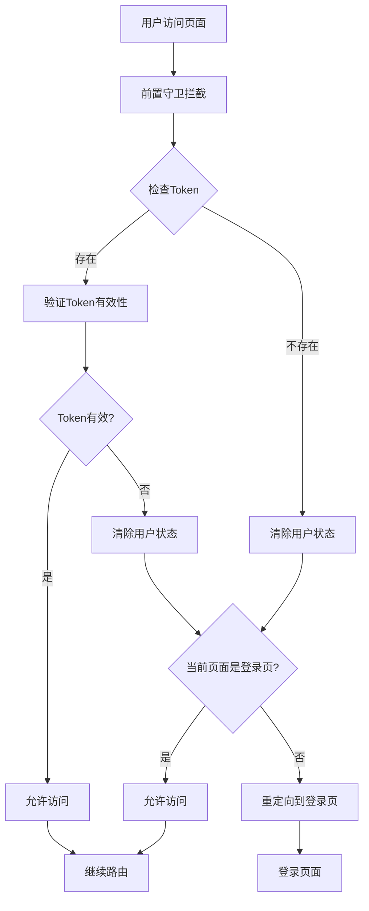
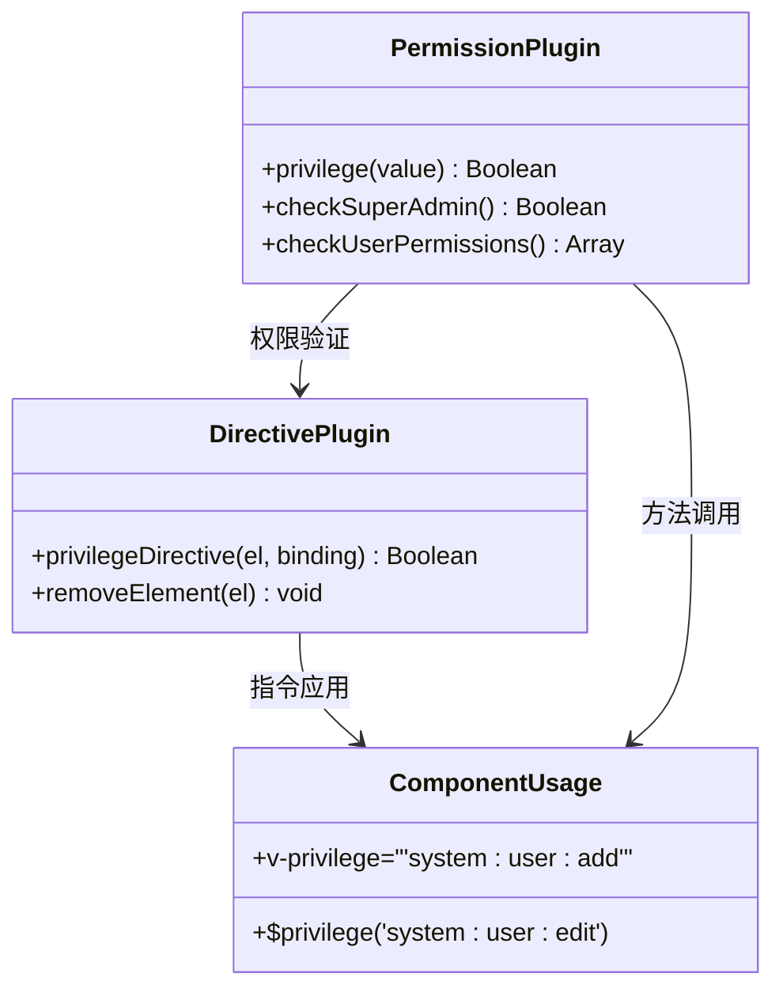

# 路由权限控制体系详细文档

<cite>
**本文档引用的文件**
- [router/index.js](file://smart-admin-web-javascript/src/router/index.js)
- [router/routers.js](file://smart-admin-web-javascript/src/router/routers.js)
- [store/modules/system/user.js](file://smart-admin-web-javascript/src/store/modules/system/user.js)
- [plugins/privilege-plugin.js](file://smart-admin-web-javascript/src/plugins/privilege-plugin.js)
- [directives/privilege.js](file://smart-admin-web-javascript/src/directives/privilege.js)
- [constants/system/menu-const.js](file://smart-admin-web-javascript/src/constants/system/menu-const.js)
- [constants/common-const.js](file://smart-admin-web-javascript/src/constants/common-const.js)
- [utils/local-util.js](file://smart-admin-web-javascript/src/utils/local-util.js)
- [views/system/40X/403.vue](file://smart-admin-web-javascript/src/views/system/40X/403.vue)
- [views/system/40X/404.vue](file://smart-admin-web-javascript/src/views/system/40X/404.vue)
- [api/system/menu-api.js](file://smart-admin-web-javascript/src/api/system/menu-api.js)
</cite>

## 目录
1. [概述](#概述)
2. [系统架构](#系统架构)
3. [全局前置守卫实现](#全局前置守卫实现)
4. [权限验证机制](#权限验证机制)
5. [路由元信息与权限控制](#路由元信息与权限控制)
6. [异常页面处理](#异常页面处理)
7. [权限缓存策略](#权限缓存策略)
8. [动态权限更新](#动态权限更新)
9. [实际应用示例](#实际应用示例)
10. [最佳实践与优化建议](#最佳实践与优化建议)

## 概述

智能管理系统采用基于 Vue Router 的前端路由权限控制体系，结合 Sa-Token 后端认证框架，实现了完整的用户身份验证、权限验证和路由访问控制机制。该体系通过全局前置守卫、权限插件、指令等多种技术手段，确保用户只能访问其具有权限的页面和功能。

### 核心特性

- **多层次权限验证**：支持用户身份验证、路由权限验证和功能点权限验证
- **动态路由构建**：根据用户权限动态生成路由表
- **权限缓存机制**：本地存储用户权限信息，提升性能
- **异常处理完善**：提供403、404等标准异常页面
- **实时权限更新**：支持权限变更后的即时生效

## 系统架构

**图表来源**
- [router/index.js](file://smart-admin-web-javascript/src/router/index.js#L31-L87)
- [store/modules/system/user.js](file://smart-admin-web-javascript/src/store/modules/system/user.js#L118-L308)

## 全局前置守卫实现

### beforeEach 守卫逻辑

全局前置守卫是权限控制的核心入口，负责在每个路由跳转前进行权限验证。

**图表来源**
- [router/index.js](file://smart-admin-web-javascript/src/router/index.js#L31-L87)

### 关键实现细节

1. **公共页面放行**：对404页面直接放行，确保错误页面可访问
2. **Token有效性检查**：从localStorage读取用户Token进行验证
3. **登录状态管理**：Token缺失时自动清除用户状态并重定向
4. **特殊路由处理**：登录页和首页的特殊处理逻辑
5. **组件懒加载优化**：动态设置组件名称以支持keep-alive

**章节来源**
- [router/index.js](file://smart-admin-web-javascript/src/router/index.js#L31-L87)

## 权限验证机制

### 用户登录状态验证

系统通过多种方式验证用户登录状态：

| 验证层级 | 实现方式 | 验证内容 | 处理策略 |
|---------|---------|---------|---------|
| 前端Token检查 | localStorage | Token存在性 | 无效则重定向登录 |
| 用户状态检查 | Pinia Store | 用户信息完整性 | 清除无效状态 |
| 权限列表验证 | 功能点数组 | 权限字符串匹配 | 无权限则拒绝访问 |

### 权限验证流程

**图表来源**
- [router/index.js](file://smart-admin-web-javascript/src/router/index.js#L41-L87)
- [store/modules/system/user.js](file://smart-admin-web-javascript/src/store/modules/system/user.js#L118-L131)

**章节来源**
- [router/index.js](file://smart-admin-web-javascript/src/router/index.js#L41-L87)
- [store/modules/system/user.js](file://smart-admin-web-javascript/src/store/modules/system/user.js#L118-L131)

## 路由元信息与权限控制

### 路由元信息结构

每个路由都包含丰富的元信息用于权限控制：

| 元信息字段 | 类型 | 描述 | 示例值 |
|-----------|------|------|--------|
| id | String | 菜单ID | "1001" |
| componentName | String | 组件名称 | "1001" |
| title | String | 菜单标题 | "系统管理" |
| icon | String | 图标名称 | "SettingOutlined" |
| hideInMenu | Boolean | 是否隐藏 | false |
| keepAlive | Boolean | 是否缓存 | true |
| frameFlag | Boolean | 是否外链 | false |
| frameUrl | String | 外链地址 | "" |

### auth字段与权限码匹配机制

系统通过 `webPerms` 字段实现前端权限控制：

**图表来源**
- [constants/system/menu-const.js](file://smart-admin-web-javascript/src/constants/system/menu-const.js#L1-L43)
- [plugins/privilege-plugin.js](file://smart-admin-web-javascript/src/plugins/privilege-plugin.js#L10-L23)

**章节来源**
- [constants/system/menu-const.js](file://smart-admin-web-javascript/src/constants/system/menu-const.js#L1-L43)
- [router/index.js](file://smart-admin-web-javascript/src/router/index.js#L120-L143)

## 异常页面处理

### 403权限不足页面

当用户尝试访问无权限的页面时，系统会显示403权限不足页面：

**图表来源**
- [views/system/40X/403.vue](file://smart-admin-web-javascript/src/views/system/40X/403.vue#L1-L25)

### 404页面不存在页面

对于不存在的路由，系统提供404页面：

| 特性 | 实现方式 | 用户体验 |
|------|---------|---------|
| 自动捕获 | Vue Router通配符 | 无需手动配置 |
| 友好提示 | 显示错误信息 | 清晰的错误描述 |
| 返回引导 | 首页返回按钮 | 方便用户导航 |
| 性能优化 | 静态页面 | 快速加载 |

**章节来源**
- [views/system/40X/403.vue](file://smart-admin-web-javascript/src/views/system/40X/403.vue#L1-L25)
- [views/system/40X/404.vue](file://smart-admin-web-javascript/src/views/system/40X/404.vue#L1-L26)
- [router/routers.js](file://smart-admin-web-javascript/src/router/routers.js#L15-L26)

## 权限缓存策略

### 本地存储方案

系统采用多层缓存策略确保权限验证的高效性：

**图表来源**
- [store/modules/system/user.js](file://smart-admin-web-javascript/src/store/modules/system/user.js#L50-L108)
- [utils/local-util.js](file://smart-admin-web-javascript/src/utils/local-util.js#L10-L25)

### 缓存更新机制

| 缓存项 | 更新时机 | 更新方式 | 失效策略 |
|-------|---------|---------|---------|
| 用户信息 | 登录成功 | 立即写入 | 登出时清除 |
| 菜单权限 | 权限变更 | 异步更新 | Token过期 |
| 功能点 | 动态加载 | 按需获取 | 手动刷新 |
| 标签页 | 页面切换 | 实时同步 | 浏览器重启 |

**章节来源**
- [store/modules/system/user.js](file://smart-admin-web-javascript/src/store/modules/system/user.js#L50-L108)
- [utils/local-util.js](file://smart-admin-web-javascript/src/utils/local-util.js#L10-L25)

## 动态权限更新

### 权限变更检测

系统支持运行时权限变更的检测和处理：

**图表来源**
- [store/modules/system/user.js](file://smart-admin-web-javascript/src/store/modules/system/user.js#L169-L188)

### 动态路由重建

当权限发生变更时，系统能够动态重建路由表：

| 操作步骤 | 实现方式 | 技术细节 | 影响范围 |
|---------|---------|---------|---------|
| 权限检测 | 前置守卫 | Token验证 | 全局路由 |
| 数据获取 | API调用 | 异步请求 | 用户状态 |
| 路由重建 | 动态添加 | Vue Router API | 应用路由 |
| 界面更新 | 状态同步 | Pinia Store | 组件渲染 |

**章节来源**
- [store/modules/system/user.js](file://smart-admin-web-javascript/src/store/modules/system/user.js#L169-L188)
- [router/index.js](file://smart-admin-web-javascript/src/router/index.js#L98-L165)

## 实际应用示例

### 登录拦截实现

以下展示了登录拦截的完整实现流程：

**图表来源**
- [router/index.js](file://smart-admin-web-javascript/src/router/index.js#L41-L51)

### 越权访问阻止

系统通过权限插件实现细粒度的功能点权限控制：

**图表来源**
- [plugins/privilege-plugin.js](file://smart-admin-web-javascript/src/plugins/privilege-plugin.js#L10-L23)
- [directives/privilege.js](file://smart-admin-web-javascript/src/directives/privilege.js#L12-L25)

### 未授权页面跳转

当用户访问无权限的页面时，系统自动跳转到403页面：

| 路由类型 | 访问条件 | 处理方式 | 用户体验 |
|---------|---------|---------|---------|
| 公共路由 | 无需登录 | 直接访问 | 无限制 |
| 登录路由 | 已登录 | 重定向首页 | 自动跳转 |
| 业务路由 | 权限验证 | 403页面 | 错误提示 |
| 不存在路由 | 路由匹配 | 404页面 | 友好提示 |

**章节来源**
- [router/index.js](file://smart-admin-web-javascript/src/router/index.js#L35-L87)
- [router/routers.js](file://smart-admin-web-javascript/src/router/routers.js#L15-L26)

## 最佳实践与优化建议

### 性能优化策略

1. **懒加载优化**：使用动态导入减少初始包大小
2. **缓存策略**：合理利用本地存储和内存缓存
3. **权限预加载**：在登录时一次性加载所有权限信息
4. **增量更新**：支持权限的增量更新而非全量刷新

### 安全加固措施

1. **Token管理**：定期刷新Token，防止长期有效带来的风险
2. **权限边界**：严格控制前后端权限的一致性
3. **异常处理**：完善的错误处理和用户引导
4. **审计日志**：记录权限验证过程中的关键操作

### 开发规范建议

1. **权限命名**：统一的权限字符串命名规范
2. **组件封装**：提供统一的权限控制组件
3. **测试覆盖**：确保权限验证逻辑的充分测试
4. **文档维护**：及时更新权限相关的技术文档

### 扩展性考虑

1. **微服务支持**：支持多模块权限分离
2. **第三方集成**：提供标准化的权限接口
3. **国际化支持**：权限错误信息的多语言支持
4. **监控告警**：权限验证异常的实时监控

通过以上完整的路由权限控制体系，系统实现了安全、高效、易维护的权限管理机制，为企业的数字化转型提供了坚实的技术保障。