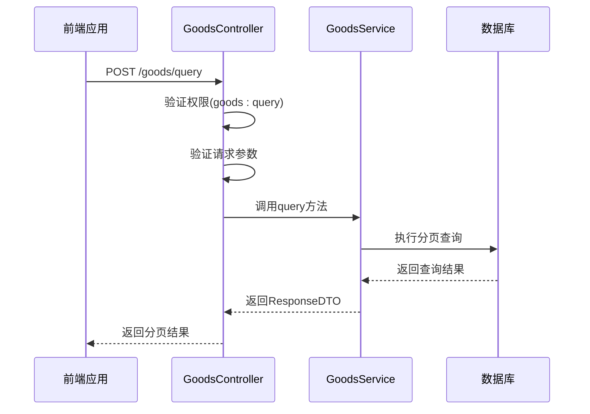
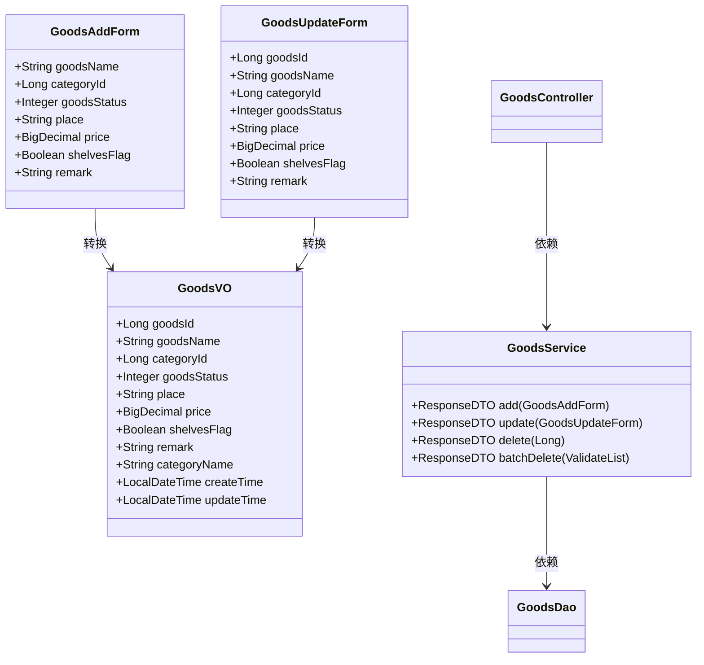
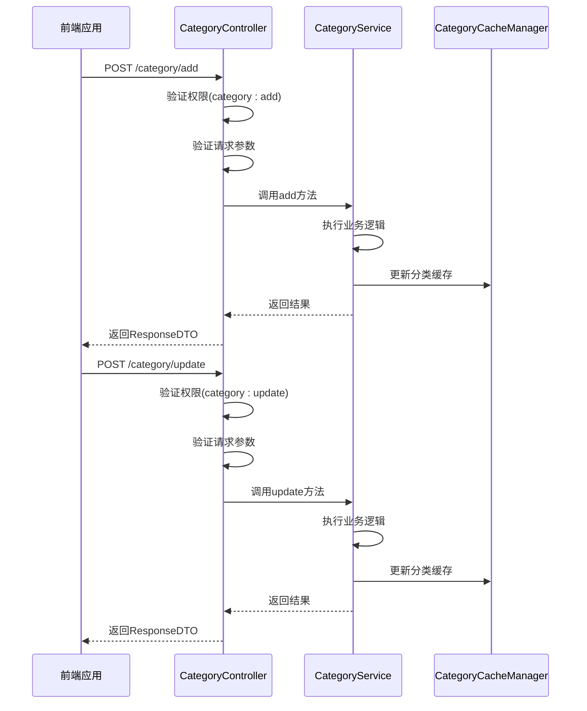
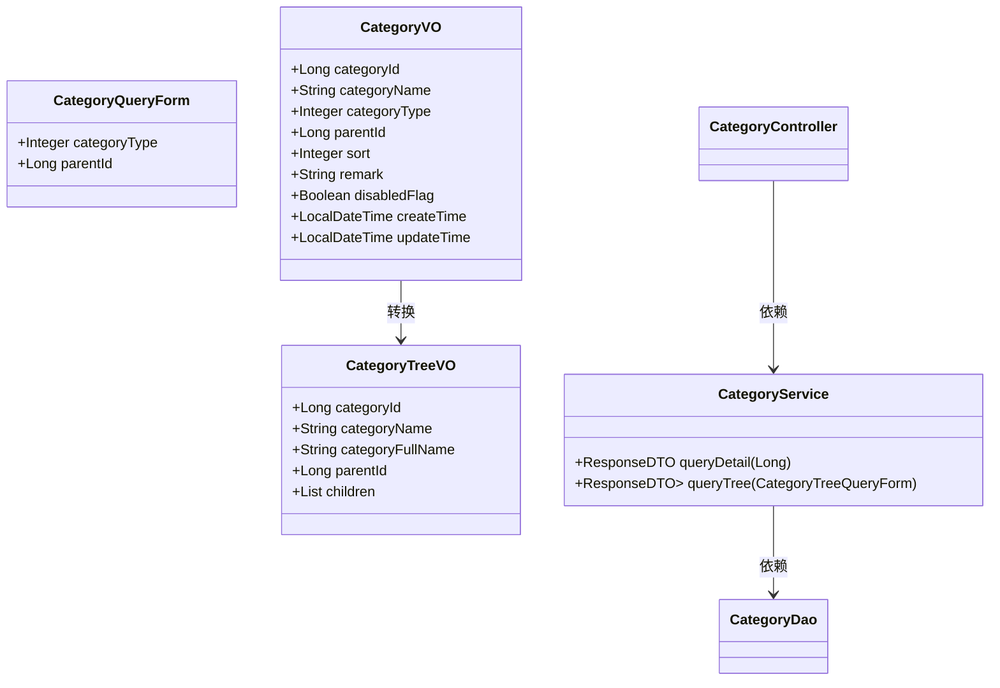
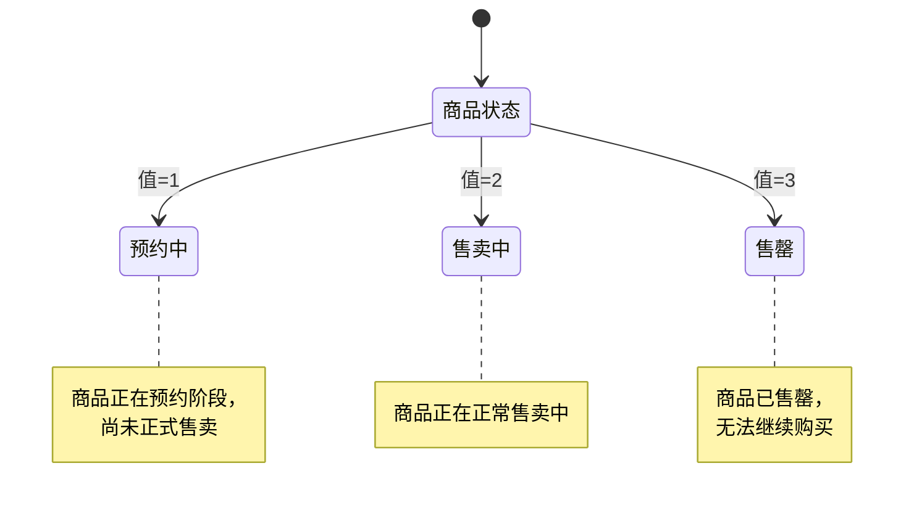
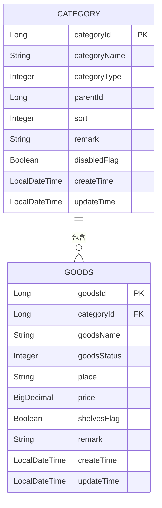
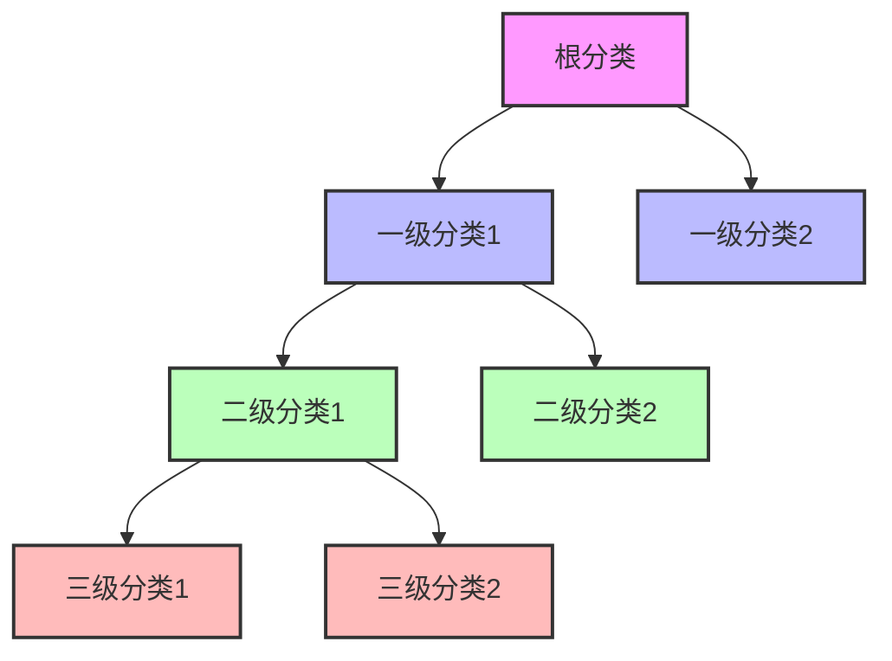
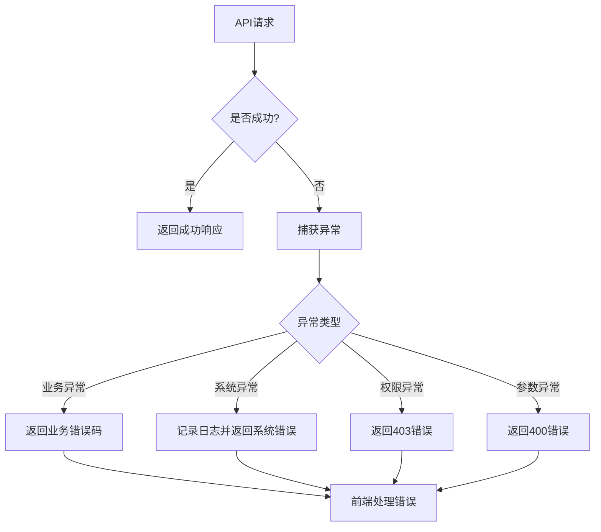

# 业务管理API

<cite>
**本文档引用的文件**
- [GoodsController.java](file://smart-admin-api-java17-springboot3\sa-admin\src\main\java\net\lab1024\sa\admin\module\business\goods\controller\GoodsController.java)
- [CategoryController.java](file://smart-admin-api-java17-springboot3\sa-admin\src\main\java\net\lab1024\sa\admin\module\business\category\controller\CategoryController.java)
- [GoodsStatusEnum.java](file://smart-admin-api-java17-springboot3\sa-admin\src\main\java\net\lab1024\sa\admin\module\business\goods\constant\GoodsStatusEnum.java)
- [CategoryTypeEnum.java](file://smart-admin-api-java17-springboot3\sa-admin\src\main\java\net\lab1024\sa\admin\module\business\category\constant\CategoryTypeEnum.java)
- [GoodsVO.java](file://smart-admin-api-java17-springboot3\sa-admin\src\main\java\net\lab1024\sa\admin\module\business\goods\domain\vo\GoodsVO.java)
- [CategoryVO.java](file://smart-admin-api-java17-springboot3\sa-admin\src\main\java\net\lab1024\sa\admin\module\business\category\domain\vo\CategoryVO.java)
- [GoodsQueryForm.java](file://smart-admin-api-java17-springboot3\sa-admin\src\main\java\net\lab1024\sa\admin\module\business\goods\domain\form\GoodsQueryForm.java)
- [CategoryTreeQueryForm.java](file://smart-admin-api-java17-springboot3\sa-admin\src\main\java\net\lab1024\sa\admin\module\business\category\domain\form\CategoryTreeQueryForm.java)
</cite>

## 目录
1. [简介](#简介)
2. [商品管理API](#商品管理api)
3. [分类管理API](#分类管理api)
4. [企业OA管理API](#企业oa管理api)
5. [枚举值说明](#枚举值说明)
6. [业务数据关联关系](#业务数据关联关系)
7. [请求响应示例](#请求响应示例)
8. [业务校验规则](#业务校验规则)
9. [异常处理](#异常处理)

## 简介
本API文档详细说明了智能管理系统中的业务管理模块，涵盖商品管理、分类管理和企业OA等核心业务功能。文档以GoodsController和CategoryController为例，深入解析了商品和分类的增删改查API设计。同时，文档还包含了商品状态管理(GoodsStatusEnum)、分类类型管理(CategoryTypeEnum)等枚举值的使用说明。

系统采用Spring Boot 3和Java 17构建，通过RESTful API提供服务，前端使用JavaScript框架进行调用。所有API均通过Sa-Token进行权限控制，确保系统安全。

**本文档引用的文件**
- [GoodsController.java](file://smart-admin-api-java17-springboot3\sa-admin\src\main\java\net\lab1024\sa\admin\module\business\goods\controller\GoodsController.java)
- [CategoryController.java](file://smart-admin-api-java17-springboot3\sa-admin\src\main\java\net\lab1024\sa\admin\module\business\category\controller\CategoryController.java)

## 商品管理API

### 商品查询API
商品查询API提供分页查询功能，支持多种查询条件的组合搜索。



**API详情**
- **端点**: POST /goods/query
- **权限**: goods:query
- **请求参数**: GoodsQueryForm对象
- **响应**: ResponseDTO<PageResult<GoodsVO>>

**API设计特点**
- 支持按商品分类、搜索词、商品状态、产地和上架状态进行查询
- 使用PageParam作为基类，自动处理分页参数
- 通过@Valid注解实现请求参数的自动验证

**本文档引用的文件**
- [GoodsController.java](file://smart-admin-api-java17-springboot3\sa-admin\src\main\java\net\lab1024\sa\admin\module\business\goods\controller\GoodsController.java#L41-L46)
- [GoodsQueryForm.java](file://smart-admin-api-java17-springboot3\sa-admin\src\main\java\net\lab1024\sa\admin\module\business\goods\domain\form\GoodsQueryForm.java)

### 商品增删改API
商品增删改API提供完整的CRUD操作，包括添加、更新、删除和批量删除功能。



**API列表**
- **添加商品**: POST /goods/add
  - 权限: goods:add
  - 请求参数: GoodsAddForm
  - 响应: ResponseDTO<String>
  
- **更新商品**: POST /goods/update
  - 权限: goods:update
  - 请求参数: GoodsUpdateForm
  - 响应: ResponseDTO<String>
  
- **删除商品**: GET /goods/delete/{goodsId}
  - 权限: goods:delete
  - 请求参数: goodsId(路径参数)
  - 响应: ResponseDTO<String>
  
- **批量删除**: POST /goods/batchDelete
  - 权限: goods:batchDelete
  - 请求参数: List<Long>
  - 响应: ResponseDTO<String>

**本文档引用的文件**
- [GoodsController.java](file://smart-admin-api-java17-springboot3\sa-admin\src\main\java\net\lab1024\sa\admin\module\business\goods\controller\GoodsController.java#L48-L75)
- [GoodsVO.java](file://smart-admin-api-java17-springboot3\sa-admin\src\main\java\net\lab1024\sa\admin\module\business\goods\domain\vo\GoodsVO.java)

### 商品导入导出API
商品导入导出API提供Excel文件的批量导入和导出功能，便于数据的批量处理。

**API详情**
- **导入商品**: POST /goods/importGoods
  - 权限: goods:importGoods
  - 请求参数: MultipartFile文件
  - 响应: ResponseDTO<String>
  
- **导出商品**: GET /goods/exportGoods
  - 权限: goods:exportGoods
  - 请求参数: 无
  - 响应: 直接输出Excel文件流

**本文档引用的文件**
- [GoodsController.java](file://smart-admin-api-java17-springboot3\sa-admin\src\main\java\net\lab1024\sa\admin\module\business\goods\controller\GoodsController.java#L78-L91)

## 分类管理API

### 分类增删改API
分类管理API提供类目的添加、更新和删除功能，支持树形结构的类目管理。



**API列表**
- **添加类目**: POST /category/add
  - 权限: category:add
  - 请求参数: CategoryAddForm
  - 响应: ResponseDTO<String>
  
- **更新类目**: POST /category/update
  - 权限: category:update
  - 请求参数: CategoryUpdateForm
  - 响应: ResponseDTO<String>
  
- **删除类目**: GET /category/delete/{categoryId}
  - 权限: category:delete
  - 请求参数: categoryId(路径参数)
  - 响应: ResponseDTO<String>

**本文档引用的文件**
- [CategoryController.java](file://smart-admin-api-java17-springboot3\sa-admin\src\main\java\net\lab1024\sa\admin\module\business\category\controller\CategoryController.java#L35-L67)

### 分类查询API
分类查询API提供类目详情查询和层级树查询功能，支持树形结构的数据展示。



**API详情**
- **查询类目详情**: GET /category/{categoryId}
  - 权限: 无需特殊权限
  - 请求参数: categoryId(路径参数)
  - 响应: ResponseDTO<CategoryVO>
  
- **查询类目层级树**: POST /category/tree
  - 权限: category:tree
  - 请求参数: CategoryTreeQueryForm
  - 响应: ResponseDTO<List<CategoryTreeVO>>

**本文档引用的文件**
- [CategoryController.java](file://smart-admin-api-java17-springboot3\sa-admin\src\main\java\net\lab1024\sa\admin\module\business\category\controller\CategoryController.java#L49-L60)
- [CategoryVO.java](file://smart-admin-api-java17-springboot3\sa-admin\src\main\java\net\lab1024\sa\admin\module\business\category\domain\vo\CategoryVO.java)
- [CategoryTreeVO.java](file://smart-admin-api-java17-springboot3\sa-admin\src\main\java\net\lab1024\sa\admin\module\business\category\domain\vo\CategoryTreeVO.java)

## 企业OA管理API
企业OA管理API提供企业相关信息的管理功能，包括发票、银行账户等信息的管理。

**API示例**
- **发票管理**: 
  - 创建发票: POST /oa/invoice/create
  - 更新发票: POST /oa/invoice/update
  - 删除发票: GET /invoice/delete/{invoiceId}
  - 查询发票列表: GET /oa/invoice/query/list/{enterpriseId}

- **企业信息管理**:
  - 企业信息的增删改查操作
  - 企业银行账户管理
  - 企业发票信息管理

**本文档引用的文件**
- [InvoiceController.java](file://smart-admin-api-java17-springboot3\sa-admin\src\main\java\net\lab1024\sa\admin\module\business\oa\invoice\controller\InvoiceController.java)
- [EnterpriseController.java](file://smart-admin-api-java17-springboot3\sa-admin\src\main\java\net\lab1024\sa\admin\module\business\oa\enterprise\controller\EnterpriseController.java)

## 枚举值说明

### 商品状态枚举(GoodsStatusEnum)
商品状态枚举定义了商品的三种状态，用于标识商品的当前业务状态。



**枚举值详情**
- **APPOINTMENT(1, "预约中")**: 商品处于预约阶段，尚未正式售卖
- **SELL(2, "售卖中")**: 商品正在正常售卖中
- **SELL_OUT(3, "售罄")**: 商品已售罄，无法继续购买

**本文档引用的文件**
- [GoodsStatusEnum.java](file://smart-admin-api-java17-springboot3\sa-admin\src\main\java\net\lab1024\sa\admin\module\business\goods\constant\GoodsStatusEnum.java)

### 分类类型枚举(CategoryTypeEnum)
分类类型枚举定义了类目的两种类型，用于区分不同类型的类目。

**枚举值详情**
- **GOODS(1, "商品")**: 商品类目，用于商品分类
- **CUSTOM(2, "自定义")**: 自定义类目，用于其他自定义分类

**使用场景**
- 在创建或更新类目时，需要指定类目类型
- 在查询类目层级树时，可以通过categoryType参数过滤特定类型的类目
- 前端展示时，可以根据类目类型显示不同的图标或样式

**本文档引用的文件**
- [CategoryTypeEnum.java](file://smart-admin-api-java17-springboot3\sa-admin\src\main\java\net\lab1024\sa\admin\module\business\category\constant\CategoryTypeEnum.java)

## 业务数据关联关系

### 商品与分类关联
商品与分类之间存在明确的关联关系，每个商品必须属于一个分类。



**关联查询**
- 商品VO中包含categoryId和categoryName字段，便于直接展示分类信息
- 查询商品时，会自动关联查询分类名称
- 分类删除时，需要检查是否有商品关联，若有则不允许删除

**本文档引用的文件**
- [GoodsVO.java](file://smart-admin-api-java17-springboot3\sa-admin\src\main\java\net\lab1024\sa\admin\module\business\goods\domain\vo\GoodsVO.java)
- [CategoryVO.java](file://smart-admin-api-java17-springboot3\sa-admin\src\main\java\net\lab1024\sa\admin\module\business\category\domain\vo\CategoryVO.java)

### 分类层级关系
分类支持树形层级结构，可以创建多级分类。



**层级特性**
- 每个分类可以有父级分类(parentId)
- 支持无限层级的树形结构
- 查询时可以获取完整的层级路径(categoryFullName)
- 提供专门的层级树查询接口

**本文档引用的文件**
- [CategoryEntity.java](file://smart-admin-api-java17-springboot3\sa-admin\src\main\java\net\lab1024\sa\admin\module\business\category\domain\entity\CategoryEntity.java)
- [CategoryTreeVO.java](file://smart-admin-api-java17-springboot3\sa-admin\src\main\java\net\lab1024\sa\admin\module\business\category\domain\vo\CategoryTreeVO.java)

## 请求响应示例

### 分页查询响应示例
```json
{
  "code": 0,
  "data": {
    "list": [
      {
        "goodsId": 1001,
        "goodsName": "智能手表",
        "categoryId": 101,
        "categoryName": "电子产品",
        "goodsStatus": 2,
        "place": "中国",
        "price": 1999.00,
        "shelvesFlag": true,
        "remark": "新品上市",
        "createTime": "2023-01-15T10:30:00",
        "updateTime": "2023-01-15T10:30:00"
      },
      {
        "goodsId": 1002,
        "goodsName": "无线耳机",
        "categoryId": 101,
        "categoryName": "电子产品",
        "goodsStatus": 1,
        "place": "中国",
        "price": 599.00,
        "shelvesFlag": true,
        "remark": "即将上市",
        "createTime": "2023-01-10T09:15:00",
        "updateTime": "2023-01-10T09:15:00"
      }
    ],
    "total": 2,
    "pageNum": 1,
    "pageSize": 10,
    "pages": 1
  },
  "msg": "成功"
}
```

### 单个实体详情响应示例
```json
{
  "code": 0,
  "data": {
    "categoryId": 101,
    "categoryName": "电子产品",
    "categoryType": 1,
    "parentId": null,
    "sort": 1,
    "remark": "主要电子产品分类",
    "disabledFlag": false,
    "createTime": "2023-01-01T08:00:00",
    "updateTime": "2023-01-01T08:00:00"
  },
  "msg": "成功"
}
```

### 批量操作响应示例
```json
{
  "code": 0,
  "data": "操作成功",
  "msg": "成功"
}
```

### 分类层级树响应示例
```json
{
  "code": 0,
  "data": [
    {
      "categoryId": 101,
      "categoryName": "电子产品",
      "categoryFullName": "电子产品",
      "parentId": null,
      "value": 101,
      "label": "电子产品",
      "children": [
        {
          "categoryId": 102,
          "categoryName": "手机",
          "categoryFullName": "电子产品/手机",
          "parentId": 101,
          "value": 102,
          "label": "手机",
          "children": []
        },
        {
          "categoryId": 103,
          "categoryName": "电脑",
          "categoryFullName": "电子产品/电脑",
          "parentId": 101,
          "value": 103,
          "label": "电脑",
          "children": []
        }
      ]
    },
    {
      "categoryId": 201,
      "categoryName": "服装",
      "categoryFullName": "服装",
      "parentId": null,
      "value": 201,
      "label": "服装",
      "children": []
    }
  ],
  "msg": "成功"
}
```

**本文档引用的文件**
- [GoodsVO.java](file://smart-admin-api-java17-springboot3\sa-admin\src\main\java\net\lab1024\sa\admin\module\business\goods\domain\vo\GoodsVO.java)
- [CategoryVO.java](file://smart-admin-api-java17-springboot3\sa-admin\src\main\java\net\lab1024\sa\admin\module\business\category\domain\vo\CategoryVO.java)
- [CategoryTreeVO.java](file://smart-admin-api-java17-springboot3\sa-admin\src\main\java\net\lab1024\sa\admin\module\business\category\domain\vo\CategoryTreeVO.java)

## 业务校验规则

### 商品业务校验
商品管理API在服务层实现了完整的业务校验规则，确保数据的完整性和一致性。

**校验规则**
- **添加商品时**:
  - 检查商品名称是否为空
  - 验证商品分类是否存在
  - 检查商品价格是否为正数
  - 验证商品状态是否有效
  
- **更新商品时**:
  - 验证商品ID是否存在
  - 检查商品是否已被删除
  - 验证更新后的数据是否符合业务规则
  
- **删除商品时**:
  - 检查商品是否存在
  - 验证商品是否有关联订单，若有则不允许删除

**本文档引用的文件**
- [GoodsService.java](file://smart-admin-api-java17-springboot3\sa-admin\src\main\java\net\lab1024\sa\admin\module\business\goods\service\GoodsService.java)

### 分类业务校验
分类管理API实现了严格的业务校验，防止数据异常。

**校验规则**
- **添加分类时**:
  - 检查分类名称是否为空且不超过20字符
  - 验证分类类型是否有效
  - 检查父级分类是否存在
  - 防止形成循环引用（即子分类不能是自己的父级）
  
- **更新分类时**:
  - 验证分类ID是否存在
  - 检查更新后的父级关系是否会导致循环引用
  - 验证分类状态是否允许更新
  
- **删除分类时**:
  - 检查分类是否存在
  - 验证分类下是否有子分类，若有则不允许删除
  - 检查分类下是否有商品，若有则不允许删除

**本文档引用的文件**
- [CategoryService.java](file://smart-admin-api-java17-springboot3\sa-admin\src\main\java\net\lab1024\sa\admin\module\business\category\service\CategoryService.java)
- [CategoryBaseDTO.java](file://smart-admin-api-java17-springboot3\sa-admin\src\main\java\net\lab1024\sa\admin\module\business\category\domain\dto\CategoryBaseDTO.java)

## 异常处理
系统采用统一的异常处理机制，确保API返回一致的错误信息。



**异常处理策略**
- 使用GlobalExceptionHandler统一处理所有异常
- 业务异常使用BusinessException抛出，包含具体的错误码和消息
- 参数验证异常由Spring框架自动处理，返回详细的验证错误信息
- 系统异常会被记录日志，并返回通用的系统错误信息
- 权限异常由Sa-Token框架处理，返回相应的权限错误

**本文档引用的文件**
- [GlobalExceptionHandler.java](file://smart-admin-api-java17-springboot3\sa-base\src\main\java\net\lab1024\sa\base\common\handler\GlobalExceptionHandler.java)
- [UserErrorCode.java](file://smart-admin-api-java17-springboot3\sa-base\src\main\java\net\lab1024\sa\base\common\code\UserErrorCode.java)