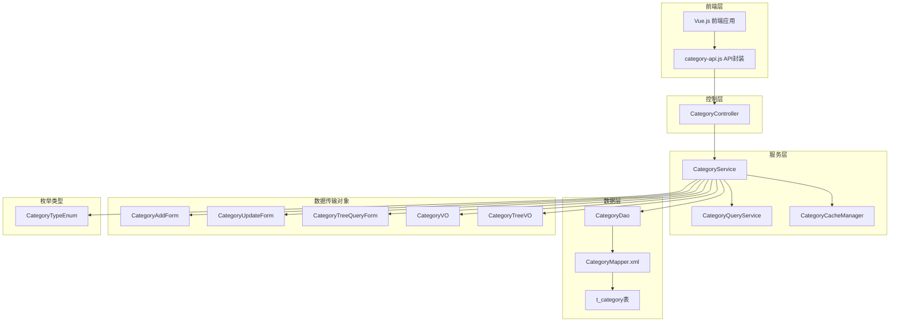
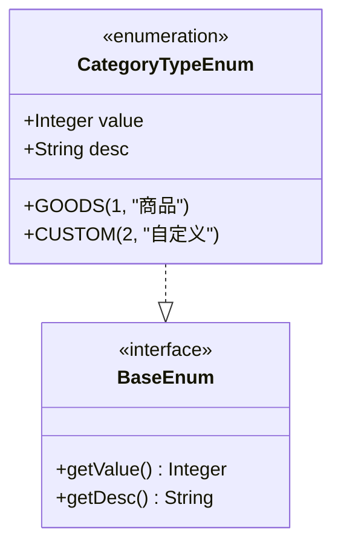
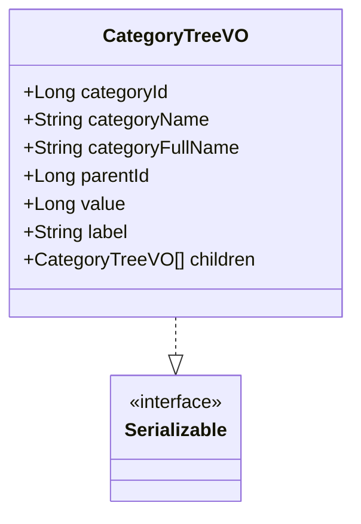
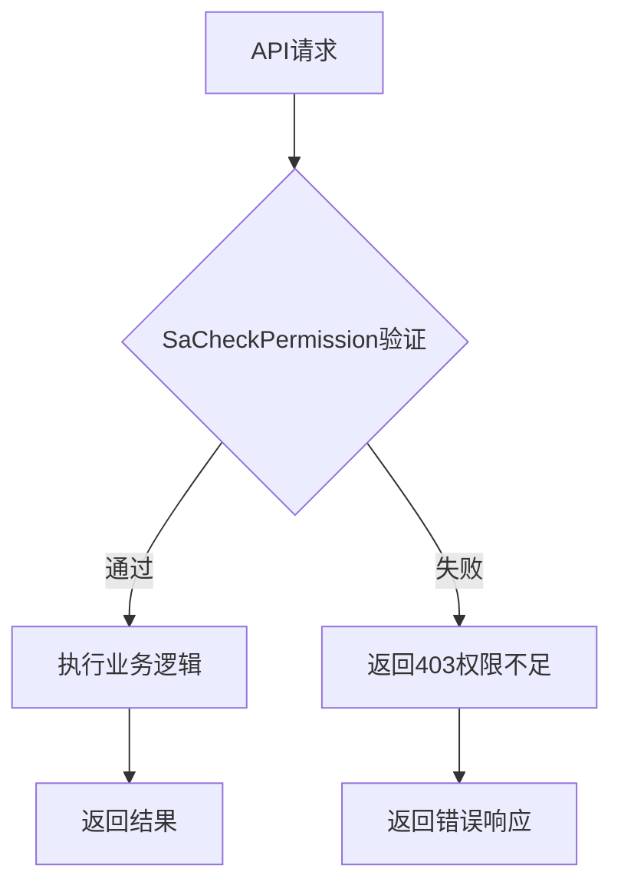
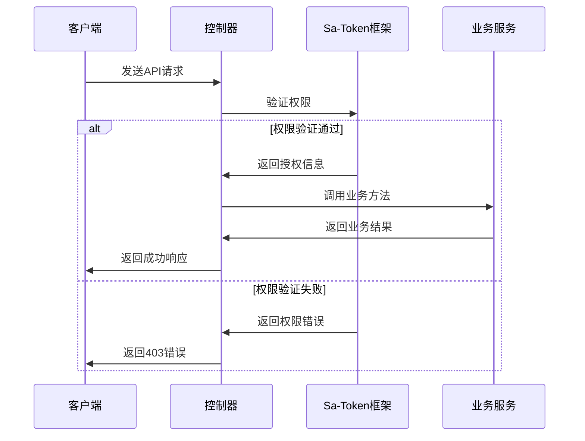
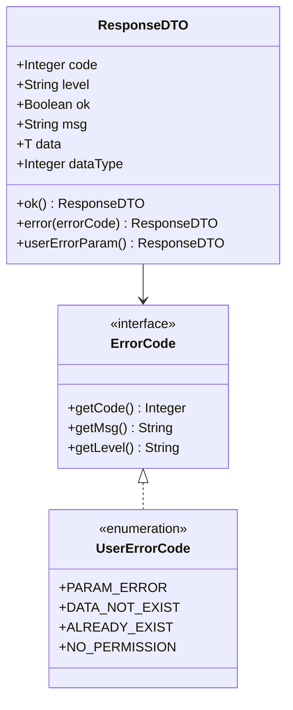
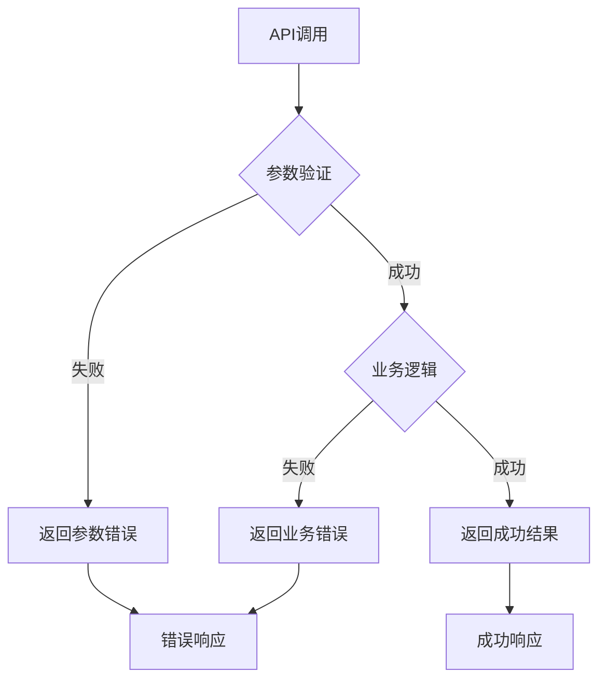

# 分类管理API文档

<cite>
**本文档引用的文件**
- [CategoryController.java](file://smart-admin-api-java17-springboot3\sa-admin\src\main\java\net\lab1024\sa\admin\module\business\category\controller\CategoryController.java)
- [CategoryService.java](file://smart-admin-api-java17-springboot3\sa-admin\src\main\java\net\lab1024\sa\admin\module\business\category\service\CategoryService.java)
- [CategoryAddForm.java](file://smart-admin-api-java17-springboot3\sa-admin\src\main\java\net\lab1024\sa\admin\module\business\category\domain\form\CategoryAddForm.java)
- [CategoryUpdateForm.java](file://smart-admin-api-java17-springboot3\sa-admin\src\main\java\net\lab1024\sa\admin\module\business\category\domain\form\CategoryUpdateForm.java)
- [CategoryTreeQueryForm.java](file://smart-admin-api-java17-springboot3\sa-admin\src\main\java\net\lab1024\sa\admin\module\business\category\domain\form\CategoryTreeQueryForm.java)
- [CategoryTreeVO.java](file://smart-admin-api-java17-springboot3\sa-admin\src\main\java\net\lab1024\sa\admin\module\business\category\domain\vo\CategoryTreeVO.java)
- [CategoryVO.java](file://smart-admin-api-java17-springboot3\sa-admin\src\main\java\net\lab1024\sa\admin\module\business\category\domain\vo\CategoryVO.java)
- [CategoryTypeEnum.java](file://smart-admin-api-java17-springboot3\sa-admin\src\main\java\net\lab1024\sa\admin\module\business\category\constant\CategoryTypeEnum.java)
- [category-api.js](file://smart-admin-web-javascript\src\api\business\category\category-api.js)
- [CategoryMapper.xml](file://smart-admin-api-java17-springboot3\sa-admin\src\main\resources\mapper\business\category\CategoryMapper.xml)
- [ResponseDTO.java](file://smart-admin-api-java17-springboot3\sa-base\src\main\java\net\lab1024\sa\base\common\domain\ResponseDTO.java)
- [AdminSwaggerTagConst.java](file://smart-admin-api-java17-springboot3\sa-admin\src\main\java\net\lab1024\sa\admin\constant\AdminSwaggerTagConst.java)
</cite>

## 目录
1. [简介](#简介)
2. [项目架构](#项目架构)
3. [核心组件](#核心组件)
4. [API接口详解](#api接口详解)
5. [数据模型](#数据模型)
6. [权限控制](#权限控制)
7. [错误处理](#错误处理)
8. [请求响应示例](#请求响应示例)
9. [最佳实践](#最佳实践)

## 简介

分类管理模块是Smart Admin系统的核心业务模块之一，提供了完整的类目增删改查和树形结构查询功能。该模块支持商品分类和自定义分类两种类型，采用RESTful API设计，具备完善的权限控制和参数验证机制。

### 主要功能特性
- **多类型分类支持**：支持商品(GOODS)和自定义(CUSTOM)两种分类类型
- **树形结构管理**：支持无限层级的分类树形结构
- **权限控制**：基于Sa-Token的细粒度权限控制
- **参数验证**：使用Javax Validation进行参数校验
- **缓存优化**：采用Redis缓存提升查询性能
- **级联操作**：支持子类自动删除和父类验证

## 项目架构



**图表来源**
- [CategoryController.java](file://smart-admin-api-java17-springboot3\sa-admin\src\main\java\net\lab1024\sa\admin\module\business\category\controller\CategoryController.java#L19-L68)
- [CategoryService.java](file://smart-admin-api-java17-springboot3\sa-admin\src\main\java\net\lab1024\sa\admin\module\business\category\service\CategoryService.java#L33-L207)

## 核心组件

### CategoryController - 控制器层
负责HTTP请求的接收和响应的返回，实现了以下核心功能：
- **添加类目**：处理类目创建请求
- **更新类目**：处理类目修改请求  
- **查询类目详情**：获取单个类目详细信息
- **查询类目树**：获取树形结构分类数据
- **删除类目**：处理类目删除请求

### CategoryService - 服务层
实现业务逻辑的核心服务，包含：
- **类目验证**：确保类目名称唯一性和父子关系正确性
- **树形结构构建**：递归构建分类树形结构
- **缓存管理**：管理分类数据的缓存策略
- **级联操作**：处理子类删除和父类验证

### 数据传输对象
- **Form类**：用于接收和验证请求参数
- **VO类**：用于返回给前端的数据结构
- **Entity类**：数据库实体映射

**章节来源**
- [CategoryController.java](file://smart-admin-api-java17-springboot3\sa-admin\src\main\java\net\lab1024\sa\admin\module\business\category\controller\CategoryController.java#L19-L68)
- [CategoryService.java](file://smart-admin-api-java17-springboot3\sa-admin\src\main\java\net\lab1024\sa\admin\module\business\category\service\CategoryService.java#L33-L207)

## API接口详解

### 1. 添加类目 (/category/add)

#### 接口描述
创建新的分类类目，支持指定父类目和分类类型。

#### HTTP方法
`POST /category/add`

#### 权限要求
`category:add`

#### 请求参数
| 参数名 | 类型 | 必填 | 描述 | 验证规则 |
|--------|------|------|------|----------|
| categoryName | String | 是 | 类目名称 | 非空，最大20字符 |
| categoryType | Integer | 是 | 分类类型 | 枚举值：1-商品，2-自定义 |
| parentId | Long | 否 | 父级类目ID | 可选，默认根节点 |
| sort | Integer | 否 | 排序权重 | 可选，默认0 |
| remark | String | 否 | 备注信息 | 最大200字符 |
| disabledFlag | Boolean | 是 | 是否禁用 | 非空 |

#### 请求示例
```json
{
  "categoryName": "电子产品",
  "categoryType": 1,
  "parentId": 0,
  "sort": 1,
  "remark": "用于存放各种电子设备",
  "disabledFlag": false
}
```

#### 响应格式
```json
{
  "code": 0,
  "msg": "操作成功",
  "data": null,
  "ok": true
}
```

#### 参数验证
- 使用`@Valid`注解进行参数校验
- `@NotBlank`：类目名称不能为空
- `@Length`：类目名称长度限制
- `@CheckEnum`：分类类型必须是有效枚举值
- `@NotNull`：禁用状态不能为空

**章节来源**
- [CategoryController.java](file://smart-admin-api-java17-springboot3\sa-admin\src\main\java\net\lab1024\sa\admin\module\business\category\controller\CategoryController.java#L36-L40)
- [CategoryAddForm.java](file://smart-admin-api-java17-springboot3\sa-admin\src\main\java\net\lab1024\sa\admin\module\business\category\domain\form\CategoryAddForm.java#L24-L46)

### 2. 更新类目 (/category/update)

#### 接口描述
更新现有类目的信息，不支持修改父类目和分类类型。

#### HTTP方法
`POST /category/update`

#### 权限要求
`category:update`

#### 请求参数
| 参数名 | 类型 | 必填 | 描述 | 验证规则 |
|--------|------|------|------|----------|
| categoryId | Long | 是 | 类目ID | 非空，必须存在 |
| categoryName | String | 是 | 类目名称 | 非空，最大20字符 |
| sort | Integer | 否 | 排序权重 | 可选 |
| remark | String | 否 | 备注信息 | 最大200字符 |
| disabledFlag | Boolean | 是 | 是否禁用 | 非空 |

#### 请求示例
```json
{
  "categoryId": 1001,
  "categoryName": "智能电子产品",
  "sort": 2,
  "remark": "升级后的电子产品分类",
  "disabledFlag": false
}
```

#### 响应格式
```json
{
  "code": 0,
  "msg": "操作成功",
  "data": null,
  "ok": true
}
```

#### 特殊约束
- 不能修改`categoryType`字段
- 不能修改`parentId`字段
- 会自动保留原有的分类类型和父类目关系

**章节来源**
- [CategoryController.java](file://smart-admin-api-java17-springboot3\sa-admin\src\main\java\net\lab1024\sa\admin\module\business\category\controller\CategoryController.java#L43-L47)
- [CategoryUpdateForm.java](file://smart-admin-api-java17-springboot3\sa-admin\src\main\java\net\lab1024\sa\admin\module\business\category\domain\form\CategoryUpdateForm.java#L16-L22)

### 3. 查询类目详情 (/category/{categoryId})

#### 接口描述
根据类目ID获取类目的详细信息。

#### HTTP方法
`GET /category/{categoryId}`

#### 权限要求
无需特殊权限

#### 路径参数
| 参数名 | 类型 | 必填 | 描述 |
|--------|------|------|------|
| categoryId | Long | 是 | 类目唯一标识符 |

#### 响应格式
```json
{
  "code": 0,
  "msg": "操作成功",
  "data": {
    "categoryId": 1001,
    "categoryName": "智能电子产品",
    "categoryType": 1,
    "parentId": 0,
    "sort": 2,
    "remark": "升级后的电子产品分类",
    "disabledFlag": false,
    "createTime": "2024-01-15T10:30:00",
    "updateTime": "2024-01-15T14:45:00"
  },
  "ok": true
}
```

**章节来源**
- [CategoryController.java](file://smart-admin-api-java17-springboot3\sa-admin\src\main\java\net\lab1024\sa\admin\module\business\category\controller\CategoryController.java#L50-L53)
- [CategoryVO.java](file://smart-admin-api-java17-springboot3\sa-admin\src\main\java\net\lab1024\sa\admin\module\business\category\domain\vo\CategoryVO.java#L19-L46)

### 4. 查询类目层级树 (/category/tree)

#### 接口描述
获取分类的树形结构数据，支持按分类类型筛选。

#### HTTP方法
`POST /category/tree`

#### 权限要求
`category:tree`

#### 请求参数
| 参数名 | 类型 | 必填 | 描述 | 验证规则 |
|--------|------|------|------|----------|
| categoryType | Integer | 否 | 分类类型 | 可选，但父ID为空时必填 |
| parentId | Long | 否 | 父级类目ID | 可选，默认根节点 |

#### 请求示例
```json
{
  "categoryType": 1,
  "parentId": 0
}
```

#### 响应格式
```json
{
  "code": 0,
  "msg": "操作成功",
  "data": [
    {
      "categoryId": 1001,
      "categoryName": "电子产品",
      "categoryFullName": "电子产品",
      "parentId": 0,
      "value": 1001,
      "label": "电子产品",
      "children": [
        {
          "categoryId": 1002,
          "categoryName": "手机",
          "categoryFullName": "电子产品 > 手机",
          "parentId": 1001,
          "value": 1002,
          "label": "手机",
          "children": []
        }
      ]
    }
  ],
  "ok": true
}
```

#### 树形结构特点
- **层级关系**：通过`children`数组表示子节点
- **全路径**：`categoryFullName`包含从根到当前节点的完整路径
- **兼容性**：同时提供`value`和`label`字段，便于前端组件使用

**章节来源**
- [CategoryController.java](file://smart-admin-api-java17-springboot3\sa-admin\src\main\java\net\lab1024\sa\admin\module\business\category\controller\CategoryController.java#L55-L59)
- [CategoryTreeQueryForm.java](file://smart-admin-api-java17-springboot3\sa-admin\src\main\java\net\lab1024\sa\admin\module\business\category\domain\form\CategoryTreeQueryForm.java#L17-L25)
- [CategoryTreeVO.java](file://smart-admin-api-java17-springboot3\sa-admin\src\main\java\net\lab1024\sa\admin\module\business\category\domain\vo\CategoryTreeVO.java#L18-L43)

### 5. 删除类目 (/category/delete/{categoryId})

#### 接口描述
删除指定的类目，如果存在子类目则不允许删除。

#### HTTP方法
`GET /category/delete/{categoryId}`

#### 权限要求
`category:delete`

#### 路径参数
| 参数名 | 类型 | 必填 | 描述 |
|--------|------|------|------|
| categoryId | Long | 是 | 要删除的类目ID |

#### 删除规则
- **级联检查**：检查是否存在子类目
- **软删除**：标记`deleted_flag`为true，而非物理删除
- **权限验证**：必须具有删除权限

#### 响应格式
```json
{
  "code": 0,
  "msg": "操作成功",
  "data": null,
  "ok": true
}
```

#### 错误情况
- **子类存在**：返回"请先删除子级类目"
- **类目不存在**：返回"数据不存在"

**章节来源**
- [CategoryController.java](file://smart-admin-api-java17-springboot3\sa-admin\src\main\java\net\lab1024\sa\admin\module\business\category\controller\CategoryController.java#L63-L67)
- [CategoryService.java](file://smart-admin-api-java17-springboot3\sa-admin\src\main\java\net\lab1024\sa\admin\module\business\category\service\CategoryService.java#L184-L203)

## 数据模型

### 分类类型枚举 (CategoryTypeEnum)



**图表来源**
- [CategoryTypeEnum.java](file://smart-admin-api-java17-springboot3\sa-admin\src\main\java\net\lab1024\sa\admin\module\business\category\constant\CategoryTypeEnum.java#L17-L36)

#### 枚举值说明
| 值 | 名称 | 描述 |
|----|------|------|
| 1 | GOODS | 商品分类 |
| 2 | CUSTOM | 自定义分类 |

### 树形结构数据模型 (CategoryTreeVO)



**图表来源**
- [CategoryTreeVO.java](file://smart-admin-api-java17-springboot3\sa-admin\src\main\java\net\lab1024\sa\admin\module\business\category\domain\vo\CategoryTreeVO.java#L18-L43)

#### 字段说明
| 字段名 | 类型 | 描述 | 用途 |
|--------|------|------|------|
| categoryId | Long | 类目唯一标识 | 数据库主键 |
| categoryName | String | 类目显示名称 | 用户界面显示 |
| categoryFullName | String | 完整类目路径 | 显示完整的层级关系 |
| parentId | Long | 父类目ID | 树形结构的父节点 |
| value | Long | 值字段 | 兼容前端组件 |
| label | String | 标签字段 | 兼容前端组件 |
| children | List<CategoryTreeVO> | 子节点列表 | 递归构建树形结构 |

### 实体模型对比

| 组件 | CategoryVO | CategoryTreeVO | CategoryAddForm | CategoryUpdateForm |
|------|------------|----------------|-----------------|-------------------|
| 主要用途 | 详情展示 | 树形展示 | 添加请求 | 更新请求 |
| 包含字段 | 完整字段集 | 树形结构字段 | 必填字段 | 继承添加字段 |
| 数据来源 | 数据库查询 | 缓存构建 | 请求参数 | 请求参数 |
| 输出格式 | JSON详情 | JSON树形 | JSON添加 | JSON更新 |

**章节来源**
- [CategoryVO.java](file://smart-admin-api-java17-springboot3\sa-admin\src\main\java\net\lab1024\sa\admin\module\business\category\domain\vo\CategoryVO.java#L19-L46)
- [CategoryTreeVO.java](file://smart-admin-api-java17-springboot3\sa-admin\src\main\java\net\lab1024\sa\admin\module\business\category\domain\vo\CategoryTreeVO.java#L18-L43)

## 权限控制

### Sa-Token权限注解

系统使用Sa-Token框架进行权限控制，每个API都标注了相应的权限要求：



#### 权限配置表

| API接口 | 权限标识 | 描述 | 访问条件 |
|---------|----------|------|----------|
| 添加类目 | `category:add` | 创建新类目 | 具有添加权限 |
| 更新类目 | `category:update` | 修改现有类目 | 具有更新权限 |
| 查询类目树 | `category:tree` | 获取树形结构 | 具有查询权限 |
| 删除类目 | `category:delete` | 删除类目 | 具有删除权限 |
| 查询类目详情 | 无特殊权限 | 获取类目详情 | 无需特殊权限 |

### 权限验证流程



**图表来源**
- [CategoryController.java](file://smart-admin-api-java17-springboot3\sa-admin\src\main\java\net\lab1024\sa\admin\module\business\category\controller\CategoryController.java#L37-L67)

**章节来源**
- [CategoryController.java](file://smart-admin-api-java17-springboot3\sa-admin\src\main\java\net\lab1024\sa\admin\module\business\category\controller\CategoryController.java#L37-L67)

## 错误处理

### ResponseDTO统一响应格式

系统采用统一的响应格式，所有API都返回`ResponseDTO<T>`对象：



**图表来源**
- [ResponseDTO.java](file://smart-admin-api-java17-springboot3\sa-base\src\main\java\net\lab1024\sa\base\common\domain\ResponseDTO.java#L18-L121)

### 常见错误码

| 错误码 | 错误消息 | 触发条件 | 解决方案 |
|--------|----------|----------|----------|
| 30001 | 参数错误 | 请求参数验证失败 | 检查请求参数格式和必填项 |
| 30002 | 数据不存在 | 查询的类目不存在 | 确认类目ID的有效性 |
| 30003 | 数据已存在 | 同级下存在相同类目 | 修改类目名称或选择不同父类目 |
| 30005 | 权限不足 | 无相应操作权限 | 联系管理员分配权限 |
| 30006 | 系统开发中 | 功能尚未实现 | 稍后重试或联系技术支持 |

### 错误处理流程



**章节来源**
- [ResponseDTO.java](file://smart-admin-api-java17-springboot3\sa-base\src\main\java\net\lab1024\sa\base\common\domain\ResponseDTO.java#L86-L121)
- [UserErrorCode.java](file://smart-admin-api-java17-springboot3\sa-base\src\main\java\net\lab1024\sa\base\common\code\UserErrorCode.java#L14-L52)

## 请求响应示例

### 添加类目示例

#### 成功请求
**请求URL**: `POST /category/add`
**请求头**: `Content-Type: application/json`

```json
{
  "categoryName": "家用电器",
  "categoryType": 1,
  "parentId": 0,
  "sort": 3,
  "remark": "包括各种家用电器产品",
  "disabledFlag": false
}
```

**响应**:
```json
{
  "code": 0,
  "msg": "操作成功",
  "data": null,
  "ok": true
}
```

#### 参数错误示例
**请求**:
```json
{
  "categoryName": "",
  "categoryType": 1,
  "parentId": 0,
  "sort": 3,
  "remark": "超过最大长度限制的备注信息...",
  "disabledFlag": null
}
```

**响应**:
```json
{
  "code": 30001,
  "level": "USER",
  "msg": "类目名称不能为空",
  "data": null,
  "ok": false
}
```

### 查询类目树示例

#### 成功请求
**请求URL**: `POST /category/tree`
**请求体**:
```json
{
  "categoryType": 1,
  "parentId": 0
}
```

**响应**:
```json
{
  "code": 0,
  "msg": "操作成功",
  "data": [
    {
      "categoryId": 1001,
      "categoryName": "电子产品",
      "categoryFullName": "电子产品",
      "parentId": 0,
      "value": 1001,
      "label": "电子产品",
      "children": [
        {
          "categoryId": 1002,
          "categoryName": "手机",
          "categoryFullName": "电子产品 > 手机",
          "parentId": 1001,
          "value": 1002,
          "label": "手机",
          "children": []
        },
        {
          "categoryId": 1003,
          "categoryName": "电脑",
          "categoryFullName": "电子产品 > 电脑",
          "parentId": 1001,
          "value": 1003,
          "label": "电脑",
          "children": [
            {
              "categoryId": 1004,
              "categoryName": "笔记本",
              "categoryFullName": "电子产品 > 电脑 > 笔记本",
              "parentId": 1003,
              "value": 1004,
              "label": "笔记本",
              "children": []
            }
          ]
        }
      ]
    }
  ],
  "ok": true
}
```

#### 无数据示例
**请求**:
```json
{
  "categoryType": 1,
  "parentId": 9999
}
```

**响应**:
```json
{
  "code": 0,
  "msg": "操作成功",
  "data": [],
  "ok": true
}
```

### 删除类目示例

#### 成功删除
**请求URL**: `GET /category/delete/1001`

**响应**:
```json
{
  "code": 0,
  "msg": "操作成功",
  "data": null,
  "ok": true
}
```

#### 删除失败示例
**请求**: `GET /category/delete/1001`

**响应**:
```json
{
  "code": 30001,
  "level": "USER",
  "msg": "请先删除子级类目",
  "data": null,
  "ok": false
}
```

**章节来源**
- [category-api.js](file://smart-admin-web-javascript\src\api\business\category\category-api.js#L12-L30)

## 最佳实践

### 1. 分类类型选择建议

- **商品分类**：适用于电商平台的商品目录
- **自定义分类**：适用于系统内部的业务分类

### 2. 树形结构设计原则

- **层级深度**：建议不超过5层，避免过深的嵌套
- **命名规范**：使用清晰、一致的类目名称
- **排序策略**：合理设置sort字段，确保显示顺序

### 3. 性能优化建议

- **缓存策略**：利用CategoryCacheManager缓存树形结构
- **批量查询**：对于大量数据，考虑分页查询
- **索引优化**：确保parent_id和category_type字段有索引

### 4. 安全注意事项

- **权限分离**：不同类型的分类操作应有不同的权限控制
- **输入验证**：严格验证所有用户输入参数
- **审计日志**：记录重要的分类操作，便于追踪

### 5. 前端集成指南

- **树形组件**：推荐使用支持异步加载的树形组件
- **懒加载**：对于大型分类树，实现懒加载机制
- **本地缓存**：在前端缓存常用分类数据，减少网络请求

### 6. 数据一致性保证

- **事务处理**：在复杂操作中使用数据库事务
- **并发控制**：防止同时修改同一分类导致的数据冲突
- **版本控制**：考虑实现乐观锁机制

通过遵循这些最佳实践，可以确保分类管理系统的稳定性、性能和用户体验。