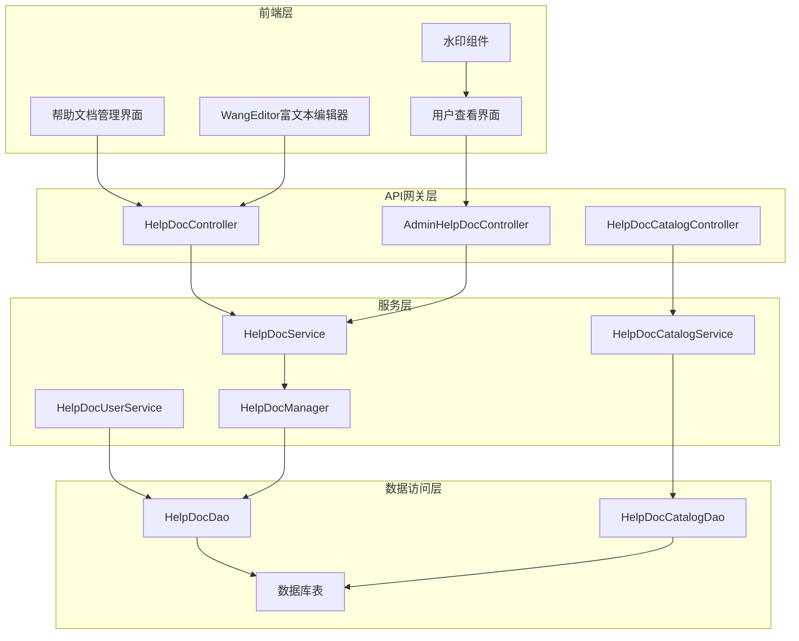
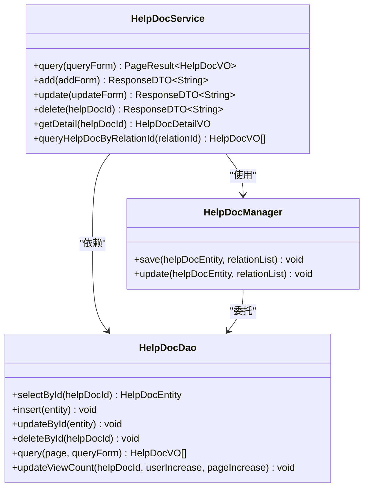
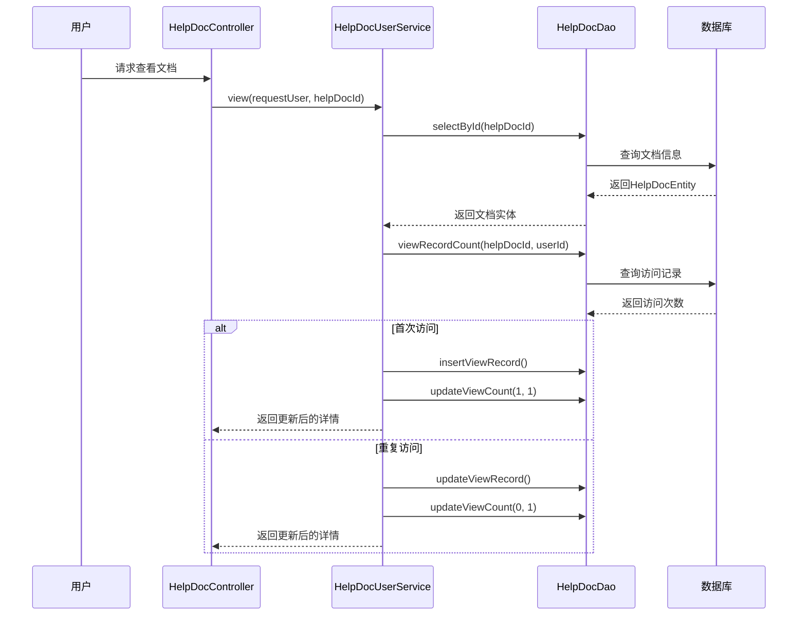
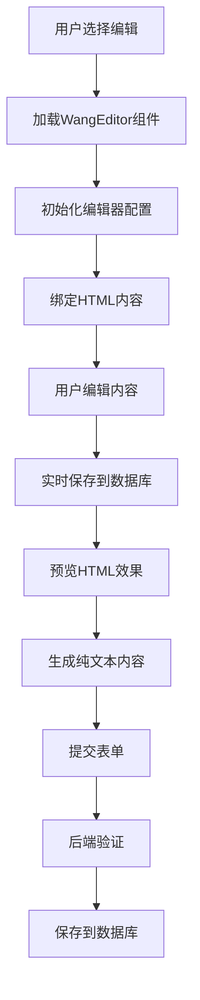
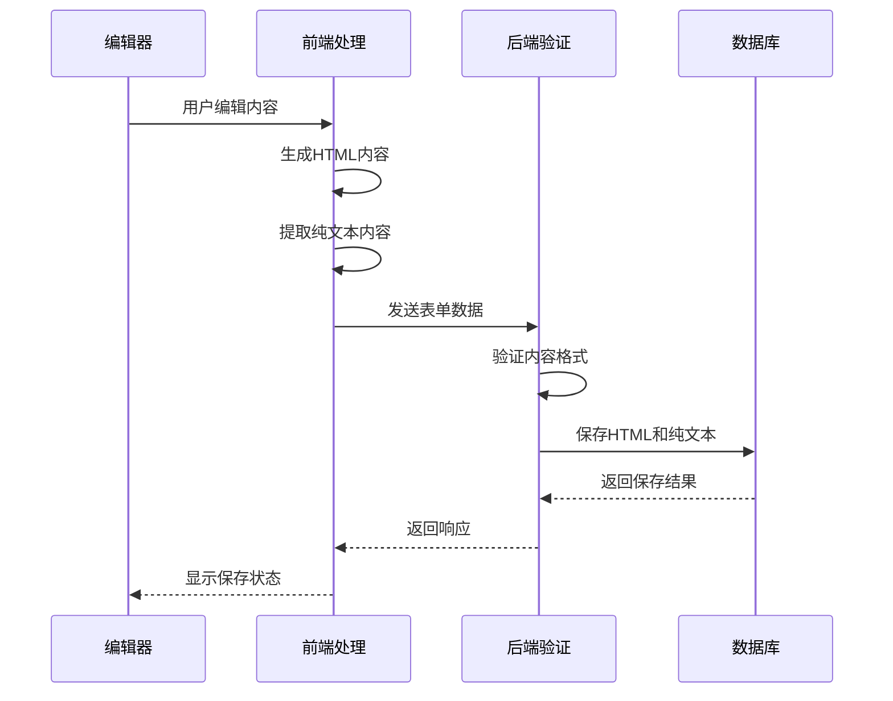
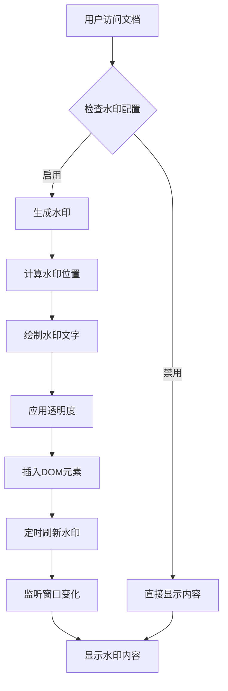
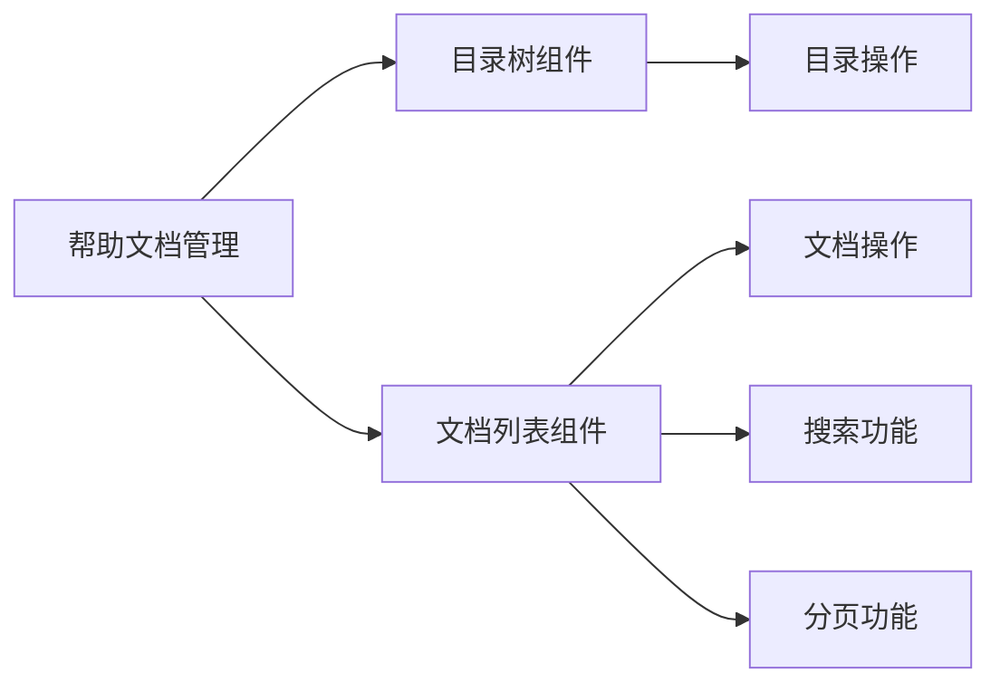
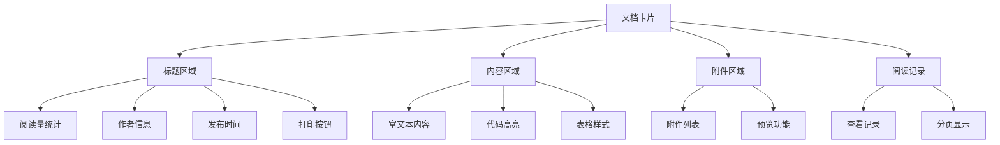

# 帮助文档API

<cite>
**本文档引用的文件**
- [HelpDocController.java](file://smart-admin-api-java17-springboot3/sa-base/src/main/java/net/lab1024/sa/base/module/support/helpdoc/controller/HelpDocController.java)
- [AdminHelpDocController.java](file://smart-admin-api-java17-springboot3/sa-admin/src/main/java/net/lab1024/sa/admin/module/system/support/AdminHelpDocController.java)
- [HelpDocService.java](file://smart-admin-api-java17-springboot3/sa-base/src/main/java/net/lab1024/sa/base/module/support/helpdoc/service/HelpDocService.java)
- [HelpDocUserService.java](file://smart-admin-api-java17-springboot3/sa-base/src/main/java/net/lab1024/sa/base/module/support/helpdoc/service/HelpDocUserService.java)
- [HelpDocCatalogService.java](file://smart-admin-api-java17-springboot3/sa-base/src/main/java/net/lab1024/sa/base/module/support/helpdoc/service/HelpDocCatalogService.java)
- [HelpDocEntity.java](file://smart-admin-api-java17-springboot3/sa-base/src/main/java/net/lab1024/sa/base/module/support/helpdoc/domain/entity/HelpDocEntity.java)
- [HelpDocAddForm.java](file://smart-admin-api-java17-springboot3/sa-base/src/main/java/net/lab1024/sa/base/module/support/helpdoc/domain/form/HelpDocAddForm.java)
- [HelpDocDetailVO.java](file://smart-admin-api-java17-springboot3/sa-base/src/main/java/net/lab1024/sa/base/module/support/helpdoc/domain/vo/HelpDocDetailVO.java)
- [help-doc-api.js](file://smart-admin-web-javascript/src/api/support/help-doc-api.js)
- [help-doc-catalog-api.js](file://smart-admin-web-javascript/src/api/support/help-doc-catalog-api.js)
- [help-doc-user-view.vue](file://smart-admin-web-javascript/src/views/support/help-doc/user-view/help-doc-user-view.vue)
- [smart-watermark.js](file://smart-admin-web-javascript/src/lib/smart-watermark.js)
</cite>

## 目录
1. [简介](#简介)
2. [系统架构](#系统架构)
3. [API接口设计](#api接口设计)
4. [服务层功能](#服务层功能)
5. [数据模型](#数据模型)
6. [富文本处理机制](#富文本处理机制)
7. [安全过滤策略](#安全过滤策略)
8. [增强功能](#增强功能)
9. [前端组件](#前端组件)
10. [最佳实践](#最佳实践)

## 简介

帮助文档系统是一个完整的文档管理解决方案，提供文档的增删改查、分类管理、权限控制、版本管理、访问统计等功能。系统采用前后端分离架构，后端基于Spring Boot框架，前端使用Vue.js技术栈，支持富文本编辑、水印保护、访问日志等高级功能。

## 系统架构

**图表来源**
- [HelpDocController.java](file://smart-admin-api-java17-springboot3/sa-base/src/main/java/net/lab1024/sa/base/module/support/helpdoc/controller/HelpDocController.java#L25-L77)
- [AdminHelpDocController.java](file://smart-admin-api-java17-springboot3/sa-admin/src/main/java/net/lab1024/sa/admin/module/system/support/AdminHelpDocController.java#L23-L104)

## API接口设计

### 文档管理接口

#### 用户端接口

| 接口路径 | 方法 | 功能描述 | 权限要求 |
|---------|------|----------|----------|
| `/helpDoc/user/queryAllHelpDocList` | GET | 查询所有帮助文档 | 无 |
| `/helpDoc/user/view/{helpDocId}` | GET | 查看帮助文档详情 | 无 |
| `/helpDoc/user/queryViewRecord` | POST | 查询查看记录 | 无 |

#### 管理端接口

| 接口路径 | 方法 | 功能描述 | 权限要求 |
|---------|------|----------|----------|
| `/helpDoc/query` | POST | 分页查询帮助文档 | support:helpDoc:query |
| `/helpDoc/getDetail/{helpDocId}` | GET | 获取帮助文档详情 | support:helpDoc:add |
| `/helpDoc/add` | POST | 添加帮助文档 | 无 |
| `/helpDoc/update` | POST | 更新帮助文档 | 无 |
| `/helpDoc/delete/{helpDocId}` | GET | 删除帮助文档 | 无 |
| `/helpDoc/queryHelpDocByRelationId/{relationId}` | GET | 根据关联ID查询文档 | 无 |

**节来源**
- [HelpDocController.java](file://smart-admin-api-java17-springboot3/sa-base/src/main/java/net/lab1024/sa/base/module/support/helpdoc/controller/HelpDocController.java#L46-L77)
- [AdminHelpDocController.java](file://smart-admin-api-java17-springboot3/sa-admin/src/main/java/net/lab1024/sa/admin/module/system/support/AdminHelpDocController.java#L65-L104)

### 目录管理接口

| 接口路径 | 方法 | 功能描述 | 权限要求 |
|---------|------|----------|----------|
| `/helpDoc/helpDocCatalog/getAll` | GET | 获取所有目录 | 无 |
| `/helpDoc/helpDocCatalog/add` | POST | 添加目录 | 无 |
| `/helpDoc/helpDocCatalog/update` | POST | 更新目录 | 无 |
| `/helpDoc/helpDocCatalog/delete/{helpDocCatalogId}` | GET | 删除目录 | 无 |

**节来源**
- [AdminHelpDocController.java](file://smart-admin-api-java17-springboot3/sa-admin/src/main/java/net/lab1024/sa/admin/module/system/support/AdminHelpDocController.java#L44-L60)

## 服务层功能

### HelpDocService - 文档业务逻辑

HelpDocService是文档管理的核心服务，负责处理文档的增删改查、版本管理和关联关系维护。

**图表来源**
- [HelpDocService.java](file://smart-admin-api-java17-springboot3/sa-base/src/main/java/net/lab1024/sa/base/module/support/helpdoc/service/HelpDocService.java#L32-L121)

#### 核心功能

1. **文档查询与分页**
   - 支持按标题、分类、作者等条件查询
   - 提供分页功能，优化大数据量场景

2. **文档生命周期管理**
   - 添加文档时自动处理关联关系
   - 更新文档时保持数据一致性
   - 删除文档时清理关联数据

3. **访问统计**
   - 记录页面浏览量和用户浏览量
   - 区分首次访问和重复访问
   - 更新统计数据并返回最新值

**节来源**
- [HelpDocService.java](file://smart-admin-api-java17-springboot3/sa-base/src/main/java/net/lab1024/sa/base/module/support/helpdoc/service/HelpDocService.java#L47-L121)

### HelpDocUserService - 用户服务

HelpDocUserService专门处理用户端的文档查看功能，包括访问记录、查看统计等。

**图表来源**
- [HelpDocUserService.java](file://smart-admin-api-java17-springboot3/sa-base/src/main/java/net/lab1024/sa/base/module/support/helpdoc/service/HelpDocUserService.java#L51-L71)

**节来源**
- [HelpDocUserService.java](file://smart-admin-api-java17-springboot3/sa-base/src/main/java/net/lab1024/sa/base/module/support/helpdoc/service/HelpDocUserService.java#L30-L86)

### HelpDocCatalogService - 目录服务

HelpDocCatalogService负责文档分类的管理，支持树形结构的目录组织。

#### 目录管理特性

1. **唯一性检查**
   - 添加目录时检查名称是否重复
   - 更新目录时排除自身检查

2. **级联删除保护**
   - 检查是否存在子目录
   - 检查是否有关联文档
   - 只有空目录才能删除

3. **同步操作**
   - 使用`synchronized`确保并发安全
   - 防止重复添加相同名称的目录

**节来源**
- [HelpDocCatalogService.java](file://smart-admin-api-java17-springboot3/sa-base/src/main/java/net/lab1024/sa/base/module/support/helpdoc/service/HelpDocCatalogService.java#L29-L116)

## 数据模型

### HelpDocEntity - 文档实体

HelpDocEntity是数据库表`t_help_doc`的映射实体，包含文档的所有基础属性。

| 字段名 | 类型 | 描述 | 约束 |
|--------|------|------|------|
| helpDocId | Long | 文档ID | 主键，自增 |
| helpDocCatalogId | Long | 分类ID | 外键，不能为空 |
| title | String | 标题 | 最大200字符，不能为空 |
| contentText | String | 纯文本内容 | 不能为空 |
| contentHtml | String | HTML内容 | 不能为空 |
| attachment | String | 附件列表 | 英文逗号分隔，最大1000字符 |
| sort | Integer | 排序权重 | 不能为空 |
| pageViewCount | Integer | 页面浏览量 | 默认0 |
| userViewCount | Integer | 用户浏览量 | 默认0 |
| author | String | 作者 | 最大50字符，不能为空 |
| createTime | LocalDateTime | 创建时间 | 自动生成 |
| updateTime | LocalDateTime | 更新时间 | 自动生成 |

**节来源**
- [HelpDocEntity.java](file://smart-admin-api-java17-springboot3/sa-base/src/main/java/net/lab1024/sa/base/module/support/helpdoc/domain/entity/HelpDocEntity.java#L22-L76)

### 表单验证

#### HelpDocAddForm - 添加表单

添加文档时的表单验证规则：

| 字段 | 验证规则 | 错误提示 |
|------|----------|----------|
| title | @NotBlank, @Length(max=200) | 标题不能为空，最多200字符 |
| helpDocCatalogId | @NotNull | 分类不能为空 |
| contentText | @NotNull | 文本内容不能为空 |
| contentHtml | @NotNull | HTML内容不能为空 |
| attachment | @Length(max=1000) | 附件最多1000字符 |
| sort | @NotNull | 排序不能为空 |
| author | @NotBlank | 作者不能为空 |

**节来源**
- [HelpDocAddForm.java](file://smart-admin-api-java17-springboot3/sa-base/src/main/java/net/lab1024/sa/base/module/support/helpdoc/domain/form/HelpDocAddForm.java#L23-L57)

### 视图对象

#### HelpDocDetailVO - 详情视图

详情视图包含了文档的所有展示信息，以及关联项目的列表。

| 字段 | 类型 | 描述 |
|------|------|------|
| helpDocId | Long | 文档ID |
| title | String | 标题 |
| helpDocCatalogId | Long | 分类ID |
| helpDocCatalogName | String | 分类名称 |
| contentText | String | 纯文本内容 |
| contentHtml | String | HTML内容 |
| attachment | String | 附件列表 |
| author | String | 作者 |
| pageViewCount | Integer | 页面浏览量 |
| userViewCount | Integer | 用户浏览量 |
| createTime | LocalDateTime | 创建时间 |
| updateTime | LocalDateTime | 更新时间 |
| relationList | List<HelpDocRelationVO> | 关联项目列表 |

**节来源**
- [HelpDocDetailVO.java](file://smart-admin-api-java17-springboot3/sa-base/src/main/java/net/lab1024/sa/base/module/support/helpdoc/domain/vo/HelpDocDetailVO.java#L22-L65)

## 富文本处理机制

### WangEditor集成

系统集成了WangEditor富文本编辑器，提供强大的文档编辑功能。

**图表来源**
- [index.vue](file://smart-admin-web-javascript/src/components/framework/wangeditor/index.vue#L1-L118)

#### 编辑器特性

1. **多格式支持**
   - 支持富文本编辑
   - 自动转换为HTML格式
   - 生成对应的纯文本内容

2. **附件上传**
   - 支持图片、文档等文件上传
   - 自动处理文件存储路径
   - 提供预览功能

3. **实时预览**
   - 编辑时实时预览效果
   - 支持打印功能
   - 响应式布局适配

**节来源**
- [index.vue](file://smart-admin-web-javascript/src/components/framework/wangeditor/index.vue#L1-L118)

### 内容处理流程

## 安全过滤策略

### XSS防护

系统实现了多层次的安全防护机制，防止恶意代码注入。

#### 前端安全措施

1. **HTML渲染安全**
   - 使用`v-html`指令渲染HTML内容
   - 对用户输入进行严格验证
   - 防止脚本注入攻击

2. **文件上传安全**
   - 限制文件类型和大小
   - 检查文件内容安全性
   - 存储到安全目录

#### 后端安全措施

1. **输入验证**
   - 使用Jakarta Bean Validation进行参数校验
   - 检查字符串长度和格式
   - 防止SQL注入攻击

2. **内容过滤**
   - 过滤危险HTML标签
   - 移除JavaScript事件处理器
   - 限制CSS样式使用

### 权限控制

#### 角色权限

| 权限标识 | 描述 | 可执行操作 |
|----------|------|------------|
| support:helpDoc:query | 查询权限 | 查看文档列表和详情 |
| support:helpDoc:add | 添加权限 | 创建新的帮助文档 |
| support:helpDoc:update | 更新权限 | 修改现有文档 |
| support:helpDoc:delete | 删除权限 | 删除文档和目录 |

#### 访问控制

1. **文档访问**
   - 所有用户都可以查看公开文档
   - 支持按分类筛选文档
   - 记录用户的访问行为

2. **管理权限**
   - 仅管理员可以管理文档
   - 支持批量操作
   - 提供审核机制

## 增强功能

### 水印保护

系统提供了强大的水印功能，保护文档不被非法复制和传播。

**图表来源**
- [smart-watermark.js](file://smart-admin-web-javascript/src/lib/smart-watermark.js#L1-L106)

#### 水印特性

1. **动态生成**
   - 基于Canvas绘制水印
   - 支持旋转角度和透明度
   - 自适应不同分辨率

2. **智能刷新**
   - 定时检查水印状态
   - 窗口大小变化时重新生成
   - 防止水印被覆盖或移除

3. **用户体验**
   - 水印不影响正常阅读
   - 支持隐藏和显示切换
   - 不影响打印功能

**节来源**
- [smart-watermark.js](file://smart-admin-web-javascript/src/lib/smart-watermark.js#L1-L106)

### 访问统计

#### 统计维度

1. **页面统计**
   - 总浏览量统计
   - 日活用户统计
   - 访问趋势分析

2. **用户行为**
   - 首次访问识别
   - 重复访问追踪
   - 访问路径分析

3. **性能指标**
   - 平均阅读时长
   - 跳出率统计
   - 转化率分析

### 版本管理

#### 版本控制机制

1. **自动版本**
   - 每次更新生成新版本
   - 保留历史版本记录
   - 支持版本回滚

2. **变更追踪**
   - 记录修改时间和人员
   - 显示变更对比
   - 支持版本比较

3. **发布管理**
   - 支持草稿和发布
   - 审核流程控制
   - 生效时间管理

## 前端组件

### 文档管理界面

文档管理界面采用分层架构，左侧是目录树，右侧是文档列表。

**图表来源**
- [help-doc-manage-list.vue](file://smart-admin-web-javascript/src/views/support/help-doc/management/help-doc-manage-list.vue#L1-L56)

#### 组件特性

1. **目录树**
   - 层级结构展示
   - 实时筛选功能
   - 快速定位文档

2. **文档列表**
   - 操作按钮集成
   - 批量选择功能
   - 状态标识显示

3. **响应式设计**
   - 移动端适配
   - 拖拽排序支持
   - 快捷键操作

**节来源**
- [help-doc-manage-list.vue](file://smart-admin-web-javascript/src/views/support/help-doc/management/help-doc-manage-list.vue#L1-L56)

### 文档查看界面

文档查看界面提供了完整的阅读体验，支持多种交互功能。

#### 界面布局

**图表来源**
- [help-doc-user-view.vue](file://smart-admin-web-javascript/src/views/support/help-doc/user-view/help-doc-user-view.vue#L1-L329)

#### 阅读体验

1. **内容展示**
   - 支持多种排版样式
   - 图片自适应缩放
   - 代码块高亮显示

2. **交互功能**
   - 打印专用样式
   - 书签收藏功能
   - 快捷键导航

3. **辅助功能**
   - 夜间模式切换
   - 字体大小调整
   - 阅读进度保存

**节来源**
- [help-doc-user-view.vue](file://smart-admin-web-javascript/src/views/support/help-doc/user-view/help-doc-user-view.vue#L1-L329)

## 最佳实践

### 开发建议

1. **性能优化**
   - 使用懒加载减少初始加载时间
   - 实现虚拟滚动处理大量数据
   - 合理使用缓存机制

2. **用户体验**
   - 提供清晰的操作反馈
   - 实现撤销和重做功能
   - 支持离线阅读能力

3. **安全性**
   - 定期更新依赖包
   - 实施内容安全扫描
   - 监控异常访问行为

### 部署注意事项

1. **资源配置**
   - 合理分配内存和CPU
   - 配置合适的连接池大小
   - 设置合理的超时时间

2. **监控告警**
   - 监控系统性能指标
   - 设置异常告警机制
   - 定期备份重要数据

3. **扩展性考虑**
   - 支持水平扩展架构
   - 实现负载均衡策略
   - 优化数据库查询性能

通过以上完整的帮助文档API设计和实现，系统能够满足企业内部知识管理的各种需求，提供高效、安全、易用的文档管理解决方案。