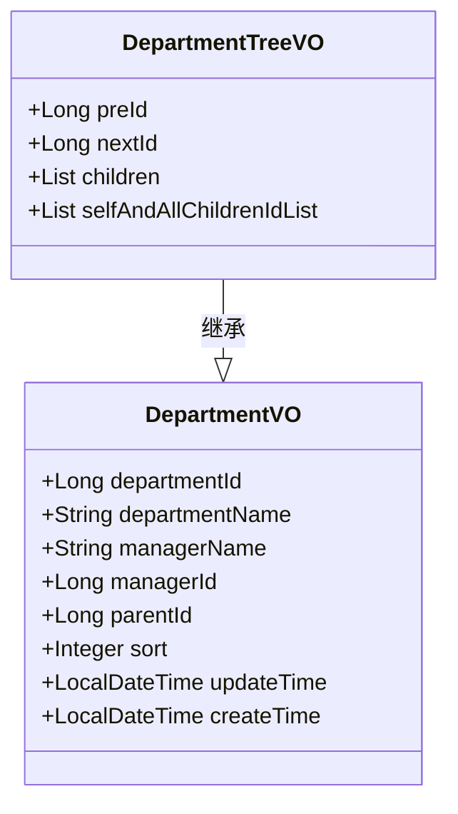
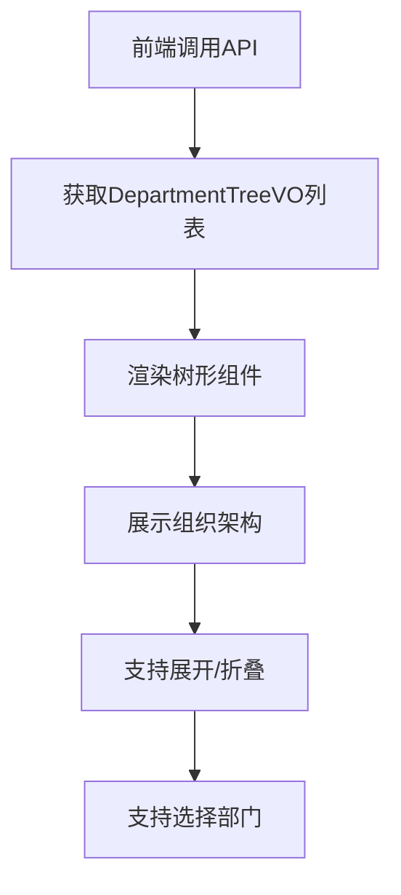
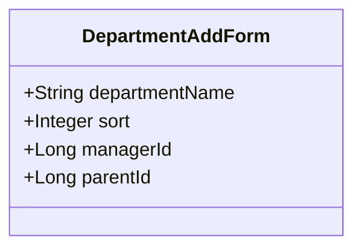
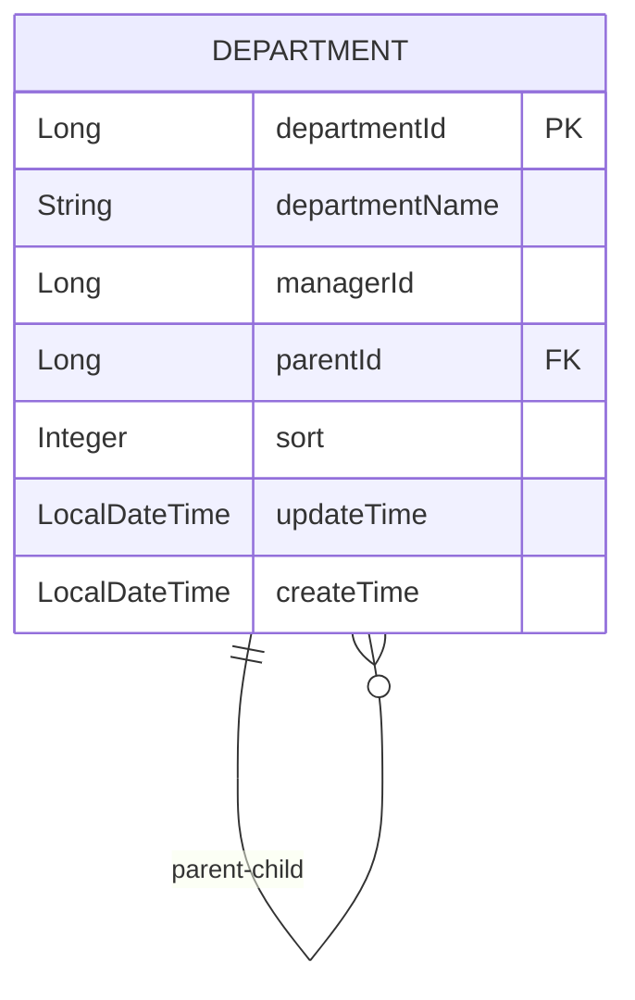
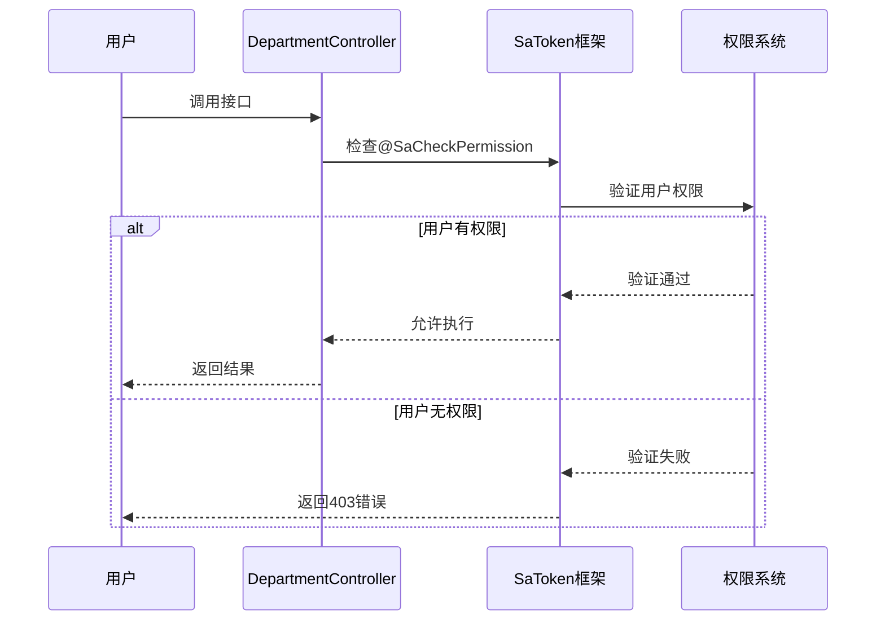
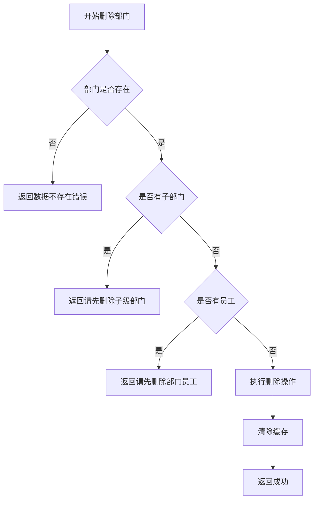

# 部门管理API

<cite>
**本文档引用的文件**   
- [DepartmentController.java](file://smart-admin-api-java17-springboot3\sa-admin\src\main\java\net\lab1024\sa\admin\module\system\department\controller\DepartmentController.java)
- [DepartmentAddForm.java](file://smart-admin-api-java17-springboot3\sa-admin\src\main\java\net\lab1024\sa\admin\module\system\department\domain\form\DepartmentAddForm.java)
- [DepartmentUpdateForm.java](file://smart-admin-api-java17-springboot3\sa-admin\src\main\java\net\lab1024\sa\admin\module\system\department\domain\form\DepartmentUpdateForm.java)
- [DepartmentService.java](file://smart-admin-api-java17-springboot3\sa-admin\src\main\java\net\lab1024\sa\admin\module\system\department\service\DepartmentService.java)
- [DepartmentTreeVO.java](file://smart-admin-api-java17-springboot3\sa-admin\src\main\java\net\lab1024\sa\admin\module\system\department\domain\vo\DepartmentTreeVO.java)
- [DepartmentVO.java](file://smart-admin-api-java17-springboot3\sa-admin\src\main\java\net\lab1024\sa\admin\module\system\department\domain\vo\DepartmentVO.java)
- [DepartmentEntity.java](file://smart-admin-api-java17-springboot3\sa-admin\src\main\java\net\lab1024\sa\admin\module\system\department\domain\entity\DepartmentEntity.java)
- [DepartmentDao.java](file://smart-admin-api-java17-springboot3\sa-admin\src\main\java\net\lab1024\sa\admin\module\system\department\dao\DepartmentDao.java)
- [DepartmentCacheManager.java](file://smart-admin-api-java17-springboot3\sa-admin\src\main\java\net\lab1024\sa\admin\module\system\department\manager\DepartmentCacheManager.java)
- [department-api.js](file://smart-admin-web-javascript\src\api\system\department-api.js)
</cite>

## 目录
1. [核心接口功能](#核心接口功能)
2. [部门树形结构数据格式](#部门树形结构数据格式)
3. [部门层级与父级部门ID设计](#部门层级与父级部门ID设计)
4. [权限控制说明](#权限控制说明)
5. [错误处理场景](#错误处理场景)
6. [批量操作建议实现方式](#批量操作建议实现方式)

## 核心接口功能

部门管理API提供了完整的部门生命周期管理功能，包括添加、更新、删除和查询部门等核心接口。这些接口通过DepartmentController类提供RESTful服务，实现了对组织架构的全面管理。

### 添加部门接口 (/department/add)
添加部门接口用于创建新的部门记录。该接口接收DepartmentAddForm表单数据，包含部门名称、排序值、部门负责人ID和上级部门ID等信息。接口通过POST请求方式调用，需要具备"system:department:add"权限。

### 更新部门接口 (/department/update)
更新部门接口用于修改现有部门的信息。该接口接收DepartmentUpdateForm表单数据，该表单继承自DepartmentAddForm并增加了部门ID字段。接口通过POST请求方式调用，需要具备"system:department:update"权限。

### 删除部门接口 (/department/delete/{departmentId})
删除部门接口用于移除指定的部门记录。该接口通过GET请求方式调用，需要在URL路径中指定要删除的部门ID，并且需要具备"system:department:delete"权限。接口在删除前会进行业务约束检查。

### 查询部门列表接口 (/department/listAll)
查询部门列表接口用于获取所有部门的扁平化列表。该接口通过GET请求方式调用，返回DepartmentVO对象的列表，包含部门的基本信息如部门ID、名称、负责人、排序等。

**接口调用示例**
```javascript
// 添加部门
departmentApi.addDepartment({
  departmentName: "研发部",
  sort: 1,
  managerId: 1001,
  parentId: 1
});

// 查询部门树形列表
departmentApi.queryDepartmentTree();

// 删除部门
departmentApi.deleteDepartment(2);
```

**本节来源**
- [DepartmentController.java](file://smart-admin-api-java17-springboot3\sa-admin\src\main\java\net\lab1024\sa\admin\module\system\department\controller\DepartmentController.java#L41-L66)
- [department-api.js](file://smart-admin-web-javascript\src\api\system\department-api.js#L30-L43)

## 部门树形结构数据格式

部门树形结构通过`departmentTree()`接口返回，该接口返回`DepartmentTreeVO`对象的列表，形成一个完整的组织架构树。这种树形结构设计便于前端展示层级化的部门组织。

### 数据结构定义
`DepartmentTreeVO`类继承自`DepartmentVO`，并扩展了树形结构所需的额外字段：



**Diagram sources**
- [DepartmentTreeVO.java](file://smart-admin-api-java17-springboot3\sa-admin\src\main\java\net\lab1024\sa\admin\module\system\department\domain\vo\DepartmentTreeVO.java#L1-L32)
- [DepartmentVO.java](file://smart-admin-api-java17-springboot3\sa-admin\src\main\java\net\lab1024\sa\admin\module\system\department\domain\vo\DepartmentVO.java#L1-L47)

### 字段说明
- **children**: 子部门列表，递归包含所有下级部门，形成树形结构
- **preId**: 同级上一个兄弟节点的部门ID，用于维护同级部门的顺序
- **nextId**: 同级下一个兄弟节点的部门ID，用于维护同级部门的顺序
- **selfAndAllChildrenIdList**: 当前部门及其所有子部门的ID集合，用于快速判断部门层级关系

### 前端组织架构展示应用
前端通过`departmentTree()`接口获取树形数据后，可以使用Ant Design Vue的Tree组件进行展示。树形结构中的`children`字段直接对应Tree组件的嵌套结构，`departmentName`作为节点显示文本，`departmentId`作为节点唯一标识。



**Diagram sources**
- [DepartmentController.java](file://smart-admin-api-java17-springboot3\sa-admin\src\main\java\net\lab1024\sa\admin\module\system\department\controller\DepartmentController.java#L35-L38)
- [DepartmentCacheManager.java](file://smart-admin-api-java17-springboot3\sa-admin\src\main\java\net\lab1024\sa\admin\module\system\department\manager\DepartmentCacheManager.java#L62-L65)

**本节来源**
- [DepartmentTreeVO.java](file://smart-admin-api-java17-springboot3\sa-admin\src\main\java\net\lab1024\sa\admin\module\system\department\domain\vo\DepartmentTreeVO.java#L1-L32)
- [DepartmentCacheManager.java](file://smart-admin-api-java17-springboot3\sa-admin\src\main\java\net\lab1024\sa\admin\module\system\department\manager\DepartmentCacheManager.java#L116-L126)

## 部门层级与父级部门ID设计

部门层级结构通过`DepartmentAddForm`中的`parentId`字段实现，该设计支持灵活的组织架构管理。

### DepartmentAddForm设计
`DepartmentAddForm`类定义了添加部门时所需的表单字段：



**Diagram sources**
- [DepartmentAddForm.java](file://smart-admin-api-java17-springboot3\sa-admin\src\main\java\net\lab1024\sa\admin\module\system\department\domain\form\DepartmentAddForm.java#L1-L35)

### 层级设计考虑
1. **可选的上级部门**: `parentId`字段为可选字段，当`parentId`为null或0时，表示该部门为根部门
2. **无限层级支持**: 通过`parentId`引用其他部门的`departmentId`，理论上支持无限层级的组织架构
3. **循环引用防止**: 系统在添加或更新部门时会检查是否形成循环引用
4. **排序控制**: `sort`字段用于控制同级部门的显示顺序，数值越小排序越靠前

### 数据库设计
在数据库中，`t_department`表通过`department_id`和`parent_id`字段实现层级关系：



**Diagram sources**
- [DepartmentEntity.java](file://smart-admin-api-java17-springboot3\sa-admin\src\main\java\net\lab1024\sa\admin\module\system\department\domain\entity\DepartmentEntity.java#L1-L65)
- [DepartmentDao.java](file://smart-admin-api-java17-springboot3\sa-admin\src\main\java\net\lab1024\sa\admin\module\system\department\dao\DepartmentDao.java#L1-L35)

**本节来源**
- [DepartmentAddForm.java](file://smart-admin-api-java17-springboot3\sa-admin\src\main\java\net\lab1024\sa\admin\module\system\department\domain\form\DepartmentAddForm.java#L1-L35)
- [DepartmentEntity.java](file://smart-admin-api-java17-springboot3\sa-admin\src\main\java\net\lab1024\sa\admin\module\system\department\domain\entity\DepartmentEntity.java#L1-L65)

## 权限控制说明

部门管理API采用了基于注解的权限控制机制，确保只有具备相应权限的用户才能执行特定操作。

### @SaCheckPermission注解
系统使用`@SaCheckPermission`注解实现细粒度的权限控制，该注解位于`cn.dev33.satoken.annotation`包中。每个部门管理接口都配置了相应的权限码：



**Diagram sources**
- [DepartmentController.java](file://smart-admin-api-java17-springboot3\sa-admin\src\main\java\net\lab1024\sa\admin\module\system\department\controller\DepartmentController.java#L43-L57)
- [DepartmentController.java](file://smart-admin-api-java17-springboot3\sa-admin\src\main\java\net\lab1024\sa\admin\module\system\department\controller\DepartmentController.java#L56-L58)

### 具体权限配置
- **添加部门**: `@SaCheckPermission("system:department:add")`
- **更新部门**: `@SaCheckPermission("system:department:update")`
- **删除部门**: `@SaCheckPermission("system:department:delete")`

这些权限码遵循统一的命名规范：`模块:子模块:操作`，便于权限的集中管理和分配。

**本节来源**
- [DepartmentController.java](file://smart-admin-api-java17-springboot3\sa-admin\src\main\java\net\lab1024\sa\admin\module\system\department\controller\DepartmentController.java#L43-L57)

## 错误处理场景

部门管理API在关键操作中实现了完善的错误处理机制，确保数据的一致性和系统的稳定性。

### 删除非叶子节点部门的业务约束
当尝试删除一个非叶子节点部门（即有子部门的部门）时，系统会阻止该操作并返回相应的错误信息。这是通过`DepartmentService`中的`deleteDepartment`方法实现的：



**Diagram sources**
- [DepartmentService.java](file://smart-admin-api-java17-springboot3\sa-admin\src\main\java\net\lab1024\sa\admin\module\system\department\service\DepartmentService.java#L77-L96)

### 其他错误处理场景
1. **更新部门时父级部门ID不能为空**: 在更新部门信息时，如果`parentId`为null，系统会返回"父级部门id不能为空"的错误
2. **部门名称验证**: 添加或更新部门时，部门名称必须在1-50个字符之间，否则返回相应的验证错误
3. **数据不存在**: 当操作的部门ID不存在时，返回"数据不存在"的错误

**本节来源**
- [DepartmentService.java](file://smart-admin-api-java17-springboot3\sa-admin\src\main\java\net\lab1024\sa\admin\module\system\department\service\DepartmentService.java#L77-L96)
- [DepartmentUpdateForm.java](file://smart-admin-api-java17-springboot3\sa-admin\src\main\java\net\lab1024\sa\admin\module\system\department\domain\form\DepartmentUpdateForm.java#L1-L23)

## 批量操作建议实现方式

虽然当前API未直接提供批量操作接口，但可以通过以下方式实现批量部门管理功能：

### 批量添加部门
建议通过循环调用单个添加接口实现批量添加，或扩展API添加批量添加接口：

```java
@PostMapping("/department/batchAdd")
@SaCheckPermission("system:department:add")
public ResponseDTO<String> batchAddDepartments(@RequestBody List<DepartmentAddForm> forms) {
    for (DepartmentAddForm form : forms) {
        departmentService.addDepartment(form);
    }
    return ResponseDTO.ok("批量添加成功");
}
```

### 批量更新部门
可以基于现有更新接口实现批量更新功能：

```java
@PostMapping("/department/batchUpdate")
@SaCheckPermission("system:department:update")
public ResponseDTO<String> batchUpdateDepartments(@RequestBody List<DepartmentUpdateForm> forms) {
    for (DepartmentUpdateForm form : forms) {
        departmentService.updateDepartment(form);
    }
    return ResponseDTO.ok("批量更新成功");
}
```

### 批量删除部门
实现批量删除时需要考虑层级关系，建议采用深度优先遍历的方式：

```java
@GetMapping("/department/batchDelete")
@SaCheckPermission("system:department:delete")
public ResponseDTO<String> batchDeleteDepartments(@RequestParam List<Long> departmentIds) {
    // 按照层级深度排序，先删除叶子节点
    List<Long> sortedIds = sortDepartmentIdsByDepth(departmentIds);
    for (Long id : sortedIds) {
        departmentService.deleteDepartment(id);
    }
    return ResponseDTO.ok("批量删除成功");
}
```

**本节来源**
- [DepartmentService.java](file://smart-admin-api-java17-springboot3\sa-admin\src\main\java\net\lab1024\sa\admin\module\system\department\service\DepartmentService.java#L46-L50)
- [DepartmentService.java](file://smart-admin-api-java17-springboot3\sa-admin\src\main\java\net\lab1024\sa\admin\module\system\department\service\DepartmentService.java#L57-L69)