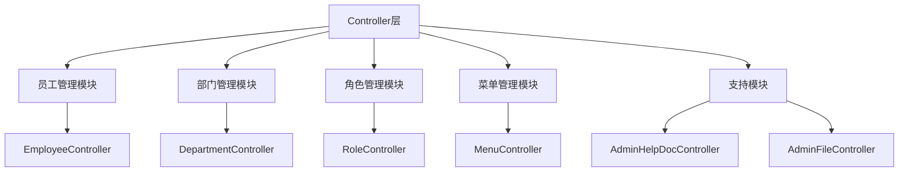
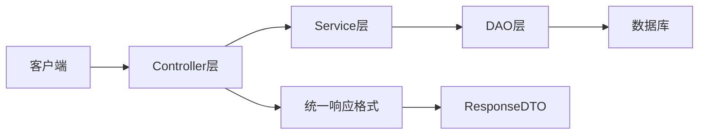
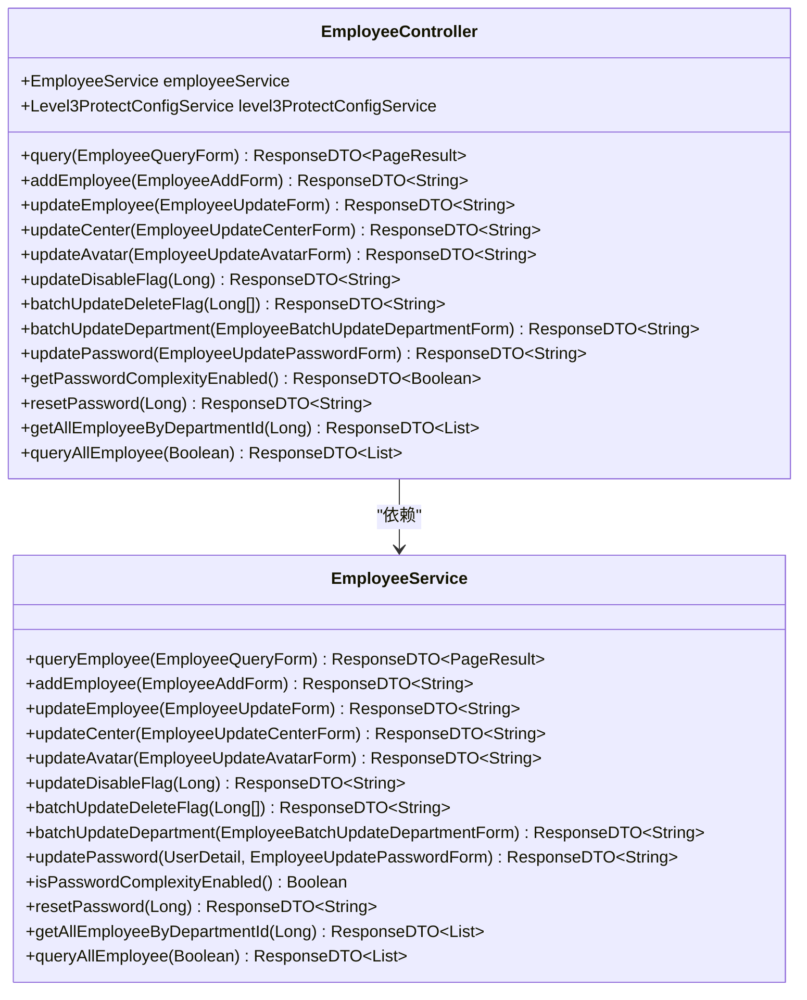
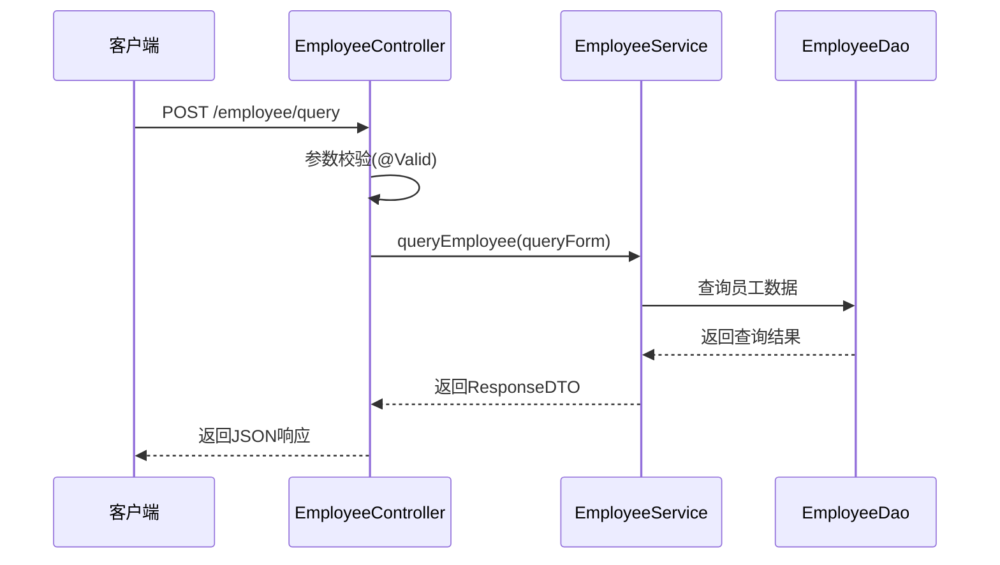
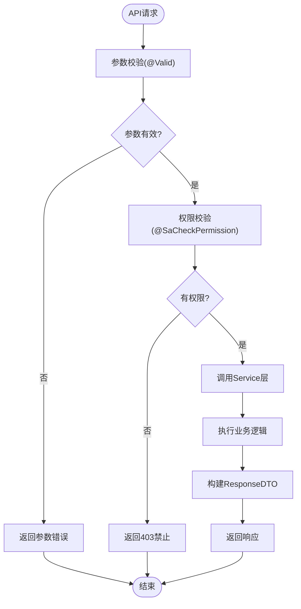
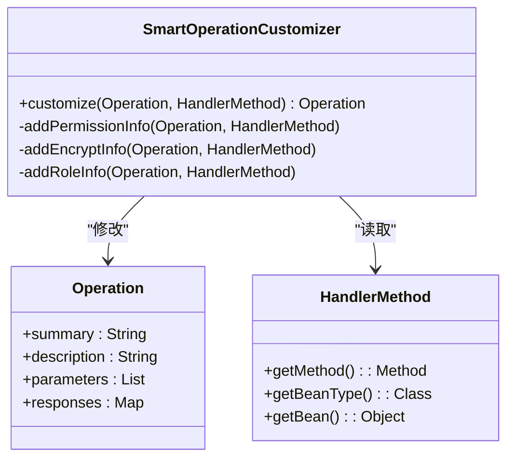
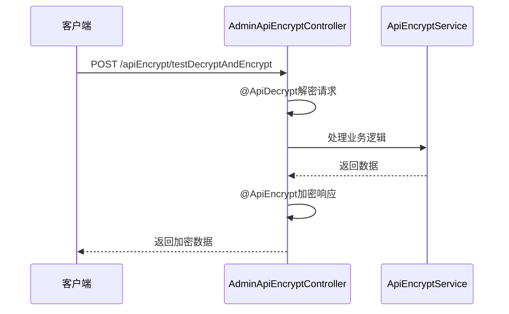

# Controller层

<cite>
**本文档引用的文件**
- [EmployeeController.java](file://smart-admin-api-java17-springboot3\sa-admin\src\main\java\net\lab1024\sa\admin\module\system\employee\controller\EmployeeController.java)
- [AdminHelpDocController.java](file://smart-admin-api-java17-springboot3\sa-admin\src\main\java\net\lab1024\sa\admin\module\system\support\AdminHelpDocController.java)
- [SupportBaseController.java](file://smart-admin-api-java17-springboot3\sa-base\src\main\java\net\lab1024\sa\base\common\controller\SupportBaseController.java)
- [ResponseDTO.java](file://smart-admin-api-java17-springboot3\sa-base\src\main\java\net\lab1024\sa\base\common\domain\ResponseDTO.java)
- [AdminApiEncryptController.java](file://smart-admin-api-java17-springboot3\sa-admin\src\main\java\net\lab1024\sa\admin\module\system\support\AdminApiEncryptController.java)
- [SmartOperationCustomizer.java](file://smart-admin-api-java17-springboot3\sa-base\src\main\java\net\lab1024\sa\base\common\swagger\SmartOperationCustomizer.java)
</cite>

## 目录
1. [简介](#简介)
2. [项目结构](#项目结构)
3. [核心组件](#核心组件)
4. [架构概述](#架构概述)
5. [详细组件分析](#详细组件分析)
6. [依赖分析](#依赖分析)
7. [性能考虑](#性能考虑)
8. [故障排除指南](#故障排除指南)
9. [结论](#结论)

## 简介
Controller层是系统的主要入口点，负责接收HTTP请求、处理权限验证、参数校验，并调用Service层处理业务逻辑。本文档详细介绍了Controller层如何使用@RestController注解暴露RESTful API，通过@SaCheckPermission注解实现权限控制，以及使用@Valid注解进行参数校验。

## 项目结构
Controller层位于`sa-admin`模块的`module`目录下，按功能模块组织。每个模块包含controller、service、domain等子目录。Controller类位于controller包中，继承自基类Controller，遵循统一的命名规范和代码结构。



**图示来源**
- [EmployeeController.java](file://smart-admin-api-java17-springboot3\sa-admin\src\main\java\net\lab1024\sa\admin\module\system\employee\controller\EmployeeController.java)
- [AdminHelpDocController.java](file://smart-admin-api-java17-springboot3\sa-admin\src\main\java\net\lab1024\sa\admin\module\system\support\AdminHelpDocController.java)

**章节来源**
- [EmployeeController.java](file://smart-admin-api-java17-springboot3\sa-admin\src\main\java\net\lab1024\sa\admin\module\system\employee\controller\EmployeeController.java)
- [AdminHelpDocController.java](file://smart-admin-api-java17-springboot3\sa-admin\src\main\java\net\lab1024\sa\admin\module\system\support\AdminHelpDocController.java)

## 核心组件
Controller层的核心组件包括@RestController注解、@SaCheckPermission权限控制、@Valid参数校验、@RequestBody请求体处理、@PathVariable路径参数处理等。这些组件共同构成了系统的API入口点，确保请求的安全性和有效性。

**章节来源**
- [EmployeeController.java](file://smart-admin-api-java17-springboot3\sa-admin\src\main\java\net\lab1024\sa\admin\module\system\employee\controller\EmployeeController.java)
- [AdminHelpDocController.java](file://smart-admin-api-java17-springboot3\sa-admin\src\main\java\net\lab1024\sa\admin\module\system\support\AdminHelpDocController.java)

## 架构概述
Controller层采用分层架构设计，作为系统的入口点，负责接收和处理HTTP请求。它通过调用Service层来执行业务逻辑，并返回统一格式的响应。这种设计实现了关注点分离，提高了代码的可维护性和可测试性。



**图示来源**
- [EmployeeController.java](file://smart-admin-api-java17-springboot3\sa-admin\src\main\java\net\lab1024\sa\admin\module\system\employee\controller\EmployeeController.java)
- [ResponseDTO.java](file://smart-admin-api-java17-springboot3\sa-base\src\main\java\net\lab1024\sa\base\common\domain\ResponseDTO.java)

## 详细组件分析

### 员工管理模块分析
员工管理模块的EmployeeController展示了Controller层的核心功能。它使用@PostMapping、@GetMapping等HTTP方法注解来定义API端点，通过@RequestBody接收请求体数据，使用@PathVariable处理路径参数。

#### 对象导向组件


**图示来源**
- [EmployeeController.java](file://smart-admin-api-java17-springboot3\sa-admin\src\main\java\net\lab1024\sa\admin\module\system\employee\controller\EmployeeController.java)
- [EmployeeService.java](file://smart-admin-api-java17-springboot3\sa-admin\src\main\java\net\lab1024\sa\admin\module\system\employee\service\EmployeeService.java)

#### API/服务组件


**图示来源**
- [EmployeeController.java](file://smart-admin-api-java17-springboot3\sa-admin\src\main\java\net\lab1024\sa\admin\module\system\employee\controller\EmployeeController.java)
- [EmployeeService.java](file://smart-admin-api-java17-springboot3\sa-admin\src\main\java\net\lab1024\sa\admin\module\system\employee\service\EmployeeService.java)

#### 复杂逻辑组件


**图示来源**
- [EmployeeController.java](file://smart-admin-api-java17-springboot3\sa-admin\src\main\java\net\lab1024\sa\admin\module\system\employee\controller\EmployeeController.java)
- [ResponseDTO.java](file://smart-admin-api-java17-springboot3\sa-base\src\main\java\net\lab1024\sa\base\common\domain\ResponseDTO.java)

**章节来源**
- [EmployeeController.java](file://smart-admin-api-java17-springboot3\sa-admin\src\main\java\net\lab1024\sa\admin\module\system\employee\controller\EmployeeController.java)
- [ResponseDTO.java](file://smart-admin-api-java17-springboot3\sa-base\src\main\java\net\lab1024\sa\base\common\domain\ResponseDTO.java)

### Swagger文档生成
Swagger注解在API文档生成中起着关键作用。@Tag用于定义控制器的标签，@Operation用于描述每个API方法的功能。这些注解与SmartOperationCustomizer配合使用，为API文档添加权限校验等额外信息。



**图示来源**
- [SmartOperationCustomizer.java](file://smart-admin-api-java17-springboot3\sa-base\src\main\java\net\lab1024\sa\base\common\swagger\SmartOperationCustomizer.java)
- [EmployeeController.java](file://smart-admin-api-java17-springboot3\sa-admin\src\main\java\net\lab1024\sa\admin\module\system\employee\controller\EmployeeController.java)

**章节来源**
- [SmartOperationCustomizer.java](file://smart-admin-api-java17-springboot3\sa-base\src\main\java\net\lab1024\sa\base\common\swagger\SmartOperationCustomizer.java)

### 特殊场景处理
Controller层还处理文件上传、加密请求等特殊场景。通过@ApiDecrypt和@ApiEncrypt注解实现请求和响应的加解密，确保数据传输的安全性。



**图示来源**
- [AdminApiEncryptController.java](file://smart-admin-api-java17-springboot3\sa-admin\src\main\java\net\lab1024\sa\admin\module\system\support\AdminApiEncryptController.java)
- [ApiEncryptService.java](file://smart-admin-api-java17-springboot3\sa-base\src\main\java\net\lab1024\sa\base\module\support\apiencrypt\service\ApiEncryptService.java)

**章节来源**
- [AdminApiEncryptController.java](file://smart-admin-api-java17-springboot3\sa-admin\src\main\java\net\lab1024\sa\admin\module\system\support\AdminApiEncryptController.java)

## 依赖分析
Controller层依赖于Service层处理业务逻辑，依赖于Swagger注解生成API文档，依赖于Sa-Token实现权限控制。这些依赖关系通过Spring的依赖注入机制管理，确保了组件之间的松耦合。

```mermaid
graph TD
A[EmployeeController] --> B[EmployeeService]
A --> C[Level3ProtectConfigService]
A --> D[SmartRequestUtil]
B --> E[EmployeeDao]
E --> F[数据库]
A --> G[@SaCheckPermission]
A --> H[@Valid]
A --> I[@Operation]
A --> J[@Tag]
```

**图示来源**
- [EmployeeController.java](file://smart-admin-api-java17-springboot3\sa-admin\src\main\java\net\lab1024\sa\admin\module\system\employee\controller\EmployeeController.java)
- [EmployeeService.java](file://smart-admin-api-java17-springboot3\sa-admin\src\main\java\net\lab1024\sa\admin\module\system\employee\service\EmployeeService.java)

**章节来源**
- [EmployeeController.java](file://smart-admin-api-java17-springboot3\sa-admin\src\main\java\net\lab1024\sa\admin\module\system\employee\controller\EmployeeController.java)

## 性能考虑
Controller层的设计考虑了性能因素。通过使用@Valid注解在进入Service层之前进行参数校验，避免了不必要的业务逻辑执行。统一的ResponseDTO格式减少了序列化开销，提高了响应速度。

## 故障排除指南
当Controller层出现问题时，应首先检查注解使用是否正确，确保@RestController、@RequestMapping等注解正确配置。检查参数校验注解是否与数据模型匹配，确保权限注解的权限码正确无误。

**章节来源**
- [EmployeeController.java](file://smart-admin-api-java17-springboot3\sa-admin\src\main\java\net\lab1024\sa\admin\module\system\employee\controller\EmployeeController.java)
- [GlobalExceptionHandler.java](file://smart-admin-api-java17-springboot3\sa-base\src\main\java\net\lab1024\sa\base\handler\GlobalExceptionHandler.java)

## 结论
Controller层作为系统的主要入口点，通过@RestController注解暴露RESTful API，使用@SaCheckPermission实现权限控制，通过@Valid进行参数校验。它调用Service层处理业务逻辑，并返回统一的ResponseDTO格式响应。Swagger注解帮助生成详细的API文档，而@ApiDecrypt和@ApiEncrypt注解确保了数据传输的安全性。这种设计模式提高了代码的可维护性、可测试性和安全性。