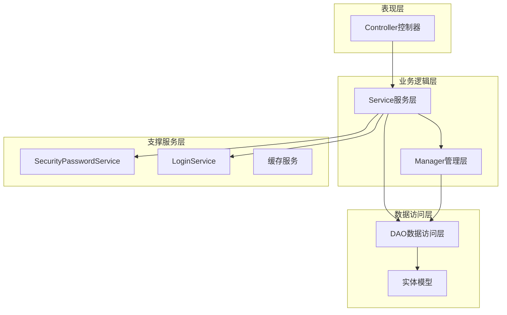
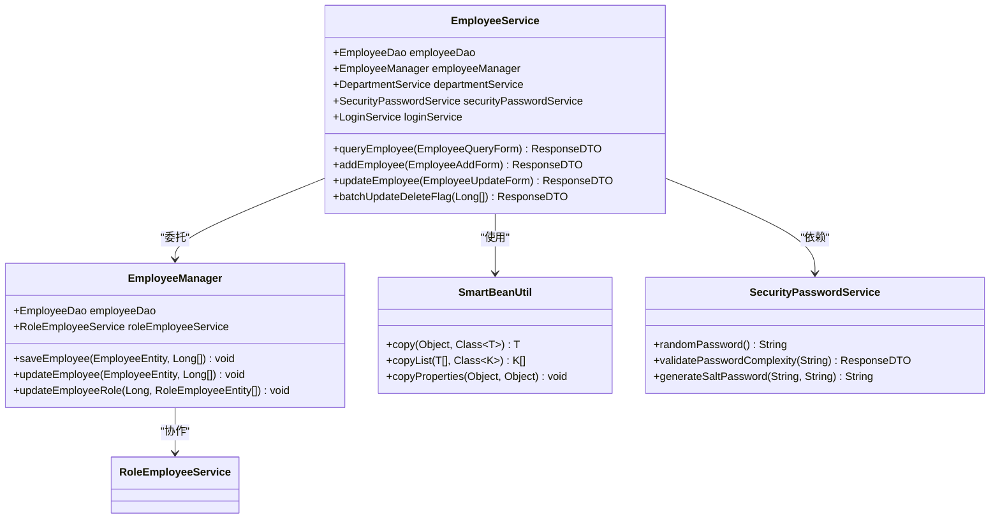
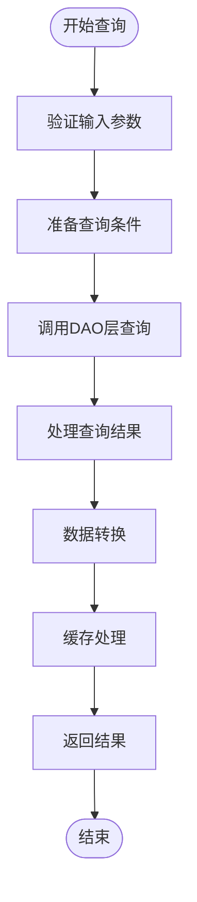
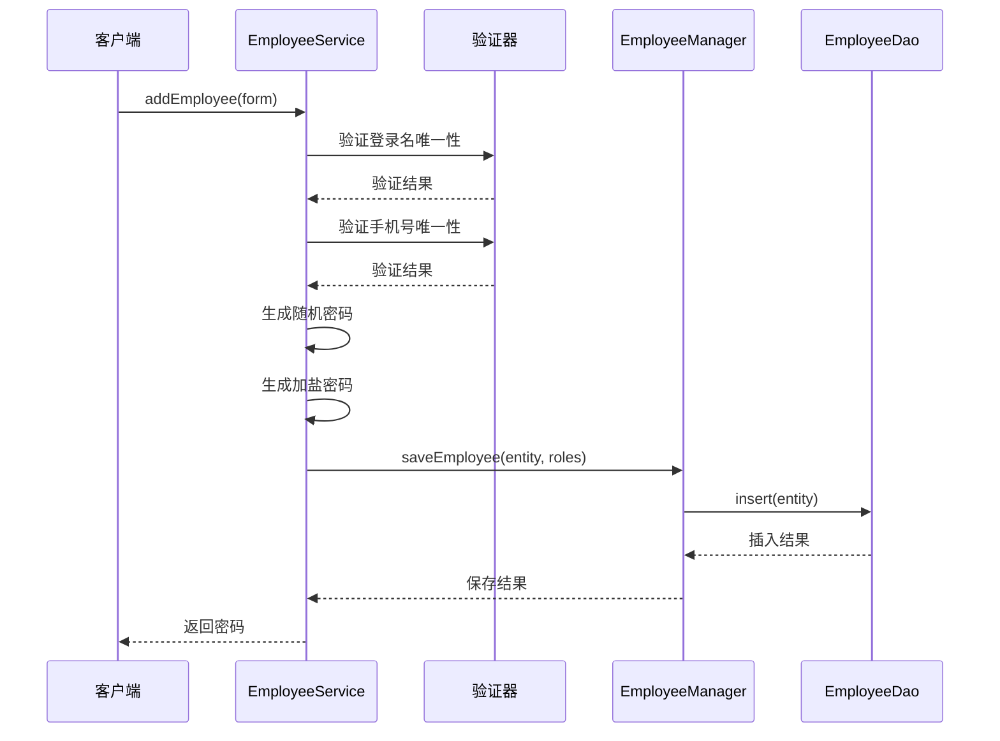
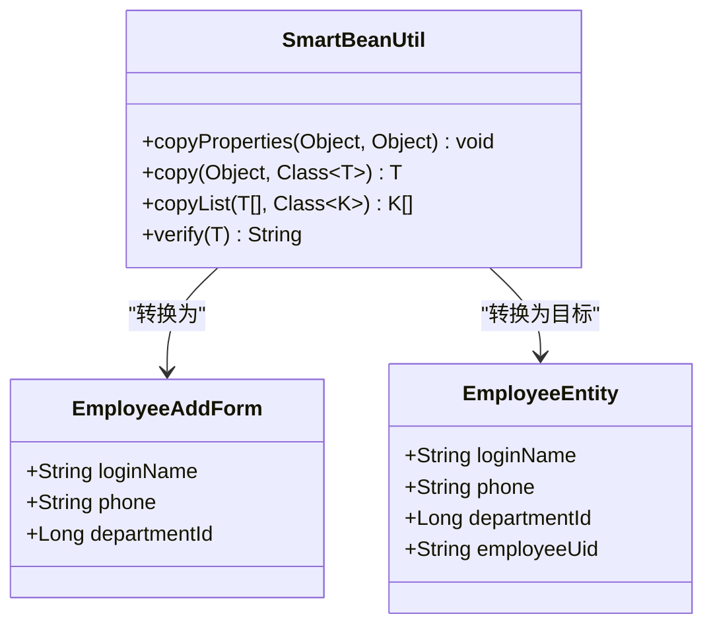
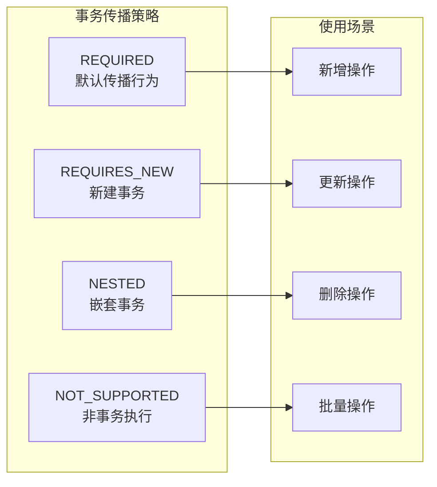
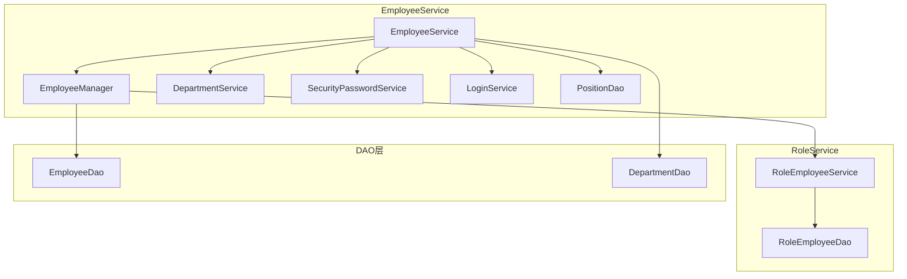
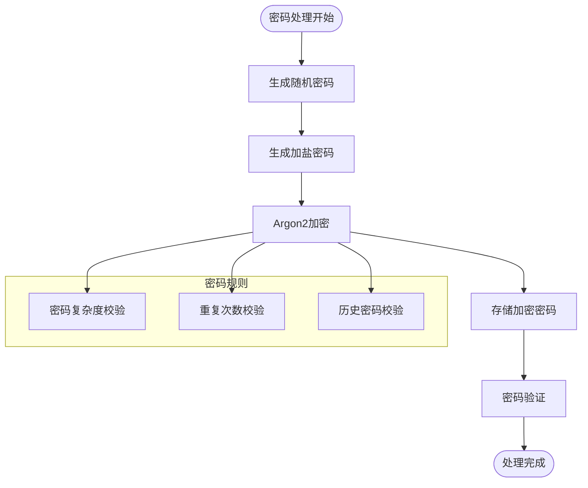

# Service层详细文档

<cite>
**本文档引用的文件**
- [EmployeeService.java](file://smart-admin-api-java17-springboot3/sa-admin/src/main/java/net/lab1024.sa.admin/module/system/employee/service/EmployeeService.java)
- [EmployeeManager.java](file://smart-admin-api-java17-springboot3/sa-admin/src/main/java/net/lab1024.sa.admin/module/system/employee/manager/EmployeeManager.java)
- [SmartBeanUtil.java](file://smart-admin-api-java17-springboot3/sa-base/src/main/java/net/lab1024.sa.base/common/util/SmartBeanUtil.java)
- [SecurityPasswordService.java](file://smart-admin-api-java17-springboot3/sa-base/src/main/java/net/lab1024.sa.base/module/support/securityprotect/service/SecurityPasswordService.java)
- [LoginService.java](file://smart-admin-api-java17-springboot3/sa-admin/src/main/java/net/lab1024.sa.admin/module/system/login/service/LoginService.java)
- [RoleEmployeeService.java](file://smart-admin-api-java17-springboot3/sa-admin/src/main/java/net/lab1024.sa.admin/module/system/role/service/RoleEmployeeService.java)
- [NoticeEmployeeService.java](file://smart-admin-api-java17-springboot3/sa-admin/src/main/java/net/lab1024.sa.admin/module/business/oa/notice/service/NoticeEmployeeService.java)
</cite>

## 目录
1. [概述](#概述)
2. [Service层架构设计](#service层架构设计)
3. [核心注解与配置](#核心注解与配置)
4. [业务方法实现模式](#业务方法实现模式)
5. [数据转换机制](#数据转换机制)
6. [事务管理](#事务管理)
7. [依赖注入与协作](#依赖注入与协作)
8. [安全与缓存处理](#安全与缓存处理)
9. [批量操作处理](#批量操作处理)
10. [异常处理机制](#异常处理机制)
11. [最佳实践总结](#最佳实践总结)

## 概述

Service层作为SmartAdmin系统的核心业务逻辑层，承担着连接Controller层和DAO层的重要职责。它负责实现复杂的业务规则、数据验证、业务流程编排以及跨模块的业务协调。本文档以EmployeeService为例，深入解析Service层的设计理念和实现模式。

Service层的主要特征包括：
- **业务逻辑集中化**：将复杂的业务规则封装在Service层
- **事务边界管理**：通过@Transactional注解精确控制事务范围
- **数据转换协调**：使用SmartBeanUtil进行实体间的数据转换
- **安全机制集成**：集成密码加密、缓存清理等安全功能
- **依赖注入管理**：通过@Resource注解实现松耦合的组件协作

## Service层架构设计

### 层次结构



**图表来源**
- [EmployeeService.java](file://smart-admin-api-java17-springboot3/sa-admin/src/main/java/net/lab1024.sa.admin/module/system/employee/service/EmployeeService.java#L47-L48)
- [EmployeeManager.java](file://smart-admin-api-java17-springboot3/sa-admin/src/main/java/net/lab1024.sa.admin/module/system/employee/manager/EmployeeManager.java#L27-L28)

### 组件关系

Service层采用分层架构设计，通过Manager层进一步细分业务逻辑：



**图表来源**
- [EmployeeService.java](file://smart-admin-api-java17-springboot3/sa-admin/src/main/java/net/lab1024.sa.admin/module/system/employee/service/EmployeeService.java#L49-L74)
- [EmployeeManager.java](file://smart-admin-api-java17-springboot3/sa-admin/src/main/java/net/lab1024.sa.admin/module/system/employee/manager/EmployeeManager.java#L28-L38)

**章节来源**
- [EmployeeService.java](file://smart-admin-api-java17-springboot3/sa-admin/src/main/java/net/lab1024.sa.admin/module/system/employee/service/EmployeeService.java#L37-L446)
- [EmployeeManager.java](file://smart-admin-api-java17-springboot3/sa-admin/src/main/java/net/lab1024.sa.admin/module/system/employee/manager/EmployeeManager.java#L27-L87)

## 核心注解与配置

### @Service注解声明

Service层通过`@Service`注解声明为Spring Bean，实现自动扫描和依赖注入：

```java
@Service
public class EmployeeService {
    // Service实现
}
```

### @Transactional事务管理

关键业务方法使用`@Transactional`注解管理事务边界：

```java
@Transactional(rollbackFor = Throwable.class)
public ResponseDTO<String> updatePassword(RequestUser requestUser, EmployeeUpdatePasswordForm updatePasswordForm) {
    // 事务内执行多个数据库操作
}
```

### @Resource依赖注入

使用`@Resource`注解进行依赖注入，支持按名称和类型注入：

```java
@Resource
private EmployeeDao employeeDao;

@Resource
private EmployeeManager employeeManager;

@Resource
@Lazy
private LoginService loginService;
```

**章节来源**
- [EmployeeService.java](file://smart-admin-api-java17-springboot3/sa-admin/src/main/java/net/lab1024.sa.admin/module/system/employee/service/EmployeeService.java#L47-L74)
- [EmployeeManager.java](file://smart-admin-api-java17-springboot3/sa-admin/src/main/java/net/lab1024.sa.admin/module/system/employee/manager/EmployeeManager.java#L27-L38)

## 业务方法实现模式

### 查询方法模式

查询方法遵循标准的查询-转换-返回模式：



**图表来源**
- [EmployeeService.java](file://smart-admin-api-java17-springboot3/sa-admin/src/main/java/net/lab1024.sa.admin/module/system/employee/service/EmployeeService.java#L82-L116)

典型查询方法实现：

```java
public ResponseDTO<PageResult<EmployeeVO>> queryEmployee(EmployeeQueryForm employeeQueryForm) {
    // 1. 参数预处理
    employeeQueryForm.setDeletedFlag(false);
    Page pageParam = SmartPageUtil.convert2PageQuery(employeeQueryForm);
    
    // 2. 构建查询条件
    List<Long> departmentIdList = new ArrayList<>();
    if (employeeQueryForm.getDepartmentId() != null) {
        departmentIdList.addAll(departmentService.selfAndChildrenIdList(
            employeeQueryForm.getDepartmentId()
        ));
    }
    
    // 3. 调用DAO查询
    List<EmployeeVO> employeeList = employeeDao.queryEmployee(
        pageParam, employeeQueryForm, departmentIdList
    );
    
    // 4. 结果处理和转换
    // ... 数据转换逻辑
    return ResponseDTO.ok(pageResult);
}
```

### 新增方法模式

新增方法包含完整的业务验证和数据处理流程：



**图表来源**
- [EmployeeService.java](file://smart-admin-api-java17-springboot3/sa-admin/src/main/java/net/lab1024.sa.admin/module/system/employee/service/EmployeeService.java#L121-L154)

### 更新方法模式

更新方法确保数据一致性和安全性：

```java
public synchronized ResponseDTO<String> updateEmployee(EmployeeUpdateForm employeeUpdateForm) {
    // 1. 数据存在性检查
    EmployeeEntity employeeEntity = employeeDao.selectById(employeeId);
    if (null == employeeEntity) {
        return ResponseDTO.error(UserErrorCode.DATA_NOT_EXIST);
    }
    
    // 2. 唯一性验证
    ResponseDTO<String> checkResponse = checkUniqueness(
        employeeId, employeeUpdateForm.getLoginName(), 
        employeeUpdateForm.getPhone(), employeeUpdateForm.getEmail()
    );
    if (!checkResponse.getOk()) {
        return checkResponse;
    }
    
    // 3. 数据转换和更新
    EmployeeEntity entity = SmartBeanUtil.copy(employeeUpdateForm, EmployeeEntity.class);
    entity.setLoginPwd(null); // 不更新密码
    
    // 4. 调用Manager层更新
    employeeManager.updateEmployee(entity, employeeUpdateForm.getRoleIdList());
    
    // 5. 清理缓存
    loginService.clearLoginEmployeeCache(employeeId);
    
    return ResponseDTO.ok();
}
```

**章节来源**
- [EmployeeService.java](file://smart-admin-api-java17-springboot3/sa-admin/src/main/java/net/lab1024.sa.admin/module/system/employee/service/EmployeeService.java#L82-L191)

## 数据转换机制

### SmartBeanUtil工具类

SmartBeanUtil提供强大的数据转换能力，支持单个对象和集合的转换：



**图表来源**
- [SmartBeanUtil.java](file://smart-admin-api-java17-springboot3/sa-base/src/main/java/net/lab1024.sa.base/common/util/SmartBeanUtil.java#L22-L95)

### 数据转换应用场景

1. **表单到实体转换**：
```java
EmployeeEntity entity = SmartBeanUtil.copy(employeeAddForm, EmployeeEntity.class);
```

2. **实体到视图对象转换**：
```java
EmployeeVO employeeVO = SmartBeanUtil.copy(employeeEntity, EmployeeVO.class);
```

3. **集合转换**：
```java
List<EmployeeVO> voList = SmartBeanUtil.copyList(employeeEntityList, EmployeeVO.class);
```

**章节来源**
- [SmartBeanUtil.java](file://smart-admin-api-java17-springboot3/sa-base/src/main/java/net/lab1024.sa.base/common/util/SmartBeanUtil.java#L22-L95)
- [EmployeeService.java](file://smart-admin-api-java17-springboot3/sa-admin/src/main/java/net/lab1024.sa.admin/module/system/employee/service/EmployeeService.java#L139-L140)
- [EmployeeService.java](file://smart-admin-api-java17-springboot3/sa-admin/src/main/java/net/lab1024.sa.admin/module/system/employee/service/EmployeeService.java#L394-L401)

## 事务管理

### 事务边界定义

Service层通过@Transactional注解精确控制事务边界：

```java
@Transactional(rollbackFor = Throwable.class)
public void saveEmployee(EmployeeEntity employee, List<Long> roleIdList) {
    // 事务内执行多个数据库操作
    employeeDao.insert(employee);
    
    if (CollectionUtils.isNotEmpty(roleIdList)) {
        List<RoleEmployeeEntity> roleEmployeeList = roleIdList.stream()
            .map(e -> new RoleEmployeeEntity(e, employee.getEmployeeId()))
            .collect(Collectors.toList());
        roleEmployeeService.batchInsert(roleEmployeeList);
    }
}
```

### 事务传播行为

不同业务场景下的事务传播策略：



**章节来源**
- [EmployeeManager.java](file://smart-admin-api-java17-springboot3/sa-admin/src/main/java/net/lab1024.sa.admin/module/system/employee/manager/EmployeeManager.java#L43-L83)

## 依赖注入与协作

### 多层次依赖关系

Service层通过多层次的依赖关系实现业务逻辑的分层：



**图表来源**
- [EmployeeService.java](file://smart-admin-api-java17-springboot3/sa-admin/src/main/java/net/lab1024.sa.admin/module/system/employee/service/EmployeeService.java#L49-L74)

### 依赖注入最佳实践

1. **按需注入**：只注入实际需要的依赖
2. **延迟加载**：使用@Lazy注解避免循环依赖
3. **接口编程**：通过接口而非具体实现类注入

```java
@Resource
private EmployeeDao employeeDao;

@Resource
private EmployeeManager employeeManager;

@Resource
@Lazy
private LoginService loginService;
```

**章节来源**
- [EmployeeService.java](file://smart-admin-api-java17-springboot3/sa-admin/src/main/java/net/lab1024.sa.admin/module/system/employee/service/EmployeeService.java#L49-L74)

## 安全与缓存处理

### 密码加密机制

SecurityPasswordService提供完整的密码安全解决方案：



**图表来源**
- [SecurityPasswordService.java](file://smart-admin-api-java17-springboot3/sa-base/src/main/java/net/lab1024.sa.base/module/support/securityprotect/service/SecurityPasswordService.java#L34-L156)

### 密码生成和验证

```java
// 生成加盐密码
public String generateSaltPassword(String password, String employeeUid) {
    return password + StringConst.UNDERLINE +
           employeeUid.toUpperCase() +
           StringConst.UNDERLINE +
           employeeUid.toLowerCase();
}

// 密码验证
if (!SecurityPasswordService.matchesPwd(
    this.generateSaltPassword(oldPassword, employeeEntity.getEmployeeUid()), 
    employeeEntity.getLoginPwd()
)) {
    return ResponseDTO.userErrorParam("原密码有误，请重新输入");
}
```

### 缓存清理机制

LoginService提供统一的缓存清理接口：

```java
public void clearLoginEmployeeCache(Long employeeId) {
    loginManager.clearUserPermission(employeeId);
    loginManager.clearUserLoginInfo(employeeId);
}
```

**章节来源**
- [EmployeeService.java](file://smart-admin-api-java17-springboot3/sa-admin/src/main/java/net/lab1024.sa.admin/module/system/employee/service/EmployeeService.java#L437-L446)
- [LoginService.java](file://smart-admin-api-java17-springboot3/sa-admin/src/main/java/net/lab1024.sa.admin/module/system/login/service/LoginService.java#L476-L479)

## 批量操作处理

### 批量删除实现

批量操作通过事务保证数据一致性：

```java
public ResponseDTO<String> batchUpdateDeleteFlag(List<Long> employeeIdList) {
    if (CollectionUtils.isEmpty(employeeIdList)) {
        return ResponseDTO.ok();
    }
    
    // 查询现有数据
    List<EmployeeEntity> employeeEntityList = employeeManager.listByIds(employeeIdList);
    if (CollectionUtils.isEmpty(employeeEntityList)) {
        return ResponseDTO.ok();
    }
    
    // 批量更新
    List<EmployeeEntity> deleteList = employeeIdList.stream().map(e -> {
        EmployeeEntity updateEmployee = new EmployeeEntity();
        updateEmployee.setEmployeeId(e);
        updateEmployee.setDeletedFlag(true);
        return updateEmployee;
    }).collect(Collectors.toList());
    
    employeeManager.updateBatchById(deleteList);
    
    // 强制退出登录
    for (Long employeeId : employeeIdList) {
        StpUtil.logout(UserTypeEnum.ADMIN_EMPLOYEE.getValue() + StringConst.COLON + employeeId);
    }
    
    return ResponseDTO.ok();
}
```

### 批量更新部门

```java
public ResponseDTO<String> batchUpdateDepartment(EmployeeBatchUpdateDepartmentForm batchUpdateDepartmentForm) {
    List<Long> employeeIdList = batchUpdateDepartmentForm.getEmployeeIdList();
    List<EmployeeEntity> employeeEntityList = employeeDao.selectBatchIds(employeeIdList);
    
    if (employeeIdList.size() != employeeEntityList.size()) {
        return ResponseDTO.error(UserErrorCode.DATA_NOT_EXIST);
    }
    
    // 批量更新
    List<EmployeeEntity> updateList = employeeIdList.stream().map(e -> {
        EmployeeEntity updateEmployee = new EmployeeEntity();
        updateEmployee.setEmployeeId(e);
        updateEmployee.setDepartmentId(batchUpdateDepartmentForm.getDepartmentId());
        return updateEmployee;
    }).collect(Collectors.toList());
    
    employeeManager.updateBatchById(updateList);
    
    return ResponseDTO.ok();
}
```

**章节来源**
- [EmployeeService.java](file://smart-admin-api-java17-springboot3/sa-admin/src/main/java/net/lab1024.sa.admin/module/system/employee/service/EmployeeService.java#L288-L311)
- [EmployeeService.java](file://smart-admin-api-java17-springboot3/sa-admin/src/main/java/net/lab1024.sa.admin/module/system/employee/service/EmployeeService.java#L316-L333)

## 异常处理机制

### 统一异常处理

Service层通过ResponseDTO提供统一的异常处理机制：

```java
// 成功响应
return ResponseDTO.ok(result);

// 参数错误
return ResponseDTO.userErrorParam("登录名重复");

// 系统错误
return ResponseDTO.error(UserErrorCode.DATA_NOT_EXIST);

// 自定义错误
return ResponseDTO.error(errorCode, errorMessage);
```

### 业务规则验证

```java
private ResponseDTO<String> checkUniqueness(Long employeeId, String loginName, String phone, String email) {
    // 登录名唯一性检查
    EmployeeEntity existEntity = employeeDao.getByLoginName(loginName, null);
    if (null != existEntity && !Objects.equals(existEntity.getEmployeeId(), employeeId)) {
        return ResponseDTO.userErrorParam("登录名重复");
    }
    
    // 手机号唯一性检查
    existEntity = employeeDao.getByPhone(phone, null);
    if (null != existEntity && !Objects.equals(existEntity.getEmployeeId(), employeeId)) {
        return ResponseDTO.userErrorParam("手机号已存在");
    }
    
    // 邮箱唯一性检查
    existEntity = employeeDao.getByEmail(email, null);
    if (null != existEntity && !Objects.equals(existEntity.getEmployeeId(), employeeId)) {
        return ResponseDTO.userErrorParam("邮箱账号已存在");
    }
    
    return ResponseDTO.ok();
}
```

**章节来源**
- [EmployeeService.java](file://smart-admin-api-java17-springboot3/sa-admin/src/main/java/net/lab1024.sa.admin/module/system/employee/service/EmployeeService.java#L226-L243)

## 最佳实践总结

### 设计原则

1. **单一职责原则**：每个Service方法只负责一个业务功能
2. **开闭原则**：对扩展开放，对修改封闭
3. **依赖倒置原则**：依赖抽象而非具体实现
4. **接口隔离原则**：提供细粒度的接口

### 性能优化建议

1. **批量操作**：优先使用批量操作减少数据库交互
2. **缓存策略**：合理使用缓存减少重复计算
3. **懒加载**：使用@Lazy注解避免不必要的依赖初始化
4. **事务优化**：最小化事务范围，避免长时间持有事务

### 安全考虑

1. **密码安全**：使用强加密算法和加盐机制
2. **权限控制**：严格验证用户权限
3. **输入验证**：全面验证用户输入
4. **审计日志**：记录关键操作的审计信息

### 可维护性

1. **代码复用**：通过工具类和基类提高代码复用
2. **清晰命名**：使用有意义的方法和变量名称
3. **注释规范**：为复杂业务逻辑添加详细注释
4. **单元测试**：为关键业务方法编写单元测试

通过以上分析可以看出，SmartAdmin的Service层设计体现了现代Java企业应用的最佳实践，通过合理的分层架构、完善的事务管理、强大的数据转换能力和严格的安全机制，为企业级应用提供了稳定可靠的业务逻辑支撑。