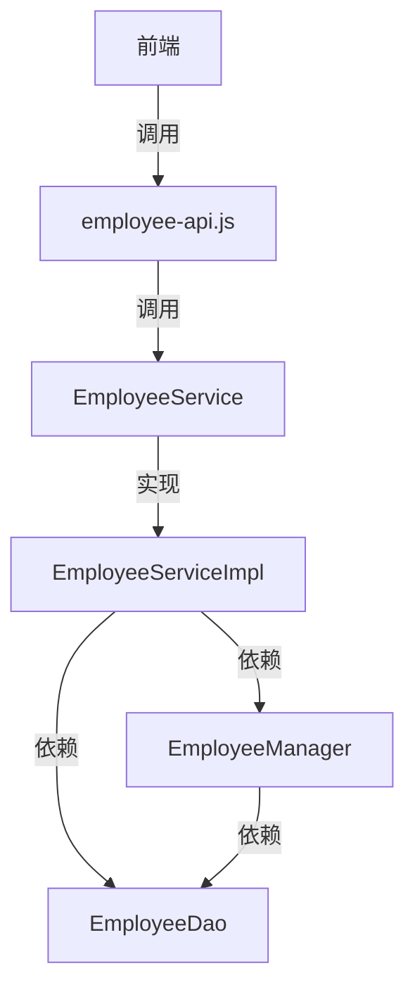
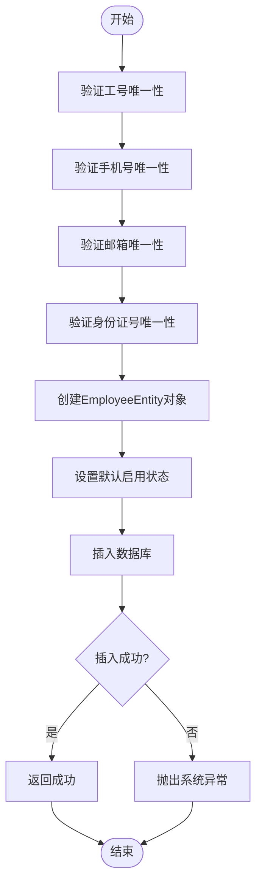
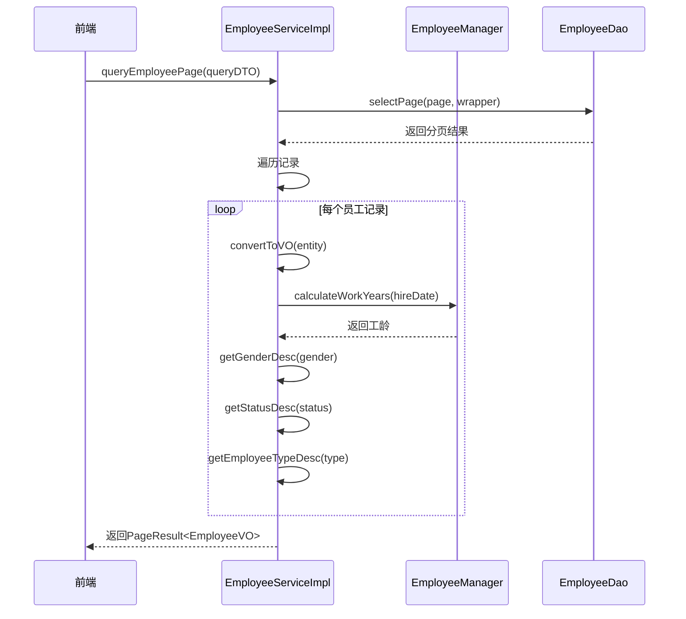
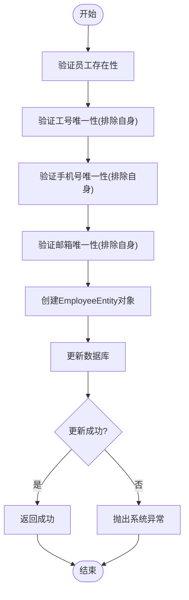
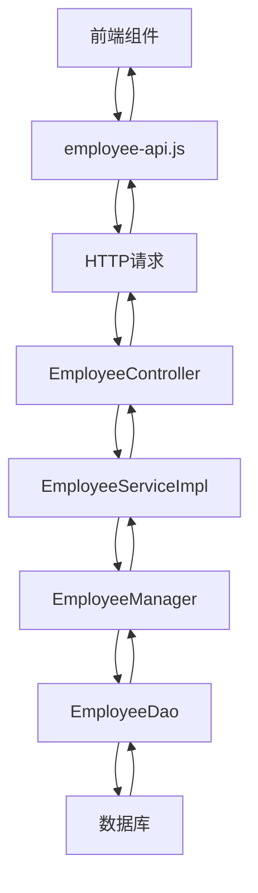

# 员工管理

<cite>
**本文档引用的文件**   
- [EmployeeServiceImpl.java](file://microservices\ioedream-common-service\src\main\java\net\lab1024\sa\common\system\employee\service\impl\EmployeeServiceImpl.java)
- [EmployeeService.java](file://microservices\microservices-common-business\src\main\java\net\lab1024\sa\common\system\employee\service\EmployeeService.java)
- [EmployeeManager.java](file://microservices\microservices-common-business\src\main\java\net\lab1024\sa\common\system\employee\manager\EmployeeManager.java)
- [employee-api.js](file://smart-admin-web-javascript\src\api\system\employee-api.js)
</cite>

## 目录
1. [简介](#简介)
2. [核心组件分析](#核心组件分析)
3. [addEmployee方法实现流程](#addemployee方法实现流程)
4. [queryEmployee方法数据整合](#queryemployee方法数据整合)
5. [updateEmployee并发控制](#updateemployee并发控制)
6. [调用关系与示例](#调用关系与示例)

## 简介
员工管理模块是系统核心功能之一，负责员工信息的全生命周期管理。该模块通过EmployeeService提供员工新增、查询和更新等核心业务逻辑，确保数据一致性、完整性和安全性。系统采用分层架构设计，前端通过API接口调用后端服务，后端服务通过Manager层协调数据访问与业务规则验证。

## 核心组件分析

员工管理模块采用典型的分层架构，包含前端API、服务接口、服务实现和管理器组件。EmployeeService作为核心服务接口，定义了员工管理的各项操作契约；EmployeeServiceImpl实现了具体业务逻辑；EmployeeManager负责复杂业务流程编排和数据验证。

**图表来源**
- [employee-api.js](file://smart-admin-web-javascript\src\api\system\employee-api.js)
- [EmployeeServiceImpl.java](file://microservices\ioedream-common-service\src\main\java\net\lab1024\sa\common\system\employee\service\impl\EmployeeServiceImpl.java)
- [EmployeeService.java](file://microservices\microservices-common-business\src\main\java\net\lab1024\sa\common\system\employee\service\EmployeeService.java)
- [EmployeeManager.java](file://microservices\microservices-common-business\src\main\java\net\lab1024\sa\common\system\employee\manager\EmployeeManager.java)

**章节来源**
- [EmployeeServiceImpl.java](file://microservices\ioedream-common-service\src\main\java\net\lab1024\sa\common\system\employee\service\impl\EmployeeServiceImpl.java)
- [EmployeeService.java](file://microservices\microservices-common-business\src\main\java\net\lab1024\sa\common\system\employee\service\EmployeeService.java)

## addEmployee方法实现流程

addEmployee方法实现了员工新增的完整业务流程，确保数据的完整性和唯一性约束。该方法首先验证员工工号、手机号、邮箱和身份证号的唯一性，然后进行数据持久化操作。

**图表来源**
- [EmployeeServiceImpl.java](file://microservices\ioedream-common-service\src\main\java\net\lab1024\sa\common\system\employee\service\impl\EmployeeServiceImpl.java)
- [EmployeeManager.java](file://microservices\microservices-common-business\src\main\java\net\lab1024\sa\common\system\employee\manager\EmployeeManager.java)

**章节来源**
- [EmployeeServiceImpl.java](file://microservices\ioedream-common-service\src\main\java\net\lab1024\sa\common\system\employee\service\impl\EmployeeServiceImpl.java#L148-L192)

## queryEmployee方法数据整合

queryEmployee方法通过分页查询机制获取员工信息，并自动计算工龄、性别描述、状态描述等衍生字段。该方法利用EmployeeManager获取基础数据，然后通过对象转换生成最终的VO对象。

**图表来源**
- [EmployeeServiceImpl.java](file://microservices\ioedream-common-service\src\main\java\net\lab1024\sa\common\system\employee\service\impl\EmployeeServiceImpl.java)
- [EmployeeManager.java](file://microservices\microservices-common-business\src\main\java\net\lab1024\sa\common\system\employee\manager\EmployeeManager.java)

**章节来源**
- [EmployeeServiceImpl.java](file://microservices\ioedream-common-service\src\main\java\net\lab1024\sa\common\system\employee\service\impl\EmployeeServiceImpl.java#L57-L117)

## updateEmployee并发控制

updateEmployee方法通过业务层的唯一性校验机制而非synchronized关键字来防止并发更新冲突。系统通过验证工号、手机号和邮箱的唯一性来确保数据一致性，同时利用数据库的乐观锁机制处理并发更新。

**图表来源**
- [EmployeeServiceImpl.java](file://microservices\ioedream-common-service\src\main\java\net\lab1024\sa\common\system\employee\service\impl\EmployeeServiceImpl.java)
- [EmployeeManager.java](file://microservices\microservices-common-business\src\main\java\net\lab1024\sa\common\system\employee\manager\EmployeeManager.java)

**章节来源**
- [EmployeeServiceImpl.java](file://microservices\ioedream-common-service\src\main\java\net\lab1024\sa\common\system\employee\service\impl\EmployeeServiceImpl.java#L206-L249)

## 调用关系与示例

员工管理模块的调用关系清晰，前端通过employee-api.js封装的API接口调用后端服务，后端服务通过分层架构实现业务逻辑。系统未使用SmartBeanUtil进行对象转换，而是直接使用Spring的BeanUtils工具类。

**图表来源**
- [employee-api.js](file://smart-admin-web-javascript\src\api\system\employee-api.js)
- [EmployeeServiceImpl.java](file://microservices\ioedream-common-service\src\main\java\net\lab1024\sa\common\system\employee\service\impl\EmployeeServiceImpl.java)

**章节来源**
- [employee-api.js](file://smart-admin-web-javascript\src\api\system\employee-api.js#L23-L37)
- [EmployeeServiceImpl.java](file://microservices\ioedream-common-service\src\main\java\net\lab1024\sa\common\system\employee\service\impl\EmployeeServiceImpl.java)