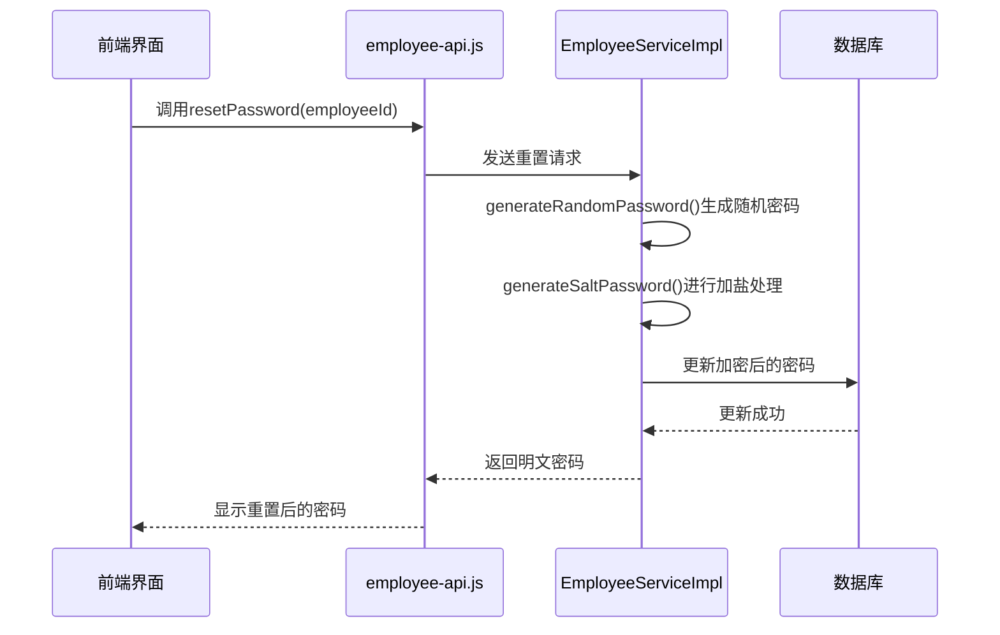
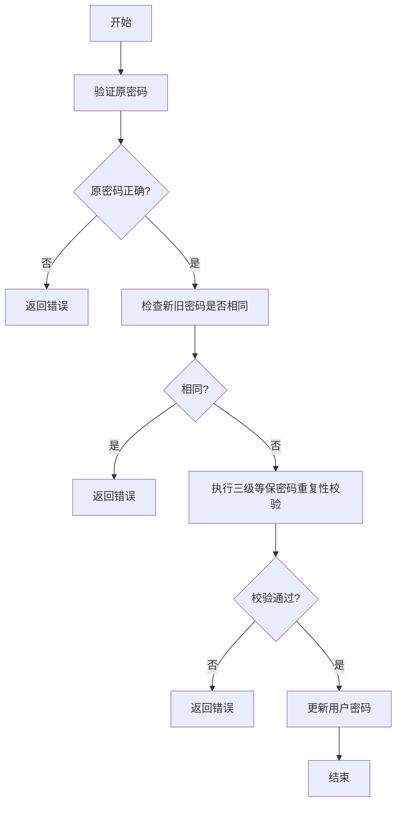
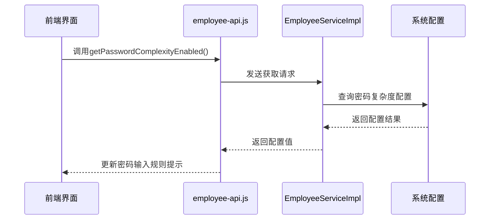
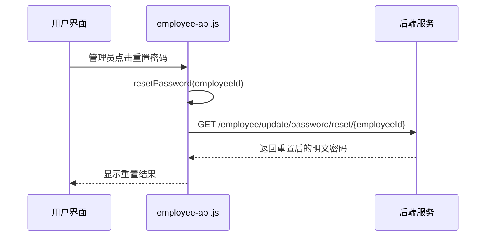
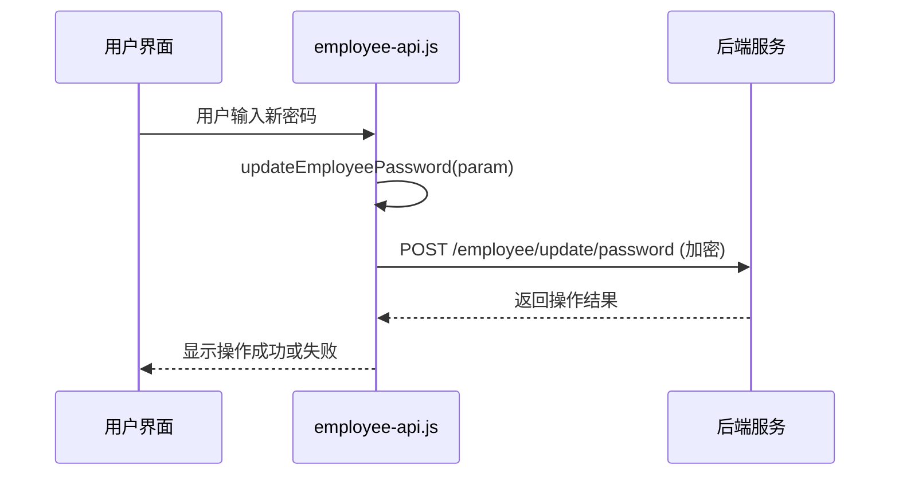
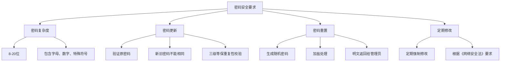

# 密码管理

<cite>
**本文档引用的文件**
- [employee-api.js](file://smart-admin-web-javascript\src\api\system\employee-api.js)
- [EmployeeServiceImpl.java](file://microservices\ioedream-common-service\src\main\java\net\lab1024\sa\common\system\employee\service\impl\EmployeeServiceImpl.java)
- [regular-change-password-modal.vue](file://smart-admin-web-javascript\src\layout\components\change-password\regular-change-password-modal.vue)
- [index.vue](file://smart-admin-web-javascript\src\views\system\account\components\password\index.vue)
</cite>

## 目录
1. [简介](#简介)
2. [密码重置流程](#密码重置流程)
3. [密码更新流程](#密码更新流程)
4. [密码复杂度配置获取](#密码复杂度配置获取)
5. [前端调用示例](#前端调用示例)
6. [安全合规性说明](#安全合规性说明)

## 简介
本系统实现了完整的密码管理功能，包括密码重置、密码更新和密码复杂度校验等核心业务逻辑。系统遵循《网络安全法》和《数据安全法》的要求，确保用户密码的安全性。密码管理功能主要通过后端Java服务实现业务逻辑，前端JavaScript进行调用展示，形成了完整的密码管理解决方案。

## 密码重置流程
密码重置功能允许管理员为员工重置密码。系统会自动生成随机密码，进行加盐处理后更新到数据库，并将明文密码返回给管理员。

**图示来源**
- [employee-api.js](file://smart-admin-web-javascript\src\api\system\employee-api.js#L71-L73)
- [EmployeeServiceImpl.java](file://microservices\ioedream-common-service\src\main\java\net\lab1024\sa\common\system\employee\service\impl\EmployeeServiceImpl.java)

**本节来源**
- [employee-api.js](file://smart-admin-web-javascript\src\api\system\employee-api.js#L71-L73)

## 密码更新流程
密码更新功能允许用户修改自己的密码，系统会进行严格的验证和校验。

**图示来源**
- [EmployeeServiceImpl.java](file://microservices\ioedream-common-service\src\main\java\net\lab1024\sa\common\system\employee\service\impl\EmployeeServiceImpl.java)
- [index.vue](file://smart-admin-web-javascript\src\views\system\account\components\password\index.vue#L82-L97)

**本节来源**
- [EmployeeServiceImpl.java](file://microservices\ioedream-common-service\src\main\java\net\lab1024\sa\common\system\employee\service\impl\EmployeeServiceImpl.java)
- [index.vue](file://smart-admin-web-javascript\src\views\system\account\components\password\index.vue#L82-L97)

## 密码复杂度配置获取
系统提供了获取密码复杂度配置的功能，用于前端展示密码输入规则。

**图示来源**
- [employee-api.js](file://smart-admin-web-javascript\src\api\system\employee-api.js#L83-L85)
- [index.vue](file://smart-admin-web-javascript\src\views\system\account\components\password\index.vue#L39-L45)

**本节来源**
- [employee-api.js](file://smart-admin-web-javascript\src\api\system\employee-api.js#L83-L85)
- [index.vue](file://smart-admin-web-javascript\src\views\system\account\components\password\index.vue#L39-L45)

## 前端调用示例
前端通过API调用实现密码管理功能，以下是具体的调用示例。

### 重置密码调用

### 更新密码调用

**图示来源**
- [employee-api.js](file://smart-admin-web-javascript\src\api\system\employee-api.js#L71-L79)

**本节来源**
- [employee-api.js](file://smart-admin-web-javascript\src\api\system\employee-api.js#L71-L79)

## 安全合规性说明
系统严格遵循三级等保要求，实现了全面的密码安全管理。

**图示来源**
- [regular-change-password-modal.vue](file://smart-admin-web-javascript\src\layout\components\change-password\regular-change-password-modal.vue#L12)
- [index.vue](file://smart-admin-web-javascript\src\views\system\account\components\password\index.vue#L30-L34)

**本节来源**
- [regular-change-password-modal.vue](file://smart-admin-web-javascript\src\layout\components\change-password\regular-change-password-modal.vue#L12)
- [index.vue](file://smart-admin-web-javascript\src\views\system\account\components\password\index.vue#L30-L34)