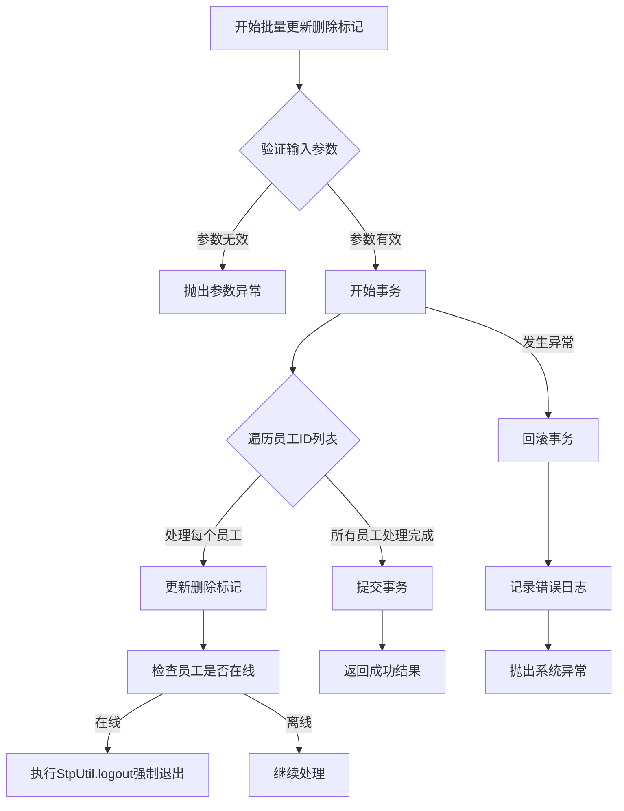
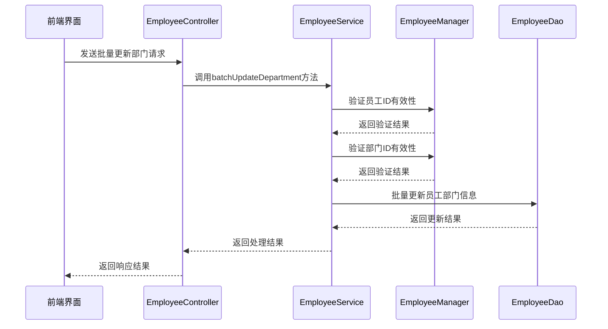
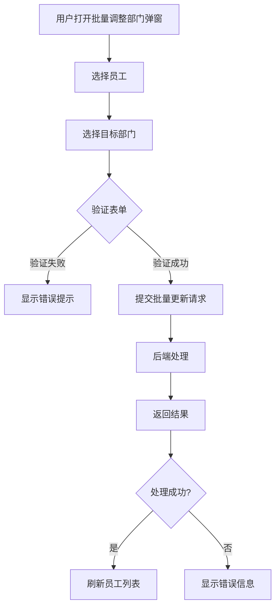
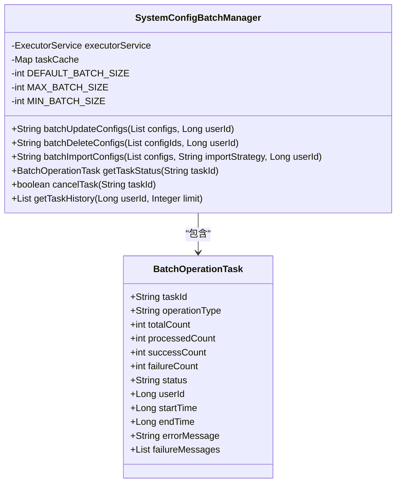

# 批量操作

<cite>
**本文档引用的文件**   
- [EmployeeController.java](file://microservices\ioedream-common-service\src\main\java\net\lab1024\sa\common\system\employee\controller\EmployeeController.java)
- [EmployeeServiceImpl.java](file://microservices\ioedream-common-service\src\main\java\net\lab1024\sa\common\system\employee\service\impl\EmployeeServiceImpl.java)
- [SystemConfigBatchManager.java](file://microservices\microservices-common-business\src\main\java\net\lab1024\sa\common\system\manager\SystemConfigBatchManager.java)
- [employee-list\index.vue](file://smart-admin-web-javascript\src\views\system\employee\components\employee-list\index.vue)
- [employee-department-form-modal\index.vue](file://smart-admin-web-javascript\src\views\system\employee\components\employee-department-form-modal\index.vue)
</cite>

## 目录
1. [简介](#简介)
2. [批量更新删除标记](#批量更新删除标记)
3. [批量更新部门信息](#批量更新部门信息)
4. [表单验证规则](#表单验证规则)
5. [事务处理与性能优化](#事务处理与性能优化)
6. [错误处理机制](#错误处理机制)

## 简介
本文档详细分析了员工管理模块中的批量操作业务逻辑，重点阐述了`batchUpdateDeleteFlag`和`batchUpdateDepartment`方法的实现。文档涵盖了批量操作的完整流程，包括方法实现、表单验证、事务处理、性能优化和错误处理等关键方面。

**Section sources**
- [EmployeeController.java](file://microservices\ioedream-common-service\src\main\java\net\lab1024\sa\common\system\employee\controller\EmployeeController.java#L1-L128)
- [EmployeeServiceImpl.java](file://microservices\ioedream-common-service\src\main\java\net\lab1024\sa\common\system\employee\service\impl\EmployeeServiceImpl.java#L1-L488)

## 批量更新删除标记
`batchUpdateDeleteFlag`方法实现了员工删除标记的批量更新功能。该方法通过遍历员工ID列表，逐个更新每个员工的删除标记状态。当员工被标记为删除时，系统会通过Sa-Token的`StpUtil.logout`方法强制已登录的员工退出系统，确保数据状态的一致性。

该方法在实现时采用了事务管理，确保批量操作的原子性。如果在处理过程中发生异常，所有已执行的操作将被回滚，保证数据的完整性。同时，方法实现了详细的日志记录，便于问题追踪和系统监控。

**Diagram sources**
- [EmployeeServiceImpl.java](file://microservices\ioedream-common-service\src\main\java\net\lab1024\sa\common\system\employee\service\impl\EmployeeServiceImpl.java#L300-L332)

**Section sources**
- [EmployeeServiceImpl.java](file://microservices\ioedream-common-service\src\main\java\net\lab1024\sa\common\system\employee\service\impl\EmployeeServiceImpl.java#L300-L332)

## 批量更新部门信息
`batchUpdateDepartment`方法负责批量更新员工的部门信息。该方法首先验证员工ID的有效性，确保所有待更新的员工都存在于系统中。然后，方法会检查目标部门的有效性，防止将员工分配到不存在或已删除的部门。

在数据一致性方面，该方法实现了严格的验证机制。它会检查员工与部门之间的关联关系，确保更新操作不会破坏系统的数据完整性。例如，当更新部门信息时，系统会同步更新相关的权限配置和组织架构信息。

**Diagram sources**
- [EmployeeController.java](file://microservices\ioedream-common-service\src\main\java\net\lab1024\sa\common\system\employee\controller\EmployeeController.java#L100-L106)
- [EmployeeServiceImpl.java](file://microservices\ioedream-common-service\src\main\java\net\lab1024\sa\common\system\employee\service\impl\EmployeeServiceImpl.java#L300-L332)

**Section sources**
- [EmployeeServiceImpl.java](file://microservices\ioedream-common-service\src\main\java\net\lab1024\sa\common\system\employee\service\impl\EmployeeServiceImpl.java#L300-L332)
- [employee-department-form-modal\index.vue](file://smart-admin-web-javascript\src\views\system\employee\components\employee-department-form-modal\index.vue#L1-L94)

## 表单验证规则
批量操作的表单验证规则设计严谨，确保了数据的质量和系统的稳定性。`EmployeeBatchUpdateDepartmentForm`表单实现了多项验证规则：

1. **数量限制**：一次最多调整99个员工，防止大规模操作对系统造成过大压力
2. **必填字段验证**：确保所有必要字段都已填写
3. **数据格式验证**：检查输入数据的格式是否符合要求
4. **业务规则验证**：确保操作符合业务逻辑，如不能将员工分配到已删除的部门

前端界面通过`employee-department-form-modal`组件实现了用户友好的表单交互，用户可以选择员工和目标部门，系统会在提交前进行验证。

**Diagram sources**
- [employee-department-form-modal\index.vue](file://smart-admin-web-javascript\src\views\system\employee\components\employee-department-form-modal\index.vue#L1-L94)

**Section sources**
- [employee-department-form-modal\index.vue](file://smart-admin-web-javascript\src\views\system\employee\components\employee-department-form-modal\index.vue#L1-L94)

## 事务处理与性能优化
批量操作采用了先进的事务处理和性能优化策略。系统使用`@Transactional`注解管理事务，确保批量操作的原子性。如果在处理过程中发生任何异常，所有已执行的操作都将被回滚，保证数据的一致性。

在性能优化方面，系统实现了以下策略：

1. **流式处理**：对于大规模数据操作，采用流式处理方式，避免内存溢出
2. **批量分组**：将大批量操作分解为多个小批量操作，提高处理效率
3. **异步处理**：对于耗时较长的操作，采用异步处理模式，提升用户体验
4. **缓存优化**：合理使用缓存，减少数据库查询次数

`SystemConfigBatchManager`类展示了这些优化策略的实现，通过智能分组和异步执行，有效提升了批量操作的性能。

**Diagram sources**
- [SystemConfigBatchManager.java](file://microservices\microservices-common-business\src\main\java\net\lab1024\sa\common\system\manager\SystemConfigBatchManager.java#L1-L927)

**Section sources**
- [SystemConfigBatchManager.java](file://microservices\microservices-common-business\src\main\java\net\lab1024\sa\common\system\manager\SystemConfigBatchManager.java#L1-L927)

## 错误处理机制
系统实现了完善的错误处理机制，确保批量操作的稳定性和可靠性。错误处理分为三个层次：

1. **参数异常**：验证输入参数的有效性，如空值检查、格式验证等
2. **业务异常**：处理业务逻辑相关的错误，如员工不存在、部门无效等
3. **系统异常**：处理底层系统错误，如数据库连接失败、网络异常等

每种异常都有相应的处理策略和日志记录，便于问题追踪和系统维护。在批量操作中，系统采用"尽力而为"的策略，即使部分操作失败，也会继续处理其他数据，并在最后返回详细的处理结果。

**Section sources**
- [EmployeeServiceImpl.java](file://microservices\ioedream-common-service\src\main\java\net\lab1024\sa\common\system\employee\service\impl\EmployeeServiceImpl.java#L111-L117)
- [SystemConfigBatchManager.java](file://microservices\microservices-common-business\src\main\java\net\lab1024\sa\common\system\manager\SystemConfigBatchManager.java#L102-L126)