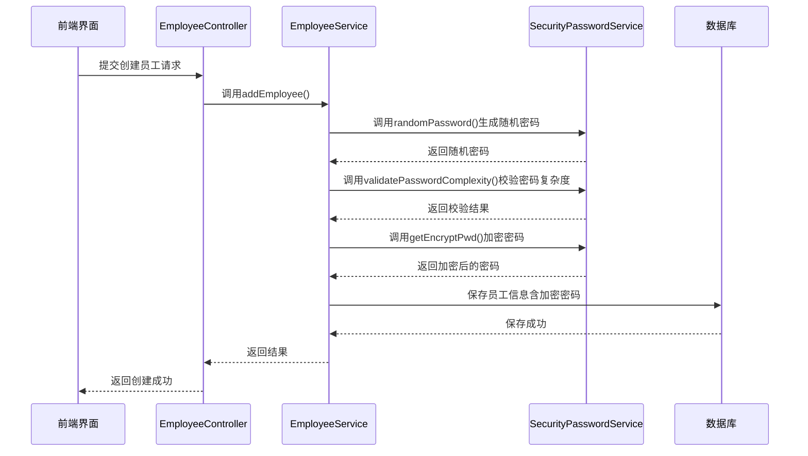
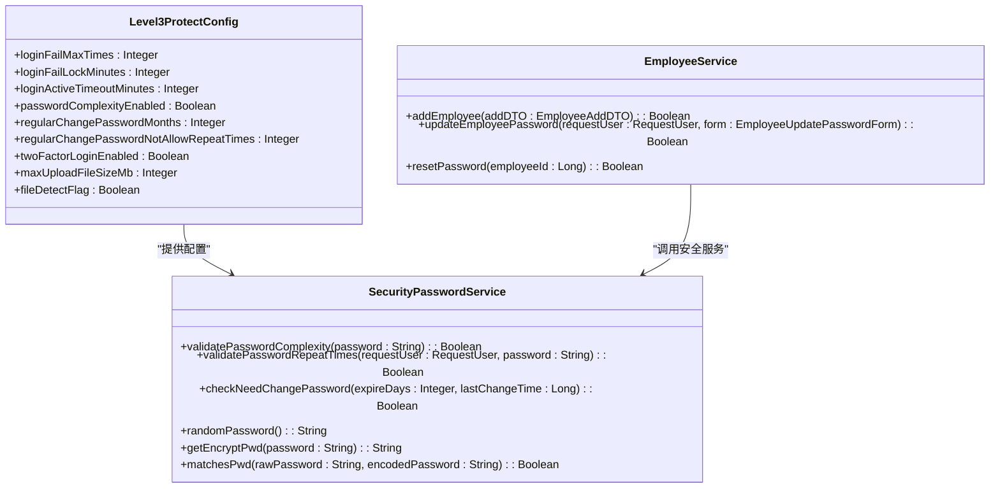
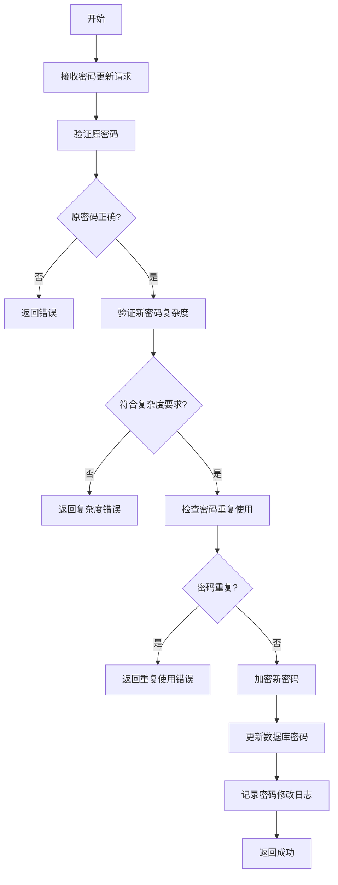
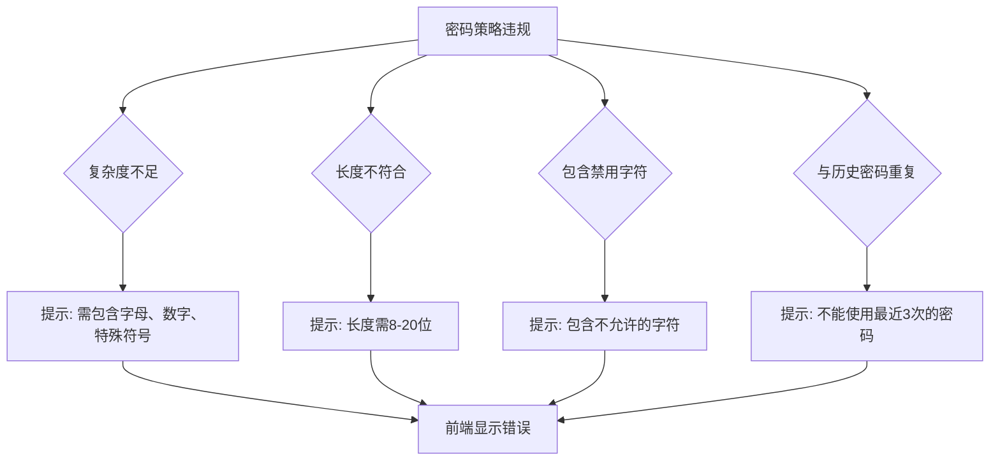
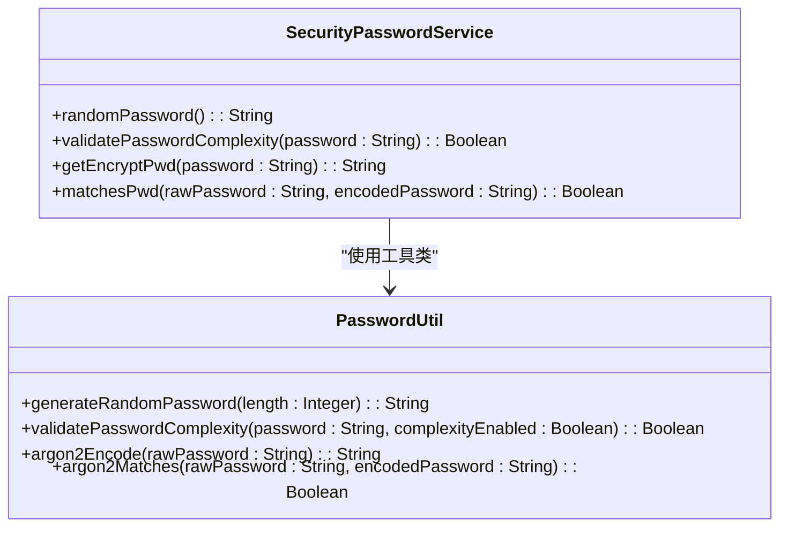

# 与安全服务协作

<cite>
**本文档引用的文件**  
- [EmployeeServiceImpl.java](file://microservices\ioedream-common-service\src\main\java\net\lab1024\sa\common\system\employee\service\impl\EmployeeServiceImpl.java)
- [SecurityPasswordService.java](file://smart-admin-api-java17-springboot3\sa-base\src\main\java\net\lab1024\sa\base\module\support\securityprotect\service\SecurityPasswordService.java)
- [level3-protect-config-index.vue](file://smart-admin-web-javascript\src\views\support\level3protect\level3-protect-config-index.vue)
- [password\index.vue](file://smart-admin-web-javascript\src\views\system\account\components\password\index.vue)
- [PasswordUtil.java](file://microservices\microservices-common\src\main\java\net\lab1024\sa\common\auth\util\PasswordUtil.java)
</cite>

## 目录
1. [引言](#引言)
2. [核心组件分析](#核心组件分析)
3. [密码安全协作机制](#密码安全协作机制)
4. [密码策略配置与传递](#密码策略配置与传递)
5. [密码处理流程](#密码处理流程)
6. [异常处理机制](#异常处理机制)
7. [安全服务集成最佳实践](#安全服务集成最佳实践)
8. [结论](#结论)

## 引言
本文档详细阐述了EmployeeService与SecurityPasswordService在密码安全功能方面的协作机制。重点分析了在员工创建和密码更新场景下，两个服务如何协同工作以确保密码的安全性。文档涵盖了密码生成、复杂度校验、加密存储、策略配置、历史记录管理以及异常处理等关键方面，并通过具体的方法调用链展示了完整的密码处理流程。

## 核心组件分析

**Section sources**
- [EmployeeServiceImpl.java](file://microservices\ioedream-common-service\src\main\java\net\lab1024\sa\common\system\employee\service\impl\EmployeeServiceImpl.java)
- [SecurityPasswordService.java](file://smart-admin-api-java17-springboot3\sa-base\src\main\java\net\lab1024\sa\base\module\support\securityprotect\service\SecurityPasswordService.java)

## 密码安全协作机制

EmployeeService与SecurityPasswordService的协作是系统安全架构的核心部分。EmployeeService作为业务逻辑的入口，负责处理员工相关的所有操作，而SecurityPasswordService则专注于密码安全相关的技术实现。

在员工创建（addEmployee）和密码更新（updateEmployeePassword）等关键场景中，EmployeeService会调用SecurityPasswordService提供的接口来完成密码的生成、校验和加密。这种职责分离的设计模式确保了业务逻辑与安全逻辑的解耦，提高了代码的可维护性和安全性。

**Diagram sources**
- [EmployeeServiceImpl.java](file://microservices\ioedream-common-service\src\main\java\net\lab1024\sa\common\system\employee\service\impl\EmployeeServiceImpl.java)
- [SecurityPasswordService.java](file://smart-admin-api-java17-springboot3\sa-base\src\main\java\net\lab1024\sa\base\module\support\securityprotect\service\SecurityPasswordService.java)

## 密码策略配置与传递

系统通过三级等保配置模块来管理密码策略。密码策略主要包括密码复杂度、定期修改周期和密码重复使用限制等。

**Diagram sources**
- [level3-protect-config-index.vue](file://smart-admin-web-javascript\src\views\support\level3protect\level3-protect-config-index.vue)
- [SecurityPasswordService.java](file://smart-admin-api-java17-springboot3\sa-base\src\main\java\net\lab1024\sa\base\module\support\securityprotect\service\SecurityPasswordService.java)

**Section sources**
- [level3-protect-config-index.vue](file://smart-admin-web-javascript\src\views\support\level3protect\level3-protect-config-index.vue)
- [SecurityPasswordService.java](file://smart-admin-api-java17-springboot3\sa-base\src\main\java\net\lab1024\sa\base\module\support\securityprotect\service\SecurityPasswordService.java)

## 密码处理流程

### 员工创建流程
1. 前端提交员工创建请求
2. EmployeeService调用SecurityPasswordService.randomPassword()生成随机密码
3. 调用SecurityPasswordService.validatePasswordComplexity()验证密码复杂度
4. 调用SecurityPasswordService.getEncryptPwd()对密码进行加密
5. 将加密后的密码与其他员工信息一起保存到数据库

### 密码更新流程
1. 前端提交密码更新请求
2. EmployeeService验证原密码是否正确
3. 调用SecurityPasswordService.validatePasswordComplexity()验证新密码复杂度
4. 调用SecurityPasswordService.validatePasswordRepeatTimes()检查密码是否重复使用
5. 调用SecurityPasswordService.getEncryptPwd()加密新密码
6. 更新数据库中的密码字段，并记录密码修改日志

**Diagram sources**
- [password\index.vue](file://smart-admin-web-javascript\src\views\system\account\components\password\index.vue)
- [SecurityPasswordService.java](file://smart-admin-api-java17-springboot3\sa-base\src\main\java\net\lab1024\sa\base\module\support\securityprotect\service\SecurityPasswordService.java)

**Section sources**
- [password\index.vue](file://smart-admin-web-javascript\src\views\system\account\components\password\index.vue)
- [SecurityPasswordService.java](file://smart-admin-api-java17-springboot3\sa-base\src\main\java\net\lab1024\sa\base\module\support\securityprotect\service\SecurityPasswordService.java)

## 异常处理机制

系统实现了完善的异常处理机制来应对各种密码安全相关的异常情况。

### 密码重复使用检测
当用户尝试使用最近使用过的密码时，系统会通过SecurityPasswordService.validatePasswordRepeatTimes()方法进行检测。该方法会查询密码历史记录，检查新密码是否与最近N次使用的密码相同。

### 密码策略违规处理
当密码不符合复杂度要求时，系统会返回明确的错误信息。前端会根据系统的密码复杂度配置动态调整验证规则。

**Diagram sources**
- [SecurityPasswordService.java](file://smart-admin-api-java17-springboot3\sa-base\src\main\java\net\lab1024\sa\base\module\support\securityprotect\service\SecurityPasswordService.java)

**Section sources**
- [SecurityPasswordService.java](file://smart-admin-api-java17-springboot3\sa-base\src\main\java\net\lab1024\sa\base\module\support\securityprotect\service\SecurityPasswordService.java)

## 安全服务集成最佳实践

### 密码生成
使用SecurityPasswordService.randomPassword()方法生成符合复杂度要求的随机密码，确保密码的随机性和不可预测性。

### 密码加密
采用Argon2算法进行密码加密，该算法具有良好的抗暴力破解能力。通过SecurityPasswordService.getEncryptPwd()方法实现加密。

### 密码验证
在验证密码时，使用SecurityPasswordService.matchesPwd()方法进行安全的密码比对，避免时序攻击。

### 密码历史管理
系统会记录用户的密码修改历史，防止密码重复使用。通过SecurityPasswordService.saveUserChangePasswordLog()方法记录密码修改日志。

**Diagram sources**
- [PasswordUtil.java](file://microservices\microservices-common\src\main\java\net\lab1024\sa\common\auth\util\PasswordUtil.java)
- [SecurityPasswordService.java](file://smart-admin-api-java17-springboot3\sa-base\src\main\java\net\lab1024\sa\base\module\support\securityprotect\service\SecurityPasswordService.java)

**Section sources**
- [PasswordUtil.java](file://microservices\microservices-common\src\main\java\net\lab1024\sa\common\auth\util\PasswordUtil.java)
- [SecurityPasswordService.java](file://smart-admin-api-java17-springboot3\sa-base\src\main\java\net\lab1024\sa\base\module\support\securityprotect\service\SecurityPasswordService.java)

## 结论
EmployeeService与SecurityPasswordService的协作机制为系统提供了强大的密码安全保障。通过清晰的职责划分、完善的密码策略管理和严格的异常处理，系统能够有效防范各种密码相关的安全风险。建议在实际开发中遵循本文档描述的最佳实践，确保密码处理的安全性和可靠性。