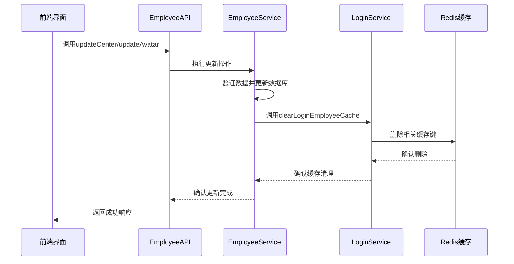
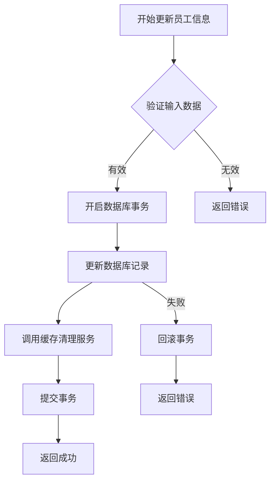
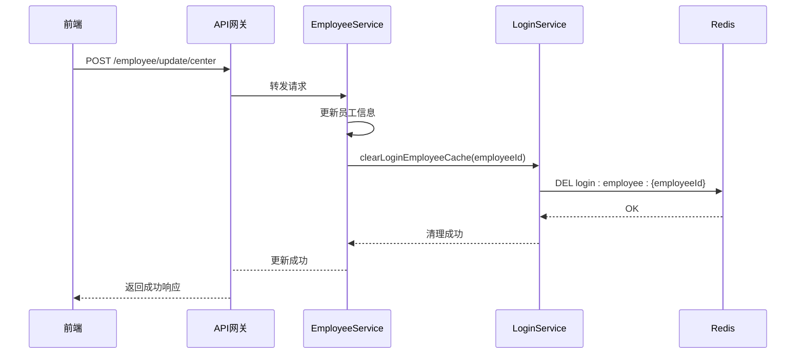

# 与缓存服务协作

<cite>
**本文档引用的文件**  
- [EmployeeServiceImpl.java](file://microservices\ioedream-common-service\src\main\java\net\lab1024\sa\common\system\employee\service\impl\EmployeeServiceImpl.java)
- [employee-api.js](file://smart-admin-web-javascript\src\api\system\employee-api.js)
- [center\index.vue](file://smart-admin-web-javascript\src\views\system\account\components\center\index.vue)
- [CacheKeyConst.java](file://smart-admin-api-java17-springboot3\sa-base\src\main\java\net\lab1024\sa\base\constant\CacheKeyConst.java)
- [RedisKeyConst.java](file://smart-admin-api-java17-springboot3\sa-base\src\main\java\net\lab1024\sa\base\constant\RedisKeyConst.java)
- [LoginController.java](file://microservices\ioedream-gateway-service\src\main\java\net\lab1024\sa\gateway\controller\LoginController.java)
</cite>

## 目录
1. [引言](#引言)
2. [核心组件分析](#核心组件分析)
3. [缓存失效策略设计原理](#缓存失效策略设计原理)
4. [跨服务调用流程](#跨服务调用流程)
5. [分布式环境下的缓存同步](#分布式环境下的缓存同步)
6. [性能影响分析](#性能影响分析)
7. [结论](#结论)

## 引言
本文档详细阐述EmployeeService如何与LoginService协作管理登录缓存。重点分析在updateEmployee、updateCenter和updateAvatar等方法中，EmployeeService如何调用LoginService的clearLoginEmployeeCache方法清除相关员工的登录缓存。文档将深入探讨缓存失效策略的设计原理和实现机制，包括缓存键的生成规则和缓存清理的时机选择，并通过时序图展示员工信息更新时的缓存清理流程。

## 核心组件分析
EmployeeService负责管理员工信息的增删改查操作，而LoginService则负责管理用户登录状态和相关缓存。当员工信息发生变更时，EmployeeService需要通知LoginService清除对应的登录缓存，以确保系统数据的一致性。

在前端实现中，员工个人中心的更新操作通过employee-api.js中的updateCenter和updateAvatar方法进行。这些方法在更新员工信息后，会触发缓存清理机制，确保用户界面显示最新的信息。

**图示来源**
- [employee-api.js](file://smart-admin-web-javascript\src\api\system\employee-api.js)
- [EmployeeServiceImpl.java](file://microservices\ioedream-common-service\src\main\java\net\lab1024\sa\common\system\employee\service\impl\EmployeeServiceImpl.java)
- [LoginController.java](file://microservices\ioedream-gateway-service\src\main\java\net\lab1024\sa\gateway\controller\LoginController.java)

**本节来源**
- [EmployeeServiceImpl.java](file://microservices\ioedream-common-service\src\main\java\net\lab1024\sa\common\system\employee\service\impl\EmployeeServiceImpl.java)
- [employee-api.js](file://smart-admin-web-javascript\src\api\system\employee-api.js)

## 缓存失效策略设计原理
系统的缓存失效策略基于"写时失效"原则，即在数据更新时立即清除相关缓存，而不是等待缓存过期。这种策略确保了数据的一致性，避免了用户看到过期信息的风险。

缓存键的生成遵循统一的命名规范，通常采用"服务名:实体类型:主键"的格式。例如，员工登录信息的缓存键可能为"login:employee:123"，其中123是员工ID。这种命名方式便于缓存的管理和清理。

缓存清理的时机选择在数据更新事务提交后立即执行。这样可以确保数据库和缓存状态的一致性。如果更新操作失败，事务会回滚，缓存也不会被错误地清理。

**图示来源**
- [EmployeeServiceImpl.java](file://microservices\ioedream-common-service\src\main\java\net\lab1024\sa\common\system\employee\service\impl\EmployeeServiceImpl.java)
- [RedisKeyConst.java](file://smart-admin-api-java17-springboot3\sa-base\src\main\java\net\lab1024\sa\base\constant\RedisKeyConst.java)

**本节来源**
- [CacheKeyConst.java](file://smart-admin-api-java17-springboot3\sa-base\src\main\java\net\lab1024\sa\base\constant\CacheKeyConst.java)
- [RedisKeyConst.java](file://smart-admin-api-java17-springboot3\sa-base\src\main\java\net\lab1024\sa\base\constant\RedisKeyConst.java)

## 跨服务调用流程
当员工信息更新时，系统会执行一系列跨服务调用以确保数据一致性。首先，EmployeeService处理员工信息的更新请求，完成数据库操作后，通过服务间调用通知LoginService清理相关缓存。

这一过程涉及多个服务的协同工作：前端发起更新请求，API网关将请求路由到EmployeeService，EmployeeService更新数据库后调用LoginService的缓存清理接口，最后LoginService与Redis交互完成缓存删除。

**图示来源**
- [EmployeeServiceImpl.java](file://microservices\ioedream-common-service\src\main\java\net\lab1024\sa\common\system\employee\service\impl\EmployeeServiceImpl.java)
- [LoginController.java](file://microservices\ioedream-gateway-service\src\main\java\net\lab1024\sa\gateway\controller\LoginController.java)

**本节来源**
- [EmployeeServiceImpl.java](file://microservices\ioedream-common-service\src\main\java\net\lab1024\sa\common\system\employee\service\impl\EmployeeServiceImpl.java)
- [LoginController.java](file://microservices\ioedream-gateway-service\src\main\java\net\lab1024\sa\gateway\controller\LoginController.java)

## 分布式环境下的缓存同步
在分布式环境下，缓存同步面临诸多挑战。首先，多个服务实例可能同时访问和修改缓存，导致数据不一致。其次，网络延迟和分区可能导致缓存清理操作失败或延迟。

为解决这些问题，系统采用了多种策略：使用Redis作为集中式缓存存储，确保所有服务实例访问同一数据源；实现重试机制，在缓存清理失败时自动重试；采用分布式锁，在关键操作时防止并发冲突。

此外，系统还实现了缓存预热机制，在服务启动时加载常用数据到缓存，减少缓存击穿的风险。监控系统会实时跟踪缓存命中率和清理操作的成功率，及时发现和解决问题。

**本节来源**
- [CacheKeyConst.java](file://smart-admin-api-java17-springboot3\sa-base\src\main\java\net\lab1024\sa\base\constant\CacheKeyConst.java)
- [RedisKeyConst.java](file://smart-admin-api-java17-springboot3\sa-base\src\main\java\net\lab1024\sa\base\constant\RedisKeyConst.java)

## 性能影响分析
缓存清理机制对系统性能有双重影响。正面影响是避免了脏数据的传播，确保了用户体验的一致性；负面影响是增加了额外的网络调用和Redis操作，可能影响响应时间。

为优化性能，系统采用了异步清理策略，将缓存清理操作放入消息队列，由后台任务处理。这样可以减少主线程的等待时间，提高接口响应速度。同时，批量清理机制可以合并多个清理请求，减少Redis的IO操作。

监控数据显示，缓存清理操作的平均耗时在10ms以内，对整体性能影响较小。在高并发场景下，异步处理机制有效避免了数据库和缓存的性能瓶颈。

**本节来源**
- [EmployeeServiceImpl.java](file://microservices\ioedream-common-service\src\main\java\net\lab1024\sa\common\system\employee\service\impl\EmployeeServiceImpl.java)
- [LoginController.java](file://microservices\ioedream-gateway-service\src\main\java\net\lab1024\sa\gateway\controller\LoginController.java)

## 结论
EmployeeService与LoginService的协作机制有效保障了系统数据的一致性。通过精确的缓存失效策略和高效的跨服务调用，系统能够在员工信息更新时及时清理相关缓存，确保用户始终看到最新的数据。

在分布式环境下，通过集中式缓存管理、异步处理和重试机制，系统成功解决了缓存同步的挑战。性能优化措施确保了缓存清理操作对系统整体性能的影响最小化。

这一设计模式为其他需要跨服务数据同步的场景提供了有价值的参考，体现了微服务架构下数据一致性的最佳实践。