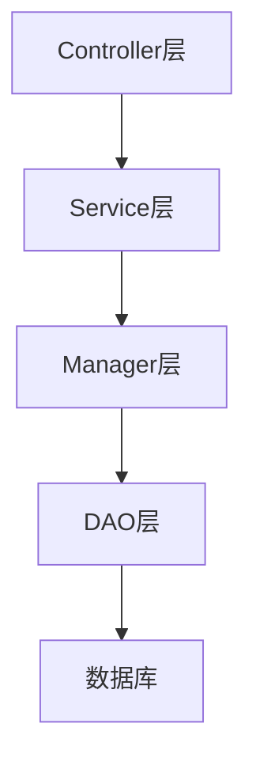
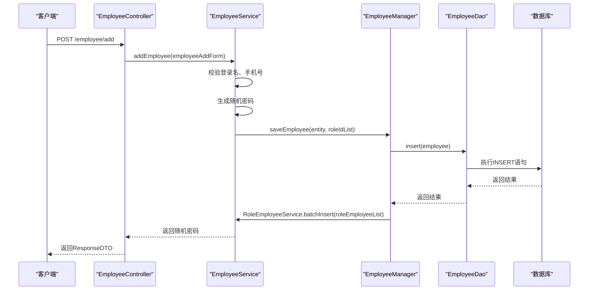
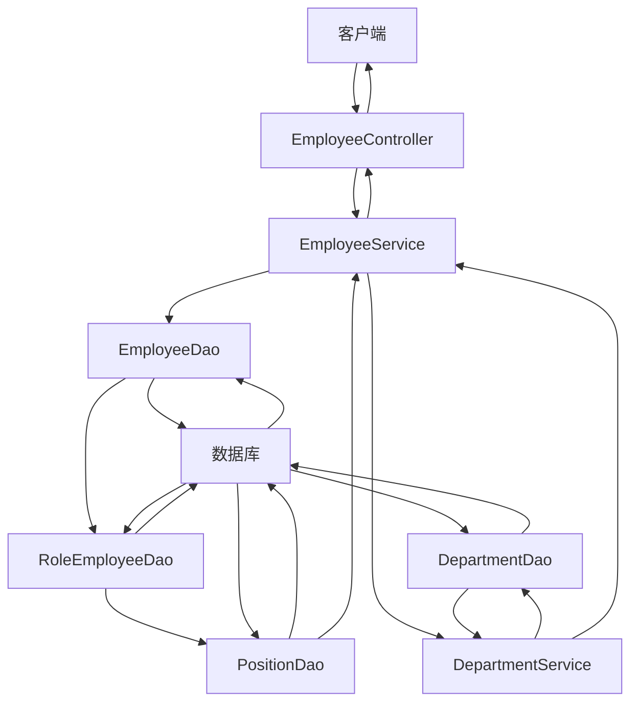

# 四层架构详解

<cite>
**本文档引用文件**  
- [EmployeeController.java](file://smart-admin-api-java17-springboot3\sa-admin\src\main\java\net\lab1024\sa\admin\module\system\employee\controller\EmployeeController.java)
- [EmployeeService.java](file://smart-admin-api-java17-springboot3\sa-admin\src\main\java\net\lab1024\sa\admin\module\system\employee\service\EmployeeService.java)
- [EmployeeManager.java](file://smart-admin-api-java17-springboot3\sa-admin\src\main\java\net\lab1024\sa\admin\module\system\employee\manager\EmployeeManager.java)
- [EmployeeDao.java](file://smart-admin-api-java17-springboot3\sa-admin\src\main\java\net\lab1024\sa\admin\module\system\employee\dao\EmployeeDao.java)
- [ResponseDTO.java](file://smart-admin-api-java17-springboot3\sa-base\src\main\java\net\lab1024\sa\base\common\domain\ResponseDTO.java)
- [GlobalExceptionHandler.java](file://smart-admin-api-java17-springboot3\sa-base\src\main\java\net\lab1024\sa\base\handler\GlobalExceptionHandler.java)
- [MybatisPlusConfig.java](file://smart-admin-api-java17-springboot3\sa-base\src\main\java\net\lab1024\sa\base\config\MybatisPlusConfig.java)
- [log4j2-spring.xml](file://smart-admin-api-java17-springboot3\sa-admin\src\main\resources\dev\log4j2-spring.xml)
</cite>

## 目录
1. [四层架构概述](#四层架构概述)
2. [Controller层详解](#controller层详解)
3. [Service层详解](#service层详解)
4. [Manager层详解](#manager层详解)
5. [DAO层详解](#dao层详解)
6. [四层架构调用链分析](#四层架构调用链分析)
7. [依赖注入机制](#依赖注入机制)
8. [异常处理机制](#异常处理机制)
9. [日志记录策略](#日志记录策略)
10. [命名规范](#命名规范)

## 四层架构概述

本系统采用四层架构设计模式，将应用程序划分为Controller、Service、Manager和DAO四个层次。这种架构设计相比传统的三层架构（Controller、Service、DAO）增加了Manager层，提供了更好的代码组织和职责分离。

四层架构的主要优势包括：
- **职责分离更清晰**：每个层次都有明确的职责，降低了代码耦合度
- **业务逻辑复用性更高**：Manager层封装了复杂的业务逻辑，便于在不同Service中复用
- **事务管理更灵活**：Manager层可以跨多个DAO操作进行事务管理
- **代码可维护性更强**：层次分明的结构使代码更易于理解和维护

**四层架构职责划分**
- **Controller层**：负责接收HTTP请求，进行参数校验，调用Service层处理业务逻辑
- **Service层**：负责管理事务，处理核心业务逻辑，协调多个Manager层的操作
- **Manager层**：封装复杂业务逻辑，处理跨模块调用，提供原子性操作
- **DAO层**：负责数据访问，使用MyBatis-Plus进行数据库操作



**Diagram sources**
- [EmployeeController.java](file://smart-admin-api-java17-springboot3\sa-admin\src\main\java\net\lab1024\sa\admin\module\system\employee\controller\EmployeeController.java)
- [EmployeeService.java](file://smart-admin-api-java17-springboot3\sa-admin\src\main\java\net\lab1024\sa\admin\module\system\employee\service\EmployeeService.java)

## Controller层详解

Controller层是系统的入口，负责接收HTTP请求并进行初步处理。在员工管理模块中，`EmployeeController`类展示了Controller层的典型实现。

### 请求接收与参数校验

Controller层通过Spring MVC的注解接收HTTP请求，并使用JSR-303验证框架进行参数校验。例如，在添加员工的接口中：

```java
@PostMapping("/employee/add")
@SaCheckPermission("system:employee:add")
public ResponseDTO<String> addEmployee(@Valid @RequestBody EmployeeAddForm employeeAddForm) {
    return employeeService.addEmployee(employeeAddForm);
}
```

这里使用了`@Valid`注解对`EmployeeAddForm`对象进行校验，确保请求参数符合预定义的约束条件。

### 安全控制

Controller层还负责安全控制，通过`@SaCheckPermission`注解实现权限校验，确保只有具有相应权限的用户才能访问特定接口。

### 响应处理

Controller层调用Service层处理业务逻辑，并将结果封装为统一的响应格式`ResponseDTO`返回给客户端。

**Controller层特点**
- 使用`@RestController`注解标记为REST控制器
- 通过`@Resource`注解注入Service层依赖
- 使用`@PostMapping`、`@GetMapping`等注解映射HTTP请求
- 通过`@Valid`注解实现参数校验
- 使用`@Operation`注解提供Swagger文档

**Section sources**
- [EmployeeController.java](file://smart-admin-api-java17-springboot3\sa-admin\src\main\java\net\lab1024\sa\admin\module\system\employee\controller\EmployeeController.java)

## Service层详解

Service层是业务逻辑的核心，负责管理事务和处理复杂的业务流程。在员工管理模块中，`EmployeeService`类展示了Service层的典型实现。

### 事务管理

Service层使用`@Transactional`注解管理事务，确保业务操作的原子性。例如，在更新密码的方法中：

```java
@Transactional(rollbackFor = Throwable.class)
public ResponseDTO<String> updatePassword(RequestUser requestUser, EmployeeUpdatePasswordForm updatePasswordForm) {
    // 业务逻辑
}
```

### 业务逻辑处理

Service层协调多个Manager层的操作，处理复杂的业务流程。例如，在查询员工列表时，Service层需要：
1. 调用DAO层查询员工基本信息
2. 调用DAO层查询员工角色信息
3. 调用DAO层查询员工职位信息
4. 将多个数据源的结果整合并返回

### 依赖注入

Service层通过`@Resource`注解注入DAO层和Manager层的依赖，实现松耦合的设计。

**Service层特点**
- 使用`@Service`注解标记为服务组件
- 通过`@Resource`注解注入DAO层和Manager层依赖
- 使用`@Transactional`注解管理事务
- 处理复杂的业务逻辑和数据整合
- 提供业务方法供Controller层调用

**Section sources**
- [EmployeeService.java](file://smart-admin-api-java17-springboot3\sa-admin\src\main\java\net\lab1024\sa\admin\module\system\employee\service\EmployeeService.java)

## Manager层详解

Manager层是四层架构中的关键创新，它封装了复杂的业务逻辑和跨模块调用，提供了比Service层更细粒度的操作。

### 复杂业务逻辑封装

Manager层负责封装复杂的业务逻辑，确保这些逻辑可以在不同的Service中复用。例如，在`EmployeeManager`中：

```java
@Transactional(rollbackFor = Throwable.class)
public void saveEmployee(EmployeeEntity employee, List<Long> roleIdList) {
    // 保存员工
    employeeDao.insert(employee);
    
    // 保存角色关联
    if (CollectionUtils.isNotEmpty(roleIdList)) {
        List<RoleEmployeeEntity> roleEmployeeList = roleIdList.stream()
            .map(e -> new RoleEmployeeEntity(e, employee.getEmployeeId()))
            .collect(Collectors.toList());
        roleEmployeeService.batchInsert(roleEmployeeList);
    }
}
```

这个方法封装了保存员工及其角色关联的完整业务逻辑，确保了数据的一致性。

### 跨模块调用

Manager层可以调用其他模块的Service，实现跨模块的业务操作。例如，`EmployeeManager`调用了`RoleEmployeeService`来处理角色关联。

### 原子性操作

Manager层提供原子性操作，确保一系列数据库操作要么全部成功，要么全部失败。

**Manager层特点**
- 继承`ServiceImpl`类，获得MyBatis-Plus的基础CRUD功能
- 封装复杂的业务逻辑
- 处理跨模块调用
- 提供原子性操作
- 通过`@Resource`注解注入DAO层和其他Service层依赖

**Section sources**
- [EmployeeManager.java](file://smart-admin-api-java17-springboot3\sa-admin\src\main\java\net\lab1024\sa\admin\module\system\employee\manager\EmployeeManager.java)

## DAO层详解

DAO层负责数据访问，使用MyBatis-Plus进行数据库操作。在员工管理模块中，`EmployeeDao`接口展示了DAO层的典型实现。

### MyBatis-Plus集成

DAO层通过继承`BaseMapper`接口，获得了MyBatis-Plus提供的基础CRUD功能：

```java
@Mapper
public interface EmployeeDao extends BaseMapper<EmployeeEntity> {
    // 自定义查询方法
    List<EmployeeVO> queryEmployee(Page page, @Param("queryForm") EmployeeQueryForm queryForm, @Param("departmentIdList") List<Long> departmentIdList);
}
```

### 自定义SQL查询

对于复杂的查询需求，DAO层通过XML文件或注解定义自定义SQL。例如，`queryEmployee`方法在对应的XML文件中定义了复杂的查询逻辑。

### 分页支持

DAO层与MyBatis-Plus的分页插件集成，支持分页查询：

```java
Page pageParam = SmartPageUtil.convert2PageQuery(employeeQueryForm);
List<EmployeeVO> employeeList = employeeDao.queryEmployee(pageParam, employeeQueryForm, departmentIdList);
```

### MyBatis配置

系统通过`MybatisPlusConfig`类配置MyBatis-Plus插件：

```java
@Bean
public MybatisPlusInterceptor paginationInterceptor() {
    MybatisPlusInterceptor interceptor = new MybatisPlusInterceptor();
    interceptor.addInnerInterceptor(new PaginationInnerInterceptor(DbType.MYSQL));
    return interceptor;
}
```

**DAO层特点**
- 使用`@Mapper`注解标记为MyBatis映射器
- 继承`BaseMapper`接口获得基础CRUD功能
- 通过`@Param`注解传递参数
- 支持分页查询
- 与MyBatis-Plus深度集成

**Section sources**
- [EmployeeDao.java](file://smart-admin-api-java17-springboot3\sa-admin\src\main\java\net\lab1024\sa\admin\module\system\employee\dao\EmployeeDao.java)
- [MybatisPlusConfig.java](file://smart-admin-api-java17-springboot3\sa-base\src\main\java\net\lab1024\sa\base\config\MybatisPlusConfig.java)

## 四层架构调用链分析

通过员工管理模块的实际代码示例，我们可以清晰地看到从API请求到数据库操作的完整调用链。

### 添加员工调用链



**Diagram sources**
- [EmployeeController.java](file://smart-admin-api-java17-springboot3\sa-admin\src\main\java\net\lab1024\sa\admin\module\system\employee\controller\EmployeeController.java)
- [EmployeeService.java](file://smart-admin-api-java17-springboot3\sa-admin\src\main\java\net\lab1024\sa\admin\module\system\employee\service\EmployeeService.java)
- [EmployeeManager.java](file://smart-admin-api-java17-springboot3\sa-admin\src\main\java\net\lab1024\sa\admin\module\system\employee\manager\EmployeeManager.java)
- [EmployeeDao.java](file://smart-admin-api-java17-springboot3\sa-admin\src\main\java\net\lab1024\sa\admin\module\system\employee\dao\EmployeeDao.java)

### 查询员工调用链



**Diagram sources**
- [EmployeeController.java](file://smart-admin-api-java17-springboot3\sa-admin\src\main\java\net\lab1024\sa\admin\module\system\employee\controller\EmployeeController.java)
- [EmployeeService.java](file://smart-admin-api-java17-springboot3\sa-admin\src\main\java\net\lab1024\sa\admin\module\system\employee\service\EmployeeService.java)
- [EmployeeDao.java](file://smart-admin-api-java17-springboot3\sa-admin\src\main\java\net\lab1024\sa\admin\module\system\employee\dao\EmployeeDao.java)

## 依赖注入机制

系统使用`@Resource`注解而非`@Autowired`进行依赖注入，这种选择有其特定的原因和优势。

### @Resource vs @Autowired

- **@Resource**：基于名称进行注入，如果未指定名称，则默认使用字段名
- **@Autowired**：基于类型进行注入，如果有多个相同类型的Bean，则需要配合`@Qualifier`使用

### 依赖注入示例

在`EmployeeService`中，依赖注入的使用方式如下：

```java
@Resource
private EmployeeDao employeeDao;

@Resource
private EmployeeManager employeeManager;

@Resource
private RoleEmployeeDao roleEmployeeDao;
```

### 优势分析

使用`@Resource`的主要优势包括：
- **更明确的注入目标**：基于名称的注入更直观，减少了歧义
- **更好的可读性**：代码中可以直接看出注入的是哪个Bean
- **更少的配置冲突**：避免了类型相同但用途不同的Bean之间的冲突

### 循环依赖处理

系统通过`@Lazy`注解处理可能的循环依赖：

```java
@Resource
@Lazy
private LoginService loginService;
```

**Section sources**
- [EmployeeService.java](file://smart-admin-api-java17-springboot3\sa-admin\src\main\java\net\lab1024\sa\admin\module\system\employee\service\EmployeeService.java)

## 异常处理机制

系统采用全局异常处理机制，确保异常能够被统一捕获和处理。

### 全局异常处理器

`GlobalExceptionHandler`类负责捕获系统中的所有异常：

```java
@RestControllerAdvice
@Slf4j
public class GlobalExceptionHandler {
    
    @ResponseBody
    @ExceptionHandler(BusinessException.class)
    public ResponseDTO<?> businessExceptionHandler(BusinessException e) {
        if (!systemEnvironment.isProd()) {
            log.error("全局业务异常,URL:{}", getCurrentRequestUrl(), e);
        }
        return ResponseDTO.error(SystemErrorCode.SYSTEM_ERROR, e.getMessage());
    }
    
    @ResponseBody
    @ExceptionHandler(Throwable.class)
    public ResponseDTO<?> errorHandler(Throwable e) {
        log.error("捕获全局异常,URL:{}", getCurrentRequestUrl(), e);
        return ResponseDTO.error(SystemErrorCode.SYSTEM_ERROR, systemEnvironment.isProd() ? null : e.toString());
    }
}
```

### 异常类型

系统定义了多种异常类型：
- **BusinessException**：业务逻辑异常
- **SystemException**：系统级异常
- **ValidationException**：参数校验异常

### 统一响应格式

所有异常都封装为`ResponseDTO`格式返回，确保客户端能够统一处理：

```java
public class ResponseDTO<T> {
    private Integer code;
    private String level;
    private String msg;
    private Boolean ok;
    private T data;
}
```

**Section sources**
- [GlobalExceptionHandler.java](file://smart-admin-api-java17-springboot3\sa-base\src\main\java\net\lab1024\sa\base\handler\GlobalExceptionHandler.java)
- [ResponseDTO.java](file://smart-admin-api-java17-springboot3\sa-base\src\main\java\net\lab1024\sa\base\common\domain\ResponseDTO.java)

## 日志记录策略

系统采用Log4j2作为日志框架，实现了灵活的日志记录策略。

### 日志配置

通过`log4j2-spring.xml`文件配置日志输出：

```xml
<Configuration status="INFO" monitorInterval="30">
    <Properties>
        <Property name="log-directory" value="${spring:project.log-directory}"/>
    </Properties>
    <Appenders>
        <Console name="Console" target="SYSTEM_OUT">
            <PatternLayout pattern="[%d][%-5p][%t][%c{1.}:%L] %m %n"/>
        </Console>
        <RollingFile name="debug" fileName="${log-directory}/debug/debug.log"
                     filePattern="${log-directory}/debug/debug-%d{yyyy-MM-dd}-%i.log">
            <Filters>
                <ThresholdFilter level="info" onMatch="DENY" onMismatch="NEUTRAL"/>
                <ThresholdFilter level="debug" onMatch="ACCEPT" onMismatch="DENY"/>
            </Filters>
            <PatternLayout pattern="[%d][%-5p][%t][%c{1.}:%L] %m %n"/>
            <Policies>
                <TimeBasedTriggeringPolicy interval="1" modulate="true"/>
                <SizeBasedTriggeringPolicy size="50 MB"/>
            </Policies>
        </RollingFile>
    </Appenders>
</Configuration>
```

### 日志级别

系统支持多种日志级别：
- **DEBUG**：调试信息，用于开发环境
- **INFO**：一般信息，记录系统运行状态
- **WARN**：警告信息，记录潜在问题
- **ERROR**：错误信息，记录异常情况

### 日志切面

通过`LogVariableListener`监听器将应用配置中的日志路径注入到Log4j2：

```java
@Order(value = LoggingApplicationListener.DEFAULT_ORDER - 1)
public class LogVariableListener implements ApplicationListener<ApplicationEnvironmentPreparedEvent> {
    
    private static final String LOG_DIRECTORY = "project.log-directory";
    
    @Override
    public void onApplicationEvent(ApplicationEnvironmentPreparedEvent applicationEvent) {
        ConfigurableEnvironment environment = applicationEvent.getEnvironment();
        String filePath = environment.getProperty(LOG_DIRECTORY);
        if (filePath != null) {
            System.setProperty(LOG_DIRECTORY, filePath);
        }
    }
}
```

**Section sources**
- [log4j2-spring.xml](file://smart-admin-api-java17-springboot3\sa-admin\src\main\resources\dev\log4j2-spring.xml)
- [LogVariableListener.java](file://smart-admin-api-java17-springboot3\sa-base\src\main\java\net\lab1024\sa\base\listener\LogVariableListener.java)

## 命名规范

系统遵循统一的命名规范，确保代码的一致性和可读性。

### 类命名规范

| 层级 | 后缀 | 示例 |
|------|------|------|
| Controller | Controller | EmployeeController |
| Service | Service | EmployeeService |
| Manager | Manager | EmployeeManager |
| DAO | Dao | EmployeeDao |
| 实体 | Entity | EmployeeEntity |
| 值对象 | VO | EmployeeVO |
| 表单 | Form | EmployeeAddForm |

### 方法命名规范

- **查询方法**：以`query`、`get`、`find`开头
- **添加方法**：以`add`、`save`、`create`开头
- **更新方法**：以`update`、`modify`开头
- **删除方法**：以`delete`、`remove`、`batchUpdateDeleteFlag`开头

### 包命名规范

包名采用反向域名格式，按功能模块组织：
- `net.lab1024.sa.admin.module.system.employee.controller`
- `net.lab1024.sa.admin.module.system.employee.service`
- `net.lab1024.sa.admin.module.system.employee.manager`
- `net.lab1024.sa.admin.module.system.employee.dao`

**Section sources**
- [EmployeeController.java](file://smart-admin-api-java17-springboot3\sa-admin\src\main\java\net\lab1024\sa\admin\module\system\employee\controller\EmployeeController.java)
- [EmployeeService.java](file://smart-admin-api-java17-springboot3\sa-admin\src\main\java\net\lab1024\sa\admin\module\system\employee\service\EmployeeService.java)
- [EmployeeManager.java](file://smart-admin-api-java17-springboot3\sa-admin\src\main\java\net\lab1024\sa\admin\module\system\employee\manager\EmployeeManager.java)
- [EmployeeDao.java](file://smart-admin-api-java17-springboot3\sa-admin\src\main\java\net\lab1024\sa\admin\module\system\employee\dao\EmployeeDao.java)