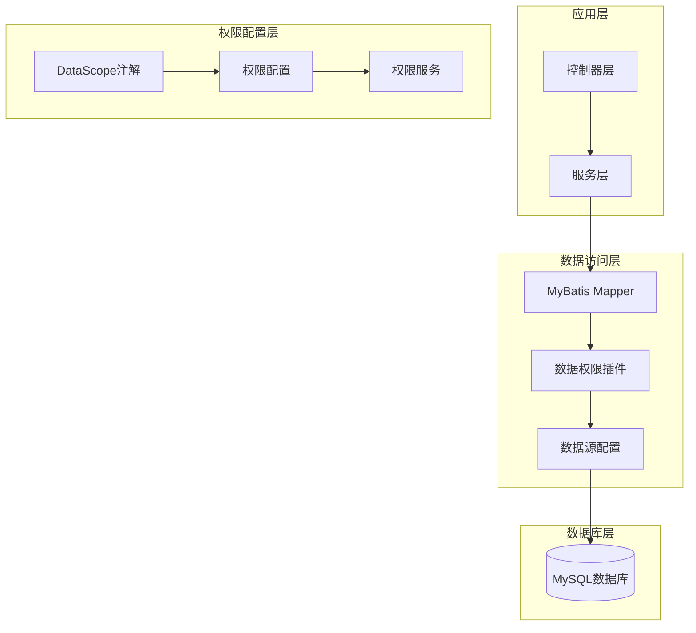
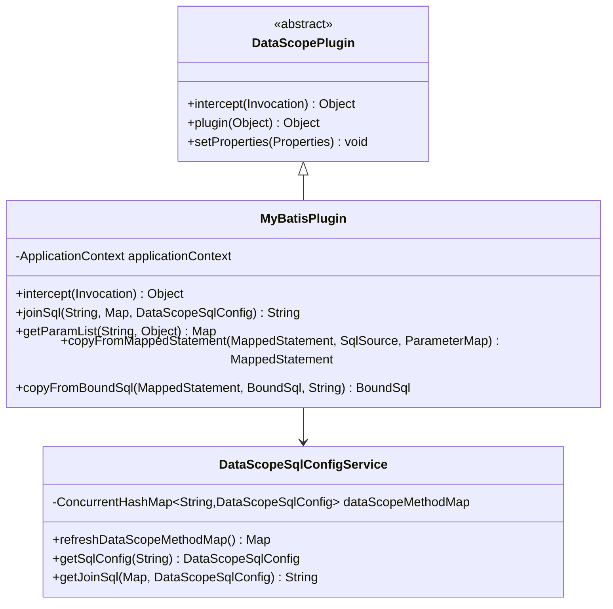
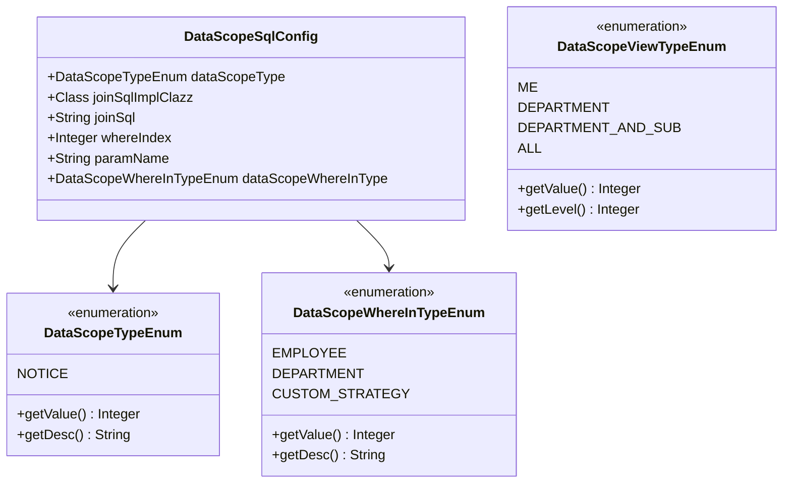
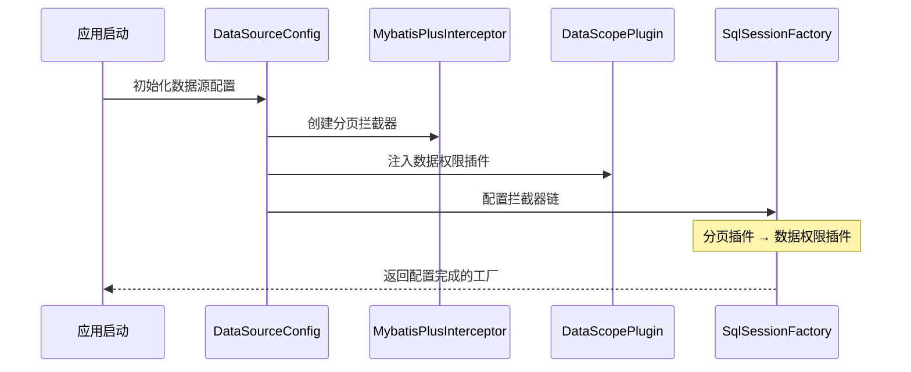
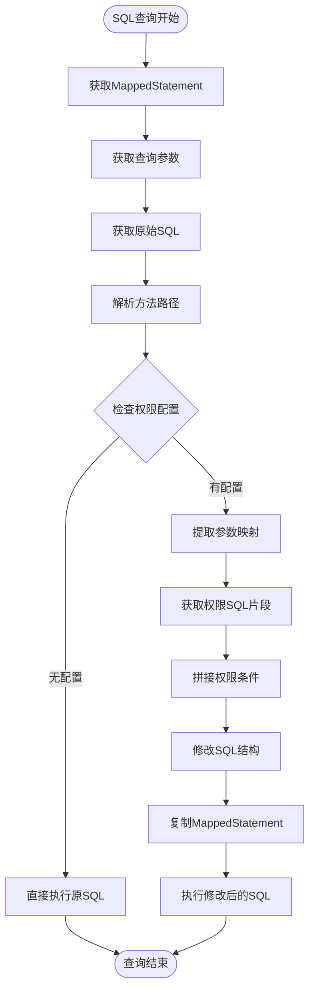
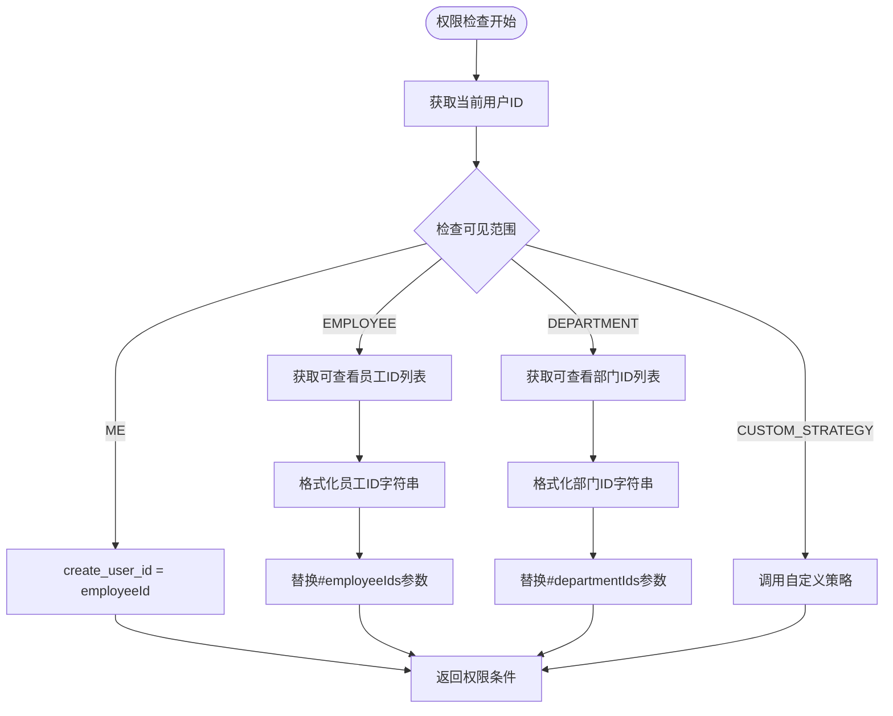

# 数据权限插件配置

<cite>
**本文档引用的文件**
- [DataSourceConfig.java](file://sa-base/src/main/java/net/lab1024/sa/base/config/DataSourceConfig.java)
- [MyBatisPlugin.java](file://sa-admin/src/main/java/net/lab1024/sa/admin/module/system/datascope/MyBatisPlugin.java)
- [DataScopeSqlConfigService.java](file://sa-admin/src/main/java/net/lab1024/sa/admin/module/system/datascope/service/DataScopeSqlConfigService.java)
- [DataScopeSqlConfig.java](file://sa-admin/src/main/java/net/lab1024/sa/admin/module/system/datascope/domain/DataScopeSqlConfig.java)
- [DataScope.java](file://sa-admin/src/main/java/net/lab1024/sa/admin/module/system/datascope/DataScope.java)
- [DataScopeTypeEnum.java](file://sa-admin/src/main/java/net/lab1024/sa/admin/module/system/datascope/constant/DataScopeTypeEnum.java)
- [DataScopeViewTypeEnum.java](file://sa-admin/src/main/java/net/lab1024/sa/admin/module/system/datascope/constant/DataScopeViewTypeEnum.java)
- [DataScopeWhereInTypeEnum.java](file://sa-admin/src/main/java/net/lab1024/sa/admin/module/system/datascope/constant/DataScopeWhereInTypeEnum.java)
- [AbstractDataScopeStrategy.java](file://sa-admin/src/main/java/net/lab1024/sa/admin/module/system/datascope/strategy/AbstractDataScopeStrategy.java)
- [MybatisPlusConfig.java](file://sa-base/src/main/java/net/lab1024/sa/base/config/MybatisPlusConfig.java)
</cite>

## 目录
1. [概述](#概述)
2. [项目架构](#项目架构)
3. [核心组件分析](#核心组件分析)
4. [数据权限插件集成](#数据权限插件集成)
5. [SQL改写机制](#sql改写机制)
6. [数据权限类型配置](#数据权限类型配置)
7. [权限规则配置](#权限规则配置)
8. [调试技巧](#调试技巧)
9. [常见问题解决](#常见问题解决)
10. [最佳实践](#最佳实践)

## 概述

Smart Admin框架提供了完整的企业级数据权限控制解决方案，通过DataScopePlugin实现了基于MyBatis拦截器的数据权限SQL动态改写。该插件能够根据用户的权限级别和数据范围，自动在查询SQL中添加相应的过滤条件，确保用户只能访问其权限范围内的数据。

### 主要特性

- **动态SQL改写**：运行时根据用户权限动态修改查询SQL
- **多层级权限控制**：支持本人、部门、子部门、全部等不同权限级别
- **灵活的配置方式**：通过注解和配置文件实现灵活的权限规则定义
- **高性能设计**：基于MyBatis拦截器，性能开销最小化
- **扩展性强**：支持自定义权限策略和复杂业务场景

## 项目架构



**图表来源**
- [DataSourceConfig.java](file://sa-base/src/main/java/net/lab1024/sa/base/config/DataSourceConfig.java#L135-L152)
- [MyBatisPlugin.java](file://sa-admin/src/main/java/net/lab1024/sa/admin/module/system/datascope/MyBatisPlugin.java#L34-L59)

## 核心组件分析

### DataScopePlugin拦截器

DataScopePlugin继承自DataScopePlugin抽象类，实现了MyBatis的Interceptor接口，负责拦截SQL执行过程并进行权限检查。



**图表来源**
- [DataScopePlugin.java](file://sa-base/src/main/java/net/lab1024/sa/base/common/domain/DataScopePlugin.java#L1-L15)
- [MyBatisPlugin.java](file://sa-admin/src/main/java/net/lab1024/sa/admin/module/system/datascope/MyBatisPlugin.java#L34-L59)
- [DataScopeSqlConfigService.java](file://sa-admin/src/main/java/net/lab1024/sa/admin/module/system/datascope/service/DataScopeSqlConfigService.java#L40-L70)

### 数据权限配置模型



**图表来源**
- [DataScopeSqlConfig.java](file://sa-admin/src/main/java/net/lab1024/sa/admin/module/system/datascope/domain/DataScopeSqlConfig.java#L1-L41)
- [DataScopeTypeEnum.java](file://sa-admin/src/main/java/net/lab1024/sa/admin/module/system/datascope/constant/DataScopeTypeEnum.java#L1-L56)
- [DataScopeViewTypeEnum.java](file://sa-admin/src/main/java/net/lab1024/sa/admin/module/system/datascope/constant/DataScopeViewTypeEnum.java#L1-L65)
- [DataScopeWhereInTypeEnum.java](file://sa-admin/src/main/java/net/lab1024/sa/admin/module/system/datascope/constant/DataScopeWhereInTypeEnum.java#L1-L51)

**章节来源**
- [MyBatisPlugin.java](file://sa-admin/src/main/java/net/lab1024/sa/admin/module/system/datascope/MyBatisPlugin.java#L1-L186)
- [DataScopeSqlConfigService.java](file://sa-admin/src/main/java/net/lab1024/sa/admin/module/system/datascope/service/DataScopeSqlConfigService.java#L1-L150)

## 数据权限插件集成

### DataSourceConfig中的插件注入

在DataSourceConfig中，数据权限插件被正确地注入到MyBatis的拦截器链中，并且必须位于分页插件之后：



**图表来源**
- [DataSourceConfig.java](file://sa-base/src/main/java/net/lab1024/sa/base/config/DataSourceConfig.java#L135-L152)

### 拦截器注册顺序要求

数据权限插件的注册顺序至关重要，必须遵循以下规则：

1. **分页插件优先**：MybatisPlusInterceptor必须先于DataScopePlugin注册
2. **数据权限插件后置**：确保分页逻辑在权限检查之前执行
3. **链式调用**：拦截器按照注册顺序形成调用链

**章节来源**
- [DataSourceConfig.java](file://sa-base/src/main/java/net/lab1024/sa/base/config/DataSourceConfig.java#L135-L152)

## SQL改写机制

### MyBatisPlugin的核心实现

MyBatisPlugin通过拦截Executor的query方法，在SQL执行前进行权限检查和SQL改写：



**图表来源**
- [MyBatisPlugin.java](file://sa-admin/src/main/java/net/lab1024/sa/admin/module/system/datascope/MyBatisPlugin.java#L34-L96)

### SQL改写算法

SQL改写采用智能定位算法，确保权限条件插入到合适的位置：

| SQL关键字 | 改写位置 | 示例 |
|-----------|----------|------|
| WHERE | 在WHERE子句后追加AND条件 | `SELECT * FROM table WHERE condition AND data_scope_condition` |
| GROUP BY | 将WHERE条件插入GROUP BY前 | `SELECT * FROM table WHERE data_scope_condition GROUP BY field` |
| ORDER BY | 将WHERE条件插入ORDER BY前 | `SELECT * FROM table WHERE data_scope_condition ORDER BY field` |
| 无WHERE | 直接添加WHERE子句 | `SELECT * FROM table WHERE data_scope_condition` |

**章节来源**
- [MyBatisPlugin.java](file://sa-admin/src/main/java/net/lab1024/sa/admin/module/system/datascope/MyBatisPlugin.java#L90-L121)

## 数据权限类型配置

### 权限类型枚举

系统定义了多种数据权限类型，每种类型对应不同的业务场景：

| 权限类型 | 数值 | 描述 | 适用场景 |
|----------|------|------|----------|
| NOTICE | 1 | 系统通知 | 系统消息、公告等通知类数据 |

### 可见范围类型

| 可见范围 | 数值 | 级别 | 描述 |
|----------|------|------|------|
| ME | 0 | 0 | 仅本人数据 |
| DEPARTMENT | 1 | 5 | 本部门数据 |
| DEPARTMENT_AND_SUB | 2 | 10 | 本部门及子部门数据 |
| ALL | 10 | 100 | 全部数据 |

### 权限条件生成策略



**图表来源**
- [DataScopeSqlConfigService.java](file://sa-admin/src/main/java/net/lab1024/sa/admin/module/system/datascope/service/DataScopeSqlConfigService.java#L100-L150)

**章节来源**
- [DataScopeTypeEnum.java](file://sa-admin/src/main/java/net/lab1024/sa/admin/module/system/datascope/constant/DataScopeTypeEnum.java#L1-L56)
- [DataScopeViewTypeEnum.java](file://sa-admin/src/main/java/net/lab1024/sa/admin/module/system/datascope/constant/DataScopeViewTypeEnum.java#L1-L65)

## 权限规则配置

### DataScope注解使用

通过@DataScope注解可以轻松地为方法添加数据权限控制：

```java
// 基本配置示例
@DataScope(
    dataScopeType = DataScopeTypeEnum.NOTICE,
    whereInType = DataScopeWhereInTypeEnum.EMPLOYEE,
    whereIndex = 0,
    joinSql = "create_user_id IN (#employeeIds)"
)
public List<NoticeEntity> queryNotice(NoticeQueryForm queryForm) {
    // 方法实现
}
```

### 注解参数详解

| 参数名 | 类型 | 默认值 | 说明 |
|--------|------|--------|------|
| dataScopeType | DataScopeTypeEnum | 必填 | 数据范围类型 |
| whereInType | DataScopeWhereInTypeEnum | EMPLOYEE | 权限条件类型 |
| joinSqlImplClazz | Class | AbstractDataScopeStrategy.class | 自定义策略类 |
| paramName | String | "" | 参数名称，多个用逗号分隔 |
| whereIndex | int | 0 | 第几个WHERE条件 |
| joinSql | String | "" | 权限条件SQL模板 |

### 自定义策略实现

对于复杂的权限控制需求，可以通过实现AbstractDataScopeStrategy来自定义权限策略：

```java
@Component
public class CustomDataScopeStrategy extends AbstractDataScopeStrategy {
    
    @Override
    public String getCondition(DataScopeViewTypeEnum viewTypeEnum, 
                              Map<String, Object> paramMap, 
                              DataScopeSqlConfig sqlConfigDTO) {
        // 自定义权限条件生成逻辑
        return "custom_condition";
    }
}
```

**章节来源**
- [DataScope.java](file://sa-admin/src/main/java/net/lab1024/sa/admin/module/system/datascope/DataScope.java#L1-L50)
- [AbstractDataScopeStrategy.java](file://sa-admin/src/main/java/net/lab1024/sa/admin/module/system/datascope/strategy/AbstractDataScopeStrategy.java#L1-L23)

## 调试技巧

### 日志配置

启用数据权限插件的日志可以帮助快速定位问题：

```yaml
logging:
  level:
    net.lab1024.sa.admin.module.system.datascope: DEBUG
    org.mybatis: DEBUG
```

### 关键调试点

1. **权限配置检查**：确认@DataScope注解正确配置
2. **SQL执行跟踪**：观察拦截器是否正常工作
3. **权限条件验证**：检查生成的权限条件是否正确
4. **参数传递验证**：确认参数映射是否准确

### 常用调试方法

```java
// 在MyBatisPlugin中添加调试日志
@Override
public Object intercept(Invocation invocation) throws Throwable {
    log.debug("拦截SQL执行: {}", invocation.getMethod().getName());
    // ... 其他逻辑
}
```

## 常见问题解决

### 问题1：数据权限插件未生效

**症状**：添加@DataScope注解后，查询仍然返回所有数据

**解决方案**：
1. 检查DataSourceConfig中插件注册顺序
2. 确认DataScopePlugin bean已正确注入
3. 验证注解配置是否正确

### 问题2：SQL改写错误

**症状**：生成的SQL语法错误或权限条件不生效

**解决方案**：
1. 检查joinSql模板语法
2. 验证参数名称匹配
3. 确认whereIndex位置正确

### 问题3：性能问题

**症状**：开启数据权限后查询速度明显下降

**解决方案**：
1. 优化权限条件索引
2. 减少不必要的权限检查
3. 使用缓存减少重复计算

## 最佳实践

### 权限设计原则

1. **最小权限原则**：默认只允许访问必要数据
2. **职责分离**：不同业务模块使用独立的权限类型
3. **性能优先**：合理选择权限检查时机和粒度

### 配置建议

1. **注解使用**：为所有涉及敏感数据的查询方法添加@DataScope注解
2. **参数命名**：保持参数名称的一致性和可读性
3. **策略复用**：对于相似的权限需求，优先考虑复用现有策略

### 性能优化

1. **索引设计**：为权限字段建立适当的数据库索引
2. **缓存策略**：缓存用户权限信息减少重复查询
3. **批量处理**：对于大量数据的权限检查，考虑批量处理方案

通过遵循这些最佳实践，可以构建高效、安全、可维护的数据权限控制系统，为企业级应用提供强有力的数据安全保障。