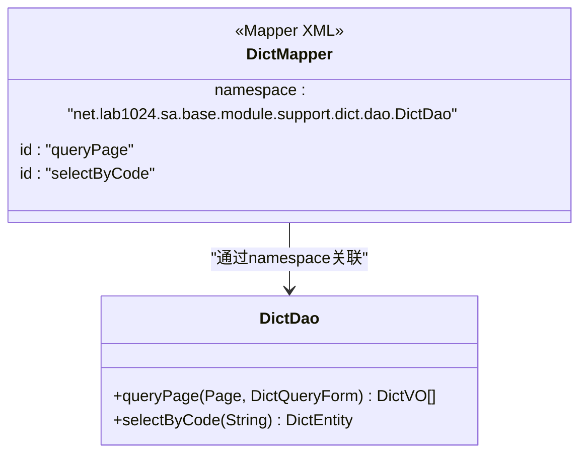
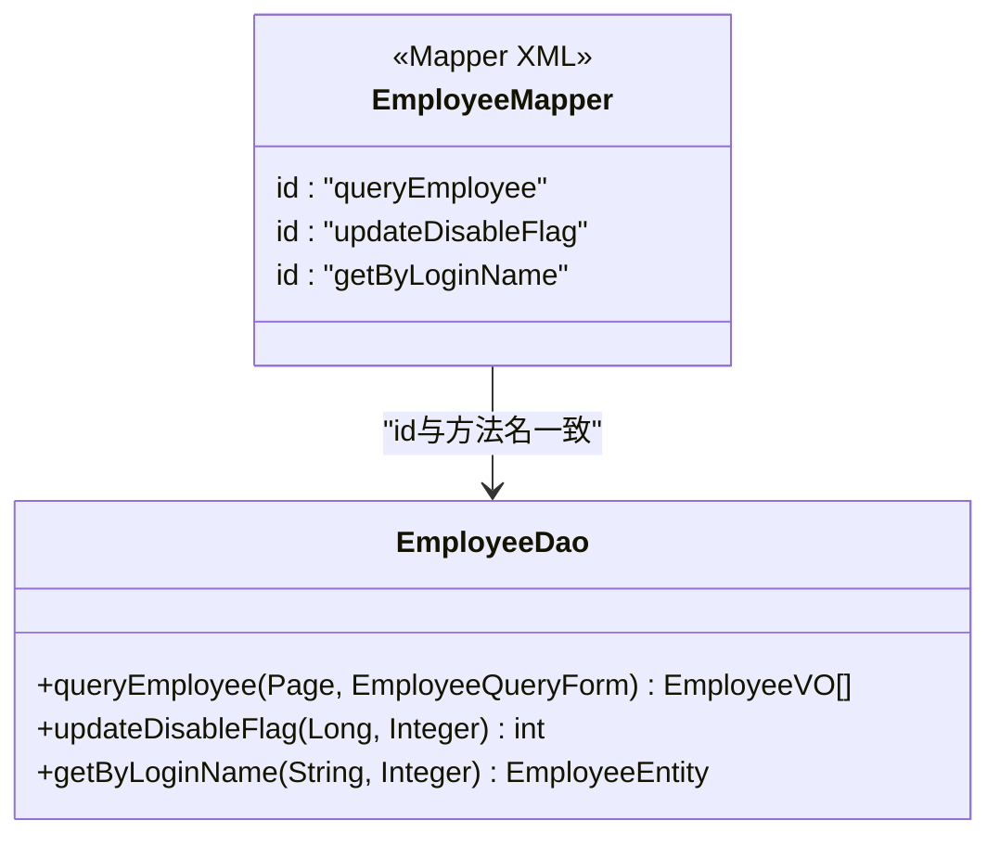
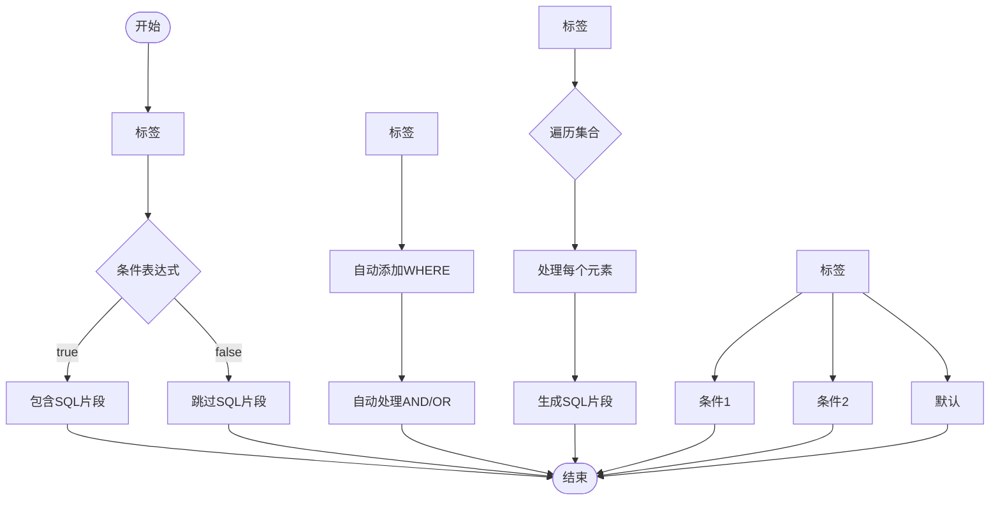
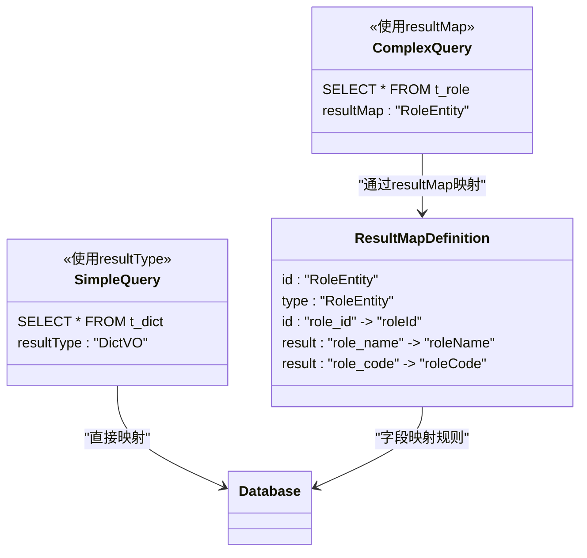
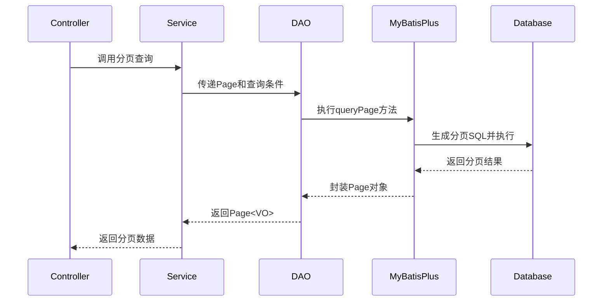
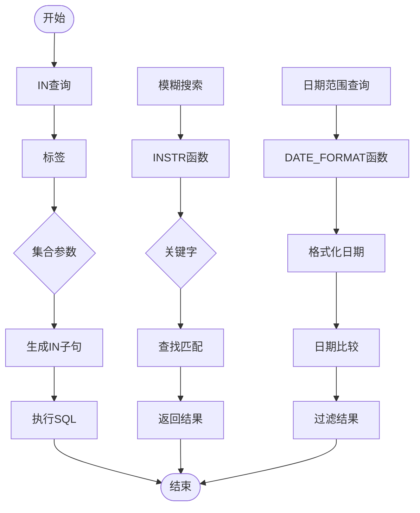
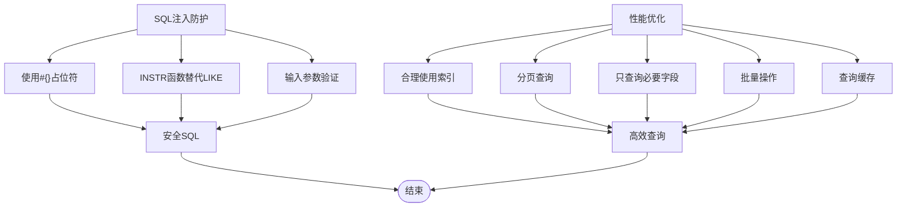

# SQL映射与动态SQL

<cite>
**本文档引用的文件**   
- [DictMapper.xml](file://smart-admin-api-java17-springboot3\sa-base\src\main\resources\mapper\support\DictMapper.xml)
- [OperateLogMapper.xml](file://smart-admin-api-java17-springboot3\sa-base\src\main\resources\mapper\support\OperateLogMapper.xml)
- [FileMapper.xml](file://smart-admin-api-java17-springboot3\sa-base\src\main\resources\mapper\support\FileMapper.xml)
- [LoginLogMapper.xml](file://smart-admin-api-java17-springboot3\sa-base\src\main\resources\mapper\support\LoginLogMapper.xml)
- [EmployeeMapper.xml](file://smart-admin-api-java17-springboot3\sa-admin\src\main\resources\mapper\system\employee\EmployeeMapper.xml)
- [RoleMapper.xml](file://smart-admin-api-java17-springboot3\sa-admin\src\main\resources\mapper\system\role\RoleMapper.xml)
- [EnterpriseMapper.xml](file://smart-admin-api-java17-springboot3\sa-admin\src\main\resources\mapper\business\oa\enterprise\EnterpriseMapper.xml)
- [MessageMapper.xml](file://smart-admin-api-java17-springboot3\sa-base\src\main\resources\mapper\support\MessageMapper.xml)
- [SerialNumberMapper.xml](file://smart-admin-api-java17-springboot3\sa-base\src\main\resources\mapper\support\SerialNumberMapper.xml)
- [DictDao.java](file://smart-admin-api-java17-springboot3\sa-base\src\main\java\net\lab1024\sa\base\module\support\dict\dao\DictDao.java)
- [OperateLogDao.java](file://smart-admin-api-java17-springboot3\sa-base\src\main\java\net\lab1024\sa\base\module\support\operatelog\OperateLogDao.java)
- [FileDao.java](file://smart-admin-api-java17-springboot3\sa-base\src\main\java\net\lab1024\sa\base\module\support\file\dao\FileDao.java)
- [MybatisPlusConfig.java](file://smart-admin-api-java17-springboot3\sa-base\src\main\java\net\lab1024\sa\base\config\MybatisPlusConfig.java)
</cite>

## 目录
1. [介绍](#介绍)
2. [Mapper.xml文件命名空间配置](#mapperxml文件命名空间配置)
3. [SQL语句ID命名规范](#sql语句id命名规范)
4. [动态SQL标签使用](#动态sql标签使用)
5. [resultType与resultMap区别](#resulttype与resultmap区别)
6. [分页查询实现](#分页查询实现)
7. [IN查询与模糊搜索](#in查询与模糊搜索)
8. [关联查询与条件组合](#关联查询与条件组合)
9. [SQL注入防护与性能优化](#sql注入防护与性能优化)
10. [最佳实践总结](#最佳实践总结)

## 介绍
本项目采用MyBatis作为持久层框架，通过XML映射文件实现SQL语句与Java代码的解耦。项目中的Mapper.xml文件遵循统一的命名和组织规范，位于`resources/mapper`目录下，按业务模块进行分类管理。每个Mapper文件都与对应的DAO接口相匹配，通过namespace属性建立关联。项目使用MyBatis Plus作为增强工具，提供了分页插件等常用功能，简化了CRUD操作的实现。动态SQL的使用使得查询条件可以灵活组合，提高了代码的复用性和可维护性。

**Section sources**
- [MybatisPlusConfig.java](file://smart-admin-api-java17-springboot3\sa-base\src\main\java\net\lab1024\sa\base\config\MybatisPlusConfig.java#L1-L34)

## Mapper.xml文件命名空间配置
Mapper.xml文件的namespace属性必须与对应的DAO接口的全限定名完全一致。这是MyBatis框架识别和绑定SQL语句与Java方法的关键。在本项目中，所有Mapper文件的namespace都遵循`包名.类名`的命名规范。例如，`DictMapper.xml`文件的namespace为`net.lab1024.sa.base.module.support.dict.dao.DictDao`，与`DictDao`接口的完整路径相匹配。这种配置方式使得MyBatis能够自动将XML中的SQL语句与接口中的方法进行映射，无需额外的配置。当Spring容器启动时，通过`@Mapper`注解扫描这些接口，实现DAO组件的自动注入。



**Diagram sources **
- [DictMapper.xml](file://smart-admin-api-java17-springboot3\sa-base\src\main\resources\mapper\support\DictMapper.xml#L1-L46)
- [DictDao.java](file://smart-admin-api-java17-springboot3\sa-base\src\main\java\net\lab1024\sa\base\module\support\dict\dao\DictDao.java#L1-L37)

**Section sources**
- [DictMapper.xml](file://smart-admin-api-java17-springboot3\sa-base\src\main\resources\mapper\support\DictMapper.xml#L1-L46)
- [DictDao.java](file://smart-admin-api-java17-springboot3\sa-base\src\main\java\net\lab1024\sa\base\module\support\dict\dao\DictDao.java#L1-L37)

## SQL语句ID命名规范
SQL语句的id属性应与DAO接口中的方法名完全一致，遵循Java方法命名规范（驼峰命名法）。在本项目中，所有SQL语句的id都与其对应的方法名保持一致，确保了代码的可读性和维护性。例如，在`EmployeeMapper.xml`中，`queryEmployee`方法对应的SQL语句id为`queryEmployee`，`updateDisableFlag`方法对应的SQL语句id为`updateDisableFlag`。对于需要分页的查询方法，通常在方法名中包含"Page"字样，如`queryPage`。这种命名规范使得开发人员能够快速定位到对应的SQL实现，提高了开发效率。同时，通过`@Param`注解明确指定参数名称，确保了参数传递的准确性。



**Diagram sources **
- [EmployeeMapper.xml](file://smart-admin-api-java17-springboot3\sa-admin\src\main\resources\mapper\system\employee\EmployeeMapper.xml#L1-L200)
- [EmployeeDao.java](file://smart-admin-api-java17-springboot3\sa-admin\src\main\java\net\lab1024\sa\admin\module\system\employee\dao\EmployeeDao.java)

**Section sources**
- [EmployeeMapper.xml](file://smart-admin-api-java17-springboot3\sa-admin\src\main\resources\mapper\system\employee\EmployeeMapper.xml#L1-L200)
- [EmployeeDao.java](file://smart-admin-api-java17-springboot3\sa-admin\src\main\java\net\lab1024\sa\admin\module\system\employee\dao\EmployeeDao.java)

## 动态SQL标签使用
MyBatis提供了丰富的动态SQL标签，用于构建灵活的查询条件。本项目中广泛使用了`<if>`、`<where>`、`<choose>`、`<foreach>`等标签。`<if>`标签用于条件判断，只有当test属性中的表达式为true时，才会包含其中的SQL片段。`<where>`标签会自动处理WHERE关键字和AND/OR连接符，避免了首尾连接符的问题。`<choose>`标签类似于Java中的switch语句，用于多条件互斥选择。`<foreach>`标签用于遍历集合，常用于IN查询。这些标签的组合使用使得复杂的查询条件可以动态生成，提高了SQL的灵活性和可维护性。



**Diagram sources **
- [OperateLogMapper.xml](file://smart-admin-api-java17-springboot3\sa-base\src\main\resources\mapper\support\OperateLogMapper.xml#L1-L45)
- [EmployeeMapper.xml](file://smart-admin-api-java17-springboot3\sa-admin\src\main\resources\mapper\system\employee\EmployeeMapper.xml#L1-L200)

**Section sources**
- [OperateLogMapper.xml](file://smart-admin-api-java17-springboot3\sa-base\src\main\resources\mapper\support\OperateLogMapper.xml#L1-L45)
- [EmployeeMapper.xml](file://smart-admin-api-java17-springboot3\sa-admin\src\main\resources\mapper\system\employee\EmployeeMapper.xml#L1-L200)

## resultType与resultMap区别
`resultType`和`resultMap`是MyBatis中用于指定查询结果映射方式的两个属性。`resultType`适用于简单的结果映射，当数据库字段名与Java对象属性名完全一致时，可以直接指定目标类的全限定名。`resultMap`则用于复杂的映射场景，如字段名与属性名不一致、需要类型转换、关联查询等。在本项目中，简单的查询使用`resultType`，如`queryPage`方法返回`List<DictVO>`；复杂的关联查询使用`resultMap`，如`RoleMapper.xml`中定义了`RoleEntity`的resultMap。`resultMap`可以定义字段与属性的映射关系、嵌套结果、集合等，提供了更强大的映射能力。



**Diagram sources **
- [DictMapper.xml](file://smart-admin-api-java17-springboot3\sa-base\src\main\resources\mapper\support\DictMapper.xml#L1-L46)
- [RoleMapper.xml](file://smart-admin-api-java17-springboot3\sa-admin\src\main\resources\mapper\system\role\RoleMapper.xml#L1-L21)

**Section sources**
- [DictMapper.xml](file://smart-admin-api-java17-springboot3\sa-base\src\main\resources\mapper\support\DictMapper.xml#L1-L46)
- [RoleMapper.xml](file://smart-admin-api-java17-springboot3\sa-admin\src\main\resources\mapper\system\role\RoleMapper.xml#L1-L21)

## 分页查询实现
项目使用MyBatis Plus的分页插件实现分页查询功能。在`MybatisPlusConfig.java`中配置了`PaginationInnerInterceptor`，为MySQL数据库提供了分页支持。分页查询的实现需要在DAO接口中定义接收`Page`对象作为参数的方法，并在Mapper.xml中编写对应的SQL语句。SQL语句中不需要包含LIMIT子句，MyBatis Plus会自动根据`Page`对象的当前页码和每页大小生成相应的分页SQL。在`DictMapper.xml`的`queryPage`方法中，通过`<where>`标签动态构建查询条件，结合`<if>`标签实现多条件筛选，最后由分页插件自动添加LIMIT子句。这种方式简化了分页逻辑的实现，提高了代码的复用性。



**Diagram sources **
- [MybatisPlusConfig.java](file://smart-admin-api-java17-springboot3\sa-base\src\main\java\net\lab1024\sa\base\config\MybatisPlusConfig.java#L1-L34)
- [DictMapper.xml](file://smart-admin-api-java17-springboot3\sa-base\src\main\resources\mapper\support\DictMapper.xml#L1-L46)

**Section sources**
- [MybatisPlusConfig.java](file://smart-admin-api-java17-springboot3\sa-base\src\main\java\net\lab1024\sa\base\config\MybatisPlusConfig.java#L1-L34)
- [DictMapper.xml](file://smart-admin-api-java17-springboot3\sa-base\src\main\resources\mapper\support\DictMapper.xml#L1-L46)

## IN查询与模糊搜索
IN查询和模糊搜索是项目中常用的查询方式。IN查询通过`<foreach>`标签实现，将集合参数遍历生成SQL中的IN子句。在`FileMapper.xml`的`selectByFileKeyList`方法中，`fileKeyList`参数通过`<foreach>`标签生成`IN ('key1','key2',...)`的SQL片段。模糊搜索使用MySQL的`INSTR`函数实现，避免了`LIKE`语句可能带来的SQL注入风险。在`OperateLogMapper.xml`的`queryByPage`方法中，多个字段的模糊搜索通过`INSTR`函数组合实现，如`INSTR(module,#{query.keywords})`。这种方式既保证了查询的灵活性，又提高了安全性。对于日期范围查询，使用`DATE_FORMAT`函数进行格式化比较，确保了日期条件的准确性。



**Diagram sources **
- [FileMapper.xml](file://smart-admin-api-java17-springboot3\sa-base\src\main\resources\mapper\support\FileMapper.xml#L1-L57)
- [OperateLogMapper.xml](file://smart-admin-api-java17-springboot3\sa-base\src\main\resources\mapper\support\OperateLogMapper.xml#L1-L45)

**Section sources**
- [FileMapper.xml](file://smart-admin-api-java17-springboot3\sa-base\src\main\resources\mapper\support\FileMapper.xml#L1-L57)
- [OperateLogMapper.xml](file://smart-admin-api-java17-springboot3\sa-base\src\main\resources\mapper\support\OperateLogMapper.xml#L1-L45)

## 关联查询与条件组合
关联查询通过SQL的JOIN语句实现，在Mapper.xml中编写多表连接的SELECT语句。在`EmployeeMapper.xml`的`queryEmployee`方法中，通过`LEFT JOIN t_department`关联部门表，查询员工信息及其所属部门名称。条件组合查询使用`<where>`标签包裹多个`<if>`条件，每个`<if>`标签对应一个查询条件，只有当条件为true时才会包含相应的SQL片段。在`EnterpriseMapper.xml`的`queryPage`方法中，组合了企业名称、联系人、创建时间等多个查询条件，实现了灵活的复合查询。对于排序条件，通过`<if>`标签判断是否需要添加ORDER BY子句，如`queryForm.sortItemList`为空时使用默认排序。这种设计使得查询条件可以动态组合，满足了复杂的业务需求。

```mermaid
erDiagram
EMPLOYEE ||--o{ DEPARTMENT : "所属"
EMPLOYEE {
bigint employee_id PK
varchar actual_name
varchar login_name
varchar phone
bigint department_id FK
tinyint disabled_flag
tinyint deleted_flag
}
DEPARTMENT {
bigint department_id PK
varchar department_name
bigint parent_id
tinyint disabled_flag
}
class QueryConditions {
<<动态条件>>
keywords: String
departmentIdList: List<Long>
disabledFlag: Integer
deletedFlag: Integer
}
QueryConditions --> EMPLOYEE : "查询条件"
EMPLOYEE --> DEPARTMENT : "LEFT JOIN"
```

**Diagram sources **
- [EmployeeMapper.xml](file://smart-admin-api-java17-springboot3\sa-admin\src\main\resources\mapper\system\employee\EmployeeMapper.xml#L1-L200)
- [EnterpriseMapper.xml](file://smart-admin-api-java17-springboot3\sa-admin\src\main\resources\mapper\business\oa\enterprise\EnterpriseMapper.xml#L1-L89)

**Section sources**
- [EmployeeMapper.xml](file://smart-admin-api-java17-springboot3\sa-admin\src\main\resources\mapper\system\employee\EmployeeMapper.xml#L1-L200)
- [EnterpriseMapper.xml](file://smart-admin-api-java17-springboot3\sa-admin\src\main\resources\mapper\business\oa\enterprise\EnterpriseMapper.xml#L1-L89)

## SQL注入防护与性能优化
项目通过多种方式实现SQL注入防护和性能优化。首先，所有参数都使用`#{}`占位符而非`${}`拼接，从根本上防止了SQL注入。其次，模糊搜索使用`INSTR`函数而非`LIKE`语句，避免了通配符注入的风险。对于批量操作，使用`<foreach>`标签生成批量SQL，减少数据库交互次数。在查询中合理使用索引，如在经常查询的字段上创建索引。避免使用`SELECT *`，只查询需要的字段，减少数据传输量。对于大表查询，使用分页限制返回结果数量。在`MessageMapper.xml`的`query`方法中，通过`<where>`标签动态构建查询条件，避免了不必要的全表扫描。同时，合理使用缓存机制，减少重复查询对数据库的压力。



**Diagram sources **
- [MessageMapper.xml](file://smart-admin-api-java17-springboot3\sa-base\src\main\resources\mapper\support\MessageMapper.xml#L1-L56)
- [EmployeeMapper.xml](file://smart-admin-api-java17-springboot3\sa-admin\src\main\resources\mapper\system\employee\EmployeeMapper.xml#L1-L200)

**Section sources**
- [MessageMapper.xml](file://smart-admin-api-java17-springboot3\sa-base\src\main\resources\mapper\support\MessageMapper.xml#L1-L56)
- [EmployeeMapper.xml](file://smart-admin-api-java17-springboot3\sa-admin\src\main\resources\mapper\system\employee\EmployeeMapper.xml#L1-L200)

## 最佳实践总结
本项目的MyBatis使用遵循了以下最佳实践：1) Mapper.xml文件与DAO接口保持一对一关系，namespace与接口全限定名一致；2) SQL语句id与方法名完全匹配，遵循驼峰命名规范；3) 使用`resultType`处理简单映射，`resultMap`处理复杂映射；4) 动态SQL使用`<if>`、`<where>`、`<foreach>`等标签实现灵活查询；5) 分页查询依赖MyBatis Plus插件，简化分页逻辑；6) IN查询使用`<foreach>`标签，模糊搜索使用`INSTR`函数；7) 参数使用`#{}`占位符防止SQL注入；8) 合理使用索引和分页优化查询性能。这些实践确保了代码的可读性、可维护性和安全性，为项目的稳定运行提供了保障。

**Section sources**
- [DictMapper.xml](file://smart-admin-api-java17-springboot3\sa-base\src\main\resources\mapper\support\DictMapper.xml#L1-L46)
- [OperateLogMapper.xml](file://smart-admin-api-java17-springboot3\sa-base\src\main\resources\mapper\support\OperateLogMapper.xml#L1-L45)
- [FileMapper.xml](file://smart-admin-api-java17-springboot3\sa-base\src\main\resources\mapper\support\FileMapper.xml#L1-L57)
- [EmployeeMapper.xml](file://smart-admin-api-java17-springboot3\sa-admin\src\main\resources\mapper\system\employee\EmployeeMapper.xml#L1-L200)