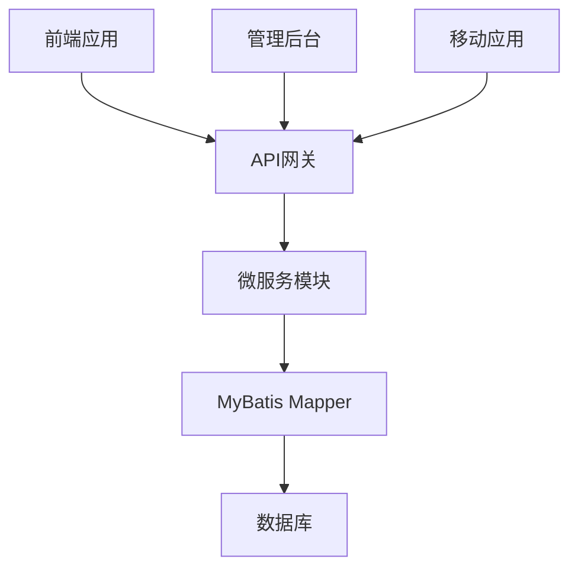
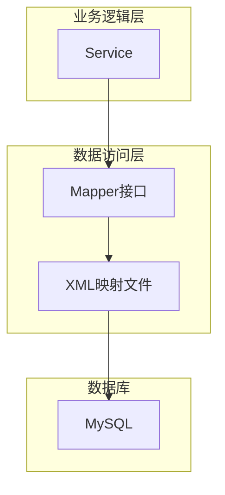
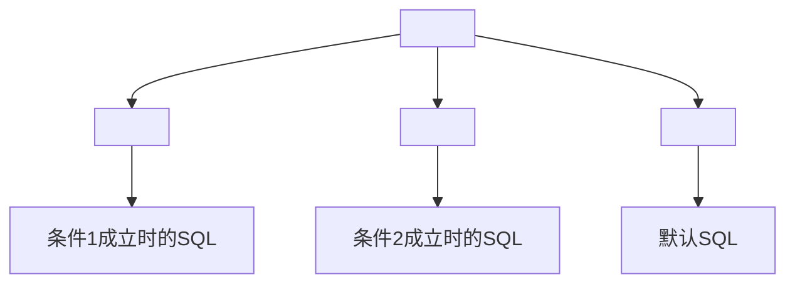
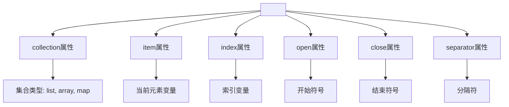
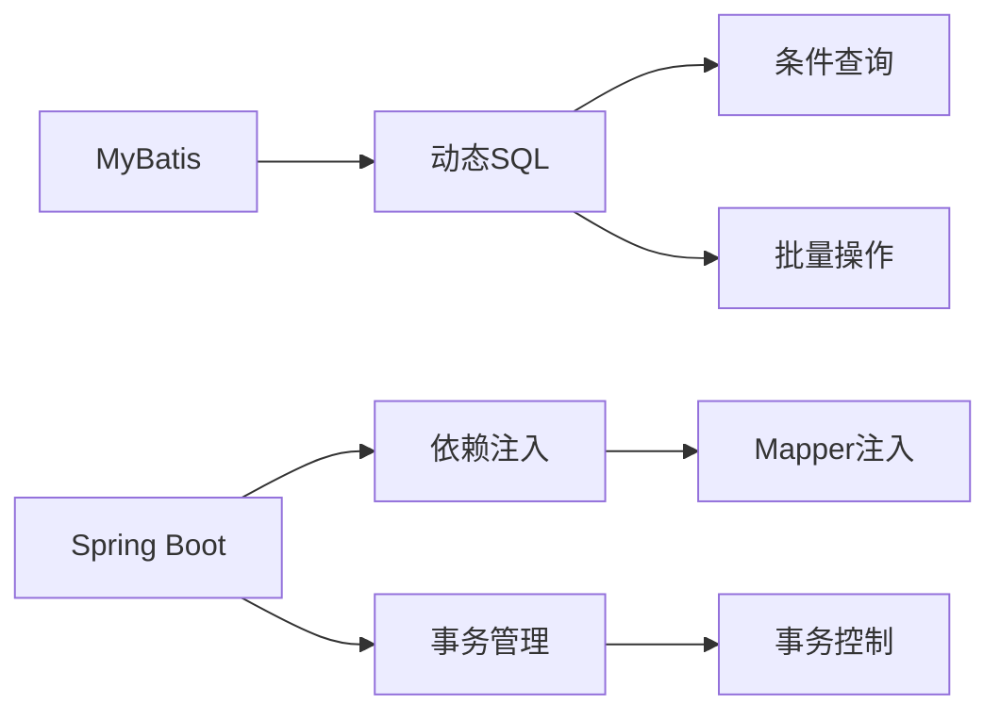

# 高级动态用法

<cite>
**本文档引用文件**  
- [DAO模板.md](file://documentation\06-模板工具\代码模板\DAO模板.md)
- [ConsumeTransactionDao.xml](file://microservices\ioedream-consume-service\src\main\resources\mapper\ConsumeTransactionDao.xml)
</cite>

## 目录
1. [简介](#简介)
2. [项目结构](#项目结构)
3. [核心组件](#核心组件)
4. [架构概述](#架构概述)
5. [详细组件分析](#详细组件分析)
6. [依赖分析](#依赖分析)
7. [性能考虑](#性能考虑)
8. [故障排除指南](#故障排除指南)
9. [结论](#结论)

## 简介
本文档深入探讨MyBatis框架中高级动态SQL的使用方法，重点介绍复杂条件处理和批量操作。通过分析实际代码库中的实现模式，详细说明如何使用`<choose>`、`<when>`、`<otherwise>`标签实现条件分支逻辑，以及`<foreach>`标签在IN查询和批量操作中的应用。文档还展示了复杂条件组合查询的示例，并提供性能优化建议。

## 项目结构
项目采用模块化架构，主要包含微服务模块、管理后台模块和移动应用模块。数据访问层使用MyBatis作为ORM框架，通过XML映射文件定义SQL语句。动态SQL主要集中在`mapper`目录下的XML文件中，这些文件定义了复杂的查询、更新和删除操作。

**Diagram sources**
- [ConsumeTransactionDao.xml](file://microservices\ioedream-consume-service\src\main\resources\mapper\ConsumeTransactionDao.xml)

**Section sources**
- [DAO模板.md](file://documentation\06-模板工具\代码模板\DAO模板.md)

## 核心组件
核心组件包括动态SQL生成器、条件处理器和批量操作执行器。这些组件共同工作，实现灵活的数据库查询和操作。动态SQL通过XML配置文件中的特殊标签实现，允许根据运行时参数动态构建SQL语句。

**Section sources**
- [DAO模板.md](file://documentation\06-模板工具\代码模板\DAO模板.md)
- [ConsumeTransactionDao.xml](file://microservices\ioedream-consume-service\src\main\resources\mapper\ConsumeTransactionDao.xml)

## 架构概述
系统采用分层架构，数据访问层位于业务逻辑层和数据库之间。MyBatis作为持久层框架，通过Mapper接口和XML映射文件实现数据库操作。动态SQL特性允许在不修改Java代码的情况下，根据不同的查询条件生成相应的SQL语句。

**Diagram sources**
- [DAO模板.md](file://documentation\06-模板工具\代码模板\DAO模板.md)

## 详细组件分析

### 条件分支实现
MyBatis的`<choose>`、`<when>`和`<otherwise>`标签提供了类似Java中switch-case语句的功能，用于实现条件分支逻辑。

#### 条件分支标签

**Diagram sources**
- [DAO模板.md](file://documentation\06-模板工具\代码模板\DAO模板.md)

**Section sources**
- [DAO模板.md](file://documentation\06-模板工具\代码模板\DAO模板.md)

### 批量操作实现
`<foreach>`标签用于实现批量操作，支持在IN查询和批量插入、更新、删除中使用。

#### foreach标签应用

**Diagram sources**
- [DAO模板.md](file://documentation\06-模板工具\代码模板\DAO模板.md)

**Section sources**
- [DAO模板.md](file://documentation\06-模板工具\代码模板\DAO模板.md)

## 依赖分析
系统依赖MyBatis框架实现动态SQL功能，同时依赖Spring Boot框架进行依赖注入和事务管理。Mapper接口与XML映射文件之间存在强耦合关系，需要保持方法签名和SQL语句的一致性。

**Diagram sources**
- [DAO模板.md](file://documentation\06-模板工具\代码模板\DAO模板.md)

**Section sources**
- [DAO模板.md](file://documentation\06-模板工具\代码模板\DAO模板.md)

## 性能考虑
动态SQL的性能优化主要集中在减少不必要的条件判断、合理使用索引和避免N+1查询问题。建议在复杂查询中使用分页，避免一次性加载大量数据。

## 故障排除指南
常见问题包括SQL语法错误、参数绑定失败和条件判断逻辑错误。建议使用日志记录生成的SQL语句，便于调试和问题定位。

**Section sources**
- [ConsumeTransactionDao.xml](file://microservices\ioedream-consume-service\src\main\resources\mapper\ConsumeTransactionDao.xml)

## 结论
MyBatis的动态SQL功能提供了强大的数据库操作能力，通过合理使用`<choose>`、`<when>`、`<otherwise>`和`<foreach>`标签，可以实现复杂的查询和批量操作。建议在实际开发中遵循最佳实践，确保代码的可读性和性能。