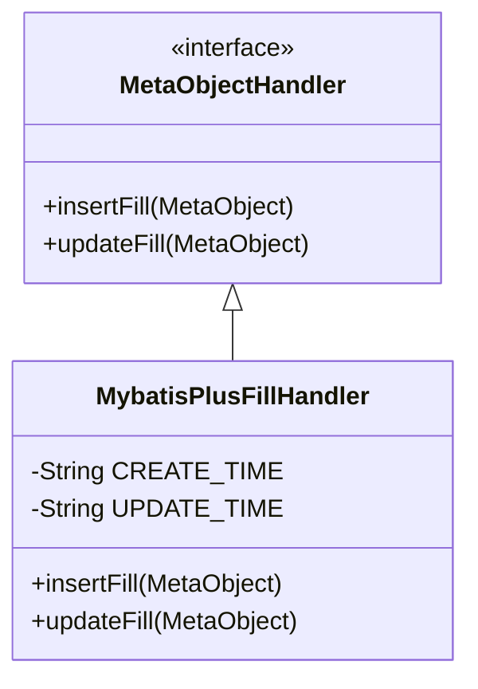
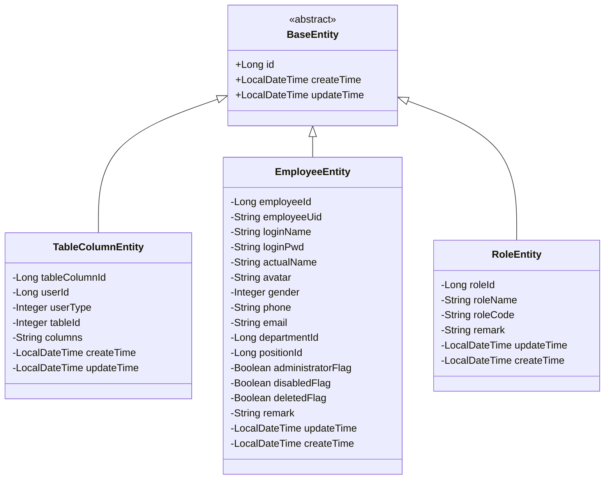

# 实体类设计规范

<cite>
**本文档引用的文件**
- [MybatisPlusFillHandler.java](file://smart-admin-api-java17-springboot3\sa-base\src\main\java\net\lab1024\sa\base\handler\MybatisPlusFillHandler.java)
- [TableColumnEntity.java](file://smart-admin-api-java17-springboot3\sa-base\src\main\java\net\lab1024\sa\base\module\support\table\domain\TableColumnEntity.java)
- [EmployeeEntity.java](file://smart-admin-api-java17-springboot3\sa-admin\src\main\java\net\lab1024\sa\admin\module\system\employee\domain\entity\EmployeeEntity.java)
- [RoleEntity.java](file://smart-admin-api-java17-springboot3\sa-admin\src\main\java\net\lab1024\sa\admin\module\system\role\domain\entity\RoleEntity.java)
- [Entity.java.vm](file://smart-admin-api-java17-springboot3\sa-base\src\main\resources\code-generator-template\java\domain\entity\Entity.java.vm)
</cite>

## 目录
1. [引言](#引言)
2. [字段命名规范](#字段命名规范)
3. [审计字段自动填充机制](#审计字段自动填充机制)
4. [软删除标记实现方式](#软删除标记实现方式)
5. [乐观锁使用方法](#乐观锁使用方法)
6. [MyBatis-Plus注解使用说明](#mybatis-plus注解使用说明)
7. [实体类继承设计模式](#实体类继承设计模式)
8. [代码生成器模板分析](#代码生成器模板分析)
9. [总结](#总结)

## 引言
本文档详细介绍了MyBatis-Plus中实体类的设计规范和最佳实践。通过分析项目中的实际代码实现，我们将深入探讨实体类的设计模式，包括字段命名、审计字段自动填充、软删除标记、乐观锁等关键特性。文档还将解释MyBatis-Plus相关注解的使用场景和配置参数，并展示实体类的通用设计模式。

## 字段命名规范
在MyBatis-Plus实体类设计中，采用Java驼峰命名法与数据库下划线命名法的映射规则。实体类中的字段使用驼峰命名法（camelCase），而数据库表中的对应字段使用下划线命名法（snake_case）。MyBatis-Plus框架会自动处理这两种命名方式之间的转换。

例如，在`TableColumnEntity`实体类中：
- Java实体字段：`createTime`、`updateTime`
- 对应数据库字段：`create_time`、`update_time`

这种命名规范确保了代码的可读性和一致性，同时遵循了Java和数据库领域的命名惯例。MyBatis-Plus通过配置可以自动完成驼峰到下划线的转换，无需在每个字段上显式指定映射关系。

**实体类字段命名规则：**
1. 实体类名称以"Entity"后缀结尾，如`EmployeeEntity`、`RoleEntity`
2. 基本数据类型字段使用包装类型（如`Long`、`Integer`、`Boolean`），以支持null值
3. 时间类型字段使用`LocalDateTime`，符合Java 8时间API标准
4. 布尔类型字段使用`Boolean`包装类型，并采用`Flag`后缀命名，如`deletedFlag`、`disabledFlag`

## 审计字段自动填充机制
审计字段（如创建时间、更新时间）的自动填充是通过MyBatis-Plus的元对象处理器（MetaObjectHandler）实现的。项目中定义了`MybatisPlusFillHandler`类来处理插入和更新操作时的字段自动填充。



**审计字段自动填充流程：**
1. 在实体类中定义`createTime`和`updateTime`字段
2. 使用`@TableField`注解指定填充策略
3. 配置`MybatisPlusFillHandler`处理器
4. 框架在执行插入或更新操作时自动调用处理器

在`Entity.java.vm`模板文件中，可以看到针对特定字段名的自动填充配置：
```java
#if($field.columnName == "create_time")
@TableField(fill = FieldFill.INSERT)
#end
#if($field.columnName == "update_time")
@TableField(fill = FieldFill.INSERT_UPDATE)
#end
```

`MybatisPlusFillHandler`的实现逻辑如下：
- `insertFill`方法：在插入记录时，为`createTime`和`updateTime`字段设置当前时间
- `updateFill`方法：在更新记录时，仅更新`updateTime`字段为当前时间

这种设计确保了审计字段的准确性和一致性，避免了手动设置时间戳可能带来的错误。

**Diagram sources**
- [MybatisPlusFillHandler.java](file://smart-admin-api-java17-springboot3\sa-base\src\main\java\net\lab1024\sa\base\handler\MybatisPlusFillHandler.java)

**Section sources**
- [MybatisPlusFillHandler.java](file://smart-admin-api-java17-springboot3\sa-base\src\main\java\net\lab1024\sa\base\handler\MybatisPlusFillHandler.java)
- [Entity.java.vm](file://smart-admin-api-java17-springboot3\sa-base\src\main\resources\code-generator-template\java\domain\entity\Entity.java.vm)

## 软删除标记实现方式
软删除是通过在实体类中添加`deletedFlag`字段来实现的。该字段通常为布尔类型，用于标记记录是否已被逻辑删除，而不是从数据库中物理删除。

在`EmployeeEntity`实体类中，可以看到软删除字段的定义：
```java
/**
 * 是否删除0否 1是
 */
private Boolean deletedFlag;
```

软删除的实现机制：
1. 实体类中添加`deletedFlag`字段
2. 查询时自动添加`WHERE deletedFlag = 0`条件
3. 删除操作实际上是更新`deletedFlag`字段为1
4. 恢复操作是将`deletedFlag`字段更新为0

这种设计的优点：
- 数据可恢复：被删除的数据可以随时恢复
- 数据完整性：保留了历史数据和关联关系
- 安全性：避免了误删除重要数据的风险
- 审计追踪：可以追踪删除和恢复操作的历史

MyBatis-Plus框架提供了对软删除的原生支持，可以通过全局配置或注解方式启用软删除功能，确保在查询时自动过滤已删除的记录。

**Section sources**
- [EmployeeEntity.java](file://smart-admin-api-java17-springboot3\sa-admin\src\main\java\net\lab1024\sa\admin\module\system\employee\domain\entity\EmployeeEntity.java)

## 乐观锁使用方法
乐观锁是通过在实体类中添加`version`字段来实现的。虽然在当前分析的实体类中没有直接看到`version`字段，但这是MyBatis-Plus中常见的并发控制机制。

乐观锁的工作原理：
1. 实体类中添加`version`字段，通常为`Integer`类型
2. 每次更新记录时，版本号自动递增
3. 更新操作会检查当前版本号是否与数据库中的版本号一致
4. 如果版本号不一致，说明记录已被其他事务修改，当前更新失败

在MyBatis-Plus中，可以通过`@Version`注解标记版本字段，并配合`@TableField(fill = FieldFill.INSERT)`实现插入时的初始化。

乐观锁的优势：
- 高并发性能：相比悲观锁，减少了数据库锁的竞争
- 简单易用：框架自动处理版本检查和更新
- 减少死锁：避免了长时间持有数据库锁导致的死锁问题

虽然当前项目中可能没有广泛使用乐观锁，但在高并发场景下，这是一种重要的数据一致性保障机制。

## MyBatis-Plus注解使用说明
MyBatis-Plus提供了丰富的注解来简化实体类与数据库表的映射关系。以下是项目中使用的主要注解及其配置参数：

### @TableName
用于指定实体类对应的数据库表名。

**使用场景：**
- 当实体类名称与数据库表名不一致时
- 需要明确指定表名时

**示例：**
```java
@TableName("t_table_column")
public class TableColumnEntity {
    // ...
}
```

**常用参数：**
- `value`：指定表名
- `schema`：指定数据库schema
- `keepGlobalPrefix`：是否保持全局表前缀

### @TableId
用于标识实体类中的主键字段。

**使用场景：**
- 指定主键字段
- 配置主键生成策略

**示例：**
```java
@TableId(type = IdType.AUTO)
private Long tableColumnId;
```

**常用参数：**
- `type`：主键生成策略
  - `IdType.AUTO`：数据库自增
  - `IdType.NONE`：无状态
  - `IdType.INPUT`：用户输入
  - `IdType.ASSIGN_ID`：分配ID（雪花算法）
  - `IdType.ASSIGN_UUID`：分配UUID

### @TableField
用于配置实体类字段与数据库列的映射关系和填充策略。

**使用场景：**
- 字段名与列名不一致时
- 配置字段填充策略
- 忽略某些字段不映射到数据库

**示例：**
```java
@TableField(fill = FieldFill.INSERT)
private LocalDateTime createTime;
```

**常用参数：**
- `value`：指定数据库列名
- `fill`：填充策略
  - `FieldFill.INSERT`：插入时填充
  - `FieldFill.UPDATE`：更新时填充
  - `FieldFill.INSERT_UPDATE`：插入和更新时填充
- `exist`：是否为数据库表字段
- `condition`：自定义查询条件
- `update`：自定义更新条件

这些注解的合理使用可以大大简化实体类的配置，提高开发效率。

**Section sources**
- [TableColumnEntity.java](file://smart-admin-api-java17-springboot3\sa-base\src\main\java\net\lab1024\sa\base\module\support\table\domain\TableColumnEntity.java)
- [EmployeeEntity.java](file://smart-admin-api-java17-springboot3\sa-admin\src\main\java\net\lab1024\sa\admin\module\system\employee\domain\entity\EmployeeEntity.java)
- [RoleEntity.java](file://smart-admin-api-java17-springboot3\sa-admin\src\main\java\net\lab1024\sa\admin\module\system\role\domain\entity\RoleEntity.java)

## 实体类继承设计模式
虽然在当前项目中没有找到明确的`BaseEntity`基类，但通过分析实体类的设计模式，可以看出项目采用了通用字段统一管理的设计思想。

### 公共字段设计
各个实体类中都包含了类似的公共字段，体现了统一的设计模式：



### 设计特点分析
1. **主键设计**：所有实体类都有一个以"Id"结尾的主键字段，如`tableColumnId`、`employeeId`、`roleId`
2. **时间审计**：所有实体类都包含`createTime`和`updateTime`字段，用于记录创建和更新时间
3. **软删除**：部分实体类包含`deletedFlag`字段，用于实现软删除功能
4. **命名一致性**：字段命名遵循统一的规范，如布尔类型使用`Flag`后缀

### 代码生成器模板
项目中使用了Velocity模板引擎来生成实体类代码，`Entity.java.vm`模板文件体现了通用的设计模式：

```java
@Data
@TableName("${tableName}")
public class ${name.upperCamel}Entity {
#foreach ($field in $fields)
    /**
     * $field.columnComment
     */
    #if($field.primaryKeyFlag && $field.autoIncreaseFlag)
    @TableId(type = IdType.AUTO)
    #end
    #if($field.primaryKeyFlag && !$field.autoIncreaseFlag)
    @TableId
    #end
    #if($field.columnName == "create_time")
    @TableField(fill = FieldFill.INSERT)
    #end
    #if($field.columnName == "update_time")
    @TableField(fill = FieldFill.INSERT_UPDATE)
    #end
    private $field.javaType $field.fieldName;
#end
}
```

该模板自动处理：
- 主键字段的`@TableId`注解
- 创建时间和更新时间的自动填充配置
- 字段注释的生成
- 基本的类结构和包导入

这种设计模式确保了所有生成的实体类都遵循统一的规范，提高了代码的一致性和可维护性。

**Diagram sources**
- [Entity.java.vm](file://smart-admin-api-java17-springboot3\sa-base\src\main\resources\code-generator-template\java\domain\entity\Entity.java.vm)

**Section sources**
- [TableColumnEntity.java](file://smart-admin-api-java17-springboot3\sa-base\src\main\java\net\lab1024\sa\base\module\support\table\domain\TableColumnEntity.java)
- [EmployeeEntity.java](file://smart-admin-api-java17-springboot3\sa-admin\src\main\java\net\lab1024\sa\admin\module\system\employee\domain\entity\EmployeeEntity.java)
- [RoleEntity.java](file://smart-admin-api-java17-springboot3\sa-admin\src\main\java\net\lab1024\sa\admin\module\system\role\domain\entity\RoleEntity.java)
- [Entity.java.vm](file://smart-admin-api-java17-springboot3\sa-base\src\main\resources\code-generator-template\java\domain\entity\Entity.java.vm)

## 代码生成器模板分析
项目中的代码生成器模板`Entity.java.vm`体现了MyBatis-Plus实体类的最佳实践。该模板使用Velocity语法，可以根据数据库表结构自动生成符合规范的实体类代码。

### 模板结构分析
1. **包声明**：根据配置的包名生成
2. **导入语句**：根据字段类型自动导入必要的类
3. **类注释**：包含作者、日期、版权等信息
4. **Lombok注解**：使用`@Data`简化getter/setter方法
5. **表名映射**：使用`@TableName`注解指定表名
6. **字段定义**：遍历所有字段生成对应的Java字段

### 条件逻辑处理
模板中使用了Velocity的条件语句来处理特殊情况：

```velocity
#if($field.primaryKeyFlag && $field.autoIncreaseFlag)
@TableId(type = IdType.AUTO)
#end
#if($field.primaryKeyFlag && !$field.autoIncreaseFlag)
@TableId
#end
#if($field.columnName == "create_time")
@TableField(fill = FieldFill.INSERT)
#end
#if($field.columnName == "update_time")
@TableField(fill = FieldFill.INSERT_UPDATE)
#end
```

这些条件逻辑确保了：
- 主键字段正确使用`@TableId`注解
- 自增主键使用`IdType.AUTO`策略
- 创建时间字段在插入时自动填充
- 更新时间字段在插入和更新时自动填充

### 设计优势
1. **一致性**：所有生成的实体类都遵循相同的规范
2. **效率**：减少了手动编写重复代码的工作量
3. **准确性**：避免了手动编码可能引入的错误
4. **可维护性**：修改模板即可批量更新所有实体类的生成规则

这种代码生成器的设计模式极大地提高了开发效率，同时保证了代码质量。

**Section sources**
- [Entity.java.vm](file://smart-admin-api-java17-springboot3\sa-base\src\main\resources\code-generator-template\java\domain\entity\Entity.java.vm)

## 总结
本文档详细介绍了MyBatis-Plus中实体类的设计规范和最佳实践。通过分析项目中的实际代码实现，我们总结了以下关键设计模式：

1. **字段命名规范**：采用Java驼峰命名法与数据库下划线命名法的映射规则，确保代码的可读性和一致性。

2. **审计字段自动填充**：通过`MybatisPlusFillHandler`实现`createTime`和`updateTime`字段的自动填充，确保时间戳的准确性和一致性。

3. **软删除标记**：使用`deletedFlag`字段实现逻辑删除，保留数据完整性的同时支持数据恢复。

4. **MyBatis-Plus注解使用**：合理使用`@TableName`、`@TableId`、`@TableField`等注解，简化实体类与数据库表的映射关系。

5. **代码生成器模板**：使用Velocity模板引擎自动生成符合规范的实体类代码，提高开发效率和代码一致性。

虽然项目中没有显式的`BaseEntity`基类，但通过在各个实体类中包含公共字段（如`createTime`、`updateTime`），体现了通用字段统一管理的设计思想。这种设计模式既保持了灵活性，又确保了关键字段的一致性。

建议在未来的开发中，可以考虑引入`BaseEntity`基类，将公共字段和方法抽象到基类中，进一步提高代码的复用性和可维护性。同时，可以扩展代码生成器模板，支持更多的设计模式和业务需求。