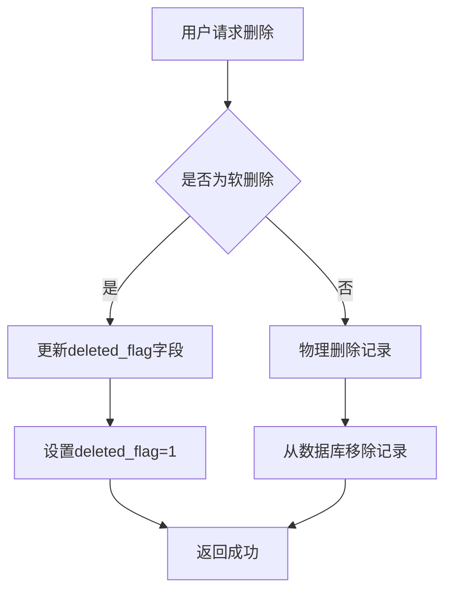
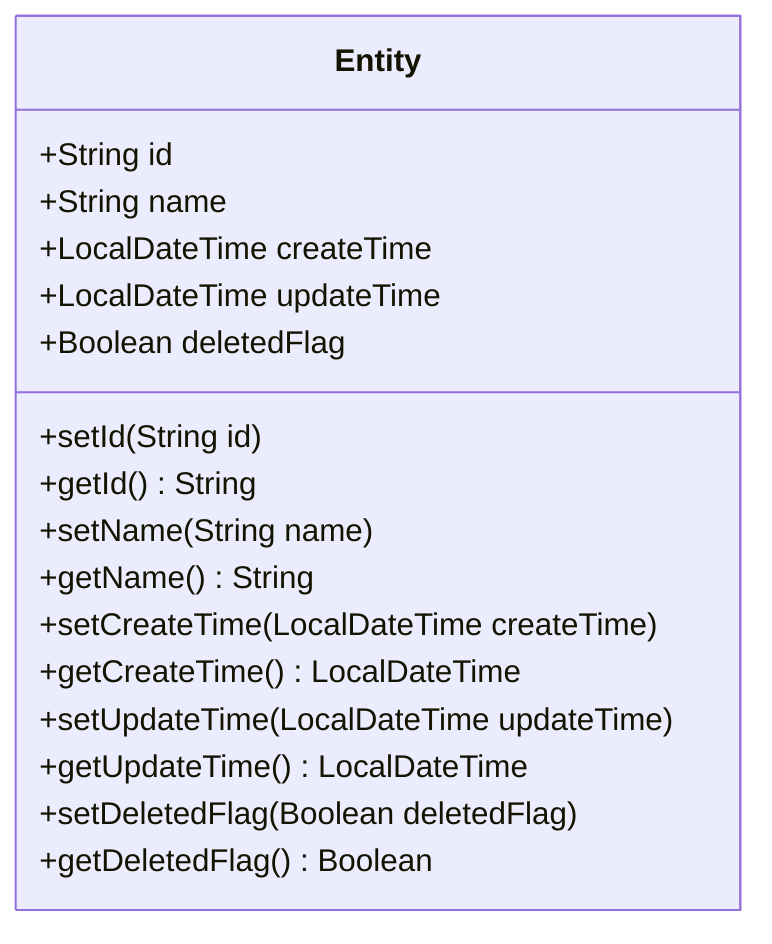
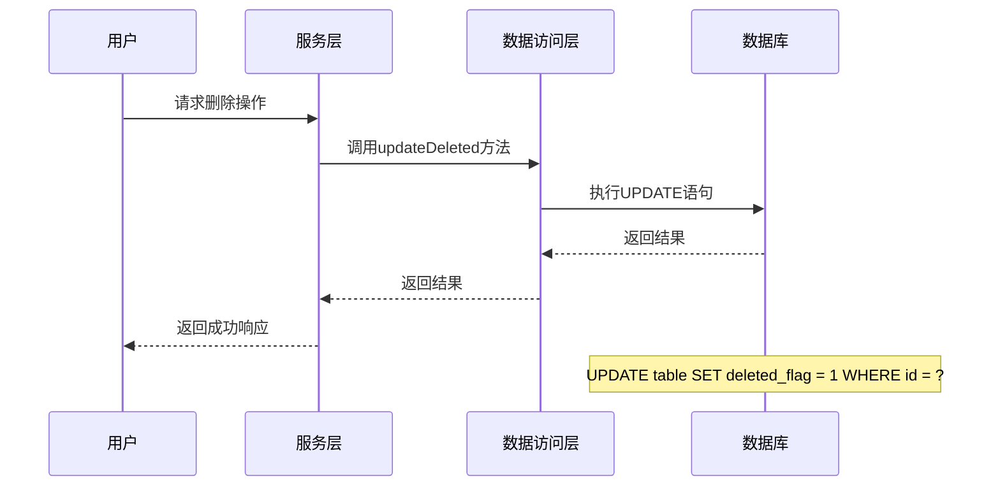
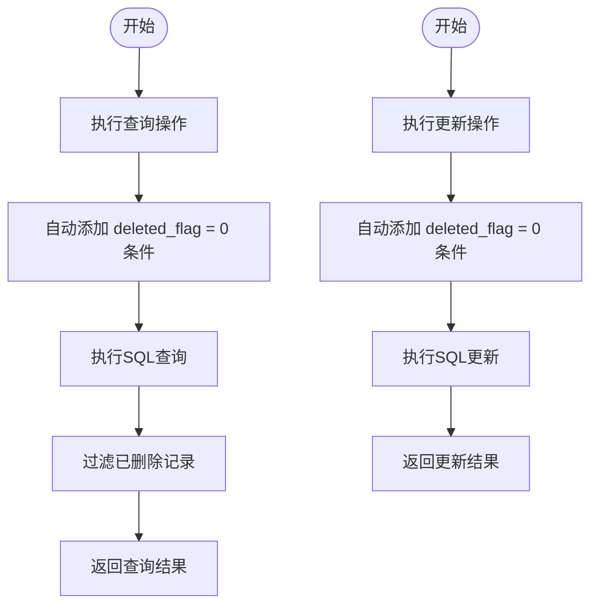
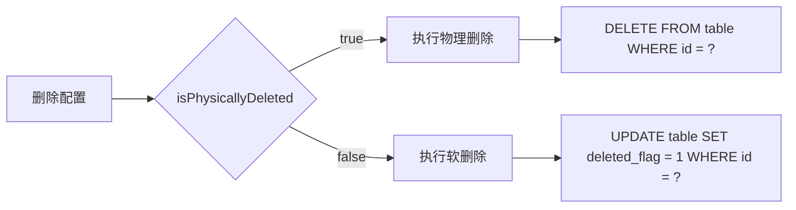
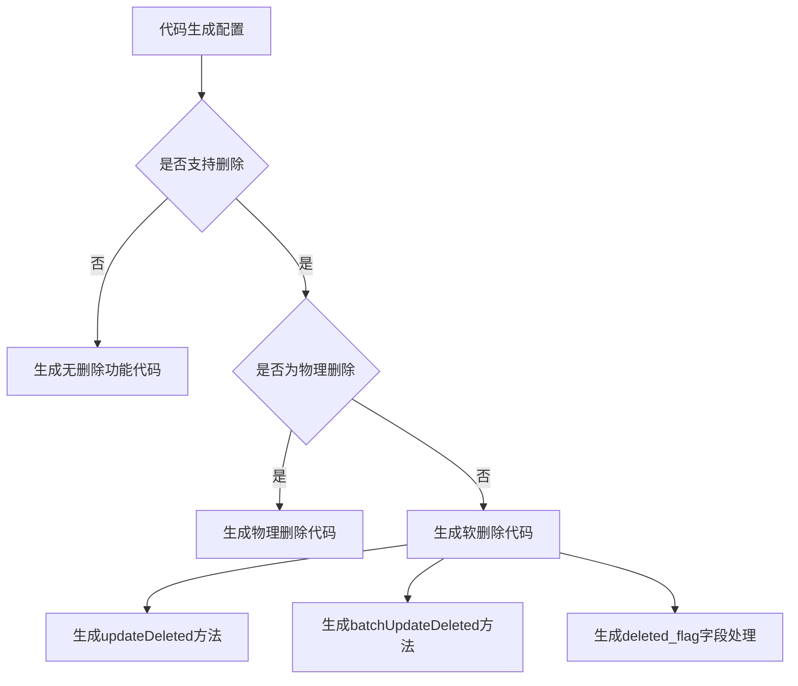
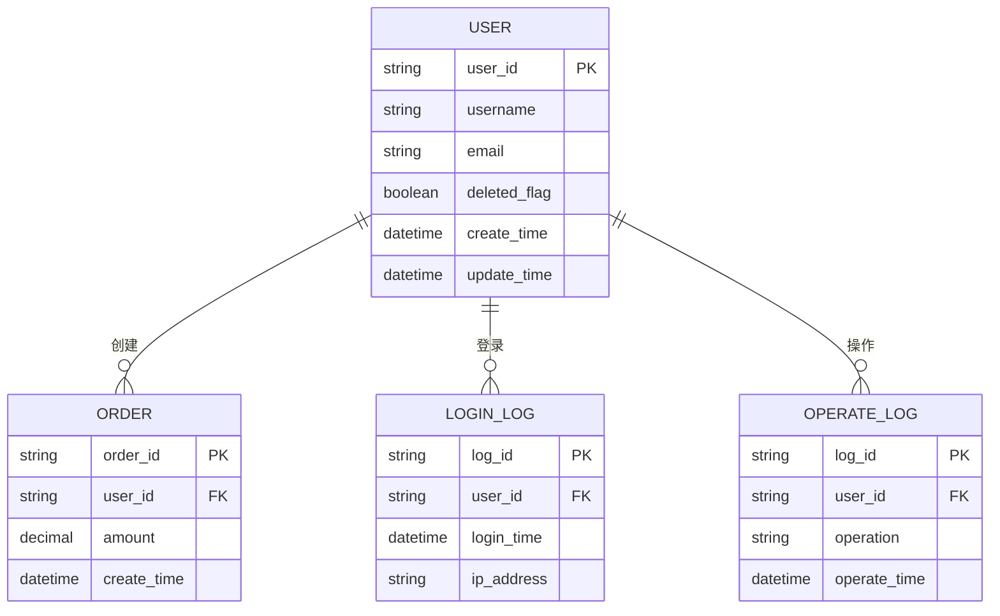

# 软删除实现

<cite>
**本文档引用的文件**  
- [MybatisPlusConfig.java](file://smart-admin-api-java17-springboot3\sa-base\src\main\java\net\lab1024\sa\base\config\MybatisPlusConfig.java)
- [CodeGeneratorService.java](file://smart-admin-api-java17-springboot3\sa-base\src\main\java\net\lab1024\sa\base\module\support\codegenerator\service\CodeGeneratorService.java)
- [code-generator-table-config-form-delete.vue](file://smart-admin-web-javascript\src\views\support\code-generator\components\form\code-generator-table-config-form-delete.vue)
- [CodeGeneratorConstant.java](file://smart-admin-api-java17-springboot3\sa-base\src\main\java\net\lab1024\sa\base\module\support\codegenerator\constant\CodeGeneratorConstant.java)
- [Entity.java.vm](file://smart-admin-api-java17-springboot3\sa-base\src\main\resources\code-generator-template\java\domain\entity\Entity.java.vm)
- [Mapper.xml.vm](file://smart-admin-api-java17-springboot3\sa-base\src\main\resources\code-generator-template\java\mapper\Mapper.xml.vm)
- [Service.java.vm](file://smart-admin-api-java17-springboot3\sa-base\src\main\resources\code-generator-template\java\service\Service.java.vm)
- [MybatisPlusFillHandler.java](file://smart-admin-api-java17-springboot3\sa-base\src\main\java\net\lab1024\sa\base\handler\MybatisPlusFillHandler.java)
</cite>

## 目录
1. [引言](#引言)
2. [软删除设计概述](#软删除设计概述)
3. [deleted_flag字段设计](#deleted_flag字段设计)
4. [MyBatis-Plus逻辑删除配置](#mybatis-plus逻辑删除配置)
5. [查询与更新操作的SQL改造机制](#查询与更新操作的sql改造机制)
6. [临时关闭逻辑删除功能](#临时关闭逻辑删除功能)
7. [代码生成器中的软删除实现](#代码生成器中的软删除实现)
8. [实际应用示例](#实际应用示例)
9. [总结](#总结)

## 引言

软删除是一种常见的数据管理策略，它通过标记数据为"已删除"状态而非真正从数据库中移除，从而实现数据的可恢复性和审计追踪。在Smart Admin系统中，软删除功能通过MyBatis-Plus框架的逻辑删除特性实现，结合代码生成器提供了一套完整的解决方案。本文档将详细介绍软删除的实现机制、配置方式和实际应用。

**Section sources**
- [MybatisPlusConfig.java](file://smart-admin-api-java17-springboot3\sa-base\src\main\java\net\lab1024\sa\base\config\MybatisPlusConfig.java)
- [CodeGeneratorService.java](file://smart-admin-api-java17-springboot3\sa-base\src\main\java\net\lab1024\sa\base\module\support\codegenerator\service\CodeGeneratorService.java)

## 软删除设计概述

在Smart Admin系统中，软删除的设计遵循了标准的实现模式。系统通过在数据库表中添加`deleted_flag`字段来标识记录的删除状态，结合MyBatis-Plus框架的逻辑删除功能，实现了对删除操作的透明处理。这种设计既保证了数据的安全性，又提高了系统的灵活性。

软删除的核心思想是将物理删除操作转换为逻辑更新操作，通过修改`deleted_flag`字段的值来标记记录的删除状态。当需要查询数据时，系统会自动过滤掉已被标记为删除的记录，从而实现"删除"的效果。

**Diagram sources**
- [CodeGeneratorService.java](file://smart-admin-api-java17-springboot3\sa-base\src\main\java\net\lab1024\sa\base\module\support\codegenerator\service\CodeGeneratorService.java)
- [Mapper.xml.vm](file://smart-admin-api-java17-springboot3\sa-base\src\main\resources\code-generator-template\java\mapper\Mapper.xml.vm)

**Section sources**
- [CodeGeneratorService.java](file://smart-admin-api-java17-springboot3\sa-base\src\main\java\net\lab1024\sa\base\module\support\codegenerator\service\CodeGeneratorService.java)
- [code-generator-table-config-form-delete.vue](file://smart-admin-web-javascript\src\views\support\code-generator\components\form\code-generator-table-config-form-delete.vue)

## deleted_flag字段设计

在Smart Admin系统中，`deleted_flag`字段是实现软删除的核心。该字段的设计遵循了以下原则：

1. **字段命名规范**：统一使用`deleted_flag`作为软删除标志字段的名称，确保系统的一致性。
2. **数据类型**：通常使用布尔类型或整数类型来存储删除状态。
3. **默认值**：新记录的`deleted_flag`字段默认值为0，表示未删除状态。
4. **索引优化**：在`deleted_flag`字段上创建索引，以提高查询性能。

系统通过代码生成器自动检测和验证`deleted_flag`字段的存在，确保软删除功能的正确实现。在代码生成配置中，如果启用了软删除功能但数据库表中缺少`deleted_flag`字段，系统会抛出相应的错误提示。

**Diagram sources**
- [Entity.java.vm](file://smart-admin-api-java17-springboot3\sa-base\src\main\resources\code-generator-template\java\domain\entity\Entity.java.vm)
- [CodeGeneratorConstant.java](file://smart-admin-api-java17-springboot3\sa-base\src\main\java\net\lab1024\sa\base\module\support\codegenerator\constant\CodeGeneratorConstant.java)

**Section sources**
- [CodeGeneratorConstant.java](file://smart-admin-api-java17-springboot3\sa-base\src\main\java\net\lab1024\sa\base\module\support\codegenerator\constant\CodeGeneratorConstant.java)
- [code-generator-table-config-form-delete.vue](file://smart-admin-web-javascript\src\views\support\code-generator\components\form\code-generator-table-config-form-delete.vue)

## MyBatis-Plus逻辑删除配置

MyBatis-Plus框架提供了强大的逻辑删除功能，Smart Admin系统充分利用了这一特性来实现软删除。逻辑删除的配置分为全局配置和局部配置两种方式。

### 全局配置

在MyBatis-Plus的全局配置中，可以通过设置逻辑删除的规则来统一管理所有实体的软删除行为。然而，在当前的Smart Admin系统中，MyBatisPlusConfig.java文件中并未直接配置逻辑删除插件，而是通过代码生成器和实体类注解来实现软删除功能。

### 局部配置

局部配置是通过在实体类的字段上使用`@TableLogic`注解来实现的。在代码生成模板中，当启用软删除功能时，会自动为`deleted_flag`字段添加相应的注解和逻辑处理。

**Diagram sources**
- [Mapper.xml.vm](file://smart-admin-api-java17-springboot3\sa-base\src\main\resources\code-generator-template\java\mapper\Mapper.xml.vm)
- [Service.java.vm](file://smart-admin-api-java17-springboot3\sa-base\src\main\resources\code-generator-template\java\service\Service.java.vm)

**Section sources**
- [Mapper.xml.vm](file://smart-admin-api-java17-springboot3\sa-base\src\main\resources\code-generator-template\java\mapper\Mapper.xml.vm)
- [Service.java.vm](file://smart-admin-api-java17-springboot3\sa-base\src\main\resources\code-generator-template\java\service\Service.java.vm)

## 查询与更新操作的SQL改造机制

MyBatis-Plus的逻辑删除功能通过SQL改造机制来实现对查询和更新操作的透明处理。当启用了逻辑删除功能后，框架会自动修改生成的SQL语句，以包含对`deleted_flag`字段的处理。

### 查询操作改造

在执行查询操作时，MyBatis-Plus会自动在WHERE条件中添加`deleted_flag = 0`的过滤条件，确保只返回未删除的记录。这种改造是透明的，开发者无需在查询代码中显式添加删除状态的判断。

### 更新操作改造

对于更新操作，MyBatis-Plus会确保只更新未删除的记录。在执行更新语句时，会自动添加`deleted_flag = 0`的条件，防止对已删除的记录进行修改。

**Diagram sources**
- [Mapper.xml.vm](file://smart-admin-api-java17-springboot3\sa-base\src\main\resources\code-generator-template\java\mapper\Mapper.xml.vm)
- [MybatisPlusFillHandler.java](file://smart-admin-api-java17-springboot3\sa-base\src\main\java\net\lab1024\sa\base\handler\MybatisPlusFillHandler.java)

**Section sources**
- [Mapper.xml.vm](file://smart-admin-api-java17-springboot3\sa-base\src\main\resources\code-generator-template\java\mapper\Mapper.xml.vm)
- [MybatisPlusFillHandler.java](file://smart-admin-api-java17-springboot3\sa-base\src\main\java\net\lab1024\sa\base\handler\MybatisPlusFillHandler.java)

## 临时关闭逻辑删除功能

在某些特殊场景下，可能需要临时关闭逻辑删除功能，直接执行物理删除操作。Smart Admin系统通过代码生成器提供了灵活的配置选项来实现这一需求。

在代码生成配置中，可以通过设置`isPhysicallyDeleted`参数来控制删除方式。当该参数设置为`true`时，系统将执行物理删除；设置为`false`时，则执行软删除。这种设计使得开发者可以根据具体业务需求灵活选择删除方式。

**Diagram sources**
- [Service.java.vm](file://smart-admin-api-java17-springboot3\sa-base\src\main\resources\code-generator-template\java\service\Service.java.vm)
- [code-generator-table-config-form-delete.vue](file://smart-admin-web-javascript\src\views\support\code-generator\components\form\code-generator-table-config-form-delete.vue)

**Section sources**
- [Service.java.vm](file://smart-admin-api-java17-springboot3\sa-base\src\main\resources\code-generator-template\java\service\Service.java.vm)
- [code-generator-table-config-form-delete.vue](file://smart-admin-web-javascript\src\views\support\code-generator\components\form\code-generator-table-config-form-delete.vue)

## 代码生成器中的软删除实现

Smart Admin系统的代码生成器在软删除实现中扮演了重要角色。通过代码生成器，开发者可以方便地配置和生成包含软删除功能的代码。

### 配置界面

代码生成器提供了直观的配置界面，允许开发者设置软删除相关参数：
- **是否支持删除**：控制表是否支持删除操作
- **是否为物理删除**：选择删除方式（物理删除或软删除）
- **删除类型**：选择删除操作的类型（单个删除、批量删除或两者都支持）

### 代码生成逻辑

当配置了软删除功能后，代码生成器会自动生成相应的DAO方法、Service方法和Mapper XML配置。这些生成的代码包含了对`deleted_flag`字段的处理逻辑，确保软删除功能的正确实现。

**Diagram sources**
- [code-generator-table-config-form-delete.vue](file://smart-admin-web-javascript\src\views\support\code-generator\components\form\code-generator-table-config-form-delete.vue)
- [CodeGeneratorService.java](file://smart-admin-api-java17-springboot3\sa-base\src\main\java\net\lab1024\sa\base\module\support\codegenerator\service\CodeGeneratorService.java)

**Section sources**
- [code-generator-table-config-form-delete.vue](file://smart-admin-web-javascript\src\views\support\code-generator\components\form\code-generator-table-config-form-delete.vue)
- [CodeGeneratorService.java](file://smart-admin-api-java17-springboot3\sa-base\src\main\java\net\lab1024\sa\base\module\support\codegenerator\service\CodeGeneratorService.java)

## 实际应用示例

在实际业务场景中，软删除功能的应用非常广泛。以下是一些典型的应用示例：

### 用户管理模块

在用户管理模块中，当管理员需要删除某个用户时，系统不会真正从数据库中移除该用户记录，而是将其`deleted_flag`字段设置为1。这样做的好处是：
- 可以随时恢复误删除的用户
- 保留用户的历史操作记录
- 避免外键约束问题

### 商品管理模块

在商品管理模块中，软删除可以防止因删除商品而导致的历史订单数据不一致问题。当商品被"删除"后，虽然在前端界面不可见，但与该商品相关的订单记录仍然保持完整。

### 配置管理模块

在配置管理模块中，软删除可以实现配置的版本控制。通过保留已删除的配置记录，系统可以方便地进行配置回滚和审计追踪。

**Diagram sources**
- [Entity.java.vm](file://smart-admin-api-java17-springboot3\sa-base\src\main\resources\code-generator-template\java\domain\entity\Entity.java.vm)
- [Mapper.xml.vm](file://smart-admin-api-java17-springboot3\sa-base\src\main\resources\code-generator-template\java\mapper\Mapper.xml.vm)

**Section sources**
- [Entity.java.vm](file://smart-admin-api-java17-springboot3\sa-base\src\main\resources\code-generator-template\java\domain\entity\Entity.java.vm)
- [Mapper.xml.vm](file://smart-admin-api-java17-springboot3\sa-base\src\main\resources\code-generator-template\java\mapper\Mapper.xml.vm)

## 总结

Smart Admin系统通过MyBatis-Plus框架和代码生成器的结合，实现了一套完整且灵活的软删除解决方案。`deleted_flag`字段的设计和使用遵循了统一的规范，确保了系统的一致性和可维护性。通过全局和局部配置的结合，系统既提供了统一的软删除策略，又保留了足够的灵活性来满足不同业务场景的需求。

软删除的SQL改造机制使得开发者可以专注于业务逻辑的实现，而无需关心删除状态的处理细节。同时，代码生成器的集成大大简化了软删除功能的实现过程，提高了开发效率。

在实际应用中，软删除功能不仅提高了数据的安全性，还为系统提供了更好的可审计性和可恢复性。通过合理使用软删除，可以有效避免数据丢失风险，同时保持系统的高性能和高可用性。

**Section sources**
- [MybatisPlusConfig.java](file://smart-admin-api-java17-springboot3\sa-base\src\main\java\net\lab1024\sa\base\config\MybatisPlusConfig.java)
- [CodeGeneratorService.java](file://smart-admin-api-java17-springboot3\sa-base\src\main\java\net\lab1024\sa\base\module\support\codegenerator\service\CodeGeneratorService.java)
- [code-generator-table-config-form-delete.vue](file://smart-admin-web-javascript\src\views\support\code-generator\components\form\code-generator-table-config-form-delete.vue)