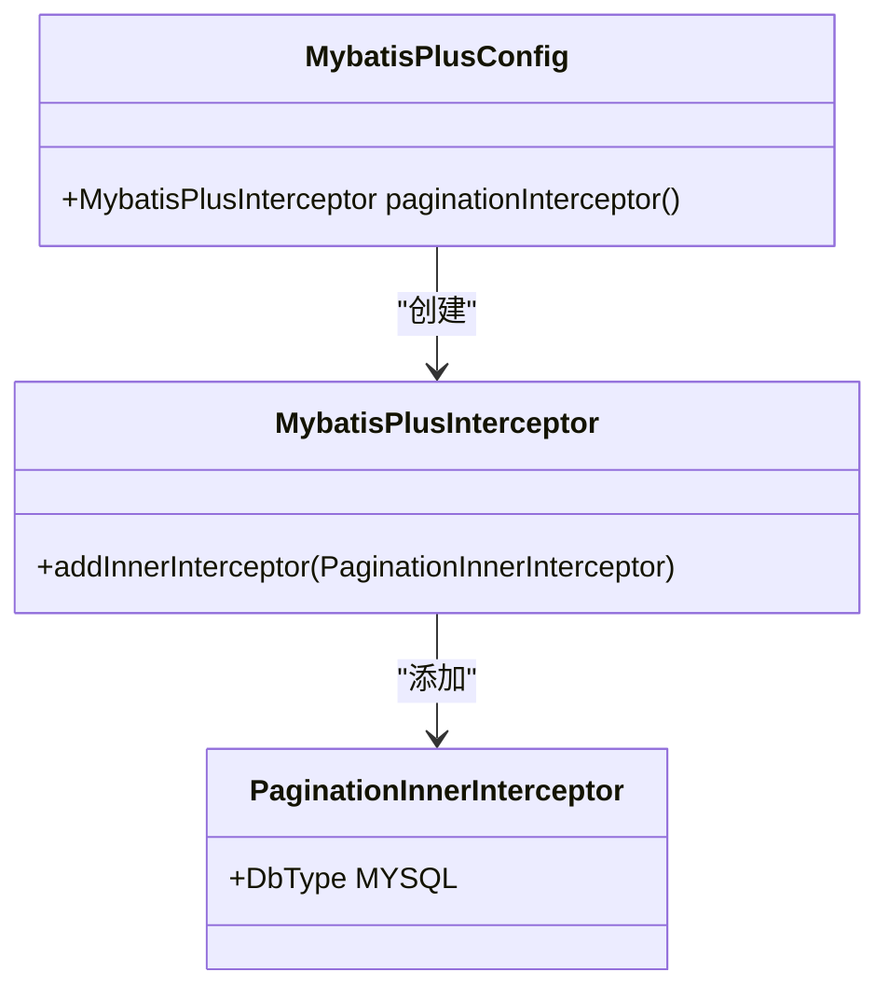
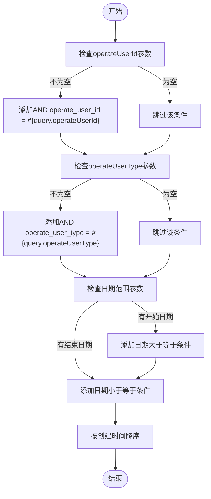
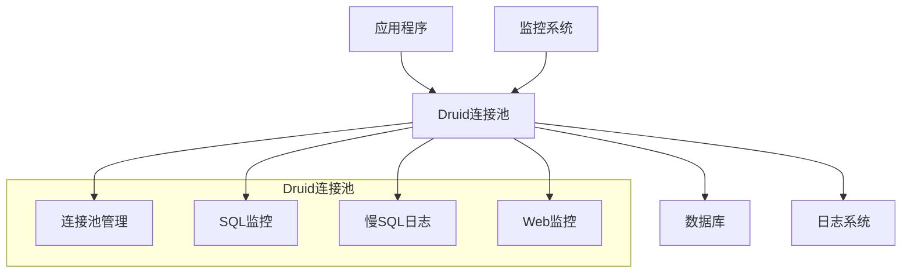

# 数据模型与ORM

<cite>
**本文档引用的文件**  
- [MybatisPlusConfig.java](file://smart-admin-api-java17-springboot3/sa-base/src/main/java/net/lab1024/sa/base/config/MybatisPlusConfig.java)
- [MybatisPlusFillHandler.java](file://smart-admin-api-java17-springboot3/sa-base/src/main/java/net/lab1024/sa/base/handler/MybatisPlusFillHandler.java)
- [DataSourceConfig.java](file://smart-admin-api-java17-springboot3/sa-base/src/main/java/net/lab1024/sa/base/config/DataSourceConfig.java)
- [OperateLogMapper.xml](file://smart-admin-api-java17-springboot3/sa-base/src/main/resources/mapper/support/OperateLogMapper.xml)
- [LoginLogMapper.xml](file://smart-admin-api-java17-springboot3/sa-base/src/main/resources/mapper/support/LoginLogMapper.xml)
- [sa-base.yaml](file://smart-admin-api-java17-springboot3/sa-base/src/main/resources/dev/sa-base.yaml)
- [ChangeLogEntity.java](file://smart-admin-api-java17-springboot3/sa-base/src/main/java/net/lab1024/sa/base/module/support/changelog/domain/entity/ChangeLogEntity.java)
- [AreaConfigEntity.java](file://smart-admin-api-java17-springboot3/sa-admin/src/main/java/net/lab1024/sa/admin/module/system/area/domain/entity/AreaConfigEntity.java)
</cite>

## 目录
1. [引言](#引言)
2. [实体类设计规范](#实体类设计规范)
3. [MyBatisPlus配置详解](#mybatisplus配置详解)
4. [Mapper XML文件规范](#mapper-xml文件规范)
5. [数据库表命名与设计](#数据库表命名与设计)
6. [数据库连接池配置](#数据库连接池配置)
7. [SQL执行性能优化建议](#sql执行性能优化建议)
8. [结论](#结论)

## 引言
本文档详细介绍了基于MyBatis-Plus的ORM框架在项目中的集成与使用。文档涵盖了实体类设计规范、MyBatisPlus配置、Mapper XML文件编写规范、数据库表命名规则以及数据库连接池配置和性能优化建议。通过本指南，开发人员可以更好地理解和应用数据模型与ORM框架的最佳实践。

## 实体类设计规范

### 字段命名规范
实体类中的字段命名遵循Java驼峰命名法，与数据库字段的下划线命名法通过MyBatis-Plus的自动映射功能进行转换。例如，数据库字段`create_time`对应实体类字段`createTime`。

### 审计字段
所有实体类都包含标准的审计字段，用于记录数据的创建和更新时间：
- `createTime`：记录数据创建时间
- `updateTime`：记录数据最后更新时间

这些字段通过`MybatisPlusFillHandler`自动填充，无需在业务代码中手动设置。

### 软删除标记
软删除功能通过`deletedFlag`字段实现，该字段为整数类型，取值为0（未删除）或1（已删除）。当执行删除操作时，系统会将`deletedFlag`设置为1，而不是从数据库中物理删除记录。

### 乐观锁
乐观锁通过`version`字段实现，该字段为整数类型，初始值为1。每次更新数据时，版本号会自动递增，确保数据的一致性和并发安全性。

**Section sources**
- [MybatisPlusFillHandler.java](file://smart-admin-api-java17-springboot3/sa-base/src/main/java/net/lab1024/sa/base/handler/MybatisPlusFillHandler.java#L19-L21)
- [AreaConfigEntity.java](file://smart-admin-api-java17-springboot3/sa-admin/src/main/java/net/lab1024/sa/admin/module/system/area/domain/entity/AreaConfigEntity.java#L101)

## MyBatisPlus配置详解

### 分页插件
MyBatis-Plus的分页功能通过`MybatisPlusInterceptor`实现，配置如下：



**Diagram sources**
- [MybatisPlusConfig.java](file://smart-admin-api-java17-springboot3/sa-base/src/main/java/net/lab1024/sa/base/config/MybatisPlusConfig.java#L26-L31)

### 性能分析插件
性能分析插件通过Druid数据源的`StatFilter`实现，配置了SQL合并、慢SQL日志记录等功能。慢SQL的阈值设置为1000毫秒，超过此时间的SQL语句将被记录。

### SQL执行日志配置
SQL执行日志通过Druid的`StatViewServlet`和`WebStatFilter`进行监控和管理。在开发环境中，可以通过`/druid/*`路径访问Druid监控页面，查看SQL执行情况、连接池状态等信息。

**Section sources**
- [DataSourceConfig.java](file://smart-admin-api-java17-springboot3/sa-base/src/main/java/net/lab1024/sa/base/config/DataSourceConfig.java#L120-L124)
- [DataSourceConfig.java](file://smart-admin-api-java17-springboot3/sa-base/src/main/java/net/lab1024/sa/base/config/DataSourceConfig.java#L160-L175)

## Mapper XML文件规范

### 基本结构
Mapper XML文件遵循MyBatis的标准结构，包含`namespace`、`select`、`insert`、`update`和`delete`等元素。`namespace`属性指向对应的DAO接口。

### 动态SQL使用
动态SQL通过`<if>`、`<where>`、`<foreach>`等标签实现，提高了SQL的灵活性和可维护性。以下是一个分页查询的示例：



**Diagram sources**
- [OperateLogMapper.xml](file://smart-admin-api-java17-springboot3/sa-base/src/main/resources/mapper/support/OperateLogMapper.xml#L5-L36)

### 批量删除实现
批量删除通过`<foreach>`标签实现，将ID列表转换为SQL中的`IN`子句：

```mermaid
flowchart TD
Start([开始]) --> DeleteStatement["delete from t_operate_log where id in"]
DeleteStatement --> ForeachStart["<foreach collection=\"idList\" open=\"(\" close=\")\" separator=\",\" item=\"item\">"]
ForeachStart --> ItemPlaceholder["#{item}"]
ItemPlaceholder --> ForeachEnd["</foreach>"]
ForeachEnd --> End([结束])
```

**Diagram sources**
- [OperateLogMapper.xml](file://smart-admin-api-java17-springboot3/sa-base/src/main/resources/mapper/support/OperateLogMapper.xml#L38-L43)

## 数据库表命名与设计

### 表命名规范
数据库表采用`t_{business}_{entity}`格式命名，其中：
- `t`表示表（table）
- `{business}`表示业务模块
- `{entity}`表示实体名称

例如，操作日志表命名为`t_operate_log`，登录日志表命名为`t_login_log`。

### 主键设计
所有表的主键采用`BIGINT AUTO_INCREMENT`设计，确保主键的唯一性和自增性。主键字段通常命名为`{entity}Id`，如`operateLogId`、`loginLogId`等。

### 索引策略
索引策略根据查询需求设计，主要原则包括：
1. 在经常用于查询条件的字段上创建索引
2. 在外键字段上创建索引
3. 在排序字段上创建索引
4. 避免在低选择性的字段上创建索引

对于复合查询条件，考虑创建复合索引以提高查询效率。

**Section sources**
- [OperateLogMapper.xml](file://smart-admin-api-java17-springboot3/sa-base/src/main/resources/mapper/support/OperateLogMapper.xml#L8)
- [LoginLogMapper.xml](file://smart-admin-api-java17-springboot3/sa-base/src/main/resources/mapper/support/LoginLogMapper.xml#L8)

## 数据库连接池配置

### Druid连接池
项目使用Druid作为数据库连接池，主要配置参数如下：
- 初始连接数：2
- 最小空闲连接数：2
- 最大活跃连接数：10
- 最大等待时间：60000毫秒
- 连接检测间隔：60000毫秒
- 最小空闲时间：300000毫秒

### 连接池监控
Druid提供了强大的监控功能，通过`StatViewServlet`和`WebStatFilter`实现。监控页面可以查看：
- SQL执行统计
- 连接池状态
- 慢SQL日志
- Web URI监控



**Diagram sources**
- [DataSourceConfig.java](file://smart-admin-api-java17-springboot3/sa-base/src/main/java/net/lab1024/sa/base/config/DataSourceConfig.java#L104-L132)
- [DataSourceConfig.java](file://smart-admin-api-java17-springboot3/sa-base/src/main/java/net/lab1024/sa/base/config/DataSourceConfig.java#L160-L175)

## SQL执行性能优化建议

### 查询优化
1. 避免使用`SELECT *`，只选择需要的字段
2. 合理使用索引，避免全表扫描
3. 对于大数据量的查询，使用分页查询
4. 避免在WHERE子句中对字段进行函数操作

### 批量操作
1. 使用批量插入而非单条插入
2. 使用批量更新而非单条更新
3. 使用`<foreach>`标签实现批量删除

### 缓存策略
1. 对于不经常变化的数据，使用Redis缓存
2. 设置合理的缓存过期时间
3. 使用缓存预热策略，避免缓存击穿

### 连接管理
1. 及时关闭数据库连接
2. 合理设置连接池参数
3. 监控连接池状态，及时发现和解决连接泄漏问题

**Section sources**
- [sa-base.yaml](file://smart-admin-api-java17-springboot3/sa-base/src/main/resources/dev/sa-base.yaml#L8-L14)
- [DataSourceConfig.java](file://smart-admin-api-java17-springboot3/sa-base/src/main/java/net/lab1024/sa/base/config/DataSourceConfig.java#L50-L79)

## 结论
本文档详细介绍了MyBatis-Plus在项目中的集成与使用，涵盖了实体类设计、配置、Mapper XML编写、数据库设计和性能优化等方面。通过遵循这些规范和建议，可以提高代码质量和系统性能，确保数据访问层的稳定性和可维护性。