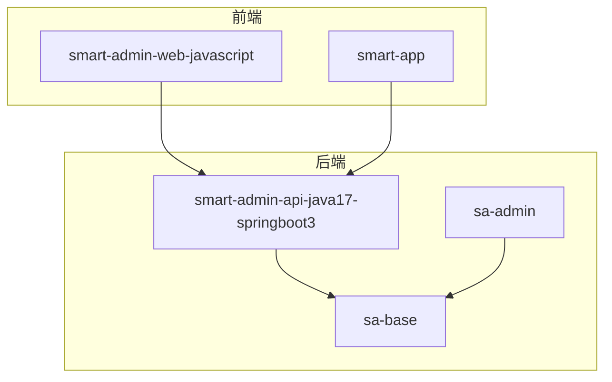
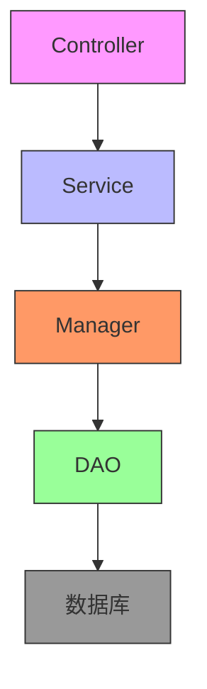
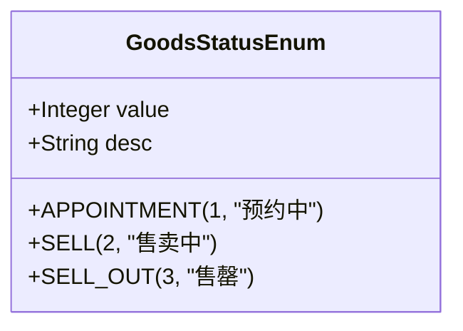
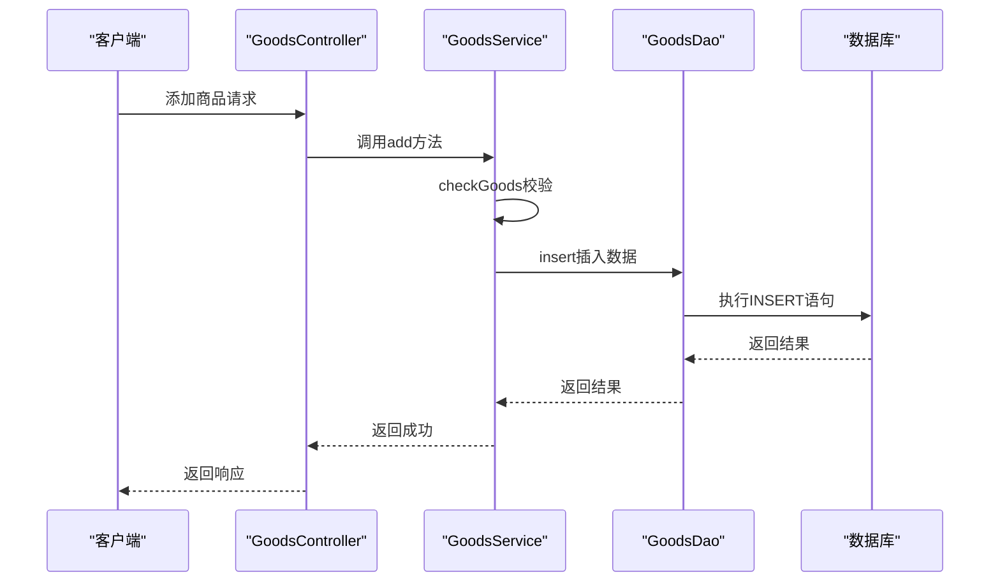
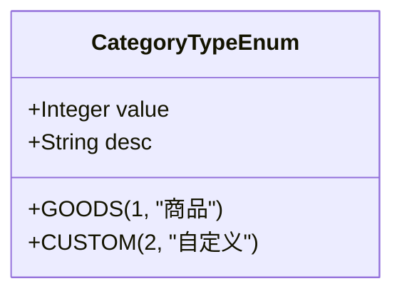
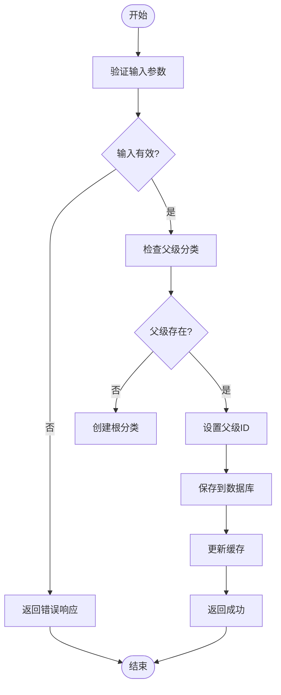
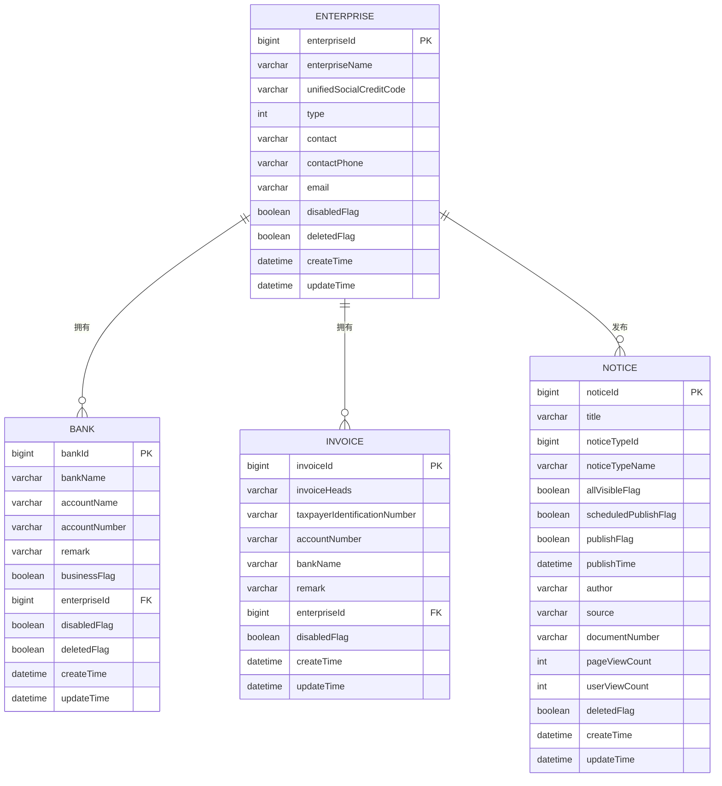
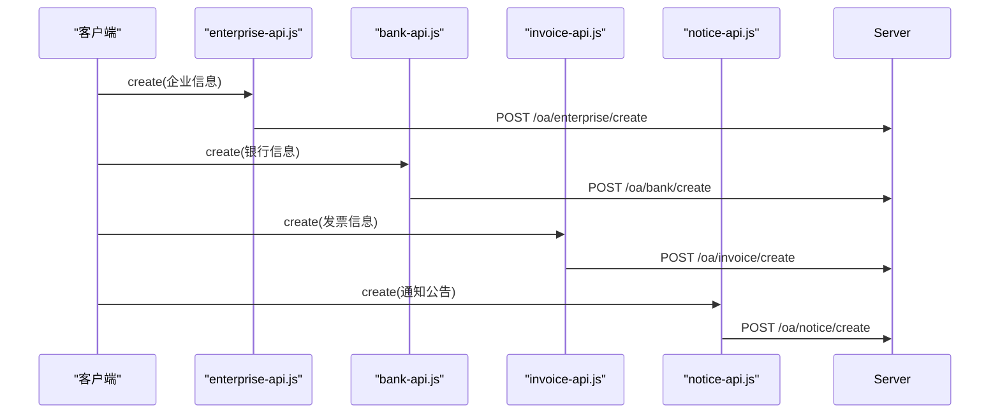
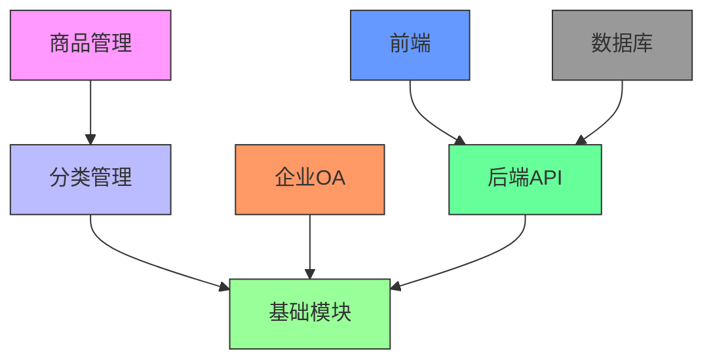

# 业务系统模块(business)

<cite>
**本文档引用文件**  
- [GoodsStatusEnum.java](file://smart-admin-api-java17-springboot3\sa-admin\src\main\java\net\lab1024\sa\admin\module\business\goods\constant\GoodsStatusEnum.java)
- [CategoryTypeEnum.java](file://smart-admin-api-java17-springboot3\sa-admin\src\main\java\net\lab1024\sa\admin\module\business\category\constant\CategoryTypeEnum.java)
- [GoodsEntity.java](file://smart-admin-api-java17-springboot3\sa-admin\src\main\java\net\lab1024\sa\admin\module\business\goods\domain\entity\GoodsEntity.java)
- [CategoryEntity.java](file://smart-admin-api-java17-springboot3\sa-admin\src\main\java\net\lab1024\sa\admin\module\business\category\domain\entity\CategoryEntity.java)
- [GoodsService.java](file://smart-admin-api-java17-springboot3\sa-admin\src\main\java\net\lab1024\sa\admin\module\business\goods\service\GoodsService.java)
- [GoodsDao.java](file://smart-admin-api-java17-springboot3\sa-admin\src\main\java\net\lab1024\sa\admin\module\business\goods\dao\GoodsDao.java)
- [EnterpriseEntity.java](file://smart-admin-api-java17-springboot3\sa-admin\src\main\java\net\lab1024\sa\admin\module\business\oa\enterprise\domain\entity\EnterpriseEntity.java)
- [BankEntity.java](file://smart-admin-api-java17-springboot3\sa-admin\src\main\java\net\lab1024\sa\admin\module\business\oa\bank\domain\BankEntity.java)
- [InvoiceEntity.java](file://smart-admin-api-java17-springboot3\sa-admin\src\main\java\net\lab1024\sa\admin\module\business\oa\invoice\domain\InvoiceEntity.java)
- [NoticeVO.java](file://smart-admin-api-java17-springboot3\sa-admin\src\main\java\net\lab1024\sa\admin\module\business\oa\notice\domain\vo\NoticeVO.java)
- [goods-const.js](file://smart-admin-web-javascript\src\constants\business\erp\goods-const.js)
- [category-const.js](file://smart-admin-web-javascript\src\constants\business\erp\category-const.js)
- [enterprise-const.js](file://smart-admin-web-javascript\src\constants\business\oa\enterprise-const.js)
- [notice-const.js](file://smart-admin-web-javascript\src\constants\business\oa\notice-const.js)
- [goods-api.js](file://smart-admin-web-javascript\src\api\business\goods\goods-api.js)
- [enterprise-api.js](file://smart-admin-web-javascript\src\api\business\oa\enterprise-api.js)
- [bank-api.js](file://smart-admin-web-javascript\src\api\business\oa\bank-api.js)
- [invoice-api.js](file://smart-admin-web-javascript\src\api\business\oa\invoice-api.js)
- [notice-api.js](file://smart-admin-web-javascript\src\api\business\oa\notice-api.js)
</cite>

## 目录
1. [项目结构](#项目结构)
2. [核心组件](#核心组件)
3. [架构概述](#架构概述)
4. [详细组件分析](#详细组件分析)
5. [依赖分析](#依赖分析)
6. [性能考虑](#性能考虑)
7. [故障排除指南](#故障排除指南)
8. [结论](#结论)

## 项目结构

该业务系统模块采用分层架构设计，主要包含商品管理、分类管理、企业OA（企业信息、银行账户、发票信息、通知公告）等核心业务功能。系统遵循统一的四层架构模式，各层职责划分清晰。

**图示来源**
- [CLAUDE.md](file://CLAUDE.md#L91-L134)

**本节来源**
- [CLAUDE.md](file://CLAUDE.md#L91-L134)

## 核心组件

本系统的核心组件包括商品管理、分类管理以及企业OA模块。商品管理模块负责商品的全生命周期管理，包括商品的添加、更新、删除和查询等操作。分类管理模块提供灵活的分类体系，支持商品分类和自定义分类。企业OA模块则涵盖了企业信息、银行账户、发票信息和通知公告等企业级管理功能。

这些组件共同构成了业务系统的核心功能，通过统一的四层架构模式实现了高内聚、低耦合的设计原则。各组件之间通过清晰的接口进行通信，确保了系统的可维护性和可扩展性。

**本节来源**
- [GoodsStatusEnum.java](file://smart-admin-api-java17-springboot3\sa-admin\src\main\java\net\lab1024\sa\admin\module\business\goods\constant\GoodsStatusEnum.java#L1-L42)
- [CategoryTypeEnum.java](file://smart-admin-api-java17-springboot3\sa-admin\src\main\java\net\lab1024\sa\admin\module\business\category\constant\CategoryTypeEnum.java#L1-L36)

## 架构概述

系统采用标准的四层架构模式：Controller → Service → Manager → DAO，确保了各层职责的清晰划分和良好的代码组织结构。

**图示来源**
- [CLAUDE.md](file://CLAUDE.md#L194-L227)

**本节来源**
- [CLAUDE.md](file://CLAUDE.md#L194-L227)

## 详细组件分析

### 商品管理分析

商品管理模块实现了商品的全生命周期管理，包括商品的添加、更新、删除和查询等操作。系统通过统一的四层架构模式确保了业务逻辑的清晰和可维护性。

#### 商品状态枚举设计

**图示来源**
- [GoodsStatusEnum.java](file://smart-admin-api-java17-springboot3\sa-admin\src\main\java\net\lab1024\sa\admin\module\business\goods\constant\GoodsStatusEnum.java#L1-L42)

#### 商品服务流程

**图示来源**
- [GoodsService.java](file://smart-admin-api-java17-springboot3\sa-admin\src\main\java\net\lab1024\sa\admin\module\business\goods\service\GoodsService.java#L60-L100)
- [GoodsDao.java](file://smart-admin-api-java17-springboot3\sa-admin\src\main\java\net\lab1024\sa\admin\module\business\goods\dao\GoodsDao.java#L1-L37)

**本节来源**
- [GoodsStatusEnum.java](file://smart-admin-api-java17-springboot3\sa-admin\src\main\java\net\lab1024\sa\admin\module\business\goods\constant\GoodsStatusEnum.java#L1-L42)
- [GoodsService.java](file://smart-admin-api-java17-springboot3\sa-admin\src\main\java\net\lab1024\sa\admin\module\business\goods\service\GoodsService.java#L60-L100)
- [GoodsDao.java](file://smart-admin-api-java17-springboot3\sa-admin\src\main\java\net\lab1024\sa\admin\module\business\goods\dao\GoodsDao.java#L1-L37)

### 分类管理分析

分类管理模块提供了灵活的分类体系，支持商品分类和自定义分类两种类型，满足不同业务场景的需求。

#### 分类类型枚举设计

**图示来源**
- [CategoryTypeEnum.java](file://smart-admin-api-java17-springboot3\sa-admin\src\main\java\net\lab1024\sa\admin\module\business\category\constant\CategoryTypeEnum.java#L1-L36)

#### 分类层级结构

**图示来源**
- [CategoryService.java](file://smart-admin-api-java17-springboot3\sa-admin\src\main\java\net\lab1024\sa\admin\module\business\category\service\CategoryService.java#L1-L33)

**本节来源**
- [CategoryTypeEnum.java](file://smart-admin-api-java17-springboot3\sa-admin\src\main\java\net\lab1024\sa\admin\module\business\category\constant\CategoryTypeEnum.java#L1-L36)
- [CategoryEntity.java](file://smart-admin-api-java17-springboot3\sa-admin\src\main\java\net\lab1024\sa\admin\module\business\category\domain\entity\CategoryEntity.java#L1-L70)

### 企业OA模块分析

企业OA模块涵盖了企业信息、银行账户、发票信息和通知公告等企业级管理功能，各实体之间存在明确的关联关系。

#### OA模块数据模型

**图示来源**
- [EnterpriseEntity.java](file://smart-admin-api-java17-springboot3\sa-admin\src\main\java\net\lab1024\sa\admin\module\business\oa\enterprise\domain\entity\EnterpriseEntity.java#L1-L154)
- [BankEntity.java](file://smart-admin-api-java17-springboot3\sa-admin\src\main\java\net\lab1024\sa\admin\module\business\oa\bank\domain\BankEntity.java#L1-L96)
- [InvoiceEntity.java](file://smart-admin-api-java17-springboot3\sa-admin\src\main\java\net\lab1024\sa\admin\module\business\oa\invoice\domain\InvoiceEntity.java#L1-L58)
- [NoticeVO.java](file://smart-admin-api-java17-springboot3\sa-admin\src\main\java\net\lab1024\sa\admin\module\business\oa\notice\domain\vo\NoticeVO.java#L1-L73)

#### API接口示例

**图示来源**
- [enterprise-api.js](file://smart-admin-web-javascript\src\api\business\oa\enterprise-api.js#L1-L70)
- [bank-api.js](file://smart-admin-web-javascript\src\api\business\oa\bank-api.js#L1-L43)
- [invoice-api.js](file://smart-admin-web-javascript\src\api\business\oa\invoice-api.js#L1-L44)
- [notice-api.js](file://smart-admin-web-javascript\src\api\business\oa\notice-api.js)

**本节来源**
- [EnterpriseEntity.java](file://smart-admin-api-java17-springboot3\sa-admin\src\main\java\net\lab1024\sa\admin\module\business\oa\enterprise\domain\entity\EnterpriseEntity.java#L1-L154)
- [BankEntity.java](file://smart-admin-api-java17-springboot3\sa-admin\src\main\java\net\lab1024\sa\admin\module\business\oa\bank\domain\BankEntity.java#L1-L96)
- [InvoiceEntity.java](file://smart-admin-api-java17-springboot3\sa-admin\src\main\java\net\lab1024\sa\admin\module\business\oa\invoice\domain\InvoiceEntity.java#L1-L58)
- [NoticeVO.java](file://smart-admin-api-java17-springboot3\sa-admin\src\main\java\net\lab1024\sa\admin\module\business\oa\notice\domain\vo\NoticeVO.java#L1-L73)

## 依赖分析

系统各模块之间的依赖关系清晰，遵循了四层架构的设计原则，确保了低耦合和高内聚。

**图示来源**
- [CLAUDE.md](file://CLAUDE.md#L194-L227)

**本节来源**
- [CLAUDE.md](file://CLAUDE.md#L194-L227)

## 性能考虑

系统在设计时充分考虑了性能优化，采用了多种策略来确保系统的高效运行。

1. **缓存机制**: 分类管理模块使用了缓存管理器(CategoryCacheManager)来缓存分类数据，减少数据库查询次数。
2. **批量操作**: 商品管理模块支持批量删除操作，通过batchUpdateDeleted方法一次性更新多个记录的状态。
3. **分页查询**: 所有列表查询都支持分页，避免一次性加载大量数据。
4. **索引优化**: 数据库表设计时为常用查询字段建立了适当的索引。
5. **连接池**: 使用数据库连接池来管理数据库连接，提高连接复用率。

这些性能优化措施确保了系统在高并发场景下的稳定性和响应速度。

**本节来源**
- [GoodsService.java](file://smart-admin-api-java17-springboot3\sa-admin\src\main\java\net\lab1024\sa\admin\module\business\goods\service\GoodsService.java#L128-L166)
- [CategoryService.java](file://smart-admin-api-java17-springboot3\sa-admin\src\main\java\net\lab1024\sa\admin\module\business\category\service\CategoryService.java)

## 故障排除指南

在使用业务系统模块时，可能会遇到一些常见问题，以下是故障排除指南：

1. **商品无法删除**: 检查商品状态是否为"售罄"，只有售罄的商品才能被删除。
2. **分类保存失败**: 确认分类名称是否为空或超过20个字符限制。
3. **企业信息更新失败**: 检查统一社会信用代码是否为空或格式是否正确。
4. **银行账户重复**: 在添加银行账户时，系统会检查账号是否已存在。
5. **通知公告无法发布**: 确认发布时间是否设置正确，定时发布的公告需要设置发布时间。

通过遵循这些故障排除指南，可以快速定位和解决常见问题，确保系统的稳定运行。

**本节来源**
- [GoodsService.java](file://smart-admin-api-java17-springboot3\sa-admin\src\main\java\net\lab1024\sa\admin\module\business\goods\service\GoodsService.java#L95-L133)
- [CategoryBaseDTO.java](file://smart-admin-api-java17-springboot3\sa-admin\src\main\java\net\lab1024\sa\admin\module\business\category\domain\dto\CategoryBaseDTO.java#L1-L43)

## 结论

本业务系统模块通过统一的四层架构模式，实现了商品管理、分类管理、企业OA等核心业务功能。系统设计遵循了高内聚、低耦合的原则，各层职责划分清晰，确保了代码的可维护性和可扩展性。

关键设计特点包括：
- **枚举设计**: 通过GoodsStatusEnum和CategoryTypeEnum等枚举类，实现了业务状态的统一管理。
- **数据模型**: 企业OA模块中的企业、银行、发票等实体之间建立了清晰的关联关系。
- **事务管理**: 在Service层实现了事务边界控制，确保了数据的一致性。
- **API设计**: 提供了完整的增删改查接口，支持分页查询和批量操作。

该系统架构合理，功能完整，为业务系统的稳定运行提供了坚实的基础。