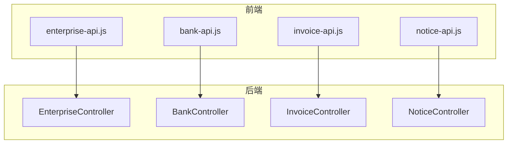
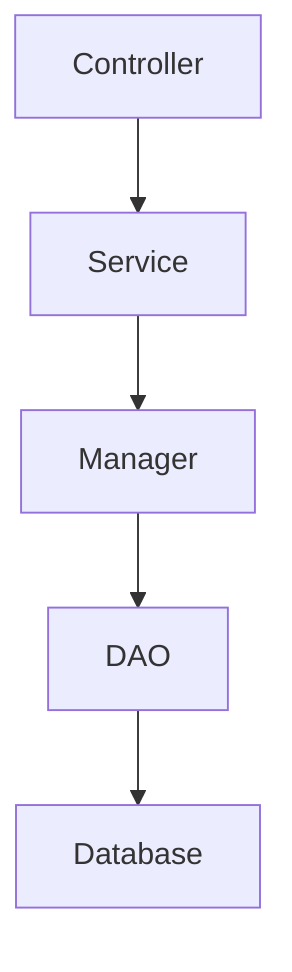
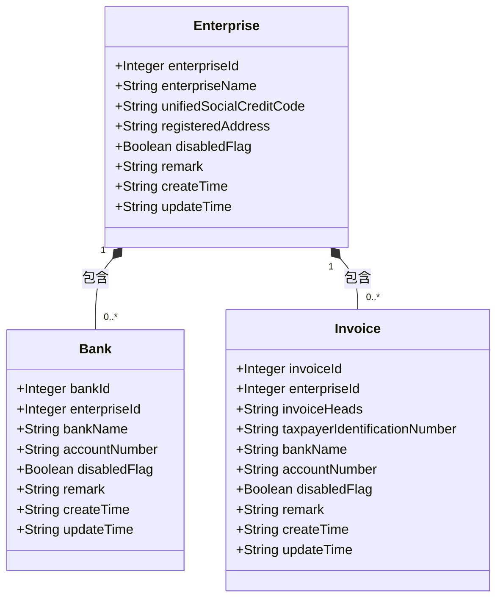
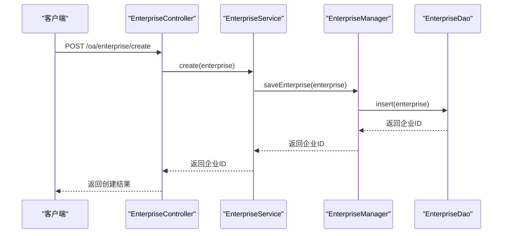
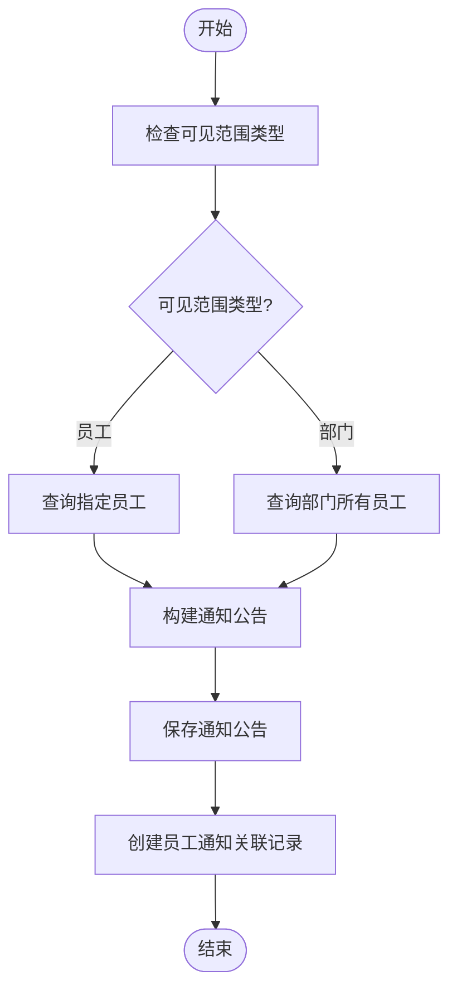
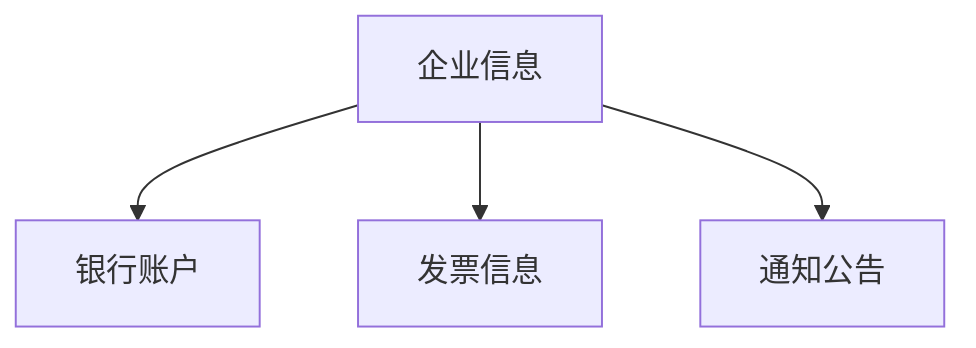

# 企业OA模块

<cite>
**本文档引用文件**  
- [enterprise-api.js](file://smart-admin-web-javascript/src/api/business/oa/enterprise-api.js)
- [bank-api.js](file://smart-admin-web-javascript/src/api/business/oa/bank-api.js)
- [invoice-api.js](file://smart-admin-web-javascript/src/api/business/oa/invoice-api.js)
- [notice-api.js](file://smart-admin-web-javascript/src/api/business/oa/notice-api.js)
- [enterprise-const.js](file://smart-admin-web-javascript/src/constants/business/oa/enterprise-const.js)
- [notice-const.js](file://smart-admin-web-javascript/src/constants/business/oa/notice-const.js)
- [enterprise-invoice-list.vue](file://smart-admin-web-javascript/src/views/business/oa/enterprise/components/enterprise-invoice-list.vue)
- [enterprise-invoice-operate-modal.vue](file://smart-admin-web-javascript/src/views/business/oa/enterprise/components/enterprise-invoice-operate-modal.vue)
- [data-tracer-const.js](file://smart-admin-web-javascript/src/constants/support/data-tracer-const.js)
</cite>

## 目录
1. [引言](#引言)
2. [项目结构](#项目结构)
3. [核心组件](#核心组件)
4. [架构概述](#架构概述)
5. [详细组件分析](#详细组件分析)
6. [依赖分析](#依赖分析)
7. [性能考虑](#性能考虑)
8. [故障排除指南](#故障排除指南)
9. [结论](#结论)

## 引言
本文档系统阐述企业OA模块中企业信息、银行账户、发票信息和通知公告四大子系统的整体架构与协同关系。重点分析企业（Enterprise）作为核心实体如何与银行（Bank）、发票（Invoice）等附属实体建立关联，并通过外键约束维护数据完整性。详细描述各子系统在四层架构中的实现模式，对比其共性与差异。特别关注通知公告模块中可见范围控制（NoticeVisibleRangeDataTypeEnum）的权限设计和员工通知关联表的实现机制。提供跨模块业务场景的实现示例，如企业信息变更时相关银行和发票数据的级联处理。

## 项目结构
企业OA模块采用前后端分离架构，前端位于`smart-admin-web-javascript`项目中，包含API接口定义、常量定义和Vue组件。后端服务遵循四层架构（Controller → Service → Manager → DAO），通过RESTful API提供服务。企业信息、银行账户、发票信息和通知公告四大子系统均通过独立的API端点进行访问和管理。

**图表来源**
- [enterprise-api.js](file://smart-admin-web-javascript/src/api/business/oa/enterprise-api.js)
- [bank-api.js](file://smart-admin-web-javascript/src/api/business/oa/bank-api.js)
- [invoice-api.js](file://smart-admin-web-javascript/src/api/business/oa/invoice-api.js)
- [notice-api.js](file://smart-admin-web-javascript/src/api/business/oa/notice-api.js)

**章节来源**
- [enterprise-api.js](file://smart-admin-web-javascript/src/api/business/oa/enterprise-api.js)
- [bank-api.js](file://smart-admin-web-javascript/src/api/business/oa/bank-api.js)
- [invoice-api.js](file://smart-admin-web-javascript/src/api/business/oa/invoice-api.js)
- [notice-api.js](file://smart-admin-web-javascript/src/api/business/oa/notice-api.js)

## 核心组件
企业OA模块的核心组件包括企业信息管理、银行账户管理、发票信息管理和通知公告管理。这些组件通过统一的四层架构实现，确保代码质量和可维护性。企业（Enterprise）作为核心实体，与银行（Bank）和发票（Invoice）等附属实体建立了一对多的关联关系，通过外键约束维护数据完整性。

**章节来源**
- [enterprise-api.js](file://smart-admin-web-javascript/src/api/business/oa/enterprise-api.js)
- [bank-api.js](file://smart-admin-web-javascript/src/api/business/oa/bank-api.js)
- [invoice-api.js](file://smart-admin-web-javascript/src/api/business/oa/invoice-api.js)
- [notice-api.js](file://smart-admin-web-javascript/src/api/business/oa/notice-api.js)

## 架构概述
企业OA模块采用典型的四层架构：Controller层负责接收HTTP请求并返回响应；Service层实现业务逻辑；Manager层处理复杂的业务规则和数据操作；DAO层负责与数据库交互。这种分层架构确保了关注点分离，提高了代码的可测试性和可维护性。

**图表来源**
- [enterprise-api.js](file://smart-admin-web-javascript/src/api/business/oa/enterprise-api.js)
- [bank-api.js](file://smart-admin-web-javascript/src/api/business/oa/bank-api.js)
- [invoice-api.js](file://smart-admin-web-javascript/src/api/business/oa/invoice-api.js)
- [notice-api.js](file://smart-admin-web-javascript/src/api/business/oa/notice-api.js)

## 详细组件分析
### 企业信息管理分析
企业信息管理子系统负责维护企业的基本信息，包括企业名称、统一社会信用代码、注册地址等。该子系统作为核心实体，为银行账户和发票信息提供外键关联。

#### 对象导向组件：

**图表来源**
- [enterprise-invoice-list.vue](file://smart-admin-web-javascript/src/views/business/oa/enterprise/components/enterprise-invoice-list.vue)
- [enterprise-invoice-operate-modal.vue](file://smart-admin-web-javascript/src/views/business/oa/enterprise/components/enterprise-invoice-operate-modal.vue)

#### API/服务组件：

**图表来源**
- [enterprise-api.js](file://smart-admin-web-javascript/src/api/business/oa/enterprise-api.js)

**章节来源**
- [enterprise-api.js](file://smart-admin-web-javascript/src/api/business/oa/enterprise-api.js)
- [enterprise-const.js](file://smart-admin-web-javascript/src/constants/business/oa/enterprise-const.js)

### 通知公告模块分析
通知公告模块实现了灵活的可见范围控制机制，通过`NoticeVisibleRangeDataTypeEnum`枚举定义了不同的可见范围类型。

#### 复杂逻辑组件：

**图表来源**
- [notice-const.js](file://smart-admin-web-javascript/src/constants/business/oa/notice-const.js)

**章节来源**
- [notice-const.js](file://smart-admin-web-javascript/src/constants/business/oa/notice-const.js)
- [notice-api.js](file://smart-admin-web-javascript/src/api/business/oa/notice-api.js)

## 依赖分析
企业OA模块的四个子系统之间存在明确的依赖关系。企业信息管理子系统作为核心，被银行账户管理、发票信息管理和通知公告管理子系统所依赖。这种依赖关系通过外键约束在数据库层面得到保证，确保了数据的完整性和一致性。

**图表来源**
- [data-tracer-const.js](file://smart-admin-web-javascript/src/constants/support/data-tracer-const.js)

**章节来源**
- [data-tracer-const.js](file://smart-admin-web-javascript/src/constants/support/data-tracer-const.js)

## 性能考虑
企业OA模块在设计时充分考虑了性能因素。通过合理的索引设计、缓存机制和分页查询，确保了系统的高效运行。对于频繁访问的数据，如企业信息和通知公告，采用了多级缓存策略，减少了数据库的访问压力。

## 故障排除指南
当遇到企业信息变更后相关银行和发票数据未同步更新的问题时，应检查级联更新的实现逻辑。确保在更新企业信息时，相关的银行账户和发票信息能够正确地被更新或标记为待审核状态。

**章节来源**
- [enterprise-api.js](file://smart-admin-web-javascript/src/api/business/oa/enterprise-api.js)
- [bank-api.js](file://smart-admin-web-javascript/src/api/business/oa/bank-api.js)
- [invoice-api.js](file://smart-admin-web-javascript/src/api/business/oa/invoice-api.js)

## 结论
企业OA模块通过清晰的四层架构和合理的实体关系设计，实现了企业信息、银行账户、发票信息和通知公告四大子系统的高效协同。核心实体企业（Enterprise）与附属实体之间的外键约束确保了数据的完整性。通知公告模块的可见范围控制机制提供了灵活的权限管理能力。整体设计遵循了企业级应用的最佳实践，具备良好的可扩展性和可维护性。