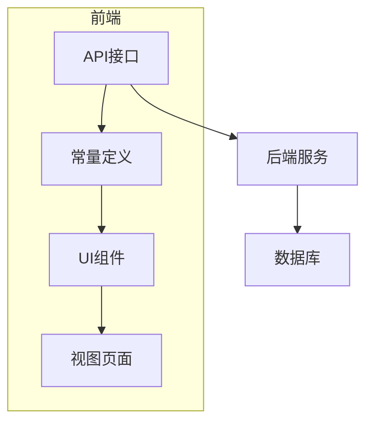
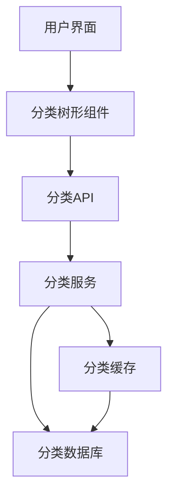
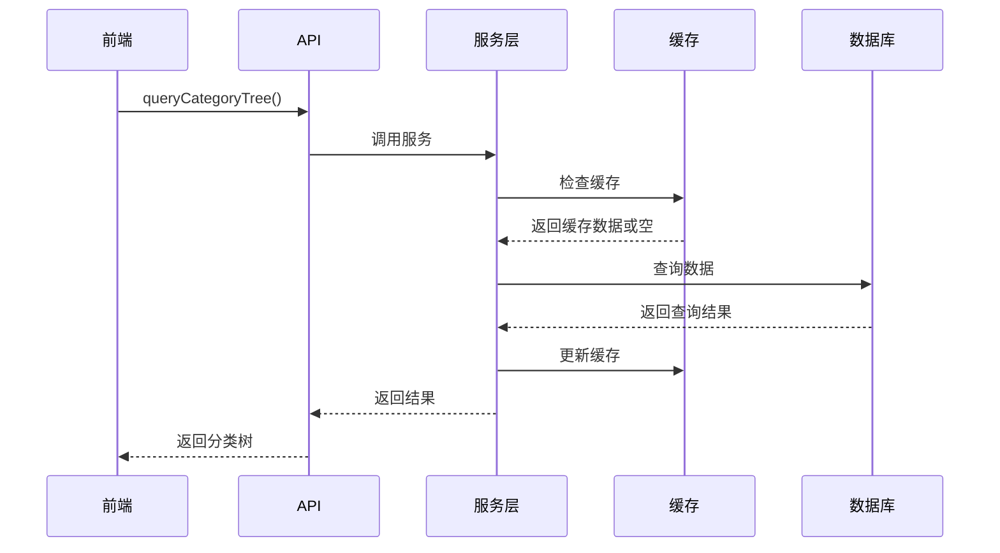
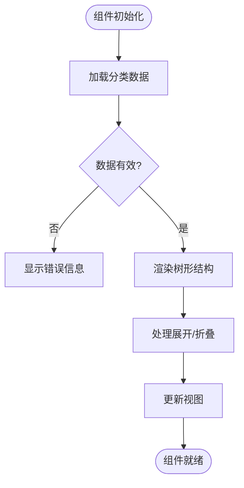
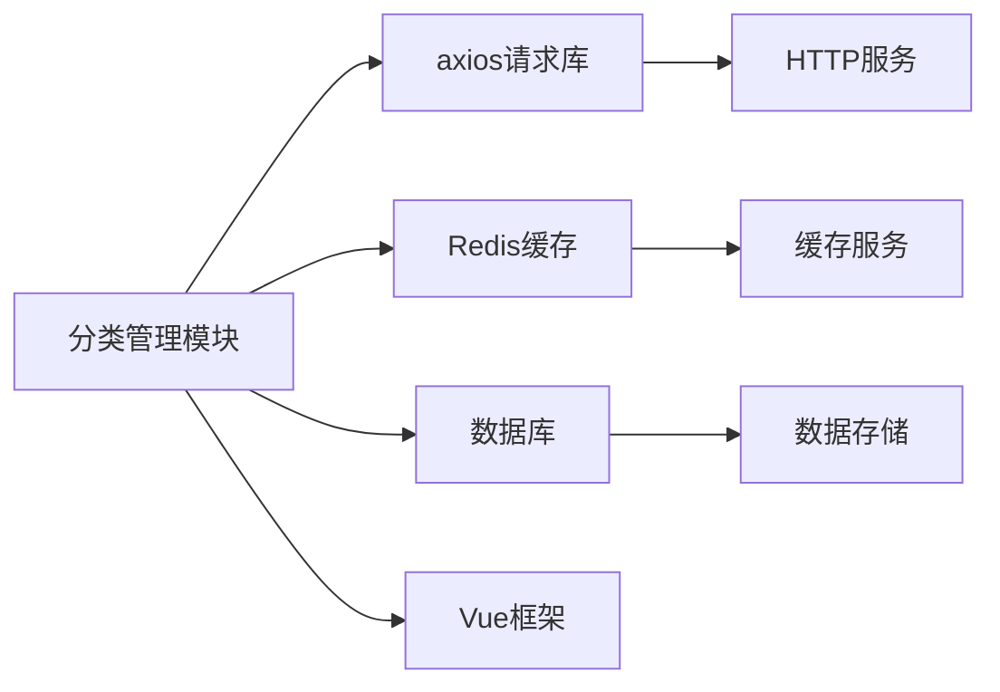

# 分类管理模块

<cite>
**本文档引用的文件**  
- [category-const.js](file://smart-admin-web-javascript\src\constants\business\erp\category-const.js)
- [category-api.js](file://smart-admin-web-javascript\src\api\business\category\category-api.js)
- [category-tree-table.vue](file://smart-admin-web-javascript\src\views\business\erp\catalog\components\category-tree-table.vue)
- [goods-catalog.vue](file://smart-admin-web-javascript\src\views\business\erp\catalog\goods-catalog.vue)
- [custom-catalog.vue](file://smart-admin-web-javascript\src\views\business\erp\catalog\custom-catalog.vue)
- [02-餐别分类体系重构设计.md](file://documentation\03-业务模块\消费\02-餐别分类体系重构设计.md)
</cite>

## 目录
1. [简介](#简介)
2. [项目结构](#项目结构)
3. [核心组件](#核心组件)
4. [架构概述](#架构概述)
5. [详细组件分析](#详细组件分析)
6. [依赖分析](#依赖分析)
7. [性能考虑](#性能考虑)
8. [故障排除指南](#故障排除指南)
9. [结论](#结论)

## 简介
分类管理模块是系统中用于组织和管理各类业务数据分类的核心功能模块。该模块通过树形结构设计实现了灵活的分类体系，支持商品、演示等多种分类类型，并通过缓存机制显著提升了数据访问性能。本技术文档全面介绍分类实体的树形结构设计、分类类型枚举的逻辑、缓存管理器的实现机制以及分类服务的构建与维护逻辑。

## 项目结构
分类管理模块主要分布在前端JavaScript项目中，包含API接口定义、常量定义、UI组件和视图页面。模块采用分层架构设计，前端通过API与后端服务交互，实现分类数据的增删改查和树形展示功能。



**图表来源**  
- [category-api.js](file://smart-admin-web-javascript\src\api\business\category\category-api.js)
- [category-const.js](file://smart-admin-web-javascript\src\constants\business\erp\category-const.js)

**章节来源**  
- [category-api.js](file://smart-admin-web-javascript\src\api\business\category\category-api.js)
- [category-const.js](file://smart-admin-web-javascript\src\constants\business\erp\category-const.js)

## 核心组件
分类管理模块的核心组件包括分类类型枚举（CATEGORY_TYPE_ENUM）、分类API接口（categoryApi）、分类树形表格组件（CategoryTreeTable）以及具体的分类视图页面。这些组件协同工作，实现了分类数据的完整生命周期管理。

**章节来源**  
- [category-const.js](file://smart-admin-web-javascript\src\constants\business\erp\category-const.js)
- [category-api.js](file://smart-admin-web-javascript\src\api\business\category\category-api.js)
- [category-tree-table.vue](file://smart-admin-web-javascript\src\views\business\erp\catalog\components\category-tree-table.vue)

## 架构概述
分类管理模块采用前后端分离架构，前端负责用户界面展示和交互，后端提供RESTful API服务。模块通过树形结构存储分类数据，支持无限层级的嵌套关系，同时利用缓存机制优化数据访问性能。



**图表来源**  
- [category-api.js](file://smart-admin-web-javascript\src\api\business\category\category-api.js)
- [02-餐别分类体系重构设计.md](file://documentation\03-业务模块\消费\02-餐别分类体系重构设计.md)

## 详细组件分析

### 分类类型枚举分析
分类类型枚举（CATEGORY_TYPE_ENUM）定义了系统中支持的不同分类类型，目前包括商品分类和演示分类两种类型。枚举设计具有良好的扩展性，便于未来添加新的分类类型。

```mermaid
classDiagram
class CATEGORY_TYPE_ENUM {
+GOODS : {value : 1, desc : '商品'}
+DEMO : {value : 2, desc : '演示分类'}
}
```

**图表来源**  
- [category-const.js](file://smart-admin-web-javascript\src\constants\business\erp\category-const.js)

**章节来源**  
- [category-const.js](file://smart-admin-web-javascript\src\constants\business\erp\category-const.js)

### 分类API接口分析
分类API接口提供了分类数据的增删改查操作，包括添加分类、删除分类、查询分类树和更新分类等核心功能。接口采用RESTful风格设计，通过HTTP方法区分不同操作类型。



**图表来源**  
- [category-api.js](file://smart-admin-web-javascript\src\api\business\category\category-api.js)
- [02-餐别分类体系重构设计.md](file://documentation\03-业务模块\消费\02-餐别分类体系重构设计.md)

**章节来源**  
- [category-api.js](file://smart-admin-web-javascript\src\api\business\category\category-api.js)

### 分类树形组件分析
分类树形表格组件（CategoryTreeTable）负责展示分类数据的树形结构，支持展开/折叠操作，提供直观的层级关系展示。组件通过props接收分类类型参数，可复用于不同类型的分类管理场景。



**图表来源**  
- [category-tree-table.vue](file://smart-admin-web-javascript\src\views\business\erp\catalog\components\category-tree-table.vue)

**章节来源**  
- [category-tree-table.vue](file://smart-admin-web-javascript\src\views\business\erp\catalog\components\category-tree-table.vue)

## 依赖分析
分类管理模块依赖于多个系统组件，包括API请求库、缓存服务、数据库服务等。模块通过清晰的依赖关系管理，确保了系统的稳定性和可维护性。



**图表来源**  
- [category-api.js](file://smart-admin-web-javascript\src\api\business\category\category-api.js)
- [02-餐别分类体系重构设计.md](file://documentation\03-业务模块\消费\02-餐别分类体系重构设计.md)

**章节来源**  
- [category-api.js](file://smart-admin-web-javascript\src\api\business\category\category-api.js)
- [02-餐别分类体系重构设计.md](file://documentation\03-业务模块\消费\02-餐别分类体系重构设计.md)

## 性能考虑
分类管理模块通过多级缓存机制显著提升了数据访问性能。系统采用本地缓存+Redis缓存的双层缓存架构，有效减少了数据库访问压力。缓存预热机制确保系统启动后能快速提供服务。

**章节来源**  
- [02-餐别分类体系重构设计.md](file://documentation\03-业务模块\消费\02-餐别分类体系重构设计.md)

## 故障排除指南
当分类数据展示异常时，可按照以下步骤进行排查：检查API接口是否正常响应、验证缓存数据是否正确、确认数据库连接状态、检查前端组件参数传递是否正确。

**章节来源**  
- [category-api.js](file://smart-admin-web-javascript\src\api\business\category\category-api.js)
- [category-tree-table.vue](file://smart-admin-web-javascript\src\views\business\erp\catalog\components\category-tree-table.vue)

## 结论
分类管理模块通过合理的架构设计和高效的缓存机制，实现了灵活、高性能的分类数据管理功能。模块具有良好的扩展性和可维护性，能够满足系统当前和未来的业务需求。