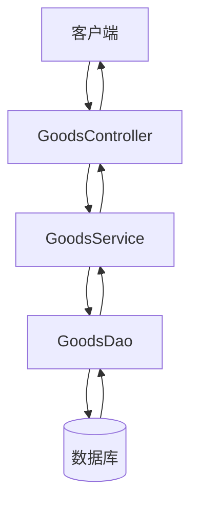
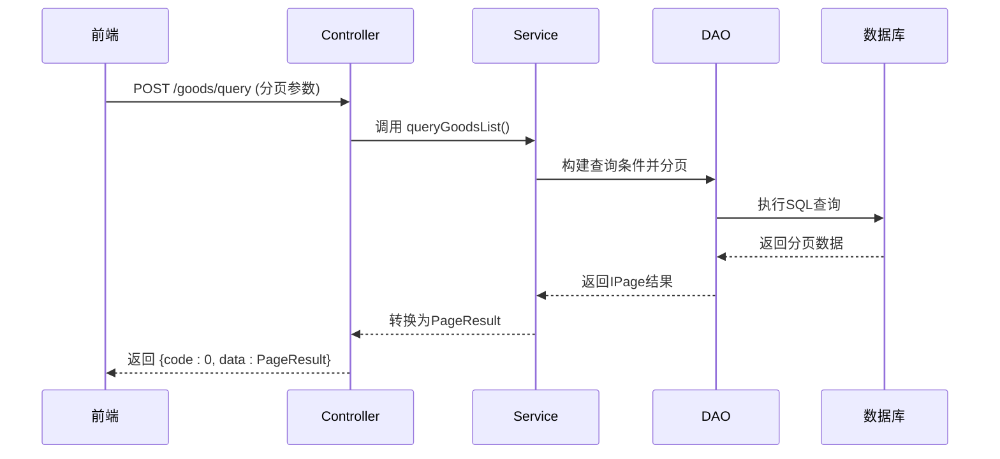
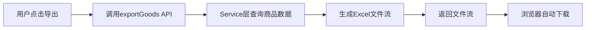
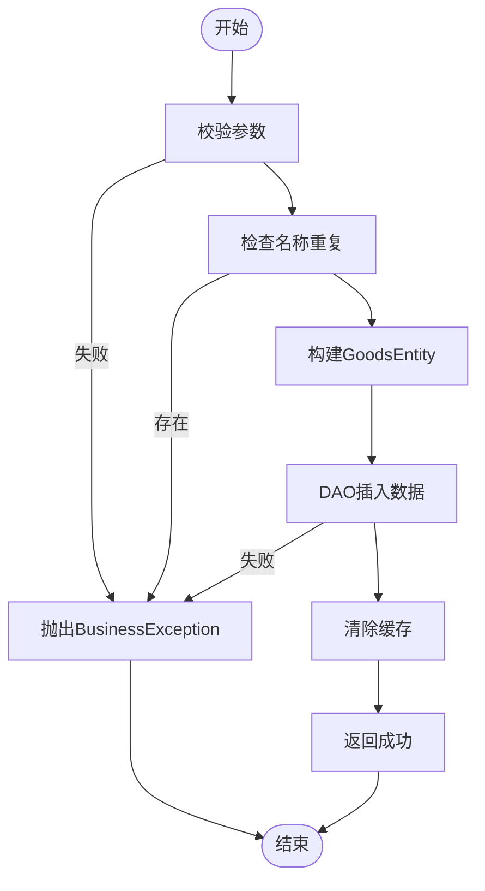

# 商品管理模块

<cite>
**本文档引用文件**  
- [goods-api.js](file://smart-admin-web-javascript/src/api/business/goods/goods-api.js)
- [goods-const.js](file://smart-admin-web-javascript/src/constants/business/erp/goods-const.js)
- [goods-list.vue](file://smart-admin-web-javascript/src/views/business/erp/goods/goods-list.vue)
- [goods-form-modal.vue](file://smart-admin-web-javascript/src/views/business/erp/goods/components/goods-form-modal.vue)
- [Service模板.md](file://documentation/06-模板工具/代码模板/Service模板.md)
- [DAO模板.md](file://documentation/06-模板工具/代码模板/DAO模板.md)
- [API路径规范.md](file://documentation/01-核心规范/API路径规范.md)
- [权限命名规范.md](file://documentation/01-核心规范/权限命名规范.md)
</cite>

## 目录

1. [引言](#引言)  
2. [商品实体与状态设计](#商品实体与状态设计)  
3. [增删改查操作实现](#增删改查操作实现)  
4. [分页查询实现](#分页查询实现)  
5. [导入导出功能实现](#导入导出功能实现)  
6. [RESTful API 设计规范](#restful-api-设计规范)  
7. [业务逻辑与事务管理](#业务逻辑与事务管理)  
8. [缓存策略与数据验证](#缓存策略与数据验证)  
9. [代码流程示例](#代码流程示例)  
10. [结论](#结论)

## 引言

商品管理模块是企业资源规划（ERP）系统中的核心功能之一，负责商品信息的全生命周期管理。本技术文档深入解析商品实体（GoodsEntity）的设计、商品状态枚举（GoodsStatusEnum）的定义及其在业务流程中的作用，详细说明商品的增删改查操作在Controller、Service、DAO各层的实现逻辑，特别是商品查询分页、导入导出功能的实现细节。同时阐述GoodsController中RESTful API的设计规范，包括请求路径、参数校验、异常处理和响应格式，并结合GoodsService中的业务逻辑，解释事务管理、缓存策略和数据验证的具体实现。

**Section sources**  
- [API路径规范.md](file://documentation/01-核心规范/API路径规范.md#L155)
- [权限命名规范.md](file://documentation/01-核心规范/权限命名规范.md#L131)

## 商品实体与状态设计

商品实体（GoodsEntity）是商品管理模块的核心数据结构，包含商品的基本信息、状态、价格、库存等关键属性。其设计遵循数据库规范化原则，确保数据一致性与完整性。

商品状态通过枚举类型 `GoodsStatusEnum` 进行定义，明确商品在不同业务阶段的状态流转。该枚举在前端和后端均被引用，保证状态值的一致性。

```javascript
export const GOODS_STATUS_ENUM = {
  APPOINTMENT: { value: 1, desc: '预约中' },
  SELL: { value: 2, desc: '售卖中' },
  SELL_OUT: { value: 3, desc: '售罄' }
};
```

状态流转逻辑如下：
- **预约中**：商品尚未正式上架，仅对特定用户可见。
- **售卖中**：商品已上架，可被正常购买。
- **售罄**：商品库存为零，停止销售。

此状态设计支持业务规则的动态调整，如自动状态变更（库存归零时自动转为“售罄”）和权限控制（仅管理员可修改状态）。

**Section sources**  
- [goods-const.js](file://smart-admin-web-javascript/src/constants/business/erp/goods-const.js#L10-L23)

## 增删改查操作实现

商品的增删改查（CRUD）操作遵循典型的三层架构模式：Controller → Service → DAO。

### Controller 层
接收HTTP请求，进行参数校验，调用Service层方法，并返回标准化响应。

### Service 层
实现核心业务逻辑，包括：
- 参数合法性验证
- 业务规则检查（如状态变更合法性）
- 事务管理
- 缓存更新

### DAO 层
负责与数据库交互，执行具体的增删改查操作，使用MyBatis-Plus框架简化SQL操作。



**Diagram sources**  
- [Service模板.md](file://documentation/06-模板工具/代码模板/Service模板.md#L50)
- [DAO模板.md](file://documentation/06-模板工具/代码模板/DAO模板.md#L280)

**Section sources**  
- [Service模板.md](file://documentation/06-模板工具/代码模板/Service模板.md#L50-L352)
- [DAO模板.md](file://documentation/06-模板工具/代码模板/DAO模板.md#L280-L480)

## 分页查询实现

商品分页查询通过POST请求实现，支持复杂条件筛选。前端传递分页参数（页码、页大小）和查询条件，后端返回分页结果。

### 实现要点：
- 使用 `PageResult` 封装分页数据，包含列表、总记录数、当前页等信息。
- 查询条件通过 `GoodsQueryForm` 对象传递，支持名称模糊查询、状态精确匹配、时间范围筛选等。
- 使用MyBatis-Plus的 `LambdaQueryWrapper` 构建动态查询条件，避免SQL注入。
- 默认按创建时间倒序排列。



**Diagram sources**  
- [goods-api.js](file://smart-admin-web-javascript/src/api/business/goods/goods-api.js#L24)
- [Service模板.md](file://documentation/06-模板工具/代码模板/Service模板.md#L189)

**Section sources**  
- [goods-api.js](file://smart-admin-web-javascript/src/api/business/goods/goods-api.js#L24)
- [Service模板.md](file://documentation/06-模板工具/代码模板/Service模板.md#L189-L206)

## 导入导出功能实现

商品导入导出功能支持批量数据操作，提升管理效率。

### 导入功能
- 前端通过文件上传组件选择Excel文件。
- 调用 `/goods/importGoods` 接口，后端接收文件流。
- 使用POI或EasyExcel解析Excel数据，逐行校验并插入数据库。
- 支持事务回滚，确保数据一致性。
- 返回导入结果（成功/失败数量、错误详情）。

### 导出功能
- 前端调用 `/goods/exportGoods` 接口。
- 后端查询符合条件的商品数据。
- 使用Excel模板生成文件流。
- 通过 `getDownload` 返回文件流，触发浏览器下载。



**Diagram sources**  
- [goods-api.js](file://smart-admin-web-javascript/src/api/business/goods/goods-api.js#L37)
- [Service模板.md](file://documentation/06-模板工具/代码模板/Service模板.md#L214)

**Section sources**  
- [goods-api.js](file://smart-admin-web-javascript/src/api/business/goods/goods-api.js#L32-L40)

## RESTful API 设计规范

商品管理模块的API遵循RESTful设计原则，使用标准HTTP方法和语义化路径。

| 操作 | HTTP方法 | 路径 | 说明 |
|------|----------|------|------|
| 查询商品 | POST | `/goods/query` | 支持复杂条件分页查询 |
| 新增商品 | POST | `/goods/add` | 创建新商品 |
| 更新商品 | POST | `/goods/update` | 修改商品信息 |
| 删除商品 | GET | `/goods/delete/{id}` | 软删除商品 |
| 批量删除 | POST | `/goods/batchDelete` | 批量软删除 |
| 导入商品 | POST | `/goods/importGoods` | 上传文件导入 |
| 导出商品 | GET | `/goods/exportGoods` | 下载商品数据 |

### 请求与响应规范
- **请求体**：使用JSON格式，包含业务参数。
- **响应体**：统一使用 `ResponseDTO` 封装，包含 `code`、`msg`、`data` 字段。
- **异常处理**：全局异常处理器捕获业务异常，返回标准化错误信息。
- **权限校验**：通过注解 `@RequiresPermissions("business:goods:add")` 控制接口访问权限。

**Section sources**  
- [API路径规范.md](file://documentation/01-核心规范/API路径规范.md#L155)
- [权限命名规范.md](file://documentation/01-核心规范/权限命名规范.md#L131)

## 业务逻辑与事务管理

商品服务（GoodsService）是业务逻辑的核心，确保操作的原子性和一致性。

### 事务管理
- 使用 `@Transactional(rollbackFor = Exception.class)` 注解声明事务。
- 在新增、更新、删除等操作中开启事务，确保数据库操作的ACID特性。
- 当发生异常时自动回滚，防止数据不一致。

### 业务规则示例
- **新增商品**：校验商品名称唯一性，防止重复。
- **状态变更**：检查当前状态是否允许变更（如“售罄”不可变更为“预约中”）。
- **删除检查**：检查商品是否有关联订单，若有则禁止删除。



**Diagram sources**  
- [Service模板.md](file://documentation/06-模板工具/代码模板/Service模板.md#L62)
- [DAO模板.md](file://documentation/06-模板工具/代码模板/DAO模板.md#L280)

**Section sources**  
- [Service模板.md](file://documentation/06-模板工具/代码模板/Service模板.md#L62-L88)

## 缓存策略与数据验证

### 缓存策略
- 使用Redis缓存高频访问的商品数据（如商品详情）。
- 在Service层通过 `GoodsManager` 管理缓存，新增、更新、删除操作后清除相关缓存。
- 缓存键采用 `goods:detail:{id}` 格式，确保唯一性。

### 数据验证
- **前端验证**：使用Vue组件规则校验必填项、格式等。
- **后端验证**：在Service层进行深度校验，包括：
  - 参数非空检查
  - 字段长度限制
  - 业务逻辑验证（如价格必须大于0）
  - 枚举值合法性校验

通过双重验证机制，确保数据的准确性和安全性。

**Section sources**  
- [Service模板.md](file://documentation/06-模板工具/代码模板/Service模板.md#L240)
- [goods-const.js](file://smart-admin-web-javascript/src/constants/business/erp/goods-const.js#L10)

## 代码流程示例

### 商品创建流程
1. 前端打开“新增商品”模态框。
2. 用户填写表单并提交。
3. 调用 `addGoods` API，发送商品信息。
4. 后端Service层校验数据，检查名称唯一性。
5. 构建 `GoodsEntity` 并插入数据库。
6. 清除商品列表缓存。
7. 返回成功响应，前端刷新列表。

### 状态变更流程
1. 用户在商品列表点击“修改状态”。
2. 选择新状态（如“售卖中”）。
3. 调用 `updateGoods` API。
4. Service层检查当前状态是否允许变更。
5. 更新数据库记录。
6. 更新缓存。
7. 记录操作日志。

### 批量导入流程
1. 用户下载Excel模板。
2. 填写商品数据并上传。
3. 后端接收文件，解析每一行。
4. 对每条数据进行校验（名称、价格、状态等）。
5. 批量插入数据库（事务内）。
6. 返回导入结果报告。

**Section sources**  
- [goods-api.js](file://smart-admin-web-javascript/src/api/business/goods/goods-api.js#L12)
- [Service模板.md](file://documentation/06-模板工具/代码模板/Service模板.md#L62)

## 结论

商品管理模块通过清晰的分层架构、规范的API设计和严谨的业务逻辑，实现了商品信息的高效管理。商品实体与状态枚举的设计支持灵活的业务扩展，分页查询和导入导出功能提升了用户体验。事务管理和缓存策略确保了系统的稳定性和性能。该模块的设计模式可复用于其他业务实体的管理，具有良好的可维护性和可扩展性。