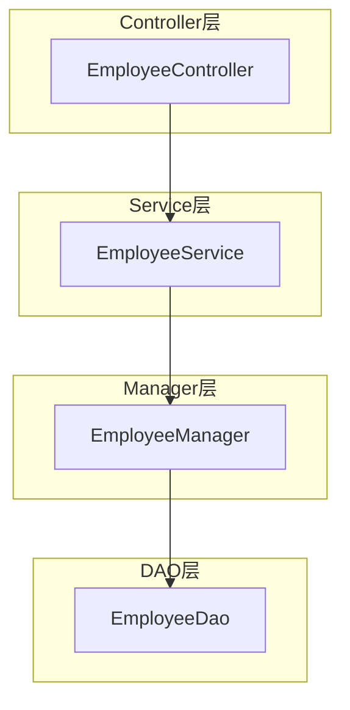
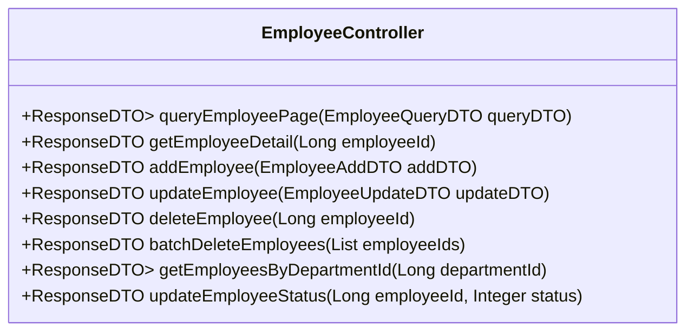
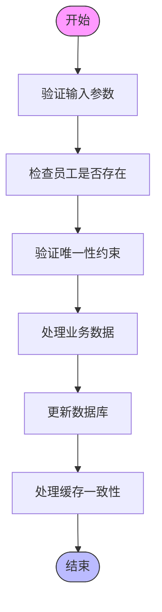
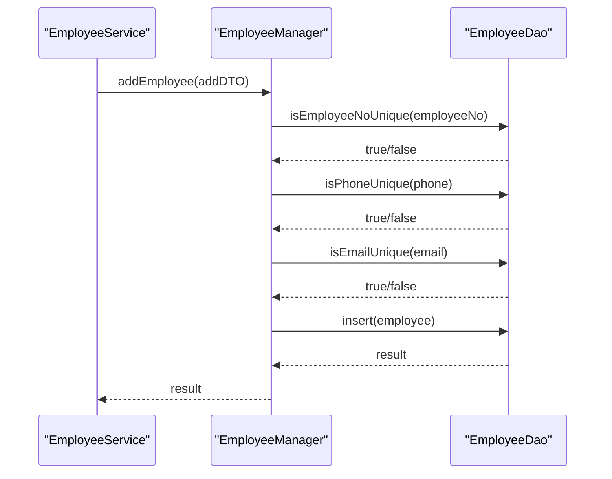
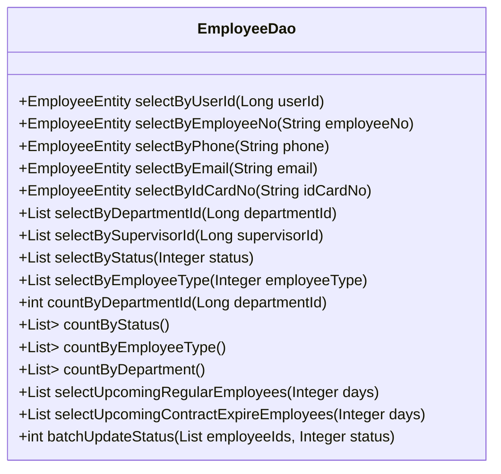
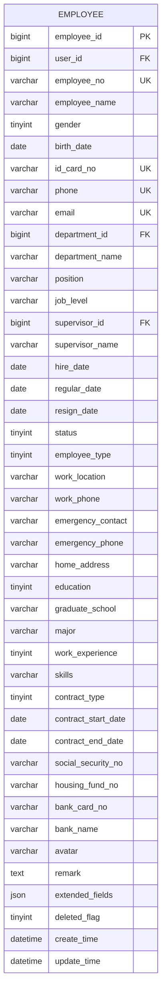
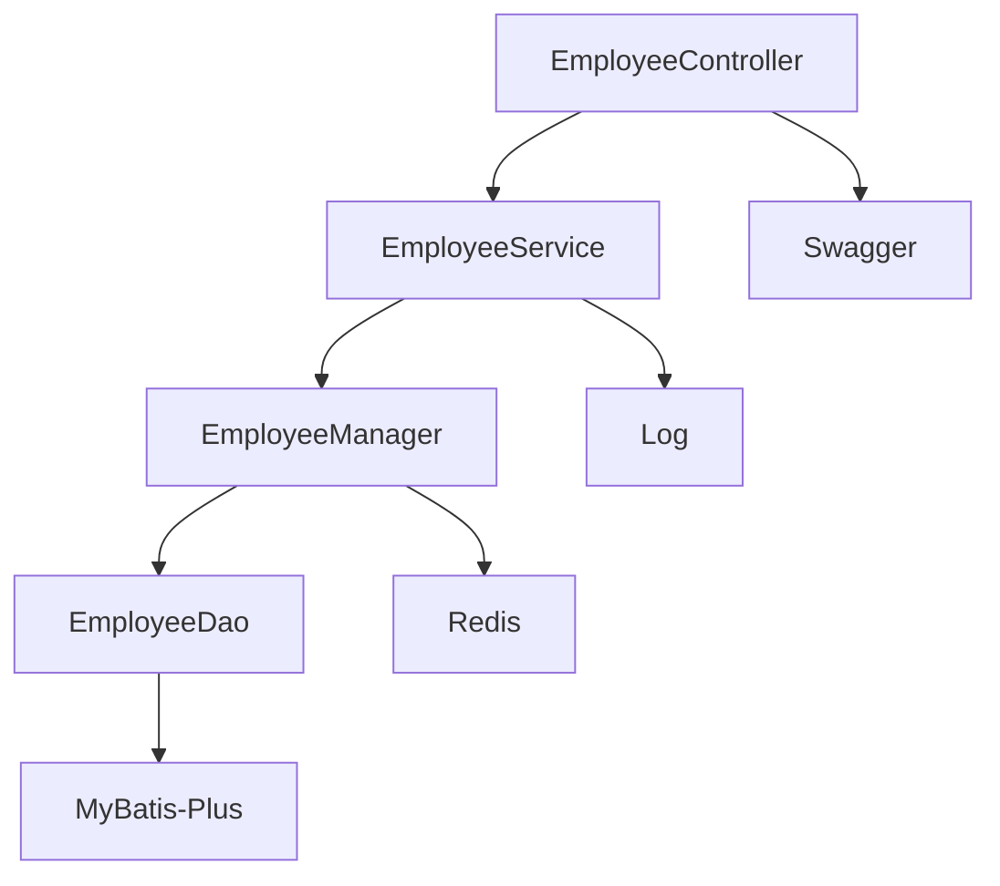

# 员工管理

<cite>
**本文档引用文件**  
- [EmployeeController.java](file://microservices\ioedream-common-service\src\main\java\net\lab1024\sa\common\system\employee\controller\EmployeeController.java)
- [EmployeeServiceImpl.java](file://microservices\ioedream-common-service\src\main\java\net\lab1024\sa\common\system\employee\service\impl\EmployeeServiceImpl.java)
- [EmployeeManager.java](file://microservices\microservices-common-business\src\main\java\net\lab1024\sa\common\system\employee\manager\EmployeeManager.java)
- [EmployeeDao.java](file://microservices\microservices-common-business\src\main\java\net\lab1024\sa\common\system\employee\dao\EmployeeDao.java)
- [EmployeeEntity.java](file://microservices\microservices-common-business\src\main\java\net\lab1024\sa\common\system\employee\domain\entity\EmployeeEntity.java)
- [EmployeeAddDTO.java](file://microservices\microservices-common-business\src\main\java\net\lab1024\sa\common\system\employee\domain\dto\EmployeeAddDTO.java)
- [EmployeeUpdateDTO.java](file://microservices\microservices-common-business\src\main\java\net\lab1024\sa\common\system\employee\domain\dto\EmployeeUpdateDTO.java)
- [EmployeeQueryDTO.java](file://microservices\microservices-common-business\src\main\java\net\lab1024\sa\common\system\employee\domain\dto\EmployeeQueryDTO.java)
- [EmployeeVO.java](file://microservices\microservices-common-business\src\main\java\net\lab1024\sa\common\system\employee\domain\vo\EmployeeVO.java)
</cite>

## 目录
1. [简介](#简介)
2. [项目结构](#项目结构)
3. [核心组件](#核心组件)
4. [架构概览](#架构概览)
5. [详细组件分析](#详细组件分析)
6. [依赖分析](#依赖分析)
7. [性能考虑](#性能考虑)
8. [故障排除指南](#故障排除指南)
9. [结论](#结论)

## 简介
本文档详细解析智能管理系统中的员工管理模块，涵盖员工信息的增删改查、状态管理、部门关联、岗位分配等核心功能的实现机制。文档阐述了Controller层如何处理RESTful API请求，Service层如何实现业务逻辑与权限校验，Manager层如何管理缓存一致性，DAO层如何通过MyBatis-Plus进行数据库操作。同时，详细说明了员工登录信息与权限的集成方式，以及与角色、部门模块的关联关系。

## 项目结构
员工管理模块采用微服务架构，代码分布在多个模块中。主要结构如下：
- `ioedream-common-service`：包含Controller和Service实现
- `microservices-common-business`：包含DAO、Manager、Entity、DTO、VO等业务组件
- 模块间通过清晰的分层和接口定义实现解耦

**代码结构来源**
- [EmployeeController.java](file://microservices\ioedream-common-service\src\main\java\net\lab1024\sa\common\system\employee\controller\EmployeeController.java)
- [EmployeeServiceImpl.java](file://microservices\ioedream-common-service\src\main\java\net\lab1024\sa\common\system\employee\service\impl\EmployeeServiceImpl.java)

## 核心组件
员工管理模块的核心组件包括Controller、Service、Manager、DAO四层，以及Entity、DTO、VO等数据传输对象。各组件职责分明，共同完成员工管理的各项功能。

**核心组件来源**
- [EmployeeController.java](file://microservices\ioedream-common-service\src\main\java\net\lab1024\sa\common\system\employee\controller\EmployeeController.java)
- [EmployeeServiceImpl.java](file://microservices\ioedream-common-service\src\main\java\net\lab1024\sa\common\system\employee\service\impl\EmployeeServiceImpl.java)
- [EmployeeManager.java](file://microservices\microservices-common-business\src\main\java\net\lab1024\sa\common\system\employee\manager\EmployeeManager.java)
- [EmployeeDao.java](file://microservices\microservices-common-business\src\main\java\net\lab1024\sa\common\system\employee\dao\EmployeeDao.java)

## 架构概览
员工管理模块采用典型的分层架构，从上到下分为Controller层、Service层、Manager层和DAO层。各层之间通过接口进行通信，确保了代码的可维护性和可测试性。

**图表来源**
- [EmployeeController.java](file://microservices\ioedream-common-service\src\main\java\net\lab1024\sa\common\system\employee\controller\EmployeeController.java)
- [EmployeeServiceImpl.java](file://microservices\ioedream-common-service\src\main\java\net\lab1024\sa\common\system\employee\service\impl\EmployeeServiceImpl.java)
- [EmployeeManager.java](file://microservices\microservices-common-business\src\main\java\net\lab1024\sa\common\system\employee\manager\EmployeeManager.java)
- [EmployeeDao.java](file://microservices\microservices-common-business\src\main\java\net\lab1024\sa\common\system\employee\dao\EmployeeDao.java)

## 详细组件分析

### Controller层分析
Controller层负责处理RESTful API请求，是系统与外部交互的入口。EmployeeController提供了员工管理的所有API接口，包括增删改查、状态变更等。

#### API接口设计

**图表来源**
- [EmployeeController.java](file://microservices\ioedream-common-service\src\main\java\net\lab1024\sa\common\system\employee\controller\EmployeeController.java)

**组件来源**
- [EmployeeController.java](file://microservices\ioedream-common-service\src\main\java\net\lab1024\sa\common\system\employee\controller\EmployeeController.java)

### Service层分析
Service层负责实现核心业务逻辑，是系统的大脑。EmployeeServiceImpl实现了员工管理的所有业务规则，包括数据验证、事务管理等。

#### 业务逻辑流程

**图表来源**
- [EmployeeServiceImpl.java](file://microservices\ioedream-common-service\src\main\java\net\lab1024\sa\common\system\employee\service\impl\EmployeeServiceImpl.java)

**组件来源**
- [EmployeeServiceImpl.java](file://microservices\ioedream-common-service\src\main\java\net\lab1024\sa\common\system\employee\service\impl\EmployeeServiceImpl.java)

### Manager层分析
Manager层负责复杂的业务流程编排和多DAO数据组装，是系统的核心协调者。EmployeeManager提供了员工管理的各种复杂查询和计算功能。

#### 缓存一致性管理

**图表来源**
- [EmployeeManager.java](file://microservices\microservices-common-business\src\main\java\net\lab1024\sa\common\system\employee\manager\EmployeeManager.java)
- [EmployeeDao.java](file://microservices\microservices-common-business\src\main\java\net\lab1024\sa\common\system\employee\dao\EmployeeDao.java)

**组件来源**
- [EmployeeManager.java](file://microservices\microservices-common-business\src\main\java\net\lab1024\sa\common\system\employee\manager\EmployeeManager.java)

### DAO层分析
DAO层负责与数据库交互，是系统与数据存储的桥梁。EmployeeDao基于MyBatis-Plus实现，提供了丰富的数据库操作方法。

#### 数据库操作

**图表来源**
- [EmployeeDao.java](file://microservices\microservices-common-business\src\main\java\net\lab1024\sa\common\system\employee\dao\EmployeeDao.java)

**组件来源**
- [EmployeeDao.java](file://microservices\microservices-common-business\src\main\java\net\lab1024\sa\common\system\employee\dao\EmployeeDao.java)

### 数据模型分析
员工管理模块的数据模型设计合理，涵盖了员工档案的各个方面。

#### 数据表结构

**图表来源**
- [EmployeeEntity.java](file://microservices\microservices-common-business\src\main\java\net\lab1024\sa\common\system\employee\domain\entity\EmployeeEntity.java)

**组件来源**
- [EmployeeEntity.java](file://microservices\microservices-common-business\src\main\java\net\lab1024\sa\common\system\employee\domain\entity\EmployeeEntity.java)

## 依赖分析
员工管理模块与其他模块存在明确的依赖关系，确保了系统的模块化和可维护性。

**图表来源**
- [EmployeeController.java](file://microservices\ioedream-common-service\src\main\java\net\lab1024\sa\common\system\employee\controller\EmployeeController.java)
- [EmployeeServiceImpl.java](file://microservices\ioedream-common-service\src\main\java\net\lab1024\sa\common\system\employee\service\impl\EmployeeServiceImpl.java)
- [EmployeeManager.java](file://microservices\microservices-common-business\src\main\java\net\lab1024\sa\common\system\employee\manager\EmployeeManager.java)
- [EmployeeDao.java](file://microservices\microservices-common-business\src\main\java\net\lab1024\sa\common\system\employee\dao\EmployeeDao.java)

**依赖来源**
- [EmployeeController.java](file://microservices\ioedream-common-service\src\main\java\net\lab1024\sa\common\system\employee\controller\EmployeeController.java)
- [EmployeeServiceImpl.java](file://microservices\ioedream-common-service\src\main\java\net\lab1024\sa\common\system\employee\service\impl\EmployeeServiceImpl.java)
- [EmployeeManager.java](file://microservices\microservices-common-business\src\main\java\net\lab1024\sa\common\system\employee\manager\EmployeeManager.java)
- [EmployeeDao.java](file://microservices\microservices-common-business\src\main\java\net\lab1024\sa\common\system\employee\dao\EmployeeDao.java)

## 性能考虑
员工管理模块在设计时充分考虑了性能因素，通过多种方式优化系统性能。

1. **缓存机制**：使用Redis缓存频繁访问的数据，减少数据库压力
2. **分页查询**：所有列表查询均支持分页，避免一次性加载大量数据
3. **索引优化**：在常用查询字段上建立索引，提高查询效率
4. **批量操作**：支持批量删除、批量更新等操作，减少网络开销
5. **连接池**：使用数据库连接池，提高数据库连接的复用率

## 故障排除指南
在使用员工管理模块时，可能会遇到一些常见问题，以下是故障排除指南。

### 常见问题及解决方案
| 问题现象 | 可能原因 | 解决方案 |
|---------|--------|---------|
| 新增员工失败 | 工号、手机号、邮箱重复 | 检查输入信息的唯一性 |
| 更新员工信息失败 | 员工不存在或已删除 | 确认员工ID是否正确 |
| 查询员工列表为空 | 查询条件过于严格 | 放宽查询条件或检查数据 |
| 状态变更失败 | 状态值无效 | 检查状态值是否在有效范围内 |
| 部门关联失败 | 部门不存在 | 确认部门ID是否正确 |

**故障排除来源**
- [EmployeeServiceImpl.java](file://microservices\ioedream-common-service\src\main\java\net\lab1024\sa\common\system\employee\service\impl\EmployeeServiceImpl.java)
- [EmployeeManager.java](file://microservices\microservices-common-business\src\main\java\net\lab1024\sa\common\system\employee\manager\EmployeeManager.java)

## 结论
员工管理模块设计合理，实现了员工信息的全生命周期管理。通过清晰的分层架构和规范的代码实现，确保了系统的可维护性和可扩展性。模块提供了丰富的API接口，支持各种复杂的业务场景，能够满足企业对员工管理的需求。