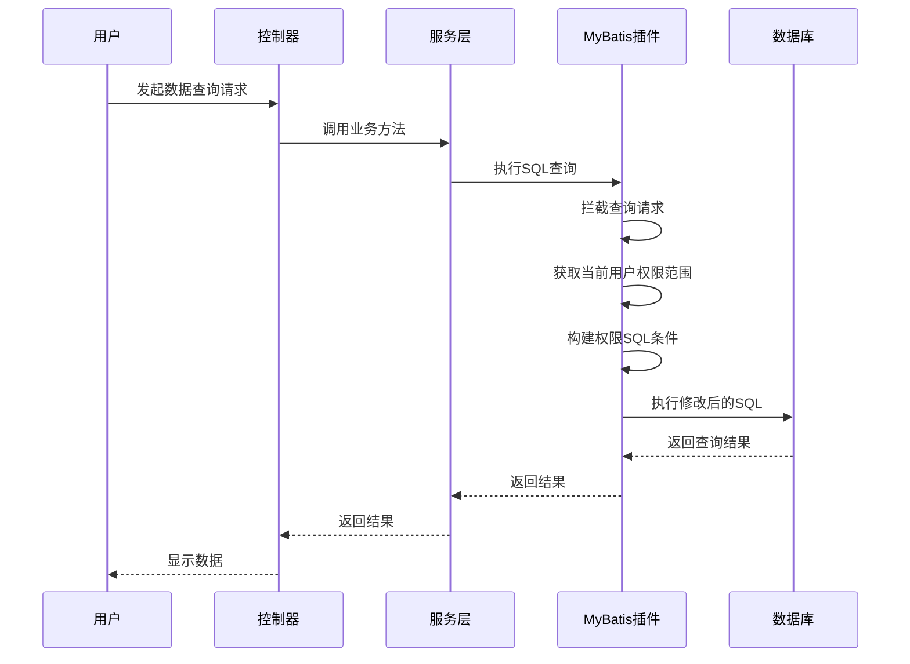

# 数据权限管理

<cite>
**本文档引用文件**  
- [smart-permission.md](file://documentation\technical\smart-permission.md)
- [DataPermissionInterceptor.java](file://documentation\technical\smart-permission.md#L903-L954)
- [DataPermissionService.java](file://documentation\technical\smart-permission.md#L920)
- [DataPermissionScope.java](file://documentation\technical\smart-permission.md#L935-L949)
</cite>

## 目录
1. [引言](#引言)
2. [数据权限级别定义](#数据权限级别定义)
3. [SQL规则配置服务](#sql规则配置服务)
4. [MyBatis插件实现机制](#mybatis插件实现机制)
5. [实际应用示例](#实际应用示例)
6. [配置方法](#配置方法)
7. [总结](#总结)

## 引言

数据权限管理模块是智能管理系统中的核心安全组件，通过基于MyBatis插件的动态SQL注入机制，实现了无侵入式的数据范围过滤功能。该模块允许系统根据用户角色自动限制其可访问的数据范围，如仅限本人、本部门或全部数据等场景。本文档将深入解析该机制的技术实现细节，包括权限级别的定义、SQL规则的配置方式、MyBatis插件的工作原理以及在员工和部门模块中的具体应用。

**Section sources**
- [smart-permission.md](file://documentation\technical\smart-permission.md#L1-L20)

## 数据权限级别定义

系统通过`DataScopeTypeEnum`枚举类型定义了多种数据权限级别，用于控制用户对数据的访问范围。这些级别包括但不限于：

- **本人（SELF）**：用户只能访问自己创建或相关的数据记录。
- **本部门（DEPARTMENT）**：用户可以访问其所在部门的所有数据。
- **全部（ALL）**：用户拥有最高权限，可访问系统中所有相关数据。

每个权限级别对应特定的SQL条件生成逻辑，确保在查询执行时能够自动添加相应的WHERE子句。例如，当用户具有“本部门”权限时，系统会在SQL查询中自动加入`AND department_id = ?`的条件，从而限制结果集仅包含该部门的数据。

这些权限级别不仅定义了数据访问的广度，还与角色管理体系紧密结合，确保权限分配的灵活性和安全性。

**Section sources**
- [smart-permission.md](file://documentation\technical\smart-permission.md#L935-L949)

## SQL规则配置服务

`DataScopeSqlConfigService`负责管理不同场景下的SQL规则配置。该服务通过读取预定义的配置项，为每种数据权限级别生成对应的SQL片段。配置内容通常存储在数据库或配置文件中，支持动态更新而无需重启服务。

该服务的核心功能包括：
- 根据权限类型获取对应的SQL模板
- 动态替换模板中的占位符（如用户ID、部门ID等）
- 缓存已生成的SQL规则以提升性能
- 支持多租户环境下的规则隔离

通过这种配置化的方式，系统能够在不修改业务代码的前提下，灵活调整数据权限策略，满足不同客户或业务场景的需求。

**Section sources**
- [smart-permission.md](file://documentation\technical\smart-permission.md#L920)

## MyBatis插件实现机制

MyBatis插件通过实现`InnerInterceptor`接口，在SQL执行前拦截查询请求，并动态修改SQL语句以添加数据权限条件。其工作流程如下：



**Diagram sources**
- [DataPermissionInterceptor.java](file://documentation\technical\smart-permission.md#L903-L954)

关键实现步骤包括：
1. 拦截`beforeQuery`方法，获取原始SQL和查询参数
2. 判断参数是否为`BaseQueryDTO`类型，以确定是否需要进行权限过滤
3. 获取当前用户的权限范围（如区域ID、设备ID等）
4. 调用`buildPermissionSql`方法构建包含权限条件的新SQL
5. 使用`setSql`方法替换原始SQL，完成动态注入

此机制完全透明于业务代码，实现了真正的无侵入式权限控制。

**Section sources**
- [DataPermissionInterceptor.java](file://documentation\technical\smart-permission.md#L903-L954)

## 实际应用示例

### 员工模块中的数据权限控制

在员工信息查询功能中，系统根据用户的角色自动应用不同的数据权限规则：

- 普通员工：只能查看自己的信息
- 部门主管：可查看本部门所有员工的信息
- 管理员：可查看全公司员工的信息

当部门主管查询员工列表时，系统会自动在SQL中添加`AND department_id = ?`条件，确保返回结果仅限于该主管所在部门的员工。

### 部门模块中的数据权限控制

在部门管理功能中，数据权限控制同样发挥作用：

- 用户只能编辑自己有权限管理的部门
- 查询部门列表时，自动过滤掉无权访问的部门
- 跨部门操作需经过特殊权限验证

这些控制通过统一的MyBatis插件实现，无需在每个业务方法中重复编写权限判断逻辑。

**Section sources**
- [smart-permission.md](file://documentation\technical\smart-permission.md#L935-L949)

## 配置方法

要启用数据权限管理功能，需进行以下配置：

1. **引入依赖**：确保项目中包含`smart-permission`模块的依赖
2. **启用插件**：在MyBatis配置中注册`DataPermissionInterceptor`
3. **配置权限规则**：在数据库或配置文件中定义各角色的数据权限级别
4. **设置数据范围字段**：明确指定哪些表的哪些字段用于权限过滤（如`department_id`、`creator_id`等）

示例配置代码：
```java
@Configuration
public class MyBatisConfig {
    @Bean
    public DataPermissionInterceptor dataPermissionInterceptor() {
        return new DataPermissionInterceptor();
    }
}
```

此外，还需在业务实体类中使用注解标记需要进行权限控制的字段，以便插件能够正确识别和处理。

**Section sources**
- [smart-permission.md](file://documentation\technical\smart-permission.md#L903-L954)

## 总结

数据权限管理模块通过MyBatis插件实现了高效、灵活且无侵入式的动态SQL注入机制。该机制基于`DataScopeTypeEnum`定义的权限级别，结合`DataScopeSqlConfigService`的规则配置，能够在运行时自动为SQL查询添加必要的WHERE条件，从而实现细粒度的数据范围控制。这一设计不仅提升了系统的安全性，也大大降低了开发和维护成本，为多角色、多层级的复杂业务场景提供了可靠的权限保障。