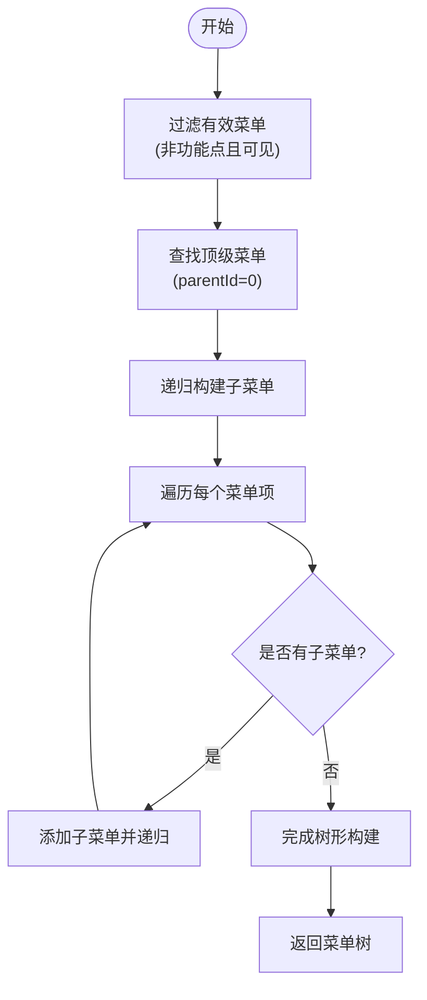
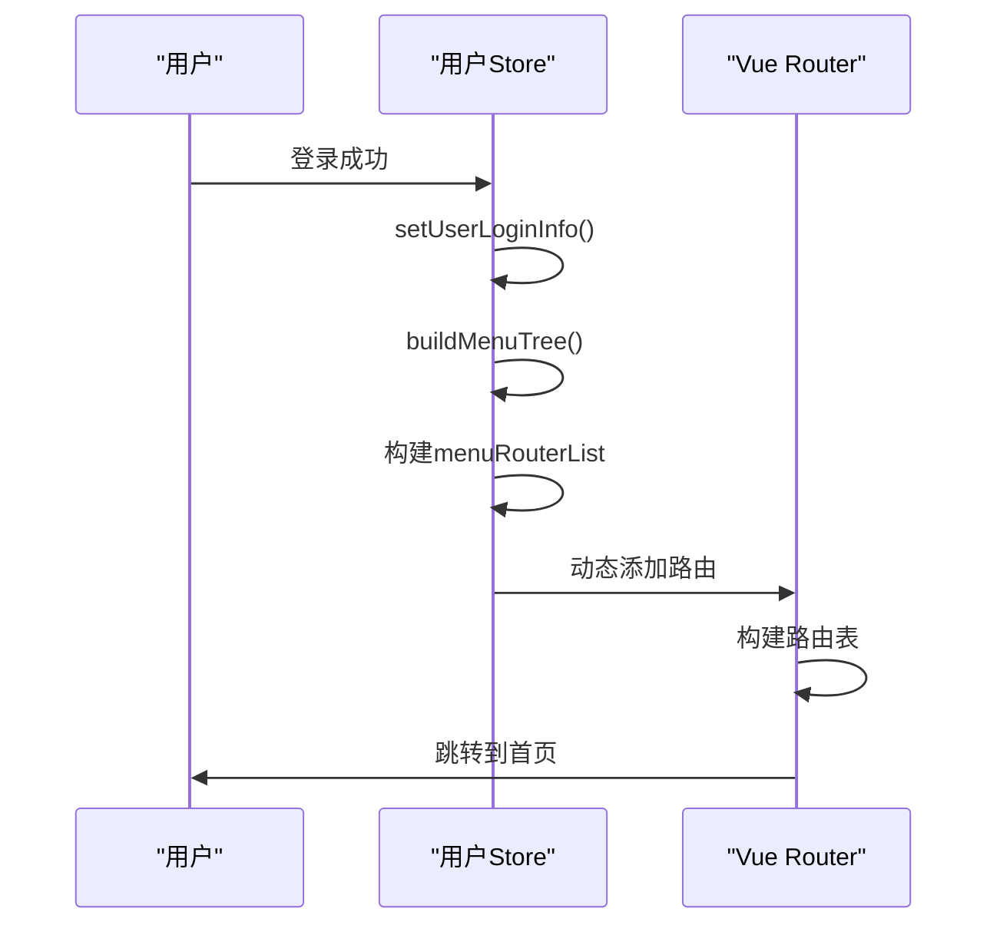
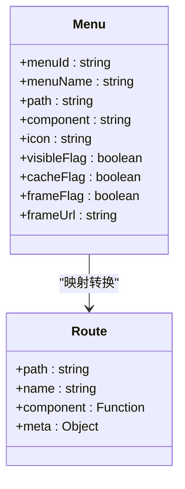
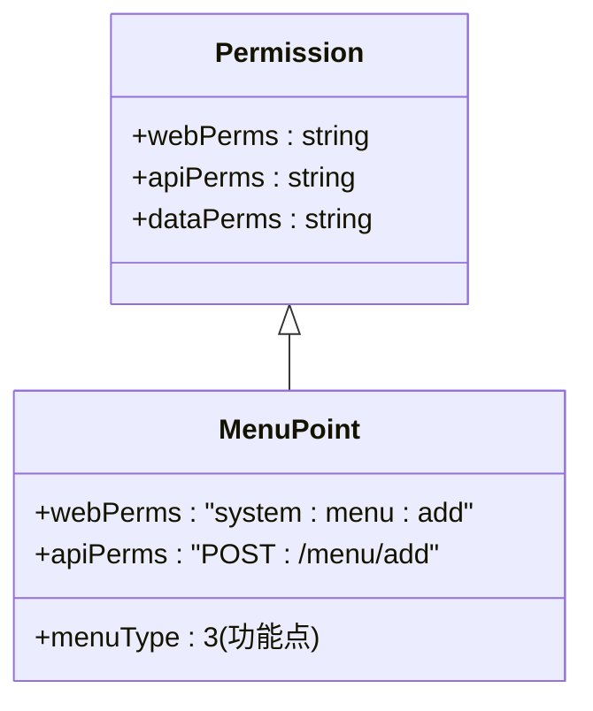
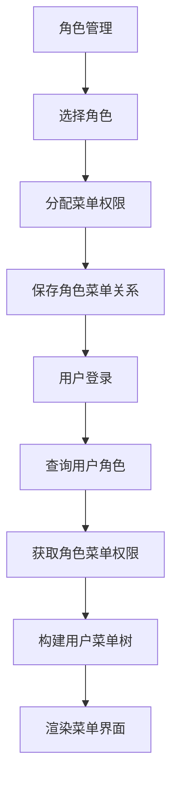
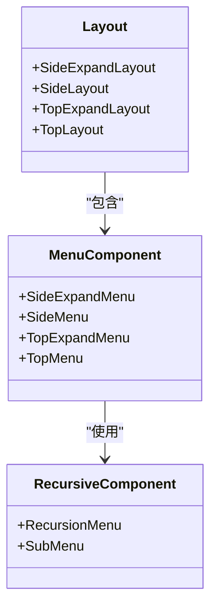
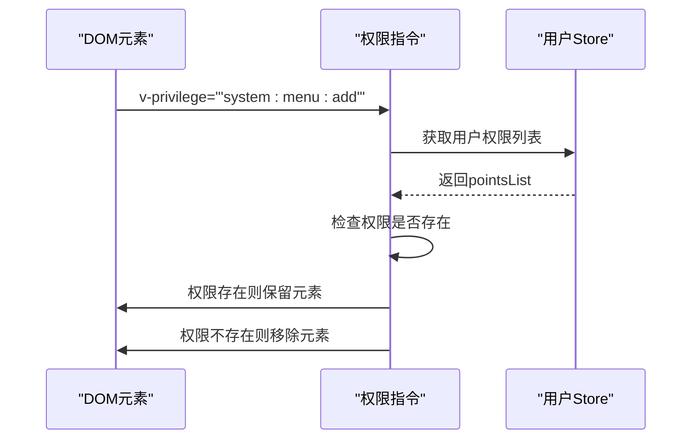
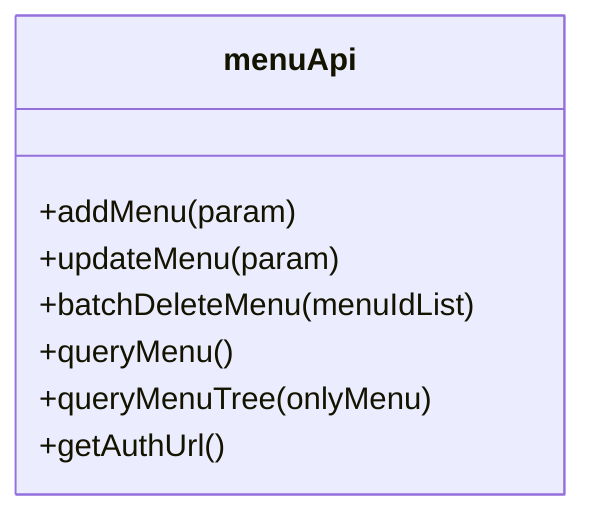

# 菜单管理

<cite>
**本文档引用的文件**
- [menu-api.js](file://smart-admin-web-javascript\src\api\system\menu-api.js)
- [menu-const.js](file://smart-admin-web-javascript\src\constants\system\menu-const.js)
- [privilege.js](file://smart-admin-web-javascript\src\directives\privilege.js)
- [privilege-plugin.js](file://smart-admin-web-javascript\src\plugins\privilege-plugin.js)
- [user.js](file://smart-admin-web-javascript\src\store\modules\system\user.js)
- [index.js](file://smart-admin-web-javascript\src\router\index.js)
- [routers.js](file://smart-admin-web-javascript\src\router\routers.js)
</cite>

## 目录
1. [简介](#简介)
2. [菜单数据结构与类型](#菜单数据结构与类型)
3. [菜单树形结构设计](#菜单树形结构设计)
4. [前端路由生成机制](#前端路由生成机制)
5. [权限标识（perms）管理](#权限标识perms管理)
6. [菜单与角色权限绑定](#菜单与角色权限绑定)
7. [前端菜单渲染方式](#前端菜单渲染方式)
8. [访问控制实现](#访问控制实现)
9. [接口调用示例](#接口调用示例)
10. [常见问题解决方案](#常见问题解决方案)

## 简介
本系统提供了一套完整的动态菜单管理解决方案，支持目录、菜单和按钮（功能点）三种类型的菜单项。系统通过树形结构组织菜单，结合权限框架实现精细化的访问控制。菜单配置支持动态调整，无需重启服务即可生效，为系统管理员提供了灵活的权限管理能力。

## 菜单数据结构与类型
系统定义了清晰的菜单数据结构和类型枚举，用于区分不同层级和功能的菜单项。

### 菜单类型定义
系统支持三种主要的菜单类型：

```mermaid
classDiagram
class MENU_TYPE_ENUM {
+CATALOG : {value : 1, desc : '目录'}
+MENU : {value : 2, desc : '菜单'}
+POINTS : {value : 3, desc : '功能点'}
}
```

**Diagram sources**
- [menu-const.js](file://smart-admin-web-javascript\src\constants\system\menu-const.js#L10-L23)

### 菜单核心属性
每个菜单项包含以下核心属性：
- `menuId`: 菜单项唯一标识
- `menuName`: 菜单名称
- `menuType`: 菜单类型（1:目录, 2:菜单, 3:功能点）
- `parentId`: 父菜单ID，顶级菜单为0
- `path`: 路由路径
- `component`: 组件路径
- `icon`: 图标标识
- `visibleFlag`: 是否在菜单中显示
- `cacheFlag`: 是否启用页面缓存
- `frameFlag`: 是否为外链
- `frameUrl`: 外链地址
- `sort`: 排序权重
- `webPerms`: Web权限标识（功能点特有）

**Section sources**
- [user.js](file://smart-admin-web-javascript\src\store\modules\system\user.js#L24-L69)

## 菜单树形结构设计
系统采用递归算法将扁平化的菜单列表构建成树形结构，便于前端展示和权限计算。

### 树形结构构建流程


**Diagram sources**
- [user.js](file://smart-admin-web-javascript\src\store\modules\system\user.js#L354-L375)

### 树形结构构建算法
系统通过`buildMenuTree`函数实现菜单树的构建：

1. 首先过滤出所有有效的目录和菜单项（排除功能点）
2. 找出所有顶级菜单（parentId为0）
3. 对每个顶级菜单递归查找其子菜单
4. 构建完整的树形结构

该算法确保了菜单层级关系的正确性，同时支持无限层级的嵌套。

**Section sources**
- [user.js](file://smart-admin-web-javascript\src\store\modules\system\user.js#L354-L375)

## 前端路由生成机制
系统在用户登录后动态生成前端路由，实现按需加载和权限隔离。

### 路由生成流程


**Diagram sources**
- [user.js](file://smart-admin-web-javascript\src\store\modules\system\user.js#L183-L186)
- [index.js](file://smart-admin-web-javascript\src\router\index.js#L109-L164)

### 路由配置映射
系统将菜单数据映射为Vue Router的路由配置：



**Diagram sources**
- [index.js](file://smart-admin-web-javascript\src\router\index.js#L120-L154)

### 路由生成规则
- `path`: 菜单路径，自动添加前导斜杠
- `name`: 使用menuId作为唯一标识
- `component`: 根据组件路径动态导入
- `meta`: 包含菜单元信息（标题、图标、缓存等）
- 外链菜单使用iframe组件加载

**Section sources**
- [index.js](file://smart-admin-web-javascript\src\router\index.js#L109-L164)

## 权限标识（perms）管理
系统通过权限标识实现细粒度的功能控制，支持按钮级别和功能点的权限管理。

### 权限标识结构


**Diagram sources**
- [menu-const.js](file://smart-admin-web-javascript\src\constants\system\menu-const.js#L10-L23)
- [user.js](file://smart-admin-web-javascript\src\store\modules\system\user.js#L192)

### 功能点权限提取
系统在用户登录时自动提取所有功能点权限：

```javascript
// 从菜单列表中提取功能点
this.pointsList = menuList.filter((menu) => 
    menu.menuType === MENU_TYPE_ENUM.POINTS.value && 
    menu.visibleFlag && 
    !menu.disabledFlag
);
```

这些权限被存储在用户Store中，供后续权限判断使用。

**Section sources**
- [user.js](file://smart-admin-web-javascript\src\store\modules\system\user.js#L192)

## 菜单与角色权限绑定
系统通过角色-菜单关联表实现菜单权限的灵活分配。

### 权限绑定流程


### 数据查询流程
当用户登录时，系统执行以下查询流程：

1. 查询用户基本信息及所属角色
2. 根据角色ID查询关联的菜单列表
3. 过滤已删除和禁用的菜单
4. 按照树形结构重新组织菜单
5. 提取功能点权限标识
6. 存储到用户状态管理中

这一流程确保了每个用户只能看到和操作其被授权的菜单项。

**Section sources**
- [user.js](file://smart-admin-web-javascript\src\store\modules\system\user.js#L183-L192)

## 前端菜单渲染方式
系统采用递归组件的方式渲染菜单树，支持多种布局模式。

### 菜单渲染组件结构


**Diagram sources**
- [recursion-menu.vue](file://smart-admin-web-javascript\src\layout\components\top-expand-menu\recursion-menu.vue#L1-L35)

### 递归菜单渲染逻辑
系统使用`recursion-menu.vue`组件实现递归渲染：

1. 检查当前菜单是否有子菜单
2. 如果没有子菜单，渲染为菜单项（MenuItem）
3. 如果有子菜单，渲染为子菜单容器（SubMenu）
4. 递归处理所有子菜单项

这种设计支持无限层级的菜单嵌套，同时保持了代码的简洁性。

**Section sources**
- [recursion-menu.vue](file://smart-admin-web-javascript\src\layout\components\top-expand-menu\recursion-menu.vue#L1-L35)

## 访问控制实现
系统通过指令和插件两种方式实现菜单级别的访问控制。

### 权限指令实现


**Diagram sources**
- [privilege.js](file://smart-admin-web-javascript\src\directives\privilege.js#L14-L27)

### 权限插件实现
系统还提供了权限检查插件：

```javascript
// 在模板中使用
<div v-if="$privilege('system:menu:add')">...</div>

// 或在JavaScript中使用
if (this.$privilege('system:menu:delete')) {
    // 执行删除操作
}
```

插件会自动检查用户是否拥有指定权限，超级管理员拥有所有权限。

**Section sources**
- [privilege-plugin.js](file://smart-admin-web-javascript\src\plugins\privilege-plugin.js#L13-L23)

### 访问控制优先级
系统的访问控制遵循以下优先级：

1. 超级管理员：拥有所有权限，不受任何限制
2. 菜单可见性：通过`visibleFlag`控制是否在菜单中显示
3. 功能点权限：通过`webPerms`控制具体操作权限
4. 路由访问：通过动态路由控制页面访问

这种多层次的控制机制确保了系统的安全性。

**Section sources**
- [privilege.js](file://smart-admin-web-javascript\src\directives\privilege.js#L16-L17)
- [privilege-plugin.js](file://smart-admin-web-javascript\src\plugins\privilege-plugin.js#L15-L16)

## 接口调用示例
以下是菜单管理模块的主要API接口调用示例。

### 菜单API接口


**Diagram sources**
- [menu-api.js](file://smart-admin-web-javascript\src\api\system\menu-api.js#L12-L54)

### 添加菜单示例
```javascript
import { menuApi } from '/@/api/system/menu-api';

const param = {
    menuName: '新菜单',
    menuType: 2, // 菜单类型
    parentId: 1, // 父菜单ID
    path: '/new-menu',
    component: '/views/new-menu.vue',
    icon: 'PlusOutlined',
    sort: 1
};

menuApi.addMenu(param).then(result => {
    console.log('菜单添加成功', result);
}).catch(error => {
    console.error('菜单添加失败', error);
});
```

**Section sources**
- [menu-api.js](file://smart-admin-web-javascript\src\api\system\menu-api.js#L16-L18)

### 查询菜单树示例
```javascript
import { menuApi } from '/@/api/system/menu-api';

// 查询所有菜单树结构
menuApi.queryMenuTree().then(result => {
    console.log('菜单树数据', result.data);
}).catch(error => {
    console.error('查询菜单树失败', error);
});

// 只查询菜单（不包含目录）
menuApi.queryMenuTree(true).then(result => {
    console.log('仅菜单数据', result.data);
});
```

**Section sources**
- [menu-api.js](file://smart-admin-web-javascript\src\api\system\menu-api.js#L44-L46)

## 常见问题解决方案
针对菜单管理模块的常见问题提供解决方案。

### 菜单不显示问题
**问题现象**：配置的菜单在界面上不显示

**可能原因及解决方案**：
1. `visibleFlag`设置为false - 检查并设置为true
2. 用户角色未分配该菜单权限 - 在角色管理中分配权限
3. 菜单被标记为已删除 - 检查deletedFlag字段
4. 菜单类型配置错误 - 确认menuType值正确

**Section sources**
- [user.js](file://smart-admin-web-javascript\src\store\modules\system\user.js#L356)

### 路由无法访问问题
**问题现象**：菜单可以显示，但点击后无法跳转

**可能原因及解决方案**：
1. path路径配置错误 - 检查路径是否以/开头
2. component组件路径错误 - 确认组件文件存在且路径正确
3. 动态路由未正确添加 - 检查用户登录流程
4. 缓存问题 - 清除浏览器缓存或重新登录

**Section sources**
- [index.js](file://smart-admin-web-javascript\src\router\index.js#L121-L122)

### 权限控制失效问题
**问题现象**：权限指令或插件不起作用

**可能原因及解决方案**：
1. 用户Store未正确初始化 - 检查登录流程
2. 功能点权限未正确提取 - 确认menuType为3且webPerms正确
3. 超级管理员权限干扰 - 测试非超级管理员账号
4. 指令使用方式错误 - 确认v-privilege指令语法正确

**Section sources**
- [privilege.js](file://smart-admin-web-javascript\src\directives\privilege.js#L25-L26)
- [privilege-plugin.js](file://smart-admin-web-javascript\src\plugins\privilege-plugin.js#L23)