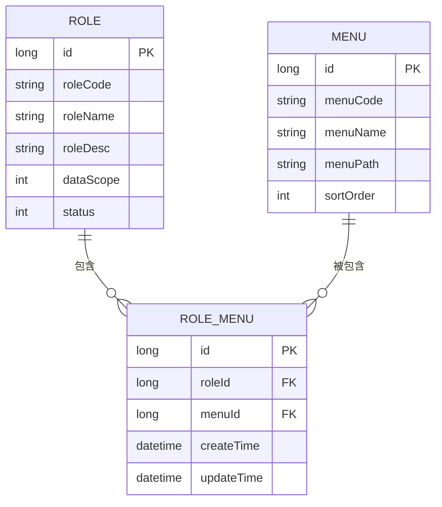
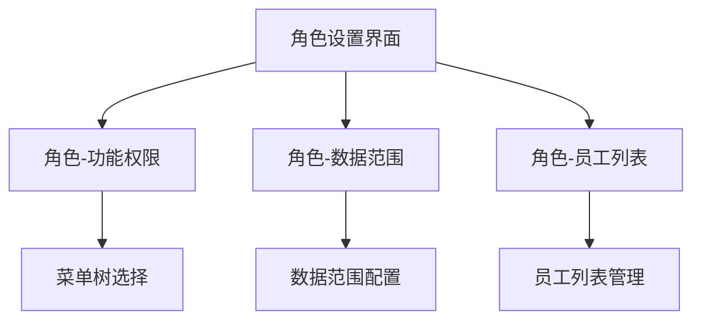
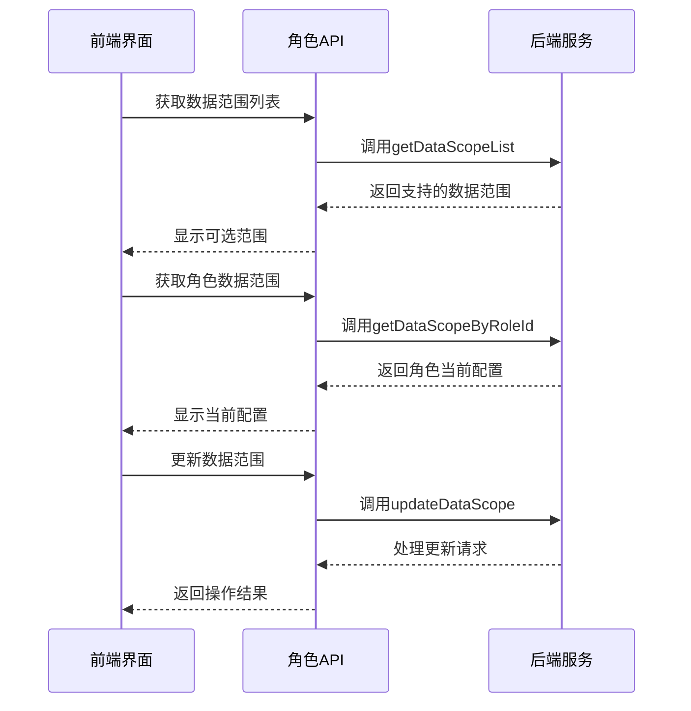
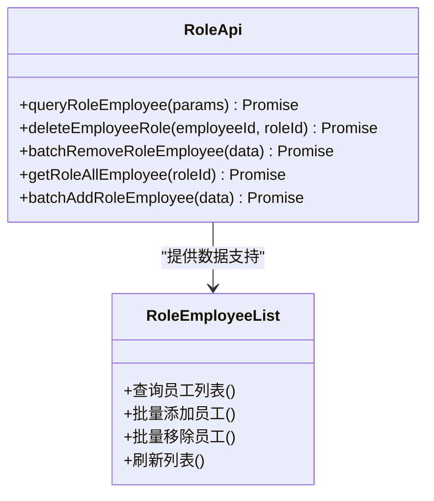
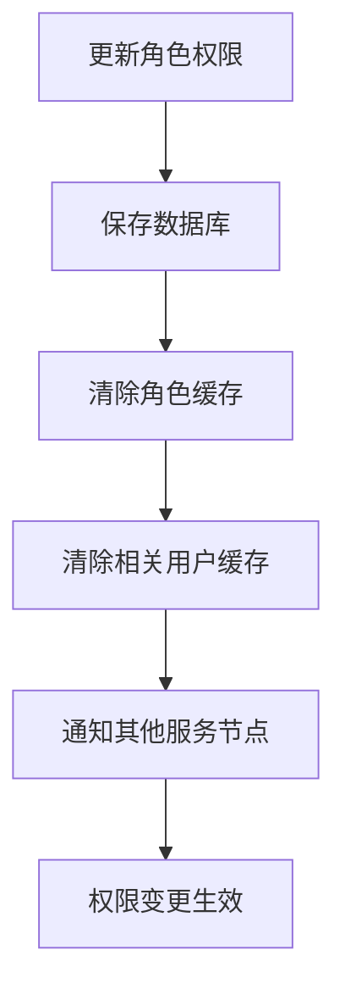
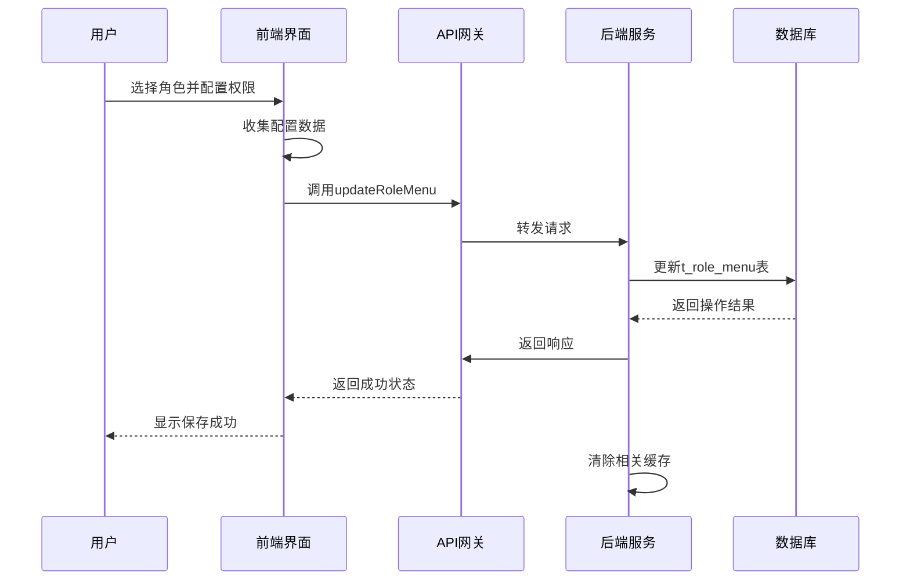

# 角色管理

<cite>
**本文档引用文件**  
- [RoleEntity.java](file://microservices\microservices-common\src\main\java\net\lab1024\sa\common\rbac\domain\entity\RoleEntity.java)
- [RoleDao.java](file://microservices\microservices-common\src\main\java\net\lab1024\sa\common\rbac\dao\RoleDao.java)
- [RoleMenuEntity.java](file://microservices\microservices-common-business\src\main\java\net\lab1024\sa\common\menu\entity\RoleMenuEntity.java)
- [RoleMenuDao.java](file://microservices\microservices-common-business\src\main\java\net\lab1024\sa\common\menu\dao\RoleMenuDao.java)
- [role-api.js](file://smart-admin-web-javascript\src\api\system\role-api.js)
- [role-menu-api.js](file://smart-admin-web-javascript\src\api\system\role-menu-api.js)
- [index.vue](file://smart-admin-web-javascript\src\views\system\role\components\role-setting\index.vue)
- [role-data-scope\index.vue](file://smart-admin-web-javascript\src\views\system\role\components\role-data-scope\index.vue)
</cite>

## 目录
1. [简介](#简介)
2. [核心功能概述](#核心功能概述)
3. [角色与菜单权限管理](#角色与菜单权限管理)
4. [角色与数据权限集成](#角色与数据权限集成)
5. [员工绑定机制](#员工绑定机制)
6. [权限缓存与实时更新](#权限缓存与实时更新)
7. [角色权限分配流程示例](#角色权限分配流程示例)
8. [系统权限控制体系中的角色作用](#系统权限控制体系中的角色作用)

## 简介
角色管理模块是系统权限控制体系的核心组成部分，负责定义和管理用户角色、权限分配以及员工与角色的绑定关系。该模块通过精细化的权限控制机制，确保系统资源的安全访问和操作。

## 核心功能概述
角色管理模块提供三大核心功能：角色创建与维护、权限分配（包括菜单权限和数据权限）、员工与角色绑定。系统通过角色这一抽象层，实现了权限的集中管理和灵活配置。

**角色实体定义**  
角色实体（RoleEntity）包含角色编码、名称、描述、数据范围、状态等核心属性，其中数据范围字段定义了角色的数据访问权限级别。

**权限分配机制**  
系统采用多对多关系管理角色与菜单权限，通过角色菜单关联表（t_role_menu）实现灵活的权限配置。同时，支持为角色配置数据范围权限，控制其数据访问范围。

**员工绑定机制**  
通过角色员工关联机制，实现员工与角色的灵活绑定，支持批量操作和动态调整。

## 角色与菜单权限管理

### 多对多关系模型
系统采用标准的多对多关系模型管理角色与菜单权限，通过中间表 t_role_menu 实现关联。

**Diagram sources**
- [RoleEntity.java](file://microservices\microservices-common\src\main\java\net\lab1024\sa\common\rbac\domain\entity\RoleEntity.java)
- [RoleMenuEntity.java](file://microservices\microservices-common-business\src\main\java\net\lab1024\sa\common\menu\entity\RoleMenuEntity.java)

### 数据库表结构
角色菜单关联表（t_role_menu）包含以下字段：
- role_menu_id：主键ID
- role_id：角色ID
- menu_id：菜单ID
- create_time：创建时间
- update_time：更新时间
- deleted_flag：删除标记

### 前端交互实现
前端通过角色设置组件提供直观的权限配置界面，包含三个主要功能标签页：

**Diagram sources**
- [index.vue](file://smart-admin-web-javascript\src\views\system\role\components\role-setting\index.vue)

**Section sources**
- [index.vue](file://smart-admin-web-javascript\src\views\system\role\components\role-setting\index.vue)

## 角色与数据权限集成

### 数据范围配置
系统支持多种数据范围配置，包括：
- 全部数据
- 自定义范围
- 本部门数据
- 本部门及子部门数据
- 仅本人数据

### 前端数据范围管理
前端通过专门的组件实现数据范围配置功能：

**Diagram sources**
- [role-data-scope\index.vue](file://smart-admin-web-javascript\src\views\system\role\components\role-data-scope\index.vue)
- [role-api.js](file://smart-admin-web-javascript\src\api\system\role-api.js)

**Section sources**
- [role-data-scope\index.vue](file://smart-admin-web-javascript\src\views\system\role\components\role-data-scope\index.vue)

## 员工绑定机制

### 绑定关系管理
系统通过角色员工关联机制实现员工与角色的绑定，支持以下操作：
- 批量添加员工到角色
- 批量从角色移除员工
- 查询角色成员列表
- 获取角色所有员工

### API接口
系统提供完整的员工绑定API接口：

**Diagram sources**
- [role-api.js](file://smart-admin-web-javascript\src\api\system\role-api.js)

## 权限缓存与实时更新

### 缓存策略
系统采用Redis缓存角色权限信息，提高权限验证性能。缓存键采用规范化命名：
- 角色权限缓存：security:role:permissions:{roleId}
- 用户角色缓存：security:user:roles:{userId}

### 实时更新机制
当角色权限发生变更时，系统自动清除相关缓存，确保权限变更的实时生效：

## 角色权限分配流程示例

### 完整流程
角色权限分配的完整流程包括前端交互、API调用和后端处理三个阶段：

**Diagram sources**
- [role-menu-api.js](file://smart-admin-web-javascript\src\api\system\role-menu-api.js)
- [RoleMenuDao.java](file://microservices\microservices-common-business\src\main\java\net\lab1024\sa\common\menu\dao\RoleMenuDao.java)

### 具体步骤
1. **前端配置**：用户在角色设置界面配置菜单权限
2. **数据收集**：前端收集选中的菜单ID列表
3. **API调用**：调用updateRoleMenu接口提交配置
4. **后端处理**：服务端处理权限更新请求
5. **数据库操作**：更新角色菜单关联表
6. **缓存更新**：清除相关缓存确保实时性
7. **结果返回**：返回操作结果给前端

## 系统权限控制体系中的角色作用
角色在系统权限控制体系中扮演着核心枢纽的角色，连接用户、权限和资源。通过角色的抽象，实现了权限管理的灵活性和可维护性，支持复杂的权限控制需求。