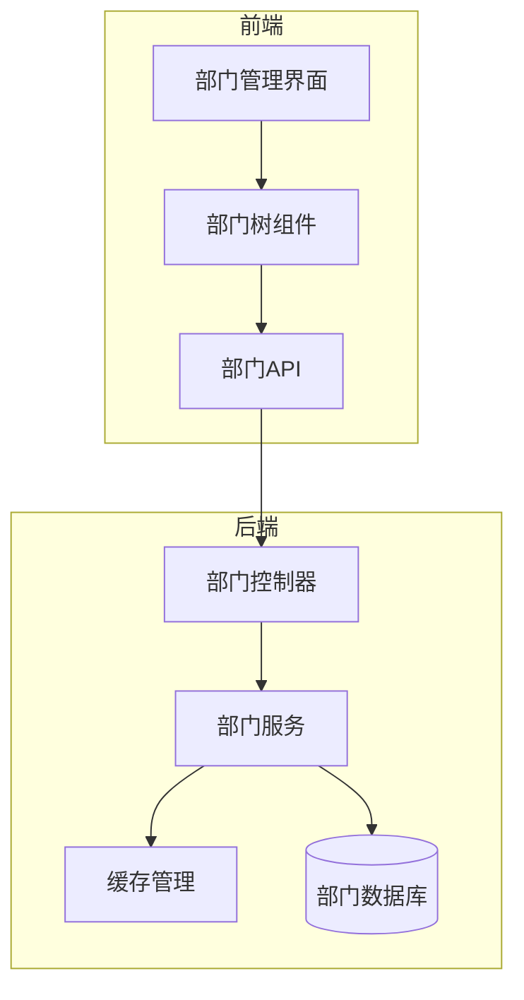
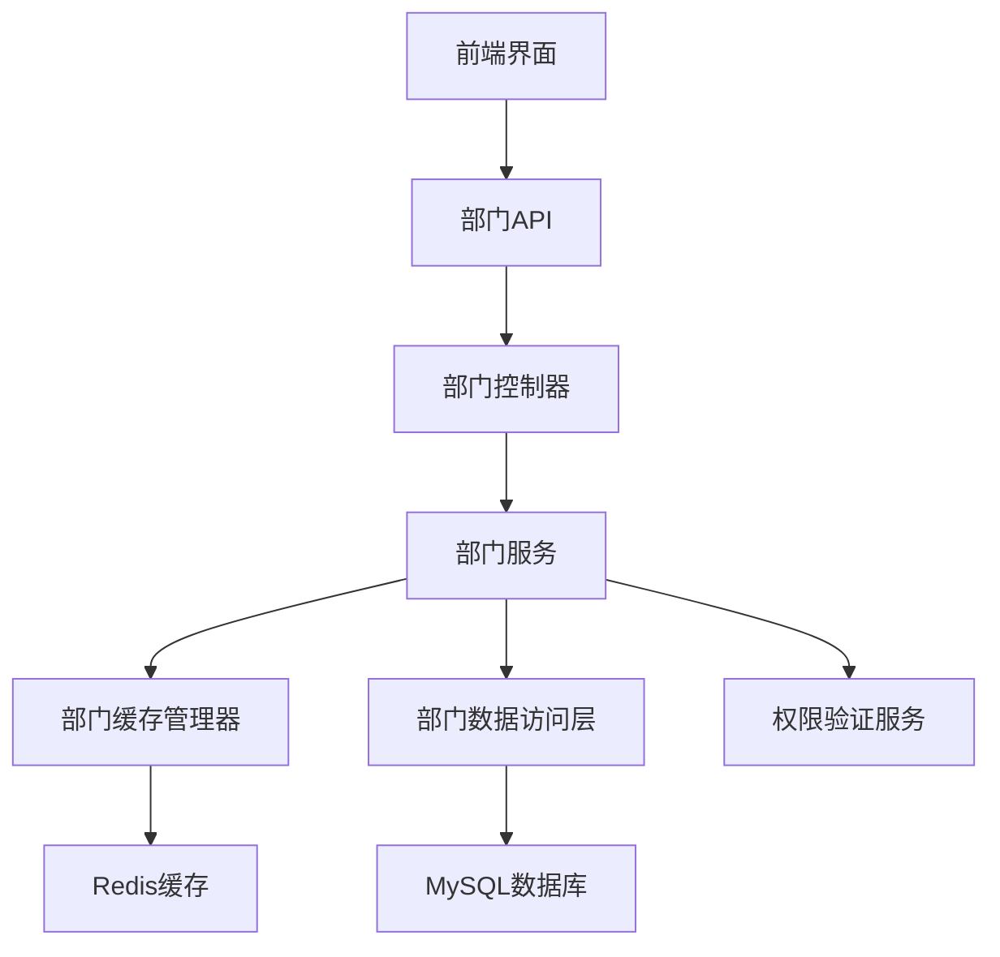
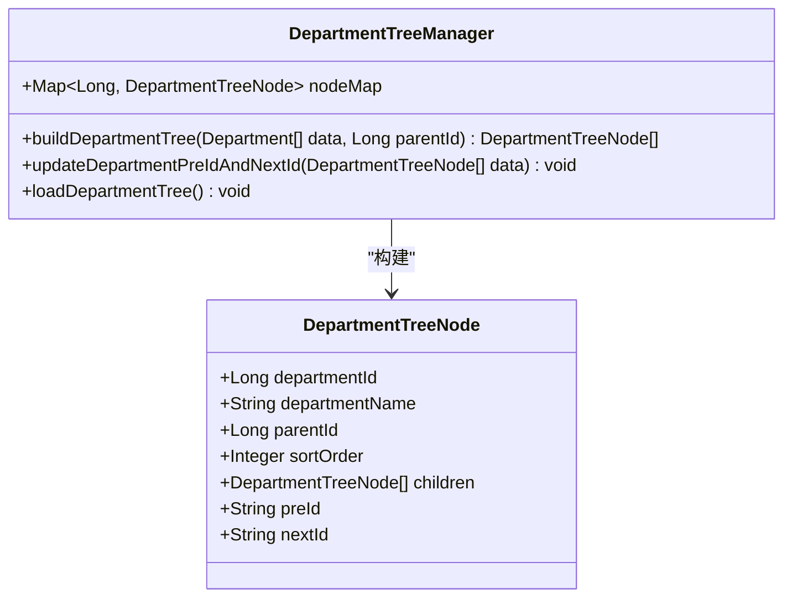
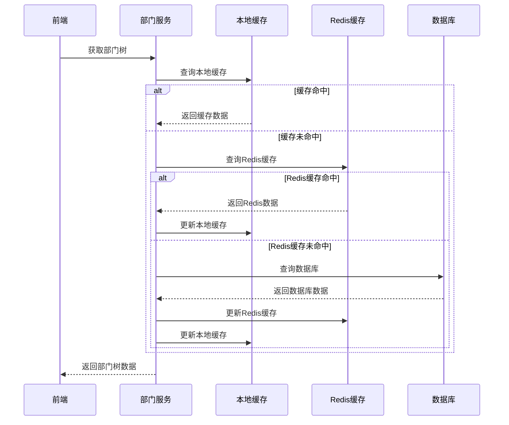
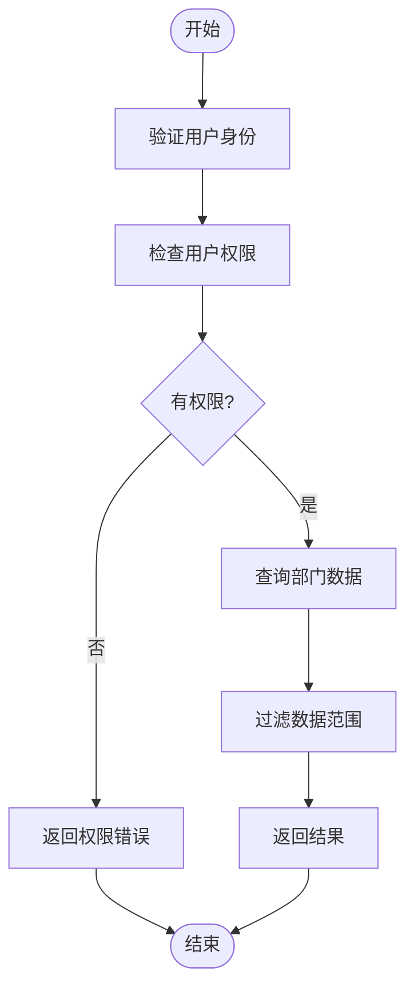
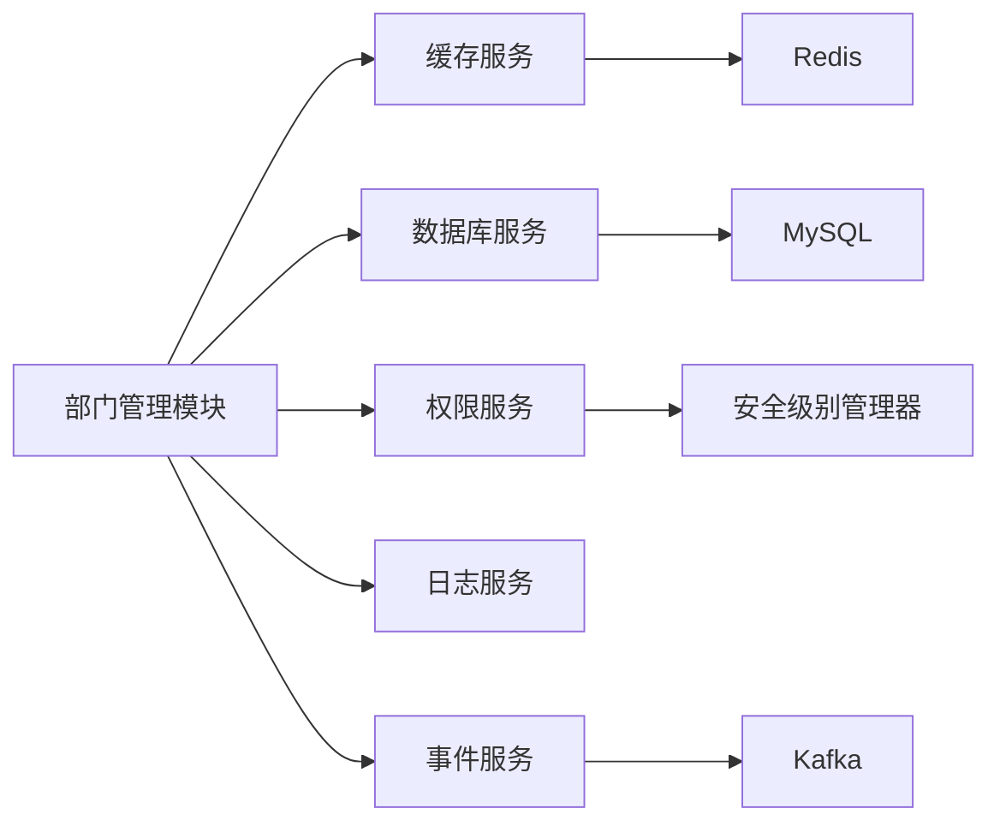

# 部门管理

<cite>
**本文档引用文件**  
- [department-api.js](file://smart-admin-web-javascript/src/api/system/department-api.js)
- [department-tree.vue](file://smart-admin-web-javascript/src/views/system/employee/components/department-tree/index.vue)
- [OrgTree.vue](file://documentation/03-业务模块/考勤/考勤前端原型布局/基础信息功能布局文档_完整版.md)
- [AreaTreeManager.java](file://documentation/technical/smart-area.md)
- [DeviceStatusCacheManager.java](file://documentation/technical/smart-device.md)
- [SecurityLevelManager.java](file://documentation/technical/smart-permission.md)
- [smart-area.md](file://documentation/03-业务模块/消费/01-区域管理模块重构设计.md)
</cite>

## 目录
1. [简介](#简介)
2. [项目结构](#项目结构)
3. [核心组件](#核心组件)
4. [架构概述](#架构概述)
5. [详细组件分析](#详细组件分析)
6. [依赖分析](#依赖分析)
7. [性能考虑](#性能考虑)
8. [故障排除指南](#故障排除指南)
9. [结论](#结论)

## 简介
本系统中的部门管理模块实现了完整的组织架构树形结构管理功能，支持多层级部门的创建、维护和可视化展示。系统通过递归算法处理复杂的树形结构，实现了部门与员工、角色之间的数据关联，并采用多级缓存策略提升查询性能。部门数据权限控制机制确保了数据安全，同时在部门数据变更时通过事务处理保障数据一致性。

## 项目结构
部门管理功能分布在前后端多个模块中，前端位于系统模块的部门相关组件中，后端则通过API服务提供数据支持。系统采用了分层架构设计，将部门树形结构管理、缓存管理、权限控制等功能分离，确保了代码的可维护性和扩展性。

**Diagram sources**
- [department-tree.vue](file://smart-admin-web-javascript/src/views/system/employee/components/department-tree/index.vue)
- [department-api.js](file://smart-admin-web-javascript/src/api/system/department-api.js)

**Section sources**
- [department-tree.vue](file://smart-admin-web-javascript/src/views/system/employee/components/department-tree/index.vue)
- [department-api.js](file://smart-admin-web-javascript/src/api/system/department-api.js)

## 核心组件
部门管理模块的核心组件包括部门树形结构管理器、部门缓存管理器和部门数据权限控制器。这些组件协同工作，实现了高效的部门信息管理和安全的数据访问控制。

**Section sources**
- [AreaTreeManager.java](file://documentation/technical/smart-area.md)
- [DeviceStatusCacheManager.java](file://documentation/technical/smart-device.md)
- [SecurityLevelManager.java](file://documentation/technical/smart-permission.md)

## 架构概述
部门管理模块采用分层架构设计，从前端界面到后端服务再到数据存储，各层职责分明。系统通过RESTful API进行前后端通信，使用Redis作为主要缓存存储，实现了高性能的部门数据访问。

**Diagram sources**
- [AreaTreeManager.java](file://documentation/technical/smart-area.md)
- [DeviceStatusCacheManager.java](file://documentation/technical/smart-device.md)

## 详细组件分析

### 部门树形结构分析
部门树形结构组件实现了多层级部门的可视化展示和交互操作，支持展开、收起、新增、编辑和删除部门等操作。

**Diagram sources**
- [department-tree.vue](file://smart-admin-web-javascript/src/views/system/employee/components/department-tree/index.vue)
- [OrgTree.vue](file://documentation/03-业务模块/考勤/考勤前端原型布局/基础信息功能布局文档_完整版.md)

### 部门缓存管理分析
部门缓存管理器采用多级缓存策略，结合本地缓存和Redis缓存，显著提升了部门数据的查询性能。

**Diagram sources**
- [DeviceStatusCacheManager.java](file://documentation/technical/smart-device.md)
- [smart-area.md](file://documentation/03-业务模块/消费/01-区域管理模块重构设计.md)

### 部门权限控制分析
部门数据权限控制机制确保了用户只能访问其权限范围内的部门数据，实现了细粒度的数据安全控制。

**Diagram sources**
- [SecurityLevelManager.java](file://documentation/technical/smart-permission.md)

**Section sources**
- [department-tree.vue](file://smart-admin-web-javascript/src/views/system/employee/components/department-tree/index.vue)
- [AreaTreeManager.java](file://documentation/technical/smart-area.md)
- [DeviceStatusCacheManager.java](file://documentation/technical/smart-device.md)
- [SecurityLevelManager.java](file://documentation/technical/smart-permission.md)

## 依赖分析
部门管理模块依赖于多个基础服务组件，包括缓存服务、数据库服务和权限服务。这些依赖关系通过Spring框架的依赖注入机制进行管理，确保了组件之间的松耦合。

**Diagram sources**
- [DeviceStatusCacheManager.java](file://documentation/technical/smart-device.md)
- [SecurityLevelManager.java](file://documentation/technical/smart-permission.md)

**Section sources**
- [AreaTreeManager.java](file://documentation/technical/smart-area.md)
- [DeviceStatusCacheManager.java](file://documentation/technical/smart-device.md)
- [SecurityLevelManager.java](file://documentation/technical/smart-permission.md)

## 性能考虑
部门管理模块通过多级缓存策略、树形结构预加载和懒加载机制，以及数据库索引优化等手段，确保了在大数据量下的高性能表现。缓存预热机制在系统启动时自动加载常用数据，减少了首次访问的延迟。

## 故障排除指南
当部门管理功能出现异常时，应首先检查缓存服务是否正常运行，然后验证数据库连接状态。对于树形结构显示异常，需要检查部门数据的层级关系是否正确，特别是父部门ID的设置。权限相关问题应检查用户的角色分配和权限配置。

**Section sources**
- [AreaTreeManager.java](file://documentation/technical/smart-area.md)
- [DeviceStatusCacheManager.java](file://documentation/technical/smart-device.md)
- [SecurityLevelManager.java](file://documentation/technical/smart-permission.md)

## 结论
部门管理模块通过合理的架构设计和先进的技术实现，提供了稳定、高效、安全的部门信息管理功能。递归算法的应用使得复杂的树形结构处理变得简单高效，多级缓存策略显著提升了系统性能，而完善的权限控制机制则保障了数据安全。该模块的设计模式可为其他类似的组织架构管理功能提供参考。