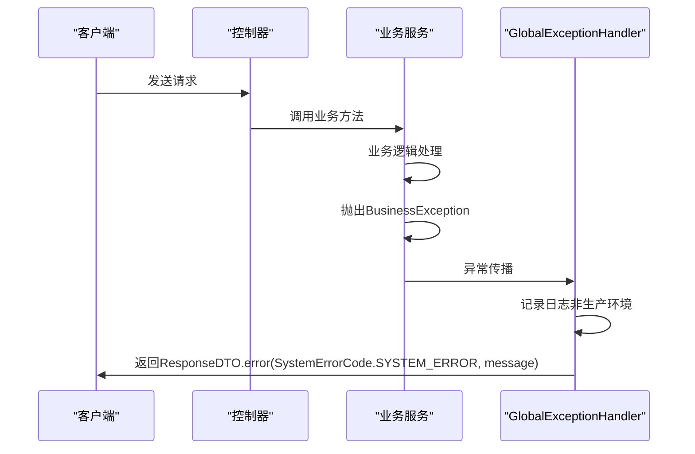
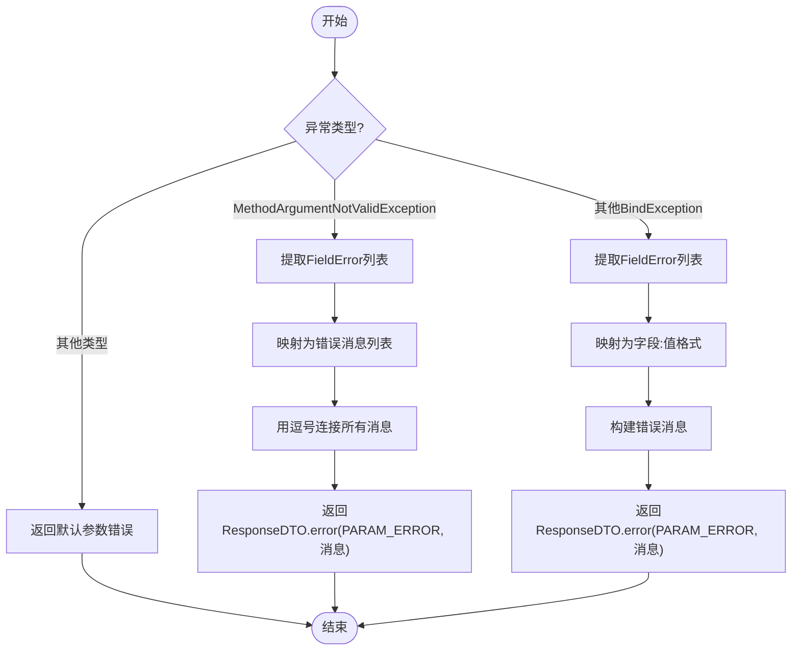
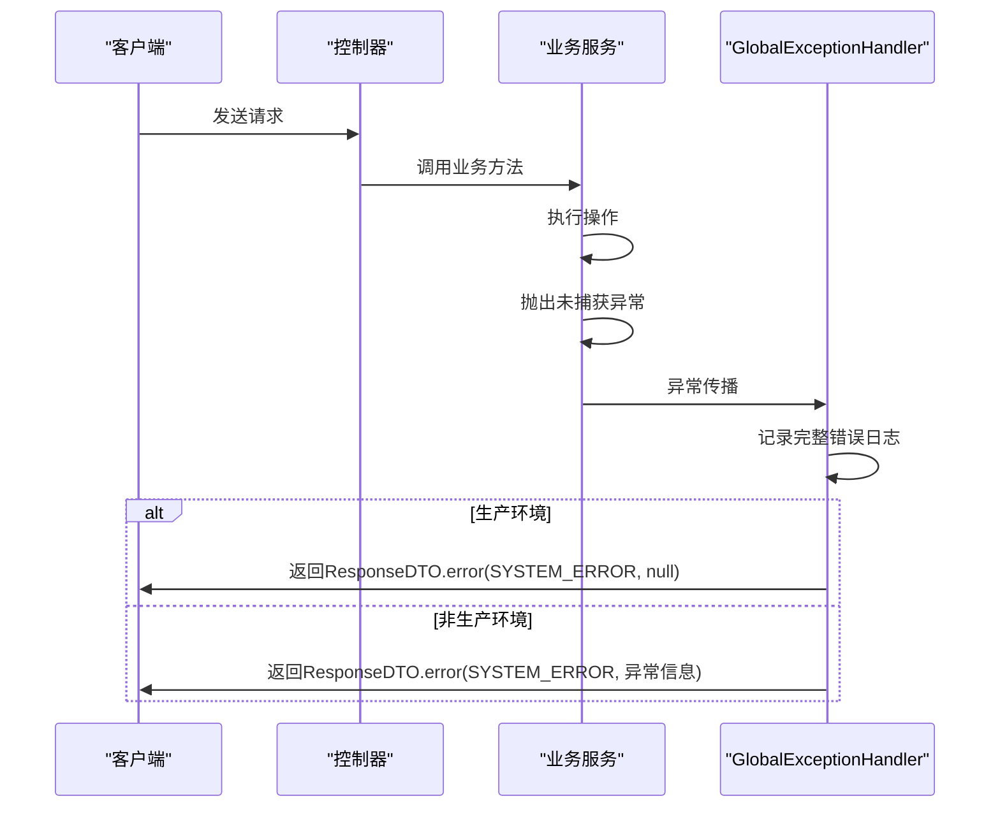
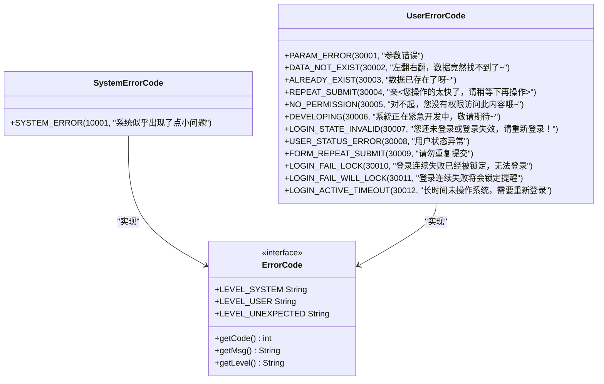
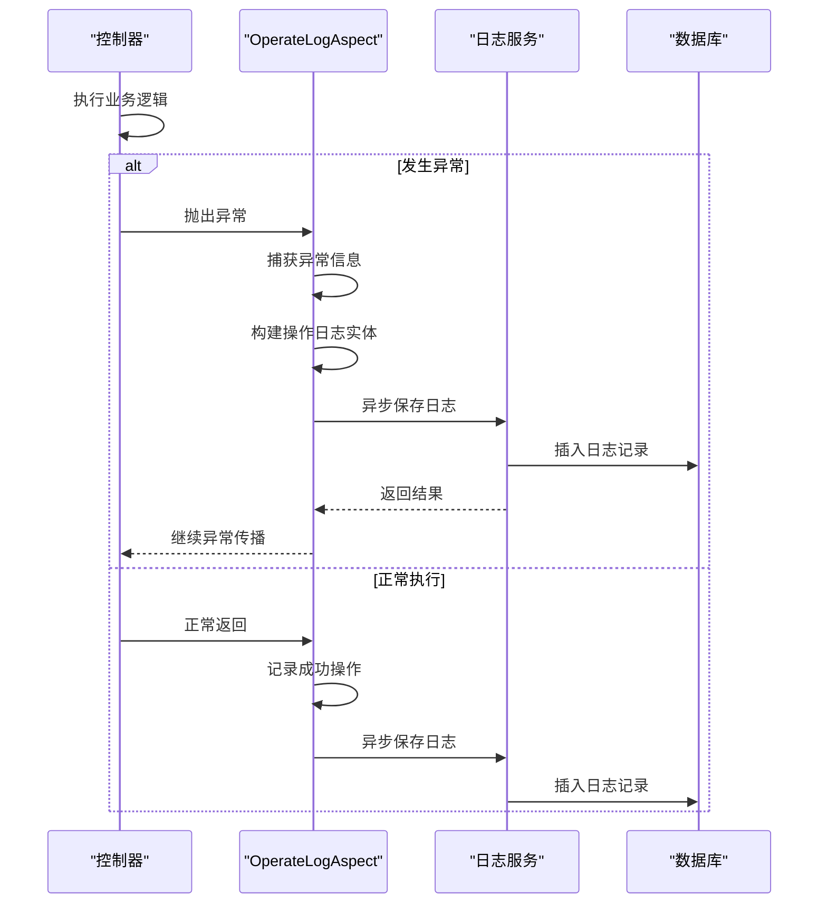

# 全局异常处理

<cite>
**本文档引用文件**  
- [GlobalExceptionHandler.java](file://smart-admin-api-java17-springboot3/sa-base/src/main/java/net/lab1024/sa/base/handler/GlobalExceptionHandler.java)
- [BusinessException.java](file://smart-admin-api-java17-springboot3/sa-base/src/main/java/net/lab1024/sa/base/common/exception/BusinessException.java)
- [ResponseDTO.java](file://smart-admin-api-java17-springboot3/sa-base/src/main/java/net/lab1024/sa/base/common/domain/ResponseDTO.java)
- [SystemErrorCode.java](file://smart-admin-api-java17-springboot3/sa-base/src/main/java/net/lab1024/sa/base/common/code/SystemErrorCode.java)
- [UserErrorCode.java](file://smart-admin-api-java17-springboot3/sa-base/src/main/java/net/lab1024/sa/base/common/code/UserErrorCode.java)
- [ErrorCode.java](file://smart-admin-api-java17-springboot3/sa-base/src/main/java/net/lab1024/sa/base/common/code/ErrorCode.java)
- [OperateLogAspect.java](file://smart-admin-api-java17-springboot3/sa-base/src/main/java/net/lab1024/sa/base/module/support/operatelog/core/OperateLogAspect.java)
</cite>

## 目录
1. [简介](#简介)
2. [全局异常处理机制](#全局异常处理机制)
3. [异常类型处理逻辑](#异常类型处理逻辑)
4. [错误码体系设计](#错误码体系设计)
5. [异常日志记录](#异常日志记录)
6. [自定义异常扩展](#自定义异常扩展)
7. [分布式环境下的异常追踪](#分布式环境下的异常追踪)
8. [总结](#总结)

## 简介
sa-base模块提供了一套完整的全局异常处理机制，通过`@ControllerAdvice`和`@ExceptionHandler`注解实现对系统各类异常的统一捕获和处理。该机制确保了系统在发生异常时能够返回标准化的响应格式，提高了系统的稳定性和可维护性。

## 全局异常处理机制

```mermaid
classDiagram
class GlobalExceptionHandler {
+SystemEnvironment systemEnvironment
+ResponseDTO<?> jsonFormatExceptionHandler(Exception e)
+ResponseDTO<?> paramExceptionHandler(Exception e)
+ResponseDTO<String> permissionException(NotPermissionException e)
+ResponseDTO<?> businessExceptionHandler(BusinessException e)
+ResponseDTO<?> errorHandler(Throwable e)
-String getCurrentRequestUrl()
}
class ResponseDTO {
+Integer code
+String level
+String msg
+Boolean ok
+T data
+Integer dataType
+static <T> ResponseDTO<T> ok()
+static <T> ResponseDTO<T> ok(T data)
+static <T> ResponseDTO<T> error(ErrorCode errorCode)
+static <T> ResponseDTO<T> error(ErrorCode errorCode, String msg)
}
class BusinessException {
+BusinessException()
+BusinessException(ErrorCode errorCode)
+BusinessException(String message)
+BusinessException(String message, Throwable cause)
}
interface ErrorCode {
+int getCode()
+String getMsg()
+String getLevel()
}
class SystemErrorCode {
+SYSTEM_ERROR(10001, "系统似乎出现了点小问题")
}
class UserErrorCode {
+PARAM_ERROR(30001, "参数错误")
+DATA_NOT_EXIST(30002, "左翻右翻，数据竟然找不到了~")
+ALREADY_EXIST(30003, "数据已存在了呀~")
+REPEAT_SUBMIT(30004, "亲~您操作的太快了，请稍等下再操作~")
+NO_PERMISSION(30005, "对不起，您没有权限访问此内容哦~")
+DEVELOPING(30006, "系統正在紧急开发中，敬请期待~")
+LOGIN_STATE_INVALID(30007, "您还未登录或登录失效，请重新登录！")
+USER_STATUS_ERROR(30008, "用户状态异常")
+FORM_REPEAT_SUBMIT(30009, "请勿重复提交")
+LOGIN_FAIL_LOCK(30010, "登录连续失败已经被锁定，无法登录")
+LOGIN_FAIL_WILL_LOCK(30011, "登录连续失败将会锁定提醒")
+LOGIN_ACTIVE_TIMEOUT(30012, "长时间未操作系统，需要重新登录")
}
GlobalExceptionHandler --> ResponseDTO : "返回"
GlobalExceptionHandler --> BusinessException : "处理"
GlobalExceptionHandler --> SystemErrorCode : "引用"
GlobalExceptionHandler --> UserErrorCode : "引用"
BusinessException --> ErrorCode : "实现"
SystemErrorCode --> ErrorCode : "实现"
UserErrorCode --> ErrorCode : "实现"
```

**图示来源**
- [GlobalExceptionHandler.java](file://smart-admin-api-java17-springboot3/sa-base/src/main/java/net/lab1024/sa/base/handler/GlobalExceptionHandler.java)
- [ResponseDTO.java](file://smart-admin-api-java17-springboot3/sa-base/src/main/java/net/lab1024/sa/base/common/domain/ResponseDTO.java)
- [BusinessException.java](file://smart-admin-api-java17-springboot3/sa-base/src/main/java/net/lab1024/sa/base/common/exception/BusinessException.java)
- [SystemErrorCode.java](file://smart-admin-api-java17-springboot3/sa-base/src/main/java/net/lab1024/sa/base/common/code/SystemErrorCode.java)
- [UserErrorCode.java](file://smart-admin-api-java17-springboot3/sa-base/src/main/java/net/lab1024/sa/base/common/code/UserErrorCode.java)

**本节来源**
- [GlobalExceptionHandler.java](file://smart-admin-api-java17-springboot3/sa-base/src/main/java/net/lab1024/sa/base/handler/GlobalExceptionHandler.java#L36-L130)

## 异常类型处理逻辑

### BusinessException业务异常处理
`GlobalExceptionHandler`通过`@ExceptionHandler(BusinessException.class)`注解捕获业务异常。当系统处于非生产环境时，会记录详细的错误日志，便于开发人员调试。无论何种环境，都会返回统一的系统错误码和异常消息。



**图示来源**
- [GlobalExceptionHandler.java](file://smart-admin-api-java17-springboot3/sa-base/src/main/java/net/lab1024/sa/base/handler/GlobalExceptionHandler.java#L97-L103)
- [BusinessException.java](file://smart-admin-api-java17-springboot3/sa-base/src/main/java/net/lab1024/sa/base/common/exception/BusinessException.java)

**本节来源**
- [GlobalExceptionHandler.java](file://smart-admin-api-java17-springboot3/sa-base/src/main/java/net/lab1024/sa/base/handler/GlobalExceptionHandler.java#L97-L103)
- [BusinessException.java](file://smart-admin-api-java17-springboot3/sa-base/src/main/java/net/lab1024/sa/base/common/exception/BusinessException.java)

### MethodArgumentNotValidException参数校验异常处理
系统通过`paramExceptionHandler`方法处理参数校验异常。对于`MethodArgumentNotValidException`，提取所有字段错误信息并用逗号连接返回；对于其他绑定异常，返回字段名和拒绝值的组合信息。



**图示来源**
- [GlobalExceptionHandler.java](file://smart-admin-api-java17-springboot3/sa-base/src/main/java/net/lab1024/sa/base/handler/GlobalExceptionHandler.java#L60-L74)

**本节来源**
- [GlobalExceptionHandler.java](file://smart-admin-api-java17-springboot3/sa-base/src/main/java/net/lab1024/sa/base/handler/GlobalExceptionHandler.java#L60-L74)

### RuntimeException运行时异常处理
系统通过`errorHandler`方法捕获所有未被处理的异常（`Throwable.class`）。在生产环境中，为了安全考虑，只返回通用的系统错误信息；在非生产环境中，会返回详细的异常堆栈信息，便于调试。



**图示来源**
- [GlobalExceptionHandler.java](file://smart-admin-api-java17-springboot3/sa-base/src/main/java/net/lab1024/sa/base/handler/GlobalExceptionHandler.java#L112-L116)

**本节来源**
- [GlobalExceptionHandler.java](file://smart-admin-api-java17-springboot3/sa-base/src/main/java/net/lab1024/sa/base/handler/GlobalExceptionHandler.java#L112-L116)

## 错误码体系设计

### 错误码分类
系统采用分层的错误码体系，通过`ErrorCode`接口定义了统一的错误码规范，包含错误码、错误消息和错误等级三个核心属性。



**图示来源**
- [ErrorCode.java](file://smart-admin-api-java17-springboot3/sa-base/src/main/java/net/lab1024/sa/base/common/code/ErrorCode.java)
- [SystemErrorCode.java](file://smart-admin-api-java17-springboot3/sa-base/src/main/java/net/lab1024/sa/base/common/code/SystemErrorCode.java)
- [UserErrorCode.java](file://smart-admin-api-java17-springboot3/sa-base/src/main/java/net/lab1024/sa/base/common/code/UserErrorCode.java)

### 系统错误码与用户错误码
错误码体系分为两大类：

1. **系统错误码**：以`SystemErrorCode`枚举类定义，主要用于表示系统内部错误，如`SYSTEM_ERROR(10001)`。这类错误通常需要开发人员关注和处理。

2. **用户错误码**：以`UserErrorCode`枚举类定义，主要用于表示用户操作引起的错误，如`PARAM_ERROR(30001)`、`NO_PERMISSION(30005)`等。这类错误通常是用户输入不当或权限不足导致的，不需要开发人员特别关注。

**本节来源**
- [ErrorCode.java](file://smart-admin-api-java17-springboot3/sa-base/src/main/java/net/lab1024/sa/base/common/code/ErrorCode.java#L13-L47)
- [SystemErrorCode.java](file://smart-admin-api-java17-springboot3/sa-base/src/main/java/net/lab1024/sa/base/common/code/SystemErrorCode.java)
- [UserErrorCode.java](file://smart-admin-api-java17-springboot3/sa-base/src/main/java/net/lab1024/sa/base/common/code/UserErrorCode.java)

## 异常日志记录

### 操作日志关联
系统通过AOP切面`OperateLogAspect`实现了操作日志的自动记录。当发生异常时，切面会捕获异常信息并将其记录到操作日志中，便于后续的问题追踪和分析。



**图示来源**
- [OperateLogAspect.java](file://smart-admin-api-java17-springboot3/sa-base/src/main/java/net/lab1024/sa/base/module/support/operatelog/core/OperateLogAspect.java)

### 登录日志关联
虽然当前分析未直接显示登录日志的具体实现，但系统设计中包含了`login-log`模块，表明系统具备完整的用户行为追踪能力。异常处理机制与登录日志系统的集成，可以实现用户操作与异常事件的关联分析。

**本节来源**
- [OperateLogAspect.java](file://smart-admin-api-java17-springboot3/sa-base/src/main/java/net/lab1024/sa/base/module/support/operatelog/core/OperateLogAspect.java#L57-L100)
- [OperateLogAspect.java](file://smart-admin-api-java17-springboot3/sa-base/src/main/java/net/lab1024/sa/base/module/support/operatelog/core/OperateLogAspect.java#L228-L273)

## 自定义异常扩展

### 自定义异常类型
开发者可以通过继承`BusinessException`类来创建自定义的业务异常类型，或者直接使用`BusinessException`构造函数传入自定义的错误码和消息。

```java
// 示例：自定义业务异常
public class CustomBusinessException extends BusinessException {
    public CustomBusinessException() {
        super(UserErrorCode.PARAM_ERROR);
    }
    
    public CustomBusinessException(String message) {
        super(message);
    }
}
```

### 自定义错误码
通过在`UserErrorCode`或`SystemErrorCode`枚举中添加新的枚举常量，可以轻松扩展系统的错误码体系。

```java
// 示例：在UserErrorCode中添加新的错误码
public enum UserErrorCode implements ErrorCode {
    // ... existing codes
    CUSTOM_ERROR(30013, "自定义错误消息"),
    ANOTHER_ERROR(30014, "另一个错误消息");
}
```

**本节来源**
- [BusinessException.java](file://smart-admin-api-java17-springboot3/sa-base/src/main/java/net/lab1024/sa/base/common/exception/BusinessException.java)
- [UserErrorCode.java](file://smart-admin-api-java17-springboot3/sa-base/src/main/java/net/lab1024/sa/base/common/code/UserErrorCode.java)

## 分布式环境下的异常追踪
在分布式环境下，建议结合以下策略实现异常追踪：

1. **全局请求ID**：为每个请求生成唯一的追踪ID，并在日志中记录，便于跨服务追踪请求流程。

2. **链路追踪集成**：集成如SkyWalking、Zipkin等分布式追踪系统，实现服务调用链的可视化。

3. **日志聚合**：使用ELK或类似技术将各服务的日志集中存储和分析，便于问题定位。

4. **异常上下文传递**：在服务间调用时，将异常上下文信息（如追踪ID、用户信息等）通过请求头传递。

虽然当前代码分析未直接显示这些分布式追踪功能的实现，但系统的模块化设计为这些功能的集成提供了良好的基础。

## 总结
sa-base模块的全局异常处理机制设计完善，通过`GlobalExceptionHandler`实现了对各类异常的统一捕获和处理。系统采用`ResponseDTO`作为统一的响应格式，结合`ErrorCode`体系实现了错误信息的标准化。异常处理机制充分考虑了生产环境的安全性，在非生产环境提供详细的调试信息，而在生产环境则隐藏敏感信息。同时，系统通过AOP切面实现了操作日志的自动记录，为异常追踪提供了有力支持。整体设计既保证了系统的稳定性，又为开发和运维提供了便利。