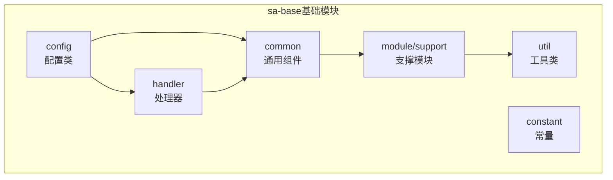
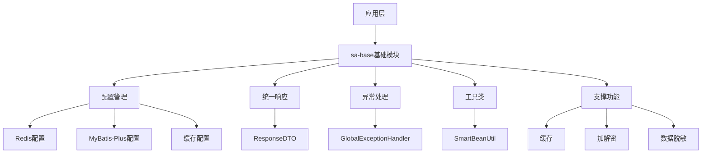
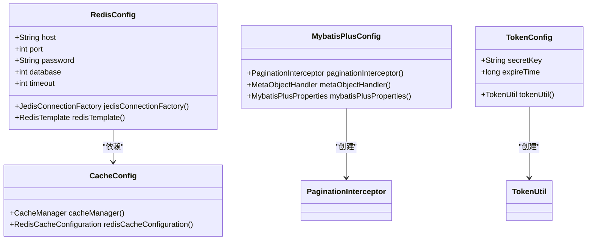
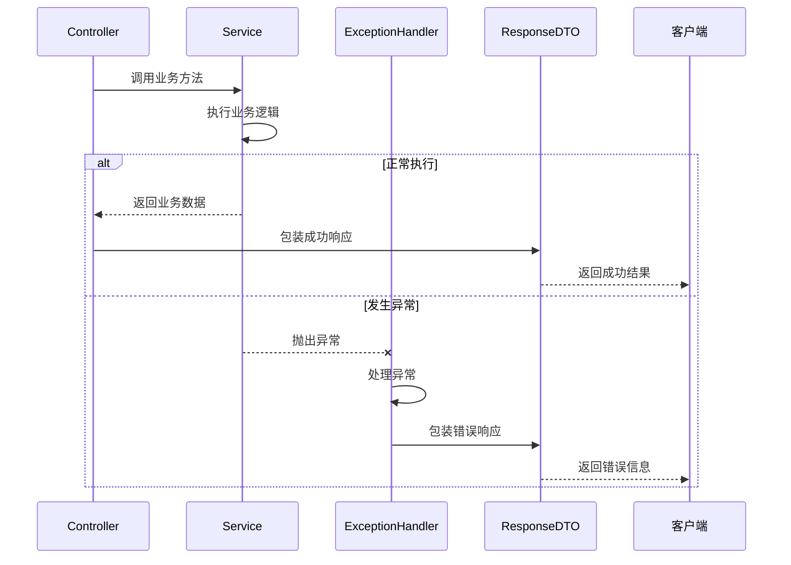
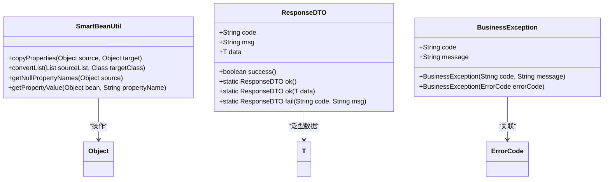
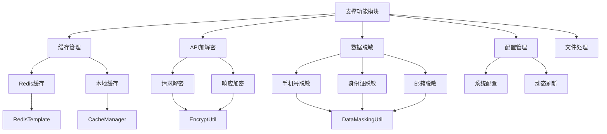
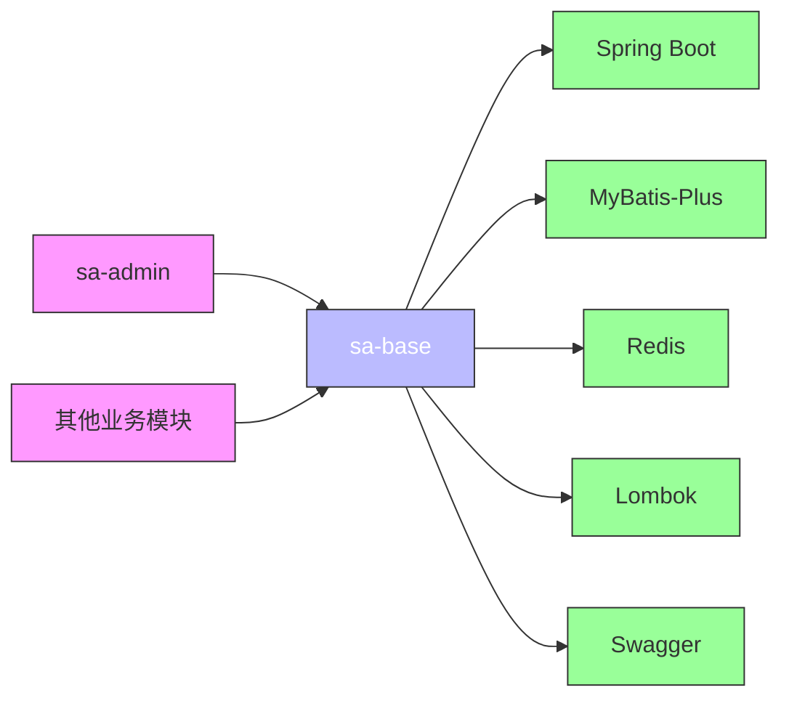

# 基础模块(sa-base)

<cite>
**本文档引用文件**  
- [RedisConfig.java](file://smart-admin-api-java17-springboot3\sa-base\src\main\java\net\lab1024\sa\base\config\RedisConfig.java)
- [MybatisPlusConfig.java](file://smart-admin-api-java17-springboot3\sa-base\src\main\java\net\lab1024\sa\base\config\MybatisPlusConfig.java)
- [ResponseDTO.java](file://smart-admin-api-java17-springboot3\sa-base\src\main\java\net\lab1024\sa\base\common\domain\ResponseDTO.java)
- [BusinessException.java](file://smart-admin-api-java17-springboot3\sa-base\src\main\java\net\lab1024\sa\base\common\exception\BusinessException.java)
- [GlobalExceptionHandler.java](file://smart-admin-api-java17-springboot3\sa-base\src\main\java\net\lab1024\sa\base\handler\GlobalExceptionHandler.java)
- [SmartBeanUtil.java](file://smart-admin-api-java17-springboot3\sa-base\src\main\java\net\lab1024\sa\base\common\util\SmartBeanUtil.java)
- [CacheConfig.java](file://smart-admin-api-java17-springboot3\sa-base\src\main\java\net\lab1024\sa\base\config\CacheConfig.java)
- [TokenConfig.java](file://smart-admin-api-java17-springboot3\sa-base\src\main\java\net\lab1024\sa\base\config\TokenConfig.java)
- [sa-base.yaml](file://smart-admin-api-java17-springboot3\sa-base\src\main\resources\dev\sa-base.yaml)
- [ConfigKeyEnum.java](file://smart-admin-api-java17-springboot3\sa-base\src\main\java\net\lab1024\sa\base\module\support\config\ConfigKeyEnum.java)
- [DataMaskingUtil.java](file://smart-admin-api-java17-springboot3\sa-base\src\main\java\net\lab1024\sa\base\module\support\datamasking\util\DataMaskingUtil.java)
- [EncryptUtil.java](file://smart-admin-api-java17-springboot3\sa-base\src\main\java\net\lab1024\sa\base\module\support\apiencrypt\util\EncryptUtil.java)
</cite>

## 目录
1. [简介](#简介)
2. [项目结构](#项目结构)
3. [核心组件](#核心组件)
4. [架构概述](#架构概述)
5. [详细组件分析](#详细组件分析)
6. [依赖分析](#依赖分析)
7. [性能考虑](#性能考虑)
8. [故障排除指南](#故障排除指南)
9. [结论](#结论)

## 简介
sa-base基础模块是整个系统的核心公共库，为上层业务模块提供统一的技术支撑和基础服务。该模块通过封装通用功能，降低业务开发复杂度，提高代码复用性和系统稳定性。它主要包含系统基础配置、统一响应结构、异常处理机制、通用工具类以及各类支撑功能模块。

## 项目结构
sa-base模块采用分层架构设计，按照功能划分为多个包，每个包负责特定领域的功能实现。这种模块化设计使得代码结构清晰，职责分明，便于维护和扩展。

**图示来源**
- [sa-base项目结构](file://smart-admin-api-java17-springboot3\sa-base\src\main\java\net\lab1024\sa\base)

**本节来源**
- [sa-base项目结构](file://smart-admin-api-java17-springboot3\sa-base)

## 核心组件
sa-base模块的核心组件包括配置管理、统一响应、异常处理、缓存支持、数据脱敏等功能。这些组件共同构成了系统的基础设施，为业务开发提供标准化的解决方案。

**本节来源**
- [RedisConfig.java](file://smart-admin-api-java17-springboot3\sa-base\src\main\java\net\lab1024\sa\base\config\RedisConfig.java)
- [ResponseDTO.java](file://smart-admin-api-java17-springboot3\sa-base\src\main\java\net\lab1024\sa\base\common\domain\ResponseDTO.java)
- [BusinessException.java](file://smart-admin-api-java17-springboot3\sa-base\src\main\java\net\lab1024\sa\base\common\exception\BusinessException.java)

## 架构概述
sa-base模块采用分层架构设计，各层之间职责分明，通过依赖注入实现松耦合。配置层负责系统参数的初始化和管理，通用组件层提供基础服务，处理器层处理全局性事务，支撑模块层实现各类通用功能。

**图示来源**
- [sa-base架构设计](file://smart-admin-api-java17-springboot3\sa-base)

**本节来源**
- [sa-base项目结构](file://smart-admin-api-java17-springboot3\sa-base)

## 详细组件分析
### 配置管理分析
sa-base模块通过配置包实现系统基础配置的集中管理。各类配置类使用Spring的@Configuration注解进行声明，通过@Value或@ConfigurationProperties注解注入配置值，实现配置的外部化管理。

#### 配置类设计

**图示来源**
- [RedisConfig.java](file://smart-admin-api-java17-springboot3\sa-base\src\main\java\net\lab1024\sa\base\config\RedisConfig.java)
- [MybatisPlusConfig.java](file://smart-admin-api-java17-springboot3\sa-base\src\main\java\net\lab1024\sa\base\config\MybatisPlusConfig.java)
- [CacheConfig.java](file://smart-admin-api-java17-springboot3\sa-base\src\main\java\net\lab1024\sa\base\config\CacheConfig.java)
- [TokenConfig.java](file://smart-admin-api-java17-springboot3\sa-base\src\main\java\net\lab1024\sa\base\config\TokenConfig.java)

**本节来源**
- [RedisConfig.java](file://smart-admin-api-java17-springboot3\sa-base\src\main\java\net\lab1024\sa\base\config\RedisConfig.java)
- [MybatisPlusConfig.java](file://smart-admin-api-java17-springboot3\sa-base\src\main\java\net\lab1024\sa\base\config\MybatisPlusConfig.java)

### 通用组件分析
sa-base模块的common包提供了统一的响应结构、异常处理机制和各类工具类，为系统提供标准化的基础服务。

#### 统一响应与异常处理

**图示来源**
- [ResponseDTO.java](file://smart-admin-api-java17-springboot3\sa-base\src\main\java\net\lab1024\sa\base\common\domain\ResponseDTO.java)
- [BusinessException.java](file://smart-admin-api-java17-springboot3\sa-base\src\main\java\net\lab1024\sa\base\common\exception\BusinessException.java)
- [GlobalExceptionHandler.java](file://smart-admin-api-java17-springboot3\sa-base\src\main\java\net\lab1024\sa\base\handler\GlobalExceptionHandler.java)

**本节来源**
- [ResponseDTO.java](file://smart-admin-api-java17-springboot3\sa-base\src\main\java\net\lab1024\sa\base\common\domain\ResponseDTO.java)
- [BusinessException.java](file://smart-admin-api-java17-springboot3\sa-base\src\main\java\net\lab1024\sa\base\common\exception\BusinessException.java)
- [GlobalExceptionHandler.java](file://smart-admin-api-java17-springboot3\sa-base\src\main\java\net\lab1024\sa\base\handler\GlobalExceptionHandler.java)

#### 工具类设计

**图示来源**
- [SmartBeanUtil.java](file://smart-admin-api-java17-springboot3\sa-base\src\main\java\net\lab1024\sa\base\common\util\SmartBeanUtil.java)
- [ResponseDTO.java](file://smart-admin-api-java17-springboot3\sa-base\src\main\java\net\lab1024\sa\base\common\domain\ResponseDTO.java)
- [BusinessException.java](file://smart-admin-api-java17-springboot3\sa-base\src\main\java\net\lab1024\sa\base\common\exception\BusinessException.java)

**本节来源**
- [SmartBeanUtil.java](file://smart-admin-api-java17-springboot3\sa-base\src\main\java\net\lab1024\sa\base\common\util\SmartBeanUtil.java)
- [ResponseDTO.java](file://smart-admin-api-java17-springboot3\sa-base\src\main\java\net\lab1024\sa\base\common\domain\ResponseDTO.java)
- [BusinessException.java](file://smart-admin-api-java17-springboot3\sa-base\src\main\java\net\lab1024\sa\base\common\exception\BusinessException.java)

### 支撑功能模块分析
module/support包包含了缓存、加解密、数据脱敏等通用功能模块，为系统提供安全性和性能优化支持。

#### 通用功能架构

**图示来源**
- [DataMaskingUtil.java](file://smart-admin-api-java17-springboot3\sa-base\src\main\java\net\lab1024\sa\base\module\support\datamasking\util\DataMaskingUtil.java)
- [EncryptUtil.java](file://smart-admin-api-java17-springboot3\sa-base\src\main\java\net\lab1024\sa\base\module\support\apiencrypt\util\EncryptUtil.java)
- [ConfigKeyEnum.java](file://smart-admin-api-java17-springboot3\sa-base\src\main\java\net\lab1024\sa\base\module\support\config\ConfigKeyEnum.java)

**本节来源**
- [DataMaskingUtil.java](file://smart-admin-api-java17-springboot3\sa-base\src\main\java\net\lab1024\sa\base\module\support\datamasking\util\DataMaskingUtil.java)
- [EncryptUtil.java](file://smart-admin-api-java17-springboot3\sa-base\src\main\java\net\lab1024\sa\base\module\support\apiencrypt\util\EncryptUtil.java)
- [ConfigKeyEnum.java](file://smart-admin-api-java17-springboot3\sa-base\src\main\java\net\lab1024\sa\base\module\support\config\ConfigKeyEnum.java)

## 依赖分析
sa-base模块作为基础公共库，被上层业务模块所依赖。它自身依赖于Spring框架的核心组件以及其他第三方库来实现各项功能。

**图示来源**
- [pom.xml](file://smart-admin-api-java17-springboot3\sa-base\pom.xml)
- [sa-base项目结构](file://smart-admin-api-java17-springboot3\sa-base)

**本节来源**
- [pom.xml](file://smart-admin-api-java17-springboot3\sa-base\pom.xml)

## 性能考虑
sa-base模块在设计时充分考虑了性能因素，通过缓存机制、对象映射优化、连接池管理等方式提升系统性能。Redis配置中设置了合理的超时时间和连接池参数，MyBatis-Plus配置中启用了分页拦截器和SQL性能分析，确保数据库操作的高效性。

## 故障排除指南
当sa-base模块出现问题时，可按照以下步骤进行排查：
1. 检查配置文件是否正确，特别是sa-base.yaml中的配置项
2. 查看日志输出，定位异常发生的具体位置
3. 验证Redis等外部依赖服务是否正常运行
4. 检查Spring Bean的注入是否成功
5. 确认版本兼容性问题

**本节来源**
- [sa-base.yaml](file://smart-admin-api-java17-springboot3\sa-base\src\main\resources\dev\sa-base.yaml)
- [log输出](file://smart-admin-api-java17-springboot3\sa-admin\src\main\resources\test\application.yaml)

## 结论
sa-base基础模块作为系统的公共基础库，通过提供统一的配置管理、响应结构、异常处理和通用功能，有效降低了业务开发的复杂度，提高了代码的复用性和系统的稳定性。其模块化的设计使得功能扩展和维护更加便捷，为整个系统的健康发展奠定了坚实的基础。