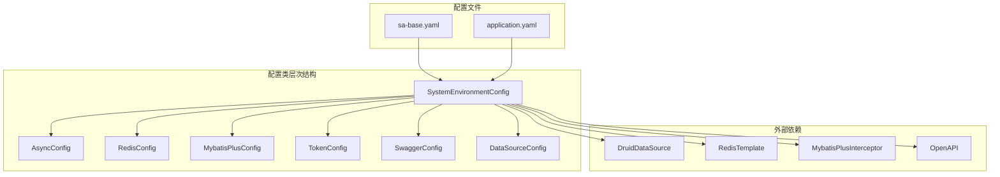
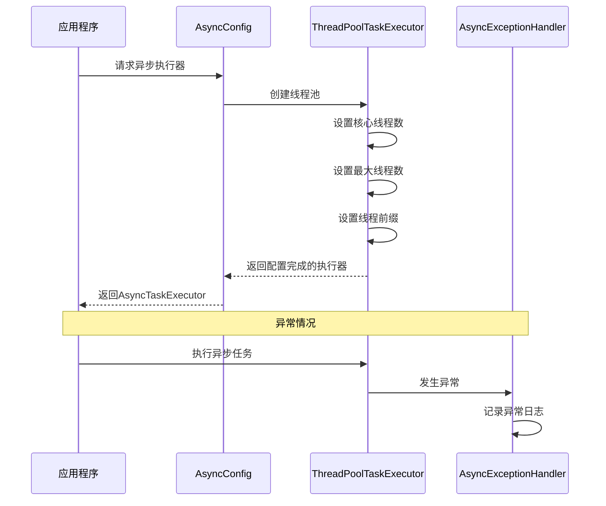
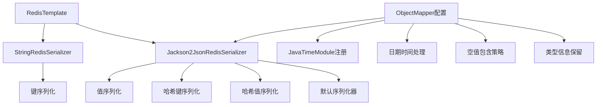
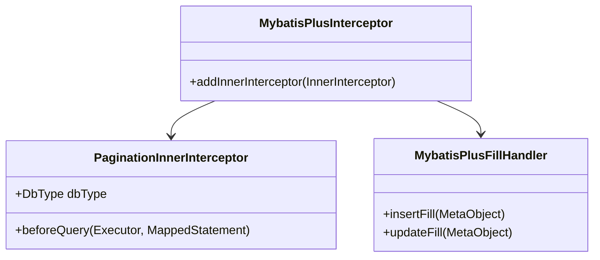
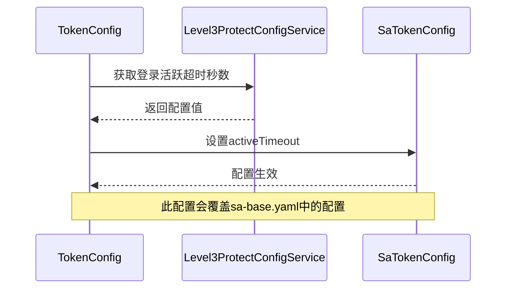
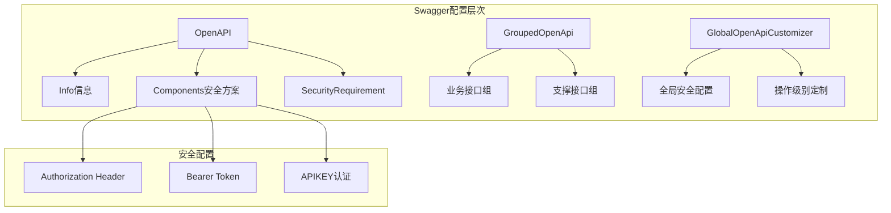
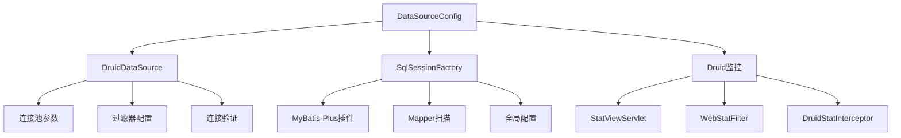
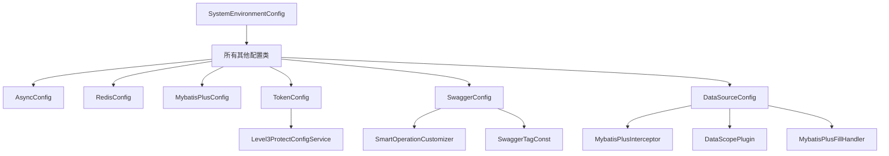

# 基础配置

<cite>
**本文档引用的文件**
- [AsyncConfig.java](file://smart-admin-api-java17-springboot3/sa-base/src/main/java/net/lab1024/sa/base/config/AsyncConfig.java)
- [RedisConfig.java](file://smart-admin-api-java17-springboot3/sa-base/src/main/java/net/lab1024/sa/base/config/RedisConfig.java)
- [MybatisPlusConfig.java](file://smart-admin-api-java17-springboot3/sa-base/src/main/java/net/lab1024/sa/base/config/MybatisPlusConfig.java)
- [TokenConfig.java](file://smart-admin-api-java17-springboot3/sa-base/src/main/java/net/lab1024/sa/base/config/TokenConfig.java)
- [SwaggerConfig.java](file://smart-admin-api-java17-springboot3/sa-base/src/main/java/net/lab1024/sa/base/config/SwaggerConfig.java)
- [DataSourceConfig.java](file://smart-admin-api-java17-springboot3/sa-base/src/main/java/net/lab1024/sa/base/config/DataSourceConfig.java)
- [SystemEnvironmentConfig.java](file://smart-admin-api-java17-springboot3/sa-base/src/main/java/net/lab1024/sa/base/config/SystemEnvironmentConfig.java)
- [sa-base.yaml](file://smart-admin-api-java17-springboot3/sa-base/src/main/resources/dev/sa-base.yaml)
- [RequestHeaderConst.java](file://smart-admin-api-java17-springboot3/sa-base/src/main/java/net/lab1024/sa/base/common/constant/RequestHeaderConst.java)
- [SwaggerTagConst.java](file://smart-admin-api-java17-springboot3/sa-base/src/main/java/net/lab1024/sa/base/constant/SwaggerTagConst.java)
- [MybatisPlusFillHandler.java](file://smart-admin-api-java17-springboot3/sa-base/src/main/java/net/lab1024/sa/base/handler/MybatisPlusFillHandler.java)
</cite>

## 目录
1. [概述](#概述)
2. [配置类架构](#配置类架构)
3. [AsyncConfig异步任务配置](#asyncconfig异步任务配置)
4. [RedisConfig缓存配置](#redisconfig缓存配置)
5. [MybatisPlusConfig持久层配置](#mybatisplusconfig持久层配置)
6. [TokenConfig安全认证配置](#tokenconfig安全认证配置)
7. [SwaggerConfig接口文档配置](#swaggerconfig接口文档配置)
8. [DataSourceConfig数据源配置](#datasourceconfig数据源配置)
9. [配置类依赖关系](#配置类依赖关系)
10. [环境配置差异](#环境配置差异)
11. [扩展配置指南](#扩展配置指南)
12. [总结](#总结)

## 概述

SmartAdmin基础配置模块提供了六个核心配置类，涵盖了异步任务、缓存、持久层、安全认证、接口文档和数据源等关键功能。这些配置类采用Spring的`@Configuration`注解和`@Bean`方法实现组件的自动装配，并通过`@Value`或`@ConfigurationProperties`绑定配置文件属性，确保系统在不同环境下的灵活配置和优化运行。

## 配置类架构



**图表来源**
- [SystemEnvironmentConfig.java](file://smart-admin-api-java17-springboot3/sa-base/src/main/java/net/lab1024/sa/base/config/SystemEnvironmentConfig.java#L23-L58)
- [AsyncConfig.java](file://smart-admin-api-java17-springboot3/sa-base/src/main/java/net/lab1024/sa/base/config/AsyncConfig.java#L24-L72)
- [RedisConfig.java](file://smart-admin-api-java17-springboot3/sa-base/src/main/java/net/lab1024/sa/base/config/RedisConfig.java#L28-L86)

## AsyncConfig异步任务配置

AsyncConfig负责配置应用程序的异步任务执行器，提供高效的线程池管理和异常处理机制。

### 核心特性

- **动态线程池配置**：根据CPU核心数自动计算最优线程数量
- **异常处理机制**：统一的异步任务异常捕获和日志记录
- **命名规范**：线程池具有明确的命名标识，便于监控和调试

### 实现原理



**图表来源**
- [AsyncConfig.java](file://smart-admin-api-java17-springboot3/sa-base/src/main/java/net/lab1024/sa/base/config/AsyncConfig.java#L37-L48)
- [AsyncConfig.java](file://smart-admin-api-java17-springboot3/sa-base/src/main/java/net/lab1024/sa/base/config/AsyncConfig.java#L65-L70)

### 配置特点

| 配置项 | 默认值 | 说明 |
|--------|--------|------|
| 核心线程数 | CPU核心数-1 | 动态计算，避免过度占用资源 |
| 最大线程数 | CPU核心数-1 | 与核心线程数相同，防止线程过多 |
| 线程前缀 | smart-async-executor | 便于识别和监控 |
| 异常处理器 | AsyncExceptionHandler | 统一异常处理 |

**节来源**
- [AsyncConfig.java](file://smart-admin-api-java17-springboot3/sa-base/src/main/java/net/lab1024/sa/base/config/AsyncConfig.java#L37-L72)

## RedisConfig缓存配置

RedisConfig提供完整的Redis连接和序列化配置，支持多种数据类型的存储和高效的数据传输。

### 核心功能

- **Jackson序列化**：支持复杂对象的JSON序列化
- **多种Redis操作类型**：Hash、Value、List、Set、ZSet操作封装
- **连接池配置**：灵活的连接池参数设置

### 序列化配置



**图表来源**
- [RedisConfig.java](file://smart-admin-api-java17-springboot3/sa-base/src/main/java/net/lab1024/sa/base/config/RedisConfig.java#L36-L57)

### 配置参数

| 参数类别 | 配置项 | 开发环境 | 生产环境 | 说明 |
|----------|--------|----------|----------|------|
| 连接配置 | host | 127.0.0.1 | 127.0.0.1 | Redis服务器地址 |
| 连接配置 | port | 6389 | 6379 | Redis服务器端口 |
| 连接配置 | password | zkteco3100 | 空 | Redis认证密码 |
| 连接配置 | timeout | 10000ms | 10000ms | 连接超时时间 |
| 连接池配置 | max-active | 5 | 100 | 最大连接数 |
| 连接池配置 | min-idle | 1 | 10 | 最小空闲连接数 |
| 连接池配置 | max-idle | 3 | 50 | 最大空闲连接数 |
| 连接池配置 | max-wait | 30000ms | 30000ms | 获取连接最大等待时间 |

**节来源**
- [RedisConfig.java](file://smart-admin-api-java17-springboot3/sa-base/src/main/java/net/lab1024/sa/base/config/RedisConfig.java#L28-L86)
- [sa-base.yaml](file://smart-admin-api-java17-springboot3/sa-base/src/main/resources/dev/sa-base.yaml#L23-L37)

## MybatisPlusConfig持久层配置

MybatisPlusConfig配置MyBatis-Plus的核心插件，提供分页查询和自动字段填充功能。

### 核心插件

- **分页插件**：支持MySQL数据库的分页查询
- **自动填充处理器**：自动设置创建时间和更新时间
- **事务管理**：启用Spring事务管理

### 插件架构



**图表来源**
- [MybatisPlusConfig.java](file://smart-admin-api-java17-springboot3/sa-base/src/main/java/net/lab1024/sa/base/config/MybatisPlusConfig.java#L26-L31)
- [MybatisPlusFillHandler.java](file://smart-admin-api-java17-springboot3/sa-base/src/main/java/net/lab1024/sa/base/handler/MybatisPlusFillHandler.java#L16-L41)

### 自动填充机制

| 字段名 | 类型 | 填充时机 | 说明 |
|--------|------|----------|------|
| createTime | LocalDateTime | 插入时 | 记录数据创建时间 |
| updateTime | LocalDateTime | 插入和更新时 | 记录数据最后修改时间 |

**节来源**
- [MybatisPlusConfig.java](file://smart-admin-api-java17-springboot3/sa-base/src/main/java/net/lab1024/sa/base/config/MybatisPlusConfig.java#L19-L34)
- [MybatisPlusFillHandler.java](file://smart-admin-api-java17-springboot3/sa-base/src/main/java/net/lab1024/sa/base/handler/MybatisPlusFillHandler.java#L16-L41)

## TokenConfig安全认证配置

TokenConfig配置Sa-Token的安全认证参数，特别是三级等保要求的最低活跃频率配置。

### 配置特点

- **动态配置**：从Level3ProtectConfigService获取配置值
- **三级等保兼容**：符合网络安全等级保护要求
- **灵活调整**：支持运行时配置修改

### 配置流程



**图表来源**
- [TokenConfig.java](file://smart-admin-api-java17-springboot3/sa-base/src/main/java/net/lab1024/sa/base/config/TokenConfig.java#L26-L30)

### 安全配置参数

| 参数 | 默认值 | 说明 |
|------|--------|------|
| token名称 | Authorization | HTTP请求头中的Token名称 |
| token前缀 | Bearer | Token前缀标识 |
| 有效期 | 2592000秒 | 默认30天，-1表示永久有效 |
| 最低活跃频率 | 动态配置 | 三级等保要求的最小活跃时间 |

**节来源**
- [TokenConfig.java](file://smart-admin-api-java17-springboot3/sa-base/src/main/java/net/lab1024/sa/base/config/TokenConfig.java#L19-L34)

## SwaggerConfig接口文档配置

SwaggerConfig提供完整的API文档配置，支持多环境条件加载和分组管理。

### 核心功能

- **多环境控制**：仅在开发和测试环境启用
- **API分组**：业务接口和支持接口分离
- **安全配置**：集成Token认证机制
- **自定义定制**：支持操作级别的安全配置

### 文档架构



**图表来源**
- [SwaggerConfig.java](file://smart-admin-api-java17-springboot3/sa-base/src/main/java/net/lab1024/sa/base/config/SwaggerConfig.java#L67-L84)
- [SwaggerConfig.java](file://smart-admin-api-java17-springboot3/sa-base/src/main/java/net/lab1024/sa/base/config/SwaggerConfig.java#L102-L119)

### 接口分组配置

| 分组名称 | 路径匹配规则 | 说明 |
|----------|--------------|------|
| 业务接口 | /** | 主要业务功能接口 |
| 支撑接口 | /support/** | 系统支撑功能接口 |
| 白名单路径 | Swagger白名单 | Swagger UI相关路径 |

**节来源**
- [SwaggerConfig.java](file://smart-admin-api-java17-springboot3/sa-base/src/main/java/net/lab1024/sa/base/config/SwaggerConfig.java#L47-L154)
- [SwaggerTagConst.java](file://smart-admin-api-java17-springboot3/sa-base/src/main/java/net/lab1024/sa/base/constant/SwaggerTagConst.java#L12-L60)

## DataSourceConfig数据源配置

DataSourceConfig提供完整的数据库连接池配置，包括Druid监控和MyBatis-Plus集成。

### 核心配置

- **Druid连接池**：高性能数据库连接池
- **SQL监控**：慢查询监控和统计
- **MyBatis-Plus集成**：分页插件和自动填充
- **环境适配**：支持多环境配置切换

### 配置架构



**图表来源**
- [DataSourceConfig.java](file://smart-admin-api-java17-springboot3/sa-base/src/main/java/net/lab1024/sa/base/config/DataSourceConfig.java#L102-L132)
- [DataSourceConfig.java](file://smart-admin-api-java17-springboot3/sa-base/src/main/java/net/lab1024/sa/base/config/DataSourceConfig.java#L134-L153)

### 性能监控配置

| 监控类型 | 配置项 | 开发环境 | 生产环境 | 说明 |
|----------|--------|----------|----------|------|
| SQL统计 | mergeSql | true | true | 合并相似SQL |
| 慢查询阈值 | slowSqlMillis | 1000ms | 1000ms | 慢查询阈值 |
| 日志记录 | logSlowSql | true | true | 记录慢查询日志 |
| 重置功能 | resetEnable | false | false | 是否允许重置统计 |

**节来源**
- [DataSourceConfig.java](file://smart-admin-api-java17-springboot3/sa-base/src/main/java/net/lab1024/sa/base/config/DataSourceConfig.java#L47-L202)

## 配置类依赖关系



**图表来源**
- [SystemEnvironmentConfig.java](file://smart-admin-api-java17-springboot3/sa-base/src/main/java/net/lab1024/sa/base/config/SystemEnvironmentConfig.java#L23-L58)
- [DataSourceConfig.java](file://smart-admin-api-java17-springboot3/sa-base/src/main/java/net/lab1024/sa/base/config/DataSourceConfig.java#L95-L100)

### 初始化顺序

1. **SystemEnvironmentConfig**：首先加载，确定运行环境
2. **TokenConfig**：依赖环境配置，动态设置安全参数
3. **其他配置类**：并行初始化，相互独立

## 环境配置差异

### 开发环境(dev)

- **Redis**：本地开发环境，端口6389
- **数据库**：使用P6Spy进行SQL监控
- **Swagger**：完全启用，支持在线调试
- **日志**：详细级别，便于开发调试

### 生产环境(prod)

- **Redis**：高性能配置，连接池更大
- **数据库**：直连驱动，性能优化
- **Swagger**：禁用，保证安全性
- **日志**：警告级别，减少日志开销

### 预发布环境(pre)

- **配置介于开发和生产之间**
- **Redis连接池适中**
- **数据库监控启用**
- **部分调试功能可用**

**节来源**
- [sa-base.yaml](file://smart-admin-api-java17-springboot3/sa-base/src/main/resources/dev/sa-base.yaml#L1-L187)
- [sa-base.yaml](file://smart-admin-api-java17-springboot3/sa-base/src/main/resources/prod/sa-base.yaml#L1-L184)
- [sa-base.yaml](file://smart-admin-api-java17-springboot3/sa-base/src/main/resources/pre/sa-base.yaml#L1-L188)

## 扩展配置指南

### 添加新的Redis序列化策略

```java
// 在RedisConfig中添加新的序列化器
@Bean
public CustomRedisSerializer customRedisSerializer() {
    return new CustomRedisSerializer();
}

// 修改RedisTemplate配置
@Bean
public RedisTemplate<String, Object> redisTemplate(
        RedisConnectionFactory factory,
        CustomRedisSerializer customRedisSerializer) {
    // 配置自定义序列化器
    template.setValueSerializer(customRedisSerializer);
    return template;
}
```

### 修改MyBatis-Plus分页插件设置

```java
// 在MybatisPlusConfig中添加新的插件
@Bean
public MybatisPlusInterceptor mybatisPlusInterceptor() {
    MybatisPlusInterceptor interceptor = new MybatisPlusInterceptor();
    
    // 添加分页插件
    interceptor.addInnerInterceptor(new PaginationInnerInterceptor(DbType.MYSQL));
    
    // 添加新的插件
    interceptor.addInnerInterceptor(new CustomPaginationInterceptor());
    
    return interceptor;
}
```

### 自定义数据源监控配置

```java
// 在DataSourceConfig中添加自定义监控
@Bean
public DruidDataSource druidDataSource() {
    DruidDataSource dataSource = new DruidDataSource();
    
    // 添加自定义监控过滤器
    List<Filter> filters = new ArrayList<>();
    filters.add(new CustomStatFilter());
    filters.add(new StatFilter());
    
    dataSource.setProxyFilters(filters);
    
    return dataSource;
}
```

### 扩展安全认证配置

```java
// 创建自定义Token配置
@Configuration
public class CustomTokenConfig {
    
    @Bean
    public SaTokenConfig saTokenConfig() {
        SaTokenConfig config = new SaTokenConfig();
        
        // 自定义配置
        config.setTokenStyle("custom-style");
        config.setAutoRenew(false);
        
        return config;
    }
}
```

## 总结

SmartAdmin的基础配置模块通过六个核心配置类实现了完整的系统配置管理：

1. **AsyncConfig**：提供高效的异步任务处理能力
2. **RedisConfig**：实现高性能的缓存解决方案
3. **MybatisPlusConfig**：简化持久层开发，提供自动填充功能
4. **TokenConfig**：确保系统的安全性和合规性
5. **SwaggerConfig**：提供完善的API文档和调试支持
6. **DataSourceConfig**：实现数据库连接池的最优配置

这些配置类采用模块化设计，相互独立但又紧密协作，通过Spring的条件装配机制实现环境适配，通过合理的配置参数确保系统在不同环境下的最佳性能表现。开发者可以根据具体需求对这些配置进行扩展和定制，以满足特定的应用场景要求。