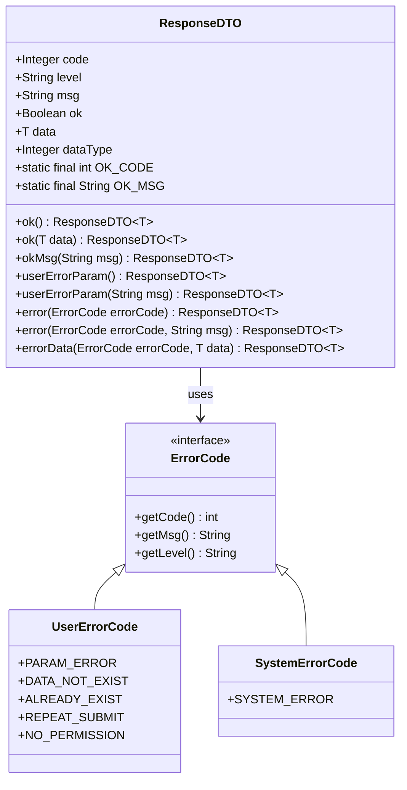

# 通用组件

<cite>
**本文档引用的文件**
- [ResponseDTO.java](file://smart-admin-api-java17-springboot3/sa-base/src/main/java/net/lab1024.sa.base/common/domain/ResponseDTO.java)
- [BusinessException.java](file://smart-admin-api-java17-springboot3/sa-base/src/main/java/net/lab1024.sa.base/common/exception/BusinessException.java)
- [GlobalExceptionHandler.java](file://smart-admin-api-java17-springboot3/sa-base/src/main/java/net/lab1024.sa.base/handler/GlobalExceptionHandler.java)
- [PageResult.java](file://smart-admin-api-java17-springboot3/sa-base/src/main/java/net/lab1024.sa.base/common/domain/PageResult.java)
- [RequestUser.java](file://smart-admin-api-java17-springboot3/sa-base/src/main/java/net/lab1024.sa.base/common/domain/RequestUser.java)
- [SmartRequestUtil.java](file://smart-admin-api-java17-springboot3/sa-base/src/main/java/net/lab1024.sa.base/common/util/SmartRequestUtil.java)
- [SupportBaseController.java](file://smart-admin-api-java17-springboot3/sa-base/src/main/java/net/lab1024.sa.base/common/controller/SupportBaseController.java)
- [FeedbackController.java](file://smart-admin-api-java17-springboot3/sa-base/src/main/java/net/lab1024.sa.base/module/support/feedback/controller/FeedbackController.java)
- [ErrorCode.java](file://smart-admin-api-java17-springboot3/sa-base/src/main/java/net/lab1024.sa.base/common/code/ErrorCode.java)
- [UserErrorCode.java](file://smart-admin-api-java17-springboot3/sa-base/src/main/java/net/lab1024.sa.base/common/code/UserErrorCode.java)
- [SystemErrorCode.java](file://smart-admin-api-java17-springboot3/sa-base/src/main/java/net/lab1024.sa.base/common/code/SystemErrorCode.java)
</cite>

## 目录
1. [简介](#简介)
2. [ResponseDTO统一响应数据结构](#responsedto统一响应数据结构)
3. [BusinessException业务异常处理](#businessexception业务异常处理)
4. [GlobalExceptionHandler全局异常处理](#globalexceptionhandler全局异常处理)
5. [PageResult分页结果对象](#pageresult分页结果对象)
6. [RequestUser请求上下文用户信息](#requestuser请求上下文用户信息)
7. [SupportBaseController基类](#supportbasecontroller基类)
8. [通用组件协同工作流程](#通用组件协同工作流程)
9. [最佳实践与使用规范](#最佳实践与使用规范)
10. [总结](#总结)

## 简介

sa-base模块是Smart Admin系统的核心基础模块，提供了统一的通用组件体系，包括响应数据结构、异常处理、分页支持、用户上下文管理等功能。这些组件为整个系统的标准化和规范化奠定了坚实的基础。

## ResponseDTO统一响应数据结构

### 设计理念

ResponseDTO是整个系统统一的响应数据结构，采用泛型设计，确保类型安全和数据一致性。它遵循RESTful API的最佳实践，提供标准化的响应格式。

### 核心字段详解



**图表来源**
- [ResponseDTO.java](file://smart-admin-api-java17-springboot3/sa-base/src/main/java/net/lab1024.sa.base/common/domain/ResponseDTO.java#L23-L122)
- [ErrorCode.java](file://smart-admin-api-java17-springboot3/sa-base/src/main/java/net/lab1024.sa.base/common/code/ErrorCode.java#L1-L47)

### 字段含义说明

| 字段名 | 类型 | 描述 | 使用场景 |
|--------|------|------|----------|
| code | Integer | 返回码，遵循错误码规范 | 标识响应状态，0表示成功，非0表示各类错误 |
| level | String | 错误级别（system/user/unexpected） | 区分系统级、用户级和意外错误 |
| msg | String | 提示消息，支持国际化 | 向用户展示的友好提示信息 |
| ok | Boolean | 操作成功标识 | 简化成功判断，true表示操作成功 |
| data | T | 泛型数据，可包含任意类型对象 | 返回的具体业务数据 |
| dataType | Integer | 数据类型标识 | 支持不同类型的数据封装 |

### 使用规范

#### 成功响应
```java
// 简单成功响应
ResponseDTO.ok()

// 带数据的成功响应  
ResponseDTO.ok(dataObject)

// 自定义成功消息
ResponseDTO.okMsg("操作完成")
```

#### 错误响应
```java
// 参数错误
ResponseDTO.userErrorParam()

// 参数错误带自定义消息
ResponseDTO.userErrorParam("用户名不能为空")

// 系统错误
ResponseDTO.error(SystemErrorCode.SYSTEM_ERROR)

// 系统错误带自定义消息
ResponseDTO.error(SystemErrorCode.SYSTEM_ERROR, "数据库连接失败")
```

**章节来源**
- [ResponseDTO.java](file://smart-admin-api-java17-springboot3/sa-base/src/main/java/net/lab1024.sa.base/common/domain/ResponseDTO.java#L75-L121)

## BusinessException业务异常处理

### 异常设计原则

BusinessException是专门用于业务逻辑异常的运行时异常，它继承自RuntimeException，不需要强制捕获。当业务逻辑不符合预期时，应抛出此类异常。

### 异常层次结构


**图表来源**
- [BusinessException.java](file://smart-admin-api-java17-springboot3/sa-base/src/main/java/net/lab1024.sa.base/common/exception/BusinessException.java#L14-L38)

### 抛出异常的场景

1. **参数校验失败**：输入参数不符合业务规则
2. **业务逻辑约束**：违反业务约定或数据完整性
3. **权限检查失败**：用户无权执行某操作
4. **资源不存在**：请求的资源不存在或已被删除
5. **状态异常**：资源处于不允许的状态

### 异常抛出示例

```java
// 抛出通用业务异常
throw new BusinessException("订单状态不正确，无法取消");

// 抛出指定错误码的业务异常
throw new BusinessException(UserErrorCode.DATA_NOT_EXIST);

// 带原因的异常
throw new BusinessException("用户不存在", new UserNotFoundException(userId));
```

**章节来源**
- [BusinessException.java](file://smart-admin-api-java17-springboot3/sa-base/src/main/java/net/lab1024.sa.base/common/exception/BusinessException.java#L14-L38)

## GlobalExceptionHandler全局异常处理

### 异常处理架构

GlobalExceptionHandler是一个全局异常处理器，使用@ControllerAdvice注解实现对整个应用层的异常统一处理。


**图表来源**
- [GlobalExceptionHandler.java](file://smart-admin-api-java17-springboot3/sa-base/src/main/java/net/lab1024.sa.base/handler/GlobalExceptionHandler.java#L37-L131)

### 异常处理策略

| 异常类型 | 处理策略 | 返回响应 |
|----------|----------|----------|
| BusinessException | 业务异常统一处理 | 系统错误码，保留原始异常消息 |
| 参数校验异常 | 参数错误处理 | 用户参数错误码 |
| JSON格式异常 | 格式错误处理 | 用户参数错误码 |
| 权限异常 | 权限不足处理 | 权限错误码 |
| 其他异常 | 系统异常处理 | 系统错误码，生产环境隐藏详细信息 |

### 异常处理流程


**图表来源**
- [GlobalExceptionHandler.java](file://smart-admin-api-java17-springboot3/sa-base/src/main/java/net/lab1024.sa.base/handler/GlobalExceptionHandler.java#L46-L116)

**章节来源**
- [GlobalExceptionHandler.java](file://smart-admin-api-java17-springboot3/sa-base/src/main/java/net/lab1024.sa.base/handler/GlobalExceptionHandler.java#L37-L131)

## PageResult分页结果对象

### 分页设计原理

PageResult是专门为分页查询设计的结果对象，包含了分页所需的所有信息，支持前后端分离的分页需求。

### 分页字段说明

| 字段名 | 类型 | 描述 | 计算方式 |
|--------|------|------|----------|
| pageNum | Long | 当前页码 | 客户端传入 |
| pageSize | Long | 每页大小 | 客户端传入 |
| total | Long | 总记录数 | 数据库查询结果 |
| pages | Long | 总页数 | total / pageSize + (total % pageSize == 0 ? 0 : 1) |
| list | List<T> | 当前页数据 | 分片后的数据集合 |
| emptyFlag | Boolean | 是否为空 | list.isEmpty() |

### 分页集成方式


**图表来源**
- [PageResult.java](file://smart-admin-api-java17-springboot3/sa-base/src/main/java/net/lab1024.sa.base/common/domain/PageResult.java#L18-L53)
- [SmartPageUtil.java](file://smart-admin-api-java17-springboot3/sa-base/src/main/java/net/lab1024.sa.base/common/util/SmartPageUtil.java#L25-L118)

### 前端集成示例

前端可以通过以下方式处理分页结果：

```javascript
// 分页查询接口响应
{
  "code": 0,
  "msg": "操作成功",
  "data": {
    "pageNum": 1,
    "pageSize": 10,
    "total": 100,
    "pages": 10,
    "list": [...], // 当前页数据
    "emptyFlag": false
  }
}
```

**章节来源**
- [PageResult.java](file://smart-admin-api-java17-springboot3/sa-base/src/main/java/net/lab1024.sa.base/common/domain/PageResult.java#L18-L53)

## RequestUser请求上下文用户信息

### 用户信息接口设计

RequestUser接口定义了请求上下文中用户信息的标准结构，支持多种类型的用户身份识别。

### 接口方法说明

| 方法名 | 返回类型 | 描述 | 使用场景 |
|--------|----------|------|----------|
| getUserId() | Long | 用户唯一标识 | 业务逻辑中的用户识别 |
| getUserName() | String | 用户显示名称 | 显示给用户的友好名称 |
| getUserType() | UserTypeEnum | 用户类型枚举 | 区分不同类型的用户 |
| getIp() | String | 请求IP地址 | 安全审计和日志记录 |
| getUserAgent() | String | 浏览器标识 | 客户端信息追踪 |

### 上下文管理机制


**图表来源**
- [SmartRequestUtil.java](file://smart-admin-api-java17-springboot3/sa-base/src/main/java/net/lab1024.sa.base/common/util/SmartRequestUtil.java#L16-L42)
- [RequestUser.java](file://smart-admin-api-java17-springboot3/sa-base/src/main/java/net/lab1024.sa.base/common/domain/RequestUser.java#L14-L49)

### 使用示例

```java
// 在控制器中获取当前用户信息
RequestUser currentUser = SmartRequestUtil.getRequestUser();
if (currentUser != null) {
    Long userId = currentUser.getUserId();
    String userName = currentUser.getUserName();
    // 使用用户信息进行业务处理
}
```

**章节来源**
- [RequestUser.java](file://smart-admin-api-java17-springboot3/sa-base/src/main/java/net/lab1024.sa.base/common/domain/RequestUser.java#L14-L49)
- [SmartRequestUtil.java](file://smart-admin-api-java17-springboot3/sa-base/src/main/java/net/lab1024.sa.base/common/util/SmartRequestUtil.java#L16-L42)

## SupportBaseController基类

### 基类设计理念

SupportBaseController作为支撑类业务的基类，提供了统一的URL前缀和基础功能，简化了控制器的开发。

### URL前缀管理


**图表来源**
- [SupportBaseController.java](file://smart-admin-api-java17-springboot3/sa-base/src/main/java/net/lab1024.sa.base/common/controller/SupportBaseController.java#L16-L18)

### 继承使用示例

```java
@RestController
@Tag(name = "意见反馈")
public class FeedbackController extends SupportBaseController {
    
    @Operation(summary = "意见反馈-新增")
    @PostMapping("/feedback/add")
    public ResponseDTO<String> add(@RequestBody @Valid FeedbackAddForm addForm) {
        RequestUser employee = SmartRequestUtil.getRequestUser();
        return feedbackService.add(addForm, employee);
    }
}
```

**章节来源**
- [SupportBaseController.java](file://smart-admin-api-java17-springboot3/sa-base/src/main/java/net/lab1024.sa.base/common/controller/SupportBaseController.java#L16-L18)
- [FeedbackController.java](file://smart-admin-api-java17-springboot3/sa-base/src/main/java/net/lab1024.sa.base/module/support/feedback/controller/FeedbackController.java#L34-L51)

## 通用组件协同工作流程

### 完整的工作流程


### 错误码体系


**图表来源**
- [ErrorCode.java](file://smart-admin-api-java17-springboot3/sa-base/src/main/java/net/lab1024.sa.base/common/code/ErrorCode.java#L1-L47)
- [UserErrorCode.java](file://smart-admin-api-java17-springboot3/sa-base/src/main/java/net/lab1024.sa.base/common/code/UserErrorCode.java#L15-L47)
- [SystemErrorCode.java](file://smart-admin-api-java17-springboot3/sa-base/src/main/java/net/lab1024.sa.base/common/code/SystemErrorCode.java#L17-L39)

**章节来源**
- [ErrorCode.java](file://smart-admin-api-java17-springboot3/sa-base/src/main/java/net/lab1024.sa.base/common/code/ErrorCode.java#L1-L47)

## 最佳实践与使用规范

### 响应数据规范

1. **成功响应**：始终使用 `ResponseDTO.ok()` 或 `ResponseDTO.ok(data)`
2. **错误响应**：根据错误类型选择合适的错误码
3. **数据封装**：复杂数据结构应使用VO对象进行封装
4. **消息国际化**：错误消息应支持多语言

### 异常处理规范

1. **业务异常**：使用 `BusinessException` 处理业务逻辑错误
2. **参数异常**：使用框架验证或手动抛出业务异常
3. **系统异常**：不要手动抛出，让全局异常处理器处理
4. **异常日志**：重要异常必须记录详细日志

### 分页使用规范

1. **参数校验**：对分页参数进行有效性校验
2. **性能考虑**：避免过大的分页查询
3. **数据安全**：确保分页数据的安全性
4. **用户体验**：提供合理的默认分页大小

### 用户上下文规范

1. **及时清理**：在请求结束时清理ThreadLocal
2. **空值检查**：使用用户信息前进行空值检查
3. **安全性**：不要在日志中泄露敏感用户信息
4. **兼容性**：支持匿名用户和已认证用户两种情况

## 总结

sa-base模块的通用组件体系为Smart Admin系统提供了完整的技术基础设施：

1. **ResponseDTO**建立了统一的响应标准，确保前后端交互的一致性
2. **BusinessException**和**GlobalExceptionHandler**形成了完善的异常处理机制
3. **PageResult**支持了高效的分页查询功能
4. **RequestUser**和**SmartRequestUtil**实现了灵活的用户上下文管理
5. **SupportBaseController**简化了控制器的开发工作

这些组件相互协作，构成了一个完整的、标准化的开发框架，大大提高了开发效率和代码质量，为系统的稳定性和可维护性提供了有力保障。

通过遵循本文档中的规范和最佳实践，开发者可以更好地利用这些通用组件，构建高质量的企业级应用系统。