# 模块化设计

<cite>
**本文档中引用的文件**  
- [pom.xml](file://smart-admin-api-java17-springboot3/pom.xml)
- [sa-base/pom.xml](file://smart-admin-api-java17-springboot3/sa-base/pom.xml)
- [sa-admin/pom.xml](file://smart-admin-api-java17-springboot3/sa-admin/pom.xml)
- [AdminApplication.java](file://smart-admin-api-java17-springboot3/sa-admin/src/main/java/net/lab1024/sa/admin/AdminApplication.java)
- [SwaggerConfig.java](file://smart-admin-api-java17-springboot3/sa-base/src/main/java/net/lab1024/sa/base/config/SwaggerConfig.java)
- [MybatisPlusConfig.java](file://smart-admin-api-java17-springboot3/sa-base/src/main/java/net/lab1024/sa/base/config/MybatisPlusConfig.java)
- [GlobalExceptionHandler.java](file://smart-admin-api-java17-springboot3/sa-base/src/main/java/net/lab1024/sa/base/handler/GlobalExceptionHandler.java)
- [PageParam.java](file://smart-admin-api-java17-springboot3/sa-base/src/main/java/net/lab1024/sa/base/common/domain/PageParam.java)
</cite>

## 目录
1. [项目结构](#项目结构)
2. [模块划分原则](#模块划分原则)
3. [sa-base模块公共功能](#sa-base模块公共功能)
4. [sa-admin模块业务实现](#sa-admin模块业务实现)
5. [Maven依赖管理](#maven依赖管理)
6. [包命名规范与代码组织](#包命名规范与代码组织)
7. [模块化设计优势](#模块化设计优势)

## 项目结构

本项目采用Maven多模块架构，主要包含两个核心模块：sa-base基础模块和sa-admin业务模块。项目结构清晰，遵循模块化设计原则，实现了功能分离和职责划分。

**图示来源**  
- [pom.xml](file://smart-admin-api-java17-springboot3/pom.xml#L13-L16)
- [sa-base/pom.xml](file://smart-admin-api-java17-springboot3/sa-base/pom.xml#L4-L8)
- [sa-admin/pom.xml](file://smart-admin-api-java17-springboot3/sa-admin/pom.xml#L4-L8)

**本节来源**  
- [pom.xml](file://smart-admin-api-java17-springboot3/pom.xml#L1-L421)
- [sa-base/pom.xml](file://smart-admin-api-java17-springboot3/sa-base/pom.xml#L1-L276)
- [sa-admin/pom.xml](file://smart-admin-api-java17-springboot3/sa-admin/pom.xml#L1-L47)

## 模块划分原则

项目采用清晰的模块划分原则，将系统分为基础模块（sa-base）和业务模块（sa-admin）。这种划分方式遵循了高内聚、低耦合的设计原则，确保了代码的可维护性和可扩展性。

sa-base模块作为基础支撑模块，提供系统所需的公共功能和基础设施，包括配置管理、工具类、通用实体、异常处理等。该模块不包含任何具体业务逻辑，仅提供可复用的基础组件。

sa-admin模块作为业务实现模块，专注于具体业务功能的实现。该模块依赖于sa-base模块，通过继承和使用基础模块提供的功能来构建具体的业务应用。

这种模块划分方式实现了关注点分离，使得基础功能和业务逻辑相互独立，便于团队协作开发和系统维护。

**本节来源**  
- [pom.xml](file://smart-admin-api-java17-springboot3/pom.xml#L13-L16)
- [sa-admin/pom.xml](file://smart-admin-api-java17-springboot3/sa-admin/pom.xml#L20-L24)
- [AdminApplication.java](file://smart-admin-api-java17-springboot3/sa-admin/src/main/java/net/lab1024/sa/admin/AdminApplication.java#L1-L41)

## sa-base模块公共功能

sa-base模块提供了丰富的公共功能，为整个系统提供基础支撑。这些功能包括配置类、工具类、通用实体和异常处理机制。

### 配置类
sa-base模块包含多种配置类，如SwaggerConfig用于API文档配置，MybatisPlusConfig用于MyBatis-Plus框架配置。这些配置类通过Spring的@Configuration注解定义，实现了系统组件的集中管理和配置。

### 工具类
模块提供了大量的工具类，位于util包下，涵盖了字符串处理、集合操作、日期时间处理等常用功能。这些工具类设计为静态方法，便于在系统各处调用。

### 通用实体
common.domain包中定义了通用的数据传输对象（DTO）和分页参数（PageParam），如ResponseDTO用于统一响应格式，PageParam用于标准化分页请求。这些通用实体确保了系统接口的一致性和规范性。

### 异常处理
通过GlobalExceptionHandler实现全局异常处理机制，统一处理系统中的各种异常情况。该处理器能够捕获业务异常、参数验证异常、权限异常等，并返回标准化的错误响应。

```mermaid
classDiagram
class GlobalExceptionHandler {
+ResponseDTO jsonFormatExceptionHandler()
+ResponseDTO paramExceptionHandler()
+ResponseDTO permissionException()
+ResponseDTO businessExceptionHandler()
+ResponseDTO errorHandler()
}
class ResponseDTO {
+Integer code
+String msg
+T data
+static ResponseDTO success()
+static ResponseDTO error()
}
class PageParam {
+Long pageNum
+Long pageSize
+Boolean searchCount
+SortItem[] sortItemList
}
class SortItem {
+Boolean isAsc
+String column
}
GlobalExceptionHandler --> ResponseDTO : "返回"
PageParam --> SortItem : "包含"
```

**图示来源**  
- [GlobalExceptionHandler.java](file://smart-admin-api-java17-springboot3/sa-base/src/main/java/net/lab1024/sa/base/handler/GlobalExceptionHandler.java#L36-L131)
- [PageParam.java](file://smart-admin-api-java17-springboot3/sa-base/src/main/java/net/lab1024/sa/base/common/domain/PageParam.java#L23-L58)
- [SwaggerConfig.java](file://smart-admin-api-java17-springboot3/sa-base/src/main/java/net/lab1024/sa/base/config/SwaggerConfig.java#L47-L153)
- [MybatisPlusConfig.java](file://smart-admin-api-java17-springboot3/sa-base/src/main/java/net/lab1024/sa/base/config/MybatisPlusConfig.java#L19-L33)

**本节来源**  
- [sa-base/src/main/java/net/lab1024/sa/base/config/](file://smart-admin-api-java17-springboot3/sa-base/src/main/java/net/lab1024/sa/base/config/)
- [sa-base/src/main/java/net/lab1024/sa/base/handler/](file://smart-admin-api-java17-springboot3/sa-base/src/main/java/net/lab1024/sa/base/handler/)
- [sa-base/src/main/java/net/lab1024/sa/base/common/domain/](file://smart-admin-api-java17-springboot3/sa-base/src/main/java/net/lab1024/sa/base/common/domain/)

## sa-admin模块业务实现

sa-admin模块是系统的业务实现核心，负责具体业务功能的开发和实现。该模块通过依赖sa-base模块，获得了所有基础功能支持，可以专注于业务逻辑的开发。

### 依赖关系
sa-admin模块在pom.xml中明确声明了对sa-base模块的依赖，通过Maven的依赖管理机制，实现了模块间的功能复用。这种依赖关系确保了sa-admin模块可以无缝使用sa-base提供的所有公共功能。

### 业务实现
模块通过@ComponentScan注解扫描net.lab1024.sa包下的所有组件，实现了自动装配和依赖注入。业务功能通常按照module组织，每个业务模块包含控制器、服务层和数据访问层，遵循典型的三层架构模式。

### 启动配置
AdminApplication作为系统启动类，通过@SpringBootApplication注解启用Spring Boot的自动配置功能。同时，通过@EnableCaching、@EnableScheduling等注解启用缓存、定时任务等高级功能。

**图示来源**  
- [AdminApplication.java](file://smart-admin-api-java17-springboot3/sa-admin/src/main/java/net/lab1024/sa/admin/AdminApplication.java#L24-L39)
- [sa-admin/pom.xml](file://smart-admin-api-java17-springboot3/sa-admin/pom.xml#L20-L24)
- [sa-base/src/main/java/net/lab1024/sa/base/util/](file://smart-admin-api-java17-springboot3/sa-base/src/main/java/net/lab1024/sa/base/util/)

**本节来源**  
- [AdminApplication.java](file://smart-admin-api-java17-springboot3/sa-admin/src/main/java/net/lab1024/sa/admin/AdminApplication.java#L1-L41)
- [sa-admin/pom.xml](file://smart-admin-api-java17-springboot3/sa-admin/pom.xml#L1-L47)

## Maven依赖管理

项目采用Maven进行依赖管理，通过多模块结构实现了依赖的层次化管理。父POM（sa-parent）定义了所有模块共享的依赖版本和插件配置，确保了依赖的一致性。

### 父模块配置
sa-parent模块作为父POM，通过<dependencyManagement>标签统一管理所有依赖的版本号。这种方式避免了版本冲突，确保了项目中使用的依赖版本一致。

### 基础模块依赖
sa-base模块依赖了Spring Boot、MyBatis-Plus、Sa-Token等核心框架，以及各种工具库如Hutool、Apache Commons等。这些依赖为系统提供了基础功能支持。

### 业务模块依赖
sa-admin模块仅依赖于sa-base模块，不直接依赖其他第三方库。这种设计减少了依赖的复杂性，提高了系统的稳定性。

**图示来源**  
- [pom.xml](file://smart-admin-api-java17-springboot3/pom.xml#L18-L332)
- [sa-base/pom.xml](file://smart-admin-api-java17-springboot3/sa-base/pom.xml#L17-L272)
- [sa-admin/pom.xml](file://smart-admin-api-java17-springboot3/sa-admin/pom.xml#L18-L26)

**本节来源**  
- [pom.xml](file://smart-admin-api-java17-springboot3/pom.xml#L1-L421)
- [sa-base/pom.xml](file://smart-admin-api-java17-springboot3/sa-base/pom.xml#L1-L276)
- [sa-admin/pom.xml](file://smart-admin-api-java17-springboot3/sa-admin/pom.xml#L1-L47)

## 包命名规范与代码组织

项目遵循统一的包命名规范和代码组织结构，提高了代码的可读性和可维护性。

### 包命名规范
采用net.lab1024.sa.{module}.{layer}的命名规范：
- net.lab1024.sa：基础包名
- {module}：模块名称（base或admin）
- {layer}：层次结构（config、controller、service、dao等）

### 代码组织结构
#### sa-base模块结构
- config：配置类
- constant：常量定义
- controller：基础控制器
- domain：通用实体
- enumeration：枚举类型
- exception：异常处理
- handler：处理器
- listener：监听器
- util：工具类

#### sa-admin模块结构
- config：模块特定配置
- constant：业务常量
- interceptor：拦截器
- module：业务模块
- util：业务工具类

这种组织方式确保了代码的层次清晰，便于开发人员快速定位和理解代码。

**本节来源**  
- [项目结构](file://smart-admin-api-java17-springboot3/)
- [AdminApplication.java](file://smart-admin-api-java17-springboot3/sa-admin/src/main/java/net/lab1024/sa/admin/AdminApplication.java#L32)
- [sa-base/src/main/java/net/lab1024/sa/base/](file://smart-admin-api-java17-springboot3/sa-base/src/main/java/net/lab1024/sa/base/)

## 模块化设计优势

本项目的模块化设计带来了诸多优势，显著提升了系统的质量和开发效率。

### 代码复用
sa-base模块提供了大量可复用的公共功能，避免了代码重复。业务模块可以直接使用这些功能，无需重新实现，大大提高了开发效率。

### 降低耦合度
通过明确的模块划分和依赖关系，降低了模块间的耦合度。sa-admin模块仅依赖于sa-base的接口和公共类，而不关心其具体实现，符合依赖倒置原则。

### 提高可维护性
模块化设计使得系统更易于维护。当需要修改基础功能时，只需在sa-base模块中进行修改，所有依赖该模块的业务模块将自动获得更新。同时，问题定位更加容易，可以快速确定问题所在的模块。

### 便于团队协作
不同的开发团队可以并行开发不同的模块，互不影响。基础团队负责维护sa-base模块，业务团队专注于sa-admin模块的开发，提高了团队协作效率。

### 易于测试
模块化设计使得单元测试和集成测试更加容易。可以独立测试每个模块的功能，确保其正确性。同时，mock技术可以轻松模拟模块间的依赖关系。

**本节来源**  
- [整体项目结构](file://smart-admin-api-java17-springboot3/)
- [模块依赖关系](file://smart-admin-api-java17-springboot3/sa-admin/pom.xml#L20-L24)
- [代码组织方式](file://smart-admin-api-java17-springboot3/sa-base/src/main/java/net/lab1024/sa/base/)