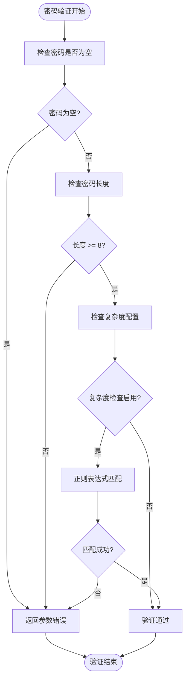
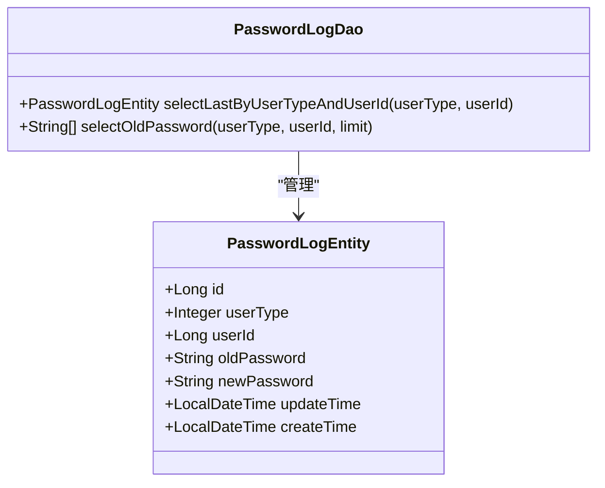
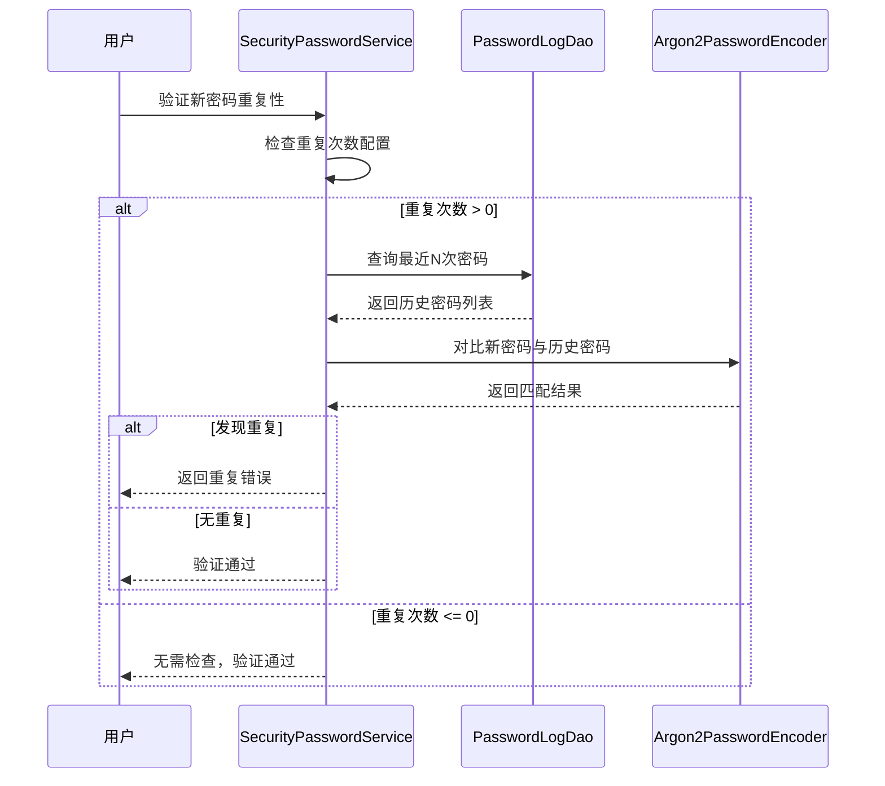
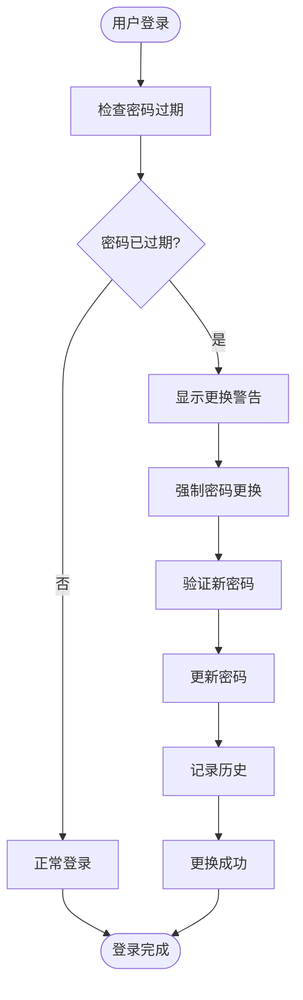
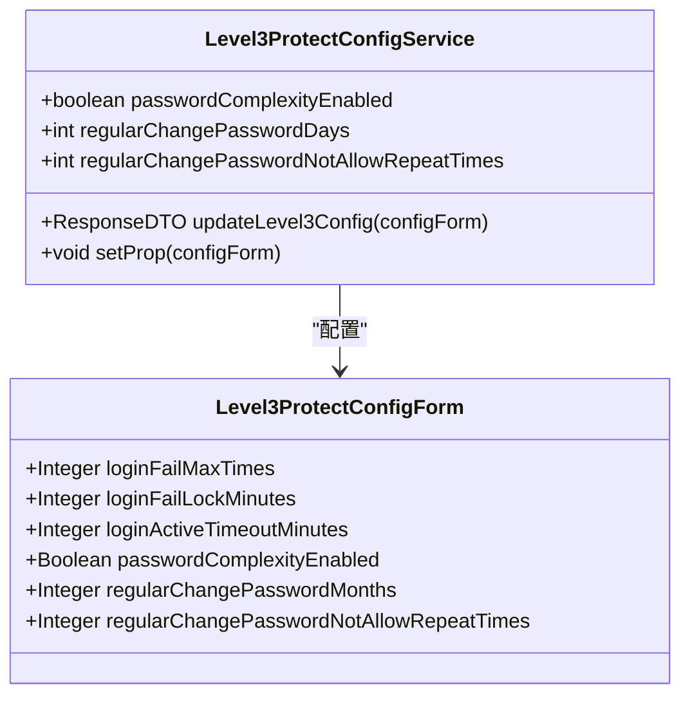
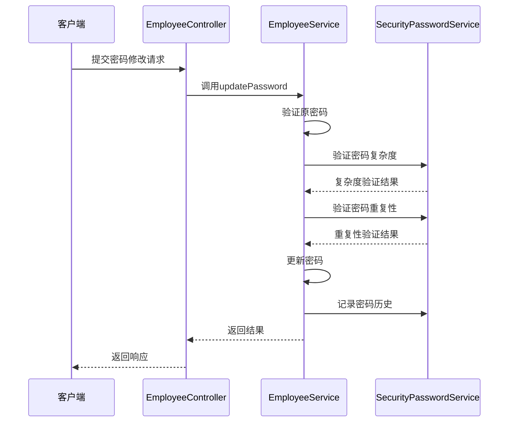
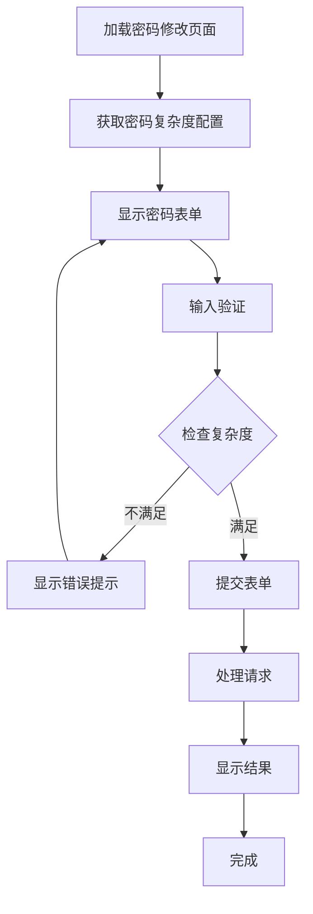

# 密码安全策略

<cite>
**本文档中引用的文件**
- [SecurityPasswordService.java](file://smart-admin-api-java17-springboot3\sa-base\src\main\java\net\lab1024\sa\base\module\support\securityprotect\service\SecurityPasswordService.java)
- [Level3ProtectConfigService.java](file://smart-admin-api-java17-springboot3\sa-base\src\main\java\net\lab1024\sa\base\module\support\securityprotect\service\Level3ProtectConfigService.java)
- [PasswordLogEntity.java](file://smart-admin-api-java17-springboot3\sa-base\src\main\java\net\lab1024\sa\base\module\support\securityprotect\domain\PasswordLogEntity.java)
- [PasswordLogDao.java](file://smart-admin-api-java17-springboot3\sa-base\src\main\java\net\lab1024\sa\base\module\support\securityprotect\dao\PasswordLogDao.java)
- [Level3ProtectConfigForm.java](file://smart-admin-api-java17-springboot3\sa-base\src\main\java\net\lab1024\sa\base\module\support\securityprotect\domain\Level3ProtectConfigForm.java)
- [EmployeeController.java](file://smart-admin-api-java17-springboot3\sa-admin\src\main\java\net\lab1024\sa\admin\module\system\employee\controller\EmployeeController.java)
- [EmployeeService.java](file://smart-admin-api-java17-springboot3\sa-admin\src\main\java\net\lab1024\sa\admin\module\system\employee\service\EmployeeService.java)
- [index.vue](file://smart-admin-web-javascript\src\views\system\account\components\password\index.vue)
- [level3-protect-config-index.vue](file://smart-admin-web-javascript\src\views\support\level3protect\level3-protect-config-index.vue)
- [PasswordLogMapper.xml](file://smart-admin-api-java17-springboot3\sa-base\src\main\resources\mapper\support\PasswordLogMapper.xml)
</cite>

## 目录
1. [概述](#概述)
2. [密码复杂度验证规则](#密码复杂度验证规则)
3. [密码历史记录检查机制](#密码历史记录检查机制)
4. [密码定期更换策略](#密码定期更换策略)
5. [密码策略配置](#密码策略配置)
6. [API接口说明](#api接口说明)
7. [三级等保要求适配](#三级等保要求适配)
8. [审计日志记录](#审计日志记录)
9. [前端界面集成](#前端界面集成)
10. [最佳实践建议](#最佳实践建议)

## 概述

SmartAdmin系统实现了基于三级等保要求的完整密码安全策略，通过SecurityPasswordService提供密码管理核心功能，确保系统符合国家信息安全等级保护标准。该策略涵盖密码复杂度验证、历史密码检查、定期更换提醒等多个维度的安全控制。

### 核心特性

- **密码复杂度验证**：支持长度8-20位，包含大小写字母、数字、特殊符号三种及以上组合
- **历史密码检查**：防止用户重复使用最近N次的历史密码
- **定期更换策略**：支持自定义密码有效期和更换提醒机制
- **Argon2加密算法**：采用业界领先的密码哈希算法
- **灵活配置管理**：支持动态调整密码安全参数

## 密码复杂度验证规则

### 验证规则实现

系统通过正则表达式实现严格的密码复杂度验证，确保密码满足三级等保要求。



**图表来源**
- [SecurityPasswordService.java](file://smart-admin-api-java17-springboot3\sa-base\src\main\java\net\lab1024\sa\base\module\support\securityprotect\service\SecurityPasswordService.java#L45-L76)

### 正则表达式规则详解

密码复杂度验证使用以下正则表达式：

```
^(?![a-zA-Z]+$)(?![A-Z0-9]+$)(?![A-Z\W_!@#$%^&*`~()-+=]+$)(?![a-z0-9]+$)(?![a-z\W_!@#$%^&*`~()-+=]+$)(?![0-9\W_!@#$%^&*`~()-+=]+$)[a-zA-Z0-9\W_!@#$%^&*`~()-+=]*$
```

该正则表达式的含义：
- 不允许仅包含字母、数字或特殊符号的单一类型组合
- 必须包含三种及以上字符类型的组合
- 支持的特殊符号包括：@#$%^&*()_+-=

### 验证消息提示

当密码不符合要求时，系统会返回明确的错误提示信息：
- **通用提示**："密码必须为长度8-20位且必须包含大小写字母、数字、特殊符号（如：@#$%^&*()_+-=）等三种字符"

**节来源**
- [SecurityPasswordService.java](file://smart-admin-api-java17-springboot3\sa-base\src\main\java\net\lab1024\sa\base\module\support\securityprotect\service\SecurityPasswordService.java#L34-L76)

## 密码历史记录检查机制

### 数据模型设计

系统通过PasswordLogEntity实体记录用户的密码变更历史，确保密码重复使用的有效控制。



**图表来源**
- [PasswordLogEntity.java](file://smart-admin-api-java17-springboot3\sa-base\src\main\java\net\lab1024\sa\base\module\support\securityprotect\domain\PasswordLogEntity.java#L15-L43)
- [PasswordLogDao.java](file://smart-admin-api-java17-springboot3\sa-base\src\main\java\net\lab1024\sa\base\module\support\securityprotect\dao\PasswordLogDao.java#L15-L33)

### 历史密码检查流程



**图表来源**
- [SecurityPasswordService.java](file://smart-admin-api-java17-springboot3\sa-base\src\main\java\net\lab1024\sa\base\module\support\securityprotect\service\SecurityPasswordService.java#L78-L95)

### 密码历史记录存储

每次密码修改时，系统自动记录旧密码和新密码到密码日志表中：

1. **记录时机**：用户成功修改密码后立即记录
2. **加密存储**：使用Argon2算法对密码进行哈希处理
3. **关联信息**：记录用户类型、用户ID、操作时间等元数据
4. **查询优化**：通过用户类型和ID建立索引，提高查询效率

**节来源**
- [SecurityPasswordService.java](file://smart-admin-api-java17-springboot3\sa-base\src\main\java\net\lab1024\sa\base\module\support\securityprotect\service\SecurityPasswordService.java#L115-L125)

## 密码定期更换策略

### 更换策略配置

系统支持灵活的密码定期更换策略配置，完全符合三级等保要求。

| 配置项 | 默认值 | 说明 |
|--------|--------|------|
| 定期修改密码时间间隔 | 90天 | 建议每90天更换一次密码 |
| 不允许重复次数 | 3次 | 最近3次内不能重复使用 |
| 密码复杂度检查 | 启用 | 强制执行密码复杂度验证 |

### 更换提醒机制



**图表来源**
- [SecurityPasswordService.java](file://smart-admin-api-java17-springboot3\sa-base\src\main\java\net\lab1024\sa\base\module\support\securityprotect\service\SecurityPasswordService.java#L127-L142)

### 强制更换逻辑

系统在以下情况下触发强制密码更换：

1. **密码过期检查**：根据最后修改时间计算是否超过设定周期
2. **首次登录**：新用户首次登录时强制更换初始密码
3. **管理员重置**：管理员重置用户密码后强制更换
4. **安全事件**：发生安全事件后强制更换密码

**节来源**
- [SecurityPasswordService.java](file://smart-admin-api-java17-springboot3\sa-base\src\main\java\net\lab1024\sa\base\module\support\securityprotect\service\SecurityPasswordService.java#L127-L142)

## 密码策略配置

### 配置服务架构

Level3ProtectConfigService提供了完整的密码策略配置管理功能。



**图表来源**
- [Level3ProtectConfigService.java](file://smart-admin-api-java17-springboot3\sa-base\src\main\java\net\lab1024\sa\base\module\support\securityprotect\service\Level3ProtectConfigService.java#L28-L189)
- [Level3ProtectConfigForm.java](file://smart-admin-api-java17-springboot3\sa-base\src\main\java\net\lab1024\sa\base\module\support\securityprotect\domain\Level3ProtectConfigForm.java#L18-L57)

### 配置参数说明

| 参数名称 | 类型 | 默认值 | 说明 |
|----------|------|--------|------|
| passwordComplexityEnabled | Boolean | true | 密码复杂度检查开关 |
| regularChangePasswordDays | Integer | 90 | 密码定期更换天数 |
| regularChangePasswordNotAllowRepeatTimes | Integer | 3 | 允许重复使用的历史次数 |
| loginFailMaxTimes | Integer | -1 | 连续登录失败最大次数 |
| loginFailLockSeconds | Integer | 1800 | 登录失败锁定时间（秒） |

### 动态配置更新

系统支持运行时动态更新密码策略配置，无需重启服务：

1. **配置解析**：从数据库读取JSON格式的配置信息
2. **参数设置**：自动映射配置参数到服务实例
3. **生效通知**：通知相关组件应用新的配置
4. **持久化存储**：将配置更新保存到数据库

**节来源**
- [Level3ProtectConfigService.java](file://smart-admin-api-java17-springboot3\sa-base\src\main\java\net\lab1024\sa\base\module\support\securityprotect\service\Level3ProtectConfigService.java#L152-L189)

## API接口说明

### 密码修改接口

#### 接口路径：`POST /employee/update/password`

**请求参数**：
```json
{
  "employeeId": 1,
  "oldPassword": "old_password",
  "newPassword": "new_password"
}
```

**响应示例**：
```json
{
  "code": 200,
  "data": null,
  "msg": "修改成功"
}
```

#### 接口流程



**图表来源**
- [EmployeeController.java](file://smart-admin-api-java17-springboot3\sa-admin\src\main\java\net\lab1024\sa\admin\module\system\employee\controller\EmployeeController.java#L93-L98)
- [EmployeeService.java](file://smart-admin-api-java17-springboot3\sa-admin\src\main\java\net\lab1024\sa\admin\module\system\employee\service\EmployeeService.java#L355-L383)

### 密码重置接口

#### 接口路径：`GET /employee/update/password/reset/{employeeId}`

**权限要求**：需要`system:employee:password:reset`权限

**功能说明**：管理员可重置指定用户的密码，系统自动生成随机密码并发送给用户。

### 密码复杂度查询接口

#### 接口路径：`GET /employee/getPasswordComplexityEnabled`

**响应示例**：
```json
{
  "code": 200,
  "data": true,
  "msg": "获取成功"
}
```

**节来源**
- [EmployeeController.java](file://smart-admin-api-java17-springboot3\sa-admin\src\main\java\net\lab1024\sa\admin\module\system\employee\controller\EmployeeController.java#L93-L116)

## 三级等保要求适配

### 等保标准对照

| 三级等保要求 | 系统实现 | 配置参数 |
|-------------|----------|----------|
| 密码复杂度 | 强制执行8-20位密码，包含三种字符类型 | passwordComplexityEnabled=true |
| 密码定期更换 | 支持90天周期更换密码 | regularChangePasswordDays=90 |
| 密码历史控制 | 防止重复使用最近3次密码 | regularChangePasswordNotAllowRepeatTimes=3 |
| 密码加密存储 | 使用Argon2算法加密 | 自动配置 |
| 登录失败控制 | 支持连续失败锁定机制 | loginFailMaxTimes=5, loginFailLockSeconds=1800 |

### 配置模板

#### 默认三级等保配置
```json
{
  "loginFailMaxTimes": 5,
  "loginFailLockMinutes": 30,
  "loginActiveTimeoutMinutes": 30,
  "passwordComplexityEnabled": true,
  "regularChangePasswordMonths": 3,
  "regularChangePasswordNotAllowRepeatTimes": 3,
  "twoFactorLoginEnabled": true,
  "fileDetectFlag": true,
  "maxUploadFileSizeMb": 50
}
```

#### 无保护配置（测试环境）
```json
{
  "loginFailMaxTimes": 0,
  "loginFailLockMinutes": 0,
  "loginActiveTimeoutMinutes": 0,
  "passwordComplexityEnabled": false,
  "regularChangePasswordMonths": 0,
  "regularChangePasswordNotAllowRepeatTimes": 0,
  "twoFactorLoginEnabled": false,
  "fileDetectFlag": false,
  "maxUploadFileSizeMb": 0
}
```

**节来源**
- [level3-protect-config-index.vue](file://smart-admin-web-javascript\src\views\support\level3protect\level3-protect-config-index.vue#L110-L175)

## 审计日志记录

### 密码操作审计

系统通过操作日志机制记录所有密码相关的安全事件：

1. **密码修改记录**：记录每次密码修改的时间、用户、IP地址等信息
2. **密码重置记录**：记录管理员重置密码的操作详情
3. **密码验证记录**：记录密码复杂度验证的结果
4. **安全事件记录**：记录密码相关的异常访问情况

### 日志字段设计

| 字段名 | 类型 | 说明 |
|--------|------|------|
| operateUserId | Long | 操作用户ID |
| operateUserType | Integer | 用户类型 |
| moduleName | String | 模块名称（密码管理） |
| operateContent | String | 操作内容 |
| successFlag | Boolean | 操作是否成功 |
| ip | String | IP地址 |
| userAgent | String | 浏览器标识 |
| createTime | DateTime | 操作时间 |

### 合规性验证

系统提供多种方式验证密码策略的合规性：

1. **配置检查**：验证密码策略配置是否符合三级等保要求
2. **历史审计**：通过密码历史记录验证密码更换策略的有效性
3. **实时监控**：监控密码相关操作的异常行为
4. **报告生成**：生成密码安全策略执行情况的审计报告

## 前端界面集成

### 密码修改组件

前端密码修改组件提供了完整的用户体验：



**图表来源**
- [index.vue](file://smart-admin-web-javascript\src\views\system\account\components\password\index.vue#L39-L50)

### 前端验证规则

前端实现了与后端一致的密码验证规则：

1. **正则表达式验证**：使用相同的正则表达式验证密码格式
2. **实时提示**：根据系统配置动态显示密码复杂度要求
3. **确认密码检查**：确保新密码与确认密码一致
4. **错误处理**：友好的错误提示和用户体验

### 配置界面

管理员可通过专门的配置界面调整密码安全策略：

1. **可视化配置**：通过表单界面直观配置各项参数
2. **即时生效**：配置更改后立即生效，无需重启服务
3. **默认恢复**：提供一键恢复默认配置的功能
4. **安全提示**：在清除配置时提供安全风险提示

**节来源**
- [index.vue](file://smart-admin-web-javascript\src\views\system\account\components\password\index.vue#L24-L55)

## 最佳实践建议

### 密码策略优化

1. **定期评估**：建议每季度评估密码策略的有效性
2. **用户教育**：加强用户密码安全意识培训
3. **监控告警**：建立密码安全事件的监控和告警机制
4. **备份策略**：制定密码丢失的应急响应预案

### 性能优化建议

1. **索引优化**：为密码历史表建立适当的索引
2. **缓存策略**：缓存频繁访问的配置信息
3. **异步处理**：将密码历史记录等操作异步化
4. **分页查询**：对大量历史记录采用分页查询

### 安全加固措施

1. **多因子认证**：启用双因子登录增强安全性
2. **访问控制**：严格控制密码管理相关接口的访问权限
3. **加密传输**：确保所有密码相关通信都使用HTTPS
4. **定期扫描**：定期进行安全漏洞扫描和渗透测试

### 维护和监控

1. **日志轮转**：定期清理和归档密码操作日志
2. **容量规划**：监控密码历史表的增长趋势
3. **性能监控**：监控密码验证和历史查询的性能指标
4. **备份恢复**：建立密码相关数据的备份和恢复机制

通过实施这套完整的密码安全策略，SmartAdmin系统能够有效防范密码相关的安全威胁，满足三级等保的安全要求，为用户提供可靠的身份认证保障。