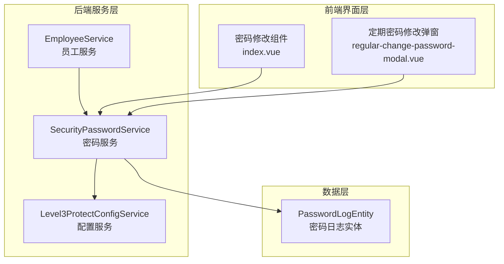
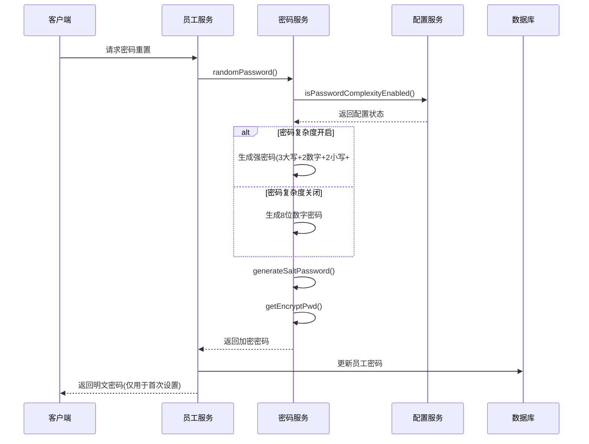
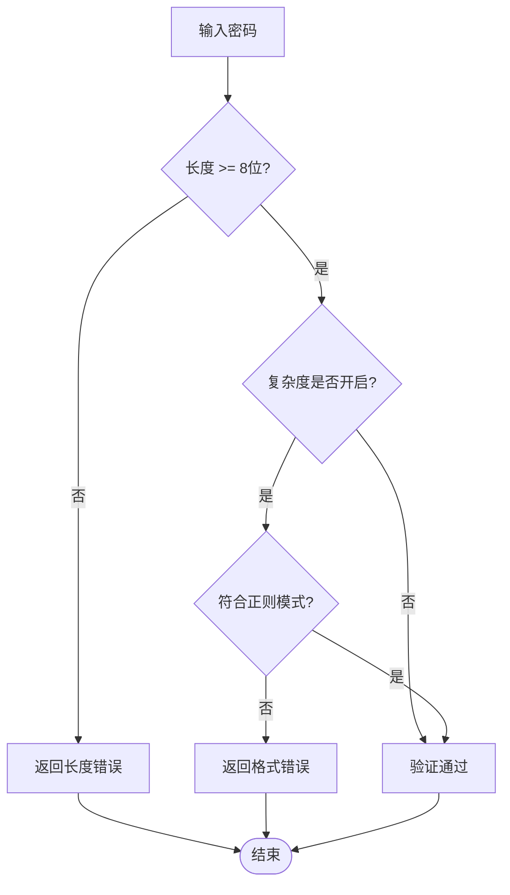
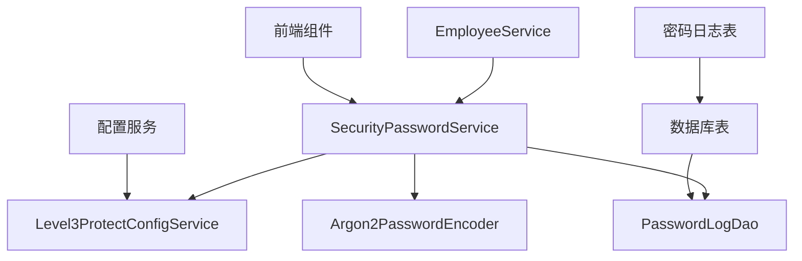

# 随机密码生成

<cite>
**本文档中引用的文件**
- [SecurityPasswordService.java](file://smart-admin-api-java17-springboot3/sa-base/src/main/java/net/lab1024/sa/base/module/support/securityprotect/service/SecurityPasswordService.java)
- [Level3ProtectConfigService.java](file://smart-admin-api-java17-springboot3/sa-base/src/main/java/net/lab1024/sa/base/module/support/securityprotect/service/Level3ProtectConfigService.java)
- [EmployeeService.java](file://smart-admin-api-java17-springboot3/sa-admin/src/main/Java/net/lab1024/sa/admin/module/system/employee/service/EmployeeService.java)
- [PasswordLogEntity.java](file://smart-admin-api-java17-springboot3/sa-base/src/main/java/net/lab1024/sa/base/module/support/securityprotect/domain/PasswordLogEntity.java)
- [index.vue](file://smart-admin-web-javascript/src/views/system/account/components/password/index.vue)
</cite>

## 目录
1. [简介](#简介)
2. [项目结构](#项目结构)
3. [核心组件](#核心组件)
4. [架构概述](#架构概述)
5. [详细组件分析](#详细组件分析)
6. [依赖关系分析](#依赖关系分析)
7. [性能考虑](#性能考虑)
8. [故障排除指南](#故障排除指南)
9. [结论](#结论)

## 简介

本文档详细介绍了一个基于三级等保标准的安全密码生成系统，该系统提供了灵活的密码生成策略，支持强密码和降级密码两种模式。系统采用Argon2密码哈希算法确保密码安全性，并通过Level3ProtectConfigService动态配置密码复杂度要求。

## 项目结构

密码生成系统主要分布在以下模块中：



**图表来源**
- [SecurityPasswordService.java](file://smart-admin-api-java17-springboot3/sa-base/src/main/java/net/lab1024/sa/base/module/support/securityprotect/service/SecurityPasswordService.java#L1-L157)
- [Level3ProtectConfigService.java](file://smart-admin-api-java17-springboot3/sa-base/src/main/java/net/lab1024/sa/base/module/support/securityprotect/service/Level3ProtectConfigService.java#L1-L189)

## 核心组件

### SecurityPasswordService - 密码服务

SecurityPasswordService是密码生成的核心服务类，负责：
- 随机密码生成
- 密码复杂度验证
- 密码重复性检查
- 密码加密和匹配

### Level3ProtectConfigService - 配置服务

Level3ProtectConfigService提供三级等保配置管理，包括：
- 密码复杂度开关控制
- 定期密码修改策略
- 登录失败锁定机制
- 双因子认证配置

### EmployeeService - 员工服务

EmployeeService在员工管理过程中调用密码生成功能，用于：
- 新员工初始密码设置
- 员工密码重置
- 密码加盐处理

**章节来源**
- [SecurityPasswordService.java](file://smart-admin-api-java17-springboot3/sa-base/src/main/java/net/lab1024/sa/base/module/support/securityprotect/service/SecurityPasswordService.java#L27-L157)
- [Level3ProtectConfigService.java](file://smart-admin-api-java17-springboot3/sa-base/src/main/java/net/lab1024/sa/base/module/support/securityprotect/service/Level3ProtectConfigService.java#L26-L189)

## 架构概述

密码生成系统采用分层架构设计，确保安全性和可维护性：



**图表来源**
- [EmployeeService.java](file://smart-admin-api-java17-springboot3/sa-admin/src/main/java/net/lab1024/sa/admin/module/system/employee/service/EmployeeService.java#L145-L153)
- [SecurityPasswordService.java](file://smart-admin-api-java17-springboot3/sa-base/src/main/java/net/lab1024/sa/base/module/support/securityprotect/service/SecurityPasswordService.java#L97-L107)

## 详细组件分析

### randomPassword 方法实现

randomPassword方法是密码生成的核心逻辑，根据配置动态选择生成策略：

#### 强密码生成逻辑

当密码复杂度开启时，系统生成包含以下特征的10位强密码：
- 3位大写字母（RandomStringUtils.randomAlphabetic(3).toUpperCase()）
- 2位数字（RandomStringUtils.randomNumeric(2)）
- 2位小写字母（RandomStringUtils.randomAlphabetic(2).toLowerCase()）
- 1位特殊符号（ThreadLocalRandom.current().nextBoolean() ? "#" : "@"）

```mermaid
flowchart TD
Start([开始生成密码]) --> CheckComplexity{密码复杂度是否开启?}
CheckComplexity --> |否| NumericOnly[生成8位纯数字密码]
CheckComplexity --> |是| StrongPassword[生成强密码]
StrongPassword --> UpperLetters[生成3位大写字母]
UpperLetters --> Numbers[生成2位数字]
Numbers --> LowerLetters[生成2位小写字母]
LowerLetters --> SpecialSymbol[随机选择#或@符号]
SpecialSymbol --> Concatenate[拼接所有部分]
NumericOnly --> Return[返回密码]
Concatenate --> Return
Return --> End([结束])
```

**图表来源**
- [SecurityPasswordService.java](file://smart-admin-api-java17-springboot3/sa-base/src/main/java/net/lab1024/sa/base/module/support/securityprotect/service/SecurityPasswordService.java#L97-L107)

#### 降级密码生成逻辑

当密码复杂度关闭时，系统生成8位纯数字密码作为降级策略：
- 使用Apache Commons Lang3的RandomStringUtils工具类
- 确保密码长度固定为8位
- 提供基本的安全性保证

**章节来源**
- [SecurityPasswordService.java](file://smart-admin-api-java17-springboot3/sa-base/src/main/java/net/lab1024/sa/base/module/support/securityprotect/service/SecurityPasswordService.java#L97-L107)

### 密码复杂度验证

系统提供严格的密码复杂度验证机制：

#### 密码模式定义

系统使用正则表达式定义密码必须包含三种及以上字符类型：
- 大写字母和数字组合
- 大写字母和特殊符号组合  
- 小写字母和数字组合
- 小写字母和特殊符号组合
- 数字和特殊符号组合

#### 验证流程



**图表来源**
- [SecurityPasswordService.java](file://smart-admin-api-java17-springboot3/sa-base/src/main/java/net/lab1024/sa/base/module/support/securityprotect/service/SecurityPasswordService.java#L51-L71)

**章节来源**
- [SecurityPasswordService.java](file://smart-admin-api-java17-springboot3/sa-base/src/main/java/net/lab1024/sa/base/module/support/securityprotect/service/SecurityPasswordService.java#L30-L36)
- [SecurityPasswordService.java](file://smart-admin-api-java17-springboot3/sa-base/src/main/java/net/lab1024/sa/base/module/support/securityprotect/service/SecurityPasswordService.java#L51-L71)

### 密码重复性检查

系统防止用户重复使用历史密码：

#### 检查机制

- 配置允许重复的历史密码数量
- 查询最近N次密码记录
- 使用Argon2算法比较密码哈希值
- 阻止与历史密码重复

**章节来源**
- [SecurityPasswordService.java](file://smart-admin-api-java17-springboot3/sa-base/src/main/java/net/lab1024/sa/base/module/support/securityprotect/service/SecurityPasswordService.java#L75-L91)

### 密码加密和存储

#### 加密算法

系统采用Argon2密码哈希算法：
- 基于Spring Security的Argon2PasswordEncoder
- 提供强大的抗暴力破解能力
- 支持自适应计算成本参数

#### 存储策略

- 明文密码仅在首次设置时返回给客户端
- 后续操作使用加密后的密码
- 密码变更记录保存在t_password_log表中

**章节来源**
- [SecurityPasswordService.java](file://smart-admin-api-java17-springboot3/sa-base/src/main/java/net/lab1024/sa/base/module/support/securityprotect/service/SecurityPasswordService.java#L46)
- [SecurityPasswordService.java](file://smart-admin-api-java17-springboot3/sa-base/src/main/java/net/lab1024/sa/base/module/support/securityprotect/service/SecurityPasswordService.java#L144-L155)

### 前端密码验证组件

前端提供实时密码验证功能：

#### 验证规则

- 基础模式：密码长度至少8位
- 复杂度模式：符合正则表达式验证
- 实时反馈：根据配置动态切换验证规则

#### 用户体验

- 自动识别系统密码复杂度配置
- 提供清晰的错误提示信息
- 支持原密码和确认密码一致性检查

**章节来源**
- [index.vue](file://smart-admin-web-javascript/src/views/system/account/components/password/index.vue#L30-L36)
- [index.vue](file://smart-admin-web-javascript/src/views/system/account/components/password/index.vue#L53-L71)

## 依赖关系分析

密码生成系统的依赖关系如下：



**图表来源**
- [EmployeeService.java](file://smart-admin-api-java17-springboot3/sa-admin/src/main/java/net/lab1024/sa/admin/module/system/employee/service/EmployeeService.java#L145-L147)
- [SecurityPasswordService.java](file://smart-admin-api-java17-springboot3/sa-base/src/main/java/net/lab1024/sa/base/module/support/securityprotect/service/SecurityPasswordService.java#L40-L45)

**章节来源**
- [EmployeeService.java](file://smart-admin-api-java17-springboot3/sa-admin/src/main/java/net/lab1024/sa/admin/module/system/employee/service/EmployeeService.java#L1-L10)
- [SecurityPasswordService.java](file://smart-admin-api-java17-springboot3/sa-base/src/main/java/net/lab1024/sa/base/module/support/securityprotect/service/SecurityPasswordService.java#L1-L15)

## 性能考虑

### 密码生成性能

- 使用ThreadLocalRandom提高随机数生成效率
- Apache Commons Lang3工具类优化字符串操作
- 缓存配置信息减少数据库查询

### 密码验证性能

- 正则表达式编译一次即可重复使用
- Argon2算法参数经过优化平衡安全性和性能
- 密码重复性检查限制查询历史记录数量

### 存储性能

- 密码日志表使用索引优化查询性能
- 加密密码存储避免明文泄露风险
- 定期清理过期密码日志记录

## 故障排除指南

### 常见问题及解决方案

#### 密码生成异常

**问题**：randomPassword方法抛出异常
**原因**：Level3ProtectConfigService初始化失败
**解决方案**：检查t_config表中的LEVEL3_PROTECT_CONFIG配置项

#### 密码复杂度验证失败

**问题**：用户无法设置符合要求的密码
**原因**：前端验证规则与后端配置不一致
**解决方案**：确保前端正确获取并应用系统密码复杂度配置

#### 密码重复性检查异常

**问题**：系统阻止了合理的密码更改
**原因**：历史密码记录过多或查询超时
**解决方案**：调整regularChangePasswordNotAllowRepeatTimes配置

**章节来源**
- [Level3ProtectConfigService.java](file://smart-admin-api-java17-springboot3/sa-base/src/main/java/net/lab1024/sa/base/module/support/securityprotect/service/Level3ProtectConfigService.java#L118-L126)

## 结论

该随机密码生成系统提供了完整的三级等保合规密码管理解决方案。通过灵活的配置机制、强大的加密算法和严格的安全验证，确保了密码系统的安全性、可用性和可维护性。系统支持从基础的数字密码到复杂的多字符组合密码的多种生成策略，能够满足不同安全级别需求。

关键特性包括：
- 基于配置的动态密码生成策略
- Argon2加密算法确保密码安全
- 严格的密码复杂度和重复性验证
- 完善的密码变更记录和审计功能
- 用户友好的前端验证和反馈机制

该系统为现代企业级应用提供了可靠的基础密码管理功能，符合国家信息安全等级保护要求。