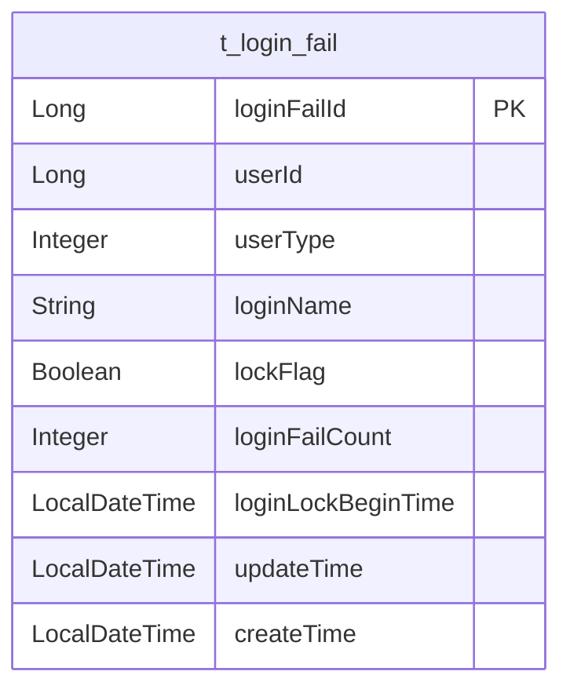
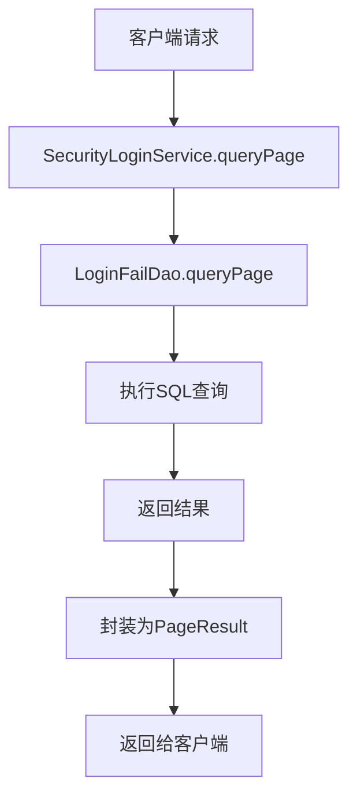
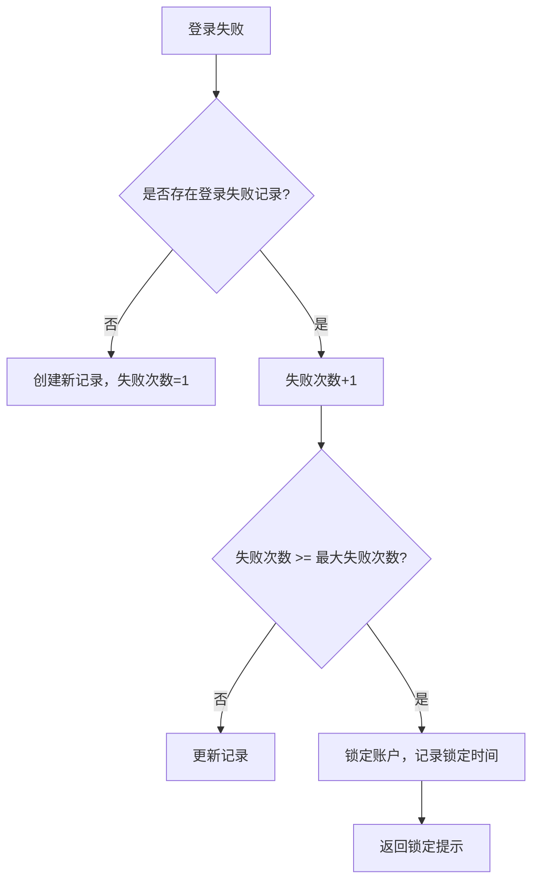
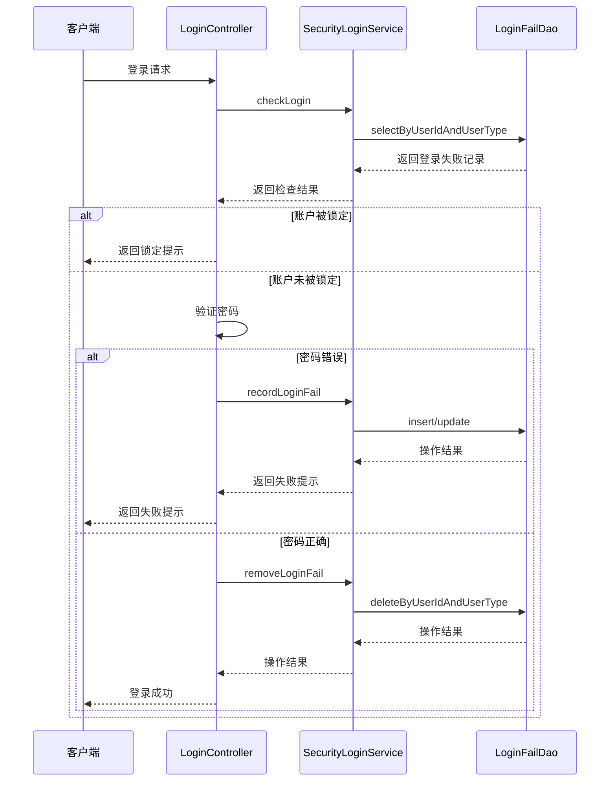
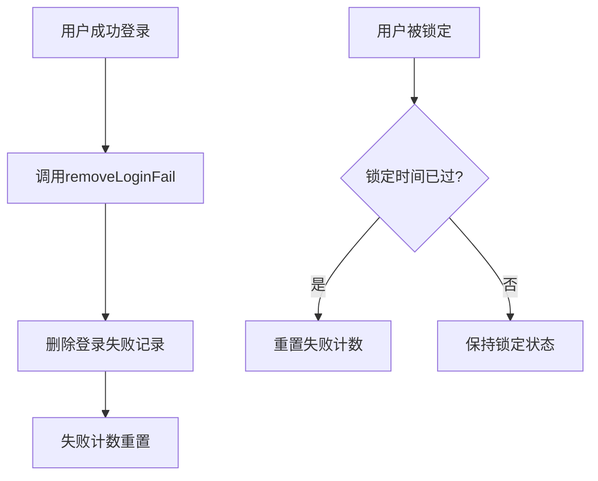
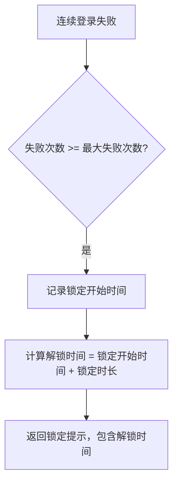

# 登录保护机制

<cite>
**本文档引用的文件**   
- [SecurityLoginService.java](file://smart-admin-api-java17-springboot3\sa-base\src\main\java\net\lab1024\sa\base\module\support\securityprotect\service\SecurityLoginService.java)
- [LoginFailDao.java](file://smart-admin-api-java17-springboot3\sa-base\src\main\java\net\lab1024\sa\base\module\support\securityprotect\dao\LoginFailDao.java)
- [LoginFailEntity.java](file://smart-admin-api-java17-springboot3\sa-base\src\main\java\net\lab1024\sa\base\module\support\securityprotect\domain\LoginFailEntity.java)
- [Level3ProtectConfigService.java](file://smart-admin-api-java17-springboot3\sa-base\src\main\java\net\lab1024\sa\base\module\support\securityprotect\service\Level3ProtectConfigService.java)
- [LoginController.java](file://smart-admin-api-java17-springboot3\sa-admin\src\main\java\net\lab1024\sa\admin\module\system\login\controller\LoginController.java)
- [LoginFailMapper.xml](file://smart-admin-api-java17-springboot3\sa-base\src\main\resources\mapper\support\LoginFailMapper.xml)
- [LoginLogService.java](file://smart-admin-api-java17-springboot3\sa-base\src\main\java\net\lab1024\sa\base\module\support\loginlog\LoginLogService.java)
</cite>

## 目录
1. [简介](#简介)
2. [核心组件](#核心组件)
3. [登录失败记录存储结构](#登录失败记录存储结构)
4. [查询机制](#查询机制)
5. [连续失败检测与账户锁定逻辑](#连续失败检测与账户锁定逻辑)
6. [认证流程集成](#认证流程集成)
7. [失败计数重置规则](#失败计数重置规则)
8. [锁定时间计算](#锁定时间计算)
9. [代码示例](#代码示例)
10. [三级等保合规性](#三级等保合规性)
11. [性能优化建议](#性能优化建议)
12. [常见问题排查指南](#常见问题排查指南)

## 简介
本文档详细介绍了基于SecurityLoginService和LoginFailDao实现的登录保护机制。该机制旨在防止暴力破解攻击，通过记录登录失败尝试、检测连续失败模式和实施账户锁定策略来增强系统安全性。文档涵盖了登录失败记录的存储结构、查询机制、连续失败检测算法、账户锁定逻辑以及与认证流程的集成方式。同时，本文档还阐述了该机制如何满足三级等保对异常登录行为监控的要求，并提供了性能优化建议和常见问题排查指南。

## 核心组件
登录保护机制的核心组件包括SecurityLoginService、LoginFailDao、LoginFailEntity和Level3ProtectConfigService。SecurityLoginService是主要的服务类，负责处理登录失败检查、记录和清除操作。LoginFailDao是数据访问对象，负责与数据库交互，执行CRUD操作。LoginFailEntity是实体类，定义了登录失败记录的数据结构。Level3ProtectConfigService提供配置管理，允许动态调整登录保护策略。

**本节来源**
- [SecurityLoginService.java](file://smart-admin-api-java17-springboot3\sa-base\src\main\java\net\lab1024\sa\base\module\support\securityprotect\service\SecurityLoginService.java)
- [LoginFailDao.java](file://smart-admin-api-java17-springboot3\sa-base\src\main\java\net\lab1024\sa\base\module\support\securityprotect\dao\LoginFailDao.java)
- [LoginFailEntity.java](file://smart-admin-api-java17-springboot3\sa-base\src\main\java\net\lab1024\sa\base\module\support\securityprotect\domain\LoginFailEntity.java)
- [Level3ProtectConfigService.java](file://smart-admin-api-java17-springboot3\sa-base\src\main\java\net\lab1024\sa\base\module\support\securityprotect\service\Level3ProtectConfigService.java)

## 登录失败记录存储结构
登录失败记录存储在`t_login_fail`表中，由LoginFailEntity类映射。该表包含以下字段：

| 字段名 | 类型 | 描述 |
| --- | --- | --- |
| loginFailId | Long | 主键，自增 |
| userId | Long | 用户ID |
| userType | Integer | 用户类型 |
| loginName | String | 登录名 |
| lockFlag | Boolean | 锁定状态 |
| loginFailCount | Integer | 登录失败次数 |
| loginLockBeginTime | LocalDateTime | 连续登录失败锁定开始时间 |
| updateTime | LocalDateTime | 更新时间 |
| createTime | LocalDateTime | 创建时间 |



**图表来源**
- [LoginFailEntity.java](file://smart-admin-api-java17-springboot3\sa-base\src\main\java\net\lab1024\sa\base\module\support\securityprotect\domain\LoginFailEntity.java)

**本节来源**
- [LoginFailEntity.java](file://smart-admin-api-java17-springboot3\sa-base\src\main\java\net\lab1024\sa\base\module\support\securityprotect\domain\LoginFailEntity.java)

## 查询机制
登录失败记录的查询通过LoginFailDao接口的queryPage方法实现。该方法接受分页参数和查询条件，返回分页的登录失败记录列表。查询条件包括登录名、锁定状态和锁定时间范围。查询语句在LoginFailMapper.xml中定义，使用MyBatis的动态SQL功能构建查询条件。



**图表来源**
- [SecurityLoginService.java](file://smart-admin-api-java17-springboot3\sa-base\src\main\java\net\lab1024\sa\base\module\support\securityprotect\service\SecurityLoginService.java#L152-L156)
- [LoginFailDao.java](file://smart-admin-api-java17-springboot3\sa-base\src\main\java\net\lab1024\sa\base\module\support\securityprotect\dao\LoginFailDao.java#L44-L51)
- [LoginFailMapper.xml](file://smart-admin-api-java17-springboot3\sa-base\src\main\resources\mapper\support\LoginFailMapper.xml#L5-L28)

**本节来源**
- [SecurityLoginService.java](file://smart-admin-api-java17-springboot3\sa-base\src\main\java\net\lab1024\sa\base\module\support\securityprotect\service\SecurityLoginService.java#L152-L156)
- [LoginFailDao.java](file://smart-admin-api-java17-springboot3\sa-base\src\main\java\net\lab1024\sa\base\module\support\securityprotect\dao\LoginFailDao.java#L44-L51)
- [LoginFailMapper.xml](file://smart-admin-api-java17-springboot3\sa-base\src\main\resources\mapper\support\LoginFailMapper.xml#L5-L28)

## 连续失败检测与账户锁定逻辑
连续失败检测和账户锁定逻辑在SecurityLoginService中实现。当用户登录失败时，系统会检查该用户的登录失败记录。如果记录不存在，则创建新记录，失败次数为1。如果记录存在，则将失败次数加1。当失败次数达到配置的最大失败次数时，系统会将账户锁定，并记录锁定开始时间。



**图表来源**
- [SecurityLoginService.java](file://smart-admin-api-java17-springboot3\sa-base\src\main\java\net\lab1024\sa\base\module\support\securityprotect\service\SecurityLoginService.java#L95-L124)

**本节来源**
- [SecurityLoginService.java](file://smart-admin-api-java17-springboot3\sa-base\src\main\java\net\lab1024\sa\base\module\support\securityprotect\service\SecurityLoginService.java#L95-L124)

## 认证流程集成
登录保护机制与认证流程的集成在LoginController中实现。当用户尝试登录时，系统首先调用SecurityLoginService的checkLogin方法检查用户是否可以登录。如果用户被锁定，则返回锁定提示。如果用户未被锁定，则继续进行密码验证。如果密码验证失败，则调用recordLoginFail方法记录登录失败。如果密码验证成功，则调用removeLoginFail方法清除登录失败记录。



**图表来源**
- [LoginController.java](file://smart-admin-api-java17-springboot3\sa-admin\src\main\java\net\lab1024\sa\admin\module\system\login\controller\LoginController.java)
- [SecurityLoginService.java](file://smart-admin-api-java17-springboot3\sa-base\src\main\java\net\lab1024\sa\base\module\support\securityprotect\service\SecurityLoginService.java)
- [LoginFailDao.java](file://smart-admin-api-java17-springboot3\sa-base\src\main\java\net\lab1024\sa\base\module\support\securityprotect\dao\LoginFailDao.java)

**本节来源**
- [LoginController.java](file://smart-admin-api-java17-springboot3\sa-admin\src\main\java\net\lab1024\sa\admin\module\system\login\controller\LoginController.java)
- [SecurityLoginService.java](file://smart-admin-api-java17-springboot3\sa-base\src\main\java\net\lab1024\sa\base\module\support\securityprotect\service\SecurityLoginService.java)
- [LoginFailDao.java](file://smart-admin-api-java17-springboot3\sa-base\src\main\java\net\lab1024\sa\base\module\support\securityprotect\dao\LoginFailDao.java)

## 失败计数重置规则
失败计数在用户成功登录后重置。当用户成功登录时，系统会调用SecurityLoginService的removeLoginFail方法，该方法会删除该用户的登录失败记录。此外，如果用户被锁定，但在锁定时间过后再次尝试登录，系统会检查锁定时间是否已过。如果已过，则会重置失败计数。



**图表来源**
- [SecurityLoginService.java](file://smart-admin-api-java17-springboot3\sa-base\src\main\java\net\lab1024\sa\base\module\support\securityprotect\service\SecurityLoginService.java#L136-L145)
- [LoginController.java](file://smart-admin-api-java17-springboot3\sa-admin\src\main\java\net\lab1024\sa\admin\module\system\login\controller\LoginController.java)

**本节来源**
- [SecurityLoginService.java](file://smart-admin-api-java17-springboot3\sa-base\src\main\java\net\lab1024\sa\base\module\support\securityprotect\service\SecurityLoginService.java#L136-L145)
- [LoginController.java](file://smart-admin-api-java17-springboot3\sa-admin\src\main\java\net\lab1024\sa\admin\module\system\login\controller\LoginController.java)

## 锁定时间计算
锁定时间由Level3ProtectConfigService中的loginFailLockSeconds配置项决定，单位为秒。当用户连续登录失败次数达到最大失败次数时，系统会记录当前时间为锁定开始时间。解锁时间为锁定开始时间加上锁定时长。例如，如果锁定时长为1800秒（30分钟），则用户将在30分钟后自动解锁。



**图表来源**
- [SecurityLoginService.java](file://smart-admin-api-java17-springboot3\sa-base\src\main\java\net\lab1024\sa\base\module\support\securityprotect\service\SecurityLoginService.java#L100-L102)
- [Level3ProtectConfigService.java](file://smart-admin-api-java17-springboot3\sa-base\src\main\java\net\lab1024\sa\base\module\support\securityprotect\service\Level3ProtectConfigService.java#L54)

**本节来源**
- [SecurityLoginService.java](file://smart-admin-api-java17-springboot3\sa-base\src\main\java\net\lab1024\sa\base\module\support\securityprotect\service\SecurityLoginService.java#L100-L102)
- [Level3ProtectConfigService.java](file://smart-admin-api-java17-springboot3\sa-base\src\main\java\net\lab1024\sa\base\module\support\securityprotect\service\Level3ProtectConfigService.java#L54)

## 代码示例
以下代码示例展示了失败记录的创建、查询和清理过程。

### 失败记录创建
```java
public String recordLoginFail(Long userId, UserTypeEnum userType, String loginName, LoginFailEntity loginFailEntity) {
    if (level3ProtectConfigService.getLoginFailMaxTimes() < 1) {
        return null;
    }

    int loginFailCount = loginFailEntity == null ? 1 : loginFailEntity.getLoginFailCount() + 1;
    boolean lockFlag = loginFailCount >= level3ProtectConfigService.getLoginFailMaxTimes();
    LocalDateTime lockBeginTime = lockFlag ? LocalDateTime.now() : null;

    if (loginFailEntity == null) {
        loginFailEntity = LoginFailEntity.builder()
                .userId(userId)
                .userType(userType.getValue())
                .loginName(loginName)
                .loginFailCount(loginFailCount)
                .lockFlag(lockFlag)
                .loginLockBeginTime(lockBeginTime)
                .build();
        loginFailDao.insert(loginFailEntity);
    } else {
        loginFailEntity.setLoginLockBeginTime(lockBeginTime);
        loginFailEntity.setLoginFailCount(loginFailCount);
        loginFailEntity.setLockFlag(lockFlag);
        loginFailEntity.setLoginName(loginName);
        loginFailDao.updateById(loginFailEntity);
    }

    if (lockFlag) {
        LocalDateTime unlockTime = loginFailEntity.getLoginLockBeginTime().plusSeconds(level3ProtectConfigService.getLoginFailLockSeconds());
        return String.format(LOGIN_LOCK_MSG, loginFailEntity.getLoginFailCount(), level3ProtectConfigService.getLoginFailLockSeconds() / 60, LocalDateTimeUtil.formatNormal(unlockTime));
    } else {
        return String.format(LOGIN_FAIL_MSG, level3ProtectConfigService.getLoginFailMaxTimes(), level3ProtectConfigService.getLoginFailLockSeconds() / 60, level3ProtectConfigService.getLoginFailMaxTimes() - loginFailEntity.getLoginFailCount());
    }
}
```

### 失败记录查询
```java
public PageResult<LoginFailVO> queryPage(LoginFailQueryForm queryForm) {
    Page<?> page = SmartPageUtil.convert2PageQuery(queryForm);
    List<LoginFailVO> list = loginFailDao.queryPage(page, queryForm);
    return SmartPageUtil.convert2PageResult(page, list);
}
```

### 失败记录清理
```java
public void removeLoginFail(Long userId, UserTypeEnum userType) {
    if (level3ProtectConfigService.getLoginFailMaxTimes() < 1) {
        return;
    }

    loginFailDao.deleteByUserIdAndUserType(userId, userType.getValue());
}
```

**本节来源**
- [SecurityLoginService.java](file://smart-admin-api-java17-springboot3\sa-base\src\main\java\net\lab1024\sa\base\module\support\securityprotect\service\SecurityLoginService.java)

## 三级等保合规性
该登录保护机制满足三级等保对异常登录行为监控的要求。具体体现在以下几个方面：

1. **登录失败记录**：系统记录每次登录失败的详细信息，包括用户ID、登录名、失败时间等，便于事后审计和分析。
2. **账户锁定**：当连续登录失败次数达到预设阈值时，系统会自动锁定账户，防止暴力破解攻击。
3. **锁定时间可配置**：锁定时间可以通过配置动态调整，满足不同安全级别的要求。
4. **日志记录**：系统记录登录成功和失败的日志，包括IP地址、用户代理等信息，便于追踪异常行为。
5. **配置管理**：登录保护策略可以通过管理界面进行配置，确保策略的灵活性和可维护性。

这些措施共同构成了一个完整的异常登录行为监控体系，有效提升了系统的安全性。

**本节来源**
- [SecurityLoginService.java](file://smart-admin-api-java17-springboot3\sa-base\src\main\java\net\lab1024\sa\base\module\support\securityprotect\service\SecurityLoginService.java)
- [Level3ProtectConfigService.java](file://smart-admin-api-java17-springboot3\sa-base\src\main\java\net\lab1024\sa\base\module\support\securityprotect\service\Level3ProtectConfigService.java)
- [LoginLogService.java](file://smart-admin-api-java17-springboot3\sa-base\src\main\java\net\lab1024\sa\base\module\support\loginlog\LoginLogService.java)

## 性能优化建议
为了确保登录保护机制的高性能，建议采取以下优化措施：

1. **索引优化**：在`t_login_fail`表的`userId`和`userType`字段上创建复合索引，以加快查询速度。
2. **缓存机制**：对于频繁访问的登录失败记录，可以考虑使用Redis等缓存技术，减少数据库查询压力。
3. **异步处理**：登录失败记录的写入操作可以采用异步方式，避免阻塞主登录流程。
4. **批量操作**：对于批量删除操作，使用批量删除方法，减少数据库交互次数。
5. **连接池配置**：合理配置数据库连接池，确保在高并发场景下有足够的连接资源。

通过这些优化措施，可以显著提升登录保护机制的性能，确保系统在高负载下的稳定运行。

**本节来源**
- [LoginFailDao.java](file://smart-admin-api-java17-springboot3\sa-base\src\main\java\net\lab1024\sa\base\module\support\securityprotect\dao\LoginFailDao.java)
- [SecurityLoginService.java](file://smart-admin-api-java17-springboot3\sa-base\src\main\java\net\lab1024\sa\base\module\support\securityprotect\service\SecurityLoginService.java)

## 常见问题排查指南
### 问题1：账户未被锁定，但无法登录
**可能原因**：
- 用户账户已被禁用或删除。
- 密码错误次数未达到锁定阈值。
- 系统配置中未启用登录保护。

**排查步骤**：
1. 检查用户账户状态是否正常。
2. 确认密码错误次数是否达到锁定阈值。
3. 检查Level3ProtectConfigService中的loginFailMaxTimes配置项是否大于0。

### 问题2：账户被锁定，但无法解锁
**可能原因**：
- 锁定时间未到。
- 系统时间不正确。
- 解锁逻辑未正确执行。

**排查步骤**：
1. 检查当前时间是否已超过锁定开始时间加上锁定时长。
2. 确认系统时间是否正确。
3. 检查SecurityLoginService中的解锁逻辑是否正确。

### 问题3：登录失败记录未被清除
**可能原因**：
- 成功登录后未调用removeLoginFail方法。
- 数据库操作失败。

**排查步骤**：
1. 检查LoginController中是否在成功登录后调用removeLoginFail方法。
2. 查看数据库日志，确认删除操作是否成功执行。

**本节来源**
- [SecurityLoginService.java](file://smart-admin-api-java17-springboot3\sa-base\src\main\java\net\lab1024\sa\base\module\support\securityprotect\service\SecurityLoginService.java)
- [LoginController.java](file://smart-admin-api-java17-springboot3\sa-admin\src\main\java\net\lab1024\sa\admin\module\system\login\controller\LoginController.java)