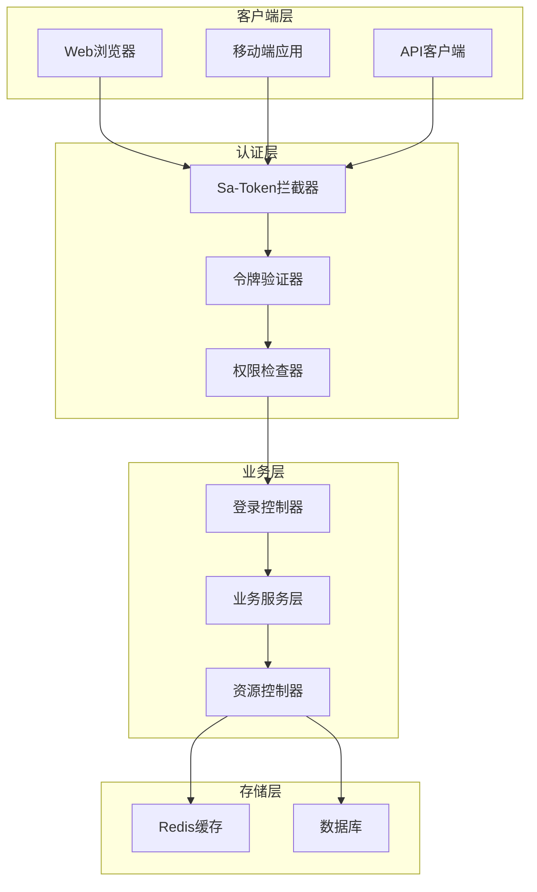
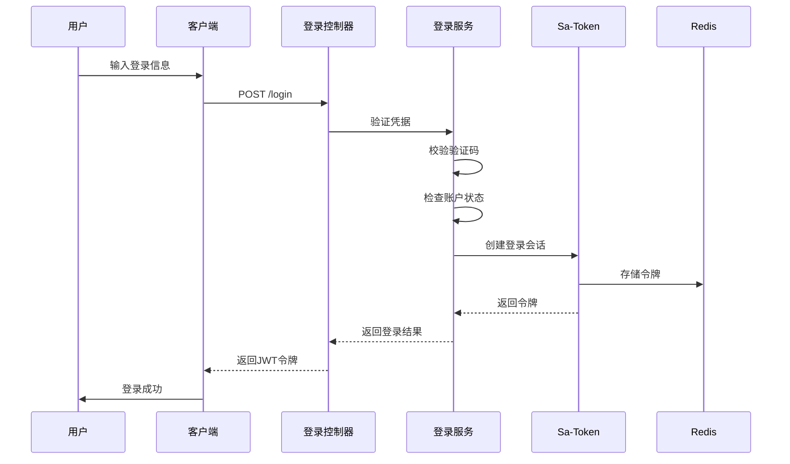
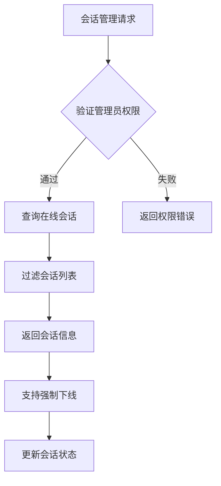
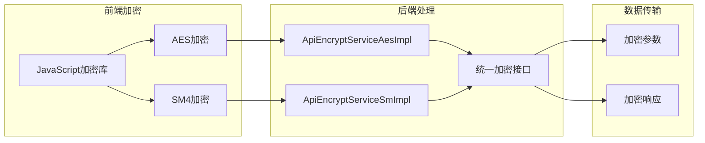
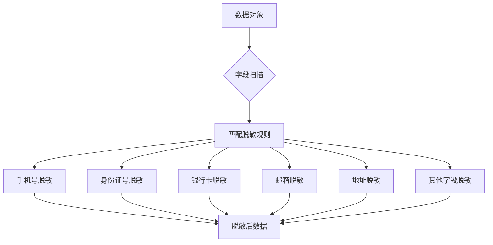
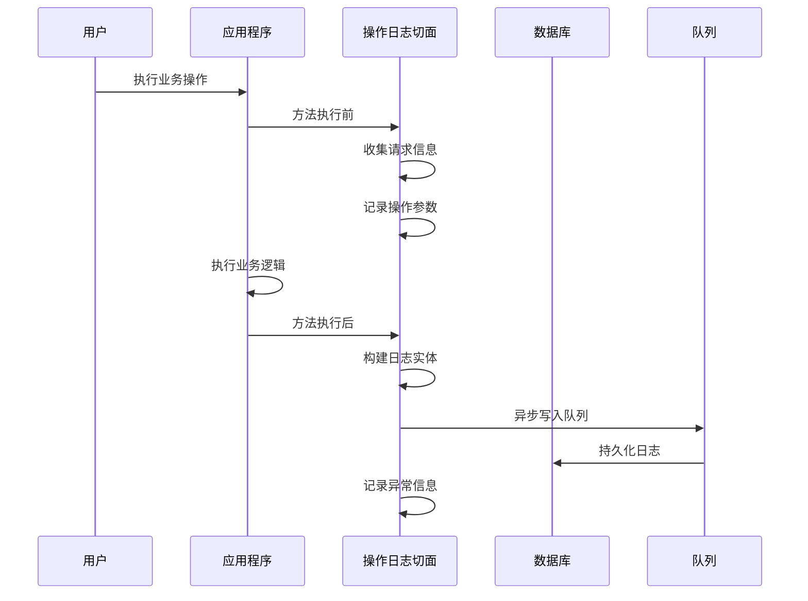
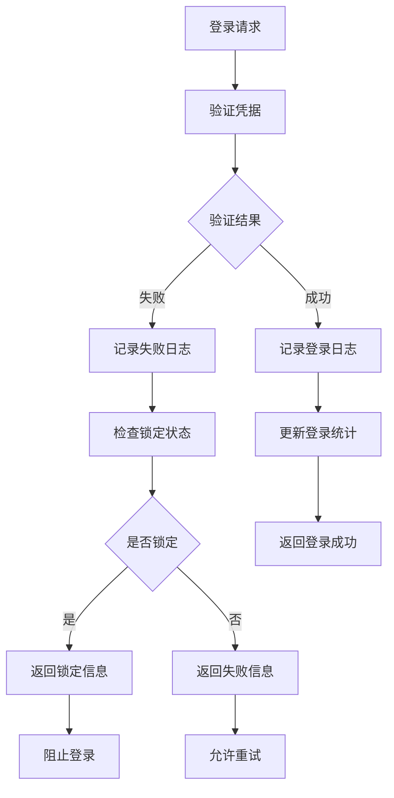
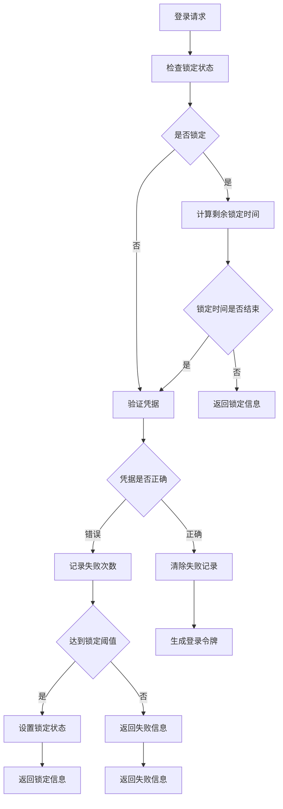
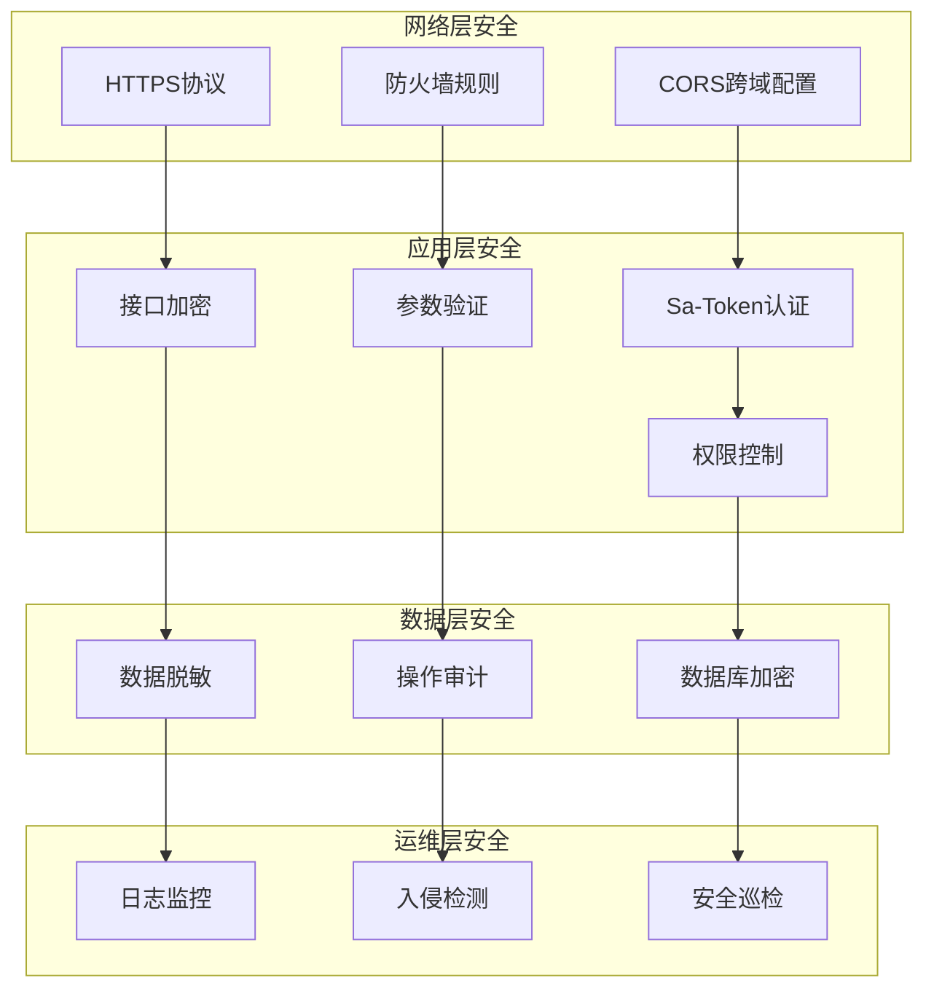
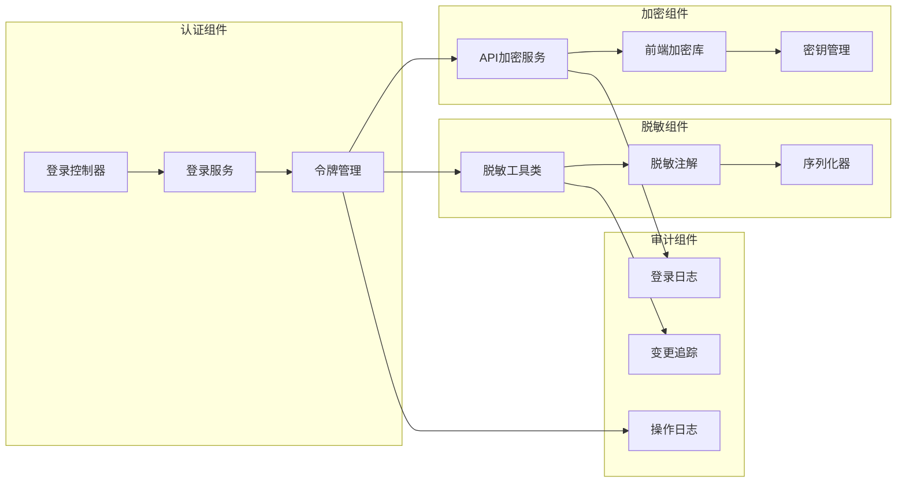

# IOE-DREAM项目安全体系文档

<cite>
**本文档引用的文件**
- [Level3ProtectConfigService.java](file://smart-admin-api-java17-springboot3\sa-base\src\main\java\net\lab1024\sa\base\module\support\securityprotect\service\Level3ProtectConfigService.java)
- [ApiEncryptServiceAesImpl.java](file://smart-admin-api-java17-springboot3\sa-base\src\main\java\net\lab1024\sa\base\module\support\apiencrypt\service\ApiEncryptServiceAesImpl.java)
- [ApiEncryptServiceSmImpl.java](file://smart-admin-api-java17-springboot3\sa-base\src\main\java\net\lab1024\sa\base\module\support\apiencrypt\service\ApiEncryptServiceSmImpl.java)
- [SmartDataMaskingUtil.java](file://smart-admin-api-java17-springboot3\sa-base\src\main\java\net\lab1024\sa\base\module\support\datamasking\SmartDataMaskingUtil.java)
- [OperateLogAspect.java](file://smart-admin-api-java17-springboot3\sa-base\src\main\java\net\lab1024\sa\base\module\support\operatelog\core\OperateLogAspect.java)
- [SecurityLoginService.java](file://smart-admin-api-java17-springboot3\sa-base\src\main\java\net\lab1024\sa\base\module\support\securityprotect\service\SecurityLoginService.java)
- [LoginLogService.java](file://smart-admin-api-java17-springboot3\sa-base\src\main\java\net\lab1024\sa\base\module\support\loginlog\LoginLogService.java)
- [TokenConfig.java](file://smart-admin-api-java17-springboot3\sa-base\src\main\java\net\lab1024\sa\base\config\TokenConfig.java)
- [sa-base.yaml](file://smart-admin-api-java17-springboot3\sa-base\src\main\resources\prod\sa-base.yaml)
- [LoginController.java](file://smart-admin-api-java17-springboot3\sa-admin\src\main\java\net\lab1024\sa\admin\module\system\login\controller\LoginController.java)
- [LoginService.java](file://smart-admin-api-java17-springboot3\sa-admin\src\main\java\net\lab1024\sa\admin\module\system\login\service\LoginService.java)
- [encrypt.js](file://smart-admin-web-javascript\src\lib\encrypt.js)
- [api-encrypt-index.vue](file://smart-admin-web-javascript\src\views\support\api-encrypt\api-encrypt-index.vue)
</cite>

## 目录
1. [概述](#概述)
2. [Sa-Token认证授权系统](#sa-token认证授权系统)
3. [接口加解密机制](#接口加解密机制)
4. [数据脱敏系统](#数据脱敏系统)
5. [操作日志与审计](#操作日志与审计)
6. [三级等保安全配置](#三级等保安全配置)
7. [安全架构设计](#安全架构设计)
8. [安全最佳实践](#安全最佳实践)
9. [总结](#总结)

## 概述

IOE-DREAM项目构建了一套完整的企业级安全体系，基于Sa-Token框架实现了强大的认证授权机制，并集成了多层次的安全防护措施。该安全体系涵盖了身份认证、数据加密、权限控制、操作审计等多个维度，确保系统的安全性符合国家网络安全等级保护第三级的要求。

### 核心安全特性

- **基于Sa-Token的认证授权**：提供令牌管理、会话控制、权限验证等功能
- **双重加密机制**：支持AES和国密SM4算法的接口加解密
- **智能数据脱敏**：自动识别和脱敏敏感数据字段
- **全面操作审计**：记录所有关键操作的日志信息
- **三级等保合规**：满足网络安全等级保护第三级要求

## Sa-Token认证授权系统

### 系统架构

Sa-Token作为核心认证框架，提供了完整的身份认证和权限管理系统。



**图表来源**
- [LoginController.java](file://smart-admin-api-java17-springboot3\sa-admin\src\main\java\net\lab1024\sa\admin\module\system\login\controller\LoginController.java#L28-L62)
- [TokenConfig.java](file://smart-admin-api-java17-springboot3\sa-base\src\main\java\net\lab1024\sa\base\config\TokenConfig.java#L1-L33)

### 登录流程

系统采用标准的OAuth2.0认证流程，支持多种登录方式。



**图表来源**
- [LoginService.java](file://smart-admin-api-java17-springboot3\sa-admin\src\main\java\net\lab1024\sa\admin\module\system\login\service\LoginService.java#L84-L135)
- [LoginController.java](file://smart-admin-api-java17-springboot3\sa-admin\src\main\java\net\lab1024\sa\admin\module\system\login\controller\LoginController.java#L45-L62)

### 令牌管理

系统采用JWT令牌机制，支持自动续期和多设备登录控制。

| 配置项 | 默认值 | 说明 |
|--------|--------|------|
| 令牌名称 | Authorization | HTTP头部中的令牌标识 |
| 令牌前缀 | Bearer | JWT令牌前缀 |
| 有效期 | 30天 | 令牌的有效时间（秒） |
| 自动续期 | 启用 | 框架自动检查和续期令牌 |
| 并发控制 | 禁用 | 是否允许多地同时登录 |
| 令牌风格 | simple-uuid | 令牌生成风格 |

**段落来源**
- [sa-base.yaml](file://smart-admin-api-java17-springboot3\sa-base\src\main\resources\prod\sa-base.yaml#L147-L171)

### 会话管理

系统提供了完善的会话管理功能，包括会话查询、强制下线、在线用户监控等。



**图表来源**
- [TokenConfig.java](file://smart-admin-api-java17-springboot3\sa-base\src\main\java\net\lab1024\sa\base\config\TokenConfig.java#L25-L33)

## 接口加解密机制

### 加密算法支持

系统同时支持AES和国密SM4两种加密算法，满足不同场景的安全需求。



**图表来源**
- [ApiEncryptServiceAesImpl.java](file://smart-admin-api-java17-springboot3\sa-base\src\main\java\net\lab1024\sa\base\module\support\apiencrypt\service\ApiEncryptServiceAesImpl.java#L1-L115)
- [ApiEncryptServiceSmImpl.java](file://smart-admin-api-java17-springboot3\sa-base\src\main\java\net\lab1024\sa\base\module\support\apiencrypt\service\ApiEncryptServiceSmImpl.java#L1-L119)

### AES加密实现

AES加密采用ECB模式，支持128位密钥长度。

**主要特点：**
- 密钥长度：128位（16字节）
- 编码格式：UTF-8
- 加密模式：ECB
- 填充方式：PKCS7

**段落来源**
- [ApiEncryptServiceAesImpl.java](file://smart-admin-api-java17-springboot3\sa-base\src\main\java\net\lab1024\sa\base\module\support\apiencrypt\service\ApiEncryptServiceAesImpl.java#L15-L27)

### 国密SM4加密实现

SM4加密符合中国国家标准，提供更高的安全性。

**主要特点：**
- 密钥长度：128位（16字节）
- 编码格式：UTF-8
- 加密模式：ECB
- 填充方式：PKCS7

**段落来源**
- [ApiEncryptServiceSmImpl.java](file://smart-admin-api-java17-springboot3\sa-base\src\main\java\net\lab1024\sa\base\module\support\apiencrypt\service\ApiEncryptServiceSmImpl.java#L13-L24)

### 前端加密配置

前端通过配置文件切换加密算法：

```javascript
// 默认使用SM4算法
const EncryptObject = SM4;
// const EncryptObject = AES;
```

**段落来源**
- [encrypt.js](file://smart-admin-web-javascript\src\lib\encrypt.js#L110-L115)

## 数据脱敏系统

### 脱敏策略

系统实现了智能的数据脱敏机制，自动识别和处理敏感数据。



**图表来源**
- [SmartDataMaskingUtil.java](file://smart-admin-api-java17-springboot3\sa-base\src\main\java\net\lab1024\sa\base\module\support\datamasking\SmartDataMaskingUtil.java#L1-L216)

### 支持的脱敏类型

| 脱敏类型 | 描述 | 示例 |
|----------|------|------|
| 手机号 | 保留前3位和最后4位 | 138****5678 |
| 身份证号 | 保留前6位和后4位 | 410105********1234 |
| 银行卡 | 保留前6位和后4位 | 6225************1234 |
| 邮箱 | 保留用户名和域名 | z***@example.com |
| 地址 | 保留省市信息 | 河南省洛阳市洛龙区****** |
| 密码 | 全部隐藏 | ******** |
| 中文名 | 保留姓氏 | 张** |
| 车牌号 | 保留省份和部分号码 | 豫A ****89 |

**段落来源**
- [DataMaskingTypeEnum.java](file://smart-admin-api-java17-springboot3\sa-base\src\main\java\net\lab1024\sa\base\module\support\datamasking\DataMaskingTypeEnum.java#L1-L40)

### 脱敏注解使用

通过注解方式实现字段级别的脱敏控制：

```java
@DataMasking(DataMaskingTypeEnum.PHONE)
private String phone;

@DataMasking(DataMaskingTypeEnum.ID_CARD)
private String idCard;

@DataMasking
private String otherSensitiveField;
```

**段落来源**
- [DataMasking.java](file://smart-admin-api-java17-springboot3\sa-base\src\main\java\net\lab1024\sa\base\module\support\datamasking\DataMasking.java#L1-L27)

## 操作日志与审计

### 日志记录机制

系统实现了全面的操作日志记录，涵盖所有关键业务操作。



**图表来源**
- [OperateLogAspect.java](file://smart-admin-api-java17-springboot3\sa-base\src\main\java\net\lab1024\sa\base\module\support\operatelog\core\OperateLogAspect.java#L1-L292)

### 日志内容结构

| 字段 | 类型 | 说明 |
|------|------|------|
| 操作人ID | Long | 执行操作的用户ID |
| 用户类型 | Integer | 用户类型枚举值 |
| 操作人名称 | String | 用户显示名称 |
| 模块 | String | 操作所属模块 |
| 操作内容 | String | 操作描述信息 |
| 请求路径 | String | API请求URL |
| 请求方法 | String | HTTP方法类型 |
| 参数 | String | 请求参数JSON |
| IP地址 | String | 客户端IP地址 |
| 地区信息 | String | IP归属地 |
| User-Agent | String | 浏览器标识 |
| 成功标志 | Boolean | 操作是否成功 |
| 失败原因 | String | 异常堆栈信息 |
| 响应结果 | String | 返回结果JSON |

**段落来源**
- [OperateLogEntity.java](file://smart-admin-api-java17-springboot3\sa-base\src\main\java\net\lab1024\sa\base\module\support\operatelog\domain\OperateLogEntity.java#L1-L68)

### 登录日志管理

系统提供详细的登录日志记录和查询功能。



**图表来源**
- [LoginLogService.java](file://smart-admin-api-java17-springboot3\sa-base\src\main\java\net\lab1024\sa\base\module\support\loginlog\LoginLogService.java#L1-L68)

## 三级等保安全配置

### 安全配置参数

系统完全符合网络安全等级保护第三级的要求，提供全面的安全配置选项。

| 配置项 | 默认值 | 说明 |
|--------|--------|------|
| 连续登录失败次数 | -1 | 锁定阈值，-1表示不限制 |
| 登录失败锁定时间 | 30分钟 | 锁定持续时间 |
| 最低活跃时间 | 30分钟 | 令牌超时时间 |
| 双因子登录 | 启用 | 是否启用二次验证 |
| 密码复杂度 | 启用 | 是否强制密码强度 |
| 定期修改密码 | 90天 | 密码有效期 |
| 重复密码限制 | 3次 | 不允许重复使用次数 |

**段落来源**
- [Level3ProtectConfigService.java](file://smart-admin-api-java17-springboot3\sa-base\src\main\java\net\lab1024\sa\base\module\support\securityprotect\service\Level3ProtectConfigService.java#L1-L189)

### 登录保护机制

系统实现了多层次的登录保护机制。



**图表来源**
- [SecurityLoginService.java](file://smart-admin-api-java17-springboot3\sa-base\src\main\java\net\lab1024\sa\base\module\support\securityprotect\service\SecurityLoginService.java#L1-L175)

### 密码安全策略

系统实施严格的密码安全策略，确保账户安全。

**密码复杂度要求：**
- 长度：8-20位
- 包含：大小写字母、数字、特殊符号三种及以上组合
- 示例：`Passw0rd@2024`

**段落来源**
- [SecurityPasswordService.java](file://smart-admin-api-java17-springboot3\sa-base\src\main\java\net\lab1024\sa\base\module\support\securityprotect\service\SecurityPasswordService.java#L34-L76)

### 文件上传安全

系统对文件上传进行了严格的安全控制。

| 限制项 | 默认值 | 说明 |
|--------|--------|------|
| 单文件大小 | 20MB | 单个文件最大限制 |
| 请求总大小 | 10MB | 整个请求最大限制 |
| 文件检测 | 关闭 | 是否启用病毒扫描 |
| 文件类型 | 无限制 | 默认不限制文件类型 |

**段落来源**
- [sa-base.yaml](file://smart-admin-api-java17-springboot3\sa-base\src\main\resources\prod\sa-base.yaml#L67-L72)

## 安全架构设计

### 整体安全架构



### 安全组件关系



**图表来源**
- [LoginController.java](file://smart-admin-api-java17-springboot3\sa-admin\src\main\java\net\lab1024\sa\admin\module\system\login\controller\LoginController.java#L28-L62)
- [ApiEncryptServiceAesImpl.java](file://smart-admin-api-java17-springboot3\sa-base\src\main\java\net\lab1024\sa\base\module\support\apiencrypt\service\ApiEncryptServiceAesImpl.java#L29-L35)

## 安全最佳实践

### 配置安全策略

1. **令牌配置优化**
   ```yaml
   sa-token:
     timeout: 1728000  # 设置合理的令牌有效期
     active-timeout: 1800  # 设置30分钟的活跃超时
     is-concurrent: false  # 禁止多地同时登录
     auto-renew: true  # 启用自动续期
   ```

2. **三级等保配置**
   ```yaml
   level3-protect:
     login-fail-max-times: 5
     login-fail-lock-minutes: 30
     login-active-timeout-minutes: 30
     two-factor-login-enabled: true
     password-complexity-enabled: true
   ```

3. **文件上传安全**
   ```yaml
   spring:
     servlet:
       multipart:
         max-file-size: 10MB
         max-request-size: 10MB
   ```

### 安全漏洞处理

1. **常见漏洞防护**
   - SQL注入：使用MyBatis Plus的参数绑定
   - XSS攻击：HTML实体编码和输入验证
   - CSRF攻击：Sa-Token自动防护
   - 重放攻击：令牌时效性和唯一性

2. **安全监控指标**
   - 登录失败率监控
   - 异常操作检测
   - 异常IP访问追踪
   - 敏感操作审计

3. **应急响应流程**
   - 发现安全事件
   - 立即隔离受影响系统
   - 收集证据和日志
   - 通知相关人员
   - 制定修复方案
   - 验证修复效果

### 性能优化建议

1. **缓存策略**
   - Redis缓存热点数据
   - 令牌信息本地缓存
   - 静态资源配置CDN

2. **并发控制**
   - 令牌并发访问限制
   - 接口限流保护
   - 数据库连接池优化

3. **日志优化**
   - 异步日志写入
   - 日志级别合理配置
   - 日志轮转和清理

## 总结

IOE-DREAM项目构建了一个全面而完善的安全体系，通过Sa-Token认证框架、双重加密机制、智能脱敏系统、全面审计功能和三级等保配置，为企业级应用提供了强有力的安全保障。

### 核心优势

1. **技术先进性**：采用最新的安全技术和标准
2. **功能完整性**：涵盖认证、授权、加密、审计等各个方面
3. **合规性**：完全符合国家网络安全等级保护要求
4. **易用性**：提供简洁的配置和使用方式
5. **可扩展性**：支持自定义扩展和定制开发

### 未来发展方向

1. **AI安全增强**：引入机器学习进行异常行为检测
2. **零信任架构**：实施更严格的身份验证和授权策略
3. **区块链审计**：使用区块链技术确保审计数据不可篡改
4. **云原生安全**：适应容器化和微服务架构的安全需求

通过持续的安全投入和技术升级，IOE-DREAM项目将继续保持其在企业级安全领域的领先地位，为用户提供更加安全可靠的应用服务。