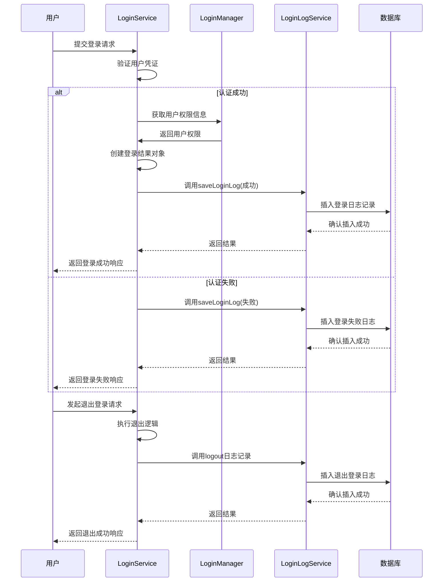
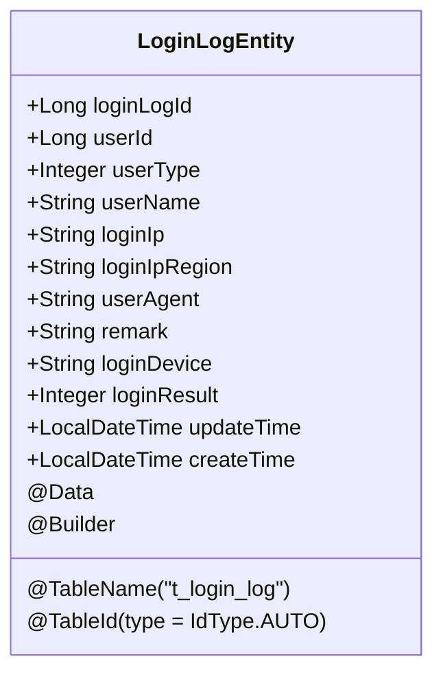
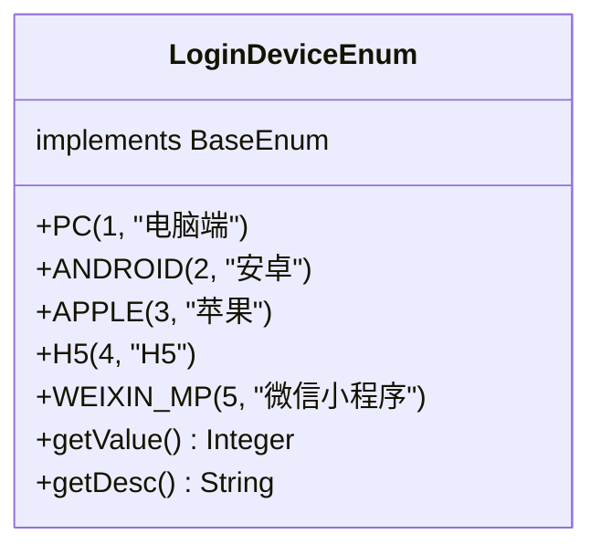
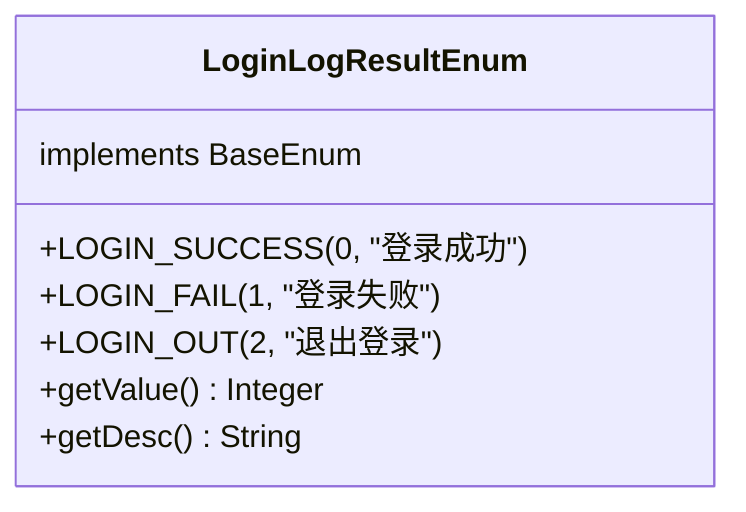
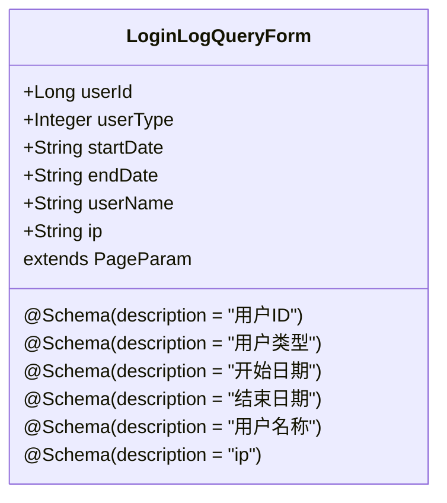
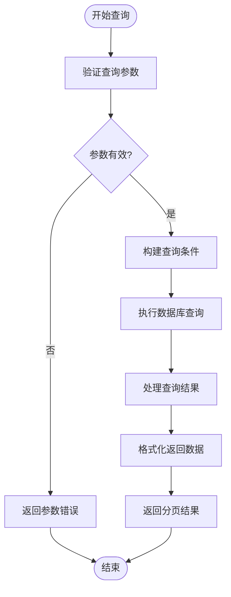

# 登录日志

<cite>
**本文档引用的文件**   
- [LoginLogEntity.java](file://smart-admin-api-java17-springboot3\sa-base\src\main\java\net\lab1024\sa\base\module\support\loginlog\domain\LoginLogEntity.java)
- [LoginLogService.java](file://smart-admin-api-java17-springboot3\sa-base\src\main\java\net\lab1024\sa\base\module\support\loginlog\LoginLogService.java)
- [LoginLogDao.java](file://smart-admin-api-java17-springboot3\sa-base\src\main\java\net\lab1024\sa\base\module\support\loginlog\LoginLogDao.java)
- [LoginLogQueryForm.java](file://smart-admin-api-java17-springboot3\sa-base\src\main\java\net\lab1024\sa\base\module\support\loginlog\domain\LoginLogQueryForm.java)
- [LoginLogResultEnum.java](file://smart-admin-api-java17-springboot3\sa-base\src\main\java\net\lab1024\sa\base\module\support\loginlog\LoginLogResultEnum.java)
- [LoginDeviceEnum.java](file://smart-admin-api-java17-springboot3\sa-base\src\main\java\net\lab1024\sa\base\constant\LoginDeviceEnum.java)
- [LoginService.java](file://smart-admin-api-java17-springboot3\sa-admin\src\main\java\net\lab1024\sa\admin\module\system\login\service\LoginService.java)
- [LoginManager.java](file://smart-admin-api-java17-springboot3\sa-admin\src\main\java\net\lab1024\sa\admin\module\system\login\manager\LoginManager.java)
- [LoginLogMapper.xml](file://smart-admin-api-java17-springboot3\sa-base\src\main\resources\mapper\support\LoginLogMapper.xml)
- [login-log-const.js](file://smart-admin-web-javascript\src\constants\support\login-log-const.js)
- [login-device-const.js](file://smart-admin-web-javascript\src\constants\system\login-device-const.js)
- [login-log-list.vue](file://smart-admin-web-javascript\src\views\support\login-log\login-log-list.vue)
</cite>

## 目录
1. [登录日志功能概述](#登录日志功能概述)
2. [登录日志记录机制](#登录日志记录机制)
3. [登录日志实体类](#登录日志实体类)
4. [登录日志查询功能](#登录日志查询功能)
5. [登录日志安全分析](#登录日志安全分析)
6. [日志保留策略与合规性](#日志保留策略与合规性)

## 登录日志功能概述

登录日志功能是系统安全审计的重要组成部分，用于记录用户的所有登录行为，包括成功登录、登录失败和退出登录等操作。该功能通过LoginManager和LoginLogService组件协同工作，在用户认证过程中自动记录相关日志信息。登录日志不仅为系统管理员提供了用户行为审计的能力，还为安全事件的追溯和分析提供了重要依据。

系统通过登录日志记录用户的登录时间、IP地址、设备类型等关键信息，帮助识别异常登录行为和潜在的安全威胁。这些日志数据被持久化存储在数据库中，并提供灵活的查询接口，支持按时间范围、IP地址、登录结果等条件进行筛选分析。

**Section sources**
- [LoginLogEntity.java](file://smart-admin-api-java17-springboot3\sa-base\src\main\java\net\lab1024\sa\base\module\support\loginlog\domain\LoginLogEntity.java#L1-L77)
- [LoginLogService.java](file://smart-admin-api-java17-springboot3\sa-base\src\main\java\net\lab1024\sa\base\module\support\loginlog\LoginLogService.java#L1-L68)

## 登录日志记录机制

登录日志记录机制通过LoginManager在用户认证成功或失败后调用LoginLogService来实现。当用户尝试登录时，系统会根据认证结果调用相应的日志记录方法。认证成功时记录"登录成功"日志，认证失败时记录"登录失败"日志，用户主动退出时记录"退出登录"日志。

**Diagram sources**
- [LoginService.java](file://smart-admin-api-java17-springboot3\sa-admin\src\main\java\net\lab1024\sa\admin\module\system\login\service\LoginService.java#L300-L356)
- [LoginLogService.java](file://smart-admin-api-java17-springboot3\sa-base\src\main\java\net\lab1024\sa\base\module\support\loginlog\LoginLogService.java#L48-L54)

**Section sources**
- [LoginService.java](file://smart-admin-api-java17-springboot3\sa-admin\src\main\java\net\lab1024\sa\admin\module\system\login\service\LoginService.java#L300-L356)
- [LoginLogService.java](file://smart-admin-api-java17-springboot3\sa-base\src\main\java\net\lab1024\sa\base\module\support\loginlog\LoginLogService.java#L48-L54)
- [LoginManager.java](file://smart-admin-api-java17-springboot3\sa-admin\src\main\java\net\lab1024\sa\admin\module\system\login\manager\LoginManager.java#L33-L174)

## 登录日志实体类

LoginLogEntity实体类定义了登录日志的字段结构和数据持久化过程。该实体类映射到数据库表t_login_log，包含用户登录行为的所有关键信息。每个字段都有明确的业务含义，确保日志记录的完整性和可追溯性。

**Diagram sources**
- [LoginLogEntity.java](file://smart-admin-api-java17-springboot3\sa-base\src\main\java\net\lab1024\sa\base\module\support\loginlog\domain\LoginLogEntity.java#L1-L77)

**Section sources**
- [LoginLogEntity.java](file://smart-admin-api-java17-springboot3\sa-base\src\main\java\net\lab1024\sa\base\module\support\loginlog\domain\LoginLogEntity.java#L1-L77)
- [LoginLogMapper.xml](file://smart-admin-api-java17-springboot3\sa-base\src\main\resources\mapper\support\LoginLogMapper.xml#L1-L44)

### 实体类字段定义

| 字段名称 | 类型 | 说明 |
|---------|------|------|
| loginLogId | Long | 登录日志ID，主键，自增 |
| userId | Long | 用户ID |
| userType | Integer | 用户类型 |
| userName | String | 用户名 |
| loginIp | String | 登录IP地址 |
| loginIpRegion | String | 登录IP地区 |
| userAgent | String | User-Agent信息 |
| remark | String | 备注信息 |
| loginDevice | String | 登录设备类型 |
| loginResult | Integer | 登录结果（0:成功, 1:失败, 2:退出） |
| updateTime | LocalDateTime | 更新时间 |
| createTime | LocalDateTime | 创建时间 |

### 登录设备类型

系统通过LoginDeviceEnum枚举类定义了多种登录设备类型，包括电脑端、安卓、苹果、H5和微信小程序等。这些设备类型在前端和后端都有对应的定义，确保数据的一致性。

**Diagram sources**
- [LoginDeviceEnum.java](file://smart-admin-api-java17-springboot3\sa-base\src\main\java\net\lab1024\sa\base\constant\LoginDeviceEnum.java#L1-L43)
- [login-device-const.js](file://smart-admin-web-javascript\src\constants\system\login-device-const.js#L1-L31)

### 登录结果类型

登录结果通过LoginLogResultEnum枚举类定义，包含登录成功、登录失败和退出登录三种状态。每种状态都有对应的数值和描述，便于日志记录和查询。

**Diagram sources**
- [LoginLogResultEnum.java](file://smart-admin-api-java17-springboot3\sa-base\src\main\java\net\lab1024\sa\base\module\support\loginlog\LoginLogResultEnum.java#L1-L37)
- [login-log-const.js](file://smart-admin-web-javascript\src\constants\support\login-log-const.js#L1-L27)

## 登录日志查询功能

系统提供了完善的登录日志查询功能，支持按多种条件进行筛选分析。通过LoginLogQueryForm表单对象，用户可以指定查询的时间范围、IP地址、用户名和登录结果等条件。查询接口返回分页结果，便于处理大量日志数据。

**Diagram sources**
- [LoginLogQueryForm.java](file://smart-admin-api-java17-springboot3\sa-base\src\main\java\net\lab1024\sa\base\module\support\loginlog\domain\LoginLogQueryForm.java#L1-L38)

### 查询条件说明

| 查询条件 | 说明 |
|---------|------|
| 用户ID | 指定特定用户的登录日志 |
| 用户类型 | 按用户类型筛选日志 |
| 开始日期 | 查询起始时间 |
| 结束日期 | 查询结束时间 |
| 用户名称 | 按用户名模糊查询 |
| IP地址 | 按IP地址模糊查询 |

### 查询流程

**Diagram sources**
- [LoginLogService.java](file://smart-admin-api-java17-springboot3\sa-base\src\main\java\net\lab1024\sa\base\module\support\loginlog\LoginLogService.java#L37-L42)
- [LoginLogDao.java](file://smart-admin-api-java17-springboot3\sa-base\src\main\java\net\lab1024\sa\base\module\support\loginlog\LoginLogDao.java#L1-L45)
- [LoginLogMapper.xml](file://smart-admin-api-java17-springboot3\sa-base\src\main\resources\mapper\support\LoginLogMapper.xml#L1-L44)

**Section sources**
- [LoginLogQueryForm.java](file://smart-admin-api-java17-springboot3\sa-base\src\main\java\net\lab1024\sa\base\module\support\loginlog\domain\LoginLogQueryForm.java#L1-L38)
- [LoginLogService.java](file://smart-admin-api-java17-springboot3\sa-base\src\main\java\net\lab1024\sa\base\module\support\loginlog\LoginLogService.java#L37-L42)
- [LoginLogDao.java](file://smart-admin-api-java17-springboot3\sa-base\src\main\java\net\lab1024\sa\base\module\support\loginlog\LoginLogDao.java#L1-L45)
- [LoginLogMapper.xml](file://smart-admin-api-java17-springboot3\sa-base\src\main\resources\mapper\support\LoginLogMapper.xml#L1-L44)
- [login-log-list.vue](file://smart-admin-web-javascript\src\views\support\login-log\login-log-list.vue#L1-L210)

## 登录日志安全分析

登录日志在系统安全中扮演着至关重要的角色，通过分析登录日志可以识别异常登录行为和潜在的安全威胁。系统管理员可以通过登录日志监控用户的登录模式，及时发现可疑活动。

### 安全威胁识别

通过分析登录日志，可以识别以下安全威胁：
- **暴力破解攻击**：短时间内大量登录失败记录，特别是针对同一账户的连续失败尝试
- **异地登录**：用户从不同地理位置的IP地址频繁登录，可能表明账户被盗用
- **异常时间登录**：在非工作时间或用户通常不活动的时间段出现的登录行为
- **多设备同时登录**：同一账户在多个不同设备上同时登录，可能存在共享账户或账户泄露风险

### 异常行为检测

系统可以通过以下方式利用登录日志进行异常行为检测：
1. **登录频率分析**：统计用户在特定时间段内的登录次数，识别异常高频登录
2. **IP地址模式分析**：分析用户常用的登录IP地址范围，识别来自未知或可疑IP的登录尝试
3. **设备指纹分析**：结合User-Agent信息，识别用户常用的设备类型和浏览器，发现异常设备登录
4. **登录时间模式**：建立用户正常的登录时间模式，检测偏离正常模式的登录行为

### 安全审计功能

登录日志为安全审计提供了完整的数据支持：
- **事件追溯**：在发生安全事件时，可以通过登录日志追溯事件发生前后用户的登录行为
- **责任认定**：通过登录日志中的用户ID、IP地址和时间戳，可以准确定位操作责任人
- **合规检查**：满足各种安全合规要求，如GDPR、网络安全法等对用户行为日志记录的要求
- **风险评估**：基于历史登录数据进行风险评估，为安全策略调整提供依据

**Section sources**
- [LoginLogEntity.java](file://smart-admin-api-java17-springboot3\sa-base\src\main\java\net\lab1024\sa\base\module\support\loginlog\domain\LoginLogEntity.java#L1-L77)
- [LoginLogService.java](file://smart-admin-api-java17-springboot3\sa-base\src\main\java\net\lab1024\sa\base\module\support\loginlog\LoginLogService.java#L63-L65)
- [SmartIpUtil.java](file://smart-admin-api-java17-springboot3\sa-base\src\main\java\net\lab1024\sa\base\common\util\SmartIpUtil.java#L1-L93)

## 日志保留策略与合规性

系统实施了严格的日志保留策略，确保登录日志既满足安全审计需求，又符合数据保护法规要求。日志保留策略平衡了存储成本、性能需求和合规要求。

### 日志保留周期

系统默认保留登录日志180天，超过此期限的日志将被自动归档或删除。这一周期既保证了足够的审计追溯时间，又避免了日志数据无限增长带来的存储压力。

### 数据保护措施

为保护登录日志中的敏感信息，系统采取了以下措施：
- **数据加密**：敏感字段在存储时进行加密处理
- **访问控制**：只有授权的管理员才能查询和查看登录日志
- **操作审计**：对登录日志的查询操作本身也进行记录，防止日志被滥用
- **数据脱敏**：在非必要情况下，对IP地址等信息进行部分脱敏显示

### 合规性要求

登录日志功能满足以下合规性要求：
- **网络安全法**：记录网络运行状态和安全事件，留存相关日志不少于六个月
- **等级保护要求**：满足三级等保对日志记录和审计的要求
- **隐私保护法规**：在记录和使用用户登录信息时，遵循最小必要原则，保护用户隐私

**Section sources**
- [LoginLogEntity.java](file://smart-admin-api-java17-springboot3\sa-base\src\main\java\net\lab1024\sa\base\module\support\loginlog\domain\LoginLogEntity.java#L1-L77)
- [LoginLogService.java](file://smart-admin-api-java17-springboot3\sa-base\src\main\java\net\lab1024\sa\base\module\support\loginlog\LoginLogService.java#L48-L54)
- [Ip2RegionListener.java](file://smart-admin-api-java17-springboot3\sa-base\src\main\java\net\lab1024\sa\base\listener\Ip2RegionListener.java#L1-L76)