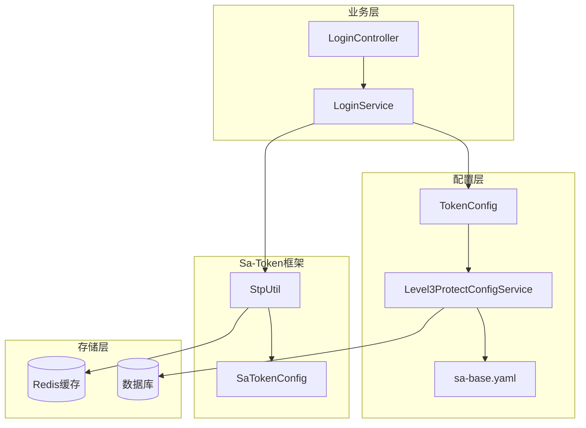
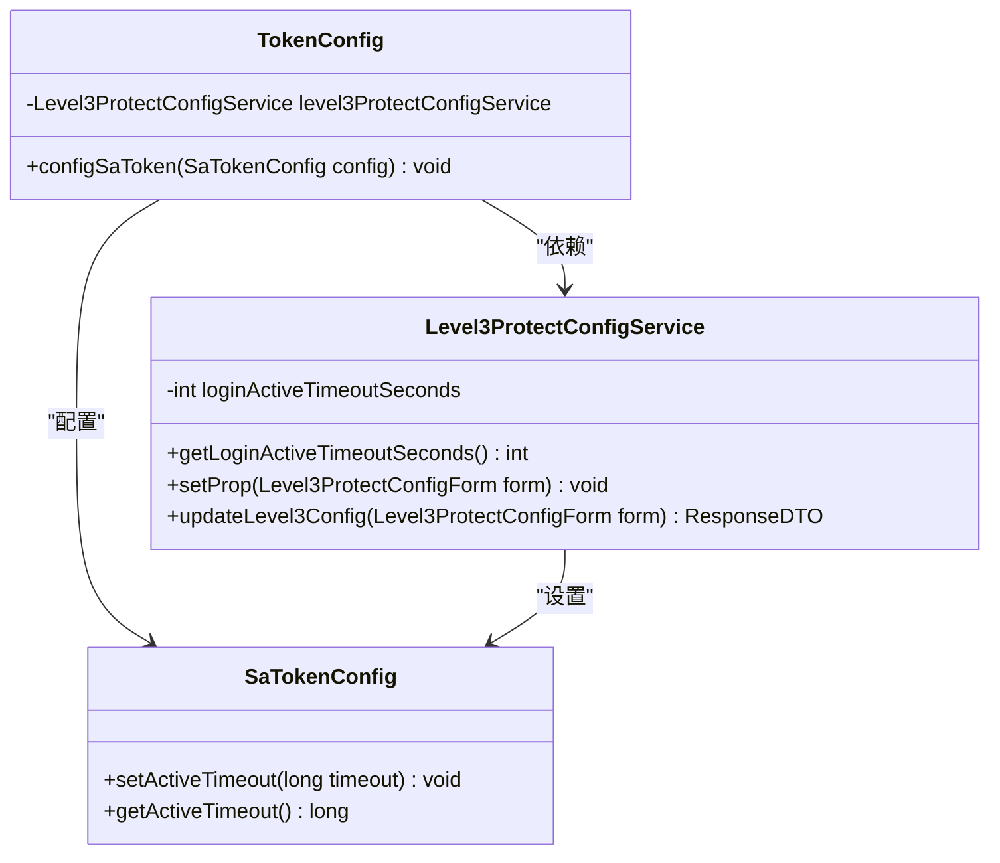
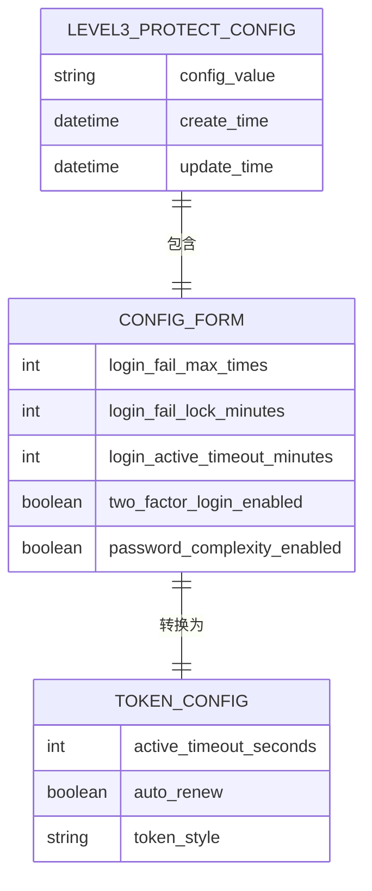
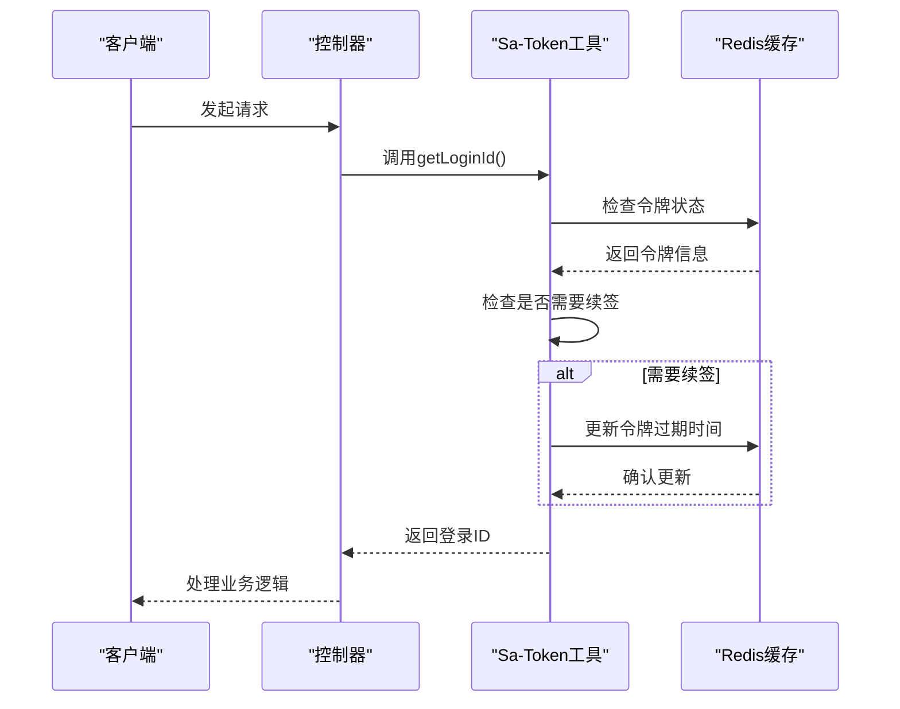
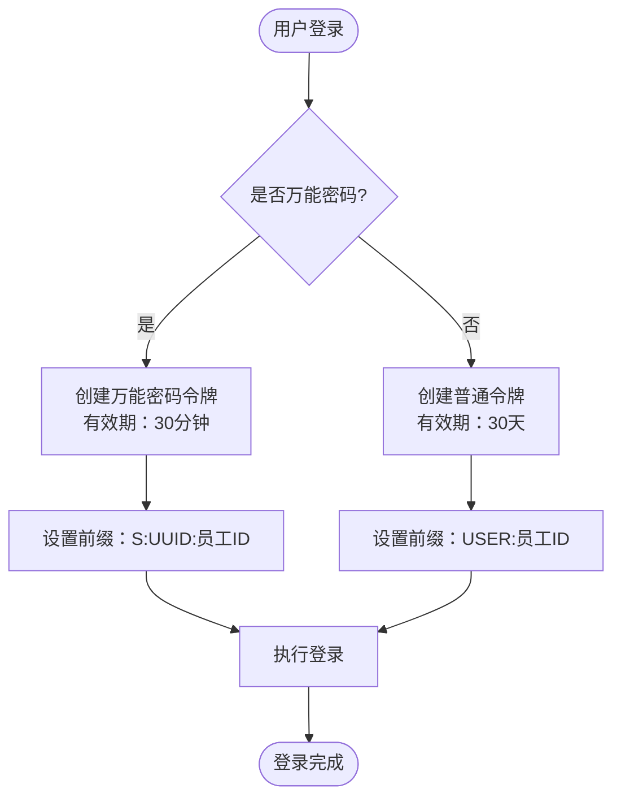
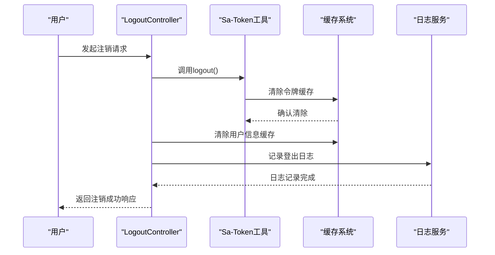

# 令牌刷新与有效期管理

<cite>
**本文档引用的文件**
- [TokenConfig.java](file://smart-admin-api-java17-springboot3/sa-base/src/main/java/net/lab1024/sa/base/config/TokenConfig.java)
- [Level3ProtectConfigService.java](file://smart-admin-api-java17-springboot3/sa-base/src/main/java/net/lab1024/sa/base/module/support/securityprotect/service/Level3ProtectConfigService.java)
- [LoginService.java](file://smart-admin-api-java17-springboot3/sa-admin/src/main/java/net/lab1024/sa\admin/module/system/login/service/LoginService.java)
- [LoginDeviceEnum.java](file://smart-admin-api-java17-springboot3/sa-base/src/main/java/net/lab1024/sa/base/constant/LoginDeviceEnum.java)
- [sa-base.yaml](file://smart-admin-api-java17-springboot3/sa-base/src/main/resources/dev/sa-base.yaml)
- [LoginController.java](file://smart-admin-api-java17-springboot3/sa-admin/src/main/java/net/lab1024/sa\admin/module/system/login/controller/LoginController.java)
</cite>

## 目录
1. [概述](#概述)
2. [系统架构](#系统架构)
3. [TokenConfig配置机制](#tokenconfig配置机制)
4. [Level3ProtectConfigService动态配置](#level3protectconfigservice动态配置)
5. [Sa-Token自动刷新机制](#sa-token自动刷新机制)
6. [不同登录方式的有效期差异](#不同登录方式的有效期差异)
7. [会话管理与令牌失效](#会话管理与令牌失效)
8. [最佳实践与安全考虑](#最佳实践与安全考虑)
9. [性能优化建议](#性能优化建议)
10. [总结](#总结)

## 概述

本文档全面解析Smart Admin系统中基于Sa-Token框架的令牌刷新策略和有效期动态管理机制。系统实现了等保三级要求下的可配置化令牌管理，支持多种登录方式的差异化有效期控制，并提供了完善的自动刷新和会话管理功能。

核心特性包括：
- 基于Level3ProtectConfigService的动态令牌活跃超时配置
- Sa-Token框架的自动续签机制
- 不同登录方式的差异化有效期管理
- 主动令牌失效与会话清理机制

## 系统架构

**图表来源**
- [TokenConfig.java](file://smart-admin-api-java17-springboot3/sa-base/src/main/java/net/lab1024/sa/base/config/TokenConfig.java#L1-L34)
- [Level3ProtectConfigService.java](file://smart-admin-api-java17-springboot3/sa-base/src/main/java/net/lab1024/sa/base/module/support/securityprotect/service/Level3ProtectConfigService.java#L1-L189)

## TokenConfig配置机制

### 核心配置类

TokenConfig类是系统令牌配置的核心入口，负责将动态配置注入到Sa-Token框架中。

**图表来源**
- [TokenConfig.java](file://smart-admin-api-java17-springboot3/sa-base/src/main/java/net/lab1024/sa/base/config/TokenConfig.java#L22-L30)
- [Level3ProtectConfigService.java](file://smart-admin-api-java17-springboot3/sa-base/src/main/java/net/lab1024/sa/base/module/support/securityprotect/service/Level3ProtectConfigService.java#L114-L116)

### 配置注入流程

TokenConfig通过Spring的依赖注入机制，在应用启动时自动配置Sa-Token的活跃超时时间：

1. **配置加载阶段**：Level3ProtectConfigService从数据库读取配置
2. **参数转换**：将分钟单位转换为秒单位
3. **框架配置**：通过configSaToken方法设置Sa-Token的activeTimeout
4. **动态生效**：配置立即生效，无需重启服务

**章节来源**
- [TokenConfig.java](file://smart-admin-api-java17-springboot3/sa-base/src/main/java/net/lab1024/sa/base/config/TokenConfig.java#L26-L30)
- [Level3ProtectConfigService.java](file://smart-admin-api-java17-springboot3/sa-base/src/main/java/net/lab1024/sa/base/module/support/securityprotect/service/Level3ProtectConfigService.java#L114-L116)

## Level3ProtectConfigService动态配置

### 配置数据模型

Level3ProtectConfigService管理等保三级相关的安全配置，其中登录活跃超时时间是关键的安全参数。

**图表来源**
- [Level3ProtectConfigService.java](file://smart-admin-api-java17-springboot3/sa-base/src/main/java/net/lab1024/sa/base/module/support/securityprotect/service/Level3ProtectConfigService.java#L149-L151)

### 动态配置更新机制

系统支持运行时动态更新令牌配置，无需重启应用：

1. **配置读取**：应用启动时从数据库读取配置
2. **属性设置**：通过setProp方法更新内部属性
3. **框架同步**：自动同步到Sa-Token配置
4. **实时生效**：新配置立即对后续登录生效

**章节来源**
- [Level3ProtectConfigService.java](file://smart-admin-api-java17-springboot3/sa-base/src/main/java/net/lab1024/sa/base/module/support/securityprotect/service/Level3ProtectConfigService.java#L118-L126)
- [Level3ProtectConfigService.java](file://smart-admin-api-java17-springboot3/sa-base/src/main/java/net/lab1024/sa/base/module/support/securityprotect/service/Level3ProtectConfigService.java#L170-L175)

## Sa-Token自动刷新机制

### 自动续签配置

Sa-Token框架提供了强大的自动续签功能，系统通过yaml配置启用此功能：

**图表来源**
- [sa-base.yaml](file://smart-admin-api-java17-springboot3/sa-base/src/main/resources/dev/sa-base.yaml#L165-L166)

### 续签触发条件

自动续签机制在以下情况下触发：

1. **直接调用**：任何直接调用StpUtil.getLoginId()的方法
2. **间接调用**：通过拦截器或过滤器间接调用
3. **活跃检查**：当令牌接近过期时自动检查
4. **手动续签**：开发者可手动调用续签方法

**章节来源**
- [sa-base.yaml](file://smart-admin-api-java17-springboot3/sa-base/src/main/resources/dev/sa-base.yaml#L165-L166)

## 不同登录方式的有效期差异

### 万能密码登录

万能密码登录是一种特殊的认证方式，具有严格的时间限制：

**图表来源**
- [LoginService.java](file://smart-admin-api-java17-springboot3/sa-admin/src/main/java/net/lab1024/sa\admin/module/system/login/service/LoginService.java#L172-L177)

### 设备类型登录

基于设备类型的登录采用统一的有效期策略：

| 设备类型 | 令牌前缀 | 有效期 | 特殊说明 |
|---------|---------|--------|----------|
| PC端 | USER:员工ID | 30天 | 标准企业用户 |
| Android | USER:员工ID | 30天 | 移动端标准 |
| Apple | USER:员工ID | 30天 | iOS移动端 |
| H5 | USER:员工ID | 30天 | Web移动端 |
| 微信小程序 | USER:员工ID | 30天 | 小程序端 |

### 万能密码与设备登录对比

| 特性 | 万能密码登录 | 设备类型登录 |
|------|-------------|-------------|
| 令牌前缀 | S:UUID:员工ID | USER:员工ID |
| 有效期 | 30分钟 | 30天 |
| 安全级别 | 高 | 中等 |
| 使用场景 | 紧急情况 | 正常业务 |
| 自动续签 | 支持 | 支持 |

**章节来源**
- [LoginService.java](file://smart-admin-api-java17-springboot3/sa-admin/src/main/java/net/lab1024/sa\admin/module/system/login/service/LoginService.java#L172-L177)
- [LoginService.java](file://smart-admin-api-java17-springboot3/sa-admin/src/main/java/net/lab1024/sa\admin/module/system/login/service/LoginService.java#L196-L199)
- [LoginDeviceEnum.java](file://smart-admin-api-java17-springboot3/sa-base/src/main/java/net/lab1024/sa/base/constant/LoginDeviceEnum.java#L14-L24)

## 会话管理与令牌失效

### 主动注销机制

系统提供了完整的主动注销功能，确保用户会话的及时清理：

**图表来源**
- [LoginService.java](file://smart-admin-api-java17-springboot3/sa-admin/src/main/java/net/lab1024/sa\admin/module/system/login/service/LoginService.java#L313-L337)

### 会话清理策略

系统在注销时执行多层级的清理工作：

1. **令牌清理**：从缓存中移除用户的认证令牌
2. **用户信息清理**：清除用户的临时缓存信息
3. **权限信息清理**：移除用户的权限缓存
4. **日志记录**：记录详细的登出行为

**章节来源**
- [LoginService.java](file://smart-admin-api-java17-springboot3/sa-admin/src/main/java/net/lab1024/sa\admin/module/system/login/service/LoginService.java#L313-L337)

## 最佳实践与安全考虑

### 刷新时机优化

为了平衡用户体验和系统性能，建议在以下场景触发令牌刷新：

1. **业务请求前**：在处理重要业务逻辑前检查令牌有效性
2. **定时检查**：定期检查令牌状态，避免长时间未使用导致失效
3. **用户交互**：在用户有明显交互时自动刷新
4. **后台任务**：对于长时间运行的任务，定期刷新令牌

### 安全性考虑

1. **令牌长度**：使用足够长的随机令牌防止暴力破解
2. **传输安全**：通过HTTPS传输令牌，防止中间人攻击
3. **存储安全**：在客户端安全存储令牌，避免泄露
4. **过期策略**：合理设置令牌过期时间，平衡安全性和可用性

### 性能影响分析

自动刷新机制对系统性能的影响：

| 影响因素 | 影响程度 | 优化建议 |
|---------|---------|----------|
| Redis访问频率 | 中等 | 使用连接池和适当的缓存策略 |
| CPU使用率 | 低 | 异步处理续签操作 |
| 内存占用 | 低 | 合理设置令牌缓存大小 |
| 网络延迟 | 低 | 本地化缓存减少网络请求 |

## 性能优化建议

### 缓存策略优化

1. **预热机制**：在用户活跃时段提前续签即将过期的令牌
2. **批量操作**：对于大量并发请求，采用批量续签策略
3. **智能预测**：根据用户行为模式预测续签需求
4. **降级策略**：在高负载时适当降低续签频率

### 监控指标

建议监控以下关键指标：

- **令牌续签成功率**
- **平均续签延迟**
- **缓存命中率**
- **并发续签数量**
- **异常续签比例**

### 扩展性考虑

随着用户规模增长，需要考虑：

1. **水平扩展**：支持多实例环境下的令牌共享
2. **分布式锁**：防止并发续签冲突
3. **限流机制**：防止恶意请求导致的资源耗尽
4. **熔断保护**：在下游服务异常时提供降级方案

## 总结

Smart Admin系统通过Sa-Token框架实现了灵活而安全的令牌管理系统。主要特点包括：

1. **动态配置能力**：基于Level3ProtectConfigService的可配置化管理，满足等保三级要求
2. **智能刷新机制**：自动续签功能在保证安全的同时提升用户体验
3. **差异化策略**：针对不同登录方式提供定制化的有效期管理
4. **完善的安全措施**：从令牌生成到失效的全流程安全保障

该系统为现代Web应用提供了企业级的认证授权解决方案，既满足了安全合规要求，又兼顾了用户体验和系统性能。通过合理的配置和优化，可以在各种规模的应用中稳定运行。