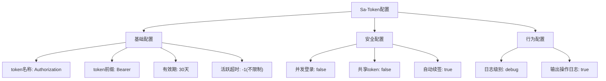
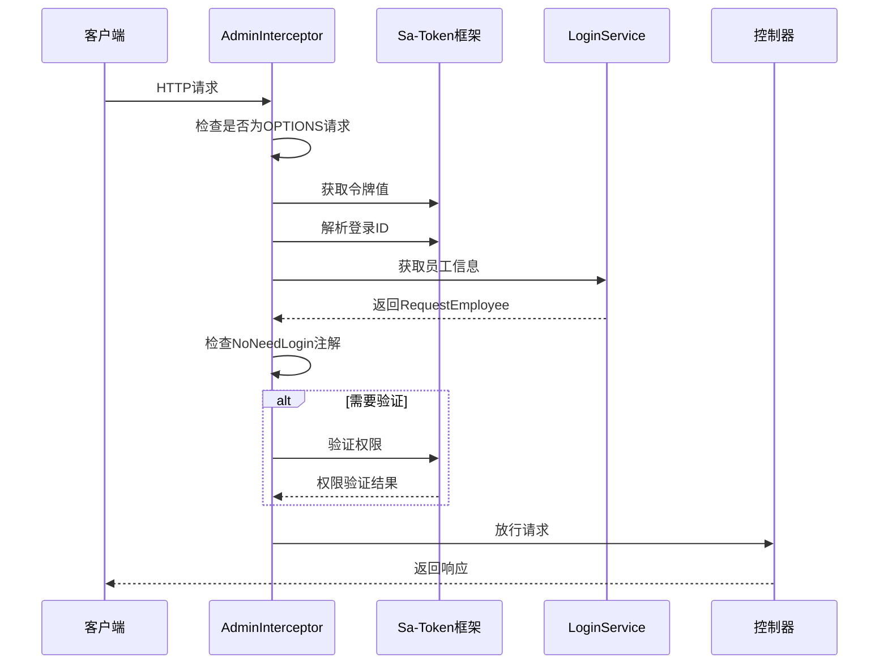
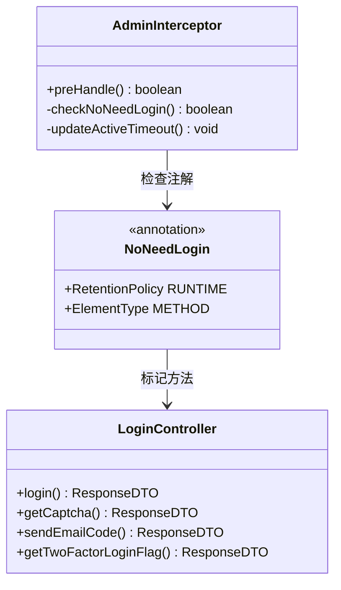
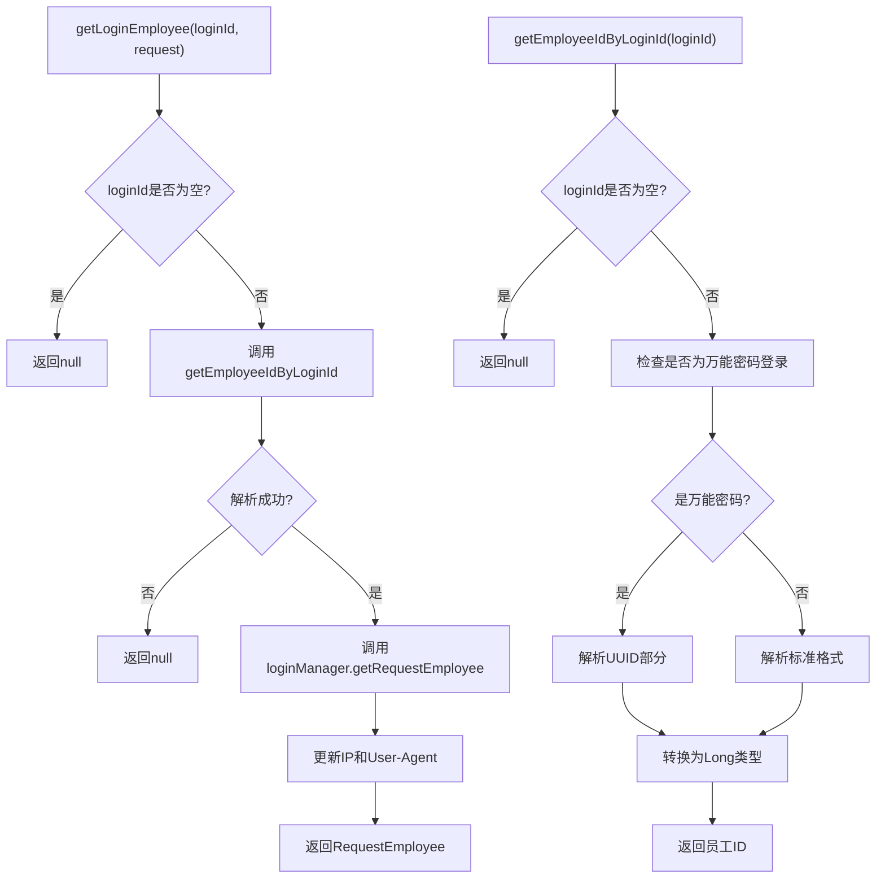
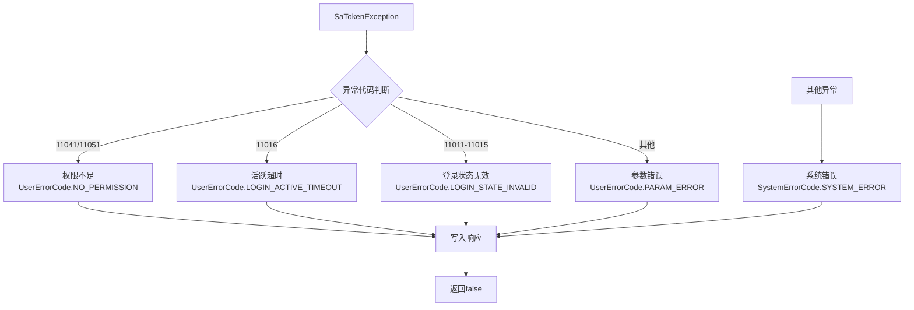
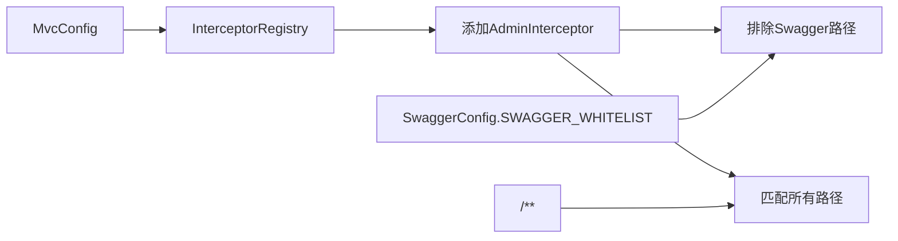

# 令牌验证

<cite>
**本文档引用的文件**
- [AdminInterceptor.java](file://smart-admin-api-java17-springboot3/sa-admin/src/main/java/net/lab1024/sa/admin/interceptor/AdminInterceptor.java)
- [NoNeedLogin.java](file://smart-admin-api-java17-springboot3/sa-base/src/main/java/net/lab1024/sa/base/common/annoation/NoNeedLogin.java)
- [LoginService.java](file://smart-admin-api-java17-springboot3/sa-admin/src/main/java/net/lab1024/sa/admin/module/system/login/service/LoginService.java)
- [GlobalExceptionHandler.java](file://smart-admin-api-java17-springboot3/sa-base/src/main/java/net/lab1024/sa/base/handler/GlobalExceptionHandler.java)
- [LoginController.java](file://smart-admin-api-java17-springboot3/sa-admin/src/main/java/net/lab1024/sa/admin/module/system/login/controller/LoginController.java)
- [MvcConfig.java](file://smart-admin-api-java17-springboot3/sa-admin/src/main/java/net/lab1024/sa/admin/config/MvcConfig.java)
- [TokenConfig.java](file://smart-admin-api-java17-springboot3/sa-base/src/main/java/net/lab1024/sa/base/config/TokenConfig.java)
- [sa-base.yaml](file://smart-admin-api-java17-springboot3/sa-base/src/main/resources/dev/sa-base.yaml)
</cite>

## 目录
1. [概述](#概述)
2. [Sa-Token框架集成](#sa-token框架集成)
3. [拦截器自动验证机制](#拦截器自动验证机制)
4. [NoNeedLogin注解实现原理](#noNeedlogin注解实现原理)
5. [LoginService令牌解析逻辑](#loginservice令牌解析逻辑)
6. [验证失败处理流程](#验证失败处理流程)
7. [开放API应用场景](#开放api应用场景)
8. [配置管理](#配置管理)
9. [总结](#总结)

## 概述

本文档详细阐述了基于Sa-Token框架的令牌验证机制，包括拦截器自动验证、NoNeedLogin注解的实现原理、LoginService中的令牌解析逻辑，以及验证失败时的处理流程。该系统通过多层次的安全控制，确保API访问的安全性和可控性。

## Sa-Token框架集成

### 框架特性

Sa-Token是一个轻量级的Java权限认证框架，具有以下核心特性：
- **无状态设计**：支持分布式部署
- **灵活配置**：可配置的令牌有效期和活跃超时
- **自动续签**：智能的令牌续期机制
- **多维度权限**：支持角色、权限、会话等多种验证方式

### 核心配置

系统通过多个配置文件实现了Sa-Token的灵活配置：

**图表来源**
- [sa-base.yaml](file://smart-admin-api-java17-springboot3/sa-base/src/main/resources/dev/sa-base.yaml#L150-L175)
- [TokenConfig.java](file://smart-admin-api-java17-springboot3/sa-base/src/main/java/net/lab1024/sa/base/config/TokenConfig.java#L1-L33)

**章节来源**
- [sa-base.yaml](file://smart-admin-api-java17-springboot3/sa-base/src/main/resources/dev/sa-base.yaml#L150-L175)
- [TokenConfig.java](file://smart-admin-api-java17-springboot3/sa-base/src/main/java/net/lab1024/sa/base/config/TokenConfig.java#L1-L33)

## 拦截器自动验证机制

### AdminInterceptor工作流程

AdminInterceptor作为系统的核心拦截器，负责在每个HTTP请求到达Controller之前进行令牌验证：

**图表来源**
- [AdminInterceptor.java](file://smart-admin-api-java17-springboot3/sa-admin/src/main/java/net/lab1024/sa/admin/interceptor/AdminInterceptor.java#L45-L121)

### 验证步骤详解

拦截器按照以下步骤进行令牌验证：

1. **请求预处理**：检查是否为OPTIONS请求，避免跨域预检干扰
2. **令牌提取**：从请求头中提取Authorization头部的令牌值
3. **登录ID解析**：通过Sa-Token框架解析令牌获取登录ID
4. **员工信息获取**：调用LoginService获取对应的员工信息
5. **注解检查**：检查方法上是否存在NoNeedLogin注解
6. **权限验证**：对于需要验证的请求，进行权限检查

**章节来源**
- [AdminInterceptor.java](file://smart-admin-api-java17-springboot3/sa-admin/src/main/java/net/lab1024/sa/admin/interceptor/AdminInterceptor.java#L45-L121)

## NoNeedLogin注解实现原理

### 注解定义

NoNeedLogin注解是一个简单的运行时注解，用于标记不需要登录验证的接口方法：

**图表来源**
- [NoNeedLogin.java](file://smart-admin-api-java17-springboot3/sa-base/src/main/java/net/lab1024/sa/base/common/annoation/NoNeedLogin.java#L1-L21)
- [AdminInterceptor.java](file://smart-admin-api-java17-springboot3/sa-admin/src/main/java/net/lab1024/sa/admin/interceptor/AdminInterceptor.java#L68-L72)

### 实现机制

拦截器通过反射机制检查方法上的NoNeedLogin注解：

1. **注解检测**：使用`HandlerMethod.getMethodAnnotation(NoNeedLogin.class)`检查方法注解
2. **放行逻辑**：如果存在NoNeedLogin注解，直接更新活跃时间并放行请求
3. **上下文设置**：即使放行，也会设置请求上下文以便后续使用

### 应用场景示例

系统中多个开放接口使用了NoNeedLogin注解：

- **登录接口**：`/login` - 用户登录
- **验证码接口**：`/login/getCaptcha` - 获取图形验证码
- **邮箱验证码**：`/login/sendEmailCode/{loginName}` - 发送邮箱验证码
- **配置查询**：`/login/getTwoFactorLoginFlag` - 获取双因子登录配置

**章节来源**
- [NoNeedLogin.java](file://smart-admin-api-java17-springboot3/sa-base/src/main/java/net/lab1024/sa/base/common/annoation/NoNeedLogin.java#L1-L21)
- [AdminInterceptor.java](file://smart-admin-api-java17-springboot3/sa-admin/src/main/java/net/lab1024/sa/admin/interceptor/AdminInterceptor.java#L68-L72)
- [LoginController.java](file://smart-admin-api-java17-springboot3/sa-admin/src/main/java/net/lab1024/sa/admin/module/system/login/controller/LoginController.java#L42-L89)

## LoginService令牌解析逻辑

### getLoginEmployee方法详解

LoginService的getLoginEmployee方法是令牌解析的核心组件：

**图表来源**
- [LoginService.java](file://smart-admin-api-java17-springboot3/sa-admin/src/main/java/net/lab1024/sa/admin/module/system/login/service/LoginService.java#L267-L284)
- [LoginService.java](file://smart-admin-api-java17-springboot3/sa-admin/src/main/java/net/lab1024/sa/admin/module/system/login/service/LoginService.java#L289-L308)

### 万能密码特殊处理

系统支持万能密码登录，这是一种特殊的认证方式：

1. **登录ID格式**：`S:<UUID>:<employeeId>`
2. **有效期限制**：万能密码登录仅能维持30分钟
3. **权限处理**：万能密码用户不需要强制修改密码
4. **安全性考虑**：限制登录时间和功能范围

### 令牌解析流程

令牌解析遵循以下流程：

1. **格式识别**：区分普通登录和万能密码登录
2. **字段提取**：从登录ID中提取员工ID
3. **类型转换**：将字符串转换为Long类型
4. **异常处理**：捕获并记录解析过程中的异常

**章节来源**
- [LoginService.java](file://smart-admin-api-java17-springboot3/sa-admin/src/main/java/net/lab1024/sa/admin/module/system/login/service/LoginService.java#L267-L308)

## 验证失败处理流程

### 异常分类处理

系统针对不同类型的Sa-Token异常进行精细化处理：

**图表来源**
- [AdminInterceptor.java](file://smart-admin-api-java17-springboot3/sa-admin/src/main/java/net/lab1024/sa/admin/interceptor/AdminInterceptor.java#L98-L116)

### 全局异常处理器

系统通过GlobalExceptionHandler统一处理各种异常：

1. **Sa-Token异常**：专门处理权限相关的异常
2. **业务异常**：处理业务逻辑错误
3. **参数异常**：处理请求参数验证失败
4. **系统异常**：处理未知的系统错误

### 响应格式标准化

所有异常响应都遵循统一的格式：
- **状态码**：使用ErrorCode枚举定义
- **消息内容**：提供用户友好的错误信息
- **开发环境**：在非生产环境中包含详细堆栈信息

**章节来源**
- [AdminInterceptor.java](file://smart-admin-api-java17-springboot3/sa-admin/src/main/java/net/lab1024/sa/admin/interceptor/AdminInterceptor.java#L98-L116)
- [GlobalExceptionHandler.java](file://smart-admin-api-java17-springboot3/sa-base/src/main/java/net/lab1024/sa/base/handler/GlobalExceptionHandler.java#L76-L116)

## 开放API应用场景

### NoNeedLogin注解的应用价值

NoNeedLogin注解在开放API场景中发挥重要作用：

#### 1. 登录相关接口
- **用户认证**：登录、注销等核心认证功能
- **验证码服务**：图形验证码、短信验证码等
- **身份验证**：邮箱验证码、双因子认证等

#### 2. 公共信息服务
- **系统配置**：获取系统配置、功能开关等
- **帮助文档**：公开的帮助信息和文档
- **版本信息**：系统版本、更新日志等

#### 3. 第三方集成接口
- **回调接口**：支付回调、通知回调等
- **数据同步**：与其他系统的数据同步接口
- **监控接口**：健康检查、性能监控等

### 安全策略平衡

通过NoNeedLogin注解，系统实现了安全与便利的平衡：

1. **最小权限原则**：只对必要的接口开放
2. **功能隔离**：敏感操作仍然需要完整验证
3. **审计追踪**：所有访问都有记录可查
4. **动态调整**：可根据需求随时调整开放范围

**章节来源**
- [LoginController.java](file://smart-admin-api-java17-springboot3/sa-admin/src/main/java/net/lab1024/sa/admin/module/system/login/controller/LoginController.java#L42-L89)

## 配置管理

### 拦截器注册配置

系统通过MvcConfig类注册AdminInterceptor：

**图表来源**
- [MvcConfig.java](file://smart-admin-api-java17-springboot3/sa-admin/src/main/java/net/lab1024/sa/admin/config/MvcConfig.java#L28-L32)

### 动态配置调整

系统支持运行时调整Sa-Token配置：

1. **活跃超时**：根据三级等保要求动态调整
2. **登录限制**：根据安全策略调整并发登录规则
3. **自动续签**：根据业务需求调整续签策略

**章节来源**
- [MvcConfig.java](file://smart-admin-api-java17-springboot3/sa-admin/src/main/java/net/lab1024/sa/admin/config/MvcConfig.java#L28-L32)
- [TokenConfig.java](file://smart-admin-api-java17-springboot3/sa-base/src/main/java/net/lab1024/sa/base/config/TokenConfig.java#L25-L32)

## 总结

本文档全面阐述了基于Sa-Token框架的令牌验证机制，涵盖了从框架集成到具体实现的各个环节。该系统通过以下特点确保了安全性和可用性的平衡：

### 核心优势

1. **自动化验证**：通过拦截器实现透明的令牌验证
2. **灵活控制**：通过NoNeedLogin注解实现细粒度的权限控制
3. **异常处理**：完善的异常处理机制确保系统稳定性
4. **配置灵活**：支持运行时动态调整安全策略

### 技术特色

- **无状态设计**：支持分布式部署和水平扩展
- **智能续签**：自动延长有效令牌的生命周期
- **多维度验证**：支持角色、权限、会话等多种验证方式
- **开放兼容**：为第三方集成提供安全的开放接口

### 应用价值

该令牌验证机制为企业级应用提供了可靠的安全保障，同时保持了良好的开发体验和运维便利性。通过合理的配置和注解使用，开发者可以快速构建安全、高效的企业应用系统。