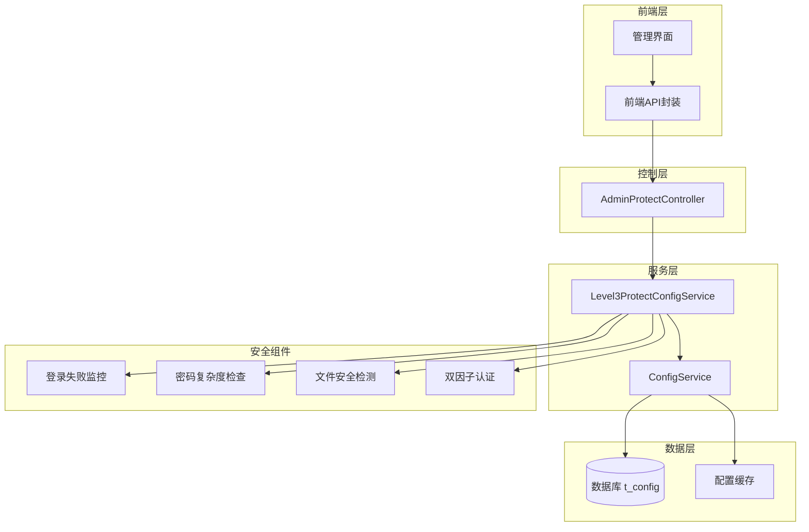
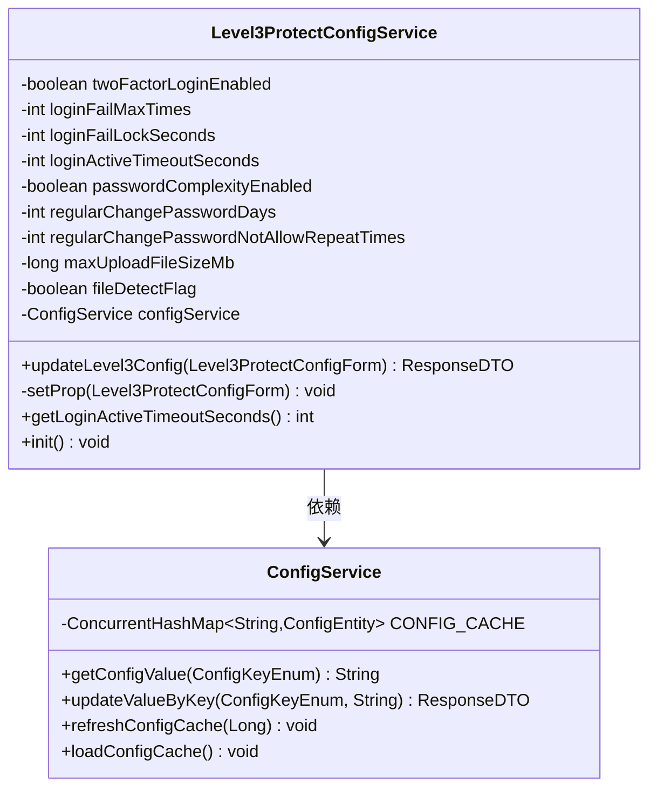
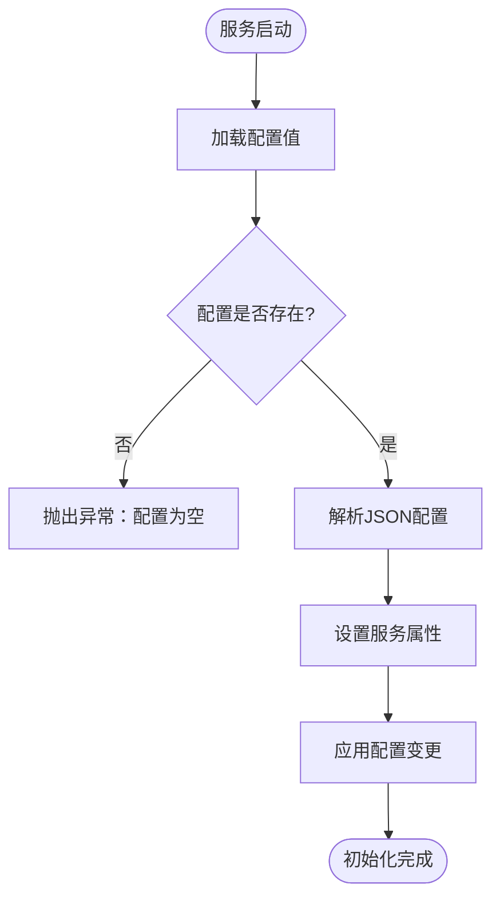
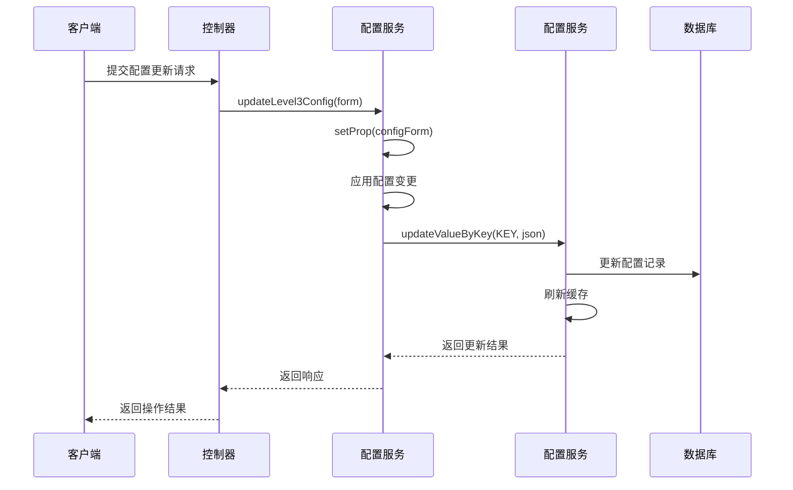
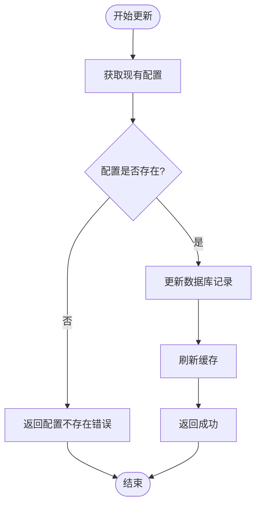
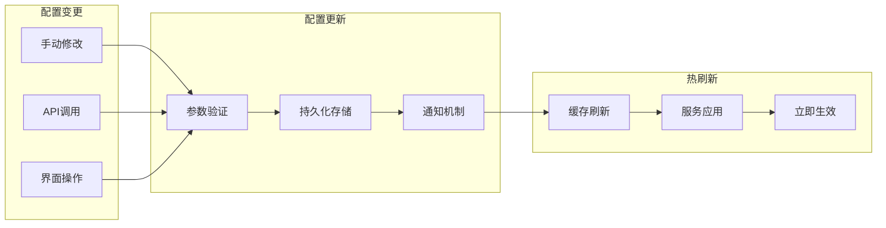
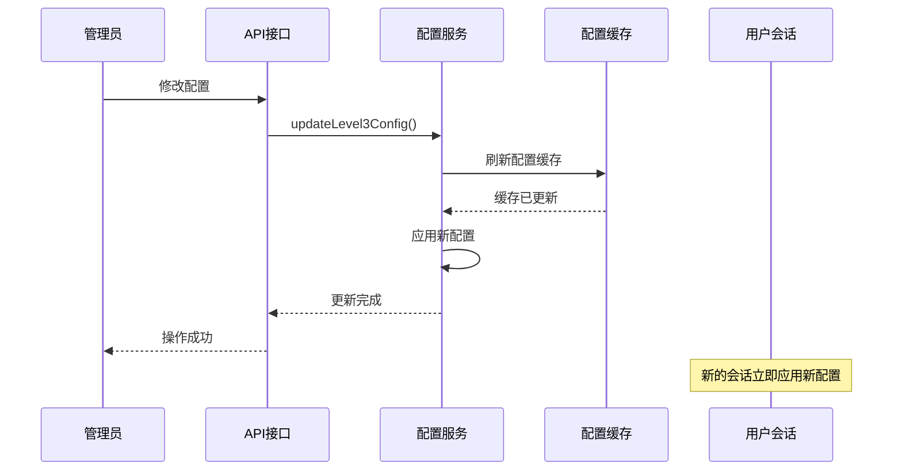
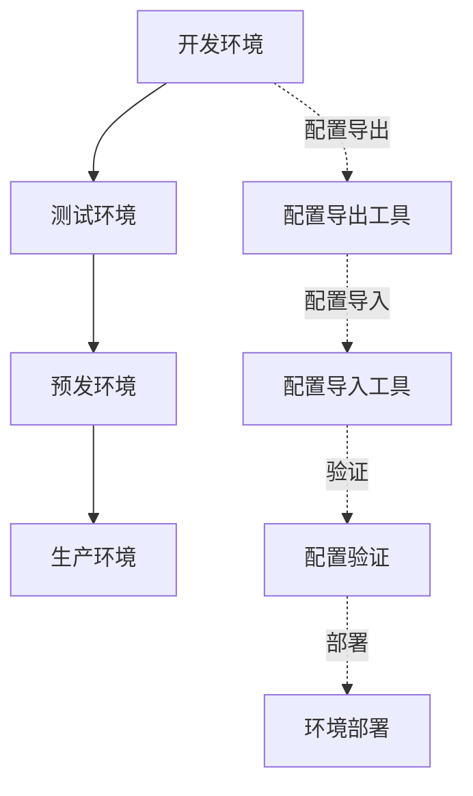
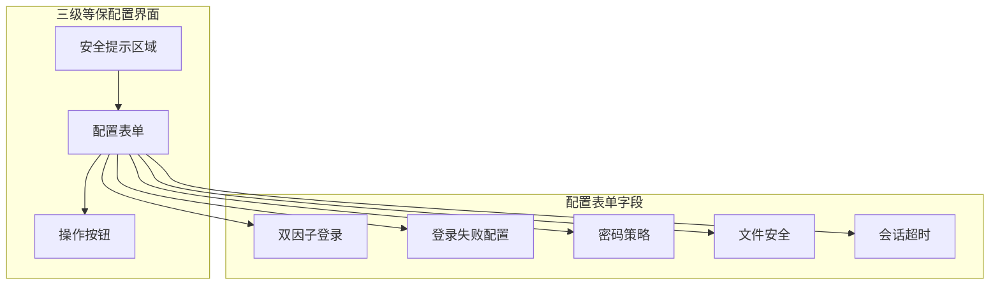
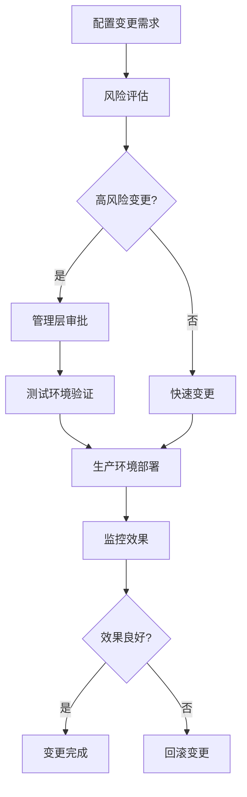

# 防护策略配置

<cite>
**本文档引用的文件**
- [Level3ProtectConfigForm.java](file://smart-admin-api-java17-springboot3/sa-base/src/main/java/net/lab1024/sa/base/module/support/securityprotect/domain/Level3ProtectConfigForm.java)
- [Level3ProtectConfigService.java](file://smart-admin-api-java17-springboot3/sa-base/src/main/java/net/lab1024/sa/base/module/support/securityprotect/service/Level3ProtectConfigService.java)
- [AdminProtectController.java](file://smart-admin-api-java17-springboot3/sa-admin/src/main/java/net/lab1024/sa/admin/module/system/support/AdminProtectController.java)
- [level3-protect-config-index.vue](file://smart-admin-web-javascript/src/views/support/level3protect/level3-protect-config-index.vue)
- [level3-protect-api.js](file://smart-admin-web-javascript/src/api/support/level3-protect-api.js)
- [ConfigService.java](file://smart-admin-api-java17-springboot3/sa-base/src/main/java/net/lab1024/sa/base/module/support/config/ConfigService.java)
- [ConfigKeyEnum.java](file://smart-admin-api-java17-springboot3/sa-base/src/main/java/net/lab1024/sa/base/module/support/config/ConfigKeyEnum.java)
</cite>

## 目录
1. [概述](#概述)
2. [系统架构](#系统架构)
3. [Level3ProtectConfigForm 表单结构](#level3protectconfigform-表单结构)
4. [Level3ProtectConfigService 核心服务](#level3protectconfigservice-核心服务)
5. [配置持久化机制](#配置持久化机制)
6. [热刷新能力](#热刷新能力)
7. [多环境配置管理](#多环境配置管理)
8. [API 接口文档](#api-接口文档)
9. [管理界面操作指南](#管理界面操作指南)
10. [配置变更影响分析](#配置变更影响分析)
11. [最佳实践建议](#最佳实践建议)

## 概述

三级安全防护策略配置体系是中国国家等级保护认证中的最高级别安全配置框架。该系统提供了全面的安全防护能力，包括防暴力破解、账号锁定、验证码触发、密码复杂度控制、文件安全检测等多个维度的安全保障机制。

### 核心特性

- **多层次防护**：涵盖登录安全、密码管理、文件上传、会话管理等全方位安全控制
- **动态配置**：支持运行时配置修改和热刷新机制
- **多环境适配**：针对开发、预发、生产环境提供差异化配置策略
- **实时生效**：配置变更立即生效，无需重启系统
- **可视化管理**：提供直观的管理界面进行配置操作

## 系统架构



**架构图来源**
- [AdminProtectController.java](file://smart-admin-api-java17-springboot3/sa-admin/src/main/java/net/lab1024/sa/admin/module/system/support/AdminProtectController.java#L23-L73)
- [Level3ProtectConfigService.java](file://smart-admin-api-java17-springboot3/sa-base/src/main/java/net/lab1024/sa/base/module/support/securityprotect/service/Level3ProtectConfigService.java#L27-L189)

## Level3ProtectConfigForm 表单结构

Level3ProtectConfigForm 是三级安全防护策略的核心配置表单对象，定义了所有可配置的安全参数。

### 配置字段详解

| 字段名 | 类型 | 默认值 | 描述 | 验证规则 |
|--------|------|--------|------|----------|
| loginFailMaxTimes | Integer | 5 | 连续登录失败次数阈值 | 不能为空，范围：0-10 |
| loginFailLockMinutes | Integer | 30 | 登录失败锁定时间（分钟） | 不能为空，范围：0-无限 |
| loginActiveTimeoutMinutes | Integer | 30 | 登录后无操作自动退出时间（分钟） | 不能为空，范围：-1到无限 |
| twoFactorLoginEnabled | Boolean | true | 是否启用双因子登录 | 不能为空 |
| passwordComplexityEnabled | Boolean | true | 是否启用密码复杂度检查 | 不能为空 |
| regularChangePasswordMonths | Integer | 3 | 定期修改密码时间间隔（月） | 不能为空，范围：-1到6 |
| regularChangePasswordNotAllowRepeatTimes | Integer | 3 | 密码重复使用限制次数 | 不能为空，范围：-1到6 |
| fileDetectFlag | Boolean | true | 是否启用文件安全检测 | 不能为空 |
| maxUploadFileSizeMb | Long | 50 | 上传文件大小限制（MB） | 不能为空，范围：0到无限 |

### 配置项详细说明

#### 防暴力破解配置
- **loginFailMaxTimes**：设置连续登录失败的最大允许次数，超过此数值将触发账号锁定机制
- **loginFailLockMinutes**：配置账号锁定持续时间，防止暴力破解攻击

#### 会话管理配置
- **loginActiveTimeoutMinutes**：设置用户会话活跃超时时间，超过指定时间未操作将自动登出
- **twoFactorLoginEnabled**：启用双因子认证，增加登录安全性

#### 密码安全配置
- **passwordComplexityEnabled**：强制密码复杂度要求，提升密码安全性
- **regularChangePasswordMonths**：定期密码更换策略，降低密码泄露风险
- **regularChangePasswordNotAllowRepeatTimes**：密码重复使用限制，防止密码循环使用

#### 文件安全配置
- **fileDetectFlag**：启用文件内容安全检测，防止恶意文件上传
- **maxUploadFileSizeMb**：设置文件上传大小限制，防止存储空间耗尽

**节来源**
- [Level3ProtectConfigForm.java](file://smart-admin-api-java17-springboot3/sa-base/src/main/java/net/lab1024/sa/base/module/support/securityprotect/domain/Level3ProtectConfigForm.java#L17-L58)

## Level3ProtectConfigService 核心服务

Level3ProtectConfigService 是三级安全防护策略的核心服务类，负责配置的加载、验证、应用和持久化。

### 服务架构设计



**类图来源**
- [Level3ProtectConfigService.java](file://smart-admin-api-java17-springboot3/sa-base/src/main/java/net/lab1024/sa/base/module/support/securityprotect/service/Level3ProtectConfigService.java#L27-L189)
- [ConfigService.java](file://smart-admin-api-java17-springboot3/sa-base/src/main/java/net/lab1024/sa/base/module/support/config/ConfigService.java#L35-L188)

### 核心功能实现

#### 1. 配置初始化机制
服务启动时通过 `@PostConstruct` 注解的 `init()` 方法自动加载配置：



**流程图来源**
- [Level3ProtectConfigService.java](file://smart-admin-api-java17-springboot3/sa-base/src/main/java/net/lab1024/sa/base/module/support/securityprotect/service/Level3ProtectConfigService.java#L118-L126)

#### 2. 属性设置逻辑
`setProp()` 方法负责将表单配置映射到服务属性：

- **文件检测配置**：控制恶意文件检测功能的启用状态
- **文件大小限制**：设置上传文件的最大允许大小
- **登录失败处理**：配置失败次数阈值和锁定时间
- **会话超时管理**：设置用户会话的活跃超时时间
- **密码策略应用**：启用或禁用密码复杂度检查
- **定期密码策略**：配置密码更换周期和重复使用限制
- **双因子认证**：启用多因素身份验证机制

#### 3. 配置更新流程
`updateLevel3Config()` 方法实现配置的原子性更新：



**序列图来源**
- [Level3ProtectConfigService.java](file://smart-admin-api-java17-springboot3/sa-base/src/main/java/net/lab1024/sa/base/module/support/securityprotect/service/Level3ProtectConfigService.java#L179-L188)
- [AdminProtectController.java](file://smart-admin-api-java17-springboot3/sa-admin/src/main/java/net/lab1024/sa/admin/module/system/support/AdminProtectController.java#L62-L65)

**节来源**
- [Level3ProtectConfigService.java](file://smart-admin-api-java17-springboot3/sa-base/src/main/java/net/lab1024/sa/base/module/support/securityprotect/service/Level3ProtectConfigService.java#L27-L189)

## 配置持久化机制

系统采用基于数据库的配置持久化方案，确保配置信息的可靠存储和跨实例共享。

### 数据存储架构

```mermaid
erDiagram
CONFIG {
bigint config_id PK
varchar config_key UK
varchar config_value
varchar config_desc
datetime create_time
datetime update_time
}
LEVEL3_PROTECT_CONFIG {
config_key "level3_protect_config"
config_value JSON
config_desc "三级等保配置"
}
CONFIG ||--|| LEVEL3_PROTECT_CONFIG : contains
```

**实体图来源**
- [ConfigKeyEnum.java](file://smart-admin-api-java17-springboot3/sa-base/src/main/java/net/lab1024/sa/base/module/support/config/ConfigKeyEnum.java#L25-L25)

### 配置存储策略

#### 1. JSON 序列化
配置数据以 JSON 格式存储在 `config_value` 字段中，便于结构化管理和版本兼容：

```json
{
  "loginFailMaxTimes": 5,
  "loginFailLockMinutes": 30,
  "loginActiveTimeoutMinutes": 30,
  "twoFactorLoginEnabled": true,
  "passwordComplexityEnabled": true,
  "regularChangePasswordMonths": 3,
  "regularChangePasswordNotAllowRepeatTimes": 3,
  "fileDetectFlag": true,
  "maxUploadFileSizeMb": 50
}
```

#### 2. 缓存机制
ConfigService 维护配置缓存，提高配置访问性能：

- **缓存加载**：应用启动时一次性加载所有配置到内存
- **缓存更新**：配置修改时同步刷新缓存
- **缓存失效**：支持手动刷新和自动失效机制

#### 3. 原子性更新
配置更新采用数据库事务保证原子性：



**流程图来源**
- [ConfigService.java](file://smart-admin-api-java17-springboot3/sa-base/src/main/java/net/lab1024/sa/base/module/support/config/ConfigService.java#L170-L186)

**节来源**
- [ConfigService.java](file://smart-admin-api-java17-springboot3/sa-base/src/main/java/net/lab1024/sa/base/module/support/config/ConfigService.java#L35-L188)
- [ConfigKeyEnum.java](file://smart-admin-api-java17-springboot3/sa-base/src/main/java/net/lab1024/sa/base/module/support/config/ConfigKeyEnum.java#L25-L25)

## 热刷新能力

系统具备强大的热刷新能力，支持配置变更的即时生效，无需重启应用程序。

### 热刷新机制设计



### 实现原理

#### 1. 配置监听机制
系统通过 SmartReload 框架实现配置变更的实时检测：

- **轮询检测**：后台线程定期检查配置标识变化
- **事件驱动**：配置变更时触发相应的处理逻辑
- **状态同步**：确保所有实例的配置状态一致

#### 2. 服务级热刷新
Level3ProtectConfigService 在配置更新时自动应用新配置：



**序列图来源**
- [Level3ProtectConfigService.java](file://smart-admin-api-java17-springboot3/sa-base/src/main/java/net/lab1024/sa/base/module/support/securityprotect/service/Level3ProtectConfigService.java#L179-L188)

#### 3. 配置生效范围
热刷新机制确保以下层面的即时生效：

- **全局配置**：所有新建立的会话立即应用新配置
- **会话管理**：当前活跃会话根据配置调整超时策略
- **安全策略**：防暴力破解、密码策略等安全措施实时更新

**节来源**
- [Level3ProtectConfigService.java](file://smart-admin-api-java17-springboot3/sa-base/src/main/java/net/lab1024/sa/base/module/support/securityprotect/service/Level3ProtectConfigService.java#L179-L188)

## 多环境配置管理

系统针对不同的部署环境提供差异化的配置管理策略，确保各环境的安全性和可用性。

### 环境配置矩阵

| 环境类型 | 登录失败锁定 | 密码复杂度 | 双因子认证 | 文件检测 | 上传限制 |
|----------|-------------|------------|------------|----------|----------|
| 开发环境 | 关闭 | 关闭 | 关闭 | 关闭 | 无限制 |
| 预发环境 | 中等强度 | 开启 | 开启 | 开启 | 100MB |
| 生产环境 | 高强度 | 开启 | 开启 | 开启 | 50MB |

### 环境特定配置

#### 开发环境配置
```json
{
  "loginFailMaxTimes": 0,
  "loginFailLockMinutes": 0,
  "passwordComplexityEnabled": false,
  "twoFactorLoginEnabled": false,
  "fileDetectFlag": false,
  "maxUploadFileSizeMb": 0
}
```

#### 生产环境配置
```json
{
  "loginFailMaxTimes": 5,
  "loginFailLockMinutes": 30,
  "passwordComplexityEnabled": true,
  "twoFactorLoginEnabled": true,
  "fileDetectFlag": true,
  "maxUploadFileSizeMb": 50
}
```

### 配置迁移策略



### 环境隔离机制

#### 1. 配置键值隔离
不同环境使用独立的配置键值，避免配置冲突：

```java
// 开发环境
ConfigKeyEnum.DEV_LEVEL3_PROTECT_CONFIG

// 生产环境  
ConfigKeyEnum.PROD_LEVEL3_PROTECT_CONFIG
```

#### 2. 权限控制
不同环境的配置修改权限分离：

- **开发环境**：开发人员可自由修改
- **预发环境**：测试人员和开发人员可修改
- **生产环境**：仅运维人员可在授权下修改

**节来源**
- [level3-protect-config-index.vue](file://smart-admin-web-javascript/src/views/support/level3protect/level3-protect-config-index.vue#L125-L165)

## API 接口文档

系统提供完整的 RESTful API 接口用于配置管理操作。

### 接口规范

#### 1. 查询配置
```http
GET /support/protect/level3protect/getConfig
```

**响应格式**：
```json
{
  "code": 200,
  "data": "{\"loginFailMaxTimes\":5,\"loginFailLockMinutes\":30,...}",
  "msg": "success"
}
```

#### 2. 更新配置
```http
POST /support/protect/level3protect/updateConfig
Content-Type: application/json

{
  "loginFailMaxTimes": 5,
  "loginFailLockMinutes": 30,
  "loginActiveTimeoutMinutes": 30,
  "twoFactorLoginEnabled": true,
  "passwordComplexityEnabled": true,
  "regularChangePasswordMonths": 3,
  "regularChangePasswordNotAllowRepeatTimes": 3,
  "fileDetectFlag": true,
  "maxUploadFileSizeMb": 50
}
```

**响应格式**：
```json
{
  "code": 200,
  "data": "配置更新成功",
  "msg": "success"
}
```

### 前端 API 封装

前端通过 level3ProtectApi 对象提供统一的 API 访问接口：

```javascript
// 查询配置
await level3ProtectApi.getConfig();

// 更新配置  
await level3ProtectApi.updateConfig(configForm);
```

**节来源**
- [AdminProtectController.java](file://smart-admin-api-java17-springboot3/sa-admin/src/main/java/net/lab1024/sa/admin/module/system/support/AdminProtectController.java#L62-L72)
- [level3-protect-api.js](file://smart-admin-web-javascript/src/api/support/level3-protect-api.js#L10-L24)

## 管理界面操作指南

系统提供直观的 Vue.js 管理界面，支持配置的可视化编辑和实时预览。

### 界面布局



**界面图来源**
- [level3-protect-config-index.vue](file://smart-admin-web-javascript/src/views/support/level3protect/level3-protect-config-index.vue#L8-L115)

### 操作流程

#### 1. 配置查询
- 页面加载时自动获取当前配置
- 显示配置的详细信息和默认值对比
- 提供配置状态的实时反馈

#### 2. 配置修改
- 支持逐项修改和批量配置
- 实时表单验证和错误提示
- 修改前的确认对话框

#### 3. 配置重置
- **恢复默认配置**：一键恢复到三级等保标准配置
- **清除配置**：完全移除所有安全防护配置（需确认）

### 操作示例

#### 基础配置修改
1. 打开三级等保配置页面
2. 修改登录失败锁定时间为 60 分钟
3. 启用密码复杂度检查
4. 点击"保存配置"按钮
5. 查看操作结果和系统反馈

#### 批量配置场景
1. 选择"恢复三级等保默认配置"
2. 系统自动填充标准配置值
3. 确认修改并保存
4. 验证配置生效情况

**节来源**
- [level3-protect-config-index.vue](file://smart-admin-web-javascript/src/views/support/level3protect/level3-protect-config-index.vue#L110-L255)

## 配置变更影响分析

配置变更会对系统的安全行为产生直接影响，需要全面评估变更的影响范围。

### 安全策略影响矩阵

| 配置项 | 影响范围 | 安全强度变化 | 性能影响 | 用户体验影响 |
|--------|----------|--------------|----------|--------------|
| loginFailMaxTimes | 登录安全 | 高 → 中 | 低 | 无明显影响 |
| loginFailLockMinutes | 登录安全 | 高 → 中 | 低 | 用户体验下降 |
| passwordComplexityEnabled | 密码安全 | 低 → 高 | 中 | 用户体验轻微下降 |
| twoFactorLoginEnabled | 身份验证 | 低 → 高 | 中 | 用户体验显著下降 |
| fileDetectFlag | 文件安全 | 低 → 高 | 高 | 文件上传速度下降 |
| maxUploadFileSizeMb | 存储安全 | 高 → 中 | 低 | 用户体验轻微影响 |

### 具体影响分析

#### 1. 防暴力破解配置变更
- **减少失败次数限制**：降低暴力破解难度，但可能增加服务器负载
- **延长锁定时间**：提高破解成本，但可能影响正常用户登录
- **禁用锁定功能**：完全开放登录尝试，存在安全风险

#### 2. 密码策略变更
- **禁用复杂度检查**：降低密码安全性，增加账户被盗风险
- **缩短密码更换周期**：提高密码安全性，但增加用户记忆负担
- **减少重复使用限制**：可能增加密码被猜测的风险

#### 3. 双因子认证影响
- **启用双因子认证**：显著提升账户安全性，但增加登录复杂度
- **禁用双因子认证**：降低账户安全性，但改善用户体验

#### 4. 文件安全配置
- **启用文件检测**：提高系统安全性，但增加 CPU 和内存消耗
- **放宽上传限制**：可能增加恶意文件上传风险

### 变更决策建议



**节来源**
- [Level3ProtectConfigService.java](file://smart-admin-api-java17-springboot3/sa-base/src/main/java/net/lab1024/sa/base/module/support/securityprotect/service/Level3ProtectConfigService.java#L131-L176)

## 最佳实践建议

基于系统特性和实际应用场景，提出以下最佳实践建议。

### 配置优化策略

#### 1. 分阶段实施原则
- **渐进式增强**：从基础安全配置开始，逐步增强安全级别
- **风险可控**：每次变更控制在可接受的风险范围内
- **效果验证**：变更后充分测试，确保不影响业务功能

#### 2. 环境差异化配置
- **开发环境**：注重开发效率，适当降低安全强度
- **测试环境**：模拟生产环境配置，确保测试准确性
- **生产环境**：采用最高安全标准，确保系统安全

#### 3. 监控和审计
- **配置变更日志**：记录每次配置变更的详细信息
- **安全指标监控**：监控登录失败率、密码复杂度达标率等指标
- **定期安全评估**：定期评估配置的有效性和合理性

### 运维管理建议

#### 1. 配置备份策略
```bash
# 定期备份配置
mysqldump -u username -p database_name t_config > config_backup.sql

# 配置快照
curl -X GET "http://localhost:8080/support/protect/level3protect/getConfig" \
     -o "level3_protect_config_$(date +%Y%m%d_%H%M%S).json"
```

#### 2. 回滚预案
- **配置版本管理**：维护配置的历史版本
- **快速回滚机制**：支持一键恢复到上一版本
- **应急预案**：制定配置异常的应急处理流程

#### 3. 权限管理
- **最小权限原则**：仅授权必要的人员进行配置修改
- **操作审计**：记录所有配置修改操作
- **定期审查**：定期审查配置权限分配的合理性

### 性能优化建议

#### 1. 缓存优化
- **配置缓存预热**：应用启动时预加载关键配置
- **缓存失效策略**：合理设置缓存过期时间
- **分布式缓存**：在集群环境中保持缓存一致性

#### 2. 数据库优化
- **索引优化**：为配置键值建立唯一索引
- **查询优化**：避免频繁的配置查询操作
- **连接池管理**：合理配置数据库连接池参数

#### 3. 网络优化
- **CDN加速**：对于静态配置文件使用CDN分发
- **压缩传输**：启用配置数据的压缩传输
- **异步更新**：采用异步方式处理配置更新

### 安全加固建议

#### 1. 访问控制
- **IP白名单**：限制配置管理接口的访问来源
- **HTTPS强制**：确保配置传输过程的安全性
- **操作签名**：对敏感配置操作进行数字签名验证

#### 2. 数据保护
- **配置加密**：对敏感配置信息进行加密存储
- **传输加密**：确保配置数据在网络中的安全性
- **存储安全**：配置文件应具有适当的访问权限

#### 3. 审计追踪
- **操作日志**：记录所有配置相关的操作
- **异常监控**：监控配置异常修改行为
- **定期审计**：定期审查配置的安全性

通过遵循这些最佳实践，可以确保三级安全防护策略配置体系的有效性、稳定性和安全性，为企业信息系统提供强有力的安全保障。