# 认证与授权

<cite>
**本文档中引用的文件**
- [NoNeedLogin.java](file://smart-admin-api-java17-springboot3/sa-base/src/main/java/net/lab1024/sa/base/common/annoation/NoNeedLogin.java)
- [TokenConfig.java](file://smart-admin-api-java17-springboot3/sa-base/src/main/java/net/lab1024/sa/base/config/TokenConfig.java)
- [LoginController.java](file://smart-admin-api-java17-springboot3/sa-admin/src/main/java/net/lab1024/sa/admin/module/system/login/controller/LoginController.java)
- [AdminInterceptor.java](file://smart-admin-api-java17-springboot3/sa-admin/src/main/java/net/lab1024/sa/admin/interceptor/AdminInterceptor.java)
- [LoginService.java](file://smart-admin-api-java17-springboot3/sa-admin/src/main/java/net/lab1024/sa/admin/module/system/login/service/LoginService.java)
- [Level3ProtectConfigService.java](file://smart-admin-api-java17-springboot3/sa-base/src/main/java/net/lab1024/sa/base/module/support/securityprotect/service/Level3ProtectConfigService.java)
- [LoginForm.java](file://smart-admin-api-java17-springboot3/sa-admin/src/main/java/net/lab1024/sa/admin/module/system/login/domain/LoginForm.java)
- [sa-base.yaml](file://smart-admin-api-java17-springboot3/sa-base/src/main/resources/dev/sa-base.yaml)
- [MvcConfig.java](file://smart-admin-api-java17-springboot3/sa-admin/src/main/java/net/lab1024/sa/admin/config/MvcConfig.java)
- [LoginManager.java](file://smart-admin-api-java17-springboot3/sa-admin/src/main/java/net/lab1024/sa/admin/module/system/login/manager/LoginManager.java)
</cite>

## 目录
1. [简介](#简介)
2. [系统架构概述](#系统架构概述)
3. [核心组件分析](#核心组件分析)
4. [认证流程详解](#认证流程详解)
5. [NoNeedLogin注解机制](#noneedlogin注解机制)
6. [TokenConfig动态配置](#tokenconfig动态配置)
7. [会话管理与安全策略](#会话管理与安全策略)
8. [权限控制实现](#权限控制实现)
9. [安全最佳实践](#安全最佳实践)
10. [故障排除指南](#故障排除指南)
11. [总结](#总结)

## 简介

本文档详细介绍基于Sa-Token框架的认证与授权机制，涵盖登录流程、令牌管理、权限控制等核心功能。系统采用多层次的安全保护策略，包括三级等保配置、双因子认证、会话固定攻击防护等安全特性。

## 系统架构概述

系统采用前后端分离架构，后端基于Spring Boot 3和Sa-Token框架构建完整的认证授权体系。

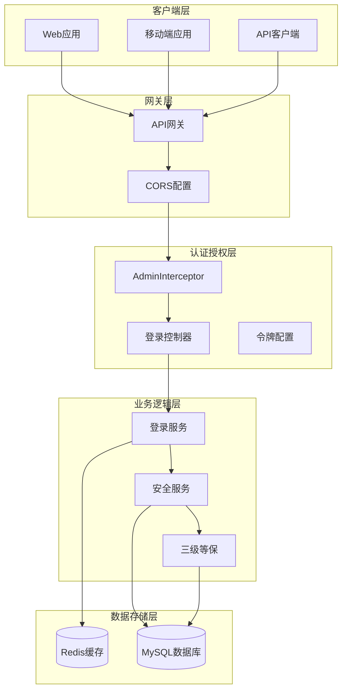

**图表来源**
- [AdminInterceptor.java](file://smart-admin-api-java17-springboot3/sa-admin/src/main/java/net/lab1024/sa/admin/interceptor/AdminInterceptor.java#L37-L141)
- [LoginController.java](file://smart-admin-api-java17-springboot3/sa-admin/src/main/java/net/lab1024/sa/admin/module/system/login/controller/LoginController.java#L32-L90)

## 核心组件分析

### Sa-Token配置体系

系统通过YAML配置文件和动态配置服务实现灵活的令牌管理：

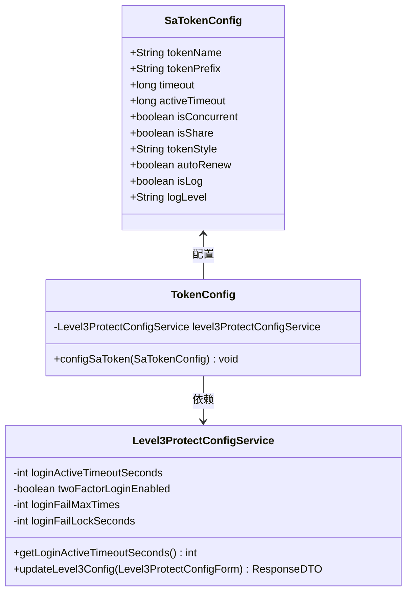

**图表来源**
- [TokenConfig.java](file://smart-admin-api-java17-springboot3/sa-base/src/main/java/net/lab1024/sa/base/config/TokenConfig.java#L19-L33)
- [Level3ProtectConfigService.java](file://smart-admin-api-java17-springboot3/sa-base/src/main/java/net/lab1024/sa/base/module/support/securityprotect/service/Level3ProtectConfigService.java#L26-L189)

### 登录服务架构

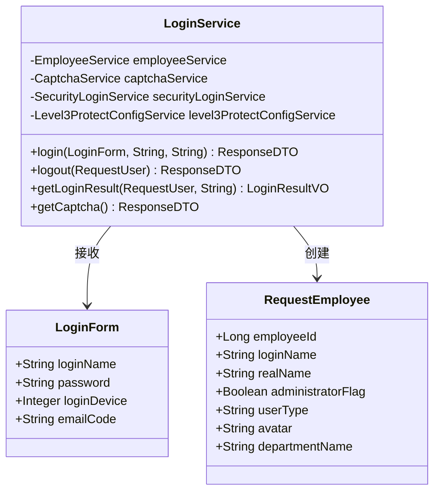

**图表来源**
- [LoginService.java](file://smart-admin-api-java17-springboot3/sa-admin/src/main/java/net/lab1024/sa/admin/module/system/login/service/LoginService.java#L68-L200)
- [LoginForm.java](file://smart-admin-api-java17-springboot3/sa-admin/src/main/java/net/lab1024/sa/admin/module/system/login/domain/LoginForm.java#L21-L40)

**章节来源**
- [LoginService.java](file://smart-admin-api-java17-springboot3/sa-admin/src/main/java/net/lab1024/sa/admin/module/system/login/service/LoginService.java#L1-L200)
- [TokenConfig.java](file://smart-admin-api-java17-springboot3/sa-base/src/main/java/net/lab1024/sa/base/config/TokenConfig.java#L1-L34)

## 认证流程详解

### 完整登录流程

系统实现了标准的OAuth2认证流程，结合三级等保要求的安全策略：

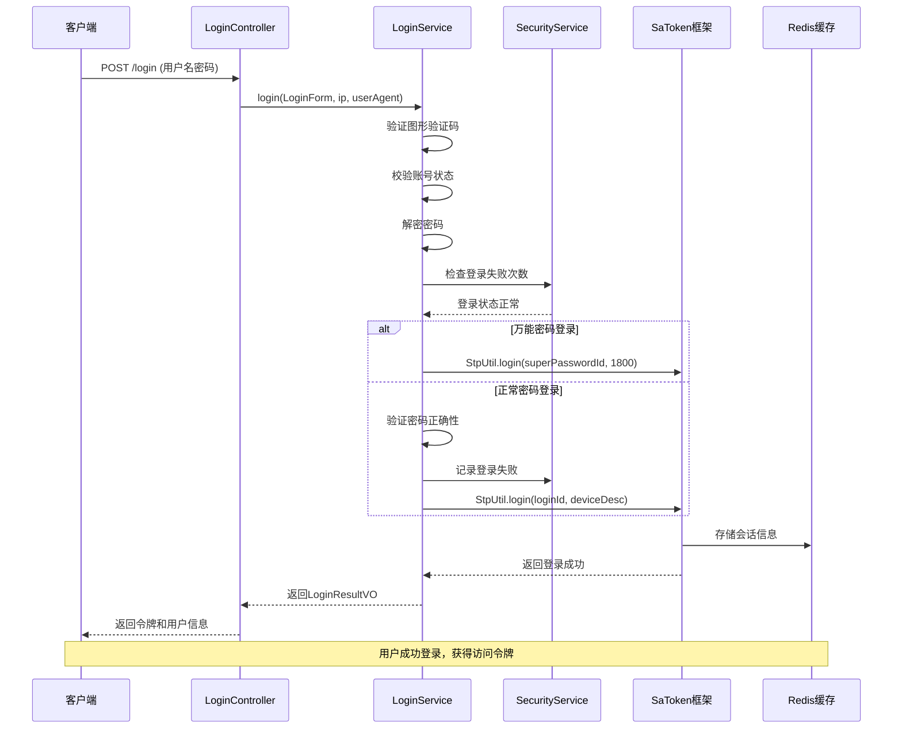

**图表来源**
- [LoginController.java](file://smart-admin-api-java17-springboot3/sa-admin/src/main/java/net/lab1024/sa/admin/module/system/login/controller/LoginController.java#L42-L49)
- [LoginService.java](file://smart-admin-api-java17-springboot3/sa-admin/src/main/java/net/lab1024/sa/admin/module/system/login/service/LoginService.java#L128-L200)

### 令牌生成与验证机制

系统支持多种令牌风格和自动续签机制：

| 配置项 | 默认值 | 说明 |
|--------|--------|------|
| token-name | Authorization | 令牌名称，同时也是Cookie名称 |
| token-prefix | Bearer | 令牌前缀 |
| timeout | 2592000秒 | 令牌有效期（30天） |
| active-timeout | -1 | 最低活跃频率（-1表示不限制） |
| is-concurrent | false | 是否允许多地同时登录 |
| is-share | false | 是否共用一个令牌 |
| token-style | simple-uuid | 令牌风格 |
| auto-renew | true | 是否自动续签 |

**章节来源**
- [sa-base.yaml](file://smart-admin-api-java17-springboot3/sa-base/src/main/resources/dev/sa-base.yaml#L150-L175)
- [LoginService.java](file://smart-admin-api-java17-springboot3/sa-admin/src/main/java/net/lab1024/sa/admin/module/system/login/service/LoginService.java#L172-L200)

## NoNeedLogin注解机制

### 注解设计原理

NoNeedLogin注解提供了灵活的免认证访问控制机制：

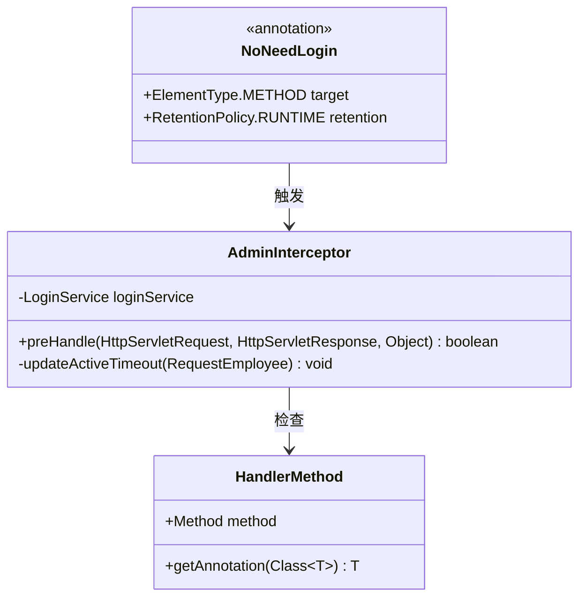

**图表来源**
- [NoNeedLogin.java](file://smart-admin-api-java17-springboot3/sa-base/src/main/java/net/lab1024/sa/base/common/annoation/NoNeedLogin.java#L17-L20)
- [AdminInterceptor.java](file://smart-admin-api-java17-springboot3/sa-admin/src/main/java/net/lab1024/sa/admin/interceptor/AdminInterceptor.java#L67-L72)

### 使用场景与实现

NoNeedLogin注解主要用于以下场景：
1. **公开接口**：无需认证即可访问的API
2. **登录接口**：登录过程中的认证接口
3. **验证码接口**：获取图形验证码的接口
4. **邮件验证**：邮箱登录验证码发送接口

实现逻辑在拦截器中体现：

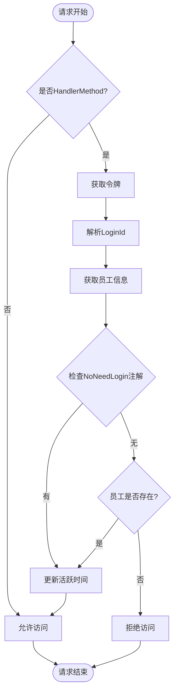

**图表来源**
- [AdminInterceptor.java](file://smart-admin-api-java17/springboot3/sa-admin/src/main/java/net/lab1024/sa/admin/interceptor/AdminInterceptor.java#L58-L82)

**章节来源**
- [NoNeedLogin.java](file://smart-admin-api-java17-springboot3/sa-base/src/main/java/net/lab1024/sa/base/common/annoation/NoNeedLogin.java#L1-L21)
- [AdminInterceptor.java](file://smart-admin-api-java17-springboot3/sa-admin/src/main/java/net/lab1024/sa/admin/interceptor/AdminInterceptor.java#L67-L72)

## TokenConfig动态配置

### 动态配置机制

Level3ProtectConfigService通过三级等保配置动态调整Sa-Token的令牌超时时间：

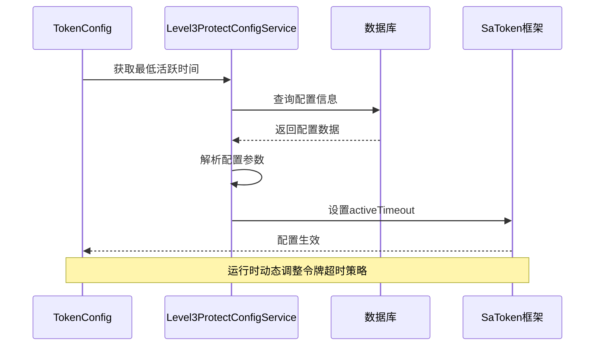

**图表来源**
- [TokenConfig.java](file://smart-admin-api-java17-springboot3/sa-base/src/main/java/net/lab1024/sa/base/config/TokenConfig.java#L26-L30)
- [Level3ProtectConfigService.java](file://smart-admin-api-java17-springboot3/sa-base/src/main/java/net/lab1024/sa/base/module/support/securityprotect/service/Level3ProtectConfigService.java#L170-L175)

### 配置参数说明

| 参数名称 | 类型 | 默认值 | 说明 |
|----------|------|--------|------|
| loginActiveTimeoutSeconds | int | -1 | 最低活跃时间（秒），-1表示不限制 |
| loginFailMaxTimes | int | -1 | 连续登录失败次数限制 |
| loginFailLockSeconds | int | 1800 | 登录失败锁定时间（秒） |
| twoFactorLoginEnabled | boolean | false | 是否启用双因子认证 |

**章节来源**
- [TokenConfig.java](file://smart-admin-api-java17-springboot3/sa-base/src/main/java/net/lab1024/sa/base/config/TokenConfig.java#L1-L34)
- [Level3ProtectConfigService.java](file://smart-admin-api-java17-springboot3/sa-base/src/main/java/net/lab1024/sa/base/module/support/securityprotect/service/Level3ProtectConfigService.java#L112-L116)

## 会话管理与安全策略

### 多设备登录支持

系统支持多种登录模式，满足不同场景需求：

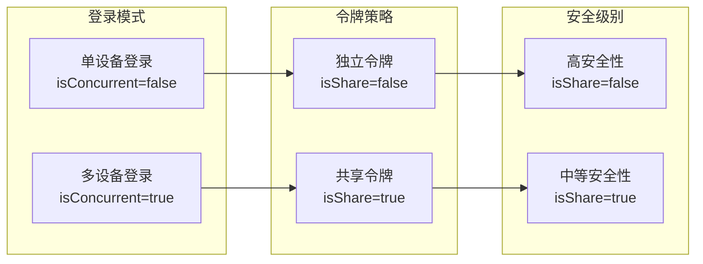

### 会话固定攻击防护

系统通过以下机制防范会话固定攻击：

1. **令牌随机性**：使用UUID生成唯一令牌
2. **设备绑定**：将令牌与登录设备绑定
3. **自动续签**：定期更新令牌有效期
4. **并发控制**：限制同一账号的并发登录

### 令牌泄露应对措施

当检测到令牌异常时，系统提供多重保护：

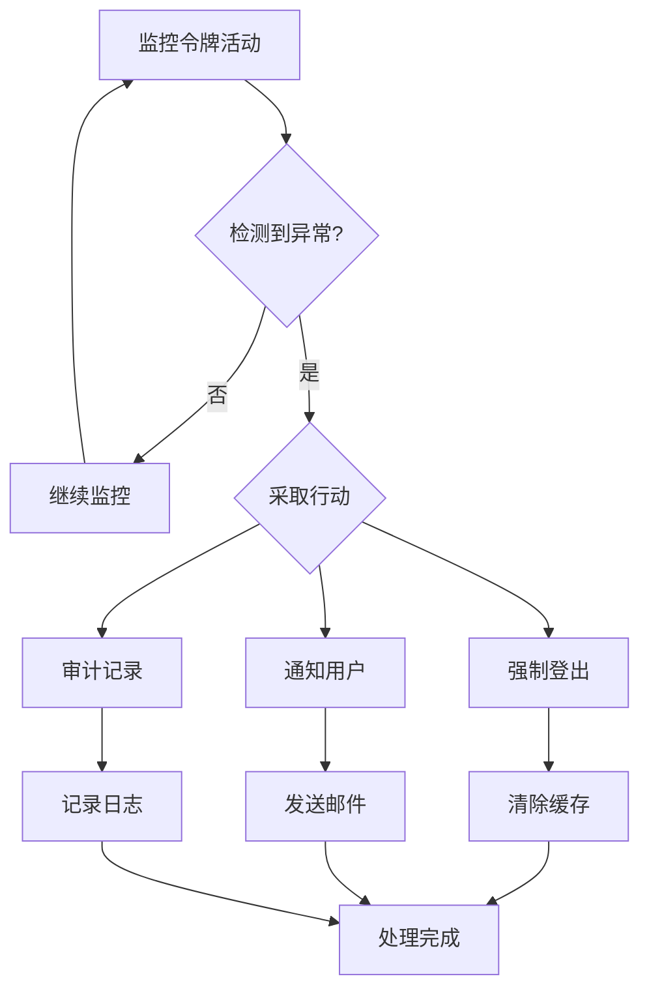

**章节来源**
- [sa-base.yaml](file://smart-admin-api-java17-springboot3/sa-base/src/main/resources/dev/sa-base.yaml#L159-L162)
- [LoginService.java](file://smart-admin-api-java17-springboot3/sa-admin/src/main/java/net/lab1024/sa/admin/module/system/login/service/LoginService.java#L172-L200)

## 权限控制实现

### 基于角色的权限控制

系统采用RBAC模型实现细粒度权限控制：

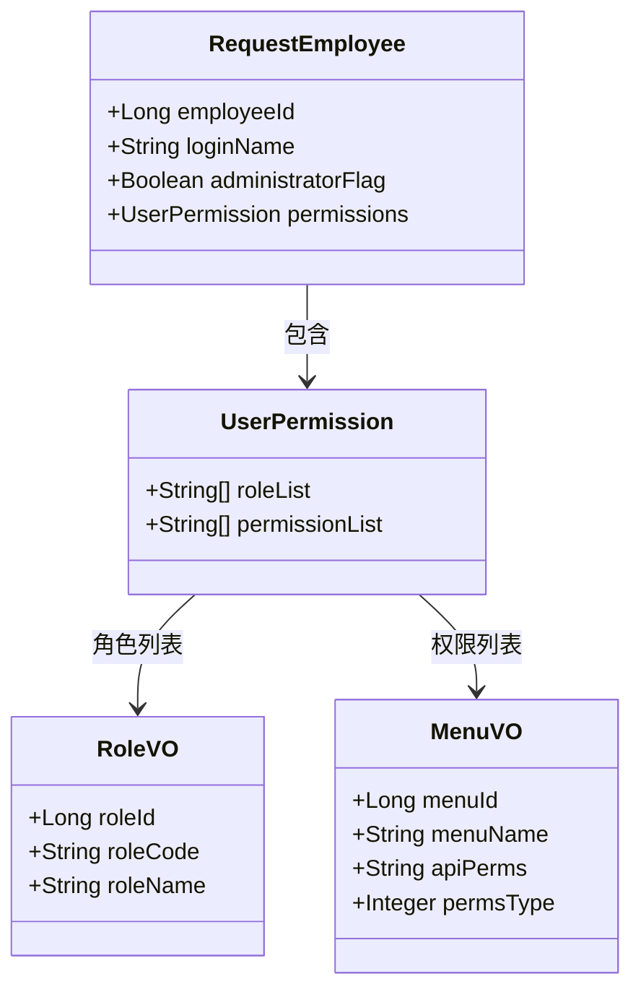

**图表来源**
- [LoginManager.java](file://smart-admin-api-java17-springboot3/sa-admin/src/main/java/net/lab1024/sa/admin/module/system/login/manager/LoginManager.java#L108-L153)

### 权限验证流程

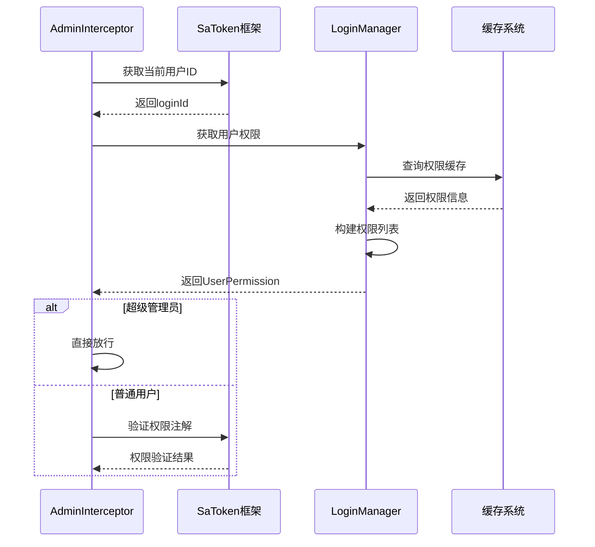

**图表来源**
- [AdminInterceptor.java](file://smart-admin-api-java17-springboot3/sa-admin/src/main/java/net/lab1024/sa/admin/interceptor/AdminInterceptor.java#L83-L97)
- [LoginManager.java](file://smart-admin-api-java17-springboot3/sa-admin/src/main/java/net/lab1024/sa/admin/module/system/login/manager/LoginManager.java#L108-L153)

**章节来源**
- [LoginManager.java](file://smart-admin-api-java17-springboot3/sa-admin/src/main/java/net/lab1024/sa/admin/module/system/login/manager/LoginManager.java#L108-L153)
- [AdminInterceptor.java](file://smart-admin-api-java17-springboot3/sa-admin/src/main/java/net/lab1024/sa/admin/interceptor/AdminInterceptor.java#L83-L97)

## 安全最佳实践

### 令牌刷新策略

系统实现了智能的令牌刷新机制：

1. **自动续签**：每次访问自动延长令牌有效期
2. **活跃时间检查**：定期检查用户活跃状态
3. **超时处理**：超出活跃时间自动失效
4. **手动刷新**：提供专门的刷新接口

### 三级等保合规

系统严格遵循三级等保要求：

| 安全要求 | 实现方式 | 配置参数 |
|----------|----------|----------|
| 登录失败限制 | 连续失败次数控制 | loginFailMaxTimes |
| 登录锁定 | 自动锁定机制 | loginFailLockSeconds |
| 活跃时间限制 | 会话超时控制 | activeTimeout |
| 双因子认证 | 邮箱验证码 | twoFactorLoginEnabled |
| 密码复杂度 | 密码强度检查 | passwordComplexityEnabled |

### 单点登录(SSO)配置

系统支持单点登录的实现方案：

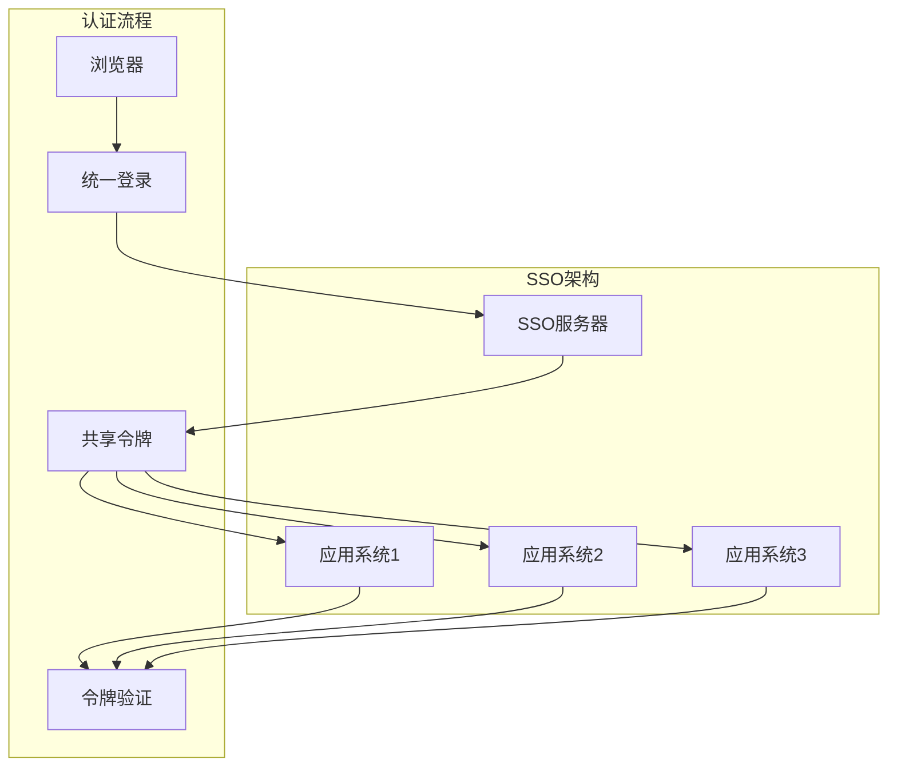

### 安全监控与审计

系统提供完整的安全监控体系：

1. **登录日志**：记录所有登录行为
2. **权限审计**：跟踪权限变更
3. **异常监控**：实时检测安全威胁
4. **报表分析**：生成安全报告

**章节来源**
- [Level3ProtectConfigService.java](file://smart-admin-api-java17-springboot3/sa-base/src/main/java/net/lab1024/sa/base/module/support/securityprotect/service/Level3ProtectConfigService.java#L170-L175)
- [sa-base.yaml](file://smart-admin-api-java17-springboot3/sa-base/src/main/resources/dev/sa-base.yaml#L165-L166)

## 故障排除指南

### 常见问题诊断

| 问题类型 | 症状 | 解决方案 |
|----------|------|----------|
| 令牌过期 | 401未授权错误 | 检查timeout配置，启用auto-renew |
| 并发登录问题 | 被挤掉下线 | 调整is-concurrent配置 |
| 权限验证失败 | 403禁止访问 | 检查角色权限配置 |
| 登录失败锁定 | 无法登录 | 检查loginFailMaxTimes配置 |

### 性能优化建议

1. **缓存策略**：合理配置Redis缓存
2. **连接池**：优化数据库连接池设置
3. **监控指标**：关注令牌生成和验证性能
4. **负载均衡**：配置适当的负载均衡策略

### 日志分析

系统提供详细的日志记录，便于问题排查：

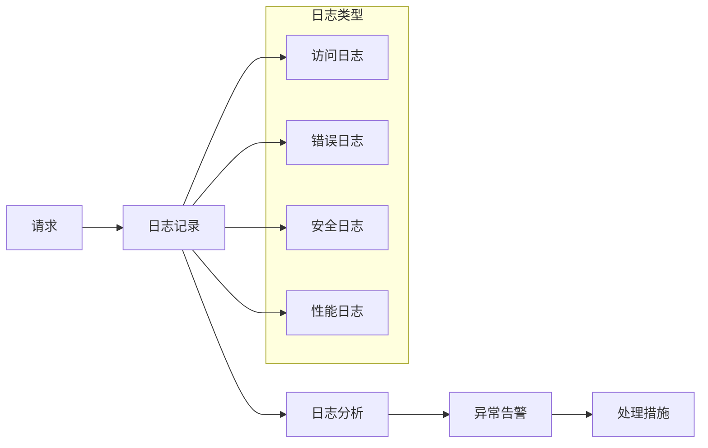

## 总结

本文档全面介绍了基于Sa-Token的认证授权机制，涵盖了从基础配置到高级安全特性的各个方面。系统通过以下核心特性确保了安全性和可用性：

1. **灵活的配置体系**：支持动态配置和运行时调整
2. **完善的认证流程**：包含多种登录方式和安全验证
3. **细粒度权限控制**：基于角色的权限管理系统
4. **强大的安全防护**：多层次的安全保护机制
5. **优秀的性能表现**：高效的缓存和并发处理

通过遵循本文档的最佳实践和安全指导，开发者可以构建安全可靠的认证授权系统，满足企业级应用的需求。