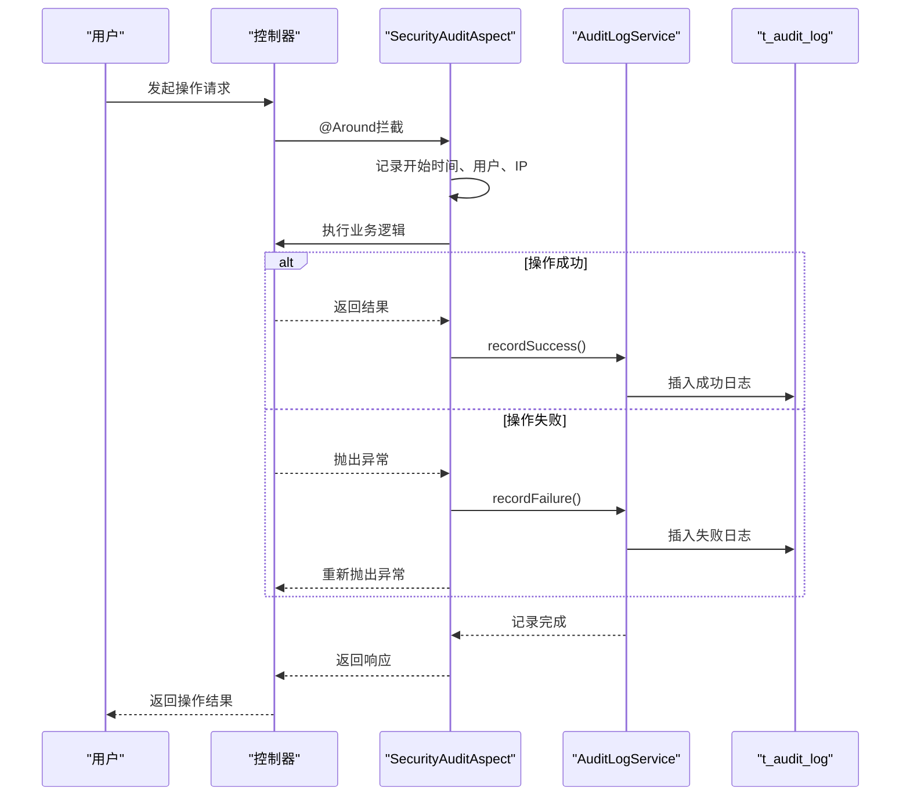
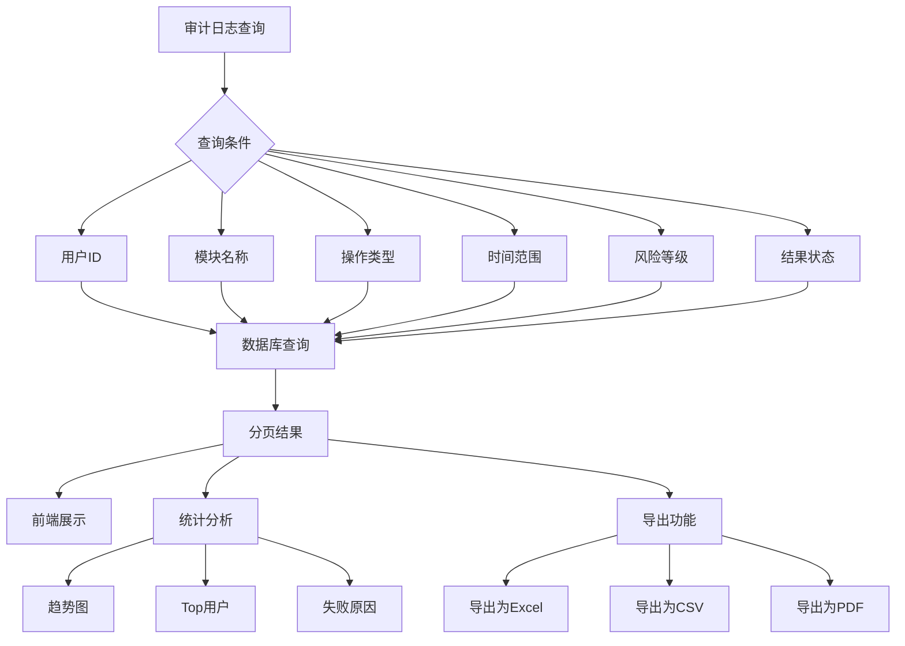
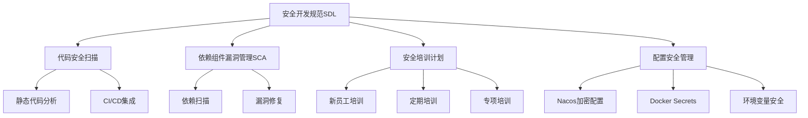

# 合规与审计

<cite>
**本文档引用文件**   
- [10-t_audit_log.sql](file://database-scripts/common-service/10-t_audit_log.sql)
- [11-t_common_audit_archive.sql](file://database-scripts/common-service/11-t_common_audit_archive.sql)
- [security_hardening_guide.md](file://security/security_hardening_guide.md)
- [README.md](file://scripts/compliance-scan/README.md)
- [scan-passwords-simple.ps1](file://scripts/p0-security/scan-passwords-simple.ps1)
- [DEV_STANDARDS.md](file://docs/DEV_STANDARDS.md)
- [AuditController.java](file://restful_refactor_backup_20251202_014224/microservices_ioedream-audit-service_src_main_java_net_lab1024_sa_audit_controller_AuditController.java)
- [AuditManager.java](file://microservices/microservices-common/src/main/java/net/lab1024/sa/common/audit/manager/AuditManager.java)
- [AUDIT_MODULE_COMPLETION_SUMMARY.md](file://documentation/archive/reports-2025-12-04/AUDIT_MODULE_COMPLETION_SUMMARY.md)
- [FINAL_SESSION_REPORT_2025_12_02.md](file://documentation/archive/reports-2025-12-04/FINAL_SESSION_REPORT_2025_12_02.md)
</cite>

## 目录
1. [引言](#引言)
2. [身份鉴别与访问控制](#身份鉴别与访问控制)
3. [安全审计机制](#安全审计机制)
4. [操作日志记录规范](#操作日志记录规范)
5. [审计日志查询与分析](#审计日志查询与分析)
6. [日志存储与归档策略](#日志存储与归档策略)
7. [定期安全评估与渗透测试](#定期安全评估与渗透测试)
8. [安全开发规范（SDL）实践](#安全开发规范（sdl）实践)
9. [结论](#结论)

## 引言

本文档详细阐述了IOE-DREAM系统在安全合规与审计方面的技术实现和管理实践。系统严格遵循网络安全等级保护（等保2.0）的技术要求，构建了全面的安全防护体系。文档重点介绍了身份鉴别、安全审计、入侵防范等核心安全能力，详细说明了操作日志、登录日志和数据变更日志的记录与存储规范。同时，文档还涵盖了审计日志的查询分析功能、定期安全评估流程以及安全开发规范（SDL）的落地实践，旨在为系统的安全合规性提供全面的技术支持和管理保障。

## 身份鉴别与访问控制

系统实现了多层次的身份鉴别与访问控制机制，确保只有授权用户才能访问系统资源。

### 身份认证
系统采用JWT（JSON Web Token）进行身份认证，所有API接口均需通过身份认证。JWT密钥长度至少为32位，确保了令牌的安全性。会话安全配置包括30分钟的超时时间，Cookie设置为HttpOnly和Secure，有效防止XSS攻击和中间人攻击。

### 权限控制
系统基于角色的访问控制（RBAC）模型，通过`@PreAuthorize`注解实现细粒度的权限校验。关键接口均需权限校验，确保用户只能执行其权限范围内的操作。例如，门禁设备控制接口`AccessDeviceController`要求用户具有`DEVICE_ADMIN`角色。

### 接口安全
所有API接口均需身份认证和权限校验，敏感数据传输采用加密处理。系统实现了接口防刷和限流机制，使用Resilience4j库配置限流规则，防止恶意请求。例如，设备控制接口每秒窗口期内最多允许100次请求。

**Section sources**
- [security_hardening_guide.md](file://security/security_hardening_guide.md#L369-L403)
- [DEV_STANDARDS.md](file://docs/DEV_STANDARDS.md#L370-L428)

## 安全审计机制

系统建立了完善的安全审计机制，满足等保2.0对安全审计的技术要求。

### 审计日志设计
系统通过`SecurityAuditAspect`切面实现操作审计，利用AOP（面向切面编程）技术自动记录关键操作。审计日志记录了操作的详细信息，包括用户、IP地址、操作类型、结果状态和执行时间。



**Diagram sources**
- [security_hardening_guide.md](file://security/security_hardening_guide.md#L208-L255)
- [10-t_audit_log.sql](file://database-scripts/common-service/10-t_audit_log.sql)

### 审计注解使用
通过`@SecurityAudit`注解标记需要审计的方法，实现声明式审计。例如：
```java
@SecurityAudit("设备控制")
public ResponseDTO<String> controlDevice(DeviceControlRequest request) {
    // 业务逻辑
}

@SecurityAudit("远程开门")
public ResponseDTO<String> remoteOpenDoor(Long deviceId, String reason) {
    // 业务逻辑
}
```

**Section sources**
- [security_hardening_guide.md](file://security/security_hardening_guide.md#L257-L268)

## 操作日志记录规范

系统对所有关键操作进行详细记录，确保操作的可追溯性。

### 日志内容
审计日志表`t_audit_log`记录了全面的操作信息，主要字段包括：

| 字段名 | 类型 | 说明 |
| :--- | :--- | :--- |
| `log_id` | BIGINT | 日志ID，主键 |
| `user_id` | BIGINT | 操作用户ID |
| `user_name` | VARCHAR(100) | 操作用户名 |
| `module_name` | VARCHAR(100) | 操作模块名称 |
| `operation_type` | TINYINT | 操作类型：1-查询 2-新增 3-修改 4-删除 5-导出 6-导入 7-登录 8-登出 |
| `operation_desc` | VARCHAR(500) | 操作描述 |
| `result_status` | TINYINT | 结果状态：1-成功 2-失败 3-异常 |
| `risk_level` | TINYINT | 风险等级：1-低 2-中 3-高 |
| `client_ip` | VARCHAR(50) | 客户端IP地址 |
| `user_agent` | VARCHAR(500) | 用户代理信息 |
| `trace_id` | VARCHAR(100) | 分布式追踪ID |
| `execution_time` | BIGINT | 执行时间（毫秒） |
| `create_time` | DATETIME | 日志创建时间 |

### 日志分类
系统记录了三类核心日志：
- **操作日志**：记录用户对系统功能的操作，如增删改查。
- **登录日志**：记录用户的登录和登出行为，操作类型为7和8。
- **数据变更日志**：记录数据的新增、修改和删除，操作类型为2、3和4。

**Section sources**
- [10-t_audit_log.sql](file://database-scripts/common-service/10-t_audit_log.sql)

## 审计日志查询与分析

系统提供了强大的审计日志查询、分析和导出功能。

### 查询接口
审计服务提供了分页查询接口，支持多条件组合查询：
- 按用户ID、用户名查询
- 按模块名称查询
- 按操作类型查询
- 按结果状态查询
- 按风险等级查询
- 按时间范围查询

### 统计分析
系统支持多维度的审计统计分析，包括：
- 操作总数统计
- 成功率分析
- 按天、按小时的趋势分析
- 按用户、按模块的活跃度分析
- 失败原因分析

### 日志导出
系统支持将审计日志导出为多种格式，包括Excel、CSV和PDF，便于离线分析和存档。



**Diagram sources**
- [AuditController.java](file://restful_refactor_backup_20251202_014224/microservices_ioedream-audit-service_src_main_java_net_lab1024_sa_audit_controller_AuditController.java#L74-L109)
- [AUDIT_MODULE_COMPLETION_SUMMARY.md](file://documentation/archive/reports-2025-12-04/AUDIT_MODULE_COMPLETION_SUMMARY.md)

## 日志存储与归档策略

系统制定了科学的日志存储与归档策略，确保日志数据的安全性和可管理性。

### 存储策略
审计日志存储在MySQL数据库的`t_audit_log`表中，该表设计了合理的索引，确保查询性能：
- `idx_user_id`：按用户ID查询
- `idx_module_name`：按模块名称查询
- `idx_operation_type`：按操作类型查询
- `idx_result_status`：按结果状态查询
- `idx_risk_level`：按风险等级查询
- `idx_trace_id`：按追踪ID查询
- `idx_create_time`：按创建时间查询

### 归档策略
系统通过`AuditManager`组件管理审计日志的归档。归档记录存储在`t_common_audit_archive`表中，包含归档编号、归档时间点、归档数量、归档文件路径等信息。归档策略包括：
- 定期归档：将指定时间点之前的日志归档到文件系统
- 文件压缩：归档文件采用ZIP格式压缩存储
- 状态管理：记录归档任务的执行状态（进行中、成功、失败）
- 保留查询：归档后仍可通过系统查询历史日志

**Section sources**
- [10-t_audit_log.sql](file://database-scripts/common-service/10-t_audit_log.sql#L29-L37)
- [11-t_common_audit_archive.sql](file://database-scripts/common-service/11-t_common_audit_archive.sql)
- [AuditManager.java](file://microservices/microservices-common/src/main/java/net/lab1024/sa/common/audit/manager/AuditManager.java)

## 定期安全评估与渗透测试

系统建立了定期的安全评估和渗透测试流程，确保安全防护的持续有效性。

### 安全扫描
系统提供了合规性扫描工具，用于检测代码是否符合架构规范。扫描内容包括：
- `@Repository`注解使用违规
- `@Autowired`注解使用违规
- Controller层架构边界违规

扫描工具支持单个扫描和综合扫描，生成详细的扫描报告，帮助开发人员及时发现和修复安全问题。

### 渗透测试
系统定期进行渗透测试，模拟攻击者的行为，发现潜在的安全漏洞。渗透测试流程包括：
1. **计划与准备**：确定测试范围和目标
2. **信息收集**：收集系统相关信息
3. **漏洞扫描**：使用自动化工具扫描常见漏洞
4. **手动测试**：进行深入的手动安全测试
5. **报告生成**：生成详细的渗透测试报告
6. **整改闭环**：根据报告进行漏洞修复和验证

### 整改闭环机制
系统建立了安全问题整改闭环机制：
1. **问题发现**：通过扫描、测试或监控发现安全问题
2. **问题记录**：在问题跟踪系统中记录问题
3. **问题分配**：将问题分配给相关责任人
4. **问题修复**：责任人进行问题修复
5. **修复验证**：安全团队验证修复效果
6. **问题关闭**：确认问题已解决，关闭问题记录

**Section sources**
- [README.md](file://scripts/compliance-scan/README.md)
- [FINAL_SESSION_REPORT_2025_12_02.md](file://documentation/archive/reports-2025-12-04/FINAL_SESSION_REPORT_2025_12_02.md)

## 安全开发规范（SDL）实践

系统将安全开发规范（SDL）融入开发流程，从源头保障代码安全。

### 代码安全扫描
在开发过程中，使用静态代码分析工具进行安全扫描，检测潜在的安全漏洞，如SQL注入、XSS攻击等。CI/CD流程中集成了安全扫描，每次代码提交都必须通过安全检查。

### 依赖组件漏洞管理（SCA）
系统使用Maven管理依赖，定期进行依赖组件漏洞扫描。通过`pom.xml`文件管理所有依赖，确保使用安全的版本。对于发现的漏洞，及时升级依赖版本或应用安全补丁。

### 安全培训计划
系统实施了全面的安全培训计划，包括：
- **新员工安全培训**：介绍系统安全规范和最佳实践
- **定期安全培训**：更新安全知识，分享最新安全威胁
- **专项安全培训**：针对特定安全主题进行深入培训
- **安全意识宣传**：通过邮件、公告等方式提高全员安全意识

### 配置安全
系统严格管理配置文件中的敏感信息，禁止使用明文密码。所有敏感配置均通过Nacos配置中心进行加密管理，使用AES256算法加密。环境变量使用Docker Secrets或密钥管理服务进行保护。



**Diagram sources**
- [security_hardening_guide.md](file://security/security_hardening_guide.md)
- [DEV_STANDARDS.md](file://docs/DEV_STANDARDS.md)

## 结论

IOE-DREAM系统通过构建全面的安全合规与审计体系，有效满足了网络安全等级保护（等保2.0）的技术要求。系统在身份鉴别、安全审计、入侵防范等方面实现了高标准的安全防护。通过详细的日志记录规范和科学的存储归档策略，确保了操作的可追溯性和数据的完整性。定期的安全评估和渗透测试流程，以及严格的安全开发规范（SDL）实践，形成了持续改进的安全闭环。这些措施共同保障了系统的安全稳定运行，为企业级应用提供了坚实的安全基础。