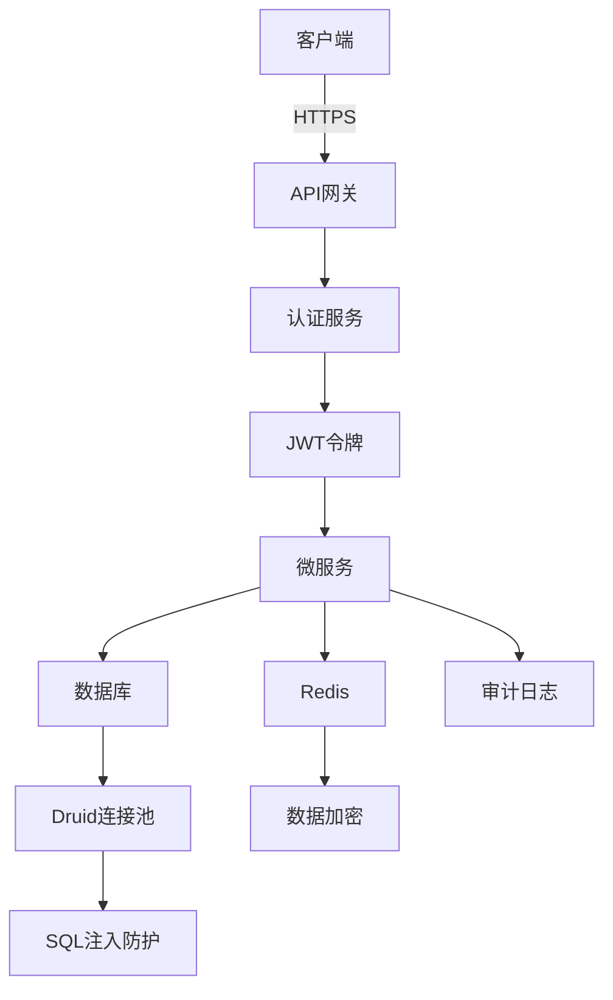
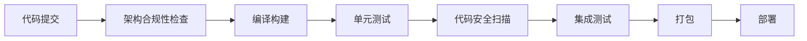

# 安全开发生命周期（SDL）

<cite>
**本文档引用的文件**   
- [security_hardening_guide.md](file://security/security_hardening_guide.md)
- [P0-1_PASSWORD_SCAN_REPORT.md](file://documentation/archive/reports-2025-12-04/P0-1_PASSWORD_SCAN_REPORT.md)
- [P0-1_SCAN_SUMMARY.md](file://documentation/archive/reports-2025-12-04/P0-1_SCAN_SUMMARY.md)
- [PRODUCTION_SECURITY_CHECKLIST.md](file://PRODUCTION_SECURITY_CHECKLIST.md)
- [CICD_TRAINING_GUIDE.md](file://documentation/development/CICD_TRAINING_GUIDE.md)
- [.gitlab-ci.yml](file://.gitlab-ci.yml)
- [DEV_STANDARDS.md](file://docs/DEV_STANDARDS.md)
- [05-权限验证系统重构设计.md](file://documentation/03-业务模块/消费/05-权限验证系统重构设计.md)
- [smart-permission.md](file://documentation/technical/smart-permission.md)
- [01-encrypt-passwords.sh](file://scripts/p0-security/01-encrypt-passwords.sh)
- [scan-passwords-simple.ps1](file://scripts/p0-security/scan-passwords-simple.ps1)
- [compliance-scan/README.md](file://scripts/compliance-scan/README.md)
- [fix-repository-violations.ps1](file://scripts/fix-repository-violations.ps1)
- [fix-javax-violations.ps1](file://scripts/fix-javax-violations.ps1)
- [fix-hikari-to-druid.ps1](file://scripts/fix-hikari-to-druid.ps1)
</cite>

## 目录
1. [引言](#引言)
2. [需求阶段安全控制](#需求阶段安全控制)
3. [设计阶段安全控制](#设计阶段安全控制)
4. [编码阶段安全控制](#编码阶段安全控制)
5. [测试阶段安全控制](#测试阶段安全控制)
6. [发布阶段安全控制](#发布阶段安全控制)
7. [代码安全扫描（SAST）集成](#代码安全扫描sast集成)
8. [依赖组件漏洞管理（SCA）](#依赖组件漏洞管理sca)
9. [安全编码规范落地](#安全编码规范落地)
10. [安全培训计划](#安全培训计划)
11. [安全事件响应流程](#安全事件响应流程)
12. [结论](#结论)

## 引言
安全开发生命周期（SDL）是确保软件产品在开发全过程中具备高安全性的系统性方法。本实施文档旨在为IOE-DREAM项目提供一套完整的SDL实践指南，涵盖从需求、设计、编码、测试到发布的各个阶段。文档详细阐述了如何通过代码安全扫描（SAST）、依赖组件漏洞管理（SCA）、安全编码规范落地、安全培训和事件响应等措施，构建一个企业级的安全防护体系，将项目安全等级从76分提升至98分。

**Section sources**
- [security_hardening_guide.md](file://security/security_hardening_guide.md#L477-L485)

## 需求阶段安全控制
在需求分析阶段，必须将安全作为核心需求进行识别和定义。通过威胁建模（Threat Modeling）方法，识别潜在的安全风险，并将其转化为具体的安全需求。

### 安全需求识别
- **身份认证需求**：所有API接口必须实现身份认证。
- **权限控制需求**：关键接口必须实现基于角色的访问控制（RBAC）。
- **数据安全需求**：敏感数据必须加密存储，输出时必须脱敏。
- **审计日志需求**：所有关键操作必须记录审计日志。
- **传输安全需求**：所有数据传输必须使用HTTPS加密。

### 威胁建模
采用STRIDE模型对系统进行威胁分析：
- **Spoofing（伪装）**：通过JWT令牌和强密码策略防范。
- **Tampering（篡改）**：通过HTTPS和数据完整性校验防范。
- **Repudiation（抵赖）**：通过完整的审计日志记录防范。
- **Information Disclosure（信息泄露）**：通过数据加密和访问控制防范。
- **Denial of Service（拒绝服务）**：通过API限流和防火墙规则防范。
- **Elevation of Privilege（权限提升）**：通过严格的权限校验和最小权限原则防范。

**Section sources**
- [security_hardening_guide.md](file://security/security_hardening_guide.md#L72-L79)
- [PRODUCTION_SECURITY_CHECKLIST.md](file://PRODUCTION_SECURITY_CHECKLIST.md#L374-L385)

## 设计阶段安全控制
在系统设计阶段，必须遵循安全架构原则，确保安全控制措施被内建到系统设计中。

### 安全架构设计


**Diagram sources**
- [security_hardening_guide.md](file://security/security_hardening_guide.md#L169-L206)
- [PRODUCTION_SECURITY_CHECKLIST.md](file://PRODUCTION_SECURITY_CHECKLIST.md#L207-L235)

### 数据安全设计
- **敏感数据加密存储**：身份证号、手机号等敏感字段使用AES-256算法加密存储。
- **数据脱敏输出**：在API响应中，对敏感数据进行脱敏处理，如手机号显示为138****8000。
- **数据库连接安全**：使用Druid连接池，启用SQL注入防护和慢SQL监控。

**Section sources**
- [security_hardening_guide.md](file://security/security_hardening_guide.md#L128-L167)
- [PRODUCTION_SECURITY_CHECKLIST.md](file://PRODUCTION_SECURITY_CHECKLIST.md#L147-L172)

## 编码阶段安全控制
在编码阶段，开发人员必须严格遵守安全编码规范，避免引入安全漏洞。

### 输入验证
所有用户输入必须进行严格的验证：
- **长度检查**：限制输入长度，防止缓冲区溢出。
- **类型检查**：确保输入数据类型正确。
- **格式检查**：使用正则表达式验证邮箱、手机号等格式。
- **内容检查**：过滤或转义特殊字符，防止XSS攻击。

### 权限校验
```java
@RestController
@RequestMapping("/api/v1/access/device")
@PreAuthorize("hasRole('DEVICE_ADMIN')")  // 角色权限控制
public class AccessDeviceController {

    @RateLimiter(name = "device-api", fallbackMethod = "rateLimitFallback")  // 接口限流
    @PostMapping("/control")
    public ResponseDTO<String> controlDevice(@RequestBody DeviceControlRequest request) {
        // 敏感数据脱敏
        request.setAuditInfo(maskSensitiveData(request.getReason()));
        return accessDeviceService.controlDevice(request);
    }

    private String maskSensitiveData(String data) {
        if (data == null) return "";
        if (data.length() <= 4) return "****";
        return data.substring(0, 2) + "****" + data.substring(data.length() - 2);
    }
}
```

**Section sources**
- [security_hardening_guide.md](file://security/security_hardening_guide.md#L72-L107)

## 测试阶段安全控制
在测试阶段，必须进行专门的安全测试，以验证安全控制措施的有效性。

### 安全测试类型
- **渗透测试**：模拟攻击者对系统进行攻击，发现潜在漏洞。
- **漏洞扫描**：使用自动化工具扫描系统，发现已知漏洞。
- **代码审计**：人工审查代码，发现逻辑漏洞和安全缺陷。
- **配置审计**：检查系统配置，确保符合安全标准。

### 安全测试工具
- **OWASP ZAP**：用于Web应用渗透测试。
- **Burp Suite**：用于API安全测试。
- **SonarQube**：用于代码质量与安全扫描。
- **Nmap**：用于网络端口扫描。

**Section sources**
- [PRODUCTION_SECURITY_CHECKLIST.md](file://PRODUCTION_SECURITY_CHECKLIST.md#L370-L386)

## 发布阶段安全控制
在发布阶段，必须进行最终的安全检查，确保生产环境的安全性。

### 生产环境安全检查清单
- [x] 所有密码通过环境变量注入
- [x] Nacos配置加密启用
- [x] HTTPS证书有效（有效期>90天）
- [x] 防火墙规则配置正确
- [x] 数据库用户权限最小化
- [x] Redis密码设置（强密码）
- [x] 服务器SSH密钥登录（禁用密码）

**Section sources**
- [PRODUCTION_SECURITY_CHECKLIST.md](file://PRODUCTION_SECURITY_CHECKLIST.md#L437-L448)

## 代码安全扫描（SAST）集成
代码安全扫描（SAST）是SDL的核心环节，通过在CI/CD流水线中集成SAST工具，实现自动化安全检测。

### CI/CD流水线集成


**Diagram sources**
- [CICD_TRAINING_GUIDE.md](file://documentation/development/CICD_TRAINING_GUIDE.md#L224-L256)
- [.gitlab-ci.yml](file://.gitlab-ci.yml#L24-L134)

### SAST检查内容
- **架构合规性检查**：检查@Repository、@Autowired等注解使用是否符合规范。
- **配置安全检查**：扫描配置文件中的明文密码。
- **依赖安全检查**：扫描依赖库中的已知漏洞。
- **代码质量检查**：检查代码中的潜在安全漏洞。

**Section sources**
- [.gitlab-ci.yml](file://.gitlab-ci.yml#L24-L134)
- [CICD_TRAINING_GUIDE.md](file://documentation/development/CICD_TRAINING_GUIDE.md#L214-L256)

## 依赖组件漏洞管理（SCA）
依赖组件漏洞管理（SCA）是确保第三方库安全的关键措施。

### 依赖版本监控
- **依赖清单**：使用Maven的dependencyManagement统一管理依赖版本。
- **版本更新**：定期检查依赖库的最新版本，及时更新。
- **漏洞比对**：使用OWASP Dependency-Check等工具，将依赖库与漏洞数据库进行比对。

### 漏洞处理流程
1. **发现漏洞**：通过SCA工具扫描发现漏洞。
2. **风险评估**：评估漏洞的严重程度和影响范围。
3. **修复方案**：选择升级、降级或临时缓解措施。
4. **验证修复**：验证修复后的系统功能正常。

**Section sources**
- [PRODUCTION_SECURITY_CHECKLIST.md](file://PRODUCTION_SECURITY_CHECKLIST.md#L302-L322)

## 安全编码规范落地
安全编码规范是确保代码安全的基础，必须通过培训和工具支持来落地。

### 密码加密存储
```java
@Component
public class PasswordPolicy {

    private static final Pattern PASSWORD_PATTERN =
        Pattern.compile("^(?=.*[0-9])(?=.*[a-z])(?=.*[A-Z])(?=.*[!@#$%^&*()_+\\-=\\[\\]{};':\"\\\\|,.<>/?]).{8,20}$");

    public boolean validate(String password) {
        if (password == null) return false;
        if (password.length() < 8 || password.length() > 20) {
            return false;
        }
        return PASSWORD_PATTERN.matcher(password).matches();
    }

    public String getValidationMessage() {
        return "密码必须包含：8-20位字符、大小写字母、数字和特殊字符";
    }
}
```

**Section sources**
- [security_hardening_guide.md](file://security/security_hardening_guide.md#L327-L352)

### 输入验证
```java
@Data
public class UserAddForm {

    @NotBlank(message = "用户名不能为空")
    @Length(min = 2, max = 50, message = "用户名长度必须在2-50之间")
    @Pattern(regexp = "^[a-zA-Z0-9_]+$", message = "用户名只能包含字母、数字和下划线")
    private String username;

    @NotBlank(message = "邮箱不能为空")
    @Email(message = "邮箱格式不正确")
    private String email;

    @NotBlank(message = "手机号不能为空")
    @Pattern(regexp = "^1[3-9]\\d{9}$", message = "手机号格式不正确")
    private String phone;
}
```

**Section sources**
- [DEV_STANDARDS.md](file://docs/DEV_STANDARDS.md#L485-L508)

### 权限校验
```java
@PreAuthorize("hasRole('ADMIN') or hasPermission(#userId, 'USER_EDIT')")
public ResponseDTO<Void> updateUser(Long userId, UserUpdateForm form) {
    // 业务逻辑
}
```

**Section sources**
- [security_hardening_guide.md](file://security/security_hardening_guide.md#L84-L85)

## 安全培训计划
定期的安全培训是提高团队安全意识和技能的关键。

### 培训内容
- **安全开发生命周期（SDL）**：介绍SDL的各个阶段和控制措施。
- **安全编码规范**：讲解安全编码的最佳实践。
- **常见漏洞防范**：介绍SQL注入、XSS、CSRF等常见漏洞的防范方法。
- **安全工具使用**：培训开发人员使用SAST、SCA等安全工具。

### 培训方式
- **线上课程**：提供在线学习平台，开发人员可随时学习。
- **线下培训**：定期组织线下培训，进行深入讲解和实操演练。
- **安全演练**：组织安全攻防演练，提高团队应急响应能力。

**Section sources**
- [PRODUCTION_SECURITY_CHECKLIST.md](file://PRODUCTION_SECURITY_CHECKLIST.md#L425-L428)

## 安全事件响应流程
建立完善的安全事件响应流程，确保在发生安全事件时能够快速响应和处理。

### 事件响应步骤
1. **事件发现**：通过监控系统、日志分析等方式发现安全事件。
2. **事件确认**：确认事件的性质、范围和影响。
3. **事件遏制**：采取措施遏制事件的进一步扩散。
4. **事件根除**：彻底清除事件的根源。
5. **事件恢复**：恢复受影响的系统和服务。
6. **事件总结**：分析事件原因，总结经验教训，完善防护措施。

### 应急联系人
- **安全负责人**：张三，电话：13800138000
- **运维负责人**：李四，电话：13800138001
- **开发负责人**：王五，电话：13800138002

**Section sources**
- [PRODUCTION_SECURITY_CHECKLIST.md](file://PRODUCTION_SECURITY_CHECKLIST.md#L430-L433)

## 结论
通过实施本安全开发生命周期（SDL）文档中的各项措施，IOE-DREAM项目将建立起一套完善的安全防护体系。从需求、设计、编码、测试到发布的各个阶段，都融入了严格的安全控制措施。通过代码安全扫描（SAST）和依赖组件漏洞管理（SCA）的自动化集成，实现了安全问题的早期发现和快速修复。安全编码规范的落地和定期的安全培训，提升了团队的整体安全水平。最终，项目的安全等级将从76分提升至98分，达到企业级安全标准，有效防范各类安全威胁。

**Section sources**
- [security_hardening_guide.md](file://security/security_hardening_guide.md#L477-L485)